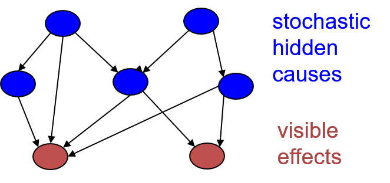

# Belief/Bayesian Networks

## Overview

+ [Incorporating probability into AI](../ML/MLNN-Hinton/13-BeliefNets.md#132-belief-networks)
  + combination of graph theory and probability theory
  + AI works in the 1980's
    + using bags of rules for tasks such as medical diagnosis and exploration for minerals
    + dealing w/ uncertainty for practical problems
    + made up ways of doing uncertainty that did not involve probabilities $\to$ bad bet
  + Graphical models
    + Pearl, Heckeman, Lauritzen, and others shown that probabilities worked better than the ad-hoc methods of expert systems
    + discrete graph good for representing what depended on what other variables
    + computing for nodes of the graph, given the states of other nodes
  + Belief nets:
    + a particular subset of graph
    + sparsely connected, directly acyclic graphs
    + clever inference algorithms to compute the probabilities of unobserved node efficiently for sparsely connected graph
    + working exponentially in the number of nodes that influence each node $\implies$ not for densely connected networks

+ [Belief Networks](../ML/MLNN-Hinton/13-BeliefNets.md#132-belief-networks)
  + a directed acyclic graph composed of stochastic variables (see diagram)
  + observe some of the variables
  + Problems to solve:
    + __the inference problem__: infer the states of the unobserved variables
    + __the learning problem__: adjust the interactions btw variables to make the network more likely to generate the training data

  

    
  

+ [Graphical models vs. Neural networks](../ML/MLNN-Hinton/13-BeliefNets.md#132-belief-networks)
  + early graphical models
    + using experts to define the graph structure and the conditional probabilities; example: medical experts
    + sparsely connected
    + initially focused on doing correct inference, not on learning
  + Neural networks
    + main task: learning
    + hand-wiring knowledge $\to$ not cool: wiring in some basic properties as in convolutional nets was a very sensible thing to do
    + knowledge from learning the training data not from experts
    + not aiming for interpretability or sparse connectivity

+ [Types of generative neural network composed of stochastic binary neurons](../ML/MLNN-Hinton/13-BeliefNets.md#132-belief-networks)
  + Energy-based models
    + connected binary stochastic neurons using symmetric connections to get a Boltzmann Machine
    + ways to learn a Boltzmann machine but difficult $\implies$ restrict the connectivity in a special way (RBM)
  + Causal models
    + connecting binary stochastic neurons in a directed acyclic graph
    + Sigmoid Belief Networks (Neal 1992) $\to$ easier to learn than BM
    + causal sequence from layer to layer to get unbiased sample of the kinds of vectors of visible values that the NN believes in
  + causal model easier to generate data than Boltzmann machine

