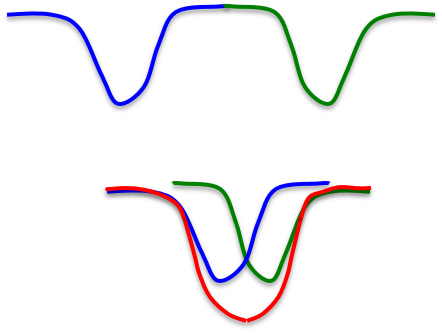
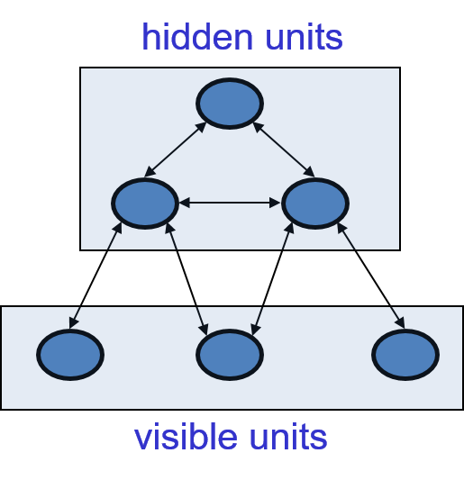
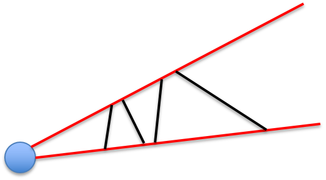
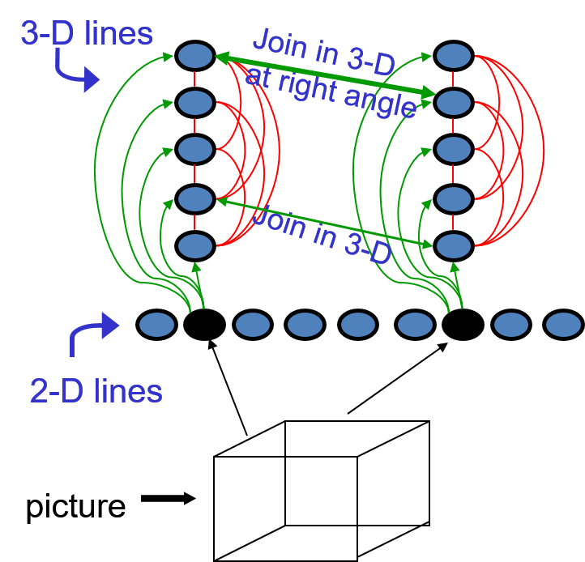
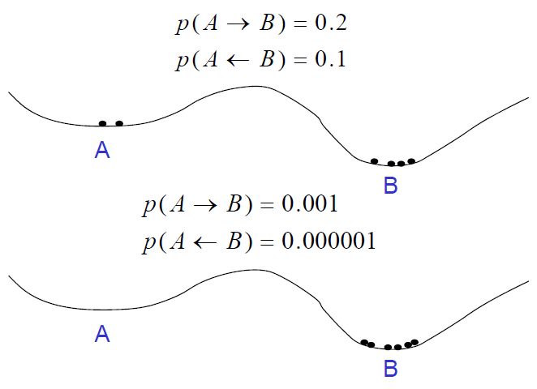
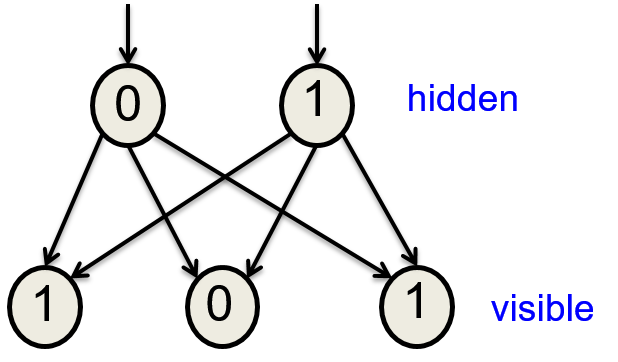

# Hopfield Networks & Boltzmann Machine

## Hopfield Networks

### Overview for Hopfield Networks

+ [Hopfield Networks](../ML/MLNN-Hinton/11-Hopfield.md#111-hopfield-nets)
  + energy-based model: properties derive from a global energy function
  + combposed of binary threshold units w/ recurrent connections between them
  + recurrent network of non-linear units
    + generally very hard to analyze
    + behave in many different ways
      + settle to a stable state
      + oscillate
      + follow chaotic trajectories that cannot be predicted far into the future unless knowing the starting state w/ infinite precision
  + John Hopfield's proposal
    + existing a global energy function w/ __symmetric__ connections
    + each binary "configuration" of the whole network w/ an energy
    + binary threshold decision rule causing the network to settle to a minimum of the energy function

+ [Hopfield combines two ideas](../ML/MLNN-Hinton/11-Hopfield.md#113-hopfields-nets-with-hidden-units)
  + find local energy minimum by using as network of symmetrically connected binary threshold units
  + local energy minimum might correspond to memories

### Energy Function

+ [The energy function](../ML/MLNN-Hinton/11-Hopfield.md#111-hopfield-nets)
  + global energy: the sum of many local contributions
  + the main contributions: the form of the product of one connection weight w/ the binary of two neurons

    \[ E = - \sum_i s_i \cdot b_i - \sum_{i < j} s_i s_j \cdot w_{ij} \]

    + energy is bad $\implies$ low energy is good $\implies$ minus sign (-) for the equation
    + $s_i$: binary variable w/ values of $1$ or $0$ or in another kind of Hopfield net w/ values of $1$ or $-1$
    + $w_{ij}$: weight for the symmetric connection strength btw two neurons
    + $s_i b_i$: bias term involves the state of individual units
    + $s_i s_j$: the activities of the two connected neurons

  + simple _quadratic_ energy function makes it possible for each unit to compute locally how it's state affects the global energy:

    \[ \text{Energy gap} = \Delta E_i = E(s_i = 0) - E(s_i = 1) = b_i + \sum_j s_j \cdot w_{ij} \]

+ [Settling to an energy minimum](../ML/MLNN-Hinton/11-Hopfield.md#111-hopfield-nets)
  + finding the minimum energy
    + start from a random state
    + sequential update: update units _one at a time_ in random order
  + commputing the goodness
    + all pairs of units w/ on and add in the weight between them
    + minimum energy

### Memories

+ [Sequential decisions](../ML/MLNN-Hinton/11-Hopfield.md#111-hopfield-nets)
  + if units make __simultaneous__ decisions the energy could go up
  + simultaneous parallel updating $\implies$ getting oscillations (always w/ period 2)
  + the updates occur in parallel but w/ random timing $\implies$ the oscillations usually destroyed

+ [Neat way to compute sequential decisions](../ML/MLNN-Hinton/11-Hopfield.md#111-hopfield-nets)
  + Hopfield proposal
    + memories could be energy minima of a neural net w/ symmetric weights
    + binary threshold decision rule used to "clean up" incomplete or corrupted memories
  + Principles of Literary Criticism
    + idea of memories as energy minima
    + memories are like a large crystal that can sit on different phases
  + energy minima
    + represent memories w/ a content-addressable memory
    + access an item by just knowing part of its content
    + biological property: robust against hardware damage
    + psychological point of view: like reconstructing a dinosaur from a few bones

+ [Storing memories in a Hopefield net](../ML/MLNN-Hinton/11-Hopfield.md#111-hopfield-nets)
  + with activities of $1$ and $-1$
    + stored as a binary state vector by incrementing the weight btw any two units by the product of their activities
    + treating biases as weights from a permanently on unit
    + very simple rule: not error-driven
    + both its strength and weakness
      + not error correction rule
      + able to be online but not a very efficient way to store things

    \[ \Delta w_{ij} = s_i \cdot s_j \]

  + with state of $0$ and $1$, the rule is slightly more complicated

    \[ \Delta w_{ij} = 4 (s_i - \frac{1}{2}) (s_j - \frac{1}{2}) \]

### Spurious Minima & Capacity

+ [Storage capacity](../ML/MLNN-Hinton/11-Hopfield.md#112-dealing-with-spurious-minima-in-hopfield-nets)
  + Hopfield nets w/ memory storage devices
  + obsessed by the storage capacity of the Hopfield net
  + the capacity of a totally connected net w/ $N$ units by Hopfield storage rule
    + only about $0.15N$ memories
    + only $0.15N^2$ bits at $N$ bits per memory
    + not making efficient use of the bits required to store the weights
  + the net w/ $N^2$ weights and biases
  + after storing $M$ memories, the integer value range of each connection weight is $[-M, M]$
  + number of bits to store the weights and biases:

    \[ N^2 \log(2M+1) \]

+ [Spurious minima limit capacity](../ML/MLNN-Hinton/11-Hopfield.md#112-dealing-with-spurious-minima-in-hopfield-nets)
  + create a new energy minimum for each configuration memorizing (top fig)
  + limitation of the capacity of Hopfield net (bottom fig)
    + two nearby patterns $\implies$ unable to separate two minimum
    + unable to distinguish these two separate memories

    

      
    

+ [Avoiding spurious minima](../ML/MLNN-Hinton/11-Hopfield.md#112-dealing-with-spurious-minima-in-hopfield-nets)
  + unlearing
    + strategy
      + let the net settle from a random initial state and then do __unlearning__
      + whatever binary state it settles, apply the opposite of the storage rule
      + get rid of deep, spurious minima and increase memory capacity
    + shown that the strategy works but no good analysis to explain
  + analogy w/ Reverse Learning
    + proposed by F. Crick and G. Mitchison
    + a model of what dreams are for
    + that's what why you don't remember them
  + how much unlearning should apply?
    + unlearning as part of the process of fitting a model to data
    + apply maximum likelihood fitting of the model
    + unlearning automatically come out of fitting the model
  + derive unlearning as the right way to minimize some cost function

+ [Increasing the cpacity](../ML/MLNN-Hinton/11-Hopfield.md#112-dealing-with-spurious-minima-in-hopfield-nets)
  + physics:
    + the math already known might explain how the brain works
    + many papers published in physics journals
    + related to Hopfield nets and their storage capacity
  + Elizabeth Gardiner proposal
    + using the full capacity of the weights
    + a much better storage rule
  + updating the memories
    + cycle through the training set many times than storing vectors in on shot
    + using the perceptron convergence procedure
  + statistics: pseudo-likelihood
    + get one thing right given all the other things
    + w/ high dimensional data, trying to get the value on 1-dim right given the values on all the other dimensions
    + main difference btw perceptron convergence procedure
  + the way to use the full capacity of Hopfield net
    + to use the perceptron convergence procedure
    + go through the data several times

### Issues with Hidden Units

+ [Introduction](../ML/MLNN-Hinton/11-Hopfield.md#113-hopfields-nets-with-hidden-units)
  + the weights btw units represent constraints on good interpretations
  + finding a low energy state $\to$ finding a good interpretation of the input data

+ [Different computational role](../ML/MLNN-Hinton/11-Hopfield.md#113-hopfields-nets-with-hidden-units)
  + using Hopfield net to construct interpretations of sensory input instead of using net to store memories
  + Notations:
    + input: visible units
    + interpretation: the states of the hidden units
    + badness of the interpretation: the energy
  + construct an interpretation of input in the set of hidden units
  + the interpretation or explanation of the input as a binary configuration over the hidden units
  + the energy of the whole system represents the badness of that interpretation
  + to get good interpretations according to current model is the energy function
  + to find the low energy states of the hidden units given by the input represented by the visible units

  

    
  

+ [Infer about 3-D edges from 2-D lines](../ML/MLNN-Hinton/11-Hopfield.md#113-hopfields-nets-with-hidden-units)
  + 2-D line in an image might be caused by many different 3-D edges
  + a straight 3-D edge
  + pictorial explanation of 2-D and 3-D mapping (left diagram)
  + find low energy states of a network binary unit to find interpretations of sensory input
  + example: Interpreting a line drawing to 3-D image (right diagram)
    + 2-D line: using one "2-D line" for each possible line in the picture
    + 3-D line: using one "3-D line" for each for each possible 3-D line in the scene
    + make 3-D lines support each other if they join in 3-D: join the two 3-D edge units w/ same or different depth
    + make 3-D lines __strongly support__ each other if they join at right angles
      + thicker green line: join two 3-D edge unit w/ same depth and right angle

  

    
  

+ [Two difficult computational issues](../ML/MLNN-Hinton/11-Hopfield.md#113-hopfields-nets-with-hidden-units)
  + using the states of the hidden units to represent an interpretation of input raises two difficult issues
  + Search: how do we avoid getting trapped in poor local minima of the energy function?
  + Learning: how do we learn the weights on the connections to the hidden units and btw the hidden units?

### Searching w/ Noise

+ [Noisy networks](../ML/MLNN-Hinton/11-Hopfield.md#114-using-stochastic-units-to-improve-search)
  + Hopfield always making decisions to reduce the energy $\implies$ impossible to escape from local minima
  + using random noise to escape from poor minima
    + start w/ a lot of noise to cross energy barriers
    + simulated annealing: slowly reduce the noise so that the systems ends up in a deep minimum

+ [Temperature in physical system](../ML/MLNN-Hinton/11-Hopfield.md#114-using-stochastic-units-to-improve-search)
  + energy function in simulated system
  + high temperature transition probabilities (top diagram)
  + low temperature transition probabilities (bottom diagram)
  + better solution: start w/ high temperature and then gradually reduce the temperature

  

    
  

+ [Stochastic binary units](../ML/MLNN-Hinton/11-Hopfield.md#114-using-stochastic-units-to-improve-search)
  + biased random decisions w/ binary stochastic units
    + temperature controls the amount of noise
    + raising the noise level equivalent to decreasing all the energy gaps btw configuration
  + normal logistic equation

    \[ p(s_i = 1) = \frac{1}{1 + \exp(-\Delta E_i / T)} \]

    + $T$: temperature
    + energy gap scaled by a temperature
    + $T \to \infty, \exp(-\Delta E_i / T) \approx 0 \to p(s_i=1) = 1/(1+1) \implies$ knees on and off states
    + $T \to 0, \exp(-\Delta E_i/T) \approx -\infty \text{ or } \infty \text{ (depending on value of } \Delta E_i) \to p(s_i =1) = 0 \text{ or } 1 \implies$ firmly off or on $\implies$ behave deterministically and a binary threshold unit
  + energy gap

    \[ \text{Energy gap} = \Delta E_i = E(s_i = 0) - E(s_i = 1) = b_i + \sum_j s_j \cdot w_{ij} \]

### Simulated Annealing

+ [Simulated annealing](../ML/MLNN-Hinton/11-Hopfield.md#114-using-stochastic-units-to-improve-search)
  + a powerful method for improving searches that get stuck in local optima
  + one of the idea leading to Boltzmann machines
  + a big distraction from the main ideas behind Boltzmann machines
  + using binary stochastic units having a temperature of 1 for standard logistic function in the energy gap

+ [Thermal equilibrium](../ML/MLNN-Hinton/11-Hopfield.md#114-using-stochastic-units-to-improve-search)
  setting temperature as 1 $\implies$ fixed temperature
  + a difficult concept
    + reaching thermal equilibrium not meant that the system has settled down into the lowest energy configuration
    + state units still rattling around at thermal equilibrium unless the temperature  is zero
    + settle down means the probability distribution over configurations
    + settle to the stationary distribution determined by the energy function of the system
    + stationary distribution: the probability of any configuration proportional to $\exp(-E)$
  + intuitive view
    + imagine a huge ensemble of systems w/ exactly same energy function
    + the probability of a configuration: just the fraction of the systems w/ that configuration

+ [Approaching thermal equilibrium](../ML/MLNN-Hinton/11-Hopfield.md#114-using-stochastic-units-to-improve-search)
  + start w/ any distribution for all the identical systems
  + then keep applying stochastic update rule to pick the next configuration for each individual system
  + running the systems stochastically in the right way
  + eventually reach a situation where the fraction of systems in each configuration remains constant
    + thermal equilibrium: the stationary distribution in physics
    + any given system keeps changing its configuration

## Boltzmann Machines

### Overview of Boltzmann Machine

+ [Boltzmann machine](../ML/MLNN-Hinton/11-Hopfield.md#115-how-a-boltzmann-machine-models-data)
  + a stochastic Hopfield networks w/ hidden units
  + good at modeling binary data

+ [Modeling binary data]/ML/MLNN-Hinton/11-Hopfield.md#115-how-a-boltzmann-machine-models-data
  + building a model: given a training set of binary vectors
  + useful for deciding if other binary vectors come from the same distribution
  + used for monitoring complex systems to detect unusual behavior
  + models of several different distributions $\implies$ used to computer the posterior probability that a paticular distribution produced the observed data by using Bayes theorem

    \[ p(Model \; i | data) = \frac{p(data | Model \; i)}{\displaystyle \sum_j p(data | Model \; j)} \]

### Causal Generative Model

+ [Causal generative model](../ML/MLNN-Hinton/11-Hopfield.md#115-how-a-boltzmann-machine-models-data)
  + generate the states of some latent variables
  + using latent variables to generate binary vector
  + procedures
    + pick the hidden states from their prior distribution (hidden layer)
    + pick the visible states from their conditional distribution given by the hidden states (visible layer)
  + probability of generating a visible vector, $\mathbf{v}$
    + the probability of generating that hidden state times the probability of generating $\mathbf{v}$ given that already generated that hidden state
    + a causal model factor analysis; e.g., a causal model using continuous variables
    + probably the most natural way to generate data
    + generative model: a causal model alike
    + each hidden state is an "explanation" of $\mathbf{v}$

    \[ p(\mathbf{v}) = \sum_{\mathbf{h}} p(\mathbf{h}) p(\mathbf{v}|\mathbf{h}) \]

  

    
  

### Modeling for Boltzmann Machine

+ [Generating data in Boltzmann machine](../ML/MLNN-Hinton/11-Hopfield.md#115-how-a-boltzmann-machine-models-data)
  + not a causal generative model but an energy based model
  + everything defined in terms of the energies of joint configurations of the visible and hidden units
  + energies of join configuration related to their probabilities in two ways
    + simply define the probability to be $p(\mathbf{v}, \mathbf{h}) \propto \exp(-E(\mathbf{v}, \mathbf{h}))$
    + define the probability to be the probability of finding the network in that joint configuration after updating all of the stochastic binary units many times
    + two definitions agree
  + The energy of a joint configuration

    \[ -E(\mathbf{v}, \mathbf{h}) = \underbrace{\sum_{i \in vis} v_i b_i + \sum_{k \in hid} h_k b_k}_{\text{bias terms}} + \sum_{i < k} v_i v_j \cdot w_{ij} + \sum_{i, k} v_i h_k \cdot w_{ik} + \sum_{k < l} h_k h_l \cdot w_{kl} \]

    + $E(\mathbf{v}, \mathbf{h})$: energy w/ configuration $\mathbf{v}$ on the visible units and $\mathbf{h}$ on the hidden units
    + $v_i$: binary state of unit $i$ in $\mathbf{v}$
    + $b_k$: bias of unit $k$
    + $w_{ik}$: weight between visible unit $i$ and hidden unit $k$
    + $i < k$: indexes every non-identical pair of $i$ and $j$ once

+ [Using energies to define probabilities](../ML/MLNN-Hinton/11-Hopfield.md#115-how-a-boltzmann-machine-models-data)
  + the probability of a joint configuration over both visible and hidden units
    + the energy of that joint configuration compared w/ the energy of all other joint configurations

    \[ p(\mathbf{v}, \mathbf{h}) = \frac{e^{-E(\mathbf{v}, \mathbf{h})}}{\displaystyle \sum_{\mathbf{u}, \mathbf{g}} e^{-E(\mathbf{u}, \mathbf{g})}} \]

    + $\sum_{\mathbf{u}, \mathbf{g}} e^{-E(\mathbf{u}, \mathbf{g})}$: normalized term or partition function in physics
  + the probability of a configuration of the visible units

    \[ p(\mathbf{v}) = \frac{\sum_{\mathbf{h}} e^{-E(\mathbf{v}, \mathbf{h})}}{\sum_{\mathbf{u}, \mathbf{g}} e^{-E(\mathbf{u}, \mathbf{g})}} \]

+ [Getting a sample from the model](../ML/MLNN-Hinton/11-Hopfield.md#115-how-a-boltzmann-machine-models-data)
  + the normalizing term (the partition function): growing exponentially as hidden units increase
  + Markov Chain Monte Carlo (MCMC)
    + get samples from the model starting from a random global configuration
    + keep picking units randomly and allowing them to stochastically update their states based on their energy gaps
    + energy gaps deptermined by the states of all the other units in the network
  + run the Markov chain
    + reaching the stationary distribution (thermal equilibrium at a temperature of 1)
    + the probability of a global configuration related to its energy by the Boltzmann distribution

    \[ p(\mathbf{v}, \mathbf{h}) \propto e^{-E(\mathbf{v}, \mathbf{h})} \]

+ [Sample from the posterior distribution](../ML/MLNN-Hinton/11-Hopfield.md#115-how-a-boltzmann-machine-models-data)
  + get sample from the posterior distribution over hidden configurations for a given data vector
  + the number of possible hidden configurations is exponential
  + purpose:
    + getting samples from the posterior given a data vector required for learning the weights
    + knowing a good explanation for the observed data
    + better explanations having lower energy

