# Neural Networks

## Fundamentals

### Motivations

+ [Machine learning problems](../ML/MLNN-Hinton/a01-IntroNN.md#the-motivation-for-neural-networks)
  + regressions (and Ridge, LASSO, etc.)
  + classification problem
  + binary classification problem

### Anatomy

+ [Neural networks:](../ML/MLNN-Hinton/a02-IntermediateNN.md#anatomy-of-a-neural-network)
  + excellent tools for finding patterns
  + backpropagation
  + make use of affine __transformations__ to concatenate input features
  + concatenated input passed through an activation function
  + Neural network
    + an abstract representation of the data at each stage of the network
    + designed to detect specific features of the network

+ [Activation function](../ML/MLNN-Hinton/a02-IntermediateNN.md#anatomy-of-a-neural-network)
  + evaluate the signal response and determine whether the neuron should be activated given the current inputs
  + extended to multilayer and multi feature networks
    + the number of degrees of freedom (weights and biases) of the network
    + the number of features available which the network can use to make predictions

  

    
  

+ [Network parameters (weights and biases)](../ML/MLNN-Hinton/a02-IntermediateNN.md#anatomy-of-a-neural-network)
  + updated by assigning the error of the network
  + using backpropagation through the network to obtain the derivatives for each of the parameters w.r.t. the loss function
  + gradient descent used to update these parameters

+ [Training network](../ML/MLNN-Hinton/a02-IntermediateNN.md#anatomy-of-a-neural-network)
  + the process of accessing the error and updating the parameters
  + a training set to generate a functional network
  + performance of the network
  + test set: unseen data accessed by testing

+ [Degrees of freedom](../ML/MLNN-Hinton/a02-IntermediateNN.md#anatomy-of-a-neural-network)
  + neural network having a large number of degrees
  + required a large amount of data for training to be able to make adequate predictions
  + useful for high dimensionality of the data

+ [Generalized multilayer and multi-feature network](../ML/MLNN-Hinton/a02-IntermediateNN.md#anatomy-of-a-neural-)

  

    
  

  + $m$ nodes: the width of a layer within the network
  + $n$ hidden layers: the depth of the network
  + $d$ inputs: pre-specified by the available data
    + normal Pandas data frame: equal to the number of feature columns
  + the hidden layers of the network have the same width (number of nodes)
  + the number of nodes may vary across the hidden layers
  + the output layer may also be of an arbitrary dimension depending on the required output

+ [Convolutional neural networks](../ML/MLNN-Hinton/a02-IntermediateNN.md#anatomy-of-a-neural-network)
  + commonly used to study images
  + hidden layers closer to the output of a deep network, the highly interpretable representations, such as faces, clothing, etc.
  + the first layers of the network: detecting very basic features such as corners, curves, and so on
  + abstract representations quickly become too complex to comprehend
  + the workings of neural networks to produce highly complex abstractions seen as somewhat magical

  

    
  

### Concepts and Neural Networks

+ [Concepts in cognition science](../ML/MLNN-Hinton/04-Multiclasses.md#a-brief-diversion-into-cognitive-science)
  + The feature theory: a concept is a set of semantic features
  + The structuralist theory: the meaning of a concept lies in its relationships to other concepts
  + Minsky (1970s): in favor of relational graph representations with structuralist theory
  + Hinton - both applicable
    + able to use vectors of semantic features to implement a relational graph
    + no intervening conscious steps but many computation in interactions of neurons
    + explicit rules for conscious, deliberate, reasoning
    + commonsense, analogical reasoning: seeing the answer w/o conscious intervening steps

+ [Localist and distributed representations of concepts](../ML/MLNN-Hinton/04-Multiclasses.md#a-brief-diversion-into-cognitive-science)
  + Localist representation
    + implementation of relational graph in a neural net
    + neuron = node in the graph
    + connection = a binary relationship
    + "localist" method not working: many different types of relationship and the connections in neural nets w/o discrete labels
  + Distributed representations
    + open issue: how to implement relational knowledge in a neural net
    + many-to-many mapping btw concepts and neurons

+ [Neural Network Algorithm](../ML/MLNN-Hinton/a01-IntroNN.md#the-motivation-for-neural-networks)

  

    
  

  + weights in neural networks: these regression parameters of our various incoming functions
  + passed to an activation function which decides whether the result is significant enough to 'fire' the node
  + start with some arbitrary formulation of values in order for us to start updating and optimizing the parameters
  + assessing the loss function after each update and performing gradient descent

+ [Ways to minimize the loss function](../ML/MLNN-Hinton/a01-IntroNN.md#the-motivation-for-neural-networks)
  + Descent
    + The value of $w$ to minimize $\mathcal{L}(w)$
    + to find the optimal point of a function$\mathcal{L}(w)$: $\frac{d \mathcal{L}(W)}{dW} = 0$
    + find the $w$ that satisfies the equation
  + more flexible method
    + start from any point and then determine which direction to go to reduce the loss (left or right in this case)
    + calculate the slope of the function at this point
    + then shift to the right if the slope is negative or shift to the left if the slope is positive

  

    
  

### Types of Learning

+ [Problem Modeling](../ML/MLNN-Hinton/01-IntroML.md#three-types-of-learning)
  + Supervised learning: Regression & Classification
  + Reinforcement learning
  + Unsupervised learning

+ [Typical Supervised learning procedure](../ML/MLNN-Hinton/01-IntroML.md#three-types-of-learning)
  1. Choosing a model class: $y = f(\mathbf{x}; \mathbf{W})$
    + $\mathbf{x}$: input vector
    + $\mathbf{W}$: weight vector
    + $f$: activation function to transform input $\mathbf{x}$ with weight vector $\mathbf{W}$ to the output $y$
  2. Learning by adjust $\mathbf{W}$ with cost function
    + reduce the difference between target value $t$ and actual output $y$
    + Regression measurement: usually $\frac{1}{2} (t - y)^2$
    + Classification measurement: other sensible measures

+ [Reinforcement learning](../ML/MLNN-Hinton/01-IntroML.md#three-types-of-learning)
  + Output: an action or sequence of actions
  + The only supervisory signal: an occasional scalar reward
  + Decision of action(s) selected: maximize the expected sum of the future reward
  + typically delayed reward makes model hard

+ [Unsupervised learning](../ML/MLNN-Hinton/01-IntroML.md#three-types-of-learning)
  + no clear goal
  + typically find sensible clusters

### Learning Methodologies

+ [Learning by perturbing weights](../ML/MLNN-Hinton/03-Backpropagation.md#the-backpropagation-algorithm)
  + randomly perturb one weight and see if it improves performance: very inefficient
  + Alternative: randomly perturb all the weights in parallel and correlate the performance gain with the weight changes
  + Better: randomly perturb the activities of the hidden units

+ [Randomly perturb the activities of the hidden units](../ML/MLNN-Hinton/03-Backpropagation.md#the-backpropagation-algorithm)
  + adding a layer of hand-coded features
    + more powerful but hard to design the features
    + finding good features w/o requiring insights into the task or repeated trial and error
    + guess features and see how well they work
  + automate the loop of designing features for a particular task and seeing ho well they work

### Considerations of Learning Procedures

+ [Main decisions about how to use error derivatives](../ML/MLNN-Hinton/03-Backpropagation.md#how-to-use-the-derivatives-computed-by-the-backpropagation-algorithm)
  + Optimization issue: how to discover a good set of weights with the error derivatives on individual cases?
  + Generalization issue: how to ensure non-seen cases during training work well with trained weights?

+ [Optimization Concerns](../ML/MLNN-Hinton/03-Backpropagation.md#how-to-use-the-derivatives-computed-by-the-backpropagation-algorithm)
  + How often to update the weights
    + Online
    + Full batch
    + Mini-batch
  + How much to update the weights
    + fixed learning rate
    + adaptive learning rate globally
    + adaptive learning rate on each connection separately

+ [Generalization Concern - Overfitting](../ML/MLNN-Hinton/03-Backpropagation.md#how-to-use-the-derivatives-computed-by-the-backpropagation-algorithm)
  + Unable to identify which regularities causing errors
  + Possible solutions:
    + Weight-decay
    + Weight-sharing
    + Early stopping
    + Model averaging
    + Bayesian fitting on neural nets
    + Dropout
    + Generative pre-training

### Gradient Descent

+ [Gradeint descent/Delta rule](../ML/MLNN-Hinton/a01-IntroNN.md#gradient-descent)
  + an iterative method for finding the minimum of a function
  + Making a step means: $w^{new} = w^{old} + \text{step}$
  + Opposite direction of the derivative means: $w^{new} = w^{old} - \lambda \frac{d\mathcal{L}}{dw}$
  + change to move conventional notation: $w^{(i+1)} = w^{(i)} - \lambda \frac{d\mathcal{L}}{dw}$
  + learning rate ($\lambda$):
    + large learning rate:
      + put more weight on the derivative
      + made larger step for each iteration of the algorithm
    + smaller learning rate
      + less weight is put on the derivative
      + smaller steps made for each iteration

  

    
  

+ [Considerations for gradient descent](../ML/MLNN-Hinton/a01-IntroNN.md#gradient-descent)
  + derive the derivatives
  + know what the learning rate is or how to set it
  + avoid local minima
  + the full loss function includes summing up all individual 'errors'

  

    
  

+ [Batch and stochastic gradient descent](../ML/MLNN-Hinton/a01-IntroNN.md#gradient-descent)
  + use a batch (a subset) of data as opposed to the whole set of data, such that the loss surface is partially morphed during each iteration
  + the loss (likelihood) function used to derive the derivatives for iteration $k$

    \[\mathcal{L}^k = - \sum_{i \in b^k} \left[ y_i \log(p_i) + (1 - p_i)\log(1 - p_i) \right]\]

### Delta Rule

+ [Delta rule for perceptrons](../ML/MLNN-Hinton/a06-DeltaRule.md#delta-rule)
  + Gradient descent learning requires that any change in a particular weight be proportional to the negative of the derivative of the error
  + The change in a given weight must be proportional to the negative of the prior equation

    \[\Delta w_{ij_x} = - \varepsilon \frac{\partial E}{\partial w_{ij}} = \varepsilon \partial a_{i_x}\]

  + $\Delta$: the difference btw the target and actual activation of the relevant output node
  + $\varepsilon$: learning rate

+ [Linear Activation function instead of a Threshold Activation function](../ML/MLNN-Hinton/a06-DeltaRule.md#delta-rule)
  + Threshold Activation function:
    + characterize both the McColloch and Pitts network and the perceptron is not differentiable at the transition between the activations of $0$ and $1$ (slope = $\infty$) 
    + derivative = 0 over the remainder of the function
  + Linear Activation function or other differentiable functions
    + allow the derivative of the error to be calculable

+ [Kronecker Delta](../ML/MLNN-Hinton/a07-DeltaFunc.md#kronecker-delta)
  + Definition

    \[\delta_{ij} = \begin{cases} 1 & i = j \\ 0 & i \neq j \end{cases} \]

  + __property__. Simplify

    \[\sum_k \delta_{ik}\delta{kj} = \delta_{ij}\]

+ [Dirac Delta](../ML/MLNN-Hinton/a07-DeltaFunc.md#dirac-delta)
  + Definition

    \[\delta(x) = \begin{cases} \infty & x = 0 \\ 0 & \text{otherwise}\end{cases} \]

    The value at which the delta function become infinite can be controlled by substituting $x - x_0$ for $x$

    \[\delta(x - x_0) = \begin{cases} \infty & x=x_0 \\ 0 & \text{otherwise} \end{cases} \]

  + Alternative definition

    \[ \int_{-\infty}^{\infty} f(x) \delta(x - x_0) dx = f(x_0) \tag*{(7)}\]

    + continuous around $x=x_0$
    + most common way used for the dirac delta function
  + __Property__.

    \[\int_{-\infty}^{\infty} f(x) \delta(x - x_0)dx = f(x_0) \\ \delta(ax) = \frac{1}{|a|} \delta(x)\]

## Architectures

### Types of Architectures

+ [A mostly complete chart of Neural Networks](https://towardsdatascience.com/the-mostly-complete-chart-of-neural-networks-explained-3fb6f2367464)

  

    
  

  + Perceptron (P)
    + simplest and oldest model
    + takes some inputs, sums them up, applies activation function and pass them to output layer

  + Feed-forward neural networks
    + all nodes fully connected
    + activation flows from input layer to output, w/o back loops
    + one hidden layer between input and output layers
    + training using backpropagation method

  + Radical Basis Neural (RBF) Networks
    + FF (feed-forward) NNs
    + activation function: radial basis function
    + perfect for function approximation, and machine control

  + Deep Feed Forward (DFF) Neural Network
    + FF NN w/ more than one hidden layer
    + stacking errors with more layers resulted in exponential growth of training times
    + approaches developed in 00s allowed to train DFFs effectively

  + Recurrent Neural network (RNN)
    + a.k.a Jordan network
    + each of hidden cell received its own output with fixed delay
    + mainly used =when context is important

+ [Feed-forward neural Networks](../ML/MLNN-Hinton/02-Perceprtons.md#an-overview-of-the-main-types-of-network-architecture)
  + Input layer: the first layer
  + Output layer: the last layer
  + Hidden layer(s): layer(s) between the Input & Output layers
  + Deep Neural network: more than one hidden layer

+ [Recurrent neural network](../ML/MLNN-Hinton/02-Perceprtons.md#an-overview-of-the-main-types-of-network-architecture) (RNN)
  + the previous network state influencing the output
  + a function with inputs $x_t$ (input vector) and previous state $h_{t-1}$
  + complicated dynamics and difficult to train
  + a very natural way to model sequential data
  + able to remember information in their hidden state for a long time

  
  

+ [Symmetrically connected neural networks](../ML/MLNN-Hinton/02-Perceprtons.md#an-overview-of-the-main-types-of-network-architecture)
  + Hopfield neural networks
    + an example of recurrent network
    + output of neurons connected to input of every neuron by means of appropriate weights
    + much easier to analyze than recurrent networks
    + the same weight in both direction
  + Boltzman machines
    + symmetrically connected networks with hidden units
    + more powerful than Hopfield networks but less powerful than recurrent networks
    + fully connected within and between layers
    + the stochastic, generative counterpart of Hopfield networks
    + Restricted Boltzmann Machine (RBM): the lateral connections in the visible and hidden layers are removed

  
  

+ [Model the function $y = x \cdot sin(x)$ using a neural network (NN)](../ML/MLNN-Hinton/a02-IntermediateNN.md#architecture)
  + Assume NN using ReLU activation function (Fig.1)
  + NN with a two-node single hidden layer as one degree of freedom (Fig.2)
  + NN with a three-node single hidden layer as two degree of freedom (Fig.3)
  + NN with a multi-node hidden layer (Fig.4)
  + NN with 2 one-node hidden layers (Fig.5) approximates the function as a single hidden layer (Fig.1)
  + NN with 3 hidden layers and 3 nodes in each layer (Fig.7) gives a pretty good approximation

  

    
  

  

    
  

+ [Architectures for neural networks](../ML/MLNN-Hinton/a02-IntermediateNN.md#architecture)
  + tradeoff by selecting a network architecture 
    + large enough to approximate the function of interest
    + not too large taken an excessive amount of time to train
  + large network requiring large amounts of data to train

+ [Good practice](../ML/MLNN-Hinton/a02-IntermediateNN.md#architecture)
  + using multiple hidden layers as well as multiple nodes within the hidden layers
  + Goodfellow shown that
    + increasing the number of layers of neural networks tends to improve overall test set accuracy
    + large, shallow networks tend to overfit more

  

    
  

### Simple Neuron Model

+ A biological neuron with a basic mathematical mode

  

    
  

+ [Linear neuron](../ML/MLNN-Hinton/01-IntroML.md#some-simple-models-of-neurons)

  \[z = b + \sum_i w_i x_i\]

  + $y$: the output
  + $b$: the bias
  + $w_i$: the weight on the $i$-th input
  + $x_i$: the $i$-th input

+ [Typical Activation functions $f(\cdot)$](../ML/MLNN-Hinton/01-IntroML.md#some-simple-models-of-neurons)
  + Binary threshold

    \[z = b + \sum_i w_i x_i \implies y = \begin{cases} 1 & \text{if } z > 0 \\ 0 & \text{otherwise} \end{cases}\]

  + Rectified Linear Neurons

      \[z = b + \sum_i x_i w_i \implies y = \begin{cases} z & \text{if } z > 0 \\ 0 & \text{otherwise} \end{cases}\]

  + Sigmoid neurons

    \[z = b + \sum_i x_i w_i \implies y = \frac{1}{1 + e^{-z}}\]

  + Stochastic binary neurons

    \[z = b + \displaystyle \sum_i x_i w_i \implies p(s = 1) = \frac{1}{1 + e^{-z}}\]

  

    
    
  

### Perceptrons

+ [The standard Perceptron architectures](../ML/MLNN-Hinton/02-Perceprtons.md#perceptrons-the-first-generation-of-neural-networks)

  

    
    
    
  

+ Frank Rosenblatt (1960's)
  + a very powerful learning algorithm
  + clams on what they can learn to do

+ Minsky & Papert, "Perceptrons" (1969)
  + analyze what they could do and their limitations
  + people think the limitations applied to all neural network models

+ McCulloch-Pitts (1943): Binary threshold neurons

  \[z = b + \sum_i x_i w_i \implies y = \begin{cases}1 & \text{if } z > 0 \\ 0 & \text{otherwise}\end{cases}\]

+ [Structure of neurons & model](../ML/MLNN-Hinton/a01-IntroNN.md#artificial-neural-network-ann)

  

    
  

+ [Affine transformation](../ML/MLNN-Hinton/a01-IntroNN.md#artificial-neural-network-ann)
  + basically an addition (or subtraction) and/or multiplication
  + resembling a regression equation
  + becomes important with multiple nodes converging at a node in a multilayer perceptron
  + abstract the affine and activation blocks into a single block

  

    
  

  + the amalgamation of the outputs from upstream nodes and the summed output is then passed to an activation function, which assesses the probability to determine whether it’s the quantitative value (the probability) sufficient to make the neuron fire

+ [Perceptron convergence procedure:](../ML/MLNN-Hinton/02-Perceprtons.md#perceptrons-the-first-generation-of-neural-networks)
  + training binary output as classifier
  + bias
    + adding extra component with value 1 to each input vector
    + minus the threshold
  + using policy to ensure the correct cases should be picked
  + find a set of weights to pick all correct ones

+ [Weight space](../ML/MLNN-Hinton/02-Perceprtons.md#a-geometrical-view-of-perceptrons)
  + 1-dim per weight
  + point: a particular setting of all the weights
  + a training case as a hyperplane though the origin
  + cone of feasible solutions
    + find a point on the right side of all planes
    + any weight vectors for all training cases correct

  

    <a href="http://www.cs.toronto.edu/~hinton/coursera/lecture2/lec2.pptx" ismap target="_blank">
      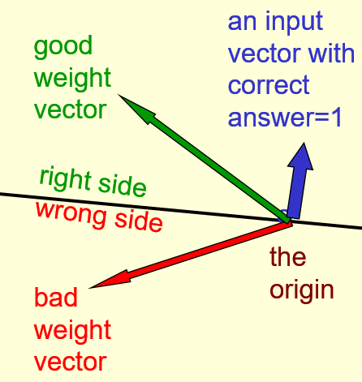
      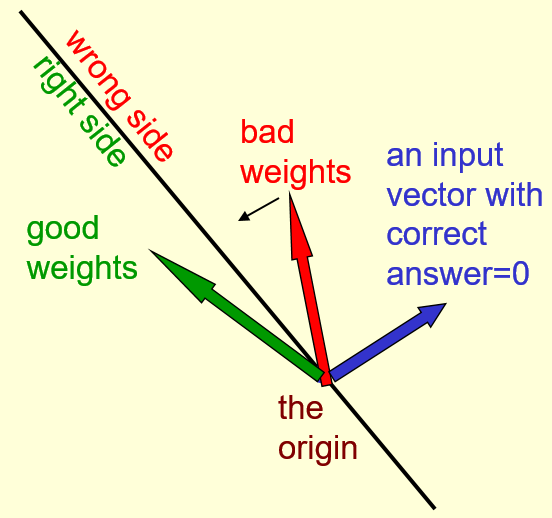
    </a>  $\implies$
    <a href="http://www.cs.toronto.edu/~hinton/coursera/lecture2/lec2.pptx" ismap target="_blank">
      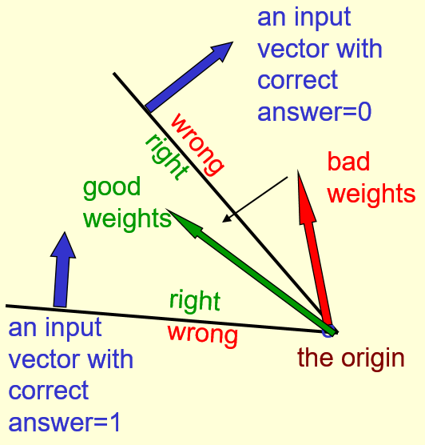
    </a>
  

+ [Learning procedure](../ML/MLNN-Hinton/02-Perceprtons.md#why-the-learning-works)
  + using margin instead of squared distance
  + provide a feasible region by a margin at least as large as the length of the input vector

  

    <a href="url" ismap target="_blank">
      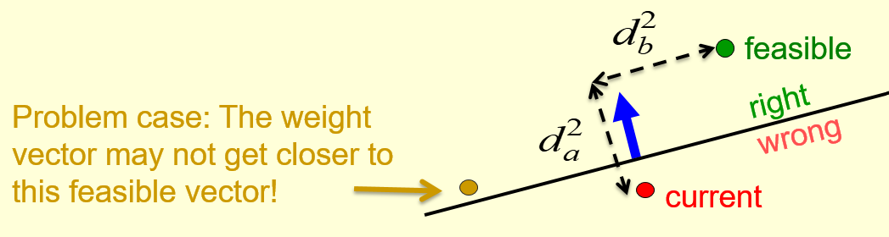
      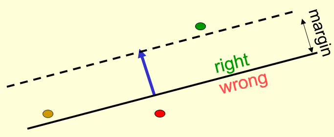
    </a>
  

+ [Limitations of Perceptrons](../ML/MLNN-Hinton/02-Perceprtons.md#what-perceptrons-can-not-do)
  + hard-coded features restrict what a perceptron do
    + Solution: adding extra feature(s) to separate
  + Minsky & Papert, "Group Invariance Theorem": unable to discriminating simple patterns under translation w/ wrap-around
    + Solution: adding multiple layers of adaptive, non-linear hidden units

  

    <a href="https://www.youtube.com/watch?v=mI6jTc-8sUY&list=PLoRl3Ht4JOcdU872GhiYWf6jwrk_SNhz9&index=11&t=0s" ismap target="_blank">
      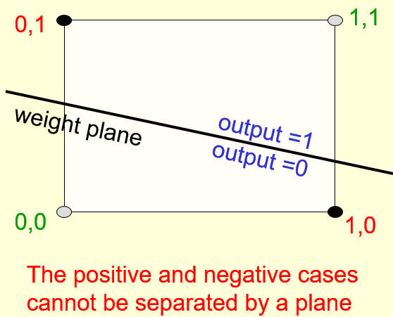
      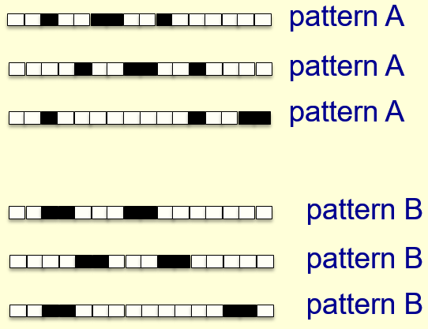
    </a>
  

## Activation Functions

### Overview of Activation Functions

+ [Activation functions](../ML/MLNN-Hinton/a02-IntermediateNN.md#activation-functions)
  + analogous to the build-up of electrical potential in biological neurons
  + activation potential: mimicked in artificial neural networks using a probability
  + Characteristics:
    + non-linearity: ensures not linearity
    + differentiable: ensure gradients remain large through the hidden unit
  + The general form of an activation function

    \[h = f(W^T X + b)\]

    + $h$: the neural output
    + $f(.)$: the activation function acting on the weights and bases

+ [Non-linearity](../ML/MLNN-Hinton/a02-IntermediateNN.md#activation-functions)
  + linear function
    + a polynomial of one degree
    + linear equation easy to solve
    + limited in complexity and less power to learn complex functional mappings from data
  + Neural network w/o activation function
    + a linear regression model
    + limited in the set of functions able to approximate
  + Universal approximation theorem: generalized non-linear function approximations
  + non-linear activation able to generate non-linear mappings from inputs to outputs

+ [nonlinear layer (or activation layer)](../ML/MLNN-Hinton/a10-CNNsGuide.md#relu-rectified-linear-units-layers)
  + introduce nonlinearity to system that basically has been computing linear operations during the convolutional layer
  + linear operation: element wise multiplications and summations
  + nonlinearity: tanh, sigmoid, and ReLU
  + increasing the nonlinearity properties of the model and the overall network without affecting the receptive fields of the convolutional layer

+ [Differentiable](../ML/MLNN-Hinton/a02-IntermediateNN.md#activation-functions)
  + required to perform backpropagation in the network
  + required to compute gradients of errors (loss) w.r.t. to the weights updated using gradient descent
  + linear activation function
    + an easily differentiable function
    + optimized using convex optimization
    + limited model capacity

+ [Vanishing gradient problem](../ML/MLNN-Hinton/a02-IntermediateNN.md#activation-functions)
  + small gradients and several hidden layers results in multiplied gradient during backpropagation
  + computer limitation on precision when multiply many small numbers
  + the value of the gradient quickly vanished
  + important challenge generated in deep neural networks

+ [Common choices of activation function](../ML/MLNN-Hinton/a02-IntermediateNN.md#activation-functions)

  

    
  

### Sigmoid and Softmax Functions

+ Logistic regression as a special case of Softmax regression with 2 classes

+ [Softmax classifier](../ML/MLNN-Hinton/a09-SoftmaxClass.md#possible-confusion-naming-conventions)
  + using the cross-entropy loss
  + using softmax function: used to squash the raw class scores into normalized positive values that sum to one

+ [Sigmoid and softmax functions](../ML/MLNN-Hinton/a02-IntermediateNN.md#activation-functions)

  \[\phi(z) = \frac{1}{1 + e^{-z}}\]

  + used as output functions for binary classification
  + generally not used within hidden layers
  + softmax function
    + multidimensional version of the sigmoid
    + used for multiclass classification
  + issue: zero centeredness

+ [Softmax regression](../ML/MLNN-Hinton/a08-SoftmaxReg.md#introduction)
  + a generalized form of logistic regression
  + used in multi-class classification problems where the classes are mutually exclusive
  + Formula

    \[h_\theta(x^{(i)}) = \begin{bmatrix} p(y^{(i)} = 1 | x^{(i)}; \theta) \\ p(y^{(i)} = 2 | x^{(i)}; \theta) \\ \vdots \\ p(y^{(i)} = k | x^{(i)}; \theta) \end{bmatrix} = \frac{1}{\sum_{j=1}^k e^{\theta_j^T} x{(i)}} \begin{bmatrix} e^{\theta_1^T x^{(i)}} \\ e^{\theta_2^T x^{(i)}} \\ \vdots \\ e^{\theta_k^T x^{(i)}}\end{bmatrix}\]

  + $x^{(i)}$: the input vector of the $i$th sampling case
  + $y^{(i)}$: the actual calculated output value of the $i$th sampling case
  + The output is a vector of the probability w/ actual output value of $y^{(k)} = i$ where $i = 1, 2, \dots, k$

+ [Softmax classifier](../ML/MLNN-Hinton/a09-SoftmaxClass.md#introduction)
  + a generalization of Logistic Regression classifier to multiple classes
  + providing a intuitive output (normalized class probabilities)
  + a probabilistic interpretation 
  + function mapping $f(x_i; W) - Wx_i$ stays unchanged
  + interpret these scores as the uncommonalized log probabilities for each class

### Hyperbolic Tangent (tanh) Function 

+ [Hyperbolic tangent function (Tanh) function](../ML/MLNN-Hinton/a02-IntermediateNN.md#activation-functions)

  \[\phi(z) = \frac{e^z - e^{-z}}{e^z + e^{-z}}\]

  + resolving the zero centeredness issue of the sigmoid function
  + always preferred to the sigmoid function within hidden layers
  + suffer from the other problems plaguing the sigmoid function, including the vanishing gradient problem

### Softplus Functions

+ [Softplus functions](../ML/MLNN-Hinton/a02-IntermediateNN.md#activation-functions)

  \[\phi(z) = \ln(1 + e^z)\]

  + a slight variation of ReLU where the transition at zero is somewhat smooth
  + benefit: no discontinuities in the activation function

  + sigmoid for binary classification
  + softmax for multiclass classification
  + linear for a regression problem

### Rectified Linear Unit (ReLU)

+ [Rectified Linear Unit (ReLU)](../ML/MLNN-Hinton/a02-IntermediateNN.md#activation-functions)

  \[\phi(z) = max(o, x)\]

  + simplest non-linear activation function
  + avoid and rectify the vanishing gradient problem
  + used by almost all deep learning models
  + only used within hidden layers of a neural network
  + issue: maybe unstable during training and die
  + the most successful and widely-used activation function

+ [Leaky ReLU and Generalized ReLU](../ML/MLNN-Hinton/a02-IntermediateNN.md#activation-functions)
  + dead neurons: ReLU unstable causes network never activated on any data point
  + Leaky ReLU

    \[g(x_i, \alpha) = \max{a, x_i} + \alpha \min{0, x_i}\]

    + contain a small slope
    + purpose of slope: keep the updates alive and prevent the production of dead neurons
    + still discontinuity at zero
    + no longer flat below zero
    + merely having a reduced gradient
    + a subset of generalized ReLU

  + Leaky ReLU & Generalized ReLU
    + slight variations on the basic ReLU function
    + difference: merely depend on the chosen value of $\alpha$

+ [Rectified Linear Units](../ML/MLNN-Hinton/a10-CNNsGuide.md#relu-rectified-linear-units-layers)
  + working far better
  + able to train a lot faster (computational efficiency) w/o making a significant difference to the accuracy
  + alleviating the vanishing gradient problem
  + applying yje function $f(x) = \max(0, x)$ to all of the values in the input volume

### Maxout Function

+ [Maxout function](../ML/MLNN-Hinton/a02-IntermediateNN.md#activation-functions)

  \[g(x) = \max_{i \in \{ 1, \dots, k\}} \alpha_i x_i + \beta\]

  + simply the maximum of $k$ linear functions
  + a hybrid approach consisting of linear combinations of ReLU and leaky ReLU units

### Self-Gated Activation Function

+ [Swish: A Self-Gated Activation Function](../ML/MLNN-Hinton/a02-IntermediateNN.md#activation-functions)

  \[f(x) = x \cdot sigmoid(x)\]

  + tend to work better than ReLU on deeper models across a number of challenging datasets
  + a smooth non-monotonic function that does not suffer from the problem of zero derivatives
  + seen as a somewhat magical improvement to neural networks
  + a clear improvement for deep networks

  <a href="https://towardsdatascience.com/comprehensive-introduction-to-neural-network-architecture-c08c6d8e5d98" ismap target="_blank">
    
    
    
     
    
    
  </a>

## Lost/Cost Function and Gradient Descent

### Overview of Lost Function

+ [Loss function/cost function](../ML/MLNN-Hinton/a02-IntermediateNN.md#loss-functions)
  + NN trained using an optimization process that requires a loss function to calculate the model error
  + many functions used to estimate the error of a set of weights in a neural network
  + prefer a function where the space of candidate solutions maps onto a smooth (but high-dimensional) landscape that the optimization algorithm can reasonably navigate via iterative updates to the model wights
  + maximum likelihood: a framework for choosing a loss function when training neural networks and machine models in general
  + what loss function to use depends on the output data distribution and is closely coupled to the output unit
  + main types of loss functions: cross-entropy and mean squared error
  + cross-entropy loss function > mean squared error: classification that use a sigmoid or softmax activation function in the output layer learn faster and more robustly
  + The use of cross-entropy looses greatly improved the performance of models with sigmoid and softmax outputs, which had previously suffered from saturation and slow learning when using the mean squared error loss. - Deep Learning, 2016

+ [Cross-entropy loss function](../ML/MLNN-Hinton/a09-SoftmaxClass.md#introduction)

  \[L_i = -\log \left( \frac{e^{f_{y_i}}}{\sum_j e^{f_j}} \right) \qquad \text{or equivalently} \qquad L_i = -f_{y_i} + \log \sum_j e^{f_j}\]

  + $f_j$: the $i$-th element of the vector of class score $f$
  + the full loss for the database: the mean of $L-i$ over all training examples together with a regularization term $R(W)$
  + softmax function: $f_j(z) = \frac{e^{z_j}}{\sum_k e^{f_j}}$; taking a vector of arbitrary real-valued scores (in $z$) and squashing it to a vector of values between zero and one that sum to one

+ [Cross-entropy vs. Mean Squared Error](../ML/MLNN-Hinton/a02-IntermediateNN.md#loss-functions)
  + form for training data and model distribution (i.e., negative log-likelihood)

    \[J(W) = - \displaystyle \mathbb{E}_{x, y \sim \hat{p}_{data}} \log(p_{\text{model}}(y|x))\]

  + example of cost functions

    

      
    

### Lost Function for Softmax Function

+ The [cost function](../ML/MLNN-Hinton/a08-SoftmaxReg.md#cost-function) with weight decay for Softmax Regression

  \[J(\theta) = -\frac{1}{m} \left[ \sum_{i=1}^m \sum_{j=1}^k \mathbf{1}\{y^{(i)}=j\} \log\left( \frac{e^{\theta_j^T x^{(i)}}}{\sum_{l=1}^k} e^{\theta_i^T x{(i)}} \right) \right] + \frac{2}{\lambda} \sum_{i=1}^k \sum_{j=0}^n \theta_{ij}^2 \]

  + $\mathbf{1}\{y^{(i)} = j\}$: an indicator function; only the output of the classifier corresponding to the correct class label
  + $log(x) \in (-\infty, 0] \text{ when } x \in [0, 1]$
  + if the classifier outputs 1 for the training example, then the cos is zero.

### Gradient Descent for Softmax Function

+ [The gradient descent function](../ML/MLNN-Hinton/a08-SoftmaxReg.md#gradients)

  \[\Delta_{\theta_j}J(\theta) = -\frac{1}{m} \sum_{i=1}^m \left[ x^{(i)} \left(\mathbf{1}\{y^{(i)} = j\} - p(y^{(i)} = j | x^{(i)}; \theta)\right) \right] + \lambda \theta_j \]

  + the function computes the gradients for a single class $j$

  + $\left(\mathbf{1}\{y^{(i)} = j\} - p(y^{(i)} = j | x^{(i)}; \theta)\right)$: evaluate a single value btw 0 and 1

  + multiplied by a vector $x^{(i)}$ to get the weight updates for a single training example $i$ and a single class $j$

+ [Vectorization and dimensional analysis](../ML/MLNN-Hinton/a08-SoftmaxReg.md#gradients)
  + $M$: outputs for all classes and all training examples; dimensions: [numClass x numExamples]
  + $grad$: gradient matrix; dimension: [numClass x input Size]
  + $data$: data matrix; dimension: [inputSize x numExamples]

  \[grad = M * data\]

## Output Units

### Overview of Output Units

+ [Summary of data types, distributions, output layers and cost functions](../ML/MLNN-Hinton/a02-IntermediateNN.md#output-units)

  

    
  

## Linear Neurons

### Model of Linear Neurons

+ Comparisons
  + Perceptron: the weights getting closer to a good set of weights
  + Linear neurons: the output getting closer to target outputs
  + perceptron unable to generalize to hidden layers

+ [Linear neurons](../ML/MLNN-Hinton/03-Backpropagation.md#learning-the-weights-of-a-linear-neuron)
  + linear filter in EE
  + real-valued output: weighted sum of outputs

    \[y = \sum_i x_i w_i = \mathbf{W}^T \mathbf{x}\]

    + $y$: neuron's estimate the desired output
    + $\mathbf{W}$: weight vector
    + $\mathbf{x}$: input vector
  + aim of learning (objective): to minimize the error summed over all training cases
  + error (measure): the squared difference btw the desired output and the actual output

### Cost Function for Linear Neurons

+ [Definition](../ML/MLNN-Hinton/03-Backpropagation.md#learning-the-weights-of-a-linear-neuron):
  
  \[E = \frac{1}{2} \sum_{n \in training} (t^n - y^n)^2\]

  + $E$: total error
  + $t^n$: the target value of $n$-th sampling case
  + $y^n$: the actual value of $n$-th sampling case
  + $1/2$: factor to cancel the derivative constant

+ [Derivative of Error function for weights](../ML/MLNN-Hinton/03-Backpropagation.md#learning-the-weights-of-a-linear-neuron)

  \[\dfrac{\partial E}{\partial w_i} = \frac{1}{2} \sum_n \dfrac{\partial y^n}{\partial w_i} \dfrac{dE^n}{dy^n} = - \sum_n x_i^n (t^n - y^n)\]

  + applying chain rule
  + explain how the output changes as we change the weights times how the error changes as we change the output

+ [Batch delta rule](../ML/MLNN-Hinton/03-Backpropagation.md#learning-the-weights-of-a-linear-neuron)

  \[\Delta w_i = -\varepsilon \dfrac{\partial E}{\partial w_i} = \sum_n \varepsilon x_i^n (t^n - y^n)\]

+ [online delta-rule vs learning rule for perceptrons]((../ML/MLNN-Hinton/03-Backpropagation.md#learning-the-weights-of-a-linear-neuron))
  + perceptron learning
    + increment or decrement the weight vector by the input vector
    + only change the weights when making an error
  + online version of the delta-rule
    + increment or decrement the weight vector by the input vector but scaled by the residual error and the learning rate
    + choose a learning rate $\rightarrow$ annoying
      + too big $\rightarrow$ unstable
      + too small $\rightarrow$ slow

### Error Surface for Linear Neuron

+ [Error surface in extended weight space](../ML/MLNN-Hinton/03-Backpropagation.md#the-error-surface-for-a-linear-neuron)
  + Linear neuron with a squared error
    + quadratic bowl: linear neuron with a squared error
    + parabolas: vertical cross-sections
    + ellipses: horizontal cross-sections
  + multi-layer, non-linear nets: much more complicated
    + smooth curves
    + local minima
  + pictorial view of gradient descent learning using Delta rule

  

    <a href="http://www.cs.toronto.edu/~hinton/coursera/lecture3/lec3.pptx" ismap target="_blank">
      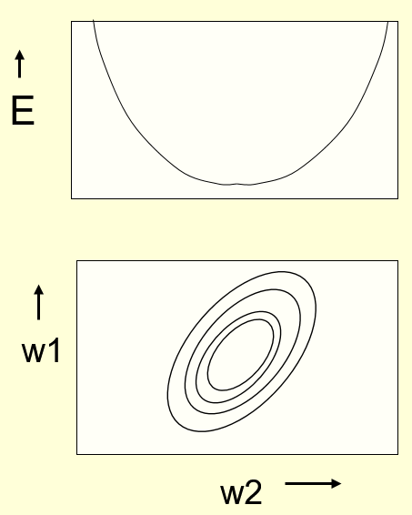
    </a>
    
  

+ [Online vs batch learning](../ML/MLNN-Hinton/03-Backpropagation.md#the-error-surface-for-a-linear-neuron)
  + Simplest kind of batch learning (left diagram)
    + elliptical contour lines
    + steepest descent on the error surface
    + travel perpendicular to the contour lines
    + batch learning: the gradient descent summed over all training cases
  + simplest kind of online learning (right diagram)
    + online learning: update the weights in proportion to the gradient after each training case
    + zig-zag around the direction of steepest descent
  + elongated ellipse: the direction of steepest descent almost perpendicular to the direction towards the minimum

  

    <a href="http://www.cs.toronto.edu/~hinton/coursera/lecture3/lec3.pptx" ismap target="_blank">
      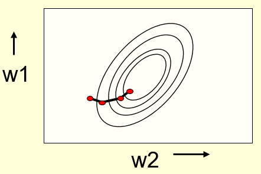
      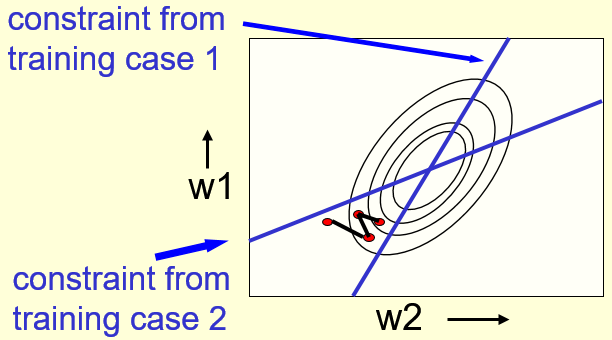
      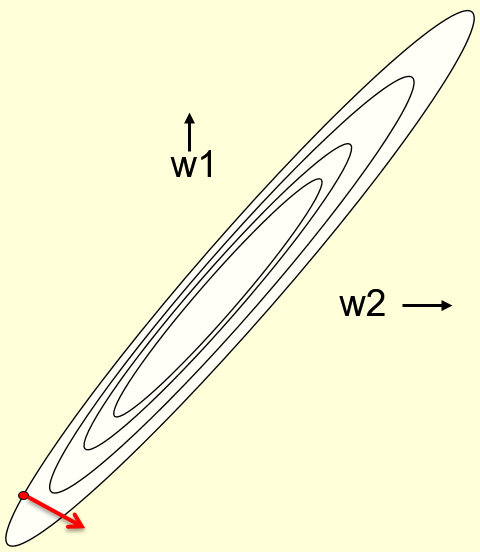
    </a>
  

### Backpropagation

+ [Backpropagation](../ML/MLNN-Hinton/a01-IntroNN.md#backpropagation)
  + the central mechanism by which neural networks learn
  + During prediction, a neural network propagates signal forward through the nodes of the network until it reaches the output layer where a decision is made.
  + A neural network propagates signal forward through the nodes of the network until it reaches the output layer where a decision is made.
  + The network then backpropagates information about this error backward through the network such that it can alter each of the parameters.
  + Backpropagation performed first in order to gain the information necessary to perform gradient descent.

  

    
  

+ [Automatic differentiation](../ML/MLNN-Hinton/a01-IntroNN.md#backpropagation)

  

    <a href="https://towardsdatascience.com/simple-introduction-to-neural-networks-ac1d7c3d7a2c" ismap target="_blank">
      
    
    </a>
  

  + a function library that is inherently linked to the architecture such that the procedure is abstracted and updates automatically as the network architecture is updated

  

    
  

## Logistic Neurons

### Model for Logistic Neurons

+ [Definition](../ML/MLNN-Hinton/03-Backpropagation.md#learning-the-weights-of-a-logistic-output-neuron)

  \[z = b + \sum_i x_i w_i \qquad y = \frac{1}{1 + e^{-z}}\]

  

    
  

+ [Derivative of the output w.r.t. the logit](../ML/MLNN-Hinton/03-Backpropagation.md#learning-the-weights-of-a-logistic-output-neuron)

  \[y = \frac{1}{1 + e^{-z}} \quad \implies \quad \frac{dy}{dz} = y(1-y)\]

+ [Logistic regression](../ML/MLNN-Hinton/a01-IntroNN.md#the-motivation-for-neural-networks)
  + the problem of estimating a probability that someone has heart disease, P(y=1), given an input value X.
  + the logistic function, to model P(y=1):

    \[P(Y=1) = \frac{e^{\beta_0+\beta_1 X}}{1 + e^{\beta_0+\beta_1 X}} = \frac{1}{1 + e^{-(\beta_0 + \beta_1 X)}}\]

  + general shape: the model will predict P(y=1) with an S-shaped curve
  + $\beta_0$ shifts the curve right or left by $c = − \beta_0 / \beta_1$, whereas $\beta_1$ controls the steepness of the S-shaped curve.
  + change of the $beta_0$ value to move offset
  + change of the $beta_1$ value to distort gradient

  

    
  

### Backpropagation for Logistic Neurons

+ [Idea Behind](../ML/MLNN-Hinton/03-Backpropagation.md#the-backpropagation-algorithm)
  + knowing what actions in the hidden units
  + efficiently computing error derivatives

+ Error derivatives w.r.t activities to get error derivatives w.r.t. the incoming weights on a sampling case

  \[E = \frac{1}{2} \sum_{j \in output} (t_j - y_j)^2 \quad \implies \quad \frac{\partial E}{\partial y_j} = - (t_j - y_j)\]

+ [Total error derivatives w.r.t. various factors](../ML/MLNN-Hinton/03-Backpropagation.md#the-backpropagation-algorithm)

  \[\begin{array}{rcl} \dfrac{\partial E}{\partial z_j} & = & \dfrac{dy_j}{dz_j} \dfrac{\partial E}{\partial y_j} = y_j(1- y_j)\dfrac{\partial E}{\partial y_j} \\\\ \dfrac{\partial E}{\partial y_j} &=& \displaystyle \sum_j \dfrac{dz_j}{dy_i} \dfrac{\partial E}{\partial z_j} = \sum_j w_{ij} \dfrac{\partial E}{\partial z_j} \\\\ \dfrac{\partial E}{\partial w_{ij}} &=& \dfrac{\partial z_j}{\partial w_{ij}} \dfrac{\partial E}{\partial z_j} = y_i \dfrac{\partial E}{\partial z_j} \end{array}\]

+ [Optimization of Logistic Regression](../ML/MLNN-Hinton/a01-IntroNN.md#the-motivation-for-neural-networks)
  + using a loss function in order to quantify the level of error that belongs to our current parameters
  + find the coefficients that minimize this loss function
  + the parameters of the neural network have a relationship with the error the net produces
  + gradient descent:
    + changing the parameters using an optimization algorithm
    + useful for finding the minimum of a function

  + the loss function or the objective function

    \]\mathcal{L}(\beta_0, \beta_1) = - \sum_i \left[ y_i \log(p_i) + ( 1- y_i) \log(1 - p_i)\right]\]

### The Softmax Function

+ [The architecture](../ML/MLNN-Hinton/04-Multiclasses.md#another-diversion-the-softmax-output-function)

    

      <a href="http://www.cs.toronto.edu/~hinton/coursera/lecture4/lec4.pptx" ismap target="_blank">
        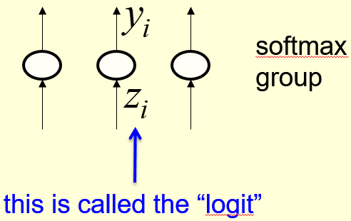
      </a>
      
    

+ [Definition](../ML/MLNN-Hinton/04-Multiclasses.md#another-diversion-the-softmax-output-function)

  A softmax group $G$ is a group of output neurons whose outputs use the softmax activation defined by

  \[y_i = \frac{e^{z_i}}{\displaystyle \sum_{j \in G} e^{z_j}}\]

  so that the outputs sum to 1. The cost function is given by

  \[C = - \sum_j t_j \ln(y_j)\]

+ [Proposition](../ML/MLNN-Hinton/04-Multiclasses.md#another-diversion-the-softmax-output-function)

  By the Quotient Rule, the derivatives are

  \[\frac{\partial y_i}{\partial z_i} = \frac{\partial}{\partial z_i} \left(\frac{e^{z_i}}{\sum_{j \in G} e^{z_j}}\right) = y_i(1 - y_i) \qquad\qquad \frac{\partial y_i}{\partial z_j} = \frac{\partial}{\partial z_j} \frac{1}{2} (t_j - y_j)^2 = - y_i y_j\]

  or more fancy-like using the Kronecker Delta:

  \[\frac{\partial y_i}{\partial z_j} = y_i (\delta_{ij} - y_j)\]

+ [Proposition](../ML/MLNN-Hinton/04-Multiclasses.md#another-diversion-the-softmax-output-function)

  The derivatives of the cost function are

  \[\frac{\partial C}{\partial z_i} = y_i - t_i.\]

+ [Cross-entropy](../ML/MLNN-Hinton/04-Multiclasses.md#another-diversion-the-softmax-output-function)

  the suggested cost function to use with softmax

  \[C = - \sum_j t_j \ln(y_j) = -\ln(y_i)\]

  + $t_j$: target values
  + $t_j = \begin{cases} 1 & j \in I \subset G \\ 0 & j \in G-I \end{cases}$
  + $y_i$: the probability of the input belonging to class $I$
  + simply put 0 on the wrong answers and 1 for the right answer ($t_i$)
  + Cross-entropy cost function

+ [Property](../ML/MLNN-Hinton/04-Multiclasses.md#another-diversion-the-softmax-output-function)

  $C$ w/ very big gradient descent if target value = 1 and actual value approx. 0.

+ better than the gradient descent w/ squared error

## Issues and Algorithms for Optimization

### Challenges with optimization

+ [Convex optimization](../ML/MLNN-Hinton/a03-Optimization.md#challenges-with-optimization)
  + a function in which there is only one optimum, corresponding to the global optimum (maximum or minimum)
  + no concept of local optima for convex optimization problems, making them relatively easy to solve

+ [Non-convex optimization](/ML/MLNN-Hinton/a03-Optimization.md#challenges-with-optimization)
  + a function which has multiple optima, only one of which is the global optima
  + Maybe very difficult to locate the global optima depending on the loss surface

+ [Neural network](../ML/MLNN-Hinton/a03-Optimization.md#challenges-with-optimization)
  + loss surface: minimize the prediction error of the network
  + interested in finding the global minimum on this loss surface

+ [Multiple problems on neural network training](/ML/MLNN-Hinton/a03-Optimization.md#challenges-with-optimization)
  + What is a reasonable learning rate to use?
    + small learning rate: long to converge
    + large learning rate: not converge
  + How do we avoid getting stuck in local optima?
    + one local optimum may be surrounded by a particularly steep loss function
    + difficult to escape this local optimum
  + What if the loss surface morphology changes?
    + no guarantee found global minimum remain indefinitely
    + trained dataset not representative of the actual data distribution
    + different dataset might with different loss surface
    + importance: make the training and test datasets representative of the total data distribution

### Local optima and Saddle Points

+ [Local optima](../ML/MLNN-Hinton/a03-Optimization.md#local-optima)
  + viewed as a major problem in neural network training
  + using insufficiently large neural networks, most local minima incur a low cost
  + not particularly important to find the true global minimum
  + a local minimum with reasonably low error is acceptable

  

    
  

+ [Saddle pints](../ML/MLNN-Hinton/a03-Optimization.md#saddle-points)
  + more likely than local minima in high dimensions
  + more problematic than local minima because close to a saddle point the gradient can be very small
  + gradient descent results in negligible updates to the network and network training will cease

  

    
  

+ [Rosenbrook function](../ML/MLNN-Hinton/a03-Optimization.md#saddle-points)
  + often used for testing the performance of optimization algorithms on saddle points
  + formula $f(x, y) = (a - x)^2 + b(y - x^2)^2$ with global minimum at $(x, y) = (a, a^2)$
  + a non-convex function with a global minimum located within a long and narrow valley
  + difficult to converge to the global minimum due to the flat valley
  + flat valley with small gradients makes it difficult for gradient-based optimization procedures to converge

  

    
  

### Poor Conditioning

+ [Derivative Issues](../ML/MLNN-Hinton/a03-Optimization.md#poor-conditioning)
  + ill-conditioned derivatives of the error function
  + reflected in error landscapes containing many saddle points and flat areas

+ [Hessian matrix](../ML/MLNN-Hinton/a03-Optimization.md#poor-conditioning)
  + a square matrix of second-order partial derivatives of a scalar-valued function
  + the Hessian describes the local curvature of a function of many variables

  \[H = \begin{bmatrix} \dfrac{\partial^2 f}{\partial x_1^2} & \dfrac{\partial^2 f}{\partial x_1 \partial x_2} & \cdots & \dfrac{\partial^2 f}{\partial x_1 \partial x_n} \\\\ \dfrac{\partial^2 f}{\partial x_2 \partial x_1} & \dfrac{\partial^2 f}{\partial x_2^2} & \cdots & \dfrac{\partial^2 f}{\partial x_2 \partial x_n} \\ \vdots & \vdots & \ddots & \vdots \\ \dfrac{\partial^2 f}{\partial x_n \partial x_1} & \dfrac{\partial^2 f}{\partial x_n \partial x_n \partial x_2} & \cdots & \dfrac{\partial^2 f}{\partial x_n^2} \end{bmatrix}\]

  + used to determine whether a given stationary points is a saddle point or not
  + full Hessian matrix takes $\mathcal{O}(n^2)$ memory, infeasible for high dimensional functions such as the loss functions of neural networks
  + use [truncated-Newton](https://en.wikipedia.org/wiki/Truncated_Newton_method) and [quasi-Newton](https://en.wikipedia.org/wiki/Quasi-Newton_method) algorithms to optimize
  + the quasi-Newton family of algorithms using approximations to the Hessian
  + [Broyden-Fletcher-Goldfarb-Shanno (BFGS) algorithm](https://en.wikipedia.org/wiki/Broyden%E2%80%93Fletcher%E2%80%93Goldfarb%E2%80%93Shanno_algorithm): the most popular quasi-Newton algorithms

+ Neural network:
  + the Hessian matrix is poorly conditioned - the output changes rapidly for a small change of input
  + undesirable property: the optimization process is not particularly stable
  + learning is slow despite the presence of strong gradients because oscillations slow the learning process down

  

    
  

### Vanishing/Exploding Gradients

+ [Deep neural network](../ML/MLNN-Hinton/a03-Optimization.md#vanishingexploding-gradients)

  

    
  

  + affine transformation followed by an activation function (a single layer)

    \[\begin{array}{lll} \text{Linear} \qquad & h_i = W_x & \\ \text{activation} & h_i = W h_{i-1}, & i = 2, \dots, n\end{array}\]

  + output for an $n$-layer network

    \[\text{Suppose } \mathbf{W} = \begin{bmatrix} a & 0 \\ 0 & b \end{bmatrix}: \qquad \begin{bmatrix} h_1^1 \\ h_2^1 \end{bmatrix} = \begin{bmatrix} a & 0 \\ 0 & b \end{bmatrix} \begin{bmatrix} x_1 \\ x_2 \end{bmatrix} \quad \cdots \begin{bmatrix} h_1^n \\ h_2^n \end{bmatrix} = \begin{bmatrix} a^n & 0 \\ 0 & b^n \end{bmatrix} \begin{bmatrix} x_1 \\ x_2 \end{bmatrix}\]

+ [Vanishing and Exploding](../ML/MLNN-Hinton/a03-Optimization.md#vanishingexploding-gradients)
  + Two possible cases depending on the magnitude of $a$ and $b$

  \[\begin{array}{lll} \text{Suppose } x = \begin{bmatrix} 1 \\ 1 \end{bmatrix} & & \\ \text{Case 1: } a = 1, b =2: & y \rightarrow 1,\; \Delta_y \rightarrow \begin{bmatrix} n \\ n \cdot 2^{n-1} \end{bmatrix} & \quad \text{Explodes!} \\ \text{Case 2: } a = 0.5, b = 0.9: & y \rightarrow 0,\; \Delta_y \rightarrow \begin{bmatrix} 0 \\ 0 \end{bmatrix} & \quad \text{Vanishes!} \end{array}\]

    + Gradient clipping rule

      \[\text{if } \parallel g \parallel > u, \quad g \leftarrow \dfrac{gu}{\parallel g \parallel}\]

  + for $a$, $b$ less than 1
    + the gradients quickly tends to zero
    + gradient values smaller than the precision threshold recognized as zero

+ [Vanishing gradient issue](../ML/MLNN-Hinton/a10-CNNsGuide.md#relu-rectified-linear-units-layers)
  + the lower layers of the network training very slowly
  + the gradient decreasing exponentially through the layers
  + Wiki, [Vanishing gradient problem](https://en.wikipedia.org/wiki/Vanishing_gradient_problem)
  + Quora, [https://www.quora.com/What-is-the-vanishing-gradient-problem](https://www.quora.com/What-is-the-vanishing-gradient-problem)

### Momentum

+ [Momentum](../ML/MLNN-Hinton/a03-Optimization.md#momentum)
  + an inertia motion of object to move in the direction of motion
  + the general direction that the optimization algorithm is moving
  + optimization algorithm moving in a general direction, the momentum causes it to 'resist' changes in the direction
  + dampening of oscillations for high curvature surfaces
  + an added term in the objective function
  + a value in $[0, 1]$ increasing the size of the steps taken towards the minimum by trying to jump from a local minimum
  + large momentum & small learning rate: fast convergence
  + large momentum & large learning rate: skip the minimum with a huge step
  + small momentum: not reliably avoid local minima and slow down  the training of the system
  + help in smoothing out the variations, if the gradient keeps changing direction
  + right value of momentum: either learned by hit and trial or through cross-validation

+ [Formula for Momentum](../ML/MLNN-Hinton/a03-Optimization.md#classical-momentum)
  + using past gradients for updating values
  + $v$: velocity
  + more weight applied to more recent gradients, creating an exponentially decaying average of gradients

  \[\begin{array}{rcl} g &=& \frac{1}{m} \displaystyle \sum_i \Delta_\theta L(f(x^{(i)}; \theta), y^{(i)}) \\ v &=& \alpha v + (-\varepsilon g) \end{array}\]

  + $\alpha \in [0, 1)$ controls how quickly effect of past gradients decay
  + $\varepsilon$: current gradient update

+ [Compute gradient estimate:](../ML/MLNN-Hinton/a03-Optimization.md#classical-momentum)

    \[g = \frac{1}{m} \sum_i \Delta_\theta L(f(x^{(i)}; \theta), y^{(i)})\]
  + Update velocity: $v = \alpha v - \varepsilon g$
  + Update parameters: $\theta = \theta + v$
  + Impacts
    + SGD w/ momentum updates no real advantage at the first few updates over vanilla SGD
    + As the number of updates increases the momentum kickstarts and allows faster convergence.

+ [Nesterov momentum](../ML/MLNN-Hinton/a03-Optimization.md#nesterov-momentum)
  + Sutskever, Martens et al. "[On the importance of initialization and momentum in deep learning](http://proceedings.mlr.press/v28/sutskever13.pdf)" 2013
  + Classical vs Nesterov Momentum
    + Classical
      + first correct velocity
      + make a big step according to that velocity (and then repeat)
  + Nesterov
    + first make a step into velocity direction
    + make a correction to a velocity vector based on a new location (then repeat)

  + Hugh difference in practice
    + Apply an interim update: $\tilde{\theta} = \theta + v$
    + Perform a correction based on gradient at the interim point

      \[\begin{array}{rcl} g &=& \frac{1}{m} \sum_i \Delta_\theta L(f(x^{(i)}; \tilde{\theta}), y^{(i)}) \\ v &=& \alpha v - \varepsilon g \\ \theta & = & \theta + v \end{array}\]

    + momentum based on look-ahead slope
    + visual representation of the difference between the traditional momentum update and Nesterov momentum

    

      
    
  

### Adaptive Learning Rates

+ [Oscillations along vertical direction](../ML/MLNN-Hinton/a03-Optimization.md#adaptive-learning-rates)

  

    
  

+ List of Proposals
  + AdaGrad
  + RMSProp
  + Adam

### Parameter Initialization

+ [Initialization of network weights](../ML/MLNN-Hinton/a03-Optimization.md#parameter-initialization)
  + overlooked characteristics of developing neural networks
  + poorly initialized networks determined to network performance
  + initialized with all values of zero
    + the network not learn anything at all
    + after a gradient update, all weights would be zero
  + initialized with all weights 0.5
    + actually learn something
    + prematurely prescribed some form of symmetry between neural units

+ [Randomizing weights](../ML/MLNN-Hinton/a03-Optimization.md#parameter-initialization)
  + avoid presupposing any form of a neural structure by randomizing weights according to a normal distribution
  + often done in Keras by specifying a random state

+ [Scale of initialization](/ML/MLNN-Hinton/a03-Optimization.md#parameter-initialization)
  + large values for the weights: lead to exploding gradients
  + small values for the weights: lead to vanishing gradients
  + sweet spot that provides the optimum tradeoff between these two
  + not a priori but inferred through trial and error

### Normalization

+ Purpose
  + ways to navigate the loss surface of then neural network using momentum and adaptive learning rates
  + methods of parameter initialization to minimize a prior biases within the network

+ Normalizing features before applying the learning algorithm

+ [Min-max normalization](../ML/MLNN-Hinton/a03-Optimization.md#feature-normalization)
  + simplest method to scale data
  + rescaling the range of features to scale the range in [0, 1] or [-1, 0]
  + subtracting each value by the minimum value and scaling by the range of values present in the dataset
  + Issue: highly skewed data results in many values clustered inn one location
  + Solution: taking the logarithm of the feature variable

  \[x^\prime = \frac{x - \min(x)}{\max(x) - \min(x)}\]

+ [Mean normalization](../ML/MLNN-Hinton/a03-Optimization.md#feature-normalization)
  + essentially the same as min-max normalization except the average value is subtracted from each value
  + the least common way

  \[x^\prime = \frac{x - \text{average}(x)}{\max(x) - \min(x)}\]

+ [Feature normalization](../ML/MLNN-Hinton/a03-Optimization.md#feature-normalization)
  + make each feature normalized with zero mean and unit variance
  + widely used for normalization in many machine learning algorithms
  + typically involving distance-based methods
  + general method
    + determine the distribution mean and standard variation for each feature
    + subtract the mean from each feature
    + divide the values of each feature by its standard deviation
  + Formula

    \[x^\prime = \frac{x - \mu}{\sigma}\]

    + $x$: feature vector
    + $\mu$: vector of mean feature values
    + $\sigma$: vector of SD of feature values

    

      
    

### Assessment with Beale's Function

+ [Beale's function](https://en.wikipedia.org/wiki/Test_functions_for_optimization)
  + one of many test functions commonly used for studying the effectiveness of various optimization techniques
  + a test function accesses how well the optimization algorithms perform when in flat regions with very well shallow gradients

  

    
  

  + Optimizing a function $f: A \rightarrow R$, from some set A to the real numbers is finding an element $x_0 \in A$ such that $f(x_0) \leq f(x)$ for all $x \in A$ (finding the minimum) or such that $f(x_0) \geq f(x)$ fro all $x \in A$ (finding the maximum).
  + Formula:

    $$f(x,, y) = (1.5 -x +xy)^2 + (2.25 -x + xy^2)^2 + (2.625 - x +xy^3)^2$$

    Answer: $(x, y) = (3, 0.5)$

+ [Artificial landscape](../ML/MLNN-Hinton/a04-Hyperparameter.md#beales-function)
  + find a way of comparing the performance of various algorithms
    + Convergence (how fast they reach the answer)
    + Precision (how close do they approximate the exact answer)
    + Robustness (so they perform well for all functions or just a small subset)
    + General performance (e.g., computational complexity)
  + analogous to the loss surface of a neural network
  + goal of NN training: find the global minimum on the loss surface by performing some form of optimization - typically stochastic gradient

### Implementation with Keras

+ [Keras](../ML/MLNN-Hinton/a04-Hyperparameter.md#a-keras-refresher)
  + a Python library for deep learning that can run on top of both Theano or TensorFlow, tow powerful Python libraries for fast numerical computing created and released by Facebook and Google, respective
  + developed to make developing deep learning models as fast and easy and easy as possible for research and practical applications
  + built on the idea of a model
  + Sequential model: a sequence of layers, a linear stack of layers

+ [Summarize the construction of deep learning models in Keras using the Sequential model](../ML/MLNN-Hinton/a04-Hyperparameter.md#a-keras-refresher)
  1. Define model: create a Sequential model and add layers
  2. Compile model: specify loss function and optimizers and call the `.compile()` function
  3. Fit model: train the model on data by calling the `.fit()` function
  4. Make prediction: use the model to generate predictions on new data by calling functionbs such as `.evaluate()` or `.predict()`

+ [Callbacks](../ML/MLNN-Hinton/a04-Hyperparameter.md#callbacks-taking-a-peek-into-our-model-while-its-training)
  + how to examine the performance of the model
  + what happening in various stages of the model
  + a set of functions to be applied at given stages of the training procedure
  + get a view on internal states and statistics of the model during training
  + pass a list of callbacks (as the keyword arguments callbacks) to the `.fit()` method of th eSequential or Model classes

+ [Relevant methods of the callbacks at each stage of the training](../ML/MLNN-Hinton/a04-Hyperparameter.md#callbacks-taking-a-peek-into-our-model-while-its-training)
  + `keras.callbacks.History()`: a callback function automatically included in `.fit()`
  + `keras.callbacks.ModelCheckPoint` saves the model with its weights at a certain point in the training; e.g., a good practice to save the model weights only when an improvement is observed as measured by the `acc`
  + `keras.callbacks.EarlySStopping`: stop the training when a monitored quantity has stopped improving
  + `keras.callbacks.LearningRateScheduler`: change the learning rate during training

+ Procedure by Example
  + Step 1 - [Deciding on the network topology](../ML/MLNN-Hinton/a04-Hyperparameter.md#step-1---deciding-on-the-network-topology)
    + Preprocess the data
  + Step 2 - [Adjusting the `learning rate`](../ML/MLNN-Hinton/a04-Hyperparameter.md#step-2---adjusting-the-learning-rate)
    + Stochastic Gradient Descent (SGD)
    + Typical values for hyperparameter: $lr = 0.01$, $decay = 1e^{-6}$, $momentum = 0.9$, and nesterov = True
    + Learning rate hyperparameter
    + Implement a learning rate adaption schedule in Keras
    + Apply a custom learning rate change using `LearningRateScheduler`
  + Step 3 - [Choosing an optimizer and a loss function](../ML/MLNN-Hinton/a04-Hyperparameter.md#step-3---choosing-an-optimizer-and-a-loss-function)
    + goal of optimization: efficiently calculate the parameters/weights that minimize the loss function
    + [types of loss functions in keras](https://github.com/keras-team/keras/blob/master/keras/losses.py)
    + Distance: the 'loss' function
    + types of loss functions: MSE (for regression); categorical cross-entropy (for classification); binary cross entropy (for classification)
  + Step 4 - [Deciding on the batch size and number of epochs](../ML/MLNN-Hinton/a04-Hyperparameter.md#step-4---deciding-on-the-batch-szie-and-number-of-epochs)
    + batch size: the number of samples propagated through the network
    + advantages od using a batch size < number of all samples
    + Disadvantages of using a batch size < number of all samples
    + epoch: a hyperparameter defines the number times that the learning algorithm will work through the entire training dataset
  + Step 5 - [Random restarts](/ML/MLNN-Hinton/a04-Hyperparameter.md#step-5---random-restarts)
    + Not implemented in Keras
    + Easily done by altering `keras.callbacks.LearningRateScheduler`
    + Resetting the learning rate after a specified number of epoch for a finite number of times

### Implementation for Cross-Validation

+ [Tuning Hyperparameters using Cross-Validation](../ML/MLNN-Hinton/a04-Hyperparameter.md#tuning-hyperparameters-using-cross-validation)
  + Use `GridSearchCV` from Scikit-Learn to try out several values for hyperparameters and compare the results
  + Cross-validation with `keras`
    + use the wrappers for the Scikit-Learn API
    + Provide a way to use Sequential Keras models (single-input only) as part of Sckikit-Learn workflow
    + wrappers
      + Scikit-Learn classifier interface: `keras.wrappers.scikit_learn.KerasClassifier(build_fn=None, **sk_params)`
      + Scikit-Learn regressor interface: `keras.wrappers.scikit_learn.KerasRegressor(build_fn=None, **sk_params)`

+ [Cross-Validation with more than one hyperparameters](../ML/MLNN-Hinton/a04-Hyperparameter.md#cross-validation-with-more-than-one-hyperparameters)
  + effectively trying out combinations of them.
  + Cross-validation in neural networks is computationally expensive.
    + each combination evaluated using the k-fold cross-validation (k is a parameter we choose)

## Adaptive Learning Rates

#### AdaGrad

+ Momentum adds updates to the slope of error function and speeds up SGD in turn.

+ [AdaGrad]](../ML/MLNN-Hinton/a03-Optimization.md#adagrad) adapts updates to each individual parameter to perform larger or smaller updates depending on their importance.

+ Accumulate squared gradients: $r_i = r_i + g_i^2$

+ Update each parameter:

  \[\theta_i = \theta_1 - \frac{\varepsilon}{\delta + \sqrt{r_i}} g_i\]

  + inversely proportional to cumulative squared gradient

+ Benefits:
  + eliminate the need to manually tune the learning rate
  + result in greater progress along gently sloped directions

+ Disadvantages:
  + accumulation of the squared gradients in the denominator
  + positive added term:
    + the accumulated sum keeps growing during training
    + the learning rate shrink and eventually become infinitesimally small

#### RMSProp

+ For non-convex problems, AdaGrad can prematurely decrease the learning rate.

+ Use an exponentially weighted average for gradient accumulation.

  \[\begin{array}{rcl} r_i &=& \rho r_i + (1 - \rho) g_i^2 \\ \theta_i &=& \theta_i - \frac{\varepsilon}{\delta + \sqrt{r_i}} g_i \end{array}\]

#### Adam

+ [Adaptive moment estimation (Adam)](..](../ML/MLNN-Hinton/a03-Optimization.md#adam))
  + a combination of RMSprop and momentum
  + the most popular optimizer used for neural networks

+ Nadam: a combination of MRSprop and Nesterov momentum

+ Adam computes adaptive learning rates for each parameters.

+ Adam keeps an exponentially decaying average of past gradients, similar to momentum.
  + Estimate first moment: 

    \[v_i = \rho_1 v_i + (1 - \rho_1) g_i\]
  
  + Estimate second moment:

    \[r_i = \rho_2 r_i + 91 - \rho_2) g_i^2\]

    + applies bias correction to $v$ and $r$

  + Update parameters:

    \[\theta_i = \theta_i - \frac{\varepsilon}{\delta + \sqrt{r_i}} v_i\]

    + works well in practice, is fairly robust to hyper-parameters

## Parameter Initialization

### Xavier Initialization

+ [Xavier initialization](../ML/MLNN-Hinton/a03-Optimization.md#xavier-initialization) is a simple heuristic for assigning network weights.

+ Objective: the variance to remain the same with each passing layer

+ Keep the signal from exploding to high values or vanishing to zero

+ To initialize the weights in such a way that the variance remains the same for both the input and the output

+ The weights drawn from a distribution with zero mean and a specific variance.

+ For a fully-connected layer with $m$ inputs:

  \[W_{ij} \sim N \left(0, \frac{1}{m} \right)\]

  + $m$: fan-in; the number of incoming neurons (input units in the weight tensor)
  + heuristic value: merely empirically observed to perform well

### HE Normal Initialization

+ [HE normal initialization](../ML/MLNN-Hinton/a03-Optimization.md#he-normal-initialization)
  + the same as Xavier Initialization, except that the variance multiplied by a factor of two
  + initialized the size of the previous layer which helps in attaining a global minimum of the cost function faster and more efficiently
  + random but differ in range depending on the size of the previous layer of neurons
  + controlled initialization hence the faster and more efficient gradient descent

+ For ReLU units

  \[W_{ij} \sim N \left(0, \frac{2}{m} \right)\]

### Bias Initialization

+ [Bias initialization](../ML/MLNN-Hinton/a03-Optimization.md#bias-initialization): how the biases of the neurons should be initialized

+ The simplest and a common way of initializing biases is to set them to zero.

+ Asymmetry breaking: provided by the small random numbers in th weights

+ ReLU non-linearity
  + using small constant values such as 0.01 for all biases
  + ensure that all ReLU units fire in the beginning and obtain and propagate some gradient

+ Main concern: avoid saturation at initialization within hidden units, ReLU by initializing biases to 0.1 instead of zero

### Pre-initialization

+ [Pre-initialization](../ML/MLNN-Hinton/a03-Optimization.md#pre-initialization):
  + common for convolutional networks used for examining images
  + involve importing the weights of an already trained network
  + used as the initial weights of the network to be trained
  + a tenable method to utilize for analyzing images with few data samples
  + underlying concept behind transfer learning

## Normalization

### Internal Covariate Shift

+ [Internal Covariate Shift](../ML/MLNN-Hinton/a03-Optimization.md#internal-covariate-shift):
  + the change in the distribution of network activation due to the change in network parameters during training
  + the parameters of a layer changed, the distribution of inputs to subsequent layers also changes
  + Issue: the shifts in input distributions tend to slow down learning, especially deep neural networks

  

    
  

+ Whitened inputs
  + converge faster and uncorrelated
  + internal covariate shift leads to just the opposite

+ Ref: [Batch Normalization: Accelerating Deep Network Training by Reducing Internal Covariate Shift](https://arxiv.org/abs/1502.03167)
  + gradient descent converges much faster with feature scaling than without it

### Batch Normalization

+ [Batch normalization](../ML/MLNN-Hinton/a03-Optimization.md#batch-normalization)
  + a method intended to mitigate internal covariate shift for neral networks
  + an extension to the idea of feature standardization to other layers of the neural network

  

    
  

  + reducing overfit due to a slight regularization effect
  + similar to dropout, add some noise to each hidden layer's activations

+ [Batch normalization transformation](../ML/MLNN-Hinton/a03-Optimization.md#batch-normalization)
  + normalizes the output of a previous activation layer by subtracting the batch mean and dividing by the batch standard deviation.

    \[\begin{array}{lcl} H^\prime &=& \frac{H - \mu}{\sigma} \\ \mu &=& \frac{1}{m} \sum_i H_{i,:} \\ \sigma &=& \sqrt{\frac{1}{m} \sum_i (H - \mu)^2 + \delta}\end{array}\]

    + $\mu$: vector of mean activations across mini-batch
    + $\sigma$: vector of SD of each unit across mini-batch
  + allowing each layer of a network to learn by itself more independently of other layers
  + after shift/scale of activation outputs by some randomly initialized parameters, the weights in the next layer are no longer optimal.
  + Adding two trainable (learnable) parameters to each layer
    + normalized output multiplied by a "standard deviation" parameter ($\gamma$) and add a "mean" parameter ($\beta$)
    + let SGD do the denormalization by changing only these two wrights for each activation
    + not losing the stability of the network by changing all the weights

    \[\gamma H^\prime + \beta\]

  + For each of the N mini-batches, calculate the mean and standard deviation of the output

    

      
    

  + subsequently repeated for all subsequent hidden layers
  + differentiate the joint loss for the N mini-batches and then backpropagate through the normalization operations

+ Testing time
  + the mean and standard deviations replaced with running average collected during training time
  + same as using the population statistics instead of mini-batch statistics
  + the output deterministically depends on the input

+ Advantages
  1. reduces internal coariate shift
  2. reduces the dependence of gradients on the scale of the parameters or their initial values
  3. regularizes the model ad reduces the need for dropout, photometric distortions, local response normalization and other regularization techniques
  4. allows use of saturating nonlinearities and higher learning rates

## Applications

### Family Tree - Multiclass Learning

+ [Family tree](../ML/MLNN-Hinton/04-Multiclasses.md#learning-to-predict-the-next-word)
  + Q: Figuring out the regularities from given family trees
  + Block - local encoding of person 1: 24 people: 12 British & 12 Italian
  + Block - local encoding of relationship: 12 relationships
  + Block - Distributed encoding of person 1: 6 big gray boxes
  + Observe the patterns from the right diagram
    + top right unit (big grey block): nationality
    + 2nd right block: generation
    + left bottom block: branches of family tree
  + features: only useful if the other bottlenecks use similar representations
  + Generalization: able to complete those triples correctly?
    + trained with 108 triples instead of 112 triples
    + Validate on the 4 held-out cases
  + (A r B): A has a relationship r with B
    + predict 3rd term (B) from the first two terms (A & r)
    + using the trained net to find very unlikely triples

  <a href="http://www.cs.toronto.edu/~hinton/coursera/lecture4/lec4.pptx" ismap target="_blank">
    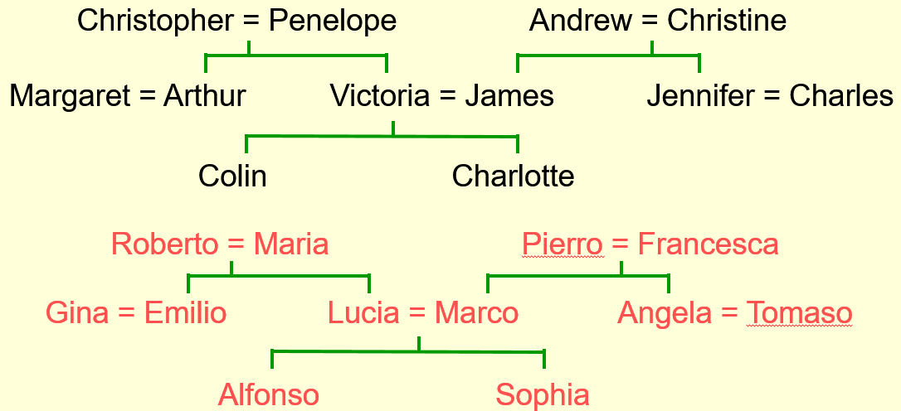
    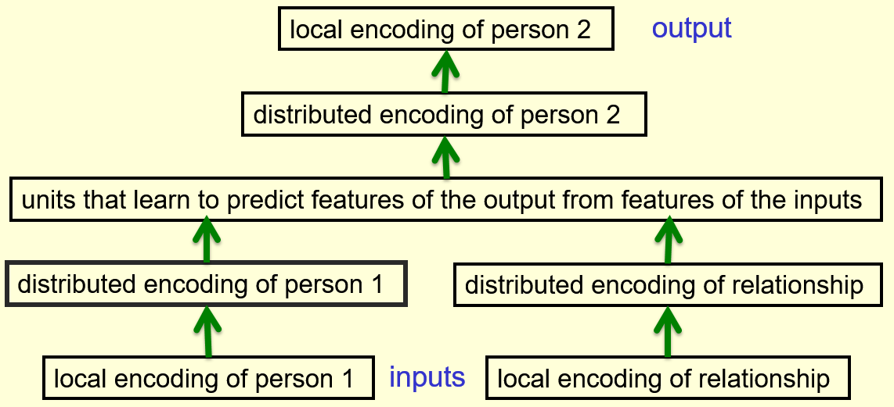
    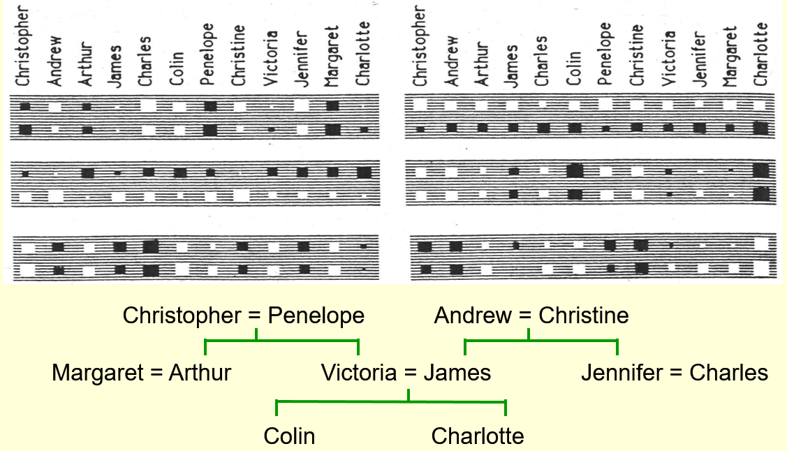
  </a>

### Speech Recognition

+ A basic problem in speech recognition
  + Not able to identify phonemes perfectly in noisy speech
  + Ambiguous acoustic input: several different words fitting the acoustic signal equally well
  + Human using their understanding of the meaning of the utterance to hear the right words
  + knowing which words are likely to come next and which are not in speech recognition

+ [The standard Trigram method](../ML/MLNN-Hinton/04-Multiclasses.md#neuro-probabilistic-language-models)
  + Gather a huge amount of text and count the frequencies of all triples or words
  + Use the formula to bet the relative probabilities of words with the two previous words

    \[\frac{p(w_3 = c | w_2 = b, w_1 = a)}{p(w_3 = d | w_2 =b, w_1 = a)} = \frac{\text{count}(abc)}{\text{count}(abd)}\]

  + The state-of-the-art methodology recently
  + drawback: not understand similarity btw words

+ [Bengio's neural net](../ML/MLNN-Hinton/04-Multiclasses.md#neuro-probabilistic-language-models)

  

    <a href="url" ismap target="_blank">
      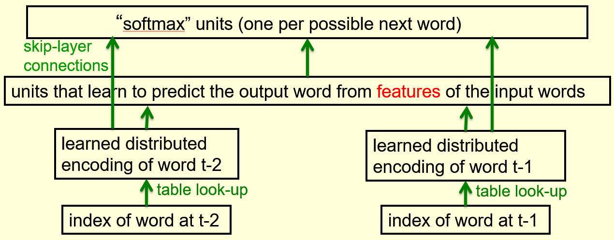
    </a>
  

  + similar to family tree problem but larger scale
  + Typical 5 previous words used but shown 2 in the diagram
  + Using distributed representations via hidden layers to predict via huge sofmax to get probabilities for all various words might coming next
  + refinement:
    + skip layer connection to skip from input to output
    + input words individually informative about what the word might be
  + A problem w/ a very large vector of weights
    + unnecessary duplicates: plural of a word and tenses of verbs
    + each unit in the last hidden layer w/ 100,000 outgoing weights

+ [A serial architecture](../ML/MLNN-Hinton/04-Multiclasses.md#dealing-with-large-number-of-possible-outputs)

  

    <a href="http://www.cs.toronto.edu/~hinton/coursera/lecture4/lec4.pptx" ismap target="_blank">
      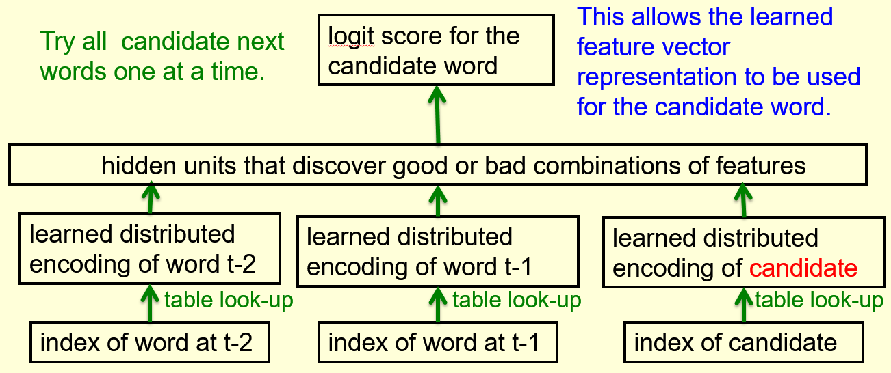
    </a>
  

  + adding an extra input as candidate for the next word same as the context word
  + output: score for how good the candidate in the context
  + execute the net many times but most of them only one required

+ [Structure words as a tree](../ML/MLNN-Hinton/04-Multiclasses.md#dealing-with-large-number-of-possible-outputs) (Minih and Hinton, 2009)
  + predicting a path through a binary tree
  + arranging all the words in a binary tree with words as the leaves
  + using the previous context to generate a __prediction vector__, $v$

  

    <a href="url" ismap target="_blank">
      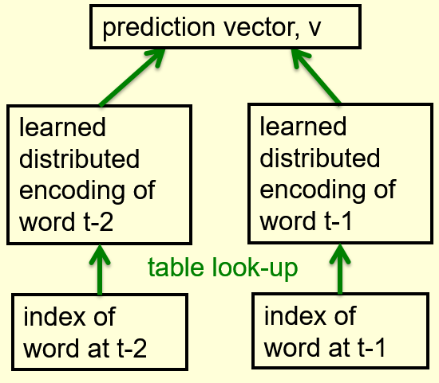
      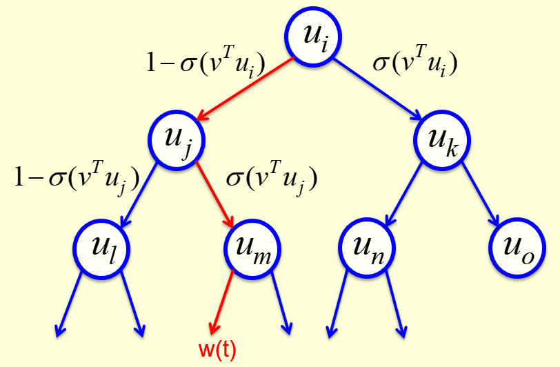
    </a>
  

  + $\sigma$: the logistic function
  + using contexts to learn a prediction vector with the neural net
  + the prediction vector compared with the vectors learned for all the nodes on the path to the correct next word
  + take the path with high sum of their log probabilities: take the higher probability on each node

  + A convenient decomposition
    + maximizing the log probability of picking the target word: $\mathcal{O}(\log(N))$
    + Still slow at test time though a few hundred times faster

### A Unified Architecture for Natural Language Processing

+ Collobert and Weston, [A unified architecture for natural language processing: deep neural networks with multitask learning](https://ronan.collobert.com/pub/matos/2008_nlp_icml.pdf), ICML'08, 2008
4-Multiclasses.md#dealing-with-large-number-of-possible-outputs)
  + learned feature vectors for words
  + applied to many different natural language processing tasks well
  + not try to predict the next word but good feature vectors for words
  + use both the past and future contexts
  + observe a window with 11 words, 5 in the past and 5 in the future
  + the middle word either the correct word actually occurred in the text or a random word
  + train the neural net to produce the output
    + high probability: correct word
    + low probability: random word
  + map the individual words to feature vectors
  + use the feature vectors in the neural net (possible many hidden layers) to predict whether the word correct or not

  

    <a href="http://www.cs.toronto.edu/~hinton/coursera/lecture4/lec4.pptx" ismap target="_blank">
      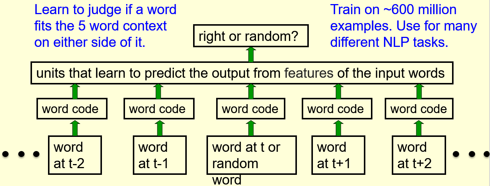
    </a>
  

+ [2D map to display the learned feature vectors](../ML/MLNN-Hinton/04-Multiclasses.md#dealing-with-large-number-of-possible-outputs)
  + get idea of the quality of the learned feature vectors
  + display similar vectors close to each other
  + T-SNE: a multi-scale method to display similarity at different scale

+ [Checking strings of words](../ML/MLNN-Hinton/04-Multiclasses.md#dealing-with-large-number-of-possible-outputs)
  + learned feature vectors capturing lots of subtle semantic distinctions
  + no extra supervision required
  + information of all words in the context

