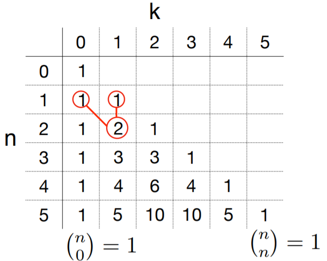

# Probability: Basics

## Basic Concepts

+ [Why should you care about prob&stat?](../Stats/ProbStatsPython/01-Intro.md#11-introduction-to-probability-and-statistics)
  + a powerful tool to deal w/ uncertainty
  + example: Navigation software
    + Certainty: find the _shortest_ route from a to b
    + Uncertainty: find the _fastest_ rout from a to b

+ [What is Probability Theory?](../Stats/ProbStatsPython/01-Intro.md#12-what-is-probability-theory)
  + Probability theory: a __mathematical__ framework for computing the probability of complex events
  + Assumption: __we know the probability of the basic events.__
  + relying on common sense at first
  + executing some experiments summing $k$ random numbers: $S_k = x_1, x_2 + \cdots + x_k$
  + experiments show that the sum $S_k$ is (almost) always in the range $[-4\sqrt{k}, 4\sqrt{k}]$

    \[\begin{align*}
      k \to \infty &\text{ s.t. }\frac{4\sqrt{k}}{k} = \frac{4}{\sqrt{k}} \to 0 \\
      \therefore\; k \to \infty &\text{ s.t. } \frac{S_k}{k} \to 0
    \end{align*}\]

+ [Math interpretation](../Stats/ProbStatsPython/01-Intro.md#12-what-is-probability-theory)
  + math involved in __proving__ (a precise version of) the statements above
  + in most cases, __approximating__ probabilities using simulations (Monte-Carlo simulations)
  + calculating the probabilities is better because
    + providing a precise answer
    + much faster than Monte-Carlo simulations

+ [Random phenomena](../Stats/ProbStatsPython/05-probIntro.md#51-probability)

  <table style="font-family: arial,helvetica,sans-serif; width: 40vw;" table-layout="auto" cellspacing="0" cellpadding="5" border="1" align="center">
    <thead>
    <tr style="font-size: 1.2em;">
      <th style="text-align: center; background-color: #3d64ff; color: #ffffff; width:10%;">Subject</th>
      <th colspan="3" style="text-align: center; background-color: #3d64ff; color: #ffffff; width:20%;">Properties</th>
    </tr>
    </thead>
    <tbody>
    <tr> <th>Learn</th> <td>range</td> <td>average</td> <td>variability</td> </tr>
    <tr> <th>Infer</th> <td>relations</td> <td>structure</td> <td>change</td> </tr>
    <tr> <th>Predict</th> <td>future</td> <td>likelihood</td> <td>guarantees</td> </tr>
    <tr> <th>Benefit</th> <td>understand</td> <td>plan</td> <td>build</td> </tr>
    </tbody>
  </table>

## Basic Sets

+ [Set specification](../Stats/ProbStatsPython/02-Sets.md#21-notation)
  + classification
    + explicit
    + implicit
    + descriptive: {four-letter words} = {love, like, dear, ...}
  + explicit $\to$ implicit $\to$ descriptive: compact & expressive $\to$ ambiguous

+ [Common sets](../Stats/ProbStatsPython/02-Sets.md#21-notation)
  + integers: $\mathbb{Z}$ = {..., -2, -2, 0, 1, 2, ...}
  + natural: $\mathbb{N}$ = {0, 1, 2, ...}
  + positive: \mathbb{P}$ = (1, 2, 3, ...)
  + rationals: $\mathbb{Q}$ = {integer ratios $m/n, \; n \neq 0$}
  + Reals: $\mathbb{R}$ = { ... Google ...}
  + convention:
    + set: Upper case, e.g., A
    + elements: lower case;, e.g., a

+ [Membership](../Stats/ProbStatsPython/02-Sets.md#21-notation)
  + if element $x$ is in a set $A$, it is a member of, or belongs to $A$, denoted $x \in A$
    + e.g., $0 \in \{0, 1\}, \;1 \in \{0, 1\}, \;\pi \in \mathbb{R}$
  + Equivalently, $A$ contains $x$, written $A \ni x$
    + e.g., $\{0, 1\} \ni 0, \;\{0, 1\} \ni 1, \;\mathbb{R} \ni \pi$
  + If $x$ is not in $A$, then $x$ is not a member, or does not belong to $A$, denoted $x \notin A$
    + e.g., $2 \notin \{0, 1\}, \;\pi \notin \mathbb{Q}$
  + Equivalently, $A$ does not contain $x$, $A \not\ni x$
    + e.g., $\{0, 1\} \not\ni 2, \;\mathbb{Q} \not\ni \pi$

+ [Special sets](../Stats/ProbStatsPython/02-Sets.md#21-notation)
  + empty set: containing no elements, $\varnothing$ or $\{ \}$, e.g., $\forall\, x, \,x \in \varnothing$, $\forall$- All, every
  + universal set: all possible elements, $\Omega$, e.g., $\forall\,x, \;x \in \Omega$

+ [Basic Sets](../Stats/ProbStatsPython/02-Sets.md#22-basic-sets)
  + $\{ x \in A \,{\color{Magenta}{|}}\, \dots\} = \{\text{element } x \text{ in } A {\color{Magenta}{\text{ such that }}} \dots \}$ or $\{ x \in A {\color{Magenta}{:}} \dots\}$
  + convention: $[n] = \{1, \dots, n\}$

## Set Relations

+ [Divisibility](../Stats/ProbStatsPython/02-Sets.md#22-basic-sets)
  + $\exists\, m, n \in \mathbb{Z}$, if $n = c \cdot m$ for some $c \in \mathbb{Z}$, we say that n is a multiple of $m$, or $m$ divides $n$ and written $m \mid n$
  + if no such $c$ exists, $m$ does not divide $n$, or $n$ is not a multiple of $m$, denoted $m \nmid n$

+ [Set of multiples](../Stats/ProbStatsPython/02-Sets.md#22-basic-sets)
  + integer multiples of $m$: $\exists\, m \in \mathbb{Z},\; _m\mathbb{Z} \stackrel{\text{def}}{=} \{ i \in \mathbb{Z}: m \mid i\}$
  + multiplies of $m$ in {1..n}: $\exists\; m\in \mathbb{Z}, n \in \mathbb{P}, {}_m[n] \stackrel{\text{def}}{=} \{i \in [n]: m \mid i\}$

+ [Equality](../Stats/ProbStatsPython/02-Sets.md#24-relations)
  + $=$: all elements must be identical, e.g., $\{1, 2, 4\} = \{4, 1, 2\}$
  + $\neq$: one different element enough, e.g., $\{1, 2, 4\} \neq \{4, 1, 2, 8\}$

+ [Intersection](../Stats/ProbStatsPython/02-Sets.md#24-relations)
  + Remarks
    + $\varnothing$ disjoint any set
    + non-empty $\Omega$ intersects every set
    + a set intersects itself $\iff$ non-empty
  + generalization: several sets
    + intersect if all share a common element
    + mutually disjoint if every two are disjoint

+ [Subsets](../Stats/ProbStatsPython/02-Sets.md#24-relations)
  + every element in A is also in B $\implies$ A is a subset of B, denoted $A \,{\color{Magenta}{\subseteq}}\, B$
  + equivalently, B is a superset of, or contains, A, denoted $B \,{\color{Magenta}{\supseteq}}\, A$
  + A has an element that's not in B $\implies$ A is not a subset of B, denote $A {\color{Magenta}{\nsubseteq}} B$, or $B {\color{Magenta}{\nsupseteq}} A$
  + Remarks
    + $\mathbb{P} \subseteq \mathbb{N} \subseteq \mathbb{Z} \subseteq \mathbb{Q} \subseteq \mathbb{R}$
    + $\varnothing \subseteq A \subseteq A \subseteq \Omega$
    + $\subseteq$ is transitive: $A \subseteq B \wedge B \subseteq C \implies A \subseteq B$
    + $A \subseteq B \wedge B \subseteq A \implies A = B$

+ [Strict subset](../Stats/ProbStatsPython/02-Sets.md#24-relations)
  + if $A \subseteq B$ and $A \neq B$, A is a strict subset of B, denoted $A {\color{Magenta}{\subset}} B$, and B  is a strict superset of A, denoted $B {\color{Magenta}{\supset}} A$
    + e.g., $\{0\} \subset \{0, 1\}$, $\{0, 1\} \supset \{0\}$
  + if A is not a strict subset of B, we write $A {\color{Magenta}{\not\subset}} B$ or $B {\color{Magenta}{\not\supset}} A$, w/ two possible reasons

+ [Belongs to $\in$ vs, $\subseteq$ subset of](../Stats/ProbStatsPython/02-Sets.md#24-relations)
  + $\in$: relationship btw an element and a set
  + $\subseteq$: relationship btw two sets

## Set Operations

+ [Complement](../Stats/ProbStatsPython/02-Sets.md#25-operations)
  + the complement $A^c$ of $A$ is the set of $\Omega$ elements not in $A$
  + Definition: (complement set) $A^c = \overline{A} = A^\prime = \{x \in \Omega \mid x \not\in A\}$

+ [Set identities](../Stats/ProbStatsPython/02-Sets.md#25-operations)
  + relations that hold for all sets
  + Remark
    + $\varnothing^c = \Omega \implies \Omega^c = \varnothing$ 
    + $A$ adn $A^c$: disjoint
    + involution: $(A^c)^c = A$
    + $A \subseteq B \to A^c \supseteq B^c$

+ [Intersection](../Stats/ProbStatsPython/02-Sets.md#25-operations)
  + the intersection, $A \,{\color{Magenta}{\cap}}\, B$, is the set of elements in both $A$ and $B$
  + Definition: (intersection) $A \cap B = \{x: x\in A \wedge x \in B\}$

+ [Law of sets](../Stats/ProbStatsPython/02-Sets.md#25-operations)
  + identities - one set
    + identity: $A \cap \Omega = A \quad A \cup \Omega = \Omega$
    + universal bound: $A \cap \varnothing = \varnothing \quad A \cup \varnothing = A$
    + idempotent: $A \cap A = A \quad A \cup A = A$
    + complement: $A \cap A^c = \varnothing \quad A \cup A^c = \Omega$
  + two and three sets
    + commutative: $A \cap B = B \cap A \quad A \cup B = B \cup A$
    + associative: $(A \cap B) \cap C = A \cap (B \cap C) \quad (A \cup B) \cup C = A \cup (B \cup C)$
    + distributive: $A \cap (B \cup C) = (A \cap B) \cup (A \cap C) \quad A \cup (B \cap C) = (A \cup B) \cap (A \cup C)$
    + De Morgan: $(A \cap B)^c = A^c \cup B^c \quad (A \cup B)^c = A^c \cap B^c$

+ [Set difference](../Stats/ProbStatsPython/02-Sets.md#25-operations)
  + the difference, $A {\color{Magenta}{-}} B$, is the set of elements in $A$ but not in $B$
  + Definition: (difference) $A - B = A \backslash B = \{x: x\in A \wedge x \not\in B\}$
  + Remark: $A - B = A \cap B^c$

+ [Symmetric difference](../Stats/ProbStatsPython/02-Sets.md#25-operations)
  + the symmetric difference of two sets is the set of elements in exactly one set
  + Definition: (symmetric difference) $A \Delta B = \{x: x \in A \wedge x \not\in B \vee x \not\in A \wedge x \in B\}$
  + remark: $A \Delta B = (A - B) \cup (B - A)$

+ [Analogies btw number and set operations](../Stats/ProbStatsPython/03-Counting.md#35-cartesian-powers)

  <table style="font-family: arial,helvetica,sans-serif; width: 40vw;" table-layout="auto" cellspacing="0" cellpadding="5" border="1" align="center">
    <thead>
    <tr>
      <th style="text-align: center; background-color: #3d64ff; color: #ffffff; width:10%;">Numbers</th>
      <th style="text-align: center; background-color: #3d64ff; color: #ffffff; width:10%;">Sets</th>
      <th style="text-align: center; background-color: #3d64ff; color: #ffffff; width:10%;">Python Operator</th>
    </tr>
    </thead>
    <tbody>
    <tr> <td style="text-align: center;">Addition</td> <td style="text-align: center;">Disjoint union</td> <td style="text-align: center;">$+$</td> </tr>
    <tr> <td style="text-align: center;">Subtraction</td> <td style="text-align: center;">Complement</td> <td style="text-align: center;">$-$</td> </tr>
    <tr> <td style="text-align: center;">Multiplication</td> <td style="text-align: center;">Cartesian product</td> <td style="text-align: center;">$\times$</td> </tr>
    <tr> <td style="text-align: center;">Exponents</td> <td style="text-align: center;">Cartesian power</td> <td style="text-align: center;">$\ast\ast$</td> </tr>
    </tbody>
  </table>

## Set Counting

+ [Functions](../Stats/ProbStatsPython/03-Counting.md#31-counting)
  + a function f from A to B, denote $f: A \to B$, associates w/ every $a\in A$ and image $f(a) \in B$
  + $f: A \to B$ is 1-1, or injective, if different elements have different images
  + Definition: (injective) $\forall\mid a, a^\prime \in A, a \neq a^\prime \to f(a) \neq f(a^\prime) \text{ and } f(a) = f(a^\prime) \to a = a^\prime$
  + $f: A \to B$ is not 1-1 if $\exists\mid a \neq a^\prime \in A, f(a) = f(a^\prime)$

+ [Set size](../Stats/ProbStatsPython/03-Counting.md#31-counting)
  + the number of elements in a set S is called its size, or cardinality, and denoted $|S|$ or $\#S$
  + $n$-set: set of size $n$

+ [Integer intervals](../Stats/ProbStatsPython/03-Counting.md#31-counting)
  + $m \leq n$: $\{m, \dots, n\} = \{\text{integers from } m \text{ to } n, \text{inclusive}\}$, e.g., $\{3, \dots, 5\} = \{3, 4, 5\}$
  + size: $| \{m, \dots, n\} \mid n-m+1$

+ [Integer multiples](../Stats/ProbStatsPython/03-Counting.md#31-counting)
  + Definition: (integer multiples) $_d(n] = \{ 1 \leq i \leq n: d \mid i\}$
  + remark: 
    + $(n] = [n] = \{ 1, \dots, n\}$
    + size: $|\mid _d(n] \mid| = \lfloor n/d \rfloor$

+ [n Digits: complement](../Stats/ProbStatsPython/03-Counting.md#36-variations)

    \[\begin{align*}
      Z_0^c &= \{x^n: \exists\,i\; x_i \in Z\}^c = \{x^n: \forall\,i\; x_i \notin Z\} = (Z^c)^n \triangleq Z_c\\
      |Z_c| &= |Z^c|^n = 9^n\\\\
      Z_0 &= D^n - Z_c \\
      |Z_0| &= |D^n| - |Z_c|
    \end{align*}\]

## Disjoint Unions

+ [Disjoint unions](../Stats/ProbStatsPython/03-Counting.md#32-disjoint-unions)
  + a union of disjoint sets is called a disjoint union
  + for disjoint union sets, the size of the union is the sum of the size for each set
  + addition rule: `+`
    + numerous applications & implications
    + reason: $\cup \approx +$

+ [Complements](../Stats/ProbStatsPython/03-Counting.md#32-disjoint-unions)
  + Quintessential disjoint sets: $A$ and $A^c$
    + $A \cup A^c = \Omega$
    + $|\Omega| = |A \cup A^c| = |A| + |A^c|$
  + subtraction (or complement) rule: `-`
    + $|A^c| = |\Omega| - |A|$
    + reason: set difference $\approx -$

+ [General subtraction rule](../Stats/ProbStatsPython/03-Counting.md#32-disjoint-unions): $\exists\, A, B \in \Omega \text{ s.t. } |B - A| = |B| - |A|$

## General Union

+ [Union](../Stats/ProbStatsPython/02-Sets.md#25-operations)
  + the union, $A \,{\color{Magenta}{\cup}}\, B$, is the collection of elements in $A$, $B$, or both
  + Definition: (union) $A \cup B = \{x: x \in A \vee x \in B\}$

+ [General unions](../Stats/ProbStatsPython/03-Counting.md#33-general-unions)
  + disjoint A and B: $|A \cup B| = |A| + |B| \to$ size of union = sum of sizes
  + in general: $|A \cup B| \neq |A| + |B|$
  + __Principle of Inclusion-Exclusion (PIE)__: $|A \cup B| = |A| + |B| - |A \cap B|$

+ [Multiple sets](../Stats/ProbStatsPython/02-Sets.md#25-operations)
  + $A \cup B \cup C = \{ x \in \Omega: x \in A \vee x \in B \vee x \in X\}$
  + generally, $\bigcup_{i=1}^t A_i = \{x: \exists\, 1\leq i \leq t, \, x \in A\}$
  + similarly, $\bigcap_{i=1}^t A_i = \{x: \exists\, 1\leq i \leq t, \, x \in A\}$

+ [Multiple sets union](../Stats/ProbStatsPython/03-Counting.md#33-general-unions)
  + two sets: $|A \cup B| = |A| + |B| - |A \cap B|$
  + 3 sets: $|A \cup B \cup C| = |A| + |B| + |C| - |A \cap B| - |B \cap C| - |C \cap A| + |A \cap B \cap C|$
  + n sets:

    \[ \left|\bigcup_{i=1}^n A_i \right| = \sum_{1 \leq i \leq n} |A_i| - \sum_{1 \leq i < j \leq n} |A_i \cap A_j| + \cdots + (-1)^{n-1} \left| \bigcap_{i=1}^n A_i \right| \]

+ [Sanity checks](../Stats/ProbStatsPython/03-Counting.md#33-general-unions)
  + compare PIE to some expected outcomes
  + $A, B$ disjoint: $|A \cup B| = |A| + |B| - |A \cap B| = |A| + |B|$
  + equal sets: $|A \cup A| = |A| + |A| - |A \cap A| = |A|$
  + general union

    \[ \max \{|A|, |B|\} \underbrace{\leq}_{= \iff \\ \text{nested}} |A \cup B| \underbrace{\leq}_{= \iff \\ \text{disjoint}} |A| + |B| \]

+ [n digit: Inclusion-Exclusion](../Stats/ProbStatsPython/03-Counting.md#36-variations)
  + $Z_0 = \{x^n: \exists\,i\; x_i = 0\} \quad x^n \triangleq x_1,\dots,x_n$
  + $Z_i = \{x^n: x_i = 0\}$, e.g., $n=4 \text{ s.t. } Z_2 = \{x0yz\} \quad Z_4 = \{xyz0\}$
  + $Z_0 = Z_1 \cup \dots \cup Z_n$
  
    \[\begin{align*}
      |Z_0| &=\quad |Z_1| + |Z_2| + \cdots + |Z_n| \\
        &\quad- |Z_1 \cap Z_2| - |Z_1 \cap Z_3| - \cdots - |Z_{n-1} \cap Z_n| \\
        &\quad+ |Z_1 \cap Z_2 \cap Z_3| + \cdots + |Z_{n-2} \cap Z_{n-1} \cap Z_n|\\
        &\quad \cdots\\
        &\quad+ (-1)^{n-1} |Z_1 \cap Z_2 \cap \cdots Z_n|
    \end{align*}\]

## Cartesian Products

+ [Tuples and ordered pairs](../Stats/ProbStatsPython/02-Sets.md#26-cartesian-products)
  + set: order and repetition not mattered
  + tuple: both order and repetition matter
  + n-tuple: tuple w/ $n$ elements
  + 2-tuple: order pair

+ [Cartesian products](../Stats/ProbStatsPython/02-Sets.md#26-cartesian-products)
  + the Cartesian product of $A$ and $B$ is the set $A \,{\color{Magenta}{\times}} B$ of ordered pairs $(a, b)$ where $a \in A$ and $b \in B$
  + Definition: (Cartesian product) $A \times B = \{(a, b) | a \in A,\, b \in B\}$
  + Cartesian plane: $\mathbb{R}^2 = \{(x, y) \mid x, y \in \mathbb{R}\}, \; \mathbb{R} \times \mathbb{R} = \mathbb{R}^2$

+ [Identity for Cartesian product](../Stats/ProbStatsPython/02-Sets.md#26-cartesian-products)
  + $A \times \varnothing = \varnothing \times A = \varnothing$
  + $A \times (B \cup C) = A \times B \cup A \times C$
  + $A \times (B \cap C) = A \times B \cap A \times C$
  + $A \times (B - C) = A \times B - A \times C$

+ [Counting of Cartesian products](../Stats/ProbStatsPython/03-Counting.md#34-cartesian-products)
  + the size of a Cartesian product = the product of the set sizes
  + product rule: $|A \times B| = |A| \times |B|$
  + for $n$  sets, $|A_1 \times A_2 \cdots \times A_n| = |A_1| \times \dots \times |A_n|$

## Cartesian Power

+ [Cartesian powers of a set](../Stats/ProbStatsPython/03-Counting.md#35-cartesian-powers)
  + Cartesian product of a set w/ itself is a Cartesian power
  + Cartesian square: $A^2 = A \times A$
  + $n$-th Cartesian power: $A^n \stackrel{\text{def}}{=} \underbrace{A \times A \times \cdots \times A}_{n}$
  
    \[ |A^n| = |A \times A \times A \times \cdots \times A| = |A| \times |A| \times \cdots \times |A| = |A|^n \]

+ [Binary strings](../Stats/ProbStatsPython/03-Counting.md#35-cartesian-powers)
  + n-bit string: $\{0, 1\}^n = \{\text{ length-n binary strings } \}$

+ [Subsets](../Stats/ProbStatsPython/03-Counting.md#35-cartesian-powers)
  + the power set of S, denoted $\mathbb{P}(S)$, is the collection of all subsets of S
  + 1-1 correspondence btw $\mathbb{P}(S)$ (subset of $S$) and $\{0, 1\}^{|S|}$ (binary strings of length $|S|$): mapping $\mathbb{P}(\{a, b\})$ to $\{0, 1\}^2$
  + $|\mathbb{P}(S)| = ?$

      \[ \left|\mathbb{P}(S)\right| = \left| \{0, 1\}^{|S|} \right| = 2^{|S|} \]

  + the size of the power set = the power of the set size

+ [Functions](../Stats/ProbStatsPython/03-Counting.md#35-cartesian-powers)
  + a function from A to B maps every elements $a \in A$ to an element $f(a) \in B$
  + define a function $f:\; $ by specifying $f(a), \;\forall\, a \in A$
  + generalization
    + { function from A to B } $\implies \underbrace{B \times B \times \cdots \times B}_{|A|} = B^{|A|}$
    + $\therefore\; \text{ # functions from A to B } = |B^{|A|}| = |B|^{|A|}$

## Tree Structure

+ [Trees and Cartesian products](../Stats/ProbStatsPython/03-Counting.md#37-trees)
  + tree advantages:
    + a tree representing any set of sequences, not just Cartesian products
    + enabling systematic counting technique
    + useful in modeling random phenomena
  + Cartesian products as trees: used only  when all nodes have same degree at any level

## Factorials

+ [0 factorial](../Stats/ProbStatsPython/04-Combinatorics.md#41-permutations)
  + for $n \geq 1$, n! = \# permutations of an n-set = $n \times (n-1) \times \cdots \times 2 \times 1$
  + $0! = 1 \to$ exact same exact same reason as $2^0 =1$

+ [Recursive definition](../Stats/ProbStatsPython/04-Combinatorics.md#41-permutations)
  + n! defined recursively

    \[\begin{align*}
      n! &= n \times (n-1) \times \cdots \times 2 \times 1 \\
      &= n \times [(n-1) \times \cdots \times 2 \times 1] \\
      &= n \times (n-1)! \quad \forall\, n \geq 1
    \end{align*}\]

  + 0 factorial: 1! = 1 x 0!
  + able to extend to negatives

+ [Stirling's approximations](../Stats/ProbStatsPython/04-Combinatorics.md#41-permutations)
  
  \[ n! \sim \sqrt{2\pi n} \left( \frac{n}{e} \right)^n \]

## Partial Permutations

+ [k-permutations](../Stats/ProbStatsPython/04-Combinatorics.md#42-partial-permutations)
  + n-permutation of an n-set: a permutation of the set
  + \# permutations of k out of n objects $\to$ k-permutations of n
  + \# k-permutations of an n-set
    + def: $n \times (n-1) \times \cdots \times (n-k+1) \stackrel{\text{def}}{=} n^{\underline{k}}$
    + $k$-th falling power of n
    + denoted as $P(n, k)$
  + falling powers simply related to factorial

    \[ n^{\underline{k}} = n \times (n-1) \times \cdots \times (n-k+1) = \frac{n!}{(n-k)!}  \]

## Combinations

+ [k-subsets](../Stats/ProbStatsPython/04-Combinatorics.md#43-combinations)
  + $k$-set: a k-element set
  + $k$-subset: a k-element subset
  + $\dbinom{[n]}{k}$: collection of k-subsets of $[n] = \{1, 2, \dots, n\}$

+ [Sequences w/ k 1's - an analogy to k-element subsets](../Stats/ProbStatsPython/04-Combinatorics.md#43-combinations)
  + $\dbinom{[n]}{k}$: collection of k-subsets of $[n] = \{1, 2, \dots, n\}$
  + 1-1 correspondence to n-bit sequences w/ k 1's
    + same number of elements
    + mostly count sequences
    + same applied to subsets

+ [Number of n-bit sequences w/ k 1's](../Stats/ProbStatsPython/04-Combinatorics.md#43-combinations)
  + binomial coefficient:
    + $\dbinom{n}{k} \triangleq \left|\dbinom{[n]}{k} \right|$ = \# n-bit sequences w/ k 1's
  + locations of 1's
    + ordered pairs from {1, 2, 3}: $\# = 3^\underline{2} = P(3, 2) = 6$
    + non-ordered: $\dbinom{3}{2} = \dfrac{3^{\underline{2}}}{2} = \dfrac{6}{2} = 3$

+ [Calculating the Binomial coefficients](../Stats/ProbStatsPython/04-Combinatorics.md#43-combinations)
  + \# ordered locations: $n^\underline{k} = P(n, k)$
  + every binary sequence w/ k 1's correspondence to k! ordered locations, e.g., $10101 \iff 1,3,5 \quad 1,5,3 \quad 3,1,5 \quad 3,5,1 \quad 5,1,3 \quad 5,3,1$

    \[ k! \dbinom{n}{k} = n^{\underline{k}} \to \dbinom{n}{k} = \frac{n^{\underline{k}}}{k!} = \frac{n!}{k!\,(n-k)!} \]

+ [Simple $\binom{n}{k}$](../Stats/ProbStatsPython/04-Combinatorics.md#43-combinations)
  + all-zero sequence: $\dbinom{n}{0} = \dfrac{n!}{0!n!} = 1$
  + all-one sequence: $\dbinom{n}{n} = \dfrac{n!}{n!0!} = 1$
  + choose location of single 1: $\dbinom{n}{1} = \dfrac{n!}{1!(n-1)!} = n$
    + alternative explanation
      + $\binom{[n]}{2} = \{ \text{n-bit strings w/ two 1's}\}$
      + $A_i = \{x^n: \text{first 1 at location } i\} \quad (1 \leq i \leq n-1)$ (see diagram)
      + $|A_i| = n-i \quad A_i$'s disjoint

## Binomial Coefficients

+ [Theorem: (Symmetry)](../Stats/ProbStatsPython/04-Combinatorics.md#45-properties-of-binomial-coefficient)

    \[ \dbinom{n}{k} = \dbinom{n}{n-k} \]

+ [Theorem: (Recursion)](../Stats/ProbStatsPython/04-Combinatorics.md#45-properties-of-binomial-coefficient)

    \[ \dbinom{n}{k} = \frac{n}{k} \cdot \dbinom{n-1}{k-1} \]

  + Interpretation: Number of length-n ternary strings w/ k-1 1's and one 2

    \[ \dbinom{n}{k} \cdot k = n \cdot \dbinom{n-1}{k-1} \]

+ [Theorem: (Binomial)](../Stats/ProbStatsPython/04-Combinatorics.md#45-properties-of-binomial-coefficient)

  \[ \sum_{i=0}^n \dbinom{n}{i} = 2^n \]

  + interpretation
    + \# subsets of [n] of size $\leq n-1 \to$ \# n-bit sequences w/ $\leq n-1$ 1's
    + e.g., $n = 3 \quad\to\quad \underbrace{000}_{1}, \underbrace{001, 010, 100}_{3}, \underbrace{011, 101, 110}_{3} \quad\to\quad 1 + 3 = 3 = 7$
    + two ways:

      \[\begin{align*} 
        & \sum_{i=0}^{n-1} \dbinom{n}{i} \\\\
        & \sum_{i=0}^{n} \dbinom{n}{i} = 2^n \quad \sum_{i=0}^{n-1} \dbinom{n}{i} = 2^n - \dbinom{n}{n} = 2^n - 1 
      \end{align*}\]

+ [Theorem: (Identity)](../Stats/ProbStatsPython/04-Combinatorics.md#45-properties-of-binomial-coefficient)

  \[ \sum_{i=0}^n \dbinom{i+k-1}{k-1} = \dbinom{n+k}{k} \]

  \[ \dbinom{k-1}{k-1} + \dbinom{k}{k-1} + \cdots + \dbinom{n+k-1}{k-1} = \dbinom{n+k}{k} \]

## Binomial Theorem

+ [Pascal's identity and Triangle](../Stats/ProbStatsPython/04-Combinatorics.md#46-pascal-triangle-and-binomial-theorem)
  + Pascal's identity

    \[ \dbinom{n+1}{k} = \dbinom{n}{k} + \dbinom{n}{k-1} \]

  + Pascal's triangle

    

      
    

+ [Observations for Binomial Theorem](../Stats/ProbStatsPython/04-Combinatorics.md#46-pascal-triangle-and-binomial-theorem)
  + __Theorem__: (Binomial)

    \[ (a+b)^n = \sum_{i=0}^n \dbinom{n}{i} a^{n-i} b^i \quad \forall\, a, b \quad \forall\, n \geq 0 \]

  + so important it gives the binomial coefficients their name
  + generally

    \[ (a+b)^n = \dbinom{n}{0} a^n + \dbinom{n}{1} a^{n-1} b + \cdots + \dbinom{n}{n} b^n = \sum_{i=0}^n \dbinom{n}{i} a^{n-i}b^i \]

+ [Theorem: (Binomial)](../Stats/ProbStatsPython/04-Combinatorics.md#46-pascal-triangle-and-binomial-theorem)

  \[ \sum_{i=0}^n \dbinom{n}{i} = 2^n \]

+ [Polynomial coefficients](../Stats/ProbStatsPython/04-Combinatorics.md#46-pascal-triangle-and-binomial-theorem)

  \[ (1+x)^n = \sum_{i=0}^n \dbinom{n}{i} x^i \]

+ [Binomial $\to$ Taylor](../Stats/ProbStatsPython/04-Combinatorics.md#46-pascal-triangle-and-binomial-theorem)
  + Taylor expression

    \[ e^x = \sum_{i=0}^\infty \frac{x^i}{i!} \]

+ [Binomoial distribution](../Stats/ProbStatsPython/04-Combinatorics.md#46-pascal-triangle-and-binomial-theorem)

  \[ \sum_{i=0}^n \dbinom{n}{i} p^{n-i} (1-p)^i = (p + (1-p))^n = 1^n = 1 \]

## Multinomials

+ [Multinomial coefficients](../Stats/ProbStatsPython/04-Combinatorics.md#47-multinomials)
  + ternary alphabets: $k_1 + k_2 + k_3 = n$
  + \# {1, 2, 3} sequences w/ $\begin{cases} k_1 & \text{1's} \\ k_2 & \text{2's} \\ k_3 & \text{3's} \end{cases}$

    \[ \dbinom{n}{k_1} \dbinom{n-k_1}{k_2} = \dfrac{n!}{k_1! \cdot (n-k)!} \cdot \dfrac{(n-k_1)!}{k_2! \cdot \underbrace{(n - k_1 - k_2)!}_{k_3}} = \dfrac{n!}{k_1! \cdot k_2! \cdot k_3!} \triangleq \dbinom{n}{k_1,k_2,k_3} \]

    + $\binom{n}{k_1}$: $k_1$ location of 1's
    + $\binom{n-k_1}{k_2}$: $k_2$ location of 2's out of $n-k_1$ locations left (location of $k_3$ 3's is determined)
  + binomial as a special case: $\underbrace{\binom{n}{k, n-k}}_{\text{sum to n}} = \binom{n}{k}$

+ [Theorem: (multinomial)](../Stats/ProbStatsPython/04-Combinatorics.md#47-multinomials)

  \[ (a_1 + a_2 + \cdots + a_m)^n = \sum_{\substack{k_1+k_2+\cdots +k_m = n\\ k_1, k_2, \dots, k_m \geq 0}} \dbinom{n}{k_1,k_2,\dots,k_m} \prod_{t=1}^m a_t^{k_t} \]

+ [Sum of multinomials](../Stats/ProbStatsPython/04-Combinatorics.md#47-multinomials)
  + recall binomial identity: $2^n = \sum_{i=0}^n \dbinom{n}{i}$
  + similar for multinomials

    \[ m^n = (1 + 1 + \cdots + 1)^n = \sum_{\substack{k_1+k_2+\cdots+k_m = n\\ k_1,k_2, \dots, k_m \geq 0}} \dbinom{n}{k_1, k_2, \dots, k_m} \]

## Starts and Bars

+ [k terms adding to n](../Stats/ProbStatsPython/04-Combinatorics.md#48-stars-and-bars)
  + \# ways to write n as a sum of k positive integers, when order matters
  + \# sums = $\binom{n-1}{k-1}$

+ [Any sum to $n$](../Stats/ProbStatsPython/04-Combinatorics.md#48-stars-and-bars)
  + \# ways to write n as a sum of (any # of) positive integers

    

      
    

  + n as sum of $k \in [n]$: $\binom{n-1}{k-1}$

    \[ \sum_{k=1}^n \dbinom{n-1}{k-1} = \sum_{i=0}^{n-1} \dbinom{n-1}{i} = 2^{n-1} \]

+ [Non-negative terms adding to n](../Stats/ProbStatsPython/04-Combinatorics.md#48-stars-and-bars)
  + \# ways to write n as sum of k non-negative integers, when order matters (right diagram)
    + \# sequences w/ n starts and k-1 bars
    + \# length $n+(k-1)$ sequences w/ $k-1$ bars

    \[ \dbinom{n+k-1}{k-1} \]

+ [More applications](../Stats/ProbStatsPython/04-Combinatorics.md#48-stars-and-bars)
  + can derive \# positive adding to n
    + \# k positive adding to $n$ = \# k non-negative adding to $n-k$

      \[ \dbinom{(n-k) + k -1}{k-1} = \dbinom{n-1}{k-1} \]

  + can derive \# non-negative adding to $\leq n$
    + \# non-negative adding to $\leq n$ = \# k+1 non-negative adding to n

      \[ \dbinom{n+(k+1) -1}{(k+1)-1} = \dbinom{n+k}{k} \]

## Probability

+ [Outcomes and sample space](../Stats/ProbStatsPython/05-probIntro.md#51-probability)
  + outcomes: possible experiment results
  + sample space: set of possible outcomes, denoted $\Omega, S \text{ or } U$

+ [Two sample-space types](../Stats/ProbStatsPython/05-probIntro.md#51-probability)
  + discrete: finite or countable infinite sample space
    + e.g., $\{h, t\}, \{1, 2, \dots, 6\}, \Bbb{N}, \Bbb{Z}, \{words\}, \{cities\}, \{people\}$
  + continuous: uncountably infinite sample space
    + e.g., $\Bbb{R}, [0, 1], \{\text{temperatures}\}, \underbrace{\{\text{salaries}\}, \{\text{prices}\}}_{\text{upgraded}}$
  + discrete space: easier to understand, visualize, analyze; important; first
  + continuous: important; conceptually harder; later

+ [Probability of an outcome](../Stats/ProbStatsPython/05-probIntro.md#51-probability)
  + the probability, or likelihood, of an outcome $x \in \Omega$, denoted $P(x), \Pr(x)$, or $P(X = x), \Pr(X = x)$, is the fraction of times $x$ will occur when experiment is repeated many times

+ [Probability portrait](../Stats/ProbStatsPython/05-probIntro.md#51-probability)
  + $n$ experiments
  + $x \in \Omega \quad n_x =$ \# times x appeared

    \[ \Pr(x) = \lim_{n \to \infty} \frac{n_x}{n} \]

+ [Probability distribution function](../Stats/ProbStatsPython/05-probIntro.md#51-probability)
  + Probability distribution function (PDF): $\Pr$ mapping outcome in $\Omega$ to nonnegative values that sum to 1
  
    \[ \Pr: \Omega \to \Bbb{R} , \; \Pr(x) \geq 0 \text{ s.t. } \sum_{x\in \Omega} \Pr(x) = 1 \]

  + sample space $\Omega$ + distribution $P$ = probability space

## Uniform Space

+ [Uniform probability spaces](../Stats/ProbStatsPython/05-probIntro.md#52-distribution-types)
  + generally, outcomes may have different probability
  + uniform (equiprobable) spaces: uniform distribution
    + $\forall\, x \in \Omega \quad \Pr(x) = p$
    + $1 = \sum_{x \in \Omega} \Pr(x) = \sum_{x \in \Omega} p = |\Omega| \cdot p$
    + $p = 1 / |\Omega|$
  + notation: denoted $U$, drawing uniformly, randomly

+ [Non-uniform](../Stats/ProbStatsPython/05-probIntro.md#52-distribution-types)
  + uniform, equiprobable, spaces
  + in nature, nonuniform spaces around

+ [Do's and Don'ts](../Stats/ProbStatsPython/05-probIntro.md#52-distribution-types)
  + random notation may be confusing at first
  + which expressions are valid?
    + valid expression
      + $\Pr(x)$ specify $x$
    + possible, but less common, make sure it's what you mean
    + even less likely, probably wrong

## Events

+ [Events](../Stats/ProbStatsPython/05-probIntro.md#53-events)
  + outcome: single element of $\Omega$
  + event: subset of a space $\Omega$

+ [Event probability](../Stats/ProbStatsPython/05-probIntro.md#53-events)
  + $\Pr(E)$: probability of event $E$
  + $\Pr(X \in E)$: probability that $E$ occurs
  + fraction of experiments where $E$ occurs, as \# experiments grows

+ [$\Pr(X) \to \Pr(E)$](../Stats/ProbStatsPython/05-probIntro.md#53-events)
  + general event $E$
    + \# times E occurs = sum of \# times its elements occur

    \[ \Pr(E) &= \Pr(X \in E) = \sum_{x \in E} \Pr(x) \]

+ [Uniform spaces](../Stats/ProbStatsPython/05-probIntro.md#53-events)
  + equiprobable spaces
  + simple formula for probability of
    + outcome: $\Pr(x) = 1/|\Omega|$
    + event

      \[ \Pr(E) = \sum_{x \in E} \Pr(x) = \sum_{x \in E} \dfrac{1}{|\Omega|} = \dfrac{\sum_{x \in E} 1}{|\Omega|} = \frac{|E|}{|\Omega|} \]

## Experiments

+ [Experiments](../Stats/ProbStatsPython/05-probIntro.md#51-probability)
  + probability developed in part to aid science
  + process
    + generate random data
    + observe outcome
  + unified approach
    + applies generally
    + understand
    + analyze
    + generalize

+ [Independent repetitions](../Stats/ProbStatsPython/05-probIntro.md#54-repeated-experiments)
  + repetition: all experiments of same type
  + independent: different components unrelated

+ [Events](../Stats/ProbStatsPython/05-probIntro.md#54-repeated-experiments)
  + probability of event

    \[ \Pr(E) = \Pr(X \in E) = \sum_{x \in E} \Pr(x) \]

  + uniform space: $U \to \Pr(E) = |E|/|\Omega|$

+ [Replacement](../Stats/ProbStatsPython/05-probIntro.md#54-repeated-experiments)
  + two sampling types: with or without replacement
  + sequentially select physical objects
  + with replacement
    + replace (reuse) selected element
    + outcomes can repeat
    + experiments often independent
  + without replacement
    + do not replace (reuse) selected element
    + outcomes cannot repeat
    + experiments dependent
    + cf. difference largest for small $\Omega$

+ [Sampling (selection) With / Without differences](../Stats/ProbStatsPython/05-probIntro.md#54-repeated-experiments)
  + __with__ replacement
    + repeat as if from scratch
    + same element able to be selected again
  + __without__ replacement
    + repeat w/ smaller set
    + same element unable to be selected again

+ [Replacement summary](../Stats/ProbStatsPython/05-probIntro.md#54-repeated-experiments)
  + 2 selections

    <table style="font-family: arial,helvetica,sans-serif; width: 58vw;" table-layout="auto" cellspacing="0" cellpadding="5" border="1" align="center">
      <thead>
      <tr style="font-size: 1.2em;">
        <th style="text-align: center; background-color: #3d64ff; color: #ffffff; width:15%;"></th>
        <th style="text-align: center; background-color: #3d64ff; color: #ffffff; width:10%;">Original</th>
        <th style="text-align: center; background-color: #3d64ff; color: #ffffff; width:15%;">with replacement</th>
        <th style="text-align: center; background-color: #3d64ff; color: #ffffff; width:15%;">without replacement</th>
      </tr>
      </thead>
      <tbody>
      <tr>
        <td style="text-align: center;">Description</td>
        <td style="text-align: center;"></td>
        <td style="text-align: center;">outcomes can repeat</td>
        <td style="text-align: center;">outcomes cannot repeat</td>
      </tr>
      <tr> <td style="text-align: center;">Sample space</td> <td style="text-align: center;">$\Omega_1$</td> <td style="text-align: center;">$\{(x, y): x, y \in \Omega_1 \} = \Omega_1^2$</td> <td style="text-align: center;">$\{(x, y): x, y \in \Omega_1, x \neq y \} = \Omega_1^{\underline{2}}$</td> </tr>
      <tr> <td style="text-align: center;">| Sample space |</td> <td style="text-align: center;">$|\Omega_1|$</td> <td style="text-align: center;">$|\Omega_1^2|$</td> <td style="text-align: center;">$|\Omega_1^{\underline{2}}| = |\Omega_1| \cdot (|\Omega_1| - 1)$</td> </tr>
      </tbody>
    </table>

  + probabilities if original sample space uniform

    <table style="font-family: arial,helvetica,sans-serif; width: 50vw;" table-layout="auto" cellspacing="0" cellpadding="5" border="1" align="center">
      <thead>
      <tr style="font-size: 1.2em;">
        <th style="text-align: center; background-color: #3d64ff; color: #ffffff; width:10%;"></th>
        <th style="text-align: center; background-color: #3d64ff; color: #ffffff; width:10%;">Original</th>
        <th style="text-align: center; background-color: #3d64ff; color: #ffffff; width:20%;">with replacement</th>
        <th style="text-align: center; background-color: #3d64ff; color: #ffffff; width:20%;">without replacement</th>
      </tr>
      </thead>
      <tbody>
      <tr> <td style="text-align: center;">Uniformity</td> <td style="text-align: center;">Uniform</td> <td style="text-align: center;">Uniform</td> <td style="text-align: center;">Uniform</td> </tr>
      <tr> <td style="text-align: center;">$\Pr(\text{ element })$</td> <td style="text-align: center;">$1 / \Omega_1$</td> <td style="text-align: center;">$1 / |\Omega_1|^2$</td> <td style="text-align: center;">$1 / \left(|\Omega_1| \cdot (|\Omega_1| - 1) \right)$</td> </tr>
      </tbody>
    </table>

+ [Order not matter](../Stats/ProbStatsPython/05-probIntro.md#54-repeated-experiments)
  + $\to$: order matter, easier to calculate
  + $\gets$ order not matter, considering w/ & w/o replacement

+ [Order consideration with replacement](../Stats/ProbStatsPython/05-probIntro.md#54-repeated-experiments)
  + order: remaining uniform
    + $\to$, not matter: not uniform
  + sanity check: $\sum$ Probabilities = 1

+ [Order consideration w/o replacement](../Stats/ProbStatsPython/05-probIntro.md#54-repeated-experiments)
  + order:
    + $\gets$, matter: remaining unifrom
    + $\to$, not matter: remaining uniform
  + sanity check: probabilities sum to 1

## Probability Axioms

+ [Three axioms](../Stats/ProbStatsPython/05-probIntro.md#56-axiomatic-formulation)
  + Non-negative:
  
    \[ \forall\, A, \Pr(A) \geq 0 \]

  + Unitary: 
  
    \[ \Pr(\Omega) = 1 \]

  + Addition rule:

    \[ A, B \text{ disjoint} \implies P(A \cup B) = P(A) + P(B) \]

    + generalization

      \[ A_1, A_2, \dots \text{ disjoint} \implies P(A_1 \cup A_2 \cdots) = P(A_1) + P(A_2) + \cdots \]

    + applied to countable unions only

+ [Complement rule for probability](../Stats/ProbStatsPython/05-probIntro.md#56-axiomatic-formulation): $\Pr(A^c) = 1 - \Pr(A)$

+ [Subtraction rule - nested sets](../Stats/ProbStatsPython/05-probIntro.md#56-axiomatic-formulation): $\Pr(B-A) = \Pr(B) - \Pr(A)$

+ [Subtraction rule - general sets](../Stats/ProbStatsPython/05-probIntro.md#56-axiomatic-formulation)
  + Nested: $A \subseteq B \;\text{ s.t. }\; \Pr(B-A) = \Pr(B) - \Pr(A)$
  + general: $\forall\, A, B \;\text{ s.t. }\; \Pr(B-A) = \Pr(B) - \Pr(A \cap B)$

+ [Inclusion-exclusion](../Stats/ProbStatsPython/05-probIntro.md#56-axiomatic-formulation)
  + $\Pr(A \cup B) = \Pr(A) + \Pr(B) - \Pr(A \cap B)$
  + two sets: $\Pr(A \cup B) = \Pr(A) + \Pr(B) - \Pr(A \cap B)$
  + three sets: 
  
    \[\begin{align*}
      \Pr(A \cup B \cup C) &= \Pr(A) + \Pr(B) + \Pr(C) \\
      &\hspace{1.0em} - \Pr(A \cap B) - \Pr(A \cap B) - \Pr(B \cap C) \\
      &\hspace{1.0em} + \Pr(A \cap B \cap C)
    \end{align*}\]

  + n sets

    \[ \Pr\left(\bigcup_{i=1}^n A_i \right) = \sum_{1 \leq i \leq n} \Pr(A_i) - \sum_{1\leq i < j \leq n} \Pr(A_i \cap A_j) + \cdots + (-1)^{n-1} \Pr\left( \bigcap_{i=1}^n A_i \right) \]

## Inequalities

+ [Probability of null event](../Stats/ProbStatsPython/05-probIntro.md#57-inequalities)
  + $\Pr(\varnothing) = 0$
  + the null event has nil probability

+ [Probability value range](../Stats/ProbStatsPython/05-probIntro.md#57-inequalities)
  + $0 \leq \Pr(A) \leq 1$
  + probability always between 0 and 1

+ [Subset](../Stats/ProbStatsPython/05-probIntro.md#57-inequalities)
  + $A \subseteq B \to \Pr(A) \leq \Pr(B)$

+ [Union](../Stats/ProbStatsPython/05-probIntro.md#57-inequalities)
  + $\max(\Pr(A), \Pr(B)) \leq \Pr(A \cup B) \leq \Pr(A) + \Pr(B)$
  + Union bound: $\Pr(A \cup B) \leq \Pr(A) + \Pr(B) \to$ very useful

## Conditional Probability

+ [Motivation](../Stats/ProbStatsPython/06-CondProb.md#61-conditional-probability)
  + modifying event probabilities
  + importance
    + improving estimates
    + helping determine original unconditional probabilities

+ [Intuitive definition](../Stats/ProbStatsPython/06-CondProb.md#61-conditional-probability)
  
  \[\begin{align*}
    \Pr(F \mid E) &= \text{probability that $F$ happens given that $E$ happened} \\
    & = \text{fraction pf $E$ occurrences that F also occur}
  \end{align*}\]

+ [General events - uniform spaces](../Stats/ProbStatsPython/06-CondProb.md#61-conditional-probability)
  
  \[ \Pr(F \mid E) = \frac{|E \cap F|}{|E|} \]

+ [General spaces](../Stats/ProbStatsPython/06-CondProb.md#61-conditional-probability)
  
  \[ \Pr(F \mid E) \frac{\Pr(E \cap F)}{\Pr(E)} \]

+ [Product rule](../Stats/ProbStatsPython/06-CondProb.md#61-conditional-probability)

  \[ \Pr(F \mid E) = \frac{\Pr(E \cap F)}{\Pr(E)}  \to \Pr(E \cap F) = \Pr(E) \cdot \Pr(F \mid E) \]

+ [General product rule](../Stats/ProbStatsPython/06-CondProb.md#61-conditional-probability)

  \[\begin{align*}
    \Pr(E \cap  F \cap G) &= \Pr((E \cap G) \cap G) = \Pr(E \cap F) \cdot \Pr(G \mid E \cap F) \\
    &= \Pr(E) \cdot \Pr(F \mid E) \cdot \Pr(G \mid E \cap F)
  \end{align*}\]

## Independence
  
+ [Independence](../Stats/ProbStatsPython/06-CondProb.md#62-independence)
  + informal definition: (independence) Events $E$ and $F$ are independent ($ E {\perp \!\!\!\! \perp} F$) if occurrence of one does not change the probability  that the other occurs.

    \[ \Pr(F) = \Pr(F \mid E) \triangleq \dfrac{\Pr(E \cap F)}{\Pr(E)} \]

  + two issues:
    + asymmetric: $\Pr(E \mid F)$
    + undefined if $\Pr(E) = 0$
  + formal definition: (independent) $E$ and $F$ are independent if $\Pr(E \cap F) = \Pr(E) \cdot \Pr(F)$, otherwise, dependent
  + symmetric and applied when $\Pr(\varnothing) = 0$
  + $\implies$ to intuitive definition
    + symmetric: $\Pr(F \mid E) = \Pr(F) \quad \Pr(E \mid F) = \Pr(E)$
    + $\Pr(F \mid \overline{E}) = \Pr(F) \quad \Pr(E \mid \overline{F}) = \Pr(E)$

+ [Independence of $\Omega$ and $\varnothing$](../Stats/ProbStatsPython/06-CondProb.md#62-independence)
  + $\Omega {\perp \!\!\!\! \perp}$ of any event
  + $\varnothing {\perp \!\!\!\! \perp}$ of any event

## Sequential Probability

+ [Product / chain rule](../Stats/ProbStatsPython/06-CondProb.md#63-sequential-probability)
  + two sets

    \[ \Pr(F \mid E) = \frac{\Pr(E \cap F)}{\Pr(E)} \to \Pr(E \cap F) = \Pr(E) \cdot \Pr(F | E) \]

  + three sets

    \[\begin{align*}
      \Pr(E \cap F \cap G) &=  \Pr((E \cap F) \cap G) = \Pr(E \cap F) \cdot \Pr(G \mid E \cap F) \\
      &= \Pr(E) \cdot \Pr(D \mid E) \cdot \Pr(G \mid E \cap F)
    \end{align*}\]

## Total Probability

+ [Law of total probability](../Stats/ProbStatsPython/06-CondProb.md#64-total-probability)
  + $F = (E \cap F) \cup (E^c \cap F)$ s.t.

    \[\begin{align*}
      \Pr(F) &= \Pr()E \cap F) + \Pr(E^c \cap F)  \quad (\text{Product rule}) \\
      &= \Pr(E) \cdot \Pr(F \mid E) + \Pr(E^c) \cdot \Pr(F \mid E^c)
    \end{align*}\]

+ [Total probability - n conditions](../Stats/ProbStatsPython/06-CondProb.md#64-total-probability)
  + Let $E_1, E_2, \dots, E_n$ partition $\Omega$
  + $F = \displaystyle \biguplus_{i=1}^n (E_i \cap F)$ s.t.

    \[ \Pr(F) = \sum_{i=1}^n \Pr(E_i \cap F) = \sum_{i=1}^n \Pr(E_i) \cdot \Pr(F \mid E_i) \]

## Bayes' Rule

+ [Bayes' rule](../Stats/ProbStatsPython/06-CondProb.md#65-bayes-rule)
  + given $\Pr(F \mid E)$ (and a bit more, e.g., $\Pr(E), \Pr(F)$) determining $\Pr(E \mid F)$

    \[ \Pr(E \mid F) = \frac{\Pr(E) \cdot \Pr(F \mid E)}{\Pr(F)} \]

  + another view

    \[ \Pr(F) \cdot \Pr(E \mid F) = \Pr(E \cap F) = \Pr(E) \cdot \Pr(F \mid E) \]

## Random variables

+ [Types of random variables](../Stats/ProbStatsPython/07-RvMeanVar.md#71-random-variables)
  + discrete
  + continuous
  + mixed

+ [Specification of distribution](../Stats/ProbStatsPython/07-RvMeanVar.md#71-random-variables)
  + old fashion
    + explicit
    + table
  + with numbers:
    + function
    + graphs

      

        
      

+ [Probability mass function](../Stats/ProbStatsPython/07-RvMeanVar.md#71-random-variables)
  + $\Omega$:
    + random variable $\to \subseteq \Bbb{R}$
    + discrete $\to$ finite or countably infinite
  + $p$:
    + $p(x) \geq 0 \quad \forall\, x \in \Omega$
    + $\sum_{x \in \Omega} p(x) = 1$
  + if $X$ is distributed according to $p$, denoted $X \sim p$

+ [Types of discrete distributions](../Stats/ProbStatsPython/07-RvMeanVar.md#71-random-variables)
  + finite: $|\Omega| = n \in \Bbb{P}$
  + infinite: $|\Omega| = \infty = \aleph_0$

+ Finite distributions
  + $\exists\, |\Omega| = n$ specifying pmf, $p_1, p_2, \dots, p_n$

    \[ \forall\, 1 \leq i \leq n \quad p_i \geq 0 \qquad \sum_{i=1}^n p_i = 1 \]
  
  + uniform: $p_1 = p_2 = \cdots, p_n = 1/n$
  + increasing: $p_1 \leq p_2 \leq \cdots \leq p_n$
  + decreasing: $p_1 \geq p_2 \geq \cdots \geq p_n$

+ [Infinite distributions](../Stats/ProbStatsPython/07-RvMeanVar.md#71-random-variables)
  + $|\Omega| = \infty$
  + one-side infinite
    + unable to be uniform
    + unable to be increasing
    + able to be decreasing
  + double infinite

## Cumulative Distribution Function

+ [Cumulative distribution function](../Stats/ProbStatsPython/07-RvMeanVar.md#72-cumulative-distribution-function)
  + probability mass function (pmf): $p: \Omega \to \Bbb{R}$
  + cumulative distribution function (cdf): $F: \Bbb{R} \to \Bbb{R}$

    \[\begin{align*}
      F(x) &\stackrel{\text{def}}{=}\, \Pr(X \in (-\infty, x]) \\
      &\stackrel{\text{def}}{=}\, \Pr(X \leq x) = \sum_{u \leq x} p(u)
    \end{align*}\]

+ [Properties](../Stats/ProbStatsPython/07-RvMeanVar.md#72-cumulative-distribution-function)
  + nondecreasing: $x \leq y \to F(x) \leq F(y)$
  + limits: $\displaystyle \lim_{x \to -\infty} F(x) = 0 \qquad \lim_{x \to \infty} F(x) = 1$
  + right-continuous: $\displaystyle \lim_{x \searrow a} F(x) = F(a)$

+ [Interval probabilities](../Stats/ProbStatsPython/07-RvMeanVar.md#72-cumulative-distribution-function)
  + by definition: $\Pr(X \leq a) = F(a)$
  + $\Pr(X > a) = 1 - \Pr(X \leq a) = 1 - F(a)$
  + $\Pr(a < X \leq b) = \Pr((X \leq b) - (X \leq a)) = \Pr(X \leq b) - \Pr(X \leq a) = F(b) - F(a)$

## Expectation

+ [Expectation](../Stats/ProbStatsPython/07-RvMeanVar.md#73-expectation)
  + w/ $n \to \infty$ samples, $x$ appear $\to p(x) \cdot n$ times
  + expectation / mean

    \[ E(X) \,\stackrel{\text{def}}{=}\, \sum_x \Pr(x) \cdot x = \frac{\sum_x [\Pr(x) \cdot n] \cdot n}{n} \]

  + $E(x)$ also denoted $EX, \mu_x, \mu$
  + not random, constant, property of the distribution

+ [Symmetry](../Stats/ProbStatsPython/07-RvMeanVar.md#73-expectation)
  + a distribution $p$ is symmetric around $a$ if $\forall\, x > 0, p(a+x) = p(a-x)$
  + $p$ is symmetric around $a \implies E(x) = a$

+ [Uniform variables](../Stats/ProbStatsPython/07-RvMeanVar.md#73-expectation)

    \[\begin{align*}
      p(x) &= \frac{1}{|\Omega|} \\
      E(X) &= \sum_{x \in \Omega} \,p(x) \cdot x = \sum_{x \in \Omega} \frac{1}{|\Omega|} \cdot x = \frac{1}{|\Omega|} \sum_{x \in \Omega} x
    \end{align*}\]

+ [Properties of expectation](../Stats/ProbStatsPython/07-RvMeanVar.md#73-expectation)
  + $E(x)$
    + not random
    + number
    + property of distribution
  + $x_{\min} \leq E(x) \leq x_{\max}$
    + $=$ holds $\iff X = c, \quad c$ as a constant
  + $X$ as a constant, viz. $X = c \to E(X) = c$
  + $E(E(X)) = E(X)$

+ [Infinite expectation](../Stats/ProbStatsPython/07-RvMeanVar.md#73-expectation)
  + $E(X) = \sum_{i=1}^\infty i \cdot p_i = \frac{6}{\pi^2} \sum_{i=1}^\infty \frac{1}{i} = \infty$
  + many samples: average will go to $\infty$

## Variance

+ [Variance](../Stats/ProbStatsPython/07-RvMeanVar.md#76-variance)
  + expected squared difference btw $X$ and its mean

    \[ Var(X) = E[(X - \mu)^2] = E(X - \mu)^2] \]

  + standard deviation

    \[ \sigma_X = +\sqrt{Var(X)} \]

  + constants
  + properties of distribution

+ [Different formula](../Stats/ProbStatsPython/07-RvMeanVar.md#76-variance)
  
  \[ Var(X) = E[(X - \mu)^2] = E[X^2] - (E[X])^2 \]

+ [Observation](../Stats/ProbStatsPython/07-RvMeanVar.md#76-variance)
  + $Var(X) = E[(X - \mu)^2]$
  
    \[\begin{array}{lcccr}
      0 &\le & Var(X) & \le & \max((X-\mu)^2) \\
      0 &\le & \sigma_x & \le & \max(|X - \mu|)
    \end{array}\]

    + left `=`: $X$ is a constant
    + right `=`: $X$ constant or taking two values w/ equal prob.

  + $Var(X) = E[X^2] - \mu^2 \to Var(X) \le E[X^2]$

+ [Addition](../Stats/ProbStatsPython/07-RvMeanVar.md#76-variance)
  + linearity of expectation: $\mu_{x+b} = \mu_x + b$
  + addition of variance
  
    \[ Var(X+b) = E[(X + b - \mu_{x+b})^2] = E[(X + b - \mu_x -b)^2] = E[(X - \mu_x)^2] = Var(X) \]

+ [Scaling](../Stats/ProbStatsPython/07-RvMeanVar.md#76-variance)
  + variance: different from mean grew by $a^2$

    \[ Var(aX) =  a^2 Var(X) \]

  + standard deviation: "average" difference from mean grew by a factor of $|a|$
  
    \[ \sigma_{aX} = \sqrt{Var(aX)} = \sqrt{a^2 Var(X)} = |a| \sigma_x \]

  

    
  

+ [Affine transformation](../Stats/ProbStatsPython/07-RvMeanVar.md#76-variance)
  + $Var(aX + b) = Var(aX) = a^2 Var(X)$
  + $\sigma_{ax+b} = |a| \sigma_x$

## Modification

+ [Functions of a random variable](../Stats/ProbStatsPython/07-RvMeanVar.md#74-variable-modifications)
  + random variables $X$ taking values in $\Bbb{R}$
  + often interested in related variable
    + $Y = g(X)$ w/ $g: \Bbb{R} \to \Bbb{R}$ is a fixed function
  + deterministic Functions
    + $Y = g(X)$: $g$ is a deterministic function over $\Bbb{R}$ (or $\Omega$)
    + all randomness in $Y$ derived from $X$
    + deterministically modified by $g$

+ [Translation](../Stats/ProbStatsPython/07-RvMeanVar.md#74-variable-modifications)
  + add constant $b$ to $X$ = translate $X$ by $b$
  + $Y = X +b$
  + $\Pr(Y=y) = \Pr(X+b = y) = \Pr(X=y-b)$

  

    
  

+ [Scaling](../Stats/ProbStatsPython/07-RvMeanVar.md#74-variable-modifications)
  + scale $X$ by a factor $b$, $Y = b \cdot X$
  + $\Pr(Y=y) = \Pr(bX = y) = \Pr(X = y/b)$

  

    
  

+ [Reverse mapping](../Stats/ProbStatsPython/07-RvMeanVar.md#74-variable-modifications)

  \[ \Pr(Y=y) = \Pr(g(X) = y) = \Pr(X \in g^{-1}(y)) = \sum_{x \in g^{-1}(y)} \Pr(X=x) \]

## Expectation of Functions of Random Variables

+ [Expectation formulation](../Stats/ProbStatsPython/07-RvMeanVar.md#75-expectation-of-functions-of-random-variables)

  \[\begin{align*}
    E(Y) &= \sum_y y \cdot \Pr(Y=y) = \sum_y y \cdot \Pr(X \in g^{-1}(y)) = \sum_y y \sum_{x \in g^{-1}(y)} p(x) \\
    &= \sum_y \sum_{x \in g^{-1}(y)} y \cdot p(x) = \sum_y \sum_{x \in g^{-1}(y)} g(x) \cdot p(x) = \sum_x g(x) \cdot p(x)
  \end{align*}\]

+ [Constant addition](../Stats/ProbStatsPython/07-RvMeanVar.md#75-expectation-of-functions-of-random-variables)

  \[\begin{align*}
    E(X + b) &= \sum p(x) \cdot (x + b) = \sum p(x) \cdot x + \sum p(x) \cdot b = E(X) + b \cdot \sum p(x) \\
    &= E(X) + b
  \end{align*}\]

+ [Constant multiplication](../Stats/ProbStatsPython/07-RvMeanVar.md#75-expectation-of-functions-of-random-variables)
  
  \[ E(aX) = \sum p(x) \cdot (ax) = a \sum p(x) \cdot a = a E(X) \]

+ [Linearity of expectation](../Stats/ProbStatsPython/07-RvMeanVar.md#75-expectation-of-functions-of-random-variables)

  \[ E(aX + b) = E(aX) + b = aE(X) + b \]

## Multivariate

+ [Join distribution](../Stats/ProbStatsPython/07-RvMeanVar.md#77-two-variables)

  <table style="font-family: arial,helvetica,sans-serif; width: 55vw;" table-layout="auto" cellspacing="0" cellpadding="5" border="1" align="center">
    <thead>
    <tr style="font-size: 1.2em;">
      <th style="text-align: center; background-color: #3d64ff; color: #ffffff; width:10%;"># Variables</th>
      <th style="text-align: center; background-color: #3d64ff; color: #ffffff; width:10%;">Variable Names</th>
      <th style="text-align: center; background-color: #3d64ff; color: #ffffff; width:10%;">Sample Space</th>
      <th style="text-align: center; background-color: #3d64ff; color: #ffffff; width:10%;">Prob.</th>
      <th style="text-align: center; background-color: #3d64ff; color: #ffffff; width:10%;">Abbr.</th>
      <th style="text-align: center; background-color: #3d64ff; color: #ffffff; width:20%;">Properties</th>
    </tr>
    </thead>
    <tbody>
    <tr>
      <th>One</th> <td style="text-align: center;">X</td> <td style="text-align: center;">$X$</td> <td style="text-align: center;">$p(X = x)$</td> <td style="text-align: center;">$p(x)$</td> <td style="text-align: center;">$p(x) \ge 1 \\ \sum_x p(x) =1$</td>
    </tr>
    <tr>
      <th>Two</th> <td style="text-align: center;">X, Y</td> <td style="text-align: center;">$X \times Y$</td> <td style="text-align: center;">$p((X, Y) = (x, y))$</td> <td style="text-align: center;">$p(x, y)$</td> <td style="text-align: center;">$p(x, y) \ge 0 \\ \sum_{x, y} p(x, y) = 1$</td>
    </tr>
    </tbody>
  </table>

+ [Specification](../Stats/ProbStatsPython/07-RvMeanVar.md#77-two-variables)
  + state probability of every possible $(x, y)$ pair
  + ways to representation
    + table: 1-d
    + structure: 2-d
    + structured distributions

+ [General $B(p)$](../Stats/ProbStatsPython/07-RvMeanVar.md#77-two-variables)
  + $U \sim B(p), V \sim B(q), B {\perp \!\!\!\! \perp} V$
  + $X = \min(U, V), Y = \max(U, V)$

    

      
    

+ [Join distribution](../Stats/ProbStatsPython/07-RvMeanVar.md#77-two-variables)
  + joint distribution: probability of every possible $(x, y)$ pair

    \[ p(x, y) \stackrel{\text{def}}{=} \Pr(X = x, Y=y) \]

  + properties
    + $\forall\, x, y, \;p(x, y) \ge 0$
    + $\sum_{x, y} p(x, y) = 1$

  + omnipotent
    + joint distribution determines all probabilities of interest

    \[\begin{align*}
      \Pr(X \le Y) &= \Pr(X=0, Y=0) + \Pr(X = 0, Y = 1) + \Pr(X=1, Y=1) \\
      &= \Pr(0, 0) + \Pr(0, 1) + \Pr(1, 1) = 0.1 + 0.2 + 0.4 = 0.7
    \end{align*}\]

+ [Marginals](../Stats/ProbStatsPython/07-RvMeanVar.md#77-two-variables)
  + margin of $X$: $\Pr(x) \stackrel{\text{def}}{=} P_x(x) \stackrel{\text{def}}{=} \Pr(X = x) = \sum_y p(x, y)$
  + margin of $Y$: $\Pr(y) \stackrel{\text{def}}{=} P_Y(y) \stackrel{\text{def}}{=} \Pr(Y = y) = \sum_x p(x, y)$
  + very different join distributions able to have the same marginals

+ Conditionals

  \[ \Pr(X \mid y) = \frac{p(x, y)}{p(y)} \quad \Pr(y \mid x) = \frac{p(x, y)}{p(x)} \]

+ [Independence](../Stats/ProbStatsPython/07-RvMeanVar.md#77-two-variables)
  + $X, Y$ independent: $X {\perp \!\!\!\! \perp} Y$
  + $\forall\, x, y$

    \[\begin{align*}
      p(y \mid x) &= p(y) \qquad \text{Value of $X$ not affect distribution of $Y$} \\
      p(x \mid y) &= p(x) \qquad \text{Value of $Y$ not affect distribution of $X$} \\
      p(x, y) &= p(x) \cdot p(y) \gets \text{ more robust} \hspace{2em} \text{Formal}
    \end{align*}\]

  + quick checking

    \[\begin{align*}
      \text{independent} &\to \text{rows proportional to each other} \\
      &\to \text{columns proportional to each other}
    \end{align*}\]

## Linearity of Expectation

+ [Functions of two variables](../Stats/ProbStatsPython/07-RvMeanVar.md#78-linearity-of-expectations)

    \[ \Pr(g(X, Y) = z) = \Pr((X, Y) \in g^{-1}(z)) = \sum_{(x, y) \in g^{-1}(z)} p(x, y) \]

+ [Two unconscious statisticians](../Stats/ProbStatsPython/07-RvMeanVar.md#78-linearity-of-expectations)

  \[ E_g(X, Y) = \sum_{x, y} g(x, y) p(x, y) \]

+ [Linearity of expectation](../Stats/ProbStatsPython/07-RvMeanVar.md#78-linearity-of-expectations)

  \[ E[X+Y] = \sum_x \sum_y (x+y) \cdot p(x, y) = E[X] + E[Y] \]

+ [Variance](../Stats/ProbStatsPython/07-RvMeanVar.md#78-linearity-of-expectations)

    \[ Var(X+Y) = = Var(X) + Var(Y) + \underbrace{2(E[XY] - E[X] \cdot E[Y])}_{E[XY] \stackrel{?}{=} E[X]\cdot E[Y]} \]

## Covariance

+ [Product expectations - general](../Stats/ProbStatsPython/07-RvMeanVar.md#79-covariance)
  + $\forall, \alpha, \beta, \gamma\quad \exists\, X, Y$ w/: $E[X] = \alpha \quad E[Y] = \beta \quad E[XY] = \gamma$
  + $X = (\gamma - \alpha \beta) X^\prime + \alpha \to E[X] = \alpha$
  + $Y = Y^\prime + \beta \to E[Y] = \beta$

    \[ E[XY] = E[((\gamma - \alpha \beta) X^\prime + \alpha)(Y^\prime + \beta)] = \gamma \]

+ [Covariance](../Stats/ProbStatsPython/07-RvMeanVar.md#79-covariance)
  + 'centralizing' $X, Y$, consider expectation of centralized product

    \[ \sigma_{X, Y} \triangleq Cov(X, Y) \triangleq E[(X - \mu_X)\cdot (Y - \mu_Y)]) = E[XY] - \mu_X \mu_Y \]

+ [Pearson's Correlation coefficient](../Stats/ProbStatsPython/07-RvMeanVar.md#79-covariance)

    \[ \rho_{XY} = \frac{Cov(X, Y)}{\sigma_X \sigma_Y} \]

  + properties
    + $\rho_{X, Y} = 1 \quad \rho_{X, -X} = -1$
    + $\rho_{X, Y} = \rho_{Y, X}$
    + $\rho_{aX+b, cX+d} = \text{sign}(ac) \cdot \rho_{X, Y} \quad \text{sign}(x) = \begin{cases} 1 & x >0 \\ 0 & x =0 \\ -1 & x < 0 \end{cases}$
  + if $X \nearrow$ by $\sigma_X$, by how many $\sigma_Y$ do we expect $Y$ to $\nearrow$
  + bounds on $\sigma_{X, Y}?$

+ [Cauchy-Schwarz inequality](../Stats/ProbStatsPython/07-RvMeanVar.md#79-covariance)
  + $E[X \cdot Y]$ unable to take all possible values, viz.

    \[ |E[XY] \le \sqrt{E[X^2]} \cdot \sqrt{E[Y^2]} \]

  + corollary

    \[ |\sigma_{X, Y}| \le \sigma_X \cdot \sigma_Y \quad \rho_{X, Y} \triangleq \frac{Cov(X, Y)}{\sigma_X \cdot \sigma_Y}  \to |\rho_{X, Y}| \le 1 \]

+ [2nd Covariance formulation](../Stats/ProbStatsPython/07-RvMeanVar.md#79-covariance)

  \[ Cov(X, Y) \triangleq E[(X - \mu_X) \cdot (Y - \mu_Y)] = E[XY - X \mu_Y - \mu_Y Y + \mu_X \mu_Y] = E[XY] - \mu_X \mu_Y \]

  + if $X$ increasing by 1 $\to Y$ increasing by $\dfrac{Cov(X, Y)}{Var(X)}$

+ [Properties](../Stats/ProbStatsPython/07-RvMeanVar.md#79-covariance)

  \[\begin{align*}
    Cov(X, X) &= E[X^2] - \mu_X^2 = Var(X) \\
    Cov(X, Y) &= E[(X - \mu_X)(Y - \mu_Y)] = Cov(Y, X)\\
    Cov(aX, Y) &= a Cov(X, Y) \\
    Cov(X + a, Y) &= Cov(X, Y)
  \end{align*}\]

+ [Covariance](../Stats/ProbStatsPython/07-RvMeanVar.md#79-covariance)
  + $Var(X+Y) \gtrless Var(X) + Var(Y)$
  + $X \perp Y \iff \sigma_{X, Y} = 0 \iff Var(X+Y) = Var(X) + Var()Y)$
  + $X {\perp \!\!\!\! \perp} Y \to X \perp Y \to Var(X+Y) = Var(X) + Var(Y)$

+ [Covariance vs. Corelation Coefficient](../Stats/ProbStatsPython/07-RvMeanVar.md#79-covariance)
  + same
    + $\ge$ if increasing together
    + $\le$ if decreasing together
    + higher absolute value if relation close to linear
  + different
    + covariance: change w/ size of variables
    + correlation: insensitive to variable size

+ [Independence and uncorrelated](../Stats/ProbStatsPython/07-RvMeanVar.md#79-covariance)
  + independence $\implies$ uncorrelated: ${\perp \!\!\!\! \perp} \implies \perp$
  + uncorrelated $\stackrel{?}{\implies}$ independence

