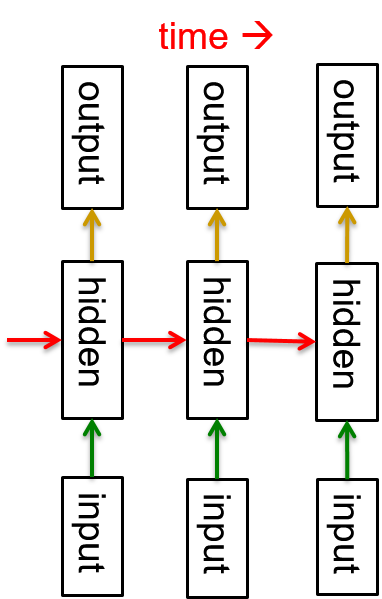
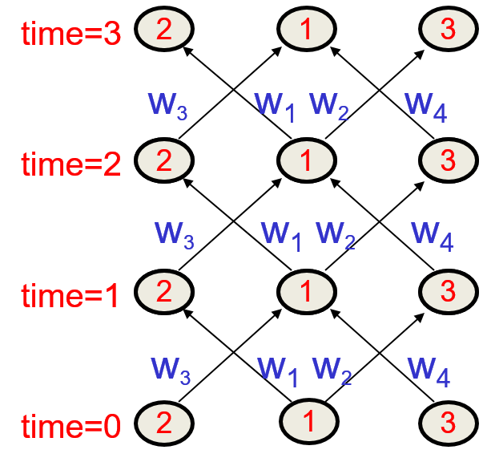
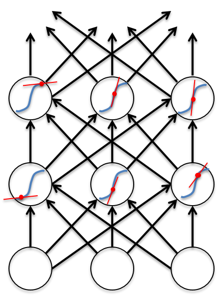
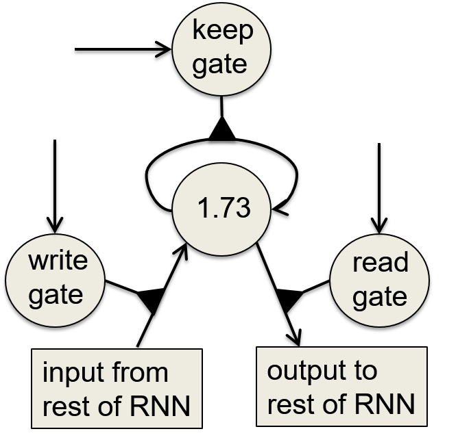
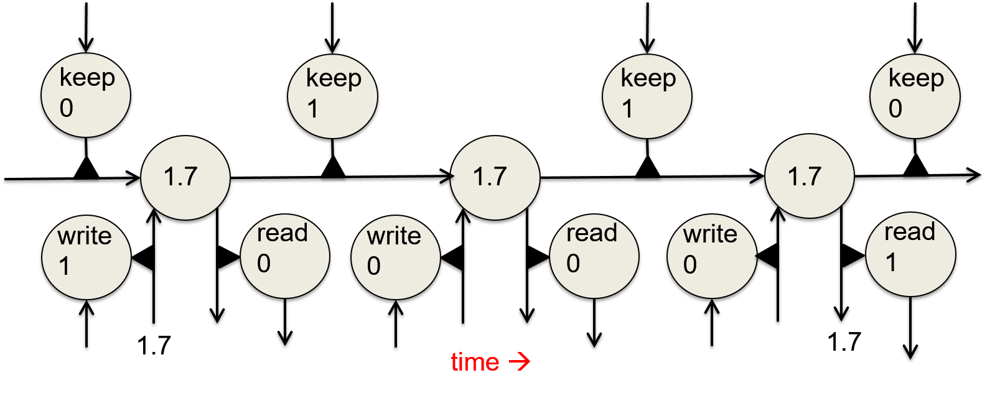
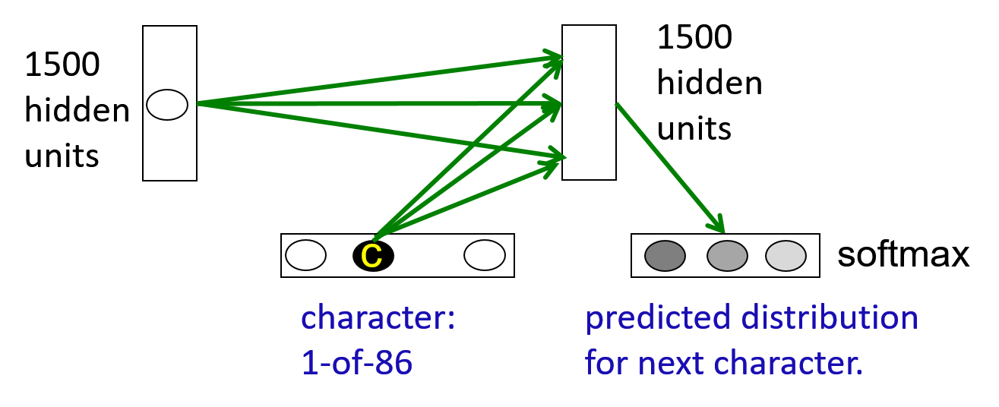

# Recurrent Neural Networks

## Overview

+ [Getting targets when modeling sequences](../ML/MLNN-Hinton/07-RNN.md#lecture-notes)
  + when applying machine learning to sequences, often turn an input sequence into an output sequence that lives in a different domain
  + when no separate target sequence, get a teaching signal by trying to predict the next term in the input sequence
  + predicting the next terms in a sequence blurs the distinction between supervised and unsupervised learning

+ [Memoryless models for sequences](../ML/MLNN-Hinton/07-RNN.md#lecture-notes)
  + autoregressive models: predict the next term in a sequence from a fixed number of previous terms using "delay taps"
  + feed-forward neural nets

  

    
  

+ [Beyond memoryless models](../ML/MLNN-Hinton/07-RNN.md#lecture-notes)
  + generative model w/ hidden state that has its own internal dynamics
  + inference: only tractable for two types of hidden state model

+ [Linear dynamical systems](../ML/MLNN-Hinton/07-RNN.md#lecture-notes) (engineers perspective)
  + generative models: producing the observations using a linear model w/ Gaussian noise
  + to predict the next output: computed using "Kalman filtering"

+ [Hidden Markov Models](../ML/MLNN-Hinton/07-RNN.md#lecture-notes) (computer scientists perspective)
  + a discrete one-of-N hidden state
  + to predict the next output
  + limitation
    + considering what happens when a hidden Markov model generates data
    + considering the first half of an utterance contains about the second half
    + all aspects combined could be 100 bits of information that the first half of an utterance needs to convey to the second half. $2^{100}$ is big!

+ [Recurrent neural networks](../ML/MLNN-Hinton/07-RNN.md#lecture-notes)
  + efficient way to remember the information
  + very powerful
  + Properties
    + distributed hidden state: to store a lot of information about the past efficiently
    + non-linear dynamics: to update their hidden state in complicated ways
  + with enough neurons and time RNNs able to compute anything that can be computed by your computer
  + recurrent neural networks are deterministic
  + Behavior
    + oscillation
    + settle to point attractors
    + chaostic
  + extreme requirements for computational power

  

    
  

+ [The equivalence between feed-forward nets and recurrent nets](../ML/MLNN-Hinton/07-RNN.md#lecture-notes-1)
  + Architecture: 3 interconnected neurons
  + network running in discrete time, i.e., a clock w/ integer ticks
  + assumption: a time delay of 1 in using each connection
  + objective: how to train a recurrent network
  + recurrent network expended in time same as a feed-forward network
  + the recurrent net is just a layered net that keeps reusing the same weights

  

    
  

## Training for RNN

+ [Training algorithm in the time domain](../ML/MLNN-Hinton/07-RNN.md#lecture-notes-1)
  + forward pass: a stack of the activities of all the units at each time step
  + backward pass: peeling activities off the stack to compute the error derivatives at each time step
  + adding the sum or average of the derivatives at all the different times for each weight after backward pass

+ [Initialization](../ML/MLNN-Hinton/07-RNN.md#lecture-notes-1)
  + specifying the initial activity state of all the hidden and output units
  + could just fix these initial states to have some default value like 0.5
  + better to treat the initial states as learned parameters rather than activities
  + training them in the same way as we learn the weights

+ [Input and Output of recurrent networks](../ML/MLNN-Hinton/07-RNN.md#lecture-notes-1)
  + specifying inputs in several ways
    + the initial states of all the units (e.g., bottom layer units)
    + the initial states of a subset of the units
    + the states of the same subset of the units at every time step
  + specifying targets in several ways
    + desired final activities of all the units
    + desired activities of all units for the last few steps
    + the desired activity of a subset of the units

+ [Linear backward pass](../ML/MLNN-Hinton/07-RNN.md#74-why-it-is-difficult-to-train-an-rnn)
  + big difference between the forward and backward passes
  + forward pass: using squashing functions (like the logistic) to prevent the activity vector from exploding
  + backward pass:
    + completely __linear__
    + if double the error derivatives at the final layer, all error derivatives will be doubled
    + once the forward pass done, the slope of that tangent fixed
    + the forward pass determines the slope (red line) of the linear function

  

    
  

+ [The problem of exploding or vanishing gradients](../ML/MLNN-Hinton/07-RNN.md#74-why-it-is-difficult-to-train-an-rnn)
  + magnitude of gradient for backpropagation through may layers
    + small weight: shrinking exponentially
    + large weight: growing exponentially
  + typical feed-forward neural network can cope w/ these exponential effects because they only have a few hidden layers
  + RNN trained on long sequences
  + Hard to detect the current output

+ [Four effective ways to learn an RNN](../ML/MLNN-Hinton/07-RNN.md#74-why-it-is-difficult-to-train-an-rnn)
  + __Long Short Term Memory__
  + __Hessian Free Optimization__
  + __Echo State Networks__
  + __Good initialization w/ momentum__

## Binary Addition

+ [A good toy problem for a recurrent network](../ML/MLNN-Hinton/07-RNN.md#73-a-toy-example-of-training-an-rnn)
  + training a feed-forward net to do binary addition
  + feed-forward nets not generalized well on the binary addition task

+ [The algorithm](../ML/MLNN-Hinton/07-RNN.md#73-a-toy-example-of-training-an-rnn)
  + a finite state automation
  + system in one state at a time
  + performing the action to print 1 or 0 once entering a state
  + get input (the two number in the next column) when staying a state
  + the input deciding what transition to make by looking at the next column
  + making the transition
  + moving from right to left over the two input numbers

  

+ [A recurrent net for binary addition](../ML/MLNN-Hinton/07-RNN.md#73-a-toy-example-of-training-an-rnn)
  + Architecture: two input units and one output unit
  + given two input digits at each time step
  + desired output at each time step: the output for the column that was provided as input two time step ago
    + taking one time step to update the hidden units based on the two input digits
    + taking another time step for the hidden units to cause the output

  

    
  

+ [The connectivity of the network](../ML/MLNN-Hinton/07-RNN.md#73-a-toy-example-of-training-an-rnn)
  + 3 hidden units fully interconnected in both directions (might be w/ different weights)
    + allowing a hidden activity pattern at one time step to vote for the hidden activity pattern at the next time step
  + input units having feed-forward connections (two-digit column) that allow them (the connection to the output unit) to vote (producing output) for the next hidden activity pattern

  

    
  

## Long short term memory for hand written recognition

+ [Long short term memory](../ML/MLNN-Hinton/07-RNN.md#75-long-short-term-memory) (LSTM)
  + solving the problem of getting an RNN to remember things for a long time (like hundreds of time steps)
  + designed a memory cell using logistic and linear units (gates) w/ multiplicative iterations
  + "write" gate on: information get into the cell
  + "keep" gate on: information stayed in the cell
  + "read" gate on: information read from the cell

+ [Implementing a memory cell in a neural network](../ML/MLNN-Hinton/07-RNN.md#75-long-short-term-memory)
  + using a circuit to implement an analog memory cell
  + to preserve information for a long time in activities of an RNN
  + Example of backpropagation through a memory cell block
    + forward pass (from left to right as time elapsed)
    + backward pass

  

    
  

+ [Reading cursive handwriting](../ML/MLNN-Hinton/07-RNN.md#75-long-short-term-memory)
  + a natural task for an RNN
  + input: a sequence of $(x, y, p)$ coordinates of the tip of the pen, where $p$ indicates whether the pen is up or down
  + output: a sequence of characters

## Hessian-free Optimization

+ [Newton's method](../ML/MLNN-Hinton/08-RNN2.md#81-a-brief-overview-of-hessian-free-optimization)
  + the basic problem
    + assumption: the steepest descent on a quadratic error surface
    + not the direction where the gradient would go in
    + error surface w/ circular cross-section: the gradient is a good direction which points to the minimum
    + applying a linear transformation to turn ellipses into circles $\to$going downhill in a circular error surface
  + Newton's method multiplies the gradient vector by the inverse of the curvature matrix $H$

    \[ \Delta \mathbf{w} = -\varepsilon H(\mathbf{w})^{-1} \frac{d E}{d\mathbf{w}} \]

    + $H(\mathbf{w})$: the Hessian transformation, a function of weights
    + real quadratic surface: jump to the minimum in one step if $\varepsilon$ chosen correctly
    + infeasible to invert the matrix w/ many parameters, e.g., a million weights ($10^6$) $\to$ trillion terms of the curvature matrix ($10^{12}$)

+ [Curvature Matrix](../ML/MLNN-Hinton/08-RNN2.md#81-a-brief-overview-of-hessian-free-optimization)
  + elements of curvature matrix
    + each weight $w_i$ or $w_j$ telling how the gradient in one direction changes as you change in another direction
    + off diagonal terms:
      + if $w_i$ changed, how does the gradient of the error w.r.t. $w_j$ change?
      + corresponding to twists in the error surface
    + diagonal entries: how the gradient of the error changes in direction of the weight as you change that weight
    + specifying how the gradient in one direction changes as moving into some other direction
    + twist: when you travel in one direction, the gradient in another direction changes
    + nice circular bulb: all those off diagonal terms are zero, ie, the gradient in other directions not changed
  + reason about wrong direction w/ steepest descent
    + the gradient for one weight messed up by the simultaneous changes to all the other weights
    + curvature matrix determines the sizes of these interactions

  

    
  

+ [Hessian-free (HF) method](../ML/MLNN-Hinton/08-RNN2.md#81-a-brief-overview-of-hessian-free-optimization)
  + making an approximation to the curvature matrix
  + assumptions:
    + the approximation correct
    + the curvature known
    + the error surface really quadratic
  + using conjugate gradient, an efficient technique to minimize the error $\to$ close to a minimum on this approximation to the curvature
  + making another approximation and reaching the minimum w/ conjugate gradient again
  + RNN usage
    + adding a penalty for changing any of the hidden activities too much
    + preventing from changing a weight early on that causes huge effects later on in the sequence
    + putting quadratic penalty on those changes then combining it w/ the rest of the Hessian method

+ [Conjugate gradient](../ML/MLNN-Hinton/08-RNN2.md#81-a-brief-overview-of-hessian-free-optimization)
  + an alternative to going to the minimum in one step by multiplying the inverse of the curvature matrix
  + using a sequence of steps, each of which finds the minimum along one direction
  + ensuring moving in the conjugate direction
    + conjugate: as moving in the new direction, not change the __gradients__ in the previous directions
    + opposite: twist
  + Goal of conjugate
    + Objective: global minimum of an $N$-dim quadratic surface
    + in $N$ steps, conjugate gradient guaranteed to find the minimum of an $N$-dim quadratic surface
    + non-linear conjugate gradient: able to apply directly to a non-quadratic error surface, such as the error surface for a multilayer non-linear neural network
    + HF optimizer:
      + using conjugate gradient for minimization on a genuinely quadratic surface where it excels
      + genuinely quadratic surface: the quadratic approximation to the true surface made by Hessian-free matrix

## Modeling text characters

+ [Modeling text](../ML/MLNN-Hinton/08-RNN2.md#82-modeling-character-strings-with-multiplicative-connections): advantages of working with characters
  + purpose: modeling character strings
  + architecture and process: (see diagram)
    + 1500 hidden states
    + inputs: characters and hiddent state dynamics
    + hidden state dynamics: the hidden state at time $t$ providing input to determine the hidden state at time $t+1$
    + predict the next character when retaining the new hidden state (new character + previous hidden state dynamics)
    + single softmax over the 86 characters
    + try to find high probability to the correct next character and low probability to the others
    + train the whole system by back propagating from that softmax the log probability of getting the correct character

    

      
    

+ [Tree structure](../ML/MLNN-Hinton/08-RNN2.md#82-modeling-character-strings-with-multiplicative-connections)
  + reason for not using RNN but instead a different kind of network
  + modeling string w/ tree (see diagram)
    + ranging all possible character strings into a tree w/ a branching ratio of 86 here
    + a tiny little subtree of that great big tree: occuring many times but w/ different things represented by dots (...) before the `fix`
    + representing many characters followed by `...fix`
      + left branch: trailed by 'i'
      + right branch: trailed by 'e'
    + every new character moving one step down in the tree to a new node

    

      
    

  + exponentially many nodes in the tree of all character strings of length $N$
  + RNN modeling:
    + enormous tree
    + a hidden state vector to represent each node
    + next character must transform to a new (hidden) node
  + node implemented as hidden states in an RNN
    + different node able to share structure
    + operating on the part of the state representing a verb able to share with all the verbs
    + using distributed representation
  + next hidden representation
    + conjunction of the current state at and the character to determine which branch to take
    + depending on the conjunction of the current character and the current hidden representation

+ [Multiplicative connections](../ML/MLNN-Hinton/08-RNN2.md#82-modeling-character-strings-with-multiplicative-connections)
  + inputs of recurrent net
    + traditional: using the character inputs to the recurrent net to provide extra additive input to the hidden states
    + capturing inputs by using multiplicative connections
    + naive method: 86x1500x1500 parameters $\to$ too many parameters $\to$ making the net overfit
  + multiplicative interaction w/ fewer parameters
    + different transition matrix for each of the 86 characters
    + characters w/ common characteristics
    + making these 86 character-specific weight matrices to share parameters

+ [factors to implement multiplicative interactions](../ML/MLNN-Hinton/08-RNN2.md#82-modeling-character-strings-with-multiplicative-connections)
  + factor
    + the triangle w/ $f$ (left diagram)
    + group $a$ and group $b$ interact multiplicatively to provide input to group $c$
  + get groups $a$ and $b$ to interact multiplicatively by using "factors"
    1. each factor first computes a weighted sum for each of its input groups
    2. then send the product of the weighted sums to its output group
  + mathematical representation

    \[ \mathbf{c}_f = \left( \mathbf{b}^T \mathbf{w}_f \right) \left( \mathbf{a}^T \mathbf{u}_f \right) \mathbf{v}_f \]

    + $\mathbf{c}_f$: vector of inputs to group $c$
    + $(\mathbf{b}^T \mathbf{w}_f)$: scalar input to $f$ from group $b$
    + $(\mathbf{a}^T \mathbf{u}_f)$: scalar input to $f$ from group $a$

  

    
  

+ [factors to implement a set of basis matrices](../ML/MLNN-Hinton/08-RNN2.md#82-modeling-character-strings-with-multiplicative-connections)
  + each factor defines a rank 1 transition matrix (the product of two vectors) from $a$ to $c$
  + treat a factor as computing two scalar products multiplying them (right diagram)
  + using the product as a weight on the outgoing vector $\mathbf{v}$
  + mathematical representation

    \[\begin{align*}
      \mathbf{c}_f &= \left( \mathbf{b}^T \mathbf{w}_f \right) \left( \mathbf{a}^T \mathbf{u}_f \right) \mathbf{v}_f 
        = \left( \mathbf{b}^T \mathbf{w}_f \right) \left( \mathbf{u}_f \mathbf{v}_f^T \right) \mathbf{a} \\
      \mathbf{c} &= \left( \sum_f \left( \mathbf{b}^T \mathbf{w}_f \right) \left( \mathbf{u}_f \mathbf{v}_f^T \right) \right) \mathbf{a}
    \end{align*}\]

    + $( \mathbf{b}^T \mathbf{w}_f )$: scalar coefficient
    + $( \mathbf{u}_f \mathbf{v}^T_f )$: outer product transition matrix with rank 1
    + $\mathbf{c}$: the sum of all factors

  + multiply the transition matrix by the current hidden state to produce a new hidden state
  + synthesized the transition matrix out of these rank 1 matrices provided by each factor
  + the current character in group $b$: determined the weight on each of the rank 1 matrices

## Predicting next character

+ [Training the character model](../ML/MLNN-Hinton/08-RNN2.md#83-learning-to-predict-the-next-character-using-hf)
  + Model
    + used 5 million strings of 100 characters taken from English Wikipedia
    + very good at completing sentences in interesting ways
    + objective: predict after 11th character of each string
  + Procedure
    + using RNN and starting off in a default state
    + read 11 characters changing hidden state each time
    + then ready to start predicting
    + trained by back propagating the error made in prediction
  + using HF optimizer

+ [Generate character strings from the model](../ML/MLNN-Hinton/08-RNN2.md#83-learning-to-predict-the-next-character-using-hf)
  + model learned $\to$ knowing what the model knows by generating strings from the model
  + Procedure
    + starting the model w/ its default hidden state
    + give it a "burn-in" sequence of characters and let it update its hidden state after each character
    + then let it predict by looking at the probability distribution it predicts for the next character
    + pick a character randomly from the distribution
    + continue to let it pick character until bored
    + look at the character string it produces to see what it "knows"

+ [Characteristics of model](../ML/MLNN-Hinton/08-RNN2.md#83-learning-to-predict-the-next-character-using-hf)
  + a huge number of words in English and a lot about proper names, dates, and numbers
  + good at balancing quotes and brackets
  + a lot about syntax but very hard to pin down exactly what form this knowledge has
  + a lot of weak semantic associations

+ [RNNs for predicting the next word](../ML/MLNN-Hinton/08-RNN2.md#83-learning-to-predict-the-next-character-using-hf)
  + train large RNNs on quite large training sets to predict the next work by using BPTT
    + using the technique same as the feed-forward neural networks
    + Procedure
      + convert a word to a real-valued feature vector
      + ussing these features as input to the rest of the network
    + better than feed-forward neural nets
    + better than the best other models
    + even better when averaged w/ other models
  + the best language models currently used
  + interesting RNN property:
    + require much less training data to reach the same level of performance with other models
    + improve faster than other methods as the dataset getting bigger
    + similar to the role of large deep neural networks for object recognition

## Echo state networks (ESN)

+ [Key idea for ESN](../ML/MLNN-Hinton/08-RNN2.md#84-echo-state-networks)
  + not to train the hidden$\to$hidden connections
  + just fix hidden$\to$hidden connections randomly and hope able to learn sequences by just training the way they affect the outputs
  + a simple network w/ perceptrons (feed-forward network)
    + make the early layers of feature detectors random and fixed
    + put in sensible sized random weights
    + objective: to learn the last layer w/ linear model
    + learning a linear model from the activities of the hidden units in the last layer to the outputs $\to$ faster
    + using the transformed input to predict the target outputs
    + a big random expansion of the input vector often makes it easy for a linear model to fit the data
    + if not able to fit the data well just looking at the raw input
  + equivalent idea for RNN
    + fix the input$\to$hidden connections
    + randomly assigned values for the hidden$\to$hidden connections
    + only learning the hidden$\to$output connections
    + simple learning w/ linear output unit assumption $\to$ fast
    + set the random connections very careful $\to$ RNN not exploding or vanishing

+ [Setting the random connections](../ML/MLNN-Hinton/08-RNN2.md#84-echo-state-networks  )
  + set the hidden$\to$hidden weights
  + using sparse connectivity
  + carefully choosing the scale of the input$\to$hidden connections
  + fast learning in ESNs

