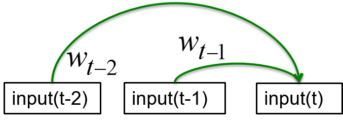
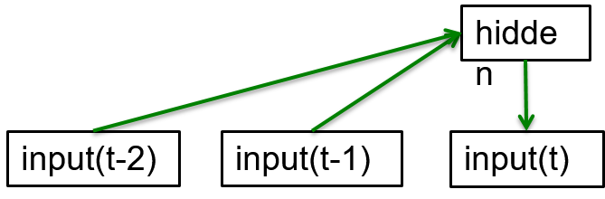
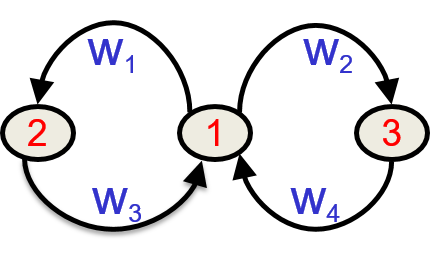
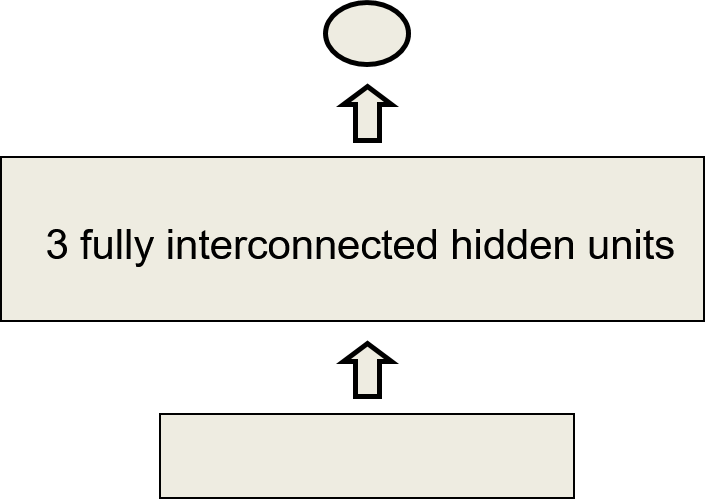

# Recurrent Neural Networks

## Overview

+ [Getting targets when modeling sequences](../ML/MLNN-Hinton/07-RNN.md#lecture-notes)
  + when applying machine learning to sequences, often turn an input sequence into an output sequence that lives in a different domain
  + when no separate target sequence, get a teaching signal by trying to predict the next term in the input sequence
  + predicting the next terms in a sequence blurs the distinction between supervised and unsupervised learning

+ [Memoryless models for sequences](../ML/MLNN-Hinton/07-RNN.md#lecture-notes)
  + autoregressive models: predict the next term in a sequence from a fixed number of previous terms using "delay taps"
  + feed-forward neural nets

  

    
  

+ [Beyond memoryless models](../ML/MLNN-Hinton/07-RNN.md#lecture-notes)
  + generative model w/ hidden state that has its own internal dynamics
  + inference: only tractable for two types of hidden state model

+ [Linear dynamical systems](../ML/MLNN-Hinton/07-RNN.md#lecture-notes) (engineers perspective)
  + generative models: producing the observations using a linear model w/ Gaussian noise
  + to predict the next output: computed using "Kalman filtering"

+ [Hidden Markov Models](../ML/MLNN-Hinton/07-RNN.md#lecture-notes) (computer scientists perspective)
  + a discrete one-of-N hidden state
  + to predict the next output
  + limitation
    + considering what happens when a hidden Markov model generates data
    + considering the first half of an utterance contains about the second half
    + all aspects combined could be 100 bits of information that the first half of an utterance needs to convey to the second half. $2^{100}$ is big!

+ [Recurrent neural networks](../ML/MLNN-Hinton/07-RNN.md#lecture-notes)
  + efficient way to remember the information
  + very powerful
  + Properties
    + distributed hidden state: to store a lot of information about the past efficiently
    + non-linear dynamics: to update their hidden state in complicated ways
  + with enough neurons and time RNNs able to compute anything that can be computed by your computer
  + recurrent neural networks are deterministic
  + Behavior
    + oscillation
    + settle to point attractors
    + chaostic
  + extreme requirements for computational power

  

    
  

+ [The equivalence between feed-forward nets and recurrent nets](../ML/MLNN-Hinton/07-RNN.md#lecture-notes-1)
  + Architecture: 3 interconnected neurons
  + network running in discrete time, i.e., a clock w/ integer ticks
  + assumption: a time delay of 1 in using each connection
  + objective: how to train a recurrent network
  + recurrent network expended in time same as a feed-forward network
  + the recurrent net is just a layered net that keeps reusing the same weights

  

    
  

## Training for RNN

+ [Training algorithm in the time domain](../ML/MLNN-Hinton/07-RNN.md#lecture-notes-1)
  + forward pass: a stack of the activities of all the units at each time step
  + backward pass: peeling activities off the stack to compute the error derivatives at each time step
  + adding the sum or average of the derivatives at all the different times for each weight after backward pass

+ [Initialization](../ML/MLNN-Hinton/07-RNN.md#lecture-notes-1)
  + specifying the initial activity state of all the hidden and output units
  + could just fix these initial states to have some default value like 0.5
  + better to treat the initial states as learned parameters rather than activities
  + training them in the same way as we learn the weights

+ [Input and Output of recurrent networks](../ML/MLNN-Hinton/07-RNN.md#lecture-notes-1)
  + specifying inputs in several ways
    + the initial states of all the units (e.g., bottom layer units)
    + the initial states of a subset of the units
    + the states of the same subset of the units at every time step
  + specifying targets in several ways
    + desired final activities of all the units
    + desired activities of all units for the last few steps
    + the desired activity of a subset of the units

## Binary Addition

+ [A good toy problem for a recurrent network](../ML/MLNN-Hinton/07-RNN.md#73-a-toy-example-of-training-an-rnn)
  + training a feed-forward net to do binary addition
  + feed-forward nets not generalized well on the binary addition task

+ [The algorithm](../ML/MLNN-Hinton/07-RNN.md#73-a-toy-example-of-training-an-rnn)
  + a finite state automation
  + system in one state at a time
  + performing the action to print 1 or 0 once entering a state
  + get input (the two number in the next column) when staying a state
  + the input deciding what transition to make by looking at the next column
  + making the transition
  + moving from right to left over the two input numbers

  

+ [A recurrent net for binary addition](../ML/MLNN-Hinton/07-RNN.md#73-a-toy-example-of-training-an-rnn)
  + Architecture: two input units and one output unit
  + given two input digits at each time step
  + desired output at each time step: the output for the column that was provided as input two time step ago
    + taking one time step to update the hidden units based on the two input digits
    + taking another time step for the hidden units to cause the output

  

    
  

+ [The connectivity of the network](../ML/MLNN-Hinton/07-RNN.md#73-a-toy-example-of-training-an-rnn)
  + 3 hidden units fully interconnected in both directions (might be w/ different weights)
    + allowing a hidden activity pattern at one time step to vote for the hidden activity pattern at the next time step
  + input units having feed-forward connections (two-digit column) that allow them (the connection to the output unit) to vote (producing output) for the next hidden activity pattern

  

    
  

