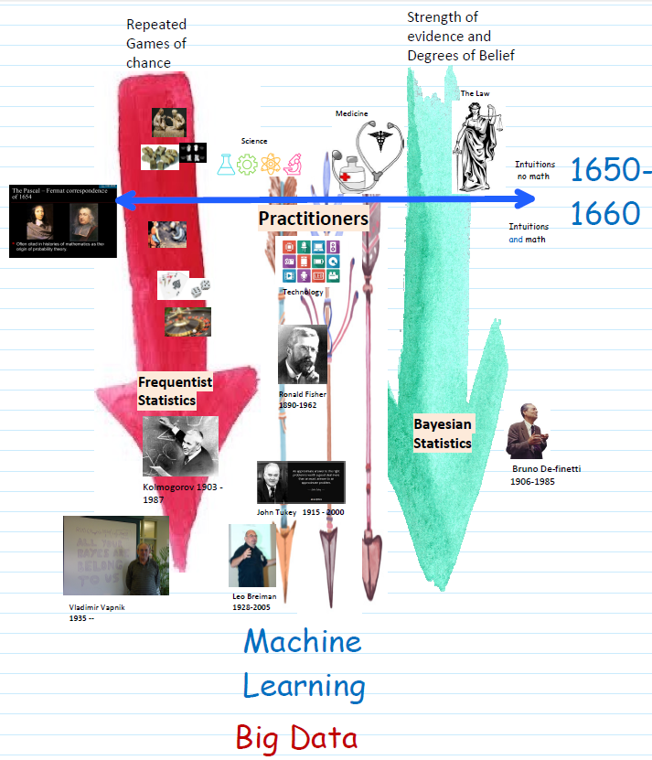

# Statistics: Basics

## Basic Concepts

+ [Terminology](../Notes/p01-Bayesian.md#31-subjectivity-and-context)
  + standard deviation ($sd$): a measure of the amount of variation or dispersion of a set of values ($var = sd^2$) $\implies$ true population mean
  + standard error ($se$)
    + the standard deviation ($sd$) of its sampling distribution or an estimate of that standard deviation
    + not enough samples & different trials $\to$ different population means
  + sampling distribution: the probability distribution of a given random-sample-based statistic
  + frequency interpretation of probability: long-run properties of repeated random events
  + frequentist:
    + standard statistical methods
    + $p(x)$: the proportion of times $x$ will occur in an infinitely long series of repeated identical situations

+ [odds ($O$)](../Notes/p01-Bayesian.md#31-subjectivity-and-context)
  + the probability ($p$) that the event will occur divided by the probability ($1 - p$) that the event will not occur
  + used to describe the chance of an event occurring

  \[ O = \frac{p}{1 - p} \tag{Odds} \]

+ [logit: the natural logarithm of the odds](../Notes/p01-Bayesian.md#31-subjectivity-and-context)

  \[ \text{logit}(p) = \ln(\frac{p}{1 - p}) \tag{Odds.log} \]

+ [Bayes theorem](../Notes/p01-Bayesian.md#31-subjectivity-and-context)
  + Formula

  \[ p(b|a) = \frac{p(a|b)}{p(a)} \times p(b) \tag{Bayes} \]

  + The odds form of Bayes theorem

    \[ \frac{p(b|a)}{p(\overline{b}|a)} = \frac{p(a|b)}{p(a| \overline{b})} \times \frac{p(b)}{p(\overline{b})} \tag{Bayes.odds} \]

+ [What is statistics?](../Stats/ProbStatsPython/01-Intro.md#13-what-is-statistics)
  + probability theory: computing probabilities of complex events given the underlying base distribution
  + statistics:
    + the opposite direction of probability
    + given __data__ generated by a __stochastic process__
    + __inferring__ properties of the stochastic process
  + statistics is about analyzing real-world data drawing conclusion

+ [The logic of Statistical Inference](../Stats/ProbStatsPython/01-Intro.md#13-what-is-statistics)
  + suppose that the coin is fair
  + using __probability theory__ to compute the probabilities
  + probability is very small $\implies$ __reject__ with confidence the hypothesis

+ [Games of chance vs. Strength of evidence](../Stats/ProbStatsPython/01-Intro.md#151-a-short-history-of-probability-and-statistics)
  + Two concepts in practice of data analysis (top right diagram)
  + Statistical Inference: the big picture
    + top left figure: The big picture of statistical inference.
    + bottom figure: A more elaborate big picture, reflecting in greater detail the process of statistical inference.

  

    
    
  

  

    
  

+ [The frequentist point of view](../Stats/ProbStatsPython/01-Intro.md#151-a-short-history-of-probability-and-statistics)
  + to assign a probabilities to the outcomes of a game/experiment is the same as saying that if we repeat the game many times, the long term frequencies of the outcomes converge to the probabilities
  + provide a solid foundation on which probability theory is built

+ [Combining evidence](../Stats/ProbStatsPython/01-Intro.md#151-a-short-history-of-probability-and-statistics)
  + central to many fields
  + typically, not repeating an experiment many times
  + the probability theory used, but much of the discussion not mathematical
  + closely related concepts: fairness, pricing
  + a popular approach: Bayesian Statistics

+ [The poster: timeline of probability and statistics](../Stats/ProbStatsPython/01-Intro.md#152-history-poster)

  

    
  

+ [Probability x Statistics](../Stats/ProbStatsPython/11-StatEstCI.md#111-statistics)
  + probability: distribution $\to$ samples
  + statistics:  samples $\to$ distribution

+ [Distribution parameters](../Stats/ProbStatsPython/11-StatEstCI.md#111-statistics)
  + most distribution families determined by parameters
  + generally, any deterministic function of the distribution as a parameter or property

+ [Population](../Stats/ProbStatsPython/11-StatEstCI.md#111-statistics)
  + population: collection of objects
  + sample n objects: often n $\ll$ population size
  + sampling from population $\to$ sampling from distribution

+ [Statistic](../Stats/ProbStatsPython/11-StatEstCI.md#111-statistics)
  + any function of the data observed
  + using statistics to infer properties of the distribution or population
    + parameters
    + type of distribution
  + consideration:
    + how to do it
    + how well can do it

## Bias and Variance

+ [Bias and variance](../Stats/ProbStatsPython/11-StatEstCI.md#112-mean-and-variance-estimation)
  + bias: $\widehat{\Theta}$ estimator for $\theta$
    + definition: bias of $\widehat{\Theta}$ as the expected overestimate of $\theta$

      \[\text{Bias}_\theta (\widehat{\Theta}) \stackrel{\text{def}}{=} E[\widehat{\Theta} - \theta] = \mu_{\widehat{\Theta}} - \theta \quad\to\quad \text{Bias}(\widehat{\Theta}) \]

    + unbiased: estimator w/ 0 bias, i.e., $\mu_{\widehat{\Theta}} = \theta$
  + variance
    + definition: $Var(\widehat{\Theta}) = E[(\widehat{\Theta} - \mu_{\widehat{\Theta}})^2]$
    + unrelated to $\theta$
  + ideally 0 bias and variance
  + typically trade off btw bias and variance

+ [Bias-Variance decomposition  ](../Stats/ProbStatsPython/11-StatEstCI.md#112-mean-and-variance-estimation)
  MSE = $\text{Bias}^2$ + Variance

## Statistical Inference

+ [statistically significance](../Notes/p01-Bayesian.md#31-subjectivity-and-context)
  + a determination by an analyst that the results in the data are not explainable by chance alone
  + the likelihood that a relationship btw two or more variables caused by something other than chance
  + used to provide evidence concerning the plausibility of the null hypothesis, which hypothesizes that there is nothing more than random chance at work in the data
  + a $p$-value of 5% or lower often considered to be statistically significant

+ [statistical hypothesis testing](../Notes/p01-Bayesian.md#31-subjectivity-and-context)
  + the method by which the analyst makes this determination
  + an act in statistics whereby an analyst tests an assumption regarding a population parameter
  + used to assess the plausibility of a hypothesis by using sample data

+ [$p$-value](../Notes/p01-Bayesian.md#31-subjectivity-and-context)
  + the probability of observing results as extreme as those in the data, assuming the results are truly due to chance alone
  + the probability of obtaining results as extreme as the observed results of a statistical hypothesis test, assuming that the null hypothesis is correct
  + used as an alternative to rejection points to provide the smallest level of significance at which the null hypothesis would be rejected
  + smaller p-value $\implies$ stronger evidence in favor of the alternative hypothesis

## Mean Estimation

+ [Estimators](../Stats/ProbStatsPython/11-StatEstCI.md#112-mean-and-variance-estimation)
  + r.v.'s: $X^n \stackrel{\text{def}}{=} X_1, X_2, \dots, X_n$ independent samples from distribution or a population
  + $p$: unknown distribution or population
  + estimate a distribution parameter $\theta$
  + sample: $X^n \stackrel{\text{def}}{=} X_1, X_2, \dots, X_n \sim p {\perp \!\!\!\! \perp}$
  + estimator for parameter $\theta$ as a function
    + function $\widehat{\theta}: \Bbb{R} \to \Bbb{R}$
    + mapping $X^n \to \Bbb{R}$
  + upon observing $X^n$, estimate $\theta$ and defined as $\widehat{\Theta} \stackrel{\text{def}}{=} \widehat{\theta}(X^n)$
    + random variable
    + determined by $X^n$

+ [Observations](../Stats/ProbStatsPython/11-StatEstCI.md#112-mean-and-variance-estimation)
  + distribution parameter $\theta$
  + estimate $\widehat{\Theta} \stackrel{\text{def}}{=} \widehat{\theta}(X^n)$
    + random variable
    + ideally close to $\theta$
  + estimator
    + any function
    + good or bad
  + considering how to
    + come up w/ an estimator?
    + evaluate its performance?

+ [Estimator evaluation](../Stats/ProbStatsPython/11-StatEstCI.md#112-mean-and-variance-estimation)
  + parameter may have several estimators
  + evaluate quality of estimator for a parameter

+ [Mean squared error](../Stats/ProbStatsPython/11-StatEstCI.md#112-mean-and-variance-estimation)
  + single measure for performance of estimator $\widehat{\Theta}$ for $\theta$
  + MSE of $\widehat{\Theta}$: expected squared distance from $\theta$

    \[ \text{MSE}_{\theta}(\widehat{\Theta}) \stackrel{\text{def}}{=} E[(\widehat{\Theta} - \theta)^2] \quad\to\quad \text{MSE}(\widehat{\Theta}) \]

  + MSE related to bias and variance

## Analysis Methodologies

+ [meta-analysi](../Notes/p01-Bayesian.md#31-subjectivity-and-context)
  + a statistical analysis that combines the results of multiple scientific studies
  + performed when multiple scientific studies address the same question w/ each study reporting measurements expected some degree of error
  + derived a pooled estimate closest to the unknown common true based on how this error is perceived

+ [prospective analysis](../Notes/p01-Bayesian.md#31-subjectivity-and-context)
  + used as an analytical tool to assess and mitigate the occurrence of loss by analyzing a situation or process that carries with it some inherent risk
  + to identify the way in which a process might potentially fail, w/ the goal to eliminate or reduce the likelihood or outcome severity of such a failure
  + applied to process or equipment and systems
  + FEMA used proactively when designing a new system or process for a high-risk or complex process or during an inter-professional process w/ hands-off and interdependent steps
  + w/ its roots in the engineering industry

## Multiple Distributions

+ [Joint probability distribution](../Notes/p01-Bayesian.md#31-subjectivity-and-context)
  + joint probability: the probability of two events occurring simultaneously
  + a probability distribution giving the probability that each $X, Y, \dots$ falls in any particular range or discrete set of values specified for that variable
  + $f_{X, Y}(x, y)$: the joint probability density function of random variable $X$ and $Y$, the marginal probability density function of $X$ and $Y$

    \[ f_X(x) = \int f_{XY} (x, y) dy, \qquad f_Y(y) = \int f_{XY} (x, y) dx \]

+ [Marginal distribution](../Notes/p01-Bayesian.md#31-subjectivity-and-context)
  + marginal probability: the probability of an event irrespective of the outcome of another variable
  + the marginal distribution of a subset of a collection of random variables is the probability distribution of the variables contained in the subset
  + two random variables independent $\iff$ their joint distribution function equal to the product of their marginal distribution functions
  + marginal probability density function: two continuous random variables $X$ and $Y$ w/ $x \in [a, b]$ and $y \in [c, d]$

    \[ f_X(x) = \int_c^d f(x, y) dy, \qquad f_Y(y) = \int_a^b f(x, y) dx \]

## Hypothesis Test

+ [Neyman-Pearson lemma
  + performing a hypothesis test btw two simple hypotheses, $H_0: \theta = \theta_0$ and  $H_1: \theta = \theta_1$
  + using the likelihood ratio test  w/ threshold $\eta$
  + rejecting $H_0$ in favor of $H_1$ at a significance level of

    \[ \alpha = P(\Lambda(x) \leq \eta | H_0) \]

    + $\Lambda(x) = \frac{\mathcal{L}(\theta_0 | x)}{\mathcal{L}(\theta_1 | x)}$
    + $\mathcal{L}(\theta | x)$: the likelihood function
  + the Neyman-Pearson lemma: the likelihood ratio, $\Lambda(x)$, is the __most powerful test__ at significance level $\alpha$
  + Properties
    + the test is most powerful for $\theta_1 \in \Theta_1 \implies$ test as uniformly most powerful (UMP) for alternatives in the set $\Theta_1$
    + the likelihood ratio: used directly to construct tests
  + Example:
    + $X_1, X_2, \dots, X_n$: a random sample from $N(\mu, \sigma^2)$
    + test: $H_0: \sigma^2 = \sigma_0^2$ against $H_1: \sigma^2 = \sigma_1^2$
    + the likelihood for this set of normal distributed data

      \[ \mathcal{L}(\sigma^2 | x) \propto (\sigma^2)^{-n/2} \exp \left( - \frac{\sum_{i=1}^n (x_i - \mu)^2}{2\sigma^2} \right) \]

    + the likelihood ratio

      \[ \Lambda(x) = \frac{\mathcal{L}(\sigma_0^2 | x)}{\mathcal{L}(\sigma_1^2 | x)} = \left( \frac{\sigma_0}{\sigma_1} \right)^{-n/2} \exp \left( -\frac{1}{2}(\sigma_0^2 - \sigma_1^2) \right) \sum_{i=1}^n (x_i - \mu)^2 \]

    + the ratio only depends on the data through $\sum_{i=1}^n (x_i - \mu)^2$
    + by Heyman-Pearson lemma, the most powerful test for this data only depends on $\sum_{i=1}^n (x_i - \mu)^2$
    + $\sigma_1^2 > \sigma_0^2 \implies \Lambda(x)$ a decreasing function of $\sum_{i=1}^n (x_i - \mu)^2$
    + reject $H_0$ if $\sum_{i=1}^n (x_i - \mu)^2$ is sufficient large
    + the rejection threshold depending on the size of the test
    + $\therefore$ test statistic w/ a scaled $\chi^2$ distributed random variable $\implies$ obtaining an exact critical value $\eta$

