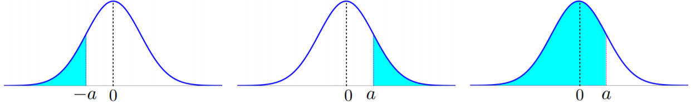

# Statistics: Distributions

## Relationship of Distribution

+ [The common distributions](http://www.stat.rice.edu/~dobelman/courses/texts/Distributions.Chart.C&B.pdf)

+ [Interrelationships among discrete distribution](http://www.stat.rice.edu/~dobelman/courses/texts/Distributions.Discrete.Kendall.jpg)

+ [Univariate Distribution Relationships](http://www.stat.rice.edu/~dobelman/courses/texts/leemis.distributions.2008amstat.pdf)

+ [Tables, Cheatsheets and Reference](http://www.stat.rice.edu/~dobelman/courses/statmisc.html#tables)

## Tables of Common Continuous Distributions

<table style="font-family: arial,helvetica,sans-serif; width: 60vw;" table-layout="auto" cellspacing="0" cellpadding="5" border="1" align="center">
  <thead>
  <tr>
    <th style="text-align: center; background-color: #3d64ff; color: #ffffff; width:5%;">Distribution</th>
    <th style="text-align: center; background-color: #3d64ff; color: #ffffff; width:20%;">Probability  Function</th>
    <th style="text-align: center; background-color: #3d64ff; color: #ffffff; width:5%;">Mean</th>
    <th style="text-align: center; background-color: #3d64ff; color: #ffffff; width:5%;">Variance</th>
    <th style="text-align: center; background-color: #3d64ff; color: #ffffff; width:15%;">Moment-Generating Function</th>
  </tr>
  </thead>
  <tbody>
  <tr>
    <td>Binomial</td>
    <td style="text-align: center; height: 1.3em;">$p(k) = \binom{n}{k} p^k (1-p)^{n-k}$
$\hspace{3.0em}k = 0, 1, \dots, n$
</td>
    <td style="text-align: center; height: 1.3em;">$np$</td>
    <td style="text-align: center; height: 1.3em;">$np(1-p)$</td>
    <td style="text-align: center; height: 1.3em;">$\left(p\,e^t + (1-p)\right)^n$</td>
  </tr>
  <tr>
    <td>Geometric</td>
    <td style="text-align: center; height: 1.3em;">$ p(k) = p(1-p)^{1k - 1}$
$\hspace{3.0em}k = 1, 2, \dots$
</td>
    <td style="text-align: center; height: 1.3em;">$ \frac{1}{p} $</td>
    <td style="text-align: center; height: 1.3em;">$ \frac{1-p}{p^2} $</td>
    <td style="text-align: center; height: 1.3em;">$ \frac{p\,e^t}{1 - (1-p)e^t} $</td>
  </tr>
  <tr>
    <td>Hypergeometric</td>
    <td style="text-align: center; height: 1.3em;">$p(k) = \frac{\binom{r}{k}\binom{N-r}{n-k}}{\binom{N}{n}}$
$y = \begin{cases} 0, 1, \dots, n & \text{if } n \leq r \\ 0, 1, \dots, r & \text{if } n > r \end{cases}$
</td>
    <td style="text-align: center; height: 1.3em;">$\frac{nr}{N} $</td>
    <td style="text-align: center; height: 1.3em;">$n\left(\frac{r}{N} \right) \left(\frac{N - r}{N} \right) \left(\frac{N - n}{N-1} \right) $</td>
    <td style="text-align: center; height: 1.3em;"></td>
  </tr>
  <tr>
    <td>Poisson</td>
    <td style="text-align: center; height: 1.3em;">$p(k) = \frac{\lambda^k\,e^{-\lambda}}{k!}, \;k = 0, 1, \dots$</td>
    <td style="text-align: center; height: 1.3em;">$\lambda$</td>
    <td style="text-align: center; height: 1.3em;">$\lambda$</td>
    <td style="text-align: center; height: 1.3em;">$\exp\left(\lambda(e^t - 1)\right)$</td>
  </tr>
  <tr>
    <td>Negative binomial</td>
    <td style="text-align: center; height: 1.3em;">$p(k) = \binom{k-1}{r-1} p^r (1-9)^{k-r}$
$\hspace{3.0em}k = r, r+1, \dots$
</td>
    <td style="text-align: center; height: 1.3em;">$\frac{r}{p}$</td>
    <td style="text-align: center; height: 1.3em;">$\frac{r(1-p)}{p^2}$</td>
    <td style="text-align: center; height: 1.3em;">$\left( \frac{p\,e^t}{1 - (1-p)e^t} \right)$</td>
  </tr>
  </tbody>
</table>

## Tables of Common Continuous Distributions

<table style="font-family: arial,helvetica,sans-serif; width: 60vw;" table-layout="auto" cellspacing="0" cellpadding="5" border="1" align="center">
  <thead>
  <tr>
    <th style="text-align: center; background-color: #3d64ff; color: #ffffff; width:5%;">Distribution</th>
    <th style="text-align: center; background-color: #3d64ff; color: #ffffff; width:20%;">Probability  Function</th>
    <th style="text-align: center; background-color: #3d64ff; color: #ffffff; width:5%;">Mean</th>
    <th style="text-align: center; background-color: #3d64ff; color: #ffffff; width:5%;">Variance</th>
    <th style="text-align: center; background-color: #3d64ff; color: #ffffff; width:15%;">Moment-Generating Function</th>
  </tr>
  </thead>
  <tbody>
  <tr>
    <td>Uniform</td>
    <td style="text-align: center; height: 1.3em;">$f(x) = \frac{1}{\theta_2 - \theta_1}; \quad \theta_1 \leq x \leq \theta_2$</td>
    <td style="text-align: center; height: 1.3em;">$\frac{\theta_1 + \theta_2}{2}$</td>
    <td style="text-align: center; height: 1.3em;">$\frac{(\theta_2 - \theta_1)^2}{12}$</td>
    <td style="text-align: center; height: 1.3em;">$\frac{e^{t\theta_2} - e^{t\theta_1}}{t(\theta_2 -\theta_1)}$</td>
  </tr>
  <tr>
    <td>Normal</td>
    <td style="text-align: center; height: 1.3em;">$f(x) = \frac{1}{\sigma\sqrt{e\pi}}\exp\left( -\frac{1}{2\sigma^2} (x - \mu)^2 \right)$
$\hspace{5.0em}-\infty < x < \infty$
</td>
    <td style="text-align: center; height: 1.3em;">$\mu $</td>
    <td style="text-align: center; height: 1.3em;">$\sigma^2 $</td>
    <td style="text-align: center; height: 1.3em;">$\exp\left(\mu t + \frac{t^2\sigma^2}{2}\right)$</td>
  </tr>
  <tr>
    <td>Exponential</td>
    <td style="text-align: center; height: 1.3em;">$f(x) = \frac{1}{\beta} e^{-x/\beta}, \quad\beta > 0, 0 < x < \infty$</td>
    <td style="text-align: center; height: 1.3em;">$\beta$</td>
    <td style="text-align: center; height: 1.3em;">$\beta62$</td>
    <td style="text-align: center; height: 1.3em;">$(1 - \beta)^{-1}$</td>
  </tr>
  <tr>
    <td>Gamma</td>
    <td style="text-align: center; height: 1.3em;">$f(x) = \left(\frac{1}{\Gamma(\alpha)} \beta^\alpha \right) y^{\alpha-1} e^{-x/\beta}$
$\hspace{5.0em}0 < y < \infty$
</td>
    <td style="text-align: center; height: 1.3em;">$\alpha\beta$</td>
    <td style="text-align: center; height: 1.3em;">$\alpha\beta^2$</td>
    <td style="text-align: center; height: 1.3em;">$(1-\beta t)^{-\alpha}$</td>
  </tr>
  <tr>
    <td>Chi-square</td>
    <td style="text-align: center; height: 1.3em;">$f(x) = \frac{y^{\nu/2)-1}e^{-x/2}}{2^{\nu/2} \Gamma(\nu/2)}, \;y \neq 0$</td>
    <td style="text-align: center; height: 1.3em;">$\nu$</td>
    <td style="text-align: center; height: 1.3em;">$2\nu$</td>
    <td style="text-align: center; height: 1.3em;">$(1-2t)^{-\nu/2}$</td>
  </tr>
  <tr>
    <td>Beta</td>
    <td style="text-align: center; height: 1.3em;">$f(x) = \frac{\Gamma(\alpha) + \Gamma(\beta)}{\Gamma(\alpha) \Gamma(\beta)} y^{\alpha-1}(1-y)^{\beta-1}$
$\hspace{5.0em}0 < y < 1$
</td>
    <td style="text-align: center; height: 1.3em;">$\frac{\alpha}{\alpha+\beta}$</td>
    <td style="text-align: center; height: 1.3em;">$\frac{\alpha\beta}{(\alpha + \beta)^2(\alpha+\beta+1)}$</td>
    <td style="text-align: center; height: 1.3em;">$\not\exists$ in closed form</td>
  </tr>
  </tbody>
</table>

## Bernoulli Distribution

+ [Bernoulli distribution](/Notes/p01-Bayesian.md#361-binary-data-with-a-discrete-prior-distribution): for a single Bernoulli trial w/ outcome 0 or 1, the likelihood for each possible value for $\theta$

  \[ p(y | \theta_j) = \theta_j^y (1 - \theta_j)^{1-y}  \hspace{5.0em} \text{ where } \quad
    p(y | \theta_j) = \begin{cases} \theta_j & \text{ if } y = 1 \\ 1 - \theta_j & \text{ if } y = 0 \end{cases}
  \]

+ [Bernoulli distribution](../Stats/ProbStatsPython/08-DiscreteDist.md#81-bernoulli-distribution)
  + notation: $B_p\quad 0 \le p \le 1$
  + pmf: $p(0) = 1-p = \overline{p} = q \quad p(1) = p$
  + unitary: $p(0) + p(1) = (1-p) + p = 1$
  + $X \sim B_p$

+ [Characteristics](../Stats/ProbStatsPython/08-DiscreteDist.md#81-bernoulli-distribution)
  + binary version of complex events
  + repeated trials yield \# successes
  
+ [Mean and Variance](../Stats/ProbStatsPython/08-DiscreteDist.md#81-bernoulli-distribution)
  + mean: $E[X] = \sum p(x) \cdot x = (1-p) \cdot 0 + p \cdot 1$
  + variance: $Var(X) = E[X^2] - (E[X])^2 = p - p^2 = p(1-p) = pq$
  + standard deviation: $\sigma = \sqrt{pq}$
  + various $p$
    + $p = 0 \to E[X] = 0, \;Var(X) = 0, \;\sigma = 0$
    + $p = 1 \to E[X] = 1, \;Var(1) = 0, \;\sigma = 0$
    + $p = \tfrac12 \to E[X] = \tfrac12, \;Var(X) = \frac14, \;\sigma = \frac12$
    + $B_p$ varying most when $p = \frac12$

+ [Independent trials](../Stats/ProbStatsPython/08-DiscreteDist.md#81-bernoulli-distribution)
  + most common type of Bernoulli distribution: independent ${\perp \!\!\!\! \perp}$
  + generally, $X_1, X_2, \cdots, X_n \sim B_p \to  {\perp \!\!\!\! \perp}$
    + $x^n = x_1, x_2, \cdots, x_n \in \{0, 1\}^n$
    + $n_0$ = number of 0's; &nbsp;&nbsp;&nbsp;&nbsp;  $n_1$ = number of 1's
    + $\Pr(x_1, \dots, x_n) = p^{n_1} q^{n_0}$

## Binomial Distribution

+ [Binomial distribution](../Notes/p01-Bayesian.md#31-subjectivity-and-context)
  + $Y$: a discrete binomial variable w/ the sampling distribution of the total number of 'successes' in $n$ independent Bernoulli trials
  + $\theta$: the probability of success in each Bernoulli trial
  + $\theta^y (1 - \theta)^{n-y}$: the likelihood, the probability for a specific sequence of $n-y$ 'failure' and $y$ 'successes', $\begin{pmatrix} n \\ y \end{pmatrix}$ sequences
  + $Y \sim Bin(n, \theta)$: a binomial distribution w/ properties

    \[\begin{align*}
      p(y | n, \theta) & = \begin{pmatrix} n \\ y \end{pmatrix} \theta^y (1-\theta)^{n-y}, \hspace{5.0em} y = 0, 1, \dots, n \tag{Bin.prob} \\
      E(Y | n, \theta) &  = n \theta \tag{Bin.mean} \\
      Var(Y | n, \theta) &= n \theta (1-\theta) \tag{Bin.var}
    \end{align*}\]

  + $Y \sim Bern(\theta)$: a Bernoulli distribution, a binomial w/ $n=1$

+ [The Binomial distribution](../Stats/ProbStatsPython/08-DiscreteDist.md#82-binomial-distribution)
  + "failure" w/ probability $1 - p = \overline{p} = q$
  + notation: $B_{p,n}$ or $B_{n, p}$: distribution of \# successes
    + $B_{n, p}$ more common
    + using $B_{p, n}$ as generalized $B_p$
    + $B_{p, n}$: natural for Poisson Binomial
  + use $B_{p, n}$ because
    + generalized $B_p$
    + main parameter: $p$
    + extending to Poisson Binomial

+ [General $n$ and $k$](../Stats/ProbStatsPython/08-DiscreteDist.md#82-binomial-distribution)
  + $n$ ${\perp \!\!\!\! \perp}$ $B_p$ experiments
  + $b_{p, n}(k) = p(k \text{ successes}) = \binom n k p^k q^{n-k}$

+ [Unitary](../Stats/ProbStatsPython/08-DiscreteDist.md#82-binomial-distribution)

    \[ \sum_{k=0}^n b_{p, n} (k) = \sum_{k=0}^n p^k q^{n-k} = (p + q)^n = 1^n = 1 \]

+ [Interpretation as a Sum](../Stats/ProbStatsPython/08-DiscreteDist.md#82-binomial-distribution)
  + $X_1, \cdots, X_n \sim B_p\quad {\perp \!\!\!\! \perp}$
  + $X \stackrel{\text{def}}{=} \sum_{i=1}^n X_i$
  + $\Pr(X=k) = \Pr(\text{exactly } k \text{ of } X_1, \cdots, X_n \text{ are } 1) = \binom n k p^k q^{n-k} = b_{p, n}(k)$

+ [Mean and Variance](../Stats/ProbStatsPython/08-DiscreteDist.md#82-binomial-distribution)

    \[\begin{align*}
      E[X] &= E\left[\sum_{i=1}^n X_i\right] \underbrace{=}_{\text{LE}} \sum E[X_i] \underbrace{=}_{B_p} \sum p = np \\\\
      Var(X) &= Var \left(\sum_{i=1}^n X_i \right) \underbrace{=}_{{\perp \!\! \perp}} \sum Var(X_i) \underbrace{=}_{B_p} \sum pq = npq \\\\
      \sigma &= \sqrt{npq}
    \end{align*}\]

## Beta Distribution

+ [Beta distribution](../Notes/p01-Bayesian.md#31-subjectivity-and-context)
  + a flexible and mathematically convenient class for quantities contained to lie btw 0 and 1
  + form: $Y \sim Beta(a, b)$
  + properties

    \[\begin{align*}
      p(y | a, b) &= \frac{\Gamma (a, b)}{\Gamma (a) \Gamma (b)} y^{a-1} (1-y)^{b-1}, \quad y \in (0, 1) \tag{Beta.prob}\\
      E(Y|a, b) &= \frac{a}{a+b} \tag{Beta.mean}\\
      Var(Y|a, b) &= \frac{ab}{(a+b)^2(a+b+1)} \tag{Beta.var}
    \end{align*}\]

    where $\Gamma(a) = (a-1)!$

+ [Beta function](https://www.statlect.com/mathematical-tools/beta-function)
  + __Definition__: The __Beta function__ is a function $B: \mathbb{R}^2_+ \to \mathbb{R}$

    \[ B(x, y) = \frac{\Gamma(x) \Gamma(y)}{\Gamma(x+y)} \]

    where $\Gamma(\;)$ is the Gamma function
  + Integral btw zero and infinity

    \[ B(x, y)  = \int_0^\infty t^{x-1} (1+t)^{-x-y} dt \]

  + Integral btw zero and one

    \[ B(x, y) = \int_0^1 t^{x-1} (1-t)^{y-1} dt \]

  + Incomplete Beta function: replacing upper bound of integration ($t = 1$) w/ a variable ($t = z \leq 1$)

    \[ B(z, x, y) = \int_0^z t^{x-1} (1 - t)^{y-1} dt \]

  + the mean of Beta distribution $Beta(a, b)$: $a / (a+b)$

## Beta-Binomial Distribution

+ [The Beta-Binomial distribution](../Notes/p01-Bayesian.md#31-subjectivity-and-context)
  + the Beta distribution as a conjugate distribution of the binomial distribution
  + an analytically tractable compound distribution
  + $\theta$ parameter in the binomial distribution as being randomly draw from a beta distribution
  
    \[ X \sim Bin(n, \theta) \implies p(X=k | p, n) = L(p | k) = \begin{pmatrix} n \\ k \end{pmatrix} \theta^k (1-\theta)^{n-k} \]

  + $\theta$: a random variable w/ a beta distribution

    \[ p(\theta | a, b) = Beta(a, b) = \frac{\theta^{a-1} (1-\theta)^{b-1}}{B(a, b)} \hspace{5.0em} \text{ for } 0 \leq \theta \leq 1 \]

    + $B(a, b) = \Gamma(a) \Gamma(b) / \Gamma(a+b)$

  + the compound distribution

    \[\begin{align*}
      p(k | n, a, b) 
        &= \int_0^1 \underbrace{L(\theta | k)}_{\text{binomial}} \cdot \underbrace{p(\theta | a, b)}_{\text{beta}} d\theta \\
        &= \begin{pmatrix} n \\ k \end{pmatrix} \frac{1}{B(a, b)} \int_0^1 \theta^{k+a-1} (1-\theta)^{n-k+b-1} d\theta
        = \begin{pmatrix} n \\ k \end{pmatrix} \frac{B(k+a, n-k+b)}{B(a, b)} \\\\
        &= \frac{\Gamma(n+1)}{\Gamma(k+1)\Gamma(n-k+1)} \frac{\Gamma(k+a)\Gamma(n-k+b)}{\Gamma(n+a+b)} \frac{\Gamma(a+b)}{\Gamma(a)\Gamma(b)}
    \end{align*}\]

## Dirichlet distribution

+ [Dirichlet distribution](../Notes/p04a-Bayesian.md#1202-probability-and-statistics)
  + a generalization of the Beta distribution
    + 2-dim Dirichlet distribution = the Beta distribution
    + let $q = (q_1, q_2)$, and $q \sim \text{Dirichlet}(\alpha_1, \alpha_2) \implies$

      \[ q_1 \sim \text{Beta}(\alpha_1, \alpha_2)\quad\text{and}\quad q_2 = 1 - q_1 \]

  + more generally, the marginals of the Dirichlet distribution are also beta distribution.

    \[ q \sim \text{Dirichlet}(\alpha_1, \dots. \alpha_J) \;\implies\; q_i \sim \text{Beta}(\alpha_j,\; \sum_{i \neq j} \alpha_i) \]

  + the density of the Dirichlet distribution in the most convenient way

    \[ p(q\,|\,\alpha) = \frac{\Gamma(\alpha_1 + \cdots + \alpha_J)}{\Gamma(\alpha_1) \cdots \Gamma(\alpha_J)} \prod_{j=1}^J q_j^{\alpha_j - 1} \hspace{5.0em} (q_j \geq 0; \quad \sum_j q_j = 1) \]

+ [The Dirichlet distribution for $K$ outcomes](../Notes/p04a-Bayesian.md#1202-probability-and-statistics)
  + the exponential family distribution on the $K-1$ dimensional probability simplex
  + the parameters of the model: $\pmb{\alpha} = (\alpha_1, \dots, \alpha_K)^T \in \mathbb{R}_+^K$, a non-negative vector of scaling coefficients
  + probability simplex defined as

    \[ \Delta_k = \left\{\pmb{\theta} = (\theta_1, \dots, \theta_K)^T \in \mathbb{R}^K \,|\, \theta_i \geq 0\; \forall i, \sum_{i=1}^K \theta_i = 1 \right\} \]

  + the probability density of Dirichlet distribution

    \[ \pi_{\pmb{\alpha}}(\pmb{\theta}) = \frac{\Gamma(\sum_{j=1}^K \alpha_j)}{\prod_{j=1}^K \Gamma(\alpha_j)} \prod_{j=1}^K \theta_j^{\alpha_j -1} \]

  + the mean of a Dirichlet distribution $\pi_\alpha (\pmb{\alpha})$

    \[ \mathbb{E}(\pmb{\theta}) = \left( \frac{\alpha_1}{\sum_{i=1}^K \alpha_i}, \dots, \frac{\alpha_K}{\sum_{i=1}^K \alpha_i} \right)^T \]

## Wishart distribution

+ [The Wishart distribution](../Notes/p04a-Bayesian.md#1226-conjugate-priors)
  + a multidiemsional analogue of the Gamma distribution
  + a distribution over symmetric positive semi-definite $d \times d$ matrices $\mathbf{W}$
  + the density

    \[ \pi_{\nu_0, \mathbf{S}_0}(\mathbf{W}) \propto |\mathbf{W}|^{(\nu_0 + d + 1)/2} \exp\left( -\frac{1}{2} \text{tr}(\mathbf{S}_0^{-1} \mathbf{W}) \right) \]

    + $\nu_0$: the degrees of freedom
    + $\mathbf{S}_0$: the positive-definite matrix
+ $\mathbf{W}^{-1} \sim \text{Wishart}(\nu_0, \mathbf{S}_0) \implies \mathbf{W} \sim$ inverse Wishart distribution
+ the density of the inverse Wishart distribution

  \[ \pi_{\nu_0, \mathbf{S}_0}(\mathbf{W}) \propto |\mathbf{W}|^{-(\nu_0+d+1)/2} \exp \left( -\frac{1}{2} \text{tr}(\mathbf{S}_0 \mathbf{W}^{-1}) \right) \]

## Pareto distribution

+ [Pareto distribution](../Notes/p04a-Bayesian.md#1226-conjugate-priors)
  + the standard power-law distribution
  + $\theta \sim \text{Pareto}(\nu_0,\, k)$, the survival function

    \[ \mathbb{P}(\theta \geq t) = \left( \frac{t}{\nu_0} \right)^{-k}, \quad t \geq \nu_0 \]

    + $k$: the rate of decay
    + $\nu_0$: the support of the distribution
  + the density

    \[ \pi_{k, \nu_0}(\theta) = \begin{cases}
      k \nu_0^k/\theta^{k+1} & \theta \geq \nu_0 \\
      0 & \text{otherwise}
    \end{cases}\]

+ Binomial approximation
  + $P_\lambda$ approximating $B_{p, n}$ for $\lambda = np$, when $ n \gg 1 \gg p$

    \[ B_{p, n}(k) &= \binom n k p^k q^{n-k} = \dfrac{n^{\underline{k}}}{k!} \cdot \dfrac{\lambda^k}{n^k} \cdot \dfrac{\left(1-\frac{\lambda}{n}\right)^n}{\left(1 - \frac{\lambda}{n}\right)^k} \]

+ Axioms
  + probability: $P_\lambda (k) = e^{-\lambda} \frac{\lambda^k}{k!} \quad k \ge 0$
  + non-negative: $P_\lambda (k) \ge 0$
  + Taylor expansion: $e^\lambda = \sum_{k=0}^\infty \frac{\lambda^k}{k!}$
  + unitary:

    \[ \sum_{k=0}^\infty P_\lambda (k) = \sum_{k=0}^\infty e^{-\lambda} \frac{\lambda^k}{k!} = e^{-\lambda} \sum_{k=0}^\infty \frac{\lambda^k}{k!} = e^{-\lambda}e^\lambda = 1 \]

+ Mean and variance of Poisson distribution
  + Expectation: $E[X] = E[X^{\underline{1}}] = \lambda$
  + variance: $Var(X) = E[X^2] - (E[X])^2 = \lambda^2 + \lambda - \lambda^2 = \lambda$
  + standard deviation: $\sigma = \sqrt{\lambda} \to$ small relative to the mean

+ Summary: Poisson distribution
  + pmf: $P_\lambda (k) = e^{-\lambda} \frac{\lambda^k}{k!} \quad \lambda \ge 0 \quad k \ge 0$
  + approximation: $B_{p,n}$ for $\lambda = np$, when $n \gg 1 \gg p$
  + applications: \# of ad clicks, rare disease, production defects
  + properties
    + $\mu = \lambda$
    + $Var = \lambda$
    + $\sigma = \sqrt{\lambda}$

## Geometric Distribution

+ [Back to basics](../Stats/ProbStatsPython/08-DiscreteDist.md#84-geometric-distribution)
  + independent $B_p$ coin flips: $p(1) = p \quad p(0) = 1 - p \stackrel{\text{def}}{=} q$
  + two derived distributions
    + Binomial: $B_{p, n}$ = \# 1's in flips
    + Geometric: $G_p$ = \# flips till first 1 = time to first success

+ [Geometric distribution](../Stats/ProbStatsPython/08-DiscreteDist.md#84-geometric-distribution)
  + Notation: $G_p \quad 0 < p \le 1$
  + probability: $p(n) = q^{n-1} p \stackrel{\text{def}}{=} g_p(n) \quad n \ge 1$
  + range: $p \neq 0$, $n$ can be arbitrary high

  

    
  

+ [Axioms](../Stats/ProbStatsPython/08-DiscreteDist.md#84-geometric-distribution)
  + probability: $\Pr(n) = pq^{n-1} \quad n \ge 1 \quad q = 1-p$
  + non-negative: $\Pr(n) \ge 0$
  + unitary

    \[ \sum_{n=1}^\infty p(1-p)^{n-1} = p \sum_{i=0}^\infty (1-p)^i = p \cdot \frac{1}{1 - (1-p)} = \frac p p = 1 \]

+ [Cumulative Distribution Function (CDF)](../Stats/ProbStatsPython/08-DiscreteDist.md#84-geometric-distribution)
  
  $n \in \Bbb{N} \quad X > n \iff X_1 = \cdots = X_n =0$
  
  \[ \Pr(X > n) = \Pr(X_1 = \cdots = X_n = 0) = q^n \]

  \[F(n) = \Pr(X \le n) = 1 - \Pr(X > n) = 1 - q^n \]

+ [Expectation via "Right" CDF](../Stats/ProbStatsPython/08-DiscreteDist.md#84-geometric-distribution)
  + geometric distribution

    \[ E[X] = \sum_{k=1}^\infty \Pr(X \ge k) = \sum_{i=0}^\infty \Pr(X > i) = \sum_{i=0}^\infty \frac{1}{1-q} = \frac{1}{p} \]

+ [Variance](../Stats/ProbStatsPython/08-DiscreteDist.md#84-geometric-distribution)

  \[ E[X^2] = E[X(X-1)] + E[X] = \frac{2q}{p^2} + \frac{1}{p} = \frac{2q+p}{p^2} = \frac{1+q}{p^2} \]

  \[ Var(X) = E[X^2] - (E[X])^2 = \frac{1+q}{p^2} - \frac{1}{p^2} = \frac{q}{p^2} \quad\to\quad \sigma = \frac{\sqrt{q}}{p} \]

+ ["Even" odds](../Stats/ProbStatsPython/08-DiscreteDist.md#84-geometric-distribution)
  + normally, "even ods" means that two events have equal probabilities
  + something a bit more "odd"
  + probability that a Geometric random variable is even

    \[ \Pr(1) = p \quad \Pr(2) = p \cdot q = q \cdot \Pr(1) \]

+ [Memoryless](../Stats/ProbStatsPython/08-DiscreteDist.md#84-geometric-distribution)
  + Definition: (memoryless) a distribution over $\Bbb{P} = \{1, 2, \dots\}$ is a memoryless if $\forall\, n \ge 0, m > 1$

    \[ \Pr(X = n+m \mid X > n) = \Pr(X=m) \]

  + after observing or any number of samples, process behaves as at the start

+ [Geometric and Memoryless](../Stats/ProbStatsPython/08-DiscreteDist.md#84-geometric-distribution)
  + Geometric $\to$ Memoryless
    + all geometric distributions are memoryless
  + Memory $\to$ Geometric
    + any discrete memoryless distribution over $\Bbb{P}$ is geometric

+ [$r$ successes](../Stats/ProbStatsPython/08-DiscreteDist.md#84-geometric-distribution)
  + generalized geometric: $n \ge r$

    \[ \Pr(\text{r'th success at n'th trial}) = \binom{n-1}{r-1} p^r q^{n-r} \]

  + special case: $r = 1 \to pq^{n-1} = g_p(n)$
  + a.k.a. negative binomial distribution

+ [Summary](../Stats/ProbStatsPython/08-DiscreteDist.md#84-geometric-distribution)
  + pmf: $\Pr(n) = p q^{n-1} \quad n \ge 1 \quad q = 1 - p$
  + memoryless
  + mean: $E[X] = \frac 1 p$
  + variance: $Var(X) = \frac{q}{p^2}$
  + standard deviation: $\sigma = \frac{\sqrt{q}}{p}$
  + $r$ successes: $\Pr(\text{r'th success at n'th trial}) = \binom{n-1}{r-1} p^r q^{n-r}$

+ [Coupon collector problem](../Stats/ProbStatsPython/08-DiscreteDist.md#85-geometric-distribution-example)
  + expectation
    + $X_i$: \# items to get $i^{th}$ coupon after getting $i - 1$ coupons
    + $X = X_1 + X_2 + X_3 \to X_1 = 1, X_2 \sim G_{2/3}, X_3 \sim G_{1/3} \;\;{\perp \!\!\!\! \perp}$
    + $X_1 = 1, X_2 = 2, X_3 = 4$

  + General $n$
    + $X_i \sim G\left(\frac{n - (i-1)}{n}\right) = G\left( \frac{n-i+1}{n} \right)$
    + mean: $E[X_i] = \frac{n}{n-i+1}$
    + collected sum: $X = \sum_{i=1}^n X_i$
    + expected of collected sum:

      \[ E[X] = \sum_{i=1}^n E[X_i] =  n(\frac11 + \frac12 + \cdots + \frac 1 n) = nH_n \approx n \ln n + 0.577n \]

    + Harmonic sum: $H_n = \frac11 + \frac12 + \cdots + \frac 1 n \to \ln n + 0.577$

  + Variance
    + $X \sim G(P) \quad Var(X) = \frac{1 - p}{p^2} \le \frac{1}{p^2}$

    \[\begin{align*}
      Var(X) &= n^2 \left( \frac{1}{n^2} + \frac{1}{(n-1)^2} + \cdots + \frac{1}{1^2} \right) \le \frac{\pi^2}{6} n^2 \\\\
      \sigma &\le \frac{\pi}{\sqrt{6}} n
    \end{align*}\]

## Uniform Distribution

+ [Uniform distribution](../Stats/ProbStatsPython/09-ContDist.md#93-uniform-distribution)
  + __Definition__: (uniform) for $a < b$, the uniform distribution, $U_{[a, b]}$, is constant inside $[a. b]$ and 0 outside

    \[ f(x) = \begin{cases} c & x \in [a, b] \quad \text{equally likely} \\ 0 & x \notin [a, b] \quad \text{never happen} \end{cases} \]

  + unitary:
    + $1 = \int_{-\infty}^\infty f(x)\, dx = c(b-a)$
    + $c = \frac{1}{b-a}$

+ [Cumulative distribution function](../Stats/ProbStatsPython/09-ContDist.md#93-uniform-distribution)

  \[ F(x) = \int_{-\infty}^x f(u) du = \begin{cases}
    \int_{-\infty}^x 0\, du = 0 & x \le a \\\\ F(a) + \int_a^x \frac{1}{b-a} \,du = \frac{x-a}{b-a} & a \le x \le b \\\\ F(b) + \int_b^x 0\, du = 1 & x \ge b
  \end{cases}\]

  

    
  

+ [Interval probabilities](../Stats/ProbStatsPython/09-ContDist.md#93-uniform-distribution)
  
  for $a \le \alpha \le \beta \le b$

    <table style="font-family: arial,helvetica,sans-serif; width: 40vw;" table-layout="auto" cellspacing="0" cellpadding="5" border="1" align="center">
      <thead>
      <tr style="font-size: 1.2em;">
        <th style="text-align: center; background-color: #3d64ff; color: #ffffff; width:10%;">Interval</th>
        <th style="text-align: center; background-color: #3d64ff; color: #ffffff; width:20%;">Probability</th>
      </tr>
      </thead>
      <tbody>
      <tr>
        <td>$(\alpha, \beta]$</td>
        <td>$F(\beta) - F(\alpha) = \frac{\beta - a}{b-a} - \frac{\alpha - a}{b - a} = \frac{\beta - \alpha}{b - a}$</td>
      </tr>
      <tr>
        <td>$[\beta, \infty)$</td>
        <td>$F(\infty) - F(\beta) = 1 - \frac{\beta - a}{b-a} = \frac{b - \beta}{b - a}$</td>
      </tr>
      <tr>
        <td>$\{\alpha\}$</td>
        <td>$F(\alpha) - F(\alpha) = 0$</td>
      </tr>
      </tbody>
    </table>

  

    
  

+ [Expectation and variance](../Stats/ProbStatsPython/09-ContDist.md#93-uniform-distribution)
  + pdf: $X \sim U_{[0, 1]}$ first, $f(x) =1,\; 0 \le x \le 1$
  + mean: $E[X] = \frac12$ by symmetry
  + $E[X^2] = \frac13$
  + variance: $Var(X) = \frac{1}{12}$
  + standard deviation: $\sigma = \frac{1}{2\sqrt{3}} \approx 0.29$

+ [Translation and scaling](../Stats/ProbStatsPython/09-ContDist.md#93-uniform-distribution)
  + pdf: $Y = aX + b \stackrel{\text{def}}{=} g(X)$

    \[ f_Y(y) = \left.\frac{f_X(x)}{|g^\prime(x)|}\right|_{x = g^{-1}(y)} = \frac 1 a \]

    + or: equal-length interval map to equal-length intervals

+ [General $\mu$ and $\sigma$](../Stats/ProbStatsPython/09-ContDist.md#93-uniform-distribution)
  + notation: $Y \sim U_{[a, b]}$
  + pdf: $Y = (b-a)X + a$
  + mean: $E[Y] = (b-a) E[X] + a = \frac{b-a}{2} + a = \frac{a+b}{2}$
  + variance: $Var(Y) = Var((b-a)X + a) = (b-a)^2 Var(X) = \frac{(b-a)^2}{12}$
  + standard deviation: $\sigma = \frac{b-a}{2\sqrt{3}} \approx 0.29(b-a)$

+ [Uniform Distributions](../Stats/ProbStatsPython/09-ContDist.md#93-uniform-distribution)
  + notation: $U_{[a, b]} \quad a < b$
  + pdf:

    \[ f(x) = \begin{cases} \frac{1}{b-a} & X \in [a, b] \\ 0 & x \notin [a, b] \end{cases} \]

  + CDF

    \[ F(X) = \begin{cases} 0 & x \le a \\ \frac{x-a}{b-a} & a \le x \le b \\ 1 & x \ge b \end{cases} \]

  + parameters
    + $\mu = \frac{a+b}{2}$
    + $Var = \frac{(b-a)^2}{12}$
    + $\sigma = \frac{b-a}{2\sqrt{3}}$

## Exponential Distribution

+ Exponential distribution
  + pdf: $\lambda > 0$

    \[ f_\lambda(x) = \begin{cases} \lambda e^{-\lambda x} & x \ge 0 \\ 0 & x < 0 \end{cases} \]

  + cdf:

    \[\begin{align*}
      \Pr(X > x) &= \begin{cases} \int_x^\infty \lambda e^{-\lambda u}\,du = \left. -e^{-\lambda u} \right|_x^\infty = e^{-\lambda x} & x \ge 0 \\ 1 & x \le 0 \end{cases} \\\\
      F(x) = \Pr(X \le x) &= \begin{cases} 1 - \Pr(X > x) = 1 - e^{-\lambda x} & x \ge 0 \\ 0 & x \le 0 \end{cases}
    \end{align*}\]

+ Expectation and variance
  + mean

    \[ E[X] = \int_0^\infty x \lambda e^{-\lambda x}\,dx  = \frac{1}{\lambda} \]

  + variance

    \[\begin{align*}
      E[X^2] &= \frac{2}{\lambda^2} \\
      Var(X) &=  \frac{1}{\lambda^2} 
    \end{align*}\]

+ Memoryless
  + Exponential distribution: $X \sim f_\lambda \quad a, b \ge 0$

    \[\begin{align*}
      \Pr(X \ge a + b \mid X \ge a) &= \Pr(X \ge b) \\
      \Pr(X < a + b \mid x \ge a) &= \Pr(X < b)
    \end{align*}\]

  + pdf

    \[f(X = a + b \mid X \ge a) = f(X = b) \]

  + Summary: exponential
    + pdf

      \[ f_\lambda(x) = \begin{cases} \lambda e^{-\lambda x} & x \ge 0 \\ 0 & x \le 0 \end{cases} \]

    + cdf

      \[ F(x) = \begin{cases} 1 - e^{-\lambda x} & x \ge 0 \\ 0 & x \le 0 \end{cases} \]

    + properties
      + mean: $E[X] = \frac{1}{\lambda}$
      + variance: $Var(X) = \frac{1}{\lambda^2}$
      + standard deviation: $\sigma = \frac{1}{\lambda}$
      + memoryless

## Gaussian Distribution

+ [Normal distribution](../Stats/ProbStatsPython/09-ContDist.md#95-gaussian-distribution)
  + notation: $X \sim N(\mu, \sigma^2)$
  + pdf: $f(x) = \frac{1}{\sqrt{2\pi \sigma^2}} e^{-\frac{(x-\mu)^2}{2\sigma^2}}$
  + cdf:
    + $\Phi(x) \triangleq F(x) = \frac{1}{2\pi} \int_{-\infty}^x \exp(-\frac{x^2}{2})\, dx$
    + no known formula
    + instead use table or computer

+ [Linear transformations](../Stats/ProbStatsPython/09-ContDist.md#95-gaussian-distribution)
  + linear transformation of normal distributions are normal
    + $X \sim N(\mu, \sigma^2)$
    + pdf: $f(x) = \frac{1}{\sqrt{2\pi \sigma^2}} e^{-\frac{(x-\mu)^2}{2\sigma^2}}$
    + affine: $Y = aX +b$
    + $\forall\,$ r.v.: $\mu_Y = a \mu_X + b \quad \sigma_Y = a \sigma_X$
  + variable transformation: show normal $Y \sim N\left(a\mu+b, (a\sigma)^2\right)$

+ [Standard Normal distribution](../Stats/ProbStatsPython/09-ContDist.md#95-gaussian-distribution)
  + w/o loss of generality considering $X \sim N(0, 1)$

    \[ f(x) = \frac{1}{2\pi} e^{-\frac{x^2}{2}} \]
  + mean: symmetry at $E[X] = 0$

  + variance

    \[ Var(x) = E[X^2] - (E[X])^2 = 1 - 0 = 1 \]

+ [The z table](../Stats/ProbStatsPython/09-ContDist.md#96-gaussian-distribution---probabilities)
  + distribution: $X \sim N(0, 1)$

    \[\begin{align*}
      \Pr(X \le a) &= \Phi(a) \\
      \Pr(X \ge a) &= 1 - \Phi(a) \\
      \Pr(a \le X \le b) &= \Phi(b) - \Phi(a)
    \end{align*}\]

  + negative values
    + $a > 0$
    + $\Phi(-a) = \Pr(X \le -a) = \Pr(X \ge a) = 1 - \Pr(X \le a) = 1 - \Phi(a)$

      

        
      

    + $\Pr(x \le -a) = \Phi(-a) = 1 - \Phi(a)$
    + $\Pr(X \ge -a) = 1 - \Phi(-a) = \Phi(a)$
    + $\Pr(-a \le X \le b) = \Phi(b) - \Phi(-a) = \Phi(b) - (1 - \Phi(a)) = \Phi(a) + \Phi(b) - 1$

+ [General normal distribution](../Stats/ProbStatsPython/09-ContDist.md#96-gaussian-distribution---probabilities)
  + distribution: $X \sim N(\mu, \sigma^2)$
  + $\Pr(a \le X \le b) = \Pr\left.(\frac{a - \mu}{\sigma} \le Z \le \frac{b - \mu}{\sigma}\right)$
  + standardized version of $X$ = Z score: $Z = \frac{X- \mu}{\sigma} \sim N(0, 1)$

+ [68 - 95 - 99.7 Rule](../Stats/ProbStatsPython/09-ContDist.md#96-gaussian-distribution---probabilities)

  \[ \Pr(\mu - \alpha \sigma \le X \le \mu + \alpha \sigma) = \Pr(-\alpha \le Z \le \alpha) = 2\Phi(\alpha) - 1 \]

  <table style="font-family: arial,helvetica,sans-serif; width: 30vw;" table-layout="auto" cellspacing="0" cellpadding="5" border="1" align="center">
    <thead>
    <tr style="font-size: 1.2em;">
      <th style="text-align: center; background-color: #3d64ff; color: #ffffff; width:5%;">$\alpha$</th>
      <th style="text-align: center; background-color: #3d64ff; color: #ffffff; width:20%;">$\Pr(|X - \mu| \le \alpha \sigma)$</th>
    </tr>
    </thead>
    <tbody>
    <tr> <td style="text-align: center;">1</td> <td style="text-align: center;">2(0.8413) -1 = 0.682</td> </tr>
    <tr> <td style="text-align: center;">2</td> <td style="text-align: center;">2(0.9772) - 1 = 0.9544</td> </tr>
    <tr> <td style="text-align: center;">3</td> <td style="text-align: center;">2(0.9987) - 1 = 0.9974</td> </tr>
    </tbody>
  </table>

  

    
  

+ [Normal approximation of Binomial distribution](../Stats/ProbStatsPython/09-ContDist.md#96-gaussian-distribution---probabilities)
  + Binomial: $X \sim B_{n, p} \qquad \mu = np \quad \sigma = \sqrt{npq}$
  + Normal approximation: $Y \sim N(np, npq) \qquad \Pr(X = k) \approx \Pr(k - \frac12 \le Y \le k + \frac12)$

+ [Summary](../Stats/ProbStatsPython/09-ContDist.md#95-gaussian-distribution)
  + notation: $X \sim N(\mu, \sigma)$
  + pdf: $f(x) = \frac{1}{\sqrt{2\pi \sigma^2}} e^{\frac{-(x-\mu)^2}{2\sigma^2}} \quad -\infty < x < \infty$
  + cdf: $\Phi(x) \triangleq F(x) = \frac{1}{2\pi} \int_{-\infty}^x \exp(-\frac{x^2}{2})\, dx$
  + mean: $E[X] = \mu$
  + variance: $Var = \sigma^2$
  + standard deviation: $\sigma = \sigma$
  + very common in nature

