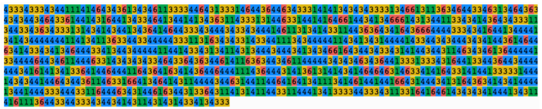
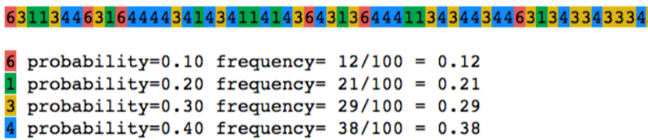
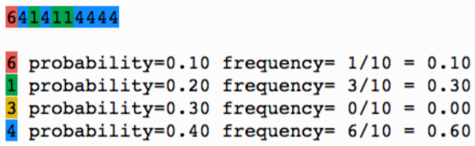

# Topic 1: Introduction to Probability and Statistics

## 1.1 Introduction to Probability and Statistics

+ Why should you care about prob&stat?
  + a powerful tool to deal w/ uncertainty
  + example: Navigation software
    + Certainty: find the _shortest_ route from a to b
    + Uncertainty: find the _fastest_ rout from a to b
  + example: Search engine
    + Certainty: find _all_ web pages that contain the word "Trump", "Hillary"
    + Uncertainty: find the 10 _most relevant_ pages for the query "Trump, Hillary debate"
      + not about certain words appeared
      + about what pages really most relevant up to date
  + example: Insurance company
    + Certainty: if a person w/ life insurance dies, the insurance company has to pay the family $X
    + Uncertainty: what is the minimal life insurance premium such that _the probability_ that the life insurance company will be bankrupt in 10 years is smaller than 1%?

+ What will learn in the course?
  + Navigation and search engine problems are advanced, in this class you will learn the foundations
  + Solve basic problems of reasoning under uncertainty
  + Examples
    + if you flip a coin 100 times, what is the probability of getting at most 10 "heads"?
    + what is the probability of getting a "4 of a kind" hand in poker?

+ Computer science examples
  + If you want to hash 1,000,000 elements and can allow 5 indirections for only 10 elements, how big does the table need to be?
  + Suppose that the expected time between failures for a router in one year.  What is the probability that the router will fail during the first month?

+ Some don't belief in statistics
  
  > I don't believe in statistics.  There are too many factors that can't be measured.  You can't measure a ballplayer's heart. - Red Auerbach, basketball coach

+ Summary
  + Uncertainty is all around us
  + Probability and Statistics provide a rational way to deal w/ uncertainty

+ Probability vs Statistics
  + [Cross Validated](https://tinyurl.com/y8utuukd):
    + probability theory: considering some underlying process which has some randomness or uncertainty modeled by random variables, and figuring out what happens
    + statistics: observing something that has happened, and trying to figure out what underlying process would explain those observations
  + [Michael Hochster @Quaro](https://www.quora.com/What-is-the-relationship-between-statistics-and-probability)
    + probability: starting with a model, w/ the given model, computing probabilities of observing various things
    + statistics: starting with observations and then trying to guess what model produced them


+ [Original Slides](https://tinyurl.com/y75qx6vl)


### Problem Set

+ Probability and statistics help us understand, analyze, and utilize random phenomena.

1. Which of the following are best solved using probability and statistics?<br/>
  a. Predicting the number of rainy days in April.<br/>
  b. Approximating the closing price of IBM stock tomorrow.<br/>
  c. Estimating your potential winnings in a game of Blackjack.<br/>
  d. Guessing the winner of the next World Cup.<br/>

  Ans: abcd<br/>
  Explanation: All these events are uncertain, and can be addressed by various aspects of probability and statistics, some of which we will encounter in this course.

2. What are probability and statistics useful for?<br/>
  a. Quantifying uncertainty.<br/>
  a. Finding exact solutions to mathematical equations.<br/>
  c. Making predictions about the future.<br/>

  Ans: ac<br/>
  Explanation
  + True. Just note that some random phenomena can be better quantified than others.
  + False. There is no uncertainty here.
  + True. Of course, the accuracy may depend on what we predict, and how far into the future.


### Lecture Video

<a href="https://tinyurl.com/y7nx6ec2" target="_BLANK">
  
</a><br/>


## 1.2 What is Probability Theory

+ What is Probability Theory?
  + Probability theory: a __mathematical__ framework for computing the probability of complex events
  + Assumption: __we know the probability of the basic events.__
  + the precise meaning of "probability" and "event"?
  + giving precise definitions later in the class
  + relying on common sense at first

+ A simple (?) question
  + flipping a fair coin w/ equal probabilities of "heads" or "tails"
  + what does the statement mean?
    + flipping the coin $k$ times, $\exists\, k \gg 1$, say $k = 10,000$
  + the number of "heads" is __about__ $\frac{k}{2} = \frac{10,000}{2} = 5,000$
  + what does __about__ mean?

+ Simulating coin flips
  + using the pseudo random number generators in `numpy` to simulate the coin flips
  + instead of "Heads" and "tails", using $x_i = 0$ or $x_i = -1$
  + considering the sum $S_{10000} = x_1 + x_2 + \cdots + x_{10000}$
  + the number of heads is about 5,000 $\implies S_{10000} \approx 0$
  + varying the number of coin flips, dented by $k$
  + demo: generate $ n \times k$ coin flips w/ values $\pm 1$

    ```python
    import numpy as np
    # Generate the sum of k coin flips, repeat that n times
    def generate_counts(k=10000, n=100):
      X = 2*(np.random.rand(k, n) > 0.5) -1 # generate a kxn matrix of +-1 random numbers
      S = sum(X, axis=0)
      return S
    ```

  + the sum $S_{10000}$ is not __exactly__ 0, it is only __close to__ 0
  + using __probability theory__, calculate __how small__ is $|S_k|$
  + later, its wll be shown that the probability that $|S_k| \geq 4\sqrt{k}$ is smaller than $2 \times 10^{-8} = 0.000002\%$

+ Demo: simulation

  ```python
  from math import sqrt  
  figure(figsize=[13, 3.5])
  for j in range(2, 5):
    k = 10*8j
    counts = generate_counts(k=k, n=100)
    subplot(130 + j - 1)
    hist(counts, bin=10);
    d = 4*sqrt(k)
    plot([-d, -d], [0, 30], 'r')
    plot([+d, +d], [0, 30], 'r')
    grid()
    title('{0:d} flips, bound=+-{1:6.1f}'.format(k, d))

  figure(figsize=[13, 3.5])
  for j in range(2, 5):
    k = 10*8j
    counts = generate_counts(k=k, n=100)
    subplot(130 + j - 1)
    hist(counts, bin=10);
    xlim([-k, k])
    d = 4*sqrt(k)
    plot([-d, -d], [0, 30], 'r')
    plot([+d, +d], [0, 30], 'r')
    grid()
    title('{0:d} flips, bound=+-{1:6.1f}'.format(k, d))
  ```

+ Summary
  + executing some experiments summing $k$ random numbers: $S_k = x_1, x_2 + \cdots + x_k$
  + the probability of the value of $x_i, \; i = 1, 2, \dots, k$

    \[ p(x_i) = \begin{cases} 1/2 & \text{for } x_i = -1 \\ 1/2 & \text{for } x_i = +1 \end{cases} \]

  + experiments show that the sum $S_k$ is (almost) always in the range $[-4\sqrt{k}, 4\sqrt{k}]$

    \[\begin{align*}
      k \to \infty &\text{ s.t. }\frac{4\sqrt{k}}{k} = \frac{4}{\sqrt{k}} \to 0 \\
      \therefore\; k \to \infty &\text{ s.t. } \frac{S_k}{k} \to 0
    \end{align*}\]

+ Math interpretation
  + math involved in __proving__ (a precise version of) the statements above
  + in most cases, __approximating__ probabilities using simulations (Monte-Carlo simulations)
  + calculating the probabilities is better because
    + providing a precise answer
    + much faster than Monte-Carlo simulations


+ [Original Slides](https://tinyurl.com/ya5gx8z7)


### Lecture Video

<a href="https://tinyurl.com/ydz88by5" target="_BLANK">
  
</a><br/>


## 1.3 What is Statistics

+ What is statistics?
  + probability theory: computing probabilities of complex events given the underlying base distribution
  + statistics: 
    + the opposite direction of probability
    + given __data__ generated by a __stochastic process__
    + __inferring__ properties of the stochastic process

+ Example: deciding whether a coin is based
  + probability: discussing the distribution of the number of heads when flipping a fair coin many times
  + statistics:
    + flipping a coin 1000 times and get 570 heads
    + able to conclude that the coin is biased (not fair)?
    + what to conclude if getting 507 heads?

+ The logic of Statistical Inference
  + suppose that the coin is fair
  + using __probability theory__ to compute the probabilities of getting at least 570 (507) heads
  + probability is very small $\implies$ __reject__ <span style="color: red;">with confidence</span> the hypothesis that the coin is fair

+ Calculating the answer
  + modeling the coin flip

    \[ x_i = \begin{cases} -1 & \text{for tail} \\ +1 &\text{for head} \end{cases} \]

  + observing the sum $S_k = \sum_{i=1}^k x_i$. here $k = 1000$
  + 570 heads out of 1000 flips
    + 570 heads: $S_{1000} = 570 -430 = 140$ 
    + the value 140 is very unlikely that $|S_k| > 4\sqrt{k} \approx 126.5$

    $\therefore$ it is very unlikely that the coin is unbiased.
  + 507 heads out of 1000 flips

    \[ 507 \text{ heads } = 493 \text{ tails }\implies S_{1000} = 14, \quad 14 \ll 126.5 \]

    $\therefore$ we cannot conclude that the coin is biased.
  + Conclusion
    + The probability that an unbiased coin would generate a sequence w/ 570 or more heads is extremely small $\implies$ able to conclude, <span style="color: red;">with high confidence</span>, that the coin is biased
    + on the other hand, $|S_{1000}| \geq 14$ is quite likely $\implies$ getting 507 heads does not provide evidence that the coin is biased

+ Real-world examples
  + why should we care whether a coin is fair?
    + this is a valid critique
    + examples where knowing a coin is biased or not is required
  + Case I: Polls
    + suppose elections will take place in a few days and we want to know how people plan to vote
    + suppose there are to parties: D and R
    + take a survey for __all__ voters $\to$ expensive
    + using a poll instead: call up a small random selected set of people
    + call $n$ people at random and count the number of D votes
    + can you say <span style="color: red">with confidence</span> that there are more D votes, or more R votes?
    + mathematically equivalent to flipping a biased coin
    + asking whether you can say <span style="color: red">with confidence</span> that is is biased towards 'heads' or towards 'tails'
  + Case 2: A/B testing
    + a common practice when optimizing a web page to perform A/B tests
    + A/B referred to two alternative designs for the page
    + to see which design users prefer by randomly presenting design A or design B
    + measuring how long the user stayed on a page, or whether the user clicked on a advertisement
    + to decide, <span style="color: red">with confidence</span>, which of the two designs is better
    + similar to making decision <span style="color: red">with confidence</span> on whether 'heads' is more probably than 'tails' or vice versa

+ Summary
  + statistics is about analyzing real-world data drawing conclusion
  + examples including
    + using polls to estimate public opinion
    + performing A/B tests to design web pages
    + estimating the rate of global warming
    + deciding whether a medical procedure effective


+ [Origin Slides](https://tinyurl.com/y8logskb)


### Problem Set

+ If we flip a coin a thousand times and get 507 heads, can we conclude with certainty that the coin is unbiased?

  Ans: No<br/>
  Explanation: Regardless of the bias of the coin (except when it is always heads or always tails), we can get 507 heads, hence we cannot deduce the bias with certainty. We will see how likely this outcome is later on.

1. In rolling a fair  6-sided die  1,200  times, roughly how many times would you expect to see a 2 ?<br/>
  a.  200 <br/>
  a.  600 <br/>
  a.  1,000 <br/>
  a. Not enough information is given<br/>

  Ans: a<br/>
  Explanation: The number 2 will appear in roughly one sixth of the flips, namely $1200 \times 1/6=200$ times.


2. A coin is tossed  1000  times and turns up heads  700  times. Is the coin biased?<br/>
  a. With high confidence, yes.<br/>
  b. Unclear.<br/>

  Ans: a<br/>
  Explanation: The probability that an unbiased coin would generate  700  heads is small. Hence we can be pretty confident that it is biased. How confident, we will see later on.


3. Which of the following describe the differences between probability and statistics?<br/>
  a. Probability predicts what will happen. Statistics, at least in part, uses what has already happened.<br/>
  b. Probability requires existing data. Statistics requires underlying models.<br/>
  a. Probability and statistics are two words describing the same thing.<br/>

  Ans: a<br/>
  Explanation
  + True. Probability analyzes given models. Statistics helps us understand the what we observe.
  + False. Probability requires underlying models. Statistics requires existing data.
  + False. As you can see from the previous two parts, they are different.


### Lecture Video

<a href="https://tinyurl.com/y9uvlvfn" target="_BLANK">
  
</a><br/>


## 1.4 A Puzzle

+ The three card puzzle
  + suppose there are 3 cards in a hat
    + RB: one card pained blue on one side and red on the other
    + BB: one card pained blue on both sides
    + RR: one card pained red on both sides
  + the setup
    + pick one of the three cards at random, flip it to a random side, and place it on the table
    + $U$: the color of the side of the card facing up (B or R)
  + do you wan to bet?
    + if the other side of the card has a different, dealer pay player $1.
    + if the other side has the same color, player pay dealer $1.
  + why is this a fair bet?
    + suppose $U$ is R
    + then the card is either RR or RB
    + therefore the other side can be either R or B
    + therefore in this case the odds are equal
    + a similar argument holds for the case where $U$ is B
  + simulation

    ```python
    red_bck = "\x1b[41m%s\x1b[0m"
    blue_bck = "\x1b[44m%s\x1b[0m"
    red = red_bck%'R'
    black = blue_bck%'B'
    Cards = [(red,black),(red,red),(black,black)]
    counts = {'same':0,'different':0}
    from random import random
    for j in range(50):
      i = int(random()*3.) # Select a random card
      side = int(random()*2.)
      C=Cards[i]
      if(side == 1): # select which side to be "up"
        C=(C[1], C[0])
      same= 'same' if C[0]==C[1] else 'different' 
        # count the number of times the two sides are the same or different.
      counts[same] += 1
      print(''.join(C)+' %-9s'%same, end='')
      if (j+1)%5 == 0:
        print()
    print()
    print(counts)
    ```

  + simulation result: not agree w/ the argument
    + in simulation: the two sides have the same color about twice the number of times that they have different color
    + player is twice as likely to lose as player is to win
    + on average, player lose 33 cents per iteration, $1 \times (2/3) - 1 \times (1/3)$
  + alternative argument<br/>
    if you pick a card at random 2/3 of the time, we pick a card where the two sides have the same color, and only 1/3 where the color is different
  + how can we be sure?
    + the original argument also sounds convincing, but is wrong
    + to be sure that our argument is correct, we need to define some concepts, including __outcome__ and __event__


+ [Original Slides](https://tinyurl.com/y9fxzvym)


### Problem Set

0. Why was the assumption that both players have a 50% chance of winning incorrect?<br/>
  a. We never accounted for a blue side.<br/>
  b. We cannot know the probability until many tests are performed.<br/>
  c. We are more likely to pick a card with the same color on both sides.<br/>
  d. We didn't consider the probability of drawing a card with the same color on both sides.<br/>

  Ans: c<br/>
  Explanation: If we see, say a blue card, then we are twice as likely to have picked the two-blue-sides card, hence the other side is twice as likely to be blue too. We will better understand that when we study conditional probability.

1. What is the probability of drawing a Queen from a deck of  52  cards?<br/>
  a. 1/52 <br/>
  b. 4/52 <br/>
  c. 1/2 <br/>
  d. 2/52<br/>

  Ans: b <br/>
  Explanation: There are 4 Queens in a deck of 52 cards. The probability is 4/52 .


2. If we repeat an experiment many times, the long-term frequencies of the outcomes converge to the probabilities. (True/False)

  Ans: True <br/>
  Explanation: Ture, in fact, as we will see, probabilities are defined to model long-term frequency averages.


### Lecture Video

<a href="https://tinyurl.com/ycw7a4cj" target="_BLANK">
  
</a><br/>


## 1.5 History of Probability and Statistics

#### 1.5.1 A short history of Probability and Statistics

+ Games of chance vs. Strength of evidence
  + brief history of statistics (detailed in 1.5.2)
  + Two concepts in practice of data analysis (top right diagram)
    + Rows: point-value hypothesis testing versus estimating magnitude with uncertainty
    + Columns: frequentist versus Bayesian methods. 
    + Cells indicate the typical information provided by each approach
  + R. Kass, [Statistical Inference: the big picture](http://www.stat.cmu.edu/~kass/papers/bigpic.pdf)
    + bottom left figure: The big picture of statistical inference.
      + Statistical procedures are abstractly defined in terms of mathematics but are used, in conjunction with scientific models and methods, to explain observable phenomena.
      + This picture emphasizes the hypothetical link between variation in data and its description using statistical models.
    + bottom right figure: A more elaborate big picture, reflecting in greater detail the process of statistical inference. 
      + hypothetical link (red dotted line):
        + data and random variables
        + key features of unobserved mechanisms and parameters
        + real-world and theoretical conclusions
      + data consisting of
        + regularity: often described in theoretical terms as a “signal,” sometimes conforming to simple mathematical descriptions or “laws”
        + unexplained variability: usually taken to be “noise”
      + other components
        + exploratory data analysis (EDA)
        + algorithms

  <div style="margin: 0.5em; display: flex; justify-content: center; align-items: center; flex-flow: row wrap;">
    <a href="https://link.springer.com/content/pdf/10.3758/s13423-016-1221-4.pdf" ismap target="_blank">
      
    </a>
    <a href="https://tinyurl.com/yd3yk5xm" ismap target="_blank">
      
    </a>
  </div>
  <div style="margin: 0.5em; display: flex; justify-content: center; align-items: center; flex-flow: row wrap;">
    <a href="https://tinyurl.com/yd3yk5xm" ismap target="_blank">
      
    </a>
  </div>

+ Games of chance
  + existed much longer than modern form developed
  + Sumeria, Assyria, ancient Greece, ancient Rome
  + knuckle bones (Talis)
  + repeat the basic game many times

+ From knuckle bones to dice and cards
  + wining or losing is up to chance, luck, or god
  + __equal probability assumption__
    + all outcomes w/ the same probability
    + simplest setting of probability
    + _true_ for dice and roulette
    + _not true_ for knuckle bones: different side w/ different probability $\to$ asymmetric

+ Long term frequencies w/ simulation of knuckle bone
  + the probability that a knuckle bone lands on a narrow face is smaller than it lands on a wide face
  + each knuckle bone different $\to$ the probabilities different
  + suppose that $p(6) = 0.1, p(1) = 0.2, p(3) =0.3, p(4) =0.4$
  + difference trials
    + top diagram: 1000 flips $\to$ result close to the setting
    + bottom left: 100 flips $\to$ distance away from the setting
    + bottom left: 10 flips $\to$ further away from the setting

    <div style="margin: 0.5em; display: flex; justify-content: center; align-items: center; flex-flow: row wrap;">
      <a href="https://tinyurl.com/yd8ag7aw" ismap target="_blank">
        
      </a>
      <a href="https://tinyurl.com/yd8ag7aw" ismap target="_blank">
        
        
      </a>
    </div>

+ Stopping a game in the middle
  + simplified version of problem in famous letter from Pascal to Fermat in 1654
  + suppose a card game of pure chance is played until one side wins
  + both players put in 1$
  + the winner takes the 2$
  + suppose the game is <span style="text-decoration: underline; font-weight: bold;">stopped</span> before either side wins
  + how should the 2$ be split?
  + what is the probability that player 1 will win given the cards currently held?

+ The frequentist point of view
  + to assign a probabilities to the outcomes of a game/experiment is the same as saying that if we repeat the game many times, the long term frequencies of the outcomes converge to the probabilities
  + provide a solid foundation on which probability theory is built
  + make sense in game and other situations where one can repeat the same random choice many times
  + not always possible...

+ Situations where repetition is hard
  + a meteorologist says the probability of rain tomorrow is 10%
    + what does that mean?
    + it will either rain or not rain
    + tomorrow happens only once
  + suppose a surgeon says that there is 2% chance of complications w/ a particular surgery
    + it might mean that 2% of the patients that underwent the surgery had complications
    + what does it mean for __you__?
    + maybe most of the complications where with patients older than 90 (and you are 35) ...

+ The colloquial meaning of probability
  + the word 'probable' used before 1650, but meaning not quantitative
  + today 'probable' and 'probably' commonly used as meanings w/ qualitative, not quantitative
  + Merriam Webster Dictionary - Probably
    + def: insofar seems reasonably true, factual, or to be expected; w/o much doubt
    + e.g., is probably happy; it will probably rain

+ A probable doctor
  + before 1660 it was common to say that someone is a 'probable doctor'
  + it meant that the doctor was <span style="text-decoration: underline; font-weight: bold;">approved</span> by some authority
  + at this time, in Europe, the authority was usually the church
  + today MDs approved by a board, after passing the board exams

+ Combining evidence for Diagnosis
  + diagnosing a patient requiring combining pieces of information (see diagram)
  + most of the information uncertain (measurement error)
  + different pieces having different relevance

    <div style="margin: 0.5em; display: flex; justify-content: center; align-items: center; flex-flow: row wrap;">
      <a href="https://labtestsonline.org/articles/laboratory-test-reliability" ismap target="_blank">
        
      </a>
    </div>

+ Combining evidence
  + central to many fields: medicine, economics, investment, law, science, technology, ...
  + typically, not repeating an experiment many times
  + the probability theory used, but much of the discussion not mathematical
  + closely related concepts: fairness, pricing
  + a popular approach: Bayesian Statistics


+ [Original Slides](https://tinyurl.com/yd8ag7aw)


### 1.5.2 History poster

+ The poster: timeline of probability and statistics
  + two threads
    + repeated games of chance (red): more mechanical side
    + the strength of evidence and degrees of belief (green): more about evidence
  + before the formal developed
    + red thread
      + playing games repeatedly, including knuckle bones, dice, and cards
      + question: what is the right way to split money when to stop a game earlier
    + green thread
      + not well defined
      + question: what to do w/ a state of uncertainty
      + how to make conclusions w/ some evidence
      + how to weight different evidences that might be contradictory
    + applied fields: law, medicine, science, technology, and public policies
  + starting w/ the discussions mainly btw Pascal and Fermat around 1650~1660 (blue line)
  + the modern mathematical probability and statistics starting to be developed
  + frequentist approach
    + mechanism such as rolling dice
    + Andre Kolmogorov: the axiom of probability
    + Vladimir Vapnik: developed some foundations for machine learning
  + Bayesian approach
    + taking belief before seeing any evidence
    + updating beliefs w/ evidence
    + Bruno De-finetti
  + tension btw frequentist and Bayesian approaches: "All your Bayes are belong to us" - Vladimir Vapnik
  + statistics practitioners
    + using probability and statistics to solve real world problem
    + not dogmatic to either side
    + using the tools when appropriate, including frequentist, Bayesian or even heuristic
    + Ronald Fisher: brought statistics to science and social sciences
    + John Tukey
    + Leo Breiman: inventor of bagging and cart and other algorithms
    + practitioners w/ different arrows due to their uniqueness
    + taking various ideas from probability and statistics and applying to real world problems
  + hypothesis testing and p-value
    + frequentist approach to argue about degree of belief
    + interesting contrast
    + commonly used in science to accept or reject hypothesis according to the strength of evidence
  + machine learning, big data, neural networks
    + modern statistics practitioners
    + long history by using important methods developed
  + Reference: Ian hacking, "The Emergence of Probability"

  <div style="margin: 0.5em; display: flex; justify-content: center; align-items: center; flex-flow: row wrap;">
    <a href="https://tinyurl.com/yd8ag7aw" ismap target="_blank">
      
    </a>
  </div>


+ [Original Slide](https://tinyurl.com/ybubuv96)


### Problem Set

0. Machine learning uses: <br/>
  a. Only Bayesian statistics<br/>
  b. Only the Frequentist approach.<br/>
  c. Both the Bayesian and Frequentist approaches.<br/>

  Ans: c <br/>
  Explanation: Machine learning is a practical field, hence uses any technique it finds useful, in particular it uses both Bayesian and Frequentist statistics.


### Lecture Video

<a href="https://tinyurl.com/yd58kkr3" target="_BLANK">
  
</a><br/>


## Lecture Notebook 1


## Programming Assignment 1


