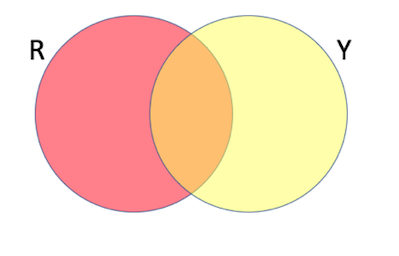
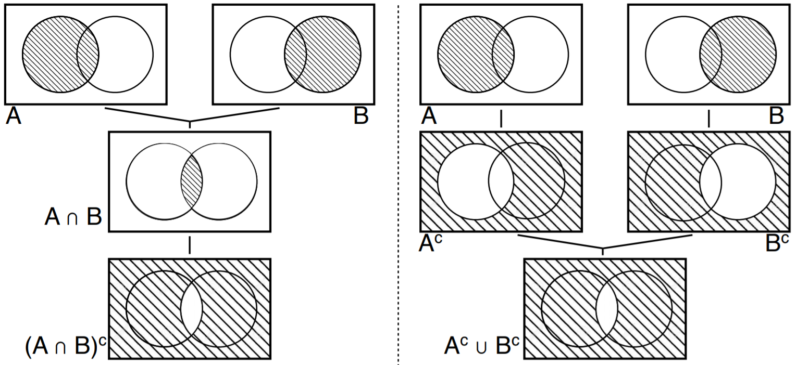
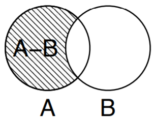
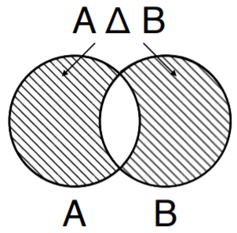
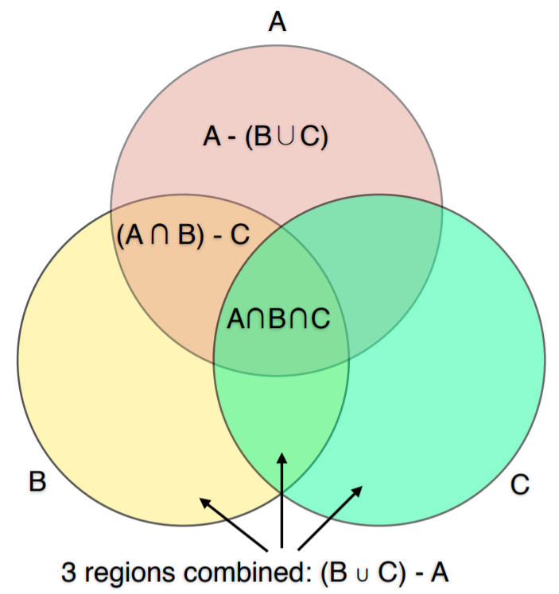

# Topic 2: Sets

## 2.1 Notation

+ Elements
  + foundations, building blocks of sets
  + can be anything: football player, Google, aspirin
  + structure: letters, words, documents, or web pages
  + numbers: for probability and statistics

+ Elements to sets
  + beyond individual elements
  + "Bigger picture"
  + set: collection of elements
  + define { specify elements }

+ Specification
  + explicit:
    + coin: {heads, tails}
    + bits: {0, 1}
    + die: {1, 2, 3, 4 ,5 6}
  + implicit:
    + digits: {0, 1, 2, ..., 9}
    + letters: {a, b, ..., z}
    + days: {Monday, ..., Sunday}
  + descriptive: {four-letter words} = {love, like, dear, ...}
  + explicit $\to$ implicit $\to$ descriptive: compact & expressive $\to$ ambiguous

+ Common sets
  + integers: $\mathbb{Z}$ = {..., -2, -2, 0, 1, 2, ...}
  + natural: $\mathbb{N}$ = {0, 1, 2, ...}
  + positive: \mathbb{P}$ = (1, 2, 3, ...)
  + rationals: $\mathbb{Q}$ = {integer ratios $m/n, \; n \neq 0$}
  + Reals: $\mathbb{R}$ = { ... Google ...}
  + convention:
    + set: Upper case, e.g., A
    + elements: lower case;, e.g., a

+ Membership
  + if element $x$ is in a set $A$, it is a <span style="color: magenta; font-weigh: bold;">member</span> of, or <span style="color: magenta; font-weigh: bold;">belongs</span> to $A$, denoted $x \in A$
    + e.g., $0 \in \{0, 1\}, \;1 \in \{0, 1\}, \;\pi \in \mathbb{R}$
  + Equivalently, $A$ <span style="color: magenta; font-weigh: bold;">contains</span> $x$, written $A \ni x$
    + e.g., $\{0, 1\} \ni 0, \;\{0, 1\} \ni 1, \;\mathbb{R} \ni \pi$
  + If $x$ is <span style="color: magenta; font-weigh: bold;">not</span> in $A$, then $x$ is <span style="color: magenta; font-weigh: bold;">not a member</span>, or does <span style="color: magenta; font-weigh: bold;">not belong</span> to $A$, denoted $x \notin A$
    + e.g., $2 \notin \{0, 1\}, \;\pi \notin \mathbb{Q}$
  + Equivalently, $A$ does <span style="color: magenta; font-weigh: bold;">not contain</span> $x$, $A \not\ni x$
    + e.g., $\{0, 1\} \not\ni 2, \;\mathbb{Q} \not\ni \pi$

+ Don't matter
  + order: $\{0, 1 \} = \{1, 0 \}$
  + repetition: $\{0, 1 \} = \{0, 1, 1\}$
  + order matters: using <span style="color: cyan; font-weigh: bold;">ordemagenta tuples</span>: $(0, 1) \neq (1, 0)$
  + repetition matters: using <span style="color: cyan; font-weigh: bold;">multisets</span>, or <span style="color: cyan; font-weigh: bold;">bags</span>

+ Special sets
  + empty set: containing no elements, $\varnothing$ or $\{ \}$, e.g., $\forall\, x, \,x \in \varnothing$, $\forall$- All, every
  + universal set: all possible elements, $\Omega$, e.g., $\forall\,x, \;x \in \Omega$
    + $\Omega$: considering only relevant elements, e.g., integers - $\Omega = \mathbb{Z}$, "prime" = 2, 3, 5, ...
    + $\Omega$ depending on application, e.g., temperature - $\Omega = \mathbb{R}$, text - $\Omega = \{\text{words}\}$
  + only one $\varnothing$: set w/o elements

+ Set definition in Python
  + define a set: `{...}` or `set(...)`
    + e.g., `Set1 = {1, 2}; print(Set1) $ {1, 2}`, `Set2 = set({2, 3}); print(Set2) ${2, 3}`
  + empty set: using only `set()` or `set({})`
    + e.g., `Empty1 = set(); type(Empty1) # set; print(Empty1) # set{}`
    + e.g., `Empty2 = set({}); type(Empty2) # set; print(Empty2) # set{}`
    + e.g., `NotASet = {}; type(NotASet) # dict`, `{}` not an empty set

+ Membership
  + $\in$: `in`

    ```python
    Furniture = {'desk', 'chair'}
    'desk' in Furniture     # True
    'bed' in Furniture      # False
    ```

  + $\notin$: `not in`

    ```python
    Furniture = {'desk', 'chair'}
    'desk' not in  Furniture  # False
    'bed' not in Furniture    # True
    ```

+ Testing if empty set, size
  + test empty: `not`
    + e.g., `S = set(); not S # True`, `T = {1, 2}; not T # False`
  + size: `len()`
    + e.g., `print(len(S)) # 0`, `print(len(T)) # 2`
  + check if size is 0: `len() == 0`
    + e.g., `print(len(S) == 0) # True`, `print(len(T) == 0) # False`

+ [Original Slides](https://tinyurl.com/y7uxmevo)


### Problem Sets

0. The number zero is an element of the empty set. (True.False)

  Ans: False <br/>
  Explanation: Empty set has no elements. No zero, no zilch, no nada - nothing!


1. The empty set $\varnothing$ is unique.<br/>
   The universal set $\Omega$ is unique.

  Ans: True/False<br/>
  Explanation: $varnothing$ is the unique set having no elements.  $\Omega$ varies. It can be  \mathbb{R}, \mathbb{C}, etc.


2. Which of the following hold?<br/>
  a. $0 \in \{0, 1\}$<br/>
  b. $a \in \{A, B\}$<br/>
  c. $\{a, b\} \in \{\{a, b\}, c\}$<br/>
  d. $a \in \{{a, b}, c\}$<br/>
  e. $\{a\} \in \{a\}$<br/>

  Ans: ac<br/>
  Explanation:
  + True. $\{0, 1\}$  contains two elements, and 0 is one of them.
  + False. $\{A, B\}$ contains two elements,  A  and  B , but not  a .
  + True. $\{\{a, b\}, c\}$ has two elements, the set $\{a, b\}$, and  c .
  + False. $a$ is an element of $\{a, b\}$, not of $\{\{a, b\}, c\}$ .
  + False. $\{a\}$ has only one element $a$, not the set $\{a\}$. More about that in the next lecture.

3. Recall that $\varnothing$ is the empty set. How many elements do the following sets have?
  a. $\varnothing$
  b. $\{\varnothing\}$
  c. $\{\varnothing, \varnothing\}$
  d. $\{\{\varnothing\}, \varnothing\}$

  Ans: a - 0, b - 1, c - 1, d - 2<br/>
  Explanation:
  + a. 0, the empty set has no elements.
  + b. 1, just the empty set.
  + c. 1, $\{$\varnothing, \varnothing\} = \{\varnothing\}$ , hence contains one element.
  + d. 2, $\varnothing$ and $\{\varnothing\}$.


4. How many elements do the following sets have?
  a. $\{a\}$
  b. $\{a, a\}$
  c. $\{a, \varnothing\}$
  d. $\{\{a\}, a\}$
  e. $\{\{\{a\}\}\}$

  Ans: a - 1, b - 1, c - 2, d - 2, e - 1<br/>
  Explanation:
  + $\{a\}$ has one element, $a$.
  + As we mentioned $\{a, a\} = \{a\}$, hence both sets have one element.
  + $a$ is different from the set $\{a\}$ that contains $a$, hence two elements.
  + One element, the set $\{a\}$.


5. How many elements do the following sets have?<br/>
  a. $\{a, b\}$<br/>
  b. $\{\{a, b\}\}$<br/>
  c. $\{\{a, b\}, \{b, a\}, \{a, b, a\}\}$<br/>
  d. $\{a, b, \{a, b\}\}$<br/>

  Ans: 1 - 2, b - 1, c - 1, d - 3<br/>
  Explanation:
  + The elements are $a$ and $b$, hence 2.
  + There is a single element, the set $\{a, b\}$, hence 1.
  + Again just one element, the set $\{a, b\}$, written thrice, hence 1.
  + The elements are  $a$, $b$, and $\{a, b\}$, hence 3.


6. Animal anagrams<br/>
  Let $A$ be the set of anagrams of singular English animal names. For example, "nails" and "slain" are anagrams of "snail", so all three $\in A$, yet "bar" $\notin A$.

  Which of the following $\in A$?<br/>
  a. tan<br/>
  b. pea<br/>
  c. low<br/>
  d. bare<br/>
  e. loin<br/>
  f. bolster<br/>

  Ans: abcdef<br>
  Explanation: ant, ape, owl, bear, lion, lobster, so all $\in$. Maybe a bit much to learn the meaning of $\in$ and $\notin$, but hopefully you had fun.


7. Elements of a set<br/>
  List the elements of the following sets.

  Write each element once, using 'emptyset' for $\varnothing$ and 'none' if there are no elements. Separate elements by commas, without any spaces.

  a. $\{a\}$<br/>
  b. $\{\{a\}\}$<br/>
  c. $\{a, \{b\}\}$<br/>
  d. $\{\varnothing\}$<br/>
  e. $\varnothing$<br/>

  Ans: a - (a); b - ({a}); c - (a,{b}); d - ($\varnothing$); e - (none)


8. Sets from elements<br/>
  Write the sets containing the following elements.

  Enter your answer without any spaces, list every element once, and write emptyset for $\varnothing$.

  a. $a$<br/>
  b. $a, a$<br/>
  c. $\{a\}$<br/>
  d. $\{a, b\}, \{b, a\}$<br/>
  e. $a,{b}$<br/>
  f. $\varnothing$<br/>
  g. no elements<br/>

  Ans: <br/>
  Explanation:
  + a. {a}
  + b. {{a}}
  + c. {{a,b}}  or {{b,a}}
  + d. {a,{b}}  or {{b},a}
  + e. {$\varnothing$}  or {emptyset}
  + f. $\varnothing$ or emptyset


### Lecture Video

<a href="url" target="_BLANK">
  
</a><br/>


## 2.2 Basic Sets

+ Sets within sets
  + specify a set within a universal, or any other set
    + $\{ x \in A \,{\color{Magenta}{|}}\, \dots\} = \{\text{element } x \text{ in } A {\color{Magenta}{\text{ such that }}} \dots \}$ or $\{ x \in A {\color{Magenta}{:}} \dots\}$
    + e.g., $\mathbb{N} = \{x \in \mathbb{Z} \,|\, x \geq 0\}, \mathbb{P} = \{x \in \mathbb{N} \,|\, x > 0\}$
  + solutions to equations
    + $\{x \in \mathbb{R} \,|\, x^2 \geq 0\} = \mathbb{R}$
    + $\{x \in \mathbb{R} \,:\, x^2 = 1\} = \{-1, 1\}$
    + $\{x \in \mathbb{R} \,|\, x^2 = 0\} = \{0\} \gets$ a single-element set is a <span style="color: Magenta;">singleton</span>
    + $\{ x \in \mathbb{R} \,|\, x^2 = -1\} = \varnothing$
    + $\{x \in \mathbb{C} \,|\, x^2 = -1\} = \{i, -i \}$

+ Integer intervals
  + integers from $m$ to $n$, inclusive: $\{m, \dots, n\} = \{i \in \mathbb{Z} \,|\, m \leq i \leq n\}$
    + e.g., $\{3, \dots, 5\} = \{i \in \mathbb{Z} \,|\, 3 \leq i \leq 5\} = \{3, 4, 5\}$
    + e.g., $\{3, \dots, 4\} = \{i \in \mathbb{Z} \,|\, 3 \leq i \leq 4\} = \{3, 4\}$
    + e.g., $\{3, \dots, 3\} = \{i \in \mathbb{Z} \,|\, 3 \leq i \leq 3\} = \{3\}$
    + e.g., $\{3, \dots, 2\} = \{i \in \mathbb{Z} \,|\, 3 \leq i \leq 2\} = \varnothing$
  + convention: $[n] = \{1, \dots, n\}$

+ Real intervals
  + $[a, b] = \{x \in \mathbb{R} \,|\, a \leq x \leq b\}$, e.g. [3, 5]
  + $(a, b) = \{x \in \mathbb{R} \,|\, a < x < b\}$, e.g., (3. 5)
  + $[a, b) = \{x \in \mathbb{R} \,|\, a \leq x < b\}$, e.g., [3, 5)
  + $(a, b] = \{x \in \mathbb{R} \,|\, a < x \leq b\}$, e.g., (3, 5]
  + `( )`: not in set; `[ ]`: in set
  + singleton: $[3, 3] = \{3\}$
  + $[3, 2] = [3. 3) = (3, 3] = \varnothing$

+ Divisibility
  + $\exists\, m, n \in \mathbb{Z}$, if $n = c \cdot m$ for some $c \in \mathbb{Z}$, we say that <span style="color: magenta;">n is a multiple of $m$</span>, or <span style="color: magenta;">$m$ divides $n$</span> and written <span style="color: magenta;">$m \,|\, n$</span>
    + $\underbrace{6}_{n} = \underbrace{2}_{c} \cdot \underbrace{3}_{m} \to \underbrace{3}_{m}\,|\,\underbrace{6}_{n}$
    + $\underbrace{-8}_{n} = \underbrace{(-2)}_{c} \cdot \underbrace{4}_{m} \to \underbrace{4}_{m} \,|\, \underbrace{-8}_{n}$
    + $0 = 0 \cdot (-2) \to -2 | 0$
  + if no such $c$ exists, <span style="color: magenta;">$m$ does not divide $n$</span>, or <span style="color: magenta;">$n$ is not a multiple of $m$</span>, denoted <span style="color: magenta;">$m \nmid n$</span>
    + $\not\exists\, c \in \mathbb{Z} \textrm{ s.t. } 4 = c \cdot 3 \to 3 \nmid 3$
    + $0 \nmid n \;\forall\, n \neq 0$

+ Quiz
  + Multiples:
    + $3 \,|\, ? \to \{\dots, -6, -3, 0, 3, 6, \dots\}$
    + $1 \,|\, ? \to \mathbb{Z}$
    + $0 \,|\, ? \to 0$
  + Divisors
    + $? \,|\, 4 \to \pm 1, \pm 2, \pm 4$
    + $? \,|\, 0 \to \mathbb{Z}$
    + $? \,|\, \forall\, n\neq 0 \to \pm 1, \pm n$

+ Set of multiples
  + integer multiples of $m$: $\exists\, m \in \mathbb{Z},\; _m\mathbb{Z} \stackrel{\text{def}}{=} \{ i \in \mathbb{Z}: m \,|\, i\}$
    + even number: $_2\mathbb{Z} = \{\dots, -4, -2, 0, 2, 4, \dots\} \stackrel{\text{def}}{=} \mathbb{E}$
    + ${}_1\mathbb{Z} = \{\dots, -2, -1, 0, 1, 2, \dots\} = \mathbb{Z}$
    + ${}_0\mathbb{Z} = \{0\}$
  + multiplies of $m$ in {1..n}: $\exists\; m\in \mathbb{Z}, n \in \mathbb{P}, {}_m[n] \stackrel{\text{def}}{=} \{i \in [n]: m \,|\, i\}$
    + $_3[13] = \{i \in \{i, \dots, 13\}: 3\,|\,i\} = \{3, 6, 9, 12\}$
    + $_7[13] = \{7\},\; _1[13] = [13],\; _{14}[13] =\, _0[13] = \varnothing$

+ Intervals and Multiples in Python
  + $\{0, \dots, n-1\}$: `range(n)`
    + note: [n] = {1...n}
    + e.g., `print(set(range(3))) # {0, 1, 2}`
  + $\{m, \dots, n-1\}$: `range(m, n)`
    + e.g., `print(set(range(2, 5))) # {2, 3, 4}`
  + $\{m,\, m+d,\, m+2d,\, \dots\} \leq n-1$: `range(m, n, d)`
    + e.g., `print(set(range(2, 12, 3))) # {8, 2, 11, 5}`

+ [Original Slides](https://tinyurl.com/y9coykwu)


### Problem Sets

0. How many elements are there in the real interval [2,4)? <br/>
  a. 1<br/>
  b. 2<br/>
  c. 3<br/>
  d. Infinitely many<br/>

  Ans: d<br/>
  Explanation: The real interval [2,4) contains the infinitely many points 2, 2.1, 2.11, 2.111, .... (and more..).


1. Which of the following define a set unambiguously?{br/>}
  a. $\{3, 4, 5, 7\}$<br/>
  b. {negative primes}<br/>
  c. $\{x \in \mathbb{R} \,∣\, x^2 \cdot y > 100}\ $<br/>
  d. {good drivers in San Diego}<br/>

  Ans: ab<br/>
  Explanation:
  + a. True. The most vanilla type of definition.
  + b. <span style="color: magenta;">True.</span> Happens to be the empty set.
  + c. <span style="color: magenta;">False.</span> $y$ is not defined, so neither is the set.
  + d. False. What's good for the goose is not good for the gander...


2. Which of the following are true?<br/>
  a. $0 \in $ {Even numbers} <br/>
  b. $0.5 \in \mathbb{N}$<br/>
  c. $\{−1\} \in \{x \in \mathbb{R}∣x^2 = 1\}$<br/>
  d. $0.5 \in \{x \in \mathbb{Z} \,∣\, 2x^2 + x − 1 = 0\}$<br/>
  e. $\varnothing \in \mathbb{Q}$<br/>
  f. unanswered<br/>

  Ans: a<br/>
  Explanation:
  + a. True.
  + b. False.  0.5 is not an integer to begin with.
  + c. False.  {−1} is a set. $\{−1\} \subset \{x \in \mathbb{R} \,∣\, x^2=1]}$
  + d. False.  0.5  is not integer.
  + e. <span style="color: magenta;">False.</span>  $\varnothing \subset \mathbb{Q}$.


3. Which of the following hold?<br/>
  a. $\{0\}=\varnothing$ <br/>
  b. $\{0,1,2\}=\{2,0,1,1\}$ <br/>
  c. $\{\{0\},1\}=\{0,\{1\}\}$<br/>

  Ans: b<br/>
  Explanation
  + a. False. {0} contains the element 0, while ∅ contains no elements.
  + b. True. The order and repetition don't matter.
  + c. False. 1 is an element of the set on the left, but not on the right.


4. Which of the following are true?<br/>
  a. $e \in \{1,2,…,10\}$<br/>
  b. $π \in (3,3.5)$<br/>
  c. $2 \in[−2,2)$<br/>

  Ans: b<br>
  Explanation
  + a. False.  {1,2,…,10} is a set of integers, but e = 2.71828 is not an integer.
  + b. True. As 3 < π < 3.5 , π ∈ (3,3.5).
  + c. False. [−2,2) does not include 2.


5. List all the elements of the following sets.

  Note: Represent your answers in ascending order, For example the set {1,-1,0} should be written as -1,0,1 (without whitespace).

  a. $\{x \in \mathbb{Z} \,∣\, −2 \leq x < 5\}$
  b. $\{x \in \mathbb{N} \,∣\, x^2+x−2=0\}$
  c. $\{x \in \mathbb{R} \,∣\, x^3+x−2=0\} $
  
  Ans: a - (-2, -1, 0, 1, 2, 3, 4); b - (1); c - (1)


### Lecture Video

<a href="https://tinyurl.com/y897pvrl" target="_BLANK">
  
</a><br/>


## 2.3 Venn Diagrams

+ Venn diagram
  + Visualizing sets, regions, elements, points
  + two sets and three sets

    <div style="margin: 0.5em; display: flex; justify-content: center; align-items: center; flex-flow: row wrap;">
      <a href="https://mathworld.wolfram.com/VennDiagram.html" ismap target="_blank">
        
      </a>
    </div>

  + why Venn
    + an illustration of the relationships between and among sets, groups of objects that share something in common
    + visualizing definitions and proofs
  + relationship w/ sets
    + visualizing
    + reasoning
    + proving
    + understanding

+ example of matplotlib_venn package
  + install the package first
  + demo code for two sets

    ```python
    import matplotlib .pyplot as plt
    import matplotlib_venn as venn

    S = {1, 2, 3}
    T = {0, 2, -1, 5}
    venn.venn2([S, T], set_labels=('S', 'T'))

    plot.show(
    ```

  + function for 3 sets: `venn.venn3([S, T, U], set_labels=('S', 'T', 'U'))`

+ A Venn diagram of unions and intersections for two sets, $A$ and $B$ and their complements, within a universe $\Omega$ 

  <div style="margin: 0.5em; display: flex; justify-content: center; align-items: center; flex-flow: row wrap;">
    <a href="https://tinyurl.com/y77s4hje" ismap target="_blank">
      
    </a>
  </div>


+ [Original Slides](https://tinyurl.com/ybsaftw3)


### Problem Sets

0. The Venn diagram for 2 sets has 4 regions, and for 3 sets there are 8 regions. How many regions are there in a Venn diagram of 4 sets?<br/>
  a. 12<br/>
  b. 14<br/>
  c. 16<br/>
  d. 18<br/>

  Ans: c<br/>
  Explanation: 16 regions. Each region corresponds to the combination of whether its elements belong to each of the four sets. For example, in the first set, in second set , not in third set, and yes in fourth set.


### Lecture Video

<a href="https://tinyurl.com/y88vfmgs" target="_BLANK">
  
</a><br/>


## 2.4 Relations

+ Relations types
  + human relations: complicated
  + number relations: $=,\, \leq,\, <,\, \dots$
  + generalized to set

+ Equality
  + all men are created equal
    + generalization: = of number
    + Sets A and B are <span style="color: magenta;">equal</span>, denoted $A {\color{Magenta}{=}} B$, if they have exactly the same elements
    + e.g., $\{0, 1\} = \{1, 0\}$
  + all sets are <span style="color: magenta;">not</span> created equal
    + if A and B are nor equal, they are <span style="color: magenta;">different</span>, denoted $A {\color{Magenta}{\neq}} B$
    + e.g., $\{0, 1\} \neq \{1, 2\}$
  + $=$: <span style="color: cyan;">all</span> elements must be identical, e.g., $\{1, 2, 4\} = \{4, 1, 2\}$
  + $\neq$: <span style="color: cyan;">one different</span> element enough, e.g., $\{1, 2, 4\} \neq \{4, 1, 2, 8\}$

+ Intersection
  + two sets <span style="color: magenta;">intersect</span> if they share at least one common element
    + $\exists\, x, \; x \in A \wedge x \in B$
    + e.g., $\{0, 1\} \wedge \{1, 2\} = \{1\}$, $[3, 4] \wedge [2, 5] = [3, 4]$
  + two sets are <span style="color: magenta;">disjoint</span> if they share no elements
    + $\not\exists\, x \text{ s.t. } x \in A \wedge x \in B$
    + mutually exclusive
    + e.g., $\{0, 1\} \wedge \{2, 3\} = \varnothing$, $[3, 4] \wedge (4, 5] = \varnothing$
  + Remarks
    + $\varnothing$ disjoint any set
    + non-empty $\Omega$ intersects every set
    + a set intersects itself $\iff$ non-empty
  + generalization: several sets
    + <span style="color: magenta;">intersect</span> if <span style="color: cyan;">all share</span> a common element
    + <span style="color: magenta;">mutually disjoint</span> if <span style="color: cyan;">every two</span> are disjoint

+ Subsets
  + generalization: $\leq$
  + every element in A is also in B $\implies$ A is a <span style="color: magenta;">subset of</span> B, denoted $A \,{\color{Magenta}{\subseteq}}\, B$
    + e.g., $\{0\} \subseteq \{0, 1\}$, $\{0\} \subseteq \{0\}$
  + equivalently, B is a <span style="color: magenta;">superset</span> of, or contains, A, denoted $B \,{\color{Magenta}{\supseteq}}\, A$
    + e.g., $\{0, 1\} \supseteq \{0\}$
  + A has an element that's not in B $\implies$ A is <span style="color: magenta;">not a subset</span> of B, denote $A {\color{Magenta}{\nsubseteq}} B$, or $B {\color{Magenta}{\nsupseteq}} A$
    + e.g., $\{0, 1\} \nsubseteq \{1, 2\}$, $\{1, 2\} \nsupseteq \{0, 1\}$
  + Remarks
    + $\mathbb{P} \subseteq \mathbb{N} \subseteq \mathbb{Z} \subseteq \mathbb{Q} \subseteq \mathbb{R}$
    + $\varnothing \subseteq A \subseteq A \subseteq \Omega$
    + $\subseteq$ is <span style="color: magenta;">transitive</span>: $A \subseteq B \wedge B \subseteq C \implies A \subseteq B$
    + $A \subseteq B \wedge B \subseteq A \implies A = B$

+ Strict subset
  + generalization: $<$
  + if $A \subseteq B$ and $A \neq B$, A is a <span style="color: magenta;">strict subset</span> of B, denoted $A {\color{Magenta}{\subset}} B$, and B  is a <span style="color: magenta;">strict superset</span> of A, denoted $B {\color{Magenta}{\supset}} A$
    + e.g., $\{0\} \subset \{0, 1\}$, $\{0, 1\} \supset \{0\}$
  + if A is <span style="color: magenta;">not</span> a strict subset of B, we write $A {\color{Magenta}{\not\subset}} B$ or $B {\color{Magenta}{\not\supset}} A$, w/ two possible reasons:
    + $A \nsubseteq B$, e.g.,  $\{0\} \not\subset \{1\}$
    + $A = B$, e.g. $\{0\} \not\subset \{0\}$

+ belongs to $\in$ vs, $\subseteq$ subset of
  + $\in$: relationship btw an <span style="color: cyan;">element</span> and a <span style="color: cyan;">set</span>
    + $x {\color{Cyan}{\in}} A$: an element x <span style="color: cyan;">belongs to</span>, or is <span style="color: cyan;">contained in</span>, set A
    + e.g., $\{0, 1\}$ w/ two elements: 0 and 1 $\to 0 \in \{0, 1\}, 1 \in \{0, 1\}, \{0\} {\color{Magenta}{\not\in}} \{0, 1\}$
  + $\subseteq$: relationship btw <span style="color: cyan;">two sets</span>
    + $A {\color{cyan}{\subseteq}} B$: set A is a <span style="color: cyan;">subset of</span> set B
    + $\{0, 1\}$ w/ two elements: 0 and 1, $\{0\}$ w/ one elt: 0: $\{0\} \subseteq \{0, 1\}$, 
    + 0 is an element of {0, 1}, but 0 is not a set: $0 {\color{Magenta}{\not\subseteq}} \{0, 1\}$

+ Set relationship in Python
  + set define (`=`): `S1 = {0, 1}; S2 = set({0, 1}); S3 = {1, 0, 1}; T = {0, 2}`
  + equality ($= \;\to$ `==`): `S1 == T # False; S1 == S2 # True; S1 == S3 # True`
  + inequality ($\neq \;\to$ `!=`): `S1 != S2 # False; S1 != T # True`
  + disjoint (`isdisjoint`): `S1.isdisjoint(T) # False; S1.isdisjoint({2}) #True`

+ Subsets and supersets in Pytrhon
  + set define: `zero = {0}; zplus = {0, 1}; zminus = {0, -1}`
  + subset ($\subseteq\; \to$ `<=` or `issubset`): `zminus <= zplus # False; zero.issubset(zminus) #True`
  + supserset ($\supseteq\; \to$ `>=` or `issuperset`): `zplus >= zminus # False; zplus.issuperset(zero) #True`
  + strict subset ($\subset\; \to$ `<`): `zplus < zplus # False; zero < zminus # True`
  + strict supeerset ($\supset\; \to$ `>`): `zminus > zminus # False; zplus > zero # True`

+ Summary of set relations
  + equality and inequality: $= \quad \neq$
  + intersection and disjointness
  + subsets and supersets; $\subseteq \quad \subset \quad \supseteq \quad \supset$
  + Python operators: `==`, `!=`, `isjusjoint`, `<=`, `<`, `>=`, `>`, `issubset`, ...


+ [Original Slides](https://tinyurl.com/yd2uqc85)


### Problem Sets

0. If S is a proper, or strict, subset of T, then:<br/>
  a. S cannot be empty<br/>
  b. T cannot be empty<br/>
  c. S and T must intersect<br/>

  Ans: b<br/>
  Explanation: <br/>
  T cannot be empty. T must contain at least one element that is not in S, hence cannot be empty. <br/>
  Observe that S can be the empty set, for example the empty set is a proper subset of {1}. <br/>
  And since S can be empty, it also does not have to intersect T. <br/>


1. Given the expression  m∈A , what can be said?<br/>
  a. $m$ belongs to $A$<br/>
  b. $A$ is a member of $m$<br/>
  c. $m$ is an element of the set $A$<br/>
  d. $m$ is a set of elements<br/>
  e. $A$ contains $m$<br/>

  Ans: ace<br/>
  Explanation:
  + a. True.
  + b. False. $m$ is a member of $A$.
  + c. True.
  + d. False. $m$ is not a set.
  + e. True.


2. Which of the following is NOT true?<br/>
  a. {red, green, blue} = {blue, red, green}<br/>
  b. {a,b,c,d,e} = {a,a,b,b,c,c,d,d,e,e}<br/>
  c. {1,2,3} ∋ 1<br/>
  d. 2 ∈ {all odd integers}<br/>

  Ans: d<br/>
  Explanation
  + a. The statement is true. The order does not matter.
  + b. The statement is true. The repetition does not matter.
  + c. The statement is true. 1 is in {1,2,3}.
  + d. The statement is false. 2 is not odd.


3. Which of the following holds?<br/>
  a. {3,4} ⊅ {3,4} <br/>
  b. {3,4} ≠ {3,4} <br/>
  c. {4,3} ⊂ {3,4} <br/>
  d. {3,4} ⊃ {4,3}<br/>

  Ans: a<br/>
  Explanation: {3,4}={3,4}, {3,4} is not a proper subset of {3,4}.


4. Which of the following set pairs are equal?<br/>
  a. $\{x \in \mathbb{R} \,∣\, x^2−4x+3=0\}$ and {3,1,3}<br/>
  b. $\{x \in \mathbb{Q} \,∣\, x2=10\}$ and $\varnothing$ <br/>
  c. {0} and {$\varnothing$}<br/>
  d. { letters in word _little_ }  and  { letters in word _title_ }<br/>

  Ans: abd<br/>
  Explanation:
  + a. True. {1,3}={3,1,3}.
  + b. True. The solution of $x^2=10$ is $\pm\sqrt{10}$, which are not rational.
  + c. False. $ 0 \neq \varnothing$.
  + d. True. { l, i, t, t, l, e } = {t, i, t, l, e}.


5. If the following Venn Diagram has elements in the red, orange, and yellow regions, the sets R and Y satisfy:

  <div style="margin: 0.5em; display: flex; justify-content: center; align-items: center; flex-flow: row wrap;">
    <a href="https://tinyurl.com/ybqtuszz" ismap target="_blank">
      
    </a>
  </div>

  a. R equals Y<br/>
  b. R intersects Y<br/>
  c. R is contained in Y<br/>
  d. Y is not a subset of R<br/>
  e. R and Y are disjoint<br/>

  Ans: bd<br/>
  Explanation
  + a. False.  R≠Y .
  + b. True.  R∩Y≠∅ .
  + c. False.  R⊄Y .
  + d. True.  Y⊄R .
  + e. False.  R∩Y≠∅ .


6. Which of the following are subsets of  A=[2,4)? <br/>
  a. $B = \{x \in \mathbb{R} \,∣\, x+3>6\}$<br/>
  b. $C = \{2,3,4\}$<br/>
  c. $D = (2,4)$<br/>
  d. $E = \varnothing$<br/>

  Ans: cd<br/>
  Explanation
  + a. False.  $B=(3, \infty)$.
  + b. False.  4 ∉ A.
  + c. True.
  + d. True.


7. Recall that $\mathbb{P}(S)$ is the collection of all subsets of $S$, and let $\mathbb{Q}(S)$ be the collection of all proper subsets of $S$.

  Which of the following hold for every set $S$?<br/>
  a. $\mathbb{P}(S) \subseteq \mathbb{Q}(S)$<br/>
  b. $\mathbb{P}(S) \supseteq \mathbb{Q}(S)$<br/>
  c. $\mathbb{P}(S) \supset \mathbb{Q}(S)$<br/>
  d. $\mathbb{P}(S) = \mathbb{Q}(S)$<br/>

  Ans: b<span style="color: magenta;">c</span><br/>
  Explanation: The collection of subsets $\mathbb{Q}(S)$ is $\mathbb{P}(S)$ minus $S$ itself. Hence ⊃ and ⊇ hold, while the rest do not.


8. Which of the following set pairs intersect?<br/>
  a. {1,2,3} and {2,4,6} <br/>
  b. { prime numbers } and { even numbers }<br/>
  c. $\{x \in \mathbb{R} \,∣\, x^2 \leq 4\}$  and  [2,7)<br/>
  d. $\varnothing$ and $\varnothing$ <br/>
  e. {$\varnothing$,1,2}  and $\varnothing$<br/>

  Ans: abc<br/>
  Explanation:
  + a. True. 2 is in both sets.
  + b. True. 2 is in both sets.
  + c. True. 2 is in both sets.
  + d. False. Two emptysets do not intersect, because they don't share any elements.
  + e. False. Emptysets have no element, hence they do not have shared elements with other sets.


### Lecture Video

<a href="https://tinyurl.com/ybqtuszz" target="_BLANK">
  
</a><br/>


## 2.5 Operations

+ Puzzle
  + are there sets $A$ and $B$ s.t. $A$ is both an <span style="color: cyan;">element</span> and <span style="color: cyan;">subset</span> of $B$?
    + i.e. $A \in B, A \subseteq B$
    + Ans: yes
  + proof by example:
    + $\varnothing \subseteq$ any set, $\exists\, A = \varnothing$, need $\varnothing \in B \implies B = \{\varnothing\}$
    + $\therefore\, \varnothing \in \{\varnothing\}, \varnothing \subseteq \{\varnothing\}$
  + also solutions w/ nonempty sets

+ Plan
  + again generalize numbers

  <table style="font-family: arial,helvetica,sans-serif; width: 30vw;" table-layout="auto" cellspacing="0" cellpadding="5" border="1" align="center">
    <thead>
    <tr>
      <th style="text-align: center; background-color: #3d64ff; color: #ffffff; width:15%;"></th>
      <th colspan="3" style="text-align: center; background-color: #3d64ff; color: #ffffff; width:30%;">Relations</th>
      <th colspan="3" style="text-align: center; background-color: #3d64ff; color: #ffffff; width:30%;">Operations</th>
    </tr>
    </thead>
    <tbody>
    <tr>
      <td>Number</td>
      <td style="text-align: center;">$=$</td> <td style="text-align: center;">$\leq$</td> <td style="text-align: center;">$<$</td> <td style="text-align: center;">$+$</td> <td style="text-align: center;">$-$</td> <td style="text-align: center;">$\times$</td>
    </tr>
    <tr>
      <td>Set</td>
      <td style="text-align: center;">$=$</td> <td style="text-align: center;">$\subseteq$</td> <td style="text-align: center;">$\subset$</td> <td style="text-align: center;">$\cup$</td> <td style="text-align: center;">$-$</td> <td style="text-align: center;">$\times$</td>
    </tr>
    </tbody>
  </table>


+ Compelemt
  + universal set $\Omega$ containing all elements
  + the <span style="color: magenta;">complement</span> $A^c$ of $A$ is the set of $\Omega$ elements not in $A$
  + Definition: (complement set) $A^c = \overline{A} = A^\prime = \{x \in \Omega \,|\, x \not\in A\}$
  + examples
    + $\Omega = \{0, 1\}$ s.t. $\{0\}^c = \{1\},\; \{0, 1\}^c = \varnothing,\; \varnothing^c = \{0, 1\}$
    + $\Omega = \{0, 1, 2\}$ s.t. $\{0\}^c = \{1, 2\} \gets A^c$ depending on both $A$ and $\Omega$
    + $\Omega = \mathbb{Z}$ s.t. $\{\dots, -2, -1\}^c = \mathbb{N}$
    + $\mathbb{E}$ (even) s.t. $\mathbb{E}^c = \{\dots, -3, -1, 1, 3, \dots\} \stackrel{\text{def}}{=} \mathbb{O}$ (odd)

+ Set identities
  + relations that hold for all sets
  + Remark
    + $\varnothing^c = \Omega \implies \Omega^c = \varnothing$ 
    + $A$ adn $A^c$: disjoint
    + involution: $(A^c)^c = A$
    + $A \subseteq B \to A^c \supseteq B^c$

+ Intersection
  + the <span style="color: magenta;">intersection</span>, $A \,{\color{Magenta}{\cap}}\, B$, is the set of elements in both $A$ and $B$
  + Definition: (intersection) $A \cap B = \{x: x\in A \wedge x \in B\}$
  + examples
    + $\{0, 1\} \cap \{1, 3\} = \{1\}$, $\{0\} \cap \{1\} = \varnothing$
    + $[0, 4) \cap [3, 6] = [3, 4)$, $[0, 2] \cap (2, 5] = \varnothing$

+ Union
  + the <span style="color: magenta;">union</span>, $A \,{\color{Magenta}{\cup}}\, B$, is the collection of elements in $A$, $B$, or both
  + Definition: (union) $A \cup B = \{x: x \in A \vee x \in B\}$
  + examples
    + $\{0, 1\} \cup \{1, 2\} = \{0, 1, 2\}$, $\{0, 1\} \cup \{2\} = \{0, 1, 2\}$
    + $[0, 2] \cup [1, 3] = [0, 3]$, $(0, 1) \cup \{1\} = (0, 1]$
    + $\mathbb{E} \cup \mathbb{O} = \mathbb{Z}$

+ Multiple sets
  + $A \cup B \cup C = \{ x \in \Omega: x \in A \vee x \in B \vee x \in X\}$
    + e.g., $\{0, 1\} \cup \{1, 2\} \cup \{2, 3\} = \{0, 1, 2, 3\}$
  + generally, $\bigcup_{i=1}^t A_i = \{x: \exists\, 1\leq i \leq t, \, x \in A\}$
    + e.g., $\bigcup_{i=-\infty}^\infty \{i\} = \mathbb{Z}$
  + similarly, $\bigcap_{i=1}^t A_i = \{x: \exists\, 1\leq i \leq t, \, x \in A\}$

+ Law of sets
  + identities - one set
    + identity: $A \cap \Omega = A \quad A \cup \Omega = \Omega$
    + universal bound: $A \cap \varnothing = \varnothing \quad A \cup \varnothing = A$
    + idempotent: $A \cap A = A \quad A \cup A = A$
    + complement: $A \cap A^c = \varnothing \quad A \cup A^c = \Omega$
  + two and three sets
    + commutative: $A \cap B = B \cap A \quad A \cup B = B \cup A$
    + associative: $(A \cap B) \cap C = A \cap (B \cap C) \quad (A \cup B) \cup C = A \cup (B \cup C)$
    + distributive: $A \cap (B \cup C) = (A \cap B) \cup (A \cap C) \quad A \cup (B \cap C) = (A \cup B) \cap (A \cup C)$
    + De Morgan: $(A \cap B)^c = A^c \cup B^c \quad (A \cup B)^c = A^c \cap B^c$
  + proof: De Morgan's law $(A \cap B)^c = A^c \cup B^c$ w/ Venn diagram

    <div style="margin: 0.5em; display: flex; justify-content: center; align-items: center; flex-flow: row wrap;">
      <a href="https://tinyurl.com/ydcz8kcd" ismap target="_blank">
        
      </a>
    </div>

+ Set difference
  + the <span style="color: magenta;">difference</span>, $A {\color{Magenta}{-}} B$, is the set of elements in $A$ but not in $B$
  + Definition: (difference) $A - B = A \backslash B = \{x: x\in A \wedge x \not\in B\}$
  + Remark: $A - B = A \cap B^c$
  + example
    + $\{0, 1\} - \{1\} = \{0\} \quad \{0, 1\} - \{0, 1, 2\} = \varnothing$
    + $[1, 3] - [2, 4] = [1, 2) \quad [1, 3] - (1, 3) = \{1, 3\}$

+ Symmetric difference
  + the <span style="color: magenta;">symmetric difference</span> of two sets is the set of elements in exactly one set
  + Definition: (symmetric difference) $A \Delta B = \{x: x \in A \wedge x \not\in B \vee x \not\in A \wedge x \in B\}$
  + remark: $A \Delta B = (A - B) \cup (B - A)$
  + example:
    + $\{0, 1\} \Delta \{1, 2\} = \{0, 2\}$
    + $[0, 2] \Delta [1, 4] = [0, 1) \cup (2, 4]$

  <div style="margin: 0.5em; display: flex; justify-content: center; align-items: center; flex-flow: row wrap;">
    <a href="https://tinyurl.com/ydcz8kcd" ismap target="_blank">
      
      
      
    </a>
  </div>

+ Union and Intersection in Python
  + set define: $A = \{1, 2\}; B = \{2, 3\}$
  + union ($\cup \to$ `|` or `union`): `A | B   # {1, 2 ,3};  C = A.union(B); print(C) ${2, 1, 3}`
  + intersection ($\cap \to$ `&` or `intersection`): `A & B  # {2}; C = A.intersecton(B); print(C)  # {2}`

+ Set- and Symmetric-Difference in Python
  + set define: `A = {1, 2}; B = {2, 3}`
  + set difference (`-` or `difference`): `A - B  # {1};  B.difference(A) # {3}`
  + symmetric difference (`^` or `symmetric_difference`): `A ^ B  # {3. 1};  B.symmetric_difference(A)  # {3, 1}`

+ Summary - set operations
  + complement: $A^c$
  + intersection: $\cap \to$ `&` or `intersection`
  + union: $\cup \to$ `|` or `union`
  + difference: $- \to$ `-` or `difference`
  + symmetric difference: $\Delta \to$ `^` or `symmetric_difference`


+ [Original Slides](https://tinyurl.com/ydcz8kcd)


### Problem Sets


### Lecture Video

<a href="url" target="_BLANK">
  
</a><br/>


## 2.6 Cartesian Products


### Problem Sets


### Lecture Video

<a href="url" target="_BLANK">
  
</a><br/>


## 2.7 Russell's Paradox


### Problem Sets


### Lecture Video

<a href="url" target="_BLANK">
  
</a><br/>


## Lecture Notebook 2


## Programming Assignment 2

