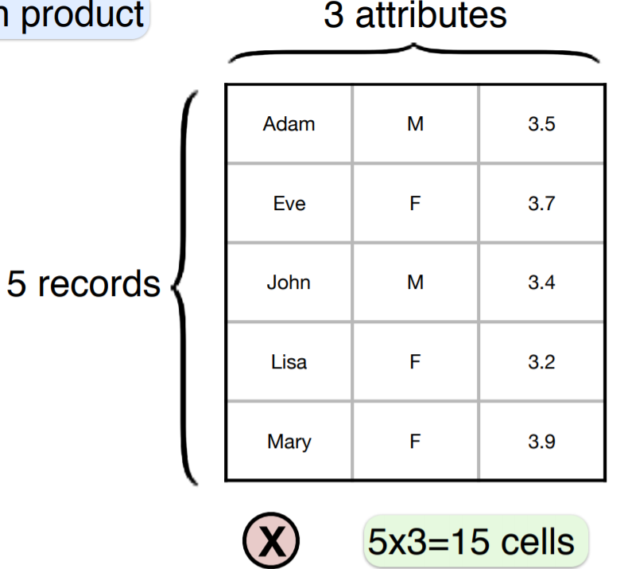
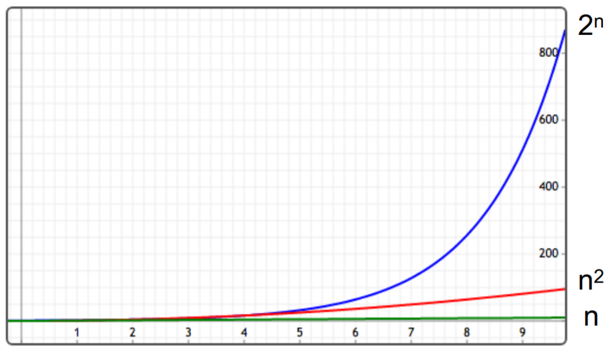
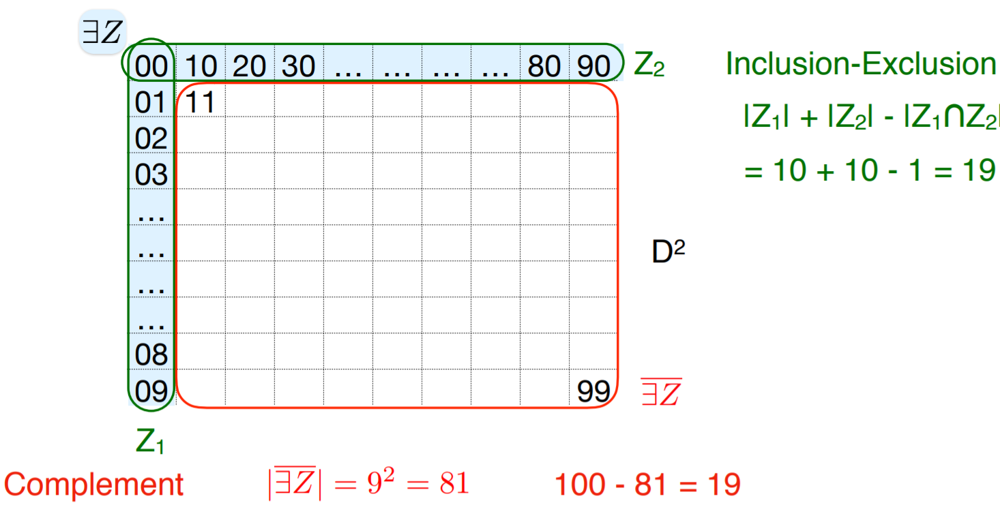
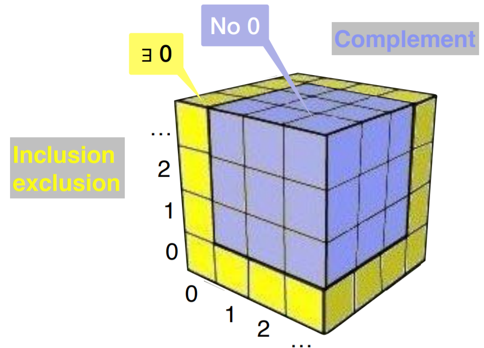
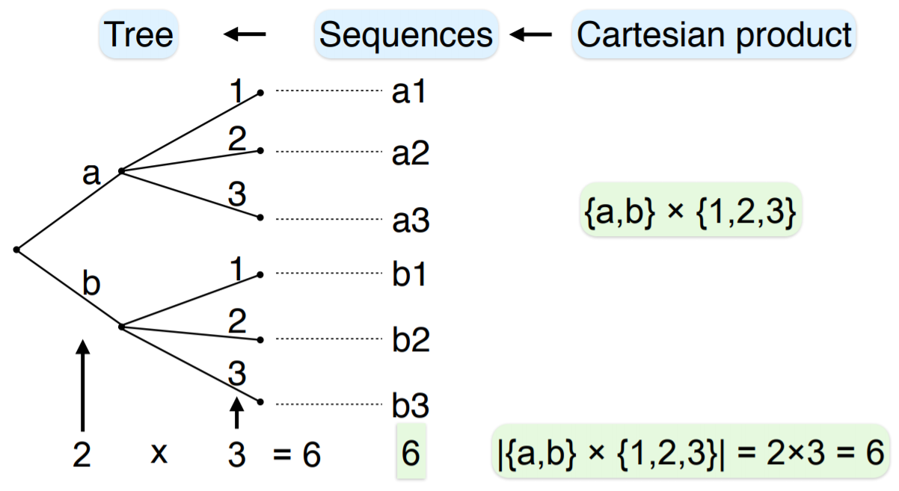
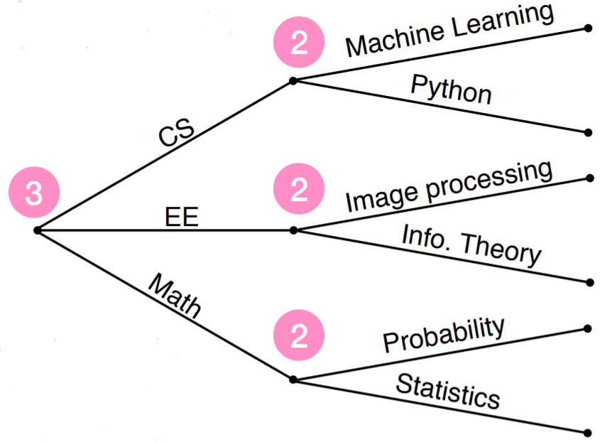
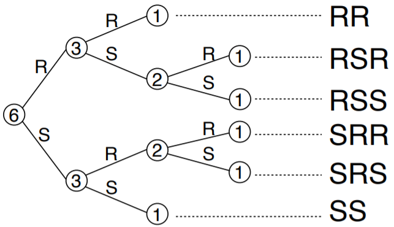
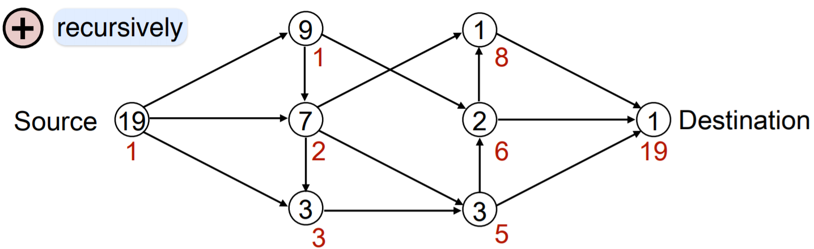

# Topic 3: Counting


## 3.1 Counting

+ Overview
  + Sets are often created via simple operations on existing sets: 
    + unions
    + intersection
    + Cartesian products
  + objective: learn how to determine the sizes of such sets
  + Goal: avoid counting
  + The bijection method

+ Functions
  + a <span style="color: magenta;">function f from A to B</span>, denote <span style="color: magenta;">$f: A \to B$</span>, associates w/ every $a\in A$ and <span style="color: magenta;">image</span> $f(a) \in B$
  + e.g., $f: \{1, 2, 3\} \to \{a, b, c, d\} \textrm{ s.t. } f(1) = b, f(2) = a, f(3) = d$

+ One-to-one mapping
  + $f: A \to B$ is <span style="color: magenta;">1-1</span>, or <span style="color: magenta;">injective</span>, if different elements have different images
  + Definition: (injective) $\forall\mid a, a^\prime \in A, a \neq a^\prime \to f(a) \neq f(a^\prime) \text{ and } f(a) = f(a^\prime) \to a = a^\prime$
    + e.g: $A = \{a, b, c\}, f(a) \neq f(b), f(a) \neq f(c), f(b) \neq f(c)$
  + $f: A \to B$ is <span style="color: magenta;">not 1-1</span> if $\exists\mid a \neq a^\prime \in A, f(a) = f(a^\prime)$
    + e.g. $f(b) = f(c)$

+ Set size
  + the number of elements in a set S is called its <span style="color: magenta;">size</span>, or <span style="color: magenta;">cardinality</span>, and denoted <span style="color: magenta;">$|S|$</span> or <span style="color: magenta;">$\#S$</span>
  + $n$-set: set of size $n$
  + examples
    + bits: $|\{0, 1\}| = 2$
    + coin: $|\{\text{heads}, \text{tails}\}| = 2$
    + die: $|\{1, 2, 3, ,4 ,5 ,6\}| = 6$
    + digits: $|\{0, 1, \dots, 9\}| = 10$
    + letters: $|\{a, \dots, z\}| = 26$
    + empty set: $|\varnothing| = 0$
    + integers: $|\mathbb{Z}| = |\mathbb{N}| = |\mathbb{P}| = \infty \to$ countable infinite $\aleph_0$
    + Rreals: $|\mathbb{R}| = \infty \to$ uncountably infinite $\aleph$

+ Integer intervals
  + $m \leq n$: $\{m, \dots, n\} = \{\text{integers from } m \text{ to } n, \text{inclusive}\}$, e.g., $\{3, \dots, 5\} = \{3, 4, 5\}$
  + size: $| \{m, \dots, n\} \mid n-m+1$
  + examples
    + $|\{5, \dots, 5\}| = |\{5\}| = 1 = 5 - 5 + 1$
    + $|\{1, \dots, 3\}| = |\{1, 2, 3\}| = 3 = 3 - 1 + 1$

+ Integer multiples
  + Definition: (integer multiples) $_d(n] = \{ 1 \leq i \leq n: d \mid i\}$
  + remark: 
    + $(n] = [n] = \{ 1, \dots, n\}$
    + size: $|\mid _d(n] \mid| = \lfloor n/d \rfloor$
  + examples
    + $_3(8] = \{3, 6\} = \{1\cdot 3, 2\cdots 3\}, \quad _3(9] = \{3, 6, 9\} = \{1 \cdot 3, 2 \cdot 3, 3 \cdot 3\}$
    + $|\mid _3(8]\mid| = \lfloor 8/3 \rfloor = 2, \quad|\mid _3(9]\mid| = \lfloor 9/3 \rfloor = 3$

+ Set size in Python
  + size: `len`, e.g., `print(len({-1, 1})) # 2`
  + sum: `sum`, e.g., `print(sum({-1, 1})) # 0`
  + minimum: `min`, e.g., `print(min({-1, 1})) # -1`
  + maximum: `max`, e.g., `print(max({-1, 1})) # 1`
  + loops: `for <var> in <set>`
    + example

      ```python
      A = {1, 2, 3}; print(len(A))    # 3
      num = 0 
      for i in A:
          num += 1
      print(num)  # 3
      ```


+ [Original Slides](https://tinyurl.com/yaa4etch)


### Problem Sets

0. The Python definition `A = set(range(1,10))` implies that A has size<br/>
  a. 2<br/>
  b. 9<br/>
  c. 10<br/>
  d. 11<br/>

  Ans: b<br/>
  Explanation: A has size 9 as the elements are 1 to 9.


1. (Perfect squares) A square of an integer, for example, 0, 1, 4 and 9, is called a _perfect square_. How many perfect squares are $\leq 100$?

  Ans: 11 <br/>
  Explanation: The perfect squares $\leq 100$ are $0^2, 1^2, 2^2, \dots, 10^2$. Hence there are 11.


2. Which of the following sets are finite?<br/>
  a. Weeks in a year<br/>
  b. Students at UCSD<br/>
  c. Odd primes<br/>
  d. Positive integer divisors of 30<br/>

  Ans: abd<br/>
  Explanation
    + True.
    + True. Despite appearances, luckily, UCSD has only a finite number of students.
    + False.
    + True. It is {1,2,3,5,6,10,15,30}.


3. Which of the following sets are finite?<br/>
  a. $\{ x \in \mathbb{Z} \mid x^2 \leq 10\}$<br/>
  b. $\{ x \in \mathbb{Z} \mid x^3 \leq 10\}$<br/>
  c. $\{ x \in \mathbb{N} \mid x^3 \leq 10\}$<br/>
  d. $\{ x \in \mathbb{R} \mid x^2 \leq 10\}$<br/>
  e. $\{ x \in \mathbb{R} \mid x^3 = 10\}$<br/>

  Ans: ace<br/>
  Explanation
    + True. It is $\{-3, -2, \dots, 3\}$.
    + False. It is $\{x \in \mathbb{Z} \mid x \leq 2\}$.
    + True. It is  {0,1,2}.
    + False. It is  $\{x \in \mathbb{R} \mid -\sqrt{10} \leq x \leq \sqrt{10}\}$ .
    + True. It is  $\{\sqrt[3]{10}\}$.


### Lecture Video

<a href="https://tinyurl.com/yczxwur9" target="_BLANK">
  
</a><br/>


## 3.2 Disjoint Unions

+ Disjoint unions
  + a union of disjoint sets is called a <span style="color: magenta;">disjoint union</span>
    + e.g., $|A| = 2, |B| = 3, A \cap B = \varnothing \to |A \cup B | = 2 + 3 = 5$
  + for disjoint union sets, the size of the union is the sum of the size for each set
    + $|A \cup B | = |A| + |B|$
  + addition rule: `+`
    + numerous applications & implications
    + reason: $\cup \approx +$
  + example: kids play
    + class w/ 2 boys and 4 girls
    + \# students = ? $\implies \cup \to + \to$ \# students = 2 + 3 = 5
  + example: jar w/ marbles
    + 1 blue, 2 green, 3 red
    + \# marbles = ? $\implies \cup$ of 3 sets $\to$ twice $\to$ \# marbles = 1 + 2 + 3 = 6

+ Complements
  + Quintessential disjoint sets: $A$ and $A^c$
    + $A \cup A^c = \Omega$
    + $|\Omega| = |A \cup A^c| = |A| + |A^c|$
  + subtraction (or complement) rule: `-`
    + $|A^c| = |\Omega| - |A|$
    + reason: set difference $\approx -$
  + examples
    + $D = \{ i \in [6]: 3|i\} = \{3, 6\} \to |D| = 2$
    + $D^c = \{i \in [6]: 3 \nmid i\} = \{1, 2, 4, 5\} \to |D^c| = 4$
    + $\Omega = [6] = \{1, \dots, 6\} \text{ s.t. } |D^c| = 4 = 6 - 2 = |\Omega| - |D|$

+ Think outside the circle
  + handy for large or complex sets
  + $|A^c| = |\Omega| - |A| \to |A| = |\Omega| - |A^c|$
  + examples - numbers
    + $A = \{ i \in [100]: 3 \nmid i\} = \{1, 2, 4, 5, 7, \dots, 100\}$ and $\Omega = \{1, \dots, 100\}$
    + $A^c = \{i \in [100] : 3 | i\} = \{3, 6, 9, \dots, 999\} \text{ s.t. } |A^c| = 33$
    + $|A| = |\Omega| - |A^c| = 100 - 33 = 67$
  + example: Days
    + Days = {M, Tu, W, Th, F, Sa, Su}
    + \# weekdays? |{1, 2, 3, 4, 5}| = 5
    + \# weekend?   |Days| - |Weekend| = 7 - 5 = 2
  + example: letters
    + vowels = {a, e, i, o ,u}
    + \# consonants?  26 - 5 = 21
    + facetious question: word containing all 5 vowels, in order?

+ General subtraction rule
  + $\exists\, A, B \in \Omega \text{ s.t. } |B - A| = |B| - |A|$
  + proof: $\exists\, A \cup B \to B = A \cup (B-A) \to |B| = |A| + |B-A| \text{ s.t. } |B-A| = |B| - |A|$


+ [Original Slides](https://tinyurl.com/ybtgvfus)


### Problem Sets

0. We saw that the size of a union of two disjoint sets is the sum of their sizes.

  If the two sets are not necessarily disjoint, then the size of their union is:<br/>

  a. At least the sum of the set sizes<br/>
  b. At most the sum of the set sizes<br/>
  c. Could be smaller, same, or larger than the sum of the set sizes.<br/>

  Ans: b<br/>
  Explanation: at most the sum of the sizes as some elements may be in both sets, and adding the sizes counts these elements twice.


1. Which of the following are finite for every finite set  A  and an infinite set  B ?<br/>
  a. $A \cap B$<br/>
  b. $A \cup B$<br/>
  c. $A - B$<br/>
  d. $B - A$<br/>
  e. $A \Delta B$<br/>

  Ans: ac


2. Which of the following pairs A and B satisfy $|A \cup B| = |A| + |B|$?<br/>
  a. $\{1,2\}$ and $\{0,5\}$<br/>
  b. $\{1,2\}$ and $\{2,3\}$<br/>
  c. $\{i \in \mathbb{Z} : |i| \leq 3\}$ and $\{i \in \mathbb{Z} : 2 \leq |i| \leq 5\}$<br/>
  d. {English words starting with the letter 'a'}  and  {English words ending with the letter 'a'}<br/>

  Ans: a<br/>
  Explanation: Explanation $|A \cup B| = |A| + |B|$ holds when $A$ and $B$ are disjoint.


3. $|A \cup B \cup C| = |A| + |B| + |C|$ whenever: (True/False)

  a. $A$ and $B$ are disjoint and $B$ and $C$ are disjoint,<br/>
  b. $A$ and $B$ are disjoint, $B$ and $C$ are disjoint, and $A$ and $C$ are disjoint.<br/>

  Ans: a. (False); b. (True)<br/>
  Explanation: 
  + a. False. Let  A=C={1}  and  B={2} . Then  A  and  B  are disjoint,  B  and  C  are disjoint. But  |A∪B∪C|=2 , while  |A|+|B|+|C|=3 .
  + b. True. Since  A  and  C  are disjoint, and  B  and  C  are disjoint, we must have that  A∪B  and  C  are disjoint. Hence  |A∪B∪C|=|A∪B|+|C| . Since  A  and  B  are disjoint, we have  |A∪B|=|A|+|B| . Hence  |A∪B∪C|=|A|+|B|+|C| .


4. (Non perfect-squares) Recall that a square of an integer, for example, 1, 4 and 9, is called a perfect square. How many integers between 1, and 100, inclusive, are not perfect squares?

  Ans: 90 <br/>
  Explanation: The perfect squares between 1 and 100 are $1^2, 2^2, \dots, 10^2$. Hence there are 10. By the complement rule, 100-10=90 integers between 1 and 100 are not perfect squares.


### Lecture Video

<a href="https://tinyurl.com/y82bbrt8" target="_BLANK">
  
</a><br/>


## 3.3 General Unions

+ Hairy problem
  + A friend claims she can determine the size of any set instantly and exactly.
  + She can determine the exact # of hairs on your head.
  + Can you ask her some questions to be fairly certain if she tells the truth?

+ Simple solution
  + subtraction rule
    + Ask her how many hairs you have.
      + Remove a small number of hairs, say 8.
    + Ask how many hairs you have now.
      + Difference between her answers should be # hairs removed (8).
  + Can you ask a single question?
    + Ask just how many hairs you removed. $\to$ 8 hairs
  + Zero-knowledge proofs:
    + Prove identity w/o revealing password.

+ General unions
  + disjoint A and B: $|A \cup B| = |A| + |B| \to$ size of union = sum of sizes
  + in general: $|A \cup B| \neq |A| + |B|$
    + e.g., $|\{a\} \cup \{a\}| = |\{a\}| = 1 \neq 2 = |\{a\}| + |\{a\}|$
  + __Principle of Inclusion-Exclusion (PIE)__: $|A \cup B| = |A| + |B| - |A \cap B|$

+ Example: Divisibility by 2 numbers
  + $D_{2 \vee 3} = \{i \in [100]: 2 \mid i \vee 3 \mid i\} = \{2, 3, 4, 6, 8, \dots, 100\} \to |D_{2 \vee 3} | = ?$
  + derivation
    + $D_2 = \{ i \in [100]: 2 \mid i\} = \{2, 4, 6, \dots, 100\}$
    + $D_3 = \{i \in [100]: 3 \mid 3\} = \{3, 6, 9, \dots, 99\}$
    + $D_{2 \vee 3} = D_2 \cup D_3 \text{ w/ PIE s.t. } |D_2 \cup D_3| = |D_2| + |D_3| - |D_2 \cap D_3|$
    + $D_2 \cap D_3 = \{i \in [100]: 2 \mid i \wedge 3 \mid i\}$
    + $\therefore\, |D_{2 \vee 3} = |D_2| + |D_3| - |D_2 \cap D_3| = 50 + 33 - 16 = 67$

+ Multiple sets
  + two sets: $|A \cup B| = |A| + |B| - |A \cap B|$
  + 3 sets: $|A \cup B \cup C| = |A| + |B| + |C| - |A \cap B| - |B \cap C| - |C \cap A| + |A \cap B \cap C|$
  + n sets:

    \[ \left|\bigcup_{i=1}^n A_i \right| = \sum_{1 \leq i \leq n} |A_i| - \sum_{1 \leq i < j \leq n} |A_i \cap A_j| + \cdots + (-1)^{n-1} \left| \bigcap_{i=1}^n A_i \right| \]

+ Example: Polyglots
  + 8 students in class, each speaks C, R, or $\Pi$thon $\to |C \cup R \cup \Pi| = 8$
  + each language spoken by 5 students $\to |C| = |R| = |\Pi| = 5$
  + every language _pair_ is spoken by 3 students $\to |C \cap R| = |C \cap \Pi| = |R \cap \Pi| = 3$
  + how many students speak all 3 languages? $\to |C \cap R \cap \Pi| = ?$

    \[\begin{align*}
      |C \cap R \cup \Pi| & = |C| + |R| + |\Pi| - |C \cap R| - |R \cap \Pi| - |\Pi \cap C| + |C \cap R \cap \Pi| \\
      8 & = 5 + 5 +5 - 3 - 3 - 3 + ? \\
      \therefore\; ? & = 8 - 5 - 5 - 5 + 3 + 3 \\
        &= 2
    \end{align*}\]

+ Sanity checks
  + compare PIE to some expected outcomes
  + $A, B$ disjoint: $|A \cup B| = |A| + |B| - |A \cap B| = |A| + |B|$
  + equal sets: $|A \cup A| = |A| + |A| - |A \cap A| = |A|$
  + general union

    \[ \max \{|A|, |B|\} \underbrace{\leq}_{= \iff \\ \text{nested}} |A \cup B| \underbrace{\leq}_{= \iff \\ \text{disjoint}} |A| + |B| \]


+ [Original Slides](https://tinyurl.com/y9hqcdsn)


### Problem Sets

0. When does $|A \cup B| = |A| + |B|$?<br/>
  a. When at least one of A and B is empty<br/>
  b. When A and B are disjoint<br/>
  c. Both of the above.<br/>

  Ans: <span style="color: magenta;">c</span><br/>
  Explanation: Both of the above. If A and B are disjoint then either by the disjoint union rule or by inclusion exclusion, the size of the union is the sum of the sizes. That implies that if one of the sets is empty the same holds.

1. In a high school graduation exam, 80% of examinees passed the English exam, 85% passed the math exam, and 75% passed both. If 40 examinees failed both subjects, what what the total number of examinees?

  Ans: 100<br/>
  Explanation: By inclusion exclusion (applied to fractions), 80+85-75=90% of the students passed at least one topic. Therefore  10% failed both topics. It follows that 40 students correspond to 10%, hence 400 students took the exam.

2. How many integers in  {1,2,…,100}  do not contain the digit  6 ?

  Ans: 81<br/>
  Explanation:<br/>
    Let $U_6 = \{6,16,…,96\}$ be the sets of integers between 1 and 100 whose units digit is 6, and let $T_6 = \{60,61,…,69\}$ be the corresponding set for the tens digit.<br/>
    The set of integers between 1 and 100 containing 6 is $U_6 \cup T_6$, and by inclusion-exclusion, its size is $|U_6 \cup T_6| = |U_6|+|T_6|-|U_6 \cap T_6|=10+10-1=19$.<br/>
    Hence 100-19=81 integers between 1 and 100 do not contain the digit 6.<br/>

3. Of 100 foreign journalists who can speak Chinese, English or French at a press conference:

  + 60 speak Chinese.
  + 65 speak English.
  + 60 speak French.
  + 35 speak both Chinese and English.
  + 25 speak both Chinese and French.
  + 35 speak both English and French.

  How many journalists speak exactly<br/>
  a. one language<br/>
  b. two languages<br/>
  c. three languages<br/>

  Ans: a. (25); b. (65); c. (10)<br/>
  Explanation: By the Principle of Inclusion and Exclusion for three sets, <br/>$100=|A \cup B \cup C| =|A|+|B|+|C|-|A\cap B|-|A\cap C|-|B\cap C|+|A\cap B \cap C|=90+|A\cap B\cap C|$.


4. $|A \cup B|=|A|+|B|$ when<br/>
  a. A and B are disjoint,<br/>
  b. A is the complement of B,<br/>
  c. A and B do not intersect,<br/>
  d. At least one of A and B is empty.<br/>

  Ans: abcd<br/>
  Explanation: It holds whenever  A  and  B  are disjoint.


5. The following equation is incorrect. What needs to be added to make it correct?

  \[ |A \cup B∪C| = |A| + |B| + |C| - |A\cap B| - |A \cap C| - |B \cap C| \]

  a. $-|A \cap B \cap C|$<br>
  b. $+|A \cap B \cap C|$<br>
  c. $+3|A \cap B \cap C|$<br>

  Ans: b


6. In a high school graduation exam 70% of examinees passed the English exam, 76% passed the math exam, and 66% passed both. If 40 examinees failed in both subjects, what is the total number of examinees?

  Ans: 200 <br/>
  Explanation: By the inclusion-exclusion principle, the percentage of students who passed at least one of the two exams is 70+76-66=80. Therefore 20% have failed both subjects. Hence the total number of examinees is 40 / 20% = 200.


### Lecture Video

<a href="https://tinyurl.com/yacpywqm" target="_BLANK">
  
</a><br/>


## 3.4 Cartesian Products

+ Cartesian products
  + the size of a Cartesian product = the product of the set sizes
  + product rule: $|A \times B| = |A| \times |B|$
  + examples<br/>
    $|\{a, b\}| = 2 \qquad |\{1, 2, 3\}| = 3$

    \[ \{a, b\} \times \{1, 2, 3\} = \begin{Bmatrix} (a, 1) & (a, 2) & (a, 3) \\ (b, 1) & (b, 2) & (b, 3) \end{Bmatrix} \]

    $\therefore\, |\{a, b\} \times \{1, 2, 3\}| = 3 + 3 = 2 \times 3 = 6$
  + example: Table

    <div style="margin: 0.5em; display: flex; justify-content: center; align-items: center; flex-flow: row wrap;">
      <a href="https://tinyurl.com/ycrand47" ismap target="_blank">
        
      </a>
    </div>

+ Rules of Cartesian products
  + 2 sets: $A \times B = \{(a, b): a \in A, b \in B\} \to \text{ rectangle } \implies |A \times B| = |A| \times |B|$
  + 3 sets: 
  
    \[ A \times B \times C = \{(a, bb, c): a \in A, b \in B, c \in C\} \to \text{ 'cuboid' }\\ \implies |A \times B \times C| = |A| \times |B| \times |C|\]

  + example: Dandy dresser
    + 3 shirts, 2 pants, and 5 pairs of shoes
    + how many outfits can he have?
      + Outfits = {(shirt, pants, shoes)} = {shirt} $\times$ {pants} $\times$ {shoes} $\gets$ Cartesian product
      + |{Outfits}| = |{shirt}| $\times$ |{pants}| $\times$ |{shoes}| = 3 $\times$ 3 $\times$ 5 = 30

+ Cartesian product for $n$ sets
  + for $n$  sets, $|A_1 \times A_2 \cdots \times A_n| = |A_1| \times \dots \times |A_n|$
  + example: Subway
    + how many sandwiches can Subway make?
    + Beard = {Wheat, Italian}
    + Meat = {Turkey, Ham, Chicken, Beacon, Beef}
    + Cheese = {American, Monterey, Cheddar}
    + Veggie = {Cucumbers, Lettuce, Spinach, Onions}
    + Sauce = {Ranch, Mustard, Mayonnaise}
    + Sandwiches = Bread $\times$ Meat $ \times$ Cheese $\times$ Veggie $\times$ Sauce

    \[\begin{align*} 
      \therefore\; |\text{Sand's}| &= |\text{Bread}| \times |\text{Meat}| \times |\text{Cheese}| \times |\text{Veggie}| \times |\text{Sauce}| \\
       &= 2 \times 5 \times 3 \times  4 \times 3 = 360
    \end{align*}\]


+ [Original Slides](https://tinyurl.com/ycrand47)


### Problem Sets

0. Do AxB and BxA have the same size for any sets A and B?

  Ans: Yes<br>
  Explanation: Yes, just like a rectangle has the same area if you rotate it 90 degrees


1. (Finite X infinite) If  A  is finite and  B  is infinite then  A×B  can be:<br/>
  a. empty<br/>
  b. nonempty finite<br/>
  c. infinite<br/>

  Ans: ac<br/>
  Explanation: If A is empty then A×\\B , otherwise it is infinite.


2. (Order matters) Which of the following ensures that $A \times B = B \times A$?<br/>
  a. $A = B$<br/>
  b. $A = \varnothing$<br/>
  c. $B = \varnothing$<br/>
  d. $A \cap B = \varnothing$<br/>
  e. $|A| = |B|$<br/>

  Ans: abc<br/>
  Explanation
    + True.
    + True. A×B=B×A=∅ .
    + True. Same as above.
    + False. Let  A={1}, B={2}. Then A×B≠B×A .
    + False. Same as above.


3. (Cartesian product shape) Taking the geometric view of Cartesian products, if A and B are real intervals of positive length in $\mathbb{R}$, then A×B is a:<br/>
  a. line,<br/>
  b. rectangle,<br/>
  c. circle,<br/>
  d. triangle,<br/>
  e. none of above.<br/>

  Ans: b<br/>
  Explanation: Let A=[a,b), B=[c,d). Then $ A \times B = \{(x,y) \mid a \leq x < b, c \leq y < d, x\in \mathbb{R}, y \in \mathbb{R}\}$, which is a rectangle.


4. (Divisors) How many positive divisors does 2016 have?

  Ans: 36 <br/>
  Explanation: 2016=25⋅32⋅7. Hence any positive divisor of 2016 can factored as $2^x \cdot 3^y \cdot 7^z$, where $x \in \{0,1,...,5\},  y \in \{0,1,2\}$ and $z \in \{0,1\}$. By the product rule, there are 6×3×2=36 divisors.


### Lecture Video

<a href="https://tinyurl.com/y9s48ovo" target="_BLANK">
  
</a><br/>


## 3.5 Cartesian Powers

+ Cartesian powers of a set
  + Cartesian product of a set w/ itself is a <span style="color: magenta;">Cartesian power</span>
  + Cartesian square: $A^2 = A \times A$
  + $n$-th Cartesian power: $A^n \stackrel{\text{def}}{=} \underbrace{A \times A \times \cdots \times A}_{n}$
  
    \[ |A^n| = |A \times A \times A \times \cdots \times A| = |A| \times |A| \times \cdots \times |A| = |A|^n \]

  + example: California license plates
    + till 1904: no registration
    + 1905 ~1912: various registration formats, one-time $2 fee
    + 1912: 6 digits; $\leq 6$ digits $\implies 10^6$ if all OK
    + 1956: 3 letters + 3 digits; $26^3 \times 10^3 \approx 17.6$ m
    + 1969: 1 digit + 3 letters + 3 digits; $26^3 \times 10^4 \approx 176$ m

+ Binary strings
  + n-bit string: $\{0, 1\}^n = \{\text{ length-n binary strings } \}$

    <table style="font-family: arial,helvetica,sans-serif; width: 30vw;" table-layout="auto" cellspacing="0" cellpadding="5" border="1" align="center">
      <thead>
      <tr>
        <th style="text-align: center; background-color: #3d64ff; color: #ffffff; width:5%;">n</th>
        <th style="text-align: center; background-color: #3d64ff; color: #ffffff; width:10%;">Set</th>
        <th style="text-align: center; background-color: #3d64ff; color: #ffffff; width:30%;">Strings</th>
        <th style="text-align: center; background-color: #3d64ff; color: #ffffff; width:10%;">Size</th>
      </tr>
      </thead>
      <tbody>
      <tr> <th style="text-align: center;">0</th> <td style="text-align: center;">$\{0, 1\}^0$</td> <td style="text-align: center;">$\Lambda$</td> <td style="text-align: center;">$1$</td></tr>
      <tr> <th style="text-align: center;">1</th> <td style="text-align: center;">$\{0, 1\}^1$</td> <td style="text-align: center;">$0, 1$</td> <td style="text-align: center;">$2$</td></tr>
      <tr> <th style="text-align: center;">1</th> <td style="text-align: center;">$\{0, 1\}^2$</td> <td style="text-align: center;">$00, 01, 10, 11$</td> <td style="text-align: center;">$4$</td></tr>
      <tr> <th style="text-align: center;">3</th> <td style="text-align: center;">$\{0, 1\}^3$</td> <td style="text-align: center;">$000, 001, 011, 010, \\100, 110, 101, 111$</td> <td style="text-align: center;">$8$</td></tr>
      <tr> <th style="text-align: center;">$\dots$</th> <td style="text-align: center;">$\dots$</td> <td style="text-align: center;">$\dots$</td> <td style="text-align: center;">$\dots$</td></tr>
      <tr> <th style="text-align: center;">n</th> <td style="text-align: center;">$\{0, 1\}^n$</td> <td style="text-align: center;">$0\dots 0, \dots, 1\dots 1$</td> <td style="text-align: center;">$2^n$</td> </tr>
      </tbody>
    </table>

  + size of n-bit string: $|\{0, 1\}^n| = |\{0, 1\}|^n = 2^n$

+ Subsets
  + the <span style="color: magenta;">power set</span> of S, denoted <span style="color: magenta;">$\mathbb{P}(S)$</span>, is the collection of all subsets of S
  + $\mathbb{P}(\{a, b\}) = \{\{\}, \{a\}, \{b\}, \{a, b\}\}$
  + 1-1 correspondence btw $\mathbb{P}(S)$ (subset of $S$) and $\{0, 1\}^{|S|}$ (binary strings of length $|S|$): mapping $\mathbb{P}(\{a, b\})$ to $\{0, 1\}^2$
  + $|\mathbb{P}(S)| = ?$

      \[ \left|\mathbb{P}(S)\right| = \left| \{0, 1\}^{|S|} \right| = 2^{|S|} \]

  + the size of the power set = the power of the set size

+ Functions
  + a <span style="color: magenta;">function from A to B</span> maps every elements $a \in A$ to an element $f(a) \in B$
  + define a function $f:\; $ by specifying $f(a), \;\forall\, a \in A$
  + example:
    + $f$ from {1, 2, 3} to {p, u}: specifying f(1), f(2), f(3) $\to$ f(1)=p, f(2)=u, f(3)=p
    + $f:\;$ 3-tuple (f(1), f(2), f(3)) $\to$ (p, u, p)
    + { function from {1, 2, 3} to {p, u} } $\to \{p, u\} \times \{p, u\} \times \{p, u \}$
    + \# functions from {1, 2, 3} to {p, u} = $2 \times 2 \times 2 = |\{p,, u\}|^{|\{1, 2, 3\}|}$
  + generalization
    + { function from A to B } $\implies \underbrace{B \times B \times \cdots \times B}_{|A|} = B^{|A|}$
    + $\therefore\; \text{ # functions from A to B } = |B^{|A|}| = |B|^{|A|}$
  + Exponential growth

    <div style="margin: 0.5em; display: flex; justify-content: center; align-items: center; flex-flow: row wrap;">
      <a href="https://tinyurl.com/ycrand47" ismap target="_blank">
        
      </a>
    </div>

+ Cartesian powers and exponential in Python
  + Cartesian : using `product` function in `itertools` library

    ```python
    import itertools
    print(set(itertools.product({2, 5, 9}, repeat=2)))
    # {(5, 9), (5, 5), (2, 9), (9, 2), (9, 9), (2, 2), (9, 5), (2, 5), (5, 2)}
    ```
  
  + exponential: `^`

    ```python
    print(3^2)
    # 9
    ```

+ Example: Chess-Rice Legend
  + chess
    + invented by poor yet clever peasant, become very popular
    + King liked it, offered peasant any reward he wished
  + peasant
    + poor and humble farmer, just need a little rice
    + kindly place a single rice grand on first square, double on each subsequent square
  + king
    + such a modest request
    + granted!
  + king
    + paced one ($2^0$) grain on the first square
    + two ($2^1$) on the second
    + four ($2^2) on the third
    + ...
    + 64th square: $2^{63} \approx 10^{27}$
  + two endings
    + peasant became king
    + peasant beheaded
  + moral:
    + be peasant or be king: beware of exponential!

+ Example: Jeopardy
  + counting questions $\to$ answer

    \[ \# \begin{Bmatrix} \text{n-bit sequences} \\ \text{Subsets of } \{1, \dots, n\} \\ \text{Functions: } \{1, \dots, n\} \text { to } \{0, 1\} \end{Bmatrix} = 2^n \]

  + find a natural counting question whose answer is a double exponential!
    + $? \gets 2^{2^n}$
    + solution 1: power set
      + power set of S: set of subsets of S = $\mathbb{P}(S)$, e.g., $\mathbb({P}(\{a, b\}) = \{ \{\}, \{a\}, \{b\}, \{a, b\}\}$
      + $|\mathbb{P}(S)| = 2^{|S|}$, e.g., $|\mathbb{P}(S)| = 4 = 2^2 = 2^{|\{a, b\}|}$
      + $\mathbb{P}(S)$ is a set $\to$ power set of $\mathbb{P}(S)$
      + $\mathbb{P}(\mathbb{P}(S))$ - set of subsets of $\mathbb{P}(S)$
      + $|\mathbb{P}(S)| = 2^{|S|} \to |\mathbb{P}(\mathbb{P}(S)) | = 2^{|\mathbb{P}(S)|} = 2^{2^n}$, e.g., $\mathbb{P}(\{a, b\}) = \{ \{\}, \{a\}, \{b\}, \{a, b\}\} \to $

        \[\begin{align*}
          \mathbb{P}(\mathbb{P}(\{a, b\})) &= \mathbb{P}(\{ \{\}, \{a\}, \{b\}, \{a. b\}\}) \\
          &= \left\{ \{\}, \{\{\}\}, \{\{a\}\}, \dots, \{\{\}, \{a\}\}, \dots, \{\{\}, \{a\}, \{b\}, \{a, b\}\}\right\}
        \end{align*}\]

      + $|\mathbb{P}(\mathbb{P}(\{a, b\}))| = 2^{|\mathbb{P}(\{a, b\})|} = 2^{2^{|\{a, b\}|}}$
      + $\therefore\; |\mathbb{P}(\mathbb{P}([n])) = 2^{2^n} \to$ Double exponential
    + solution 2: Boolean functions
      + Functions from A to B $\to B^A \to \# = |B|^{|A|}$
      + \# Boolean functions of $n$ Boolean (binary) variables
      + functions from $\{0, 1\}^n$ to $\{0, 1\} \to \{0, 1\}^{|\{0, 1\}|^n}$
      + $\# = |\{0, 1\}|^{|\{0, 1\}^n|} = 2^{2^n} \to$ Double exponential

+ circuit w/ $n$ binary inputs, one binary output
  + can implement $2^{2^n}$ functions $\to 2^{63} = 1/2 \cdot 2^{2^6}$

+ Analogies btw number and set operations

  <table style="font-family: arial,helvetica,sans-serif; width: 30vw;" table-layout="auto" cellspacing="0" cellpadding="5" border="1" align="center">
    <thead>
    <tr>
      <th style="text-align: center; background-color: #3d64ff; color: #ffffff; width:10%;">Numbers</th>
      <th style="text-align: center; background-color: #3d64ff; color: #ffffff; width:10%;">Sets</th>
    </tr>
    </thead>
    <tbody>
    <tr> <td style="text-align: center;">Addition</td> <td style="text-align: center;">Disjoint union</td> </tr>
    <tr> <td style="text-align: center;">Subtraction</td> <td style="text-align: center;">Complement</td> </tr>
    <tr> <td style="text-align: center;">Multiplication</td> <td style="text-align: center;">Cartesian product</td> </tr>
    <tr> <td style="text-align: center;">Exponents</td> <td style="text-align: center;">Cartesian power</td> </tr>
    </tbody>
  </table>


+ [Original Slides](https://tinyurl.com/y84p7yro)


### Problem Sets

0. The set {000, 001, ....,111} of all 3-bit strings has the following number of subsets:<br/>
  a. 2^3<br/>
  b. 2^6<br/>
  c. 2^8<br/>
  d. 2^9<br/>

  Ans: c<br/>
  Explanation: 2^8. The set has (2^3=8) strings, and a set of 8 elements has 2^8 subsets.


1. Rank the functions \(n^2\), \(2^n\), \(n\) from slow to fast in terms of their growth rate as \(n\) increases.<br/>
  a. \(n\), \(2^n\), \(n^2\)<br/>
  b. \(n\), \(n^2\), \(2^n\)<br/>
  c. \(2^n\), \(n\), \(n^2\)<br/>
  d. \(2^n\), \(n^2\), \(n\)<br/>

  Ans: b<br/>


2. Find the number of 7-character (capital letter or digit) license plates possible if:<br/>
  a. there are no further restrictions, <br/>
  b. the first 3 characters are letters and the last 4 are numbers,<br/>
  c. letters and numbers alternate, for example A3B5A7Q or 0Z3Q4Q9.<br/>

  Ans: a. ($37^7$); b. ($26^3 \cdot 10^4$); c. ($26^4 \cdot 10^3 + 26^3 \cdot 10^4$)<br/>
  Explanation:
  + a. In each position there are $26+10=36$ choices ($26$ letters and $10$ digits). The number of ways is $(26+10)^7=367=78,364,164,096$.
  + b. For the first 3 positions, the number of ways is $26^3$ (letters only). For the last 4 positions, the number of ways is $10^4$ (digits only). The total number of ways is $26^3 \cdot 10^4 = 175,760,000$.
  + c. If there are 4 digits and 3 letters, the number of ways is $26^3 \cdot 10^4$. If there are 4 letters and 3 digits, the number of ways is $26^4 \cdot 10^3$. The total number of ways is $26^3 \cdot 10^4 + 26^4 \cdot 10^3 = 175,760,000 + 456,976,000 = 632,736,000$.


3. If $P$ and $Q$ are sets, then $|P|^{|Q|}$ is the number of functions<br/>
  a. from $P$ to $Q$,<br/>
  b. from $Q$ to $P$.<br/>

  Ans: b<br/>
  Explanation: The number of functions from $Q $to $P $as there are $|P| $possible images for every element of $Q$.


4. Recall that the power set  P(S)  of a set  S  is the collection of all subsets of  S .

  For $A  = \{1,2,3\}$ and $B=\{x,y\}$, calculate the following cardinalities.<br/>
  a. $|\mathbb{P}(A)|$<br/>
  b. $|\mathbb{P}(B)|$<br/>
  c. $|A \times B^2|$<br/>
  d. $|\mathbb{P}(A \times B)|$<br/>
  e. $|\mathbb{P}(A) \times B|$<br/>
  f. $|\mathbb{P}(\mathbb{P}(A))|$<br/>

  Ans: a. (8); b. (4); c. (12); d. ($2^6 = 64$), e. (16); f. ($2^8 = 256$)


5. Let $G = \{0,2,4,6,8\}$. What is $|G^4|$?<br/>
  a. $5^4$<br/>
  b. $4^5$<br/>
  c. $5 \times 4 \times 3 \times 2 \times 1 <br/>
  d. $0 + 2 + 4 + 6 + 8<br/>

  Ans: a


6. Let A be a set with size 5. How many proper subsets does A have?

  Ans: 31<br/>
  Explanation: A  itself is not included. $2^5−1 = 31$.


7. How many subsets of $\{1,2,…,9\}$ <br/>
  a. are there,<br/>
  b. contain '1',<br/>
  c. have $\geq 5$  elements,<br/>
  d. have no odd elements,<br/>

  Ans: a. ($2^9 = 512$); b. ($2^8 = 256$); c. (256); d. ($2^4 = 16$)<br/>
  Explanation:
  + a. Every element of  {1,2,…,9}  is an either in the subset of not, hence there are $2^9=512$ subsets.
  + b. Ever set containing '1' corresponds to an arbitrary subset of  {2,3,⋯,9} , and there are $2^8=256$ such subsets.
  + c. Every subset of size  ≥5  corresponds to its complement that has size  ≤4 . For example, {1,2,3,4,5} has 5 elements, while its complement {6,7,8,9} has 4 elements. Hence the number of subsets of size $\geq 5$  is the same as the number of subsets of size $\leq 4$ and together they comprise all $2^9$ subsets. Hence the number of subsets of size $ \geq 5$ is $\frac{2^9}{2} = 2^8 = 256$.
  + d. Any subset with no odd elements is a subset of {2,4,6,8} and there are $2^4 = 16$ such subsets.


### Lecture Video

<a href="https://tinyurl.com/ycch9ryz" target="_BLANK">
  
</a><br/>


## 3.6 Variations

+ Counting variations
  + combining addition, subtraction, and multiplication
  + determining size of more complex sets
  + PINs w/ various constraints

+ Personal Identification Number (PIN)
  + PIN: 2174
  + \# 4-digit PIN's=?
    + $D = \{0, \dots, 9\} \to$ set of digits
    + {4-digit PIN's} = $D^4 \to$ Cartesian Power
    + $|D^4| = |D|^4 = 10,000$

+ Variable length
  + \# 3-5 digit PINs = ?
  + example: 314, 2246, 79380
  + $D = \{0, \dots, 9\} \quad \{\text{PINs}\} = D^3 \cup D^4 \cup D^5$
  
    \[\begin{align*} 
      \# PINs &= |D^3 \cup D^4 \cup D^5| = {D^3| + |D^4| + |D^5|} \\
      &= 10^3 + 10^4 + 10^5 = 1,000 + 10,000 + 100,000\\
      & = 111,000
    \end{align*}\]

+ Forbidden patterns
  + 4-digit PINs
  + forbidden:
    + all same: $0000, 1111, \dots, 9999 \to \# = 10$
    + consecutive: $123, 1234, \dots, 6789 \to \# = 7$
    + all same $\cup$ consecutive: 10 + 7 = 17
  + allowed: $D^4$ - Forbidden $\to$ 10,000 - 17 = 9983

+ PINs containing zero
  + \# PINs containing 0
  + $D = \{0, 1, \dots, 9\}$
  + $Z = \{0\} \quad \overline{Z} = \{1, 2, \dots, 9\} \gets \overline{Z} = Z^c$ set of non-zero digits
  + n-digit sequence: $x^n \triangleq x_1, \dots, x_n$
  + {n-digit PINS containing 0}: $Z_0 = \{x^n \in D: \exists\, i\; x_i \in Z \}$
  + $|Z_0| = ?$
  + strategies: start w/ 2 digits $\to$ two ways
    + inclusion exclusion
    + subtraction rule

+ 2-digits: inclusion-exclusion
  + $Z_0 = \{ x_1 x_2: \exists\, i\; x_i = 0\}$, e.g., 00, 03, 50, <span style="text-decoration: line-through;">73</span>
  + $Z_1 = \{x_1x_2: x_1 = 0\}$ e.g., 00, 03, <span style="text-decoration: line-through;">50</span>, <span style="text-decoration: line-through;">73</span> $\implies |Z_1| = 10$
  + $Z_2 = \{x_1x_2: x_2 = 0\}$ e.g., 00, <span style="text-decoration: line-through;">03</span>, 50, <span style="text-decoration: line-through;">73</span> $\implies |Z_2| = 10$
  + $Z_1 \cap Z_2 = \{00\} \to |Z_1 \cap Z_2| = 1$
  + $Z_0 = Z_1 \cup Z_2$
  + $|Z_0| = |Z_1| + |Z_2| - |Z_1 \cap Z_2| = 10 + 10 -1 =19$

+ 2-digits: complement rule
  + $Z_0 = \{x_1x_2: \exists\, i\; x_i = 0\}$, e..g., 00, 03, 50, <span style="text-decoration: line-through;">73</span>
  + all 2-digit PINs: $\Omega = D^2$
  + $\overline{Z_0} = \{x_1x_2: \exists\, i\; x_i = 0\}^c = \underbrace{\{x_1x_2: \forall\, i\; x_i \neq 0\}}_{\text{both digits nonzero}} = Z^c \times Z^c$, e.g., 73, 44, 19, <span style="text-decoration: line-through;">50</span>
  + $|\overline{Z_0}| = |Z^c \times Z^c| = |Z^c|^2 = 9^2 = 81$
  + $Z_0 = D^2 - Z_0^c \implies |Z_0| = |D^2| - |Z_0^c| = 100 - 81 = 19$

+ n digit: Inclusion-Exclusion
  + $Z_0 = \{x^n: \exists\,i\; x_i = 0\} \quad x^n \triangleq x_1,\dots,x_n$
  + $Z_i = \{x^n: x_i = 0\}$, e.g., $n=4 \text{ s.t. } Z_2 = \{x0yz\} \quad Z_4 = \{xyz0\}$
  + $Z_0 = Z_1 \cup \dots \cup Z_n$
  
    \[\begin{align*}
      |Z_0| &=\quad |Z_1| + |Z_2| + \cdots + |Z_n| \\
        &\quad- |Z_1 \cap Z_2| - |Z_1 \cap Z_3| - \cdots - |Z_{n-1} \cap Z_n| \\
        &\quad+ |Z_1 \cap Z_2 \cap Z_3| + \cdots + |Z_{n-2} \cap Z_{n-1} \cap Z_n|\\
        &\quad \cdots\\
        &\quad+ (-1)^{n-1} |Z_1 \cap Z_2 \cap \cdots Z_n|
    \end{align*}\]

+ n Digits: complement

    \[\begin{align*}
      Z_0^c &= \{x^n: \exists\,i\; x_i \in Z\}^c = \{x^n: \forall\,i\; x_i \notin Z\} = (Z^c)^n \triangleq Z_c\\
      |Z_c| &= |Z^c|^n = 9^n\\\\
      Z_0 &= D^n - Z_c \\
      |Z_0| &= |D^n| - |Z_c| = 10^n - 9^n
    \end{align*}\]

+ Visualization

  <div style="margin: 0.5em; display: flex; justify-content: center; align-items: center; flex-flow: row wrap;">
    <a href="https://tinyurl.com/ycrand47" ismap target="_blank">
      
      
    </a>
  </div>


+ [Original Slides](https://tinyurl.com/y943hxzd)


### Problem Sets

0. Sam tries to find how many 2-letter sequences do not include the letter Q, for example BR or ZZ, but not BQ, or QQ.
  
  First, Sam calculates the total number of 2-letter sequences, allowing all letters, as 26*26=676.
  
  Then Sam calculates the number of disallowed sequences:
  
  There are 26 sequences where a Q is the first letter (e.g. QS), and 26 where Q is the second letter (e.g. BQ).
  
  The total number of disallowed sequences is therefore 26+26=52. Subtracting 52 from 676, Sam deduces that there are 624 two-letter sequences without Q.
  
  Where did Sam go wrong?

  a. Made a multiplication error.<br/>
  b. Made a subtraction error<br/>
  c. Subtracted the sequence QQ from the total twice.<br/>
  d. Nothing, Sam is correct.<br/>

  Ans: c<br/>
  Explanation: Sam subtracted the sequence QQ from the total twice.


1. An $n$-variable Boolean function maps $\{0,1\}^n$  to $\{0,1\}$. How many 4-variable Boolean functions are there?<br/>
  a. 16 <br/>
  b. 256 <br/>
  c. 65,536<br/>

  Ans: c<br/>
  Explanation: From the video, there are $2^{2^n}$ Boolean functions of $n$-variables, and $2^{2^4} = 2^{16} = 65,436$


2. A word that reads the same from left to right and right to left is a palindrome. For example, "I", "noon" and "racecar" are palindromes. In this question, we consider palindromic integers such as 101 and 66. Note that the first digit of an integer cannot be 0.

  How many positive 5-digit integer palindromes<br/>
  a. are there?<br/>
  b. are even, for example 29192?<br/>
  c. contain 7 or 8, for example 27172 or 38783?<br/>

  Ans: a. (900); b. (400); c. (452)<br/>
  Explanation:
  + a. Since the number is palindromic, it is determined by its first three digits. The first digit must be 1,2,...,9, while the second and third are unconstrained. Hence the total number is $9 \cdot 10 \cdot 10 = 900$.
  + b. The first digit can be only 2,4,6,8, hence $4 \cdot 10 \cdot 10 = 400$.
  + c. $7 \cdot 8 \cdot 8 = 448$ palindromic integers do not contain 7 or 8. By the complement rule, $900-448=452$ contain 7 or 8.


3. How many $5$-digit ternary strings are there without $4$ consecutive $0$s, $1$s or $2$s?

  For example,  01210  and  11211  are counted, but  20000 ,  11112 , and  22222  are excluded.

  Ans: 228<br>
  Explanation:
  Explanation:
    + First count the number of excluded sequences.
    + A 5-digit string contains 4 consecutive 0's if it starts with 0000, or ends with 0000, or both.
    + The number of 5-digit ternary strings that start with 0000 is 3, the number that end with 0000 is 3, and the number that both starts and ends with 0000 is 1 (the sequence 00000). By inclusion exclusion, there are 3+3-1=5 sequences containing 0000.
    + Similarly there are 5 sequences with 1111 and 5 sequences with 2222.
    + These sequences are disjoint, hence by the sum rule, the total number of forbidden sequences is 5+5+5=15.
    + The total number of 5-digit ternary strings is $3^5 = 243$.
    + By the subtraction rule, the number of allowed sequences is 243−15=228.


4. A password consists of four or five characters, each an upper-case letter, a lower-case letter, or a digit. How many passwords are there if each of the three character types must appear at least once?

  Ans: <span style="color: magenra:">443,888,640</span><br/>
  Explanation:
    + For each of length 4 and 5, we use inclusion-exclusion to count the number of password that do not contain at least one of the three character types, then use the complement rule.
    + Let $U$, $L$, and $D$ denote the sets of passwords that do not contain upper-case letters, lower-case letters, and digits, respectively, and let $n$ be the password length. Then $|U| = |L| = 36^n$, and $|D|= 52^n$. Furthermore, $|L \cap U|=10^n$, while $|L \cap D|=|U \cap D|=26^n$, and $U \cap L \cap D = \varnothing$. Finally, the number of length-n character sequences is $62^n$.
    + $|U \cap L \cap D|$  is the number of sequences that have at least one character type missed.
    + By the 3-set inclusion-exclusion principle, $|U \cup L \cup D| = |U|+|L|+|D|−|L \cap U|−|L \cap D|−|U \cap D|+|U \cap L \cap D|$. Hence, there are $(62^4−(36^4+36^4+52^4−26^4−26^4−10^4+0))+$ $(62^5−(36^5+36^5+52^5−26^5−26^5−10^5+0))=443,888,640$ valid passwords.


5. In the US, telephone numbers are 7-digit long. While real phone numbers have some restrictions, for example, they cannot start with 0 or 1, here we assume that all 7-digit sequences are possible, even 0000000.

  How many phone numbers:<br/>
  a. start or end with two identical digits, for example 0012345, 1234511, or 2222222,<br/>
  b. contain a substring of $5$ consecutive digits. For example 0034567, 2567892, or 0123456.<br/>

  Ans: a. ($2 \cdot 10^6 + 10^5$); b. ($3 \cdot 600 - 2 \cdot 50 -4 + 4$) (<span style="color: magenta;">$3 \cdot 600, 3 \cdot 600 - 3 \cdot 50 + 4, 3 \cdot 600 - 2 \cdot 50 + 4$</span>)<br/>
  Explanation:
  + a. $10 \cdot 10^5 = 10^6$ phone numbers start with two identical digits, and the same number end with two identical digits, furthermore $10^2 \cdot 10^3 = 10^5$ numbers start and end with two identical digits. By inclusion-exclusion, the answer is $2 \cdot 10^6 − 10^5 = 1,900,000$.
  + b. Let  $L$, $M$, and $R$, be the sets of phone numbers whose 5 left, middle, and right digits, respectively, are consecutive. The set of phone numbers with five consecutive digits is  L∪M∪R , and we'll determine its size. $|L|=|M|=|R|=6 \cdot 102 = 600$, while $|L \cap M|=|M \cap R|=5 \cdot 10=50$, and $|L \cap R|=|L \cap M \cap R| = 4$. By inclusion-exclusion, $|L \cup M \cup R|=3 \cdot 600−2 \cdot 50−4+4=1700$.


6. How many ordered pairs $(A,B)$, where $A$, $B$ are subsets of $\{1,2,3,4,5\}$ have:<br/>
  a. $A \cap B= \varnothing$<br/>
  b. $A \cap B=\{1\}$<br/>
  c. $|A \cap B|=1$<br/>

  Ans: a. ($3^5$); b. ($3^4$); c. (5 \cdot 3^4$) <br/>
  + Represent each pair $(A,B)$ of disjoint subssets of $\{1,2,3,4,5\}$ as a ternary sequence of length 5, where 1 in location $i$ indicaes that $i \in A$, 2 in location $i$ indicates that $i \in B$, and 0 in location $i$ indicates that $i$ is in neither $A$ nor $B$. For example, 10201 corresponds to $A=\{1,5\}$ and $B=\{3\}$. The number of disjoint subset pairs is therefore the same as the number of ternary sequences of length 5, namely $3^5$.
  + Include $1$ in both $A$, $B$ and then repeat above part with the set $\{2,3,4,5\}$.
  + Same as the above part, except the element in common can be any from $\{1,2,...,5\}$ and therefore $5 \cdot 3^4 = 405$.


7. How many ordered pairs $(A,B)$, where $A$, $B$ are subsets of $\{1,2,3,4,5\}$, are there if:<br/>
  a. $A \cup B = \{1,2,3,4,5\}$<br/>
  b. $|A \cup B| = 4$<br/>

  Ans: a. ($3^5$); b. ($5 \cdot 3^4$)<br/>
  Explanation: 
    + a. First solution: Or we can represent each pair $(A,B)$ of subssets of $\{1,2,3,4,5\}$  whose union is the whole set as a ternary sequence of length 5, where 1 in location $i$ indicates that $i \in A$, 2 in location $i$ indicates that $i \in B$, and 0 in location $i$ indicates that $i$ is in both $A$ nor $B$. For example, 10201 corresponds to $A=\{1,2,4,5\}$ and  $B=\{2,3,4\}$. The number of pairs whose union is $\{1,2,3,4,5\}$ is therefore the same as the number of ternary sequences of length 5, namely $3^5$.
    + a. Second solution: By De Morgan's Law, $A \cup B=\{1,2,3,4,5\} \iff  A^C \cap B^c= \varnothing$. By part (a) there are $3^5=243$ ways to select the sets $A^C$  and $B^C$, hence there are also 243 ways to select $A$ and $B$.
    + b. Choose one of the $5$ elements to be in neither in $A$ nor in $B$. Say this element is $1$. Then, we need to choose subsets $A,B$ of $\{2,3,4,5\}$ whose union is $\{2,3,4,5\}$. Repeating the argument in Q6, we see that there are $3^4$ ways of doing that, hence the total number is $5 \cdot 3^4=405$.


### Lecture Video

<a href="url" target="_BLANK">
  
</a><br/>


## 3.7 Trees

+ Cartesian products as trees
  + restriction: used only  when all nodes have same degree at any level

  <div style="margin: 0.5em; display: flex; justify-content: center; align-items: center; flex-flow: row wrap;">
    <a href="https://tinyurl.com/ycrand47" ismap target="_blank">
      
    </a>
  </div>

+ Trees more general
  + a tree representing any set of sequences, not just Cartesian products
  + enabling systematic counting technique
  + useful in modeling random phenomena
  + example
    + San-Diego University of Data Science
    + 3 departments: CS, EE, Math
    + each offering two courses
    + \# courses?
    + departments offering different courses $\to$ not Cartesian product
    + still 2 courses/department
    + each level, all degrees equal
    + \# courses = $3 \times 2 = 6$

  <div style="margin: 0.5em; display: flex; justify-content: center; align-items: center; flex-flow: row wrap;">
    <a href="https://tinyurl.com/ycrand47" ismap target="_blank">
      
    </a>
  </div>

+ Systematic tree counting: best of $n$
  + many sports: two teams or players compete to determine stronger
  + single competition too random $\to$ play odd \# games $\to n$
    + NBA playoffs: $n = 7$ games
    + tennis matches: $n = 3 \text{ or } 5$ sets
  + goal: win majority of $n$ games
  + once someone wins > n/2 $\to$ stop
  + example: paths to victory
    + Roger and Serena w/ 3-set match
    + stop when one wins two sets
    + \# win sequences = ?

    <div style="margin: 0.5em; display: flex; justify-content: center; align-items: center; flex-flow: row wrap;">
      <a href="https://tinyurl.com/y9sgyruh" ismap target="_blank">
        
      </a>
    </div>

+ Path from source to destination
  + generalized to directed acyclic graph
  + \# of paths from source to destination
  + recursively determine \# paths from a node to destination
    + starting from destination
    + the directed link nodes to destination providing 1, 2, and 3 ways to reaching destination
    + recursive the process until reaching the source
  + reversely starting from the source and reaching the destination

    <div style="margin: 0.5em; display: flex; justify-content: center; align-items: center; flex-flow: row wrap;">
      <a href="https://tinyurl.com/y9sgyruh" ismap target="_blank">
        
      </a>
    </div>

+ Summary: counting sets
  + disjoint unions: +
  + complements: -
  + general union: PIE
  + Cartesian products: x
  + Cartesian powers
  + Variations: combining +, -, x
  + sequences, trees, and graphs
  + combinatorics: advanced counting, useful for determining probabilities


+ [Original Slides](https://tinyurl.com/y9sgyruh)


### Problem Sets

0. The NBA Finals is a best-of-seven game series. The first team to win four games, wins the championship.

  For simplicity, consider a smaller series of just five games. The first team to win three games wins the championship. If the teams are named A and B, then AAA, ABBB, and BABAB are three possible win sequences, as one team won three games. What is the total number of possible win sequences ?<br/>
  a. 10<br/>
  b. 20<br/>
  c. 30<br/>
  d. None of the above<br/>

  Ans: b<br/>
  Explanation:
    + The answer is 20. To see that, we show that there are 10 win sequences ending with A.
    + There is one such sequence of three games: AAA;
    + three sequences of four games: BAAA, ABAA, and AABA;
    + and six sequences with five games: BBAAA, BABAA, BAABA, ABBAA, ABABA, AABBA.
    + Similarly there are ten sequences ending with B, for a total of 20 win sequences.
    + We will later see a systematic way of counting these sequences.


### Lecture Video

<a href="https://tinyurl.com/ycscqv9a" target="_BLANK">
  
</a><br/>


## Matplotlib and Numpy.random Notebook

+ [Original Matplotlib NB](https://tinyurl.com/y7u72vpq)

+ [Local Matplotlib Tutorial NB](./src/topic03-matplotlib.ipynb)

+ [Matplotlib tutorial Python code](src/topic03-matplotlib.py)


## Lecture Notebook 3

+ [Original Lecture Numpy Random NB](https://tinyurl.com/y8y8qw7e)

+ [Local Numpy Random NB](./src/topic03-numpy_random.ipynb)

+ [Numpy Random Python code](src/topic03-numpy_random.py)


+ [Original Topic 3 Lecture NB](https://tinyurl.com/y7u72vpq)

+ [Local Topic 3 Lecture NB](src/Topic03-Lecture.ipynb)

+ [Topic 3 Lecture Python code](src/Topic03-Lecture.py)


## Programming Assignment 3

+ [Original Topic 3 Assignment](https://tinyurl.com/y7hgj9xs)

+ [Local Topic 3 Assignment](src/HW_Topic03/sets_HW.ipynb)


1. Let $A = \{−2,0,5,bob\}$, $B = \{−2,0,5,10,jill\}$.

  Which of the following is the correct output for `union(A,B)`<br/>
  a. $\{−2,−2,0,0,5,5,10, bob, jill\}, 6 $<br/>
  b. $\{−2,0,5,10, bob, jill\}, 6 $<br/>
  c. $\{10, bob, jill\}, 3$<br/>

  Ans: b<br/>
  Explanation:

  ```python
  def union(A, B):
    # inputs: A and B are of type 'set'
    # output: a tuple of the type (set, set_length)

    return (A | B, len(A | B))
  ```


2. Again, let $A = \{−2,0,5,bob\}, B = \{−2,0,5,10,jill\}$.

  Which of the following is the correct output for `inclusion_exclusion(A,B)`<br/>
  a. (5,5,2,6)<br/>
  b. (4,5,3,6)<br/>
  c. (5,4,3,6)<br/>

  Ans: b<br/>

  ```python
  def inclusion_exclusion(A, B):
    # inputs: A and B are of type 'set'
    # output: a tuple of four integers

    return (len(A), len(B), len(A & B), len(A | B))
  ```


3. Let  A={−2,0,5,bob} ,  B={−2,0,5,10,jill} ,  C={−2,0,3,5,10} .

  Which of the following is the correct output for `union3(A,B,C)`<br/>
  a. $\{−2,0,3,5,10, bob, jill\}, 7$<br/>
  b. $\{−2,0,3,5,10\}, 5$<br/>
  c. $\{−2,0,5,10, bob, jill\}, 6$<br/>

  Ans: a<br/>

  ```python
  def union3(A, B, C):
    # inputs: A, B and C are of type 'set'
    # output: a tuple of the type (set, set_length)

    return (A | B | C, len(A | B | C))
  ```

4. Again, let $A=\{−2,0,5,bob\}$, $B=\{−2,0,5,10,jill\}$, $C=\{−2,0,3,5,10\}$.

  Which of the following is the correct output for `inclusion_exclusion3(A,B,C)`<br/>
  a. 3, 5<br/>
  b. 3, 6<br/>
  c. 3, 7<br/>

  Ans: c<br/>

  ```python
  def inclusion_exclusion3(A, B, C):
    # inputs: A, B and C are of type 'set'
    # output: a tuple of two integers

    return (len(A & B & C), len(A | B | C))
  ```


