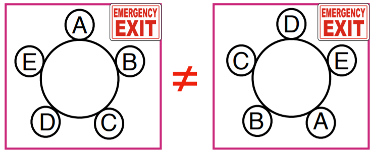
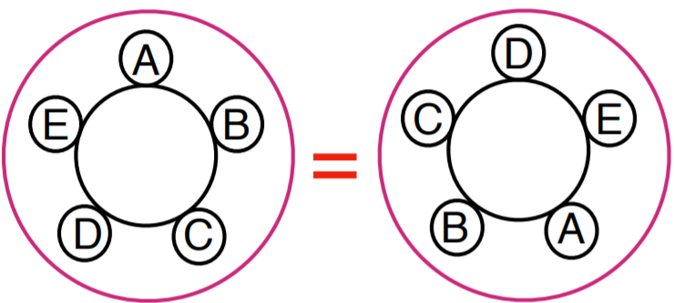

# Topic 4: Combinatorics

## 4.1 Permutations

+ Permutations
  + a permutation of a set is an ordering of objects
  + \# permutations of n objects
  + objects can be anything
  + using letters to represent the objects

+ Counting permutations
  + 2 objects:
    + by letters - 1st choice: 2; 2nd choice: 1
    + by tree structure - 1st level node: 2 branches; 2nd level node: 1 branch
    + \# permutation = 2 x 1 = 2
  + 3 objects
    + by letters - 1st choice: 3; 2nd choice: 2; 3rd choice: 1
    + by tree structure - 1st level node: 3 branches; 2nd level node: 2 branches; 3rd level node: 1 branch
    + \# permutations = 3 x 2 x 1 = 6
  + \# permutations of n objects = $n \times (n-1) \times \cdots \times 2 \times 1 \triangleq n! \to n$ factorial

+ 0 factorial
  + for $n \geq 1$, n! = \# permutations of an n-set = $n \times (n-1) \times \cdots \times 2 \times 1$
  + what about 0! ?
  + how many ways can you permute 0 objects?
    + 2 objects: a, b $\to$ (ab), (ba)
    + 1 object: a $\to$ (a)
    + 0 object: $\varnothing \to ()$
  + $0! = 1 \to$ exact same exact same reason as $2^0 =1$
  
+ Alternative factorial view
  + counting by writing elements left to right $\to$ smallest to largest
    + one position for the 1st element: only one possibility
    + two positions for the 2nd element: one on each side of the 1st element
    + 3 positions for the 3rd element: left-most, middle, right-most
    + 4 positions for the 4th element: 2 outer and 2 middle
    + and so on
  + $n \times (n-1) \times \cdots \times 2 \times 1 = n!$

+ Recursive definition
  + n! defined recursively

    \[\begin{align*}
      n! &= n \times (n-1) \times \cdots \times 2 \times 1 \\
      &= n \times [(n-1) \times \cdots \times 2 \times 1] \\
      &= n \times (n-1)! \quad \forall\, n \geq 1
    \end{align*}\]

  + 0 factorial: 1! = 1 x 0!
  + able to extend to negatives

+ Example: Basic permutations
  + \# orders to visit 3 cities: LA, SD, SF
    + 3! = 3 x 2 x 1 = 6
  + \# anagrams of 5 distinct letter: PEARS
    + 5! = 5 x 4 x 3 x 2 x 1 = 120

+ Constrained anagrams of PEARS
  + A, R staying adjacent in order
    + permutations of P, E, AR, S
    + \# of permutation: 4! = 4 x 3 x 2 x 1 = 24
  + A, R adjacent in any order
    + permutations of P, E, (AR, RA), S
    + 2 orders, 24 anagrams each
    + 2 x 24 = 48
  + A, R not adjacent: 5! - 48 = 120 - 48 = 72

+ More constrained permutations
  + \# ways 3 distinct boys and 2 distinct girls can stand in a row
  + unconstrained: (3+2)! = 5! = 120
  + alternating boys and girls: must be 'b, g, b, g, b' $\to$ 3! x 2! = 6 x 2 = 12
  + boys together and girls together: '3b, 2g' or '2g, 3b' $\to$ 2 x 3! x 2! = 24
  + unconstrained, but orientation (left to right) doesn't matter: 5! / 2 = 60

+ Circular arrangements
  + \# ways 5 people can sit at a round table
  + rotations matter: 5! = 120
  + rotations don't matter: 5!/5 = 4! = 24 $\gets$ alternatively, start w. A and arrange 4 other clockwise

  

    
  

+ Stirling's approximations
  
  \[ n! \sim \sqrt{2\pi n} \left( \frac{n}{e} \right)^n \]

  

    
  

+ [Original Slides](https://tinyurl.com/y9cevx3r)

### Problem Sets

0. How many permutations does the set {1,2,3,4} have? 
  a. 9 
  b. 18 
  c. 24 
  d. 36 

  Ans: 2 
  Explanation: 4! = 24

1. 0! =  
  a. 0 
  b. 1 
  c. $\infty$ 
  d. undefined 

  Ans: b

2. Which of the following are true for all $n,m \in \mathbb{N}$ and $n \geq 1$. 
  a. $n! = n \cdot (n−1)! $ 
  b. $(n⋅m)! = n! \cdot m! $ 
  c. $(n+m)! = n! + m! $ 
  d. $(nm)! = (n!)^m$ 

  Ans: a

3. In how many ways can 11 soccer players form a line before a game? 
  a. $11$ 
  b. $11^2$ 
  c. $11!$ 
  d. None of the above 

  Ans: c

4. In how many ways can 8 identical rooks be placed on an 8×8 chessboard so that none can capture any other, namely no row and no column contains more than one rook?

  Ans: 8! = 40320 
  Explanation: Since there are 8 rooks and 8 rows, each with at most one rook, each row must have exactly one rook. In the first row, there are 8 options for the location of the rook, and once that is chosen, there are 7 options for the second row, etc. Hence the number of ways to place the rooks is $8 \cdot 7 \cdot  \dots \cdot 2 \cdot 1= 8! = 40,320$.

5. In how many ways can 8 distinguishable rooks be placed on an 8×8 chessboard so that none can capture any other, namely no row and no column contains more than one rook?

  For example, in a 2×2 chessboard, you can place 2 rooks labeled 'a' and 'b' in 4 ways. There are 4 locations to place 'a', and that location determines the location of 'b'.

  Ans: $(8!)^2$ 
  Explanation:
    + You can either solve this based on the previous problem. There are  8!  ways to place identical rooks. And once that is done, you can label them in 8! ways.
    + Alternatively, from scratch, there are 64 choices for the first rook, and once the first is placed, one row and column are ruled out for the second , resulting in  49  choices for the second, and so on. Therefore, number of ways is  $64 \cdot 49 \cdot \dots \cdot 4 \cdot 1 = 8!^2 = 1625702400$.

6. In how many ways can 7 men and 7 women can sit around a table so that men and women alternate. Assume that all rotations of a configuration are identical hence counted as just one.

  Ans: $7! \cdot 7! / 7 = 3628800$ 
  Explanation: When rotations don't matter, there are 6! ways to seat the women. For each such configuration, there are 7! ways to seat the men. The total number of configurations is therefore $6! \times 7! = 3,628,800$.

7. In how many ways can three couples be seated in a row so that each couple sits together (namely next to each other): 
  a. in a row, 
  b. in a circle? 

  Ans: a. (48); b. (96, 16) 
  Explanation:
    + There are  3!  ways to decide on the order of the couples, and then  23  ways to determine the order for each couple, hence a total of $3! \cdot 2^3 = 48$  ways.
    + Configuration where the mark is between two couples correspond to configurations in a row, hence there are $3! \cdot 23=48$ of them. Furthermore each circular shift of such a configuration results in one where the mark separates two members of the same couple. Hence there are also 48 such configurations, and the total number of configurations is $48 \cdot 2=96$.

### Lecture Video

 

## 4.2 Partial Permutations

+ Partial permutations
  + \# orders of n objects = n!
  + \# orders of some of the n objects = ?
  + example: \# 2-digit PINs
    + any digits: \# = 10 x 10
    + distinct digits: \# = 10 x 9
  + example: \# 3 letter words
    + any letters: \# = 26 x 26 x 26
    + distinct letters: \#  26 x 25 x 24
  
+ Sequences with/without repetition
  + k-permutation of [n] $\to$ length-k sequences over [n]
  + w/ repetition: $n^k$
  + w/o repetition: $n^{\underline{k}}$

+ k-permutations
  + example: 2-permutations of {a, b, c}: ab, ac, ba, bc, ca, cb
  + n-permutation of an n-set: a permutation of the set
  + \# permutations of k out of n objects $\to$ k-permutations of n
  + \# k-permutations of an n-set
    + def: $n \times (n-1) \times \cdots \times (n-k+1) \stackrel{\text{def}}{=} n^{\underline{k}}$
    + $k$-th falling power of n
    + denoted as $P(n, k)$
  + falling powers simply related to factorial

    \[ n^{\underline{k}} = n \times (n-1) \times \cdots \times (n-k+1) = \frac{n!}{(n-k)!}  \]

+ Factorials and permutations
  + books: 4 programming, 5 probability, 6 machine learning
  + \# ordered list w/ 2 books from each subject where same subject book are listed consecutively

    \[ \underbrace{3!}_{\text{Subject}\\\text{Order}} \cdot \underbrace{4^{\underline{2}}}_{\text{Prog}} \cdot \underbrace{5^{\underline{2}}}_{\text{Prob}} \cdot \underbrace{6^{\underline{2}}}_{\text{ML}} = 6 \times (4\times 3) \times (5\times 4) \times (6 \times 5) = 43,200\]

+ [Original Slide](https://tinyurl.com/y8d35zzv)

### Problem Sets

0. How many 2-permutations do we have for set {1,2,3,4}? 
  a. 8 
  b. 12 
  c. 16 

  Ans: b 
  Explanation: The answer is $P(4, 2) = 4 \times 3 = 12$.

1. In how many ways can 5 cars - a BMW, a Chevy, a Fiat, a Honda, and a Kia - park in 8 parking spots?

  Ans: 6720 
  Explanation: There are 8 locations for the BMW, the 7 for the Chevy, etc, so the total number of ways is $8^{\underline{5}}=6720$.

2. In how many ways can 5 people sit in 8 numbered chairs?

  Ans: 6720 
  Explanation: The first person can sit in any of the 8 chairs, the second in one of the remaining 7, etc. Hence $P(8, 5) = 8⋅7⋅6⋅5⋅4 = 6720$.

3. Find the number of 7-character (capital letter or digit) license plates possible if no character can repeat and: 
  a. there are no further restrictions,  
  b. the first 3 characters are letters and the last 4 are numbers, 
  c. letters and numbers alternate, for example A3B9D7Q or 0Z3Q4A9. 

  Ans: a. (42072307200); b. (78624000); c. (336960000)  
  Explanation:
    + $36^7 = 42,072,307,200$
    + Choose 3 from capital letters, and 4 from digits, where the order matters. The result is $P(26, 3) \cdot P(10, 4) = 78,624,000$.
    + Such plates contain either four letters and three digits, or the other way. The two sets are disjoint. Hence $P(26, 3) \cdot P(10, 4) + P(26, 4) \cdot P(10, 3) = 336,960,000$.

4. A derangement is a permutation of the elements such that none appear in its original position. For example, the only derangements of {1,2,3} are {2,3,1} and {3,1,2}. How many derangements does {1,2,3,4} have?

  Ans: 9 
  Explanation:
    + Let $F_1$ be the set of permutations of {1,2,3,4}, where 1 is in location 1, for example 1324. Similarly let $F_2$ be the set of permutations where 2 is in location 2, for example 3214, etc.
    + Then $F_1 \cup F_2 \cup F_3 \cup F_4$ is the set of all 4-permutations where at least one element remains in its initial location. The set of permutations where no elements appears in its initial location is the complement of this set.
    + Note that $\sum_i |F_i|= P(4, 3)$ (1 location is fixed, so 3-permutation), $\sum_i\sum_j |F_i \cap F_j|= P(4, 2)$ , $\sum_i \sum_j \sum_k |F_i \cap F_j \cap F_k| = P(4,1)$, and $|F_1 \cap F_2 \cap F_3 \cap F_4| = P(4, 0)$.
    + Hence by inclusion exclusion, $|F_1 \cup F_2 \cup F_3 \cup F_4|= P(4, 3) − P(4, 2) + P(4, 1) − P(4, 0) = 24−12+4−1=15$.
    + It follows that the number of derangements is $4!−15=9$.

5. Eight books are placed on a shelf. Three of them form a 3-volume series, two form a 2-volume series, and 3 stand on their own. In how many ways can the eight books be arranged so that the books in the 3-volume series are placed together according to their correct order, and so are the books in the 2-volume series? Noted that there is only one correct order for each series.

  Ans: 120 
  Explanation: Since the 3-volume books must be placed in a unique order, we can view them as a just one "super book", similarly for the 2-volume books. We therefore have a total of 5 books that we can arrange freely, and we can do so in $5!=120$ ways.

### Lecture Video

 

## 4.3 Combinations

### Problem Sets

### Lecture Video

 

## 4.4 Applications of Binomial Coefficients

### Problem Sets

### Lecture Video

 

## 4.5 Properties of Binomial Coefficient

### Problem Sets

### Lecture Video

 

## 4.6 Binomial Theorem

### Problem Sets

### Lecture Video

 

## 4.7 Multinomials

### Problem Sets

### Lecture Video

 

## 4.8 Stars and Bars

### Problem Sets

### Lecture Video

 

## Lecture Notebook 4

## Programming Assignment 4

