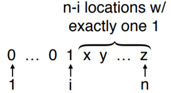
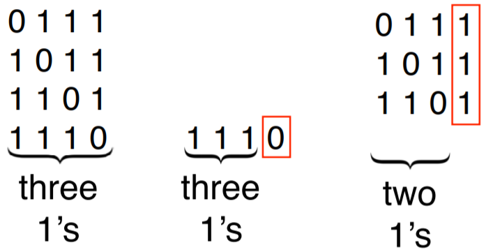
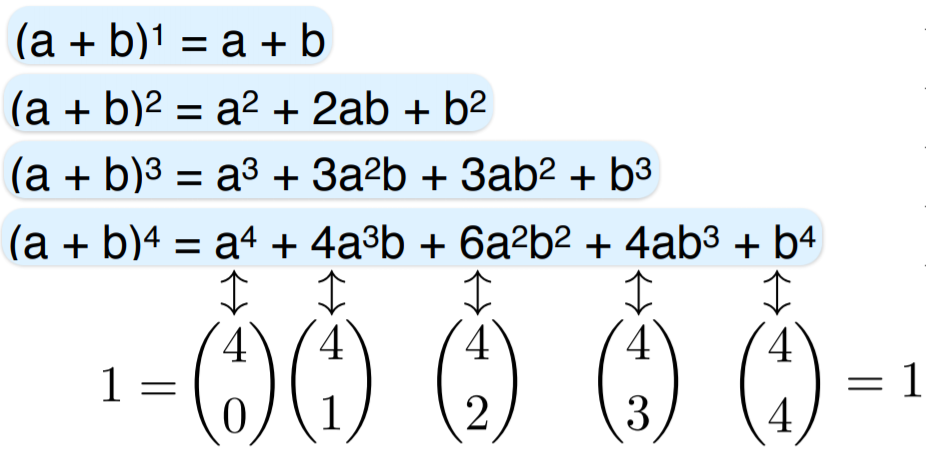
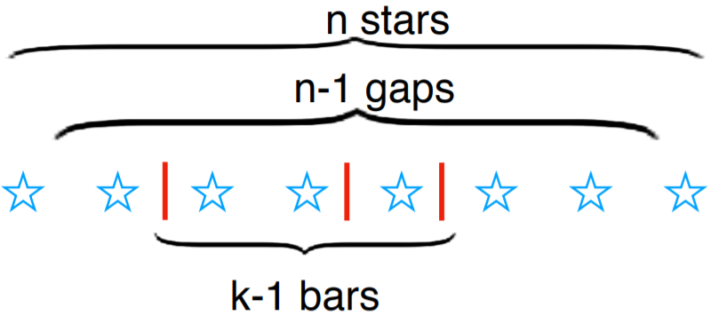
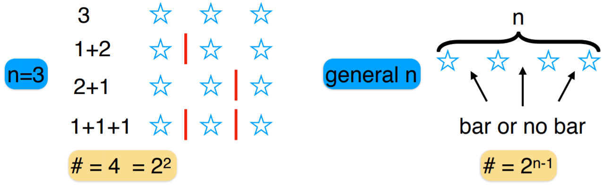
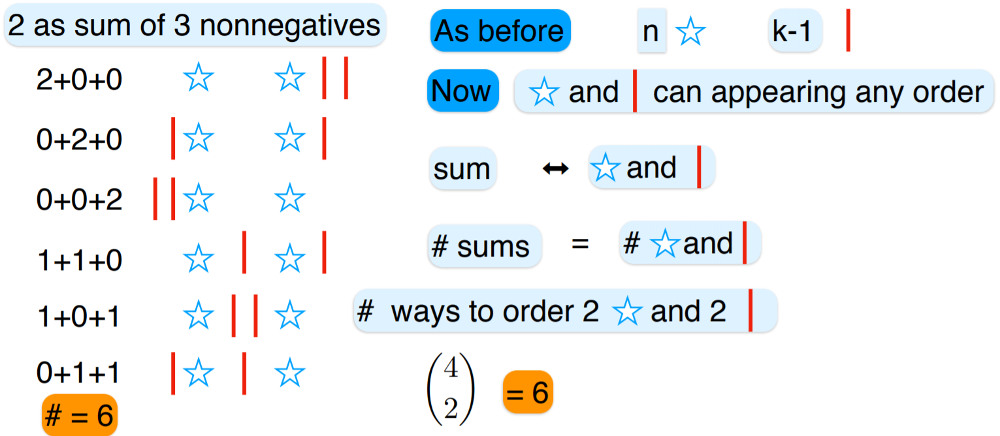
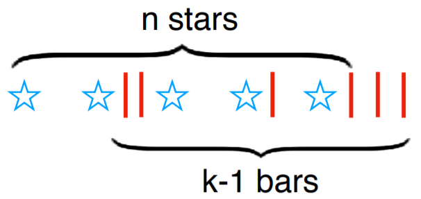

# Topic 4: Combinatorics


## 4.1 Permutations

+ Permutations
  + a <span style="color: magenta;">permutation</span> of a set is an ordering of objects
  + \# permutations of n objects
  + objects can be anything
  + using letters to represent the objects

+ Counting permutations
  + 2 objects:
    + by letters - 1st choice: 2; 2nd choice: 1
    + by tree structure - 1st level node: 2 branches; 2nd level node: 1 branch
    + \# permutation = 2 x 1 = 2
  + 3 objects
    + by letters - 1st choice: 3; 2nd choice: 2; 3rd choice: 1
    + by tree structure - 1st level node: 3 branches; 2nd level node: 2 branches; 3rd level node: 1 branch
    + \# permutations = 3 x 2 x 1 = 6
  + \# permutations of n objects = $n \times (n-1) \times \cdots \times 2 \times 1 \triangleq n! \to n$ factorial

+ 0 factorial
  + for $n \geq 1$, n! = \# permutations of an n-set = $n \times (n-1) \times \cdots \times 2 \times 1$
  + what about 0! ?
  + how many ways can you permute 0 objects?
    + 2 objects: a, b $\to$ (ab), (ba)
    + 1 object: a $\to$ (a)
    + 0 object: $\varnothing \to ()$
  + $0! = 1 \to$ exact same exact same reason as $2^0 =1$
  
+ Alternative factorial view
  + counting by writing elements left to right $\to$ smallest to largest
    + one position for the 1st element: only one possibility
    + two positions for the 2nd element: one on each side of the 1st element
    + 3 positions for the 3rd element: left-most, middle, right-most
    + 4 positions for the 4th element: 2 outer and 2 middle
    + and so on
  + $n \times (n-1) \times \cdots \times 2 \times 1 = n!$

+ Recursive definition
  + n! defined recursively

    \[\begin{align*}
      n! &= n \times (n-1) \times \cdots \times 2 \times 1 \\
      &= n \times [(n-1) \times \cdots \times 2 \times 1] \\
      &= n \times (n-1)! \quad \forall\, n \geq 1
    \end{align*}\]

  + 0 factorial: 1! = 1 x 0!
  + able to extend to negatives

+ Example: Basic permutations
  + \# orders to visit 3 cities: LA, SD, SF
    + 3! = 3 x 2 x 1 = 6
  + \# anagrams of 5 distinct letter: PEARS
    + 5! = 5 x 4 x 3 x 2 x 1 = 120

+ Constrained anagrams of PEARS
  + A, R staying adjacent in order
    + permutations of P, E, AR, S
    + \# of permutation: 4! = 4 x 3 x 2 x 1 = 24
  + A, R adjacent in any order
    + permutations of P, E, (AR, RA), S
    + 2 orders, 24 anagrams each
    + 2 x 24 = 48
  + A, R not adjacent: 5! - 48 = 120 - 48 = 72

+ More constrained permutations
  + \# ways 3 distinct boys and 2 distinct girls can stand in a row
  + unconstrained: (3+2)! = 5! = 120
  + alternating boys and girls: must be 'b, g, b, g, b' $\to$ 3! x 2! = 6 x 2 = 12
  + boys together and girls together: '3b, 2g' or '2g, 3b' $\to$ 2 x 3! x 2! = 24
  + unconstrained, but orientation (left to right) doesn't matter: 5! / 2 = 60

+ Circular arrangements
  + \# ways 5 people can sit at a round table
  + rotations matter: 5! = 120
  + rotations don't matter: 5!/5 = 4! = 24 $\gets$ alternatively, start w. A and arrange 4 other clockwise

  <div style="margin: 0.5em; display: flex; justify-content: center; align-items: center; flex-flow: row wrap;">
    <a href="https://tinyurl.com/y9cevx3r" ismap target="_blank">
      
      
    </a>
  </div>

+ Stirling's approximations
  
  \[ n! \sim \sqrt{2\pi n} \left( \frac{n}{e} \right)^n \]

  <div style="margin: 0.5em; display: flex; justify-content: center; align-items: center; flex-flow: row wrap;">
    <a href="https://en.wikipedia.org/wiki/Stirling%27s_approximation" ismap target="_blank">
      
    </a>
  </div>

+ [Original Slides](https://tinyurl.com/y9cevx3r)


### Problem Sets

0. How many permutations does the set {1,2,3,4} have?<br/>
  a. 9<br/>
  b. 18<br/>
  c. 24<br/>
  d. 36<br/>

  Ans: 2<br/>
  Explanation: 4! = 24


1. 0! = <br/>
  a. 0<br/>
  b. 1<br/>
  c. $\infty$<br/>
  d. undefined<br/>

  Ans: b


2. Which of the following are true for all $n,m \in \mathbb{N}$ and $n \geq 1$.<br/>
  a. $n! = n \cdot (n−1)! $<br/>
  b. $(n⋅m)! = n! \cdot m! $<br/>
  c. $(n+m)! = n! + m! $<br/>
  d. $(nm)! = (n!)^m$<br/>

  Ans: a


3. In how many ways can 11 soccer players form a line before a game?<br/>
  a. $11$<br/>
  b. $11^2$<br/>
  c. $11!$<br/>
  d. None of the above<br/>

  Ans: c


4. In how many ways can 8 identical rooks be placed on an 8×8 chessboard so that none can capture any other, namely no row and no column contains more than one rook?

  Ans: <span style="color: magenta;">8! = 40320</span><br/>
  Explanation: Since there are 8 rooks and 8 rows, each with at most one rook, each row must have exactly one rook. In the first row, there are 8 options for the location of the rook, and once that is chosen, there are 7 options for the second row, etc. Hence the number of ways to place the rooks is $8 \cdot 7 \cdot  \dots \cdot 2 \cdot 1= 8! = 40,320$.


5. In how many ways can 8 distinguishable rooks be placed on an 8×8 chessboard so that none can capture any other, namely no row and no column contains more than one rook?

  For example, in a 2×2 chessboard, you can place 2 rooks labeled 'a' and 'b' in 4 ways. There are 4 locations to place 'a', and that location determines the location of 'b'.

  Ans: $(8!)^2$<br/>
  Explanation:
    + You can either solve this based on the previous problem. There are  8!  ways to place identical rooks. And once that is done, you can label them in 8! ways.
    + Alternatively, from scratch, there are 64 choices for the first rook, and once the first is placed, one row and column are ruled out for the second , resulting in  49  choices for the second, and so on. Therefore, number of ways is  $64 \cdot 49 \cdot \dots \cdot 4 \cdot 1 = 8!^2 = 1625702400$.


6. In how many ways can 7 men and 7 women can sit around a table so that men and women alternate. Assume that all rotations of a configuration are identical hence counted as just one.

  Ans: $7! \cdot 7! / 7 = 3628800$<br/>
  Explanation: When rotations don't matter, there are 6! ways to seat the women. For each such configuration, there are 7! ways to seat the men. The total number of configurations is therefore $6! \times 7! = 3,628,800$.


7. In how many ways can three couples be seated in a row so that each couple sits together (namely next to each other):<br/>
  a. in a row,<br/>
  b. in a circle?<br/>

  Ans: a. (48); b. (96, <span style="color: magenta;">16<span>)<br/>
  Explanation:
    + There are  3!  ways to decide on the order of the couples, and then  23  ways to determine the order for each couple, hence a total of $3! \cdot 2^3 = 48$  ways.
    + Configuration where the mark is between two couples correspond to configurations in a row, hence there are $3! \cdot 23=48$ of them. Furthermore each circular shift of such a configuration results in one where the mark separates two members of the same couple. Hence there are also 48 such configurations, and the total number of configurations is $48 \cdot 2=96$.


### Lecture Video

<a href="https://tinyurl.com/ybh6k4fn" target="_BLANK">
  
</a><br/>


## 4.2 Partial Permutations

+ Partial permutations
  + \# orders of n objects = n!
  + \# orders of some of the n objects = ?
  + example: \# 2-digit PINs
    + any digits: \# = 10 x 10
    + distinct digits: \# = 10 x 9
  + example: \# 3 letter words
    + any letters: \# = 26 x 26 x 26
    + distinct letters: \#  26 x 25 x 24
  
+ Sequences with/without repetition
  + k-permutation of [n] $\to$ length-k sequences over [n]
  + w/ repetition: $n^k$
  + w/o repetition: $n^{\underline{k}}$

+ k-permutations
  + example: 2-permutations of {a, b, c}: ab, ac, ba, bc, ca, cb
  + n-permutation of an n-set: a permutation of the set
  + \# permutations of k out of n objects $\to$ <span style="color: cyan;">k-permutations</span> of n
  + \# k-permutations of an n-set
    + def: $n \times (n-1) \times \cdots \times (n-k+1) \stackrel{\text{def}}{=} n^{\underline{k}}$
    + $k$-th <span style="color: cyan;">falling power</span> of n
    + denoted as $P(n, k)$
  + falling powers simply related to factorial

    \[ n^{\underline{k}} = n \times (n-1) \times \cdots \times (n-k+1) = \frac{n!}{(n-k)!}  \]

+ Factorials and permutations
  + books: 4 programming, 5 probability, 6 machine learning
  + \# ordered list w/ 2 books from each subject where same subject book are listed consecutively

    \[ \underbrace{3!}_{\text{Subject}\\\text{Order}} \cdot \underbrace{4^{\underline{2}}}_{\text{Prog}} \cdot \underbrace{5^{\underline{2}}}_{\text{Prob}} \cdot \underbrace{6^{\underline{2}}}_{\text{ML}} = 6 \times (4\times 3) \times (5\times 4) \times (6 \times 5) = 43,200\]


+ [Original Slide](https://tinyurl.com/y8d35zzv)


### Problem Sets

0. How many 2-permutations do we have for set {1,2,3,4}?<br/>
  a. 8<br/>
  b. 12<br/>
  c. 16<br/>

  Ans: b<br/>
  Explanation: The answer is $P(4, 2) = 4 \times 3 = 12$.


1. In how many ways can 5 cars - a BMW, a Chevy, a Fiat, a Honda, and a Kia - park in 8 parking spots?

  Ans: 6720<br/>
  Explanation: There are 8 locations for the BMW, the 7 for the Chevy, etc, so the total number of ways is $8^{\underline{5}}=6720$.


2. In how many ways can 5 people sit in 8 numbered chairs?

  Ans: 6720<br/>
  Explanation: The first person can sit in any of the 8 chairs, the second in one of the remaining 7, etc. Hence $P(8, 5) = 8⋅7⋅6⋅5⋅4 = 6720$.


3. Find the number of 7-character (capital letter or digit) license plates possible if no character can repeat and:<br/>
  a. there are no further restrictions, <br/>
  b. the first 3 characters are letters and the last 4 are numbers,<br/>
  c. letters and numbers alternate, for example A3B9D7Q or 0Z3Q4A9.<br/>

  Ans: a. (42072307200); b. (78624000); c. (336960000) <br/>
  Explanation:
    + $36^7 = 42,072,307,200$
    + Choose 3 from capital letters, and 4 from digits, where the order matters. The result is $P(26, 3) \cdot P(10, 4) = 78,624,000$.
    + Such plates contain either four letters and three digits, or the other way. The two sets are disjoint. Hence $P(26, 3) \cdot P(10, 4) + P(26, 4) \cdot P(10, 3) = 336,960,000$.


4. A derangement is a permutation of the elements such that none appear in its original position. For example, the only derangements of {1,2,3} are {2,3,1} and {3,1,2}. How many derangements does {1,2,3,4} have?

  Ans: 9<br/>
  Explanation:
    + Let $F_1$ be the set of permutations of {1,2,3,4}, where 1 is in location 1, for example 1324. Similarly let $F_2$ be the set of permutations where 2 is in location 2, for example 3214, etc.
    + Then $F_1 \cup F_2 \cup F_3 \cup F_4$ is the set of all 4-permutations where at least one element remains in its initial location. The set of permutations where no elements appears in its initial location is the complement of this set.
    + Note that $\sum_i |F_i|= P(4, 3)$ (1 location is fixed, so 3-permutation), $\sum_i\sum_j |F_i \cap F_j|= P(4, 2)$ , $\sum_i \sum_j \sum_k |F_i \cap F_j \cap F_k| = P(4,1)$, and $|F_1 \cap F_2 \cap F_3 \cap F_4| = P(4, 0)$.
    + Hence by inclusion exclusion, $|F_1 \cup F_2 \cup F_3 \cup F_4|= P(4, 3) − P(4, 2) + P(4, 1) − P(4, 0) = 24−12+4−1=15$.
    + It follows that the number of derangements is $4!−15=9$.


5. Eight books are placed on a shelf. Three of them form a 3-volume series, two form a 2-volume series, and 3 stand on their own. In how many ways can the eight books be arranged so that the books in the 3-volume series are placed together according to their correct order, and so are the books in the 2-volume series? Noted that there is only one correct order for each series.

  Ans: 120<br/>
  Explanation: Since the 3-volume books must be placed in a unique order, we can view them as a just one "super book", similarly for the 2-volume books. We therefore have a total of 5 books that we can arrange freely, and we can do so in $5!=120$ ways.


### Lecture Video

<a href="https://tinyurl.com/y9msxez5" target="_BLANK">
  
</a><br/>


## 4.3 Combinations

+ k-subsets
  + $k$-set: a k-element set
  + $k$-subset: a k-element subset
  + $\dbinom{[n]}{k}$: collection of k-subsets of $[n] = \{1, 2, \dots, n\}$
  + example
    + $\binom{[3]}{1} = \{\{1\}, \{2\}, \{3\}\}$
    + $\binom{[3]}{2} = \{\{1, 2\}, \{1, 3\}, \{2, 3\}\}$
    + $\binom{[4]}{2} = \{\{1,2\}, \{1, 3\}, \{1, 4\}, \{2, 3\}, \{2, 4\}, \{3, 4\}\}$

+ Sequences w/ k 1's - an analogy to k-element subsets
  + $\dbinom{[n]}{k}$: collection of k-subsets of $[n] = \{1, 2, \dots, n\}$
  + 1-1 correspondence to n-bit sequences w/ k 1's

    <table style="font-family: arial,helvetica,sans-serif; width: 40vw;" table-layout="auto" cellspacing="0" cellpadding="5" border="1" align="center">
      <thead>
      <tr style="font-size: 1.2em;">
        <th style="text-align: center; background-color: #3d64ff; color: #ffffff; width:10%;"></th>
        <th style="text-align: center; background-color: #3d64ff; color: #ffffff; width:25%;">Subsets</th>
        <th style="text-align: center; background-color: #3d64ff; color: #ffffff; width:25%;">Binary Sequences</th>
      </tr>
      </thead>
      <tbody>
      <tr> <td style="text-align: center;">$\binom{[3]}{1}$</td> <td style="text-align: center;">$\{1\}, \{2\}, \{3\}$</td> <td style="text-align: center;">$100, 010, 001$</td> </tr>
      <tr> <td style="text-align: center;">$\binom{[3]}{2}$</td> <td style="text-align: center;">$\{1, 2\}, \{1, 3\}, \{2, 3\}$</td> <td style="text-align: center;">$110, 101, 011$</td> </tr>
      <tr> <td style="text-align: center;">$\binom{[4]}{2}$</td> <td style="text-align: center;">$\{1,2\}, \{1, 3\}, \dots, \{3, 4\}$</td> <td style="text-align: center;">$1100, 1010, \dots, 0011$</td> </tr>
      <tr> <td style="text-align: center;">$\binom{[n]}{k}$</td> <td style="text-align: center;">k-subset of an n-set</td> <td style="text-align: center;">n-bit sequences w/ k 1's</td> </tr>
      </tbody>
    </table>

    + same number of elements
    + mostly count sequences
    + same applied to subsets

+ Number of n-bit sequences w/ k 1's
  + binomial coefficient:
    + $\dbinom{n}{k} \triangleq \left|\dbinom{[n]}{k} \right|$ = \# n-bit sequences w/ k 1's
    + e.g., $\binom{3}{2} = \left|\binom{[3]}{2} \right| = |\{110, 101, 011\}| = 3$
  + locations of 1's
    + ordered pairs from {1, 2, 3}: $\# = 3^\underline{2} = P(3, 2) = 6$
    + non-ordered: $\dbinom{3}{2} = \dfrac{3^{\underline{2}}}{2} = \dfrac{6}{2} = 3$

+ Calculating the Binomial coefficients
  + $\underbrace{\dbinom{n}{k}}_{\text{number}} \triangleq \underbrace{\left| \dbinom{[n]}{k} \right|}_{\text{set}} = ?$
  + specify locations of the k 1's in order; e.g., 123, 531, 213, ... $\gets$ each location $\in [n]$
  + \# ordered locations: $n^\underline{k} = P(n, k)$
  + every binary sequence w/ k 1's correspondence to k! ordered locations, e.g., $10101 \iff 1,3,5 \quad 1,5,3 \quad 3,1,5 \quad 3,5,1 \quad 5,1,3 \quad 5,3,1$

    \[ k! \dbinom{n}{k} = n^{\underline{k}} \to \dbinom{n}{k} = \frac{n^{\underline{k}}}{k!} = \frac{n!}{k!\,(n-k)!} \]

  + for small $n, k$ s.t.

    \[ \left| \dbinom{[n]}{k} \right| = \dbinom{n}{k} = \frac{n!}{k!\,(n-k)!} \]

  + examples
    \[\begin{array}{lll}
      \dbinom{[3]}{1} = \begin{Bmatrix} 001 \\ 010 \\ 100 \end{Bmatrix} &\to \dbinom{3}{1} = \dfrac{3!}{1!2!} &\quad \text{choose location of 1} \\\\
      \dbinom{[3]}{2} = \begin{Bmatrix} 011 \\ 101 \\ 110 \end{Bmatrix} &\to \dbinom{3}{2} = \dfrac{3!}{2!1!} &\quad \text{choose location of 0} \\\\
      \dbinom{[4]}{2} = \begin{Bmatrix} 0011 \\ 0101 \\ 0110 \\\ 1001 \\ 1010 \\ 1100 \end{Bmatrix} &\to \dbinom{4}{2} = \dfrac{4!}{2!2!} &\quad \begin{matrix}\text{choose location of 1's}\\ \text{1st location: 4 choices}\\ \text{2nd location: 3 choices}\\ \text{Each chosen twice} \end{matrix}
    \end{array}\]

+ Simple $\binom{n}{k}$
  + all-zero sequence: $\dbinom{n}{0} = \dfrac{n!}{0!n!} = 1$
  + all-one sequence: $\dbinom{n}{n} = \dfrac{n!}{n!0!} = 1$
  + choose location of single 1: $\dbinom{n}{1} = \dfrac{n!}{1!(n-1)!} = n$
  + choose 2 locations
    + 1st location: n ways
    + 2nd location: n-1 ways
    + each sequence chosen twice

      \[ \dbinom{n}{2} = \frac{n!}{2!(n-2)!} = \frac{n(n-1)}{2} \]

    + alternative explanation
      + $\binom{[n]}{2} = \{ \text{n-bit strings w/ two 1's}\}$
      + $A_i = \{x^n: \text{first 1 at location } i\} \quad (1 \leq i \leq n-1)$ (see diagram)
      + $|A_i| = n-i \quad A_i$'s disjoint
      + $\binom{[n]}{2} = A_1 \uplus A_2 \uplus \dots \uplus A_{n-1} \qquad \uplus:$ disjoint union
      + $\binom{n}{k} = |\binom{[n]}{2} | = |A_1| + \cdots + |A_{n-1}| = (n-1) + \cdots + 1 = \frac{n(n-1)}{2}$

    <div style="margin: 0.5em; display: flex; justify-content: center; align-items: center; flex-flow: row wrap;">
      <a href="https://tinyurl.com/ycb93ryy" ismap target="_blank">
        
      </a>
    </div>

+ Permutations or Combinations
  + permutation: order matters
  + combinations: order doesn't matter
  + type of lock you used to secure your bike  $\to$  combinations


+ [Original Slides](https://tinyurl.com/ycb93ryy)


### Problem Sets


0. Which of the following is larger for $k \leq n$?<br/>
  a. The number of k-permutations of an n-set<br/>
  b. The number of k-subsets of an n-set<br/>

  Ans: a<br/>
  Explanation: The number of k-permutations is larger. In selecting subsets, the order doesn't matter, hence the number of k-subsets is the number of k-permutations divided by k!


1. In how many ways can a basketball coach select 5 starting players form a team of 15?<br/>
  a. $\frac{15!}{5!10!}$<br/>
  b. $\frac{15!}{10!}$<br/>
  c. $\frac{15!}{5!}$<br/>
  d. None of the above<br/>

  Ans: a<br/>
  Explanation: It can be deducted from partial permutation, but the order does not matter. It is $(\frac{15}{5}) = \frac{15^5}{5!} = \frac{15!}{5!10!}$.


2. In how many ways can you select a group of 2 people out of 5?
  
  In how many ways can you select a group of 3 people out of 5?

  In how many ways can you divide 5 people into two groups, where the first group has 2 people and the second has 3?

  a. 10<br/>
  b. 25<br/>
  c. 125<br/>
  d. None of the above<br/>

  Ans: a<br/>
  Explanation:
  + binom(5, 2) = 10
  + binom(5, 3) = 10
  + After we determine the group of 2, the group of 3 is determined as well, hence the answer is binom(5, 2) = 10

  
3. Ten points are placed on a plane, with no three on the same line. Find the number of:<br/>
  a. lines connecting two of the points,<br/>
  b. these lines that do not pass through two specific points (say  A  or  B ),<br/>
  c. triangles formed by three of the points,<br/>
  d. these triangles that contain a given point (say point  A ),<br/>
  e. these triangles contain the side  AB .<br/>

  Ans: a. (45); b. (28); c. (120); d. (36); e. (8)<br/>
  Explanation:
    + Choosing any 2 points out of the 10 points can make a line: $\binom{10}{2}$
    + Choosing any 2 points out of the remaining 8 points (except A,B): $\binom{8}{2}$
    + As no three on the same line, choosing any 3 points out of the 10 points make a triangle: $\binom{10}{3}$
    + With point A fixed, choosing any 2 points out of the remaining 9 points make a triangle: $\binom{9}{2}$
    + With point  A  and  B  fixed, choosing any 1 point out of the remaining 8 points make a triangle: $\binom{8}{1}$


4. The set {1,2,3} contains 6 nonempty intervals: {1}, {2}, {3}, {1,2}, {2,3}, and {1,3}.

  How many nonempty intervals does  {1,2,…,10}  contain?

  Ans: 55<br/>
  Explanation; {1,2,…,n} contains $\binom{n}{1}$ singleton intervals and $\binom{n}{2}$ intervals of 2 or more elements. Hence the total number of intervals is $\binom{n}{2}+\binom{n}{1}$. By Pascal's identity $\binom{n}{2}+\binom{n}{1} = \binom{N+1}{2}$. This can also be seen by considering the n+1 midpoints {0.5,1.5,…n+0.5}. Any pair of these points defines an interval in {1,2,⋯n}.


5. A rectangle in an m×n chessboard is a Cartesian product S×T, where S and T are nonempty intervals in {1,…,m} and {1,2,…,n} respectively. How many rectangles does the 3×6 chessboard have?

  Ans: <span style="color: magenta;">126</span><br/>
  Explanation: Repeating the same analysis as the above question, but for two different intervals, we have $\binom{4}{2} \cdot \binom{7}{2} = 126$.


6. A standard 52-card deck consists of 4 suits and 13 ranks. Find the number of 5-card hands where:<br/>
  a. any hand is allowed (namely the number of different hands), <br/>
  b. all five cards are of same suit,<br/>
  c. all four suits are present,<br/>
  d. all cards are of distinct ranks.<br/>

  Ans: a. (2598960); b. (5148); c. (685464); d. (1317888) <br/>
  Explanation:
    + This is simply $\binom{52}{5}$.
    + There are 4 suits in total and 13 cards in each suit, hence $4 \cdot \binom{13}{5}$ hands.
    + One of the 4 suits will appear twice, hence $4 \cdot \binom{13}{2} \cdot \binom{13}{3}$ hands.
    + First pick 5 out of 13 ranks, then choose their suits. Therefore there are $\binom{13}{5} \cdot 4^5$ hands.


7. A company employs 4 men and 3 women. How many teams of three employees have at most one woman?<br/>
  a. 21<br/>
  b. 22<br/>
  c. 23<br/>
  d. 24<br/>

  Ans: b <br/>
  Explanation: There are $\binom{4}{3})=4$ teams with 0 women and $\binom{3}{1} \times \binom{4}{2}=3 \times 6=18$ teams with 1 woman, for a total of 22.


8. A (tiny) library has 5 history texts, 3 sociology texts, 6 anthropology texts and 4 psychology texts. Find the number of ways a student can choose:<br/>
  a. one of the texts,<br/>
  b. two of the texts,<br/>
  c. one history text and one other type of text,<br/>
  d. one of each type of text,<br/>
  e. two of the texts with different types.<br/>

  Ans: a. (18); b. (153); c. (65); d. (360); e. (119)<br/>
  Explanation:
    + c. The student can choose 5 different history texts, and  3+6+4=13  other texts, by the product rule there are 5⋅13=65 ways of doing that.
    + d. The student selects one text of each type, by the product rule this can be done in  5⋅3⋅6⋅4=360  ways.
    + e. There are  5⋅3=15  ways to choose one history and one sociology text,  5⋅6=30  ways to choose one history and one anthropology text, etc. In total there are  5⋅3+5⋅6+5⋅4+3⋅6+3⋅4+6⋅4=119  ways. $|\Omega| - \binom{5}{2} - \binom{3}{2} - \binom{6}{2} - \binom{4}{2}$


9. In how many ways can 7 distinct red balls and 5 distinct blue balls be placed in a row such that<br/>
  a. all red balls are adjacent,<br/>
  b. all blue balls are adjacent,<br/>
  c. no two blue balls are adjacent.<br/>

  Ans: a. (3628800); b. (4838400); c. (33868800)<br/>
    + There are 6 ways to place 7 red balls adjacent. Hence the number of ways is  6×7!×5!=3628800 .
    + There are 8 ways to place 5 red balls adjacent. Hence the number of ways is  8×7!×5!=4838400 .
    + First, decide on the locations of the red and blue balls. Arrange all 7 red balls in a line, we can then choose 5 out of the 8 gaps (including those at the beginning and end) to place the blue balls. Since the balls are distinct we can permute the blue balls, and the red balls, for a total of  (85)7!5!  arrangements.


10. For the set {1,2,3,4,5,6,7} find the number of:<br/>
  a. subsets,<br/>
  b. 3-subsets,<br/>
  c. 3-subsets containing the number 1,<br/>
  d. 3-subsets not containing the number 1.<br/>

  Ans: a. ($2^7$); b. (35); c. (15); d. (20)<br/>
  Explanation: 
    + There are 7 elements in the set. The number of subsets is $2^7$ .
    + Choose 3 elements out of 7. The number of ways is $\binom{7}{3}=35$.
    + 1  is fixed. Choose 2 elements out of 6. The number of ways is $\binom{6}{2}=15$.
    + Choose 3 elements out of 6 (excluding  1 ). The number of ways is $\binom{6}{3}=20$


11. A function $f:X \to Y$ is _injective_ or one-to-one if different elements in $X$ map to different elements in $Y$, namely,

  \[ \forall\, x \neq x^\prime \in X,\, f(x) \neq f(x^\prime).  \]

  A function $f:X \to Y$ is _surjective_ or onto if all elements in $Y$ are images of at least one element of $X$, namely,
  
  \[ \forall\, y \in Y, \exists\, x \in X,\, f(x)=y. \]

  For sets A={1,2,3} and B={a,b,c,d}, find the number of

  a. functions from $A$ to $B$,<br/>
  b. functions from $B$ to $A$,<br/>
  c. one-to-one functions from $A$ to $B$,<br/>
  d. onto functions from $B$ to $A$.<br/>

  Ans: a. ($4^3$); b. ($3^4$); c. (<span style="color: magenta;">24</span>); d. (<span style="color: magenta;">36</span>)<br/>
  Explanation:
    + As we saw in the lecture, there are  $|B|^{|A|}=4^33=64$ functions from $A$ to $B$.
    + $|A|^{|B|}=3^4=81$
    + There are 4 possible values for $f(1)$. Once $f(1)$ is determined, 3 options for $f(2)$ will keep $f$ one-to-one. And after $f(1)$ and $f(2)$ are determined, two options for $f(3)$ will keep $f$ one-to-one. Hence the total number of one-to-one functions is $4^{\underline{3}} = 4⋅3⋅2 = 24$.
    + If a mapping from $B$ to $A$ is onto, then two elements of $B$ map to a single element in $A$, while the other two elements of $B$ map to the remaining 2 elements of $A$. There are $\binom{4}{2}=6$ ways to choose the two elements with the same image, and then $3!=6$ ways to to associate the pair and two other elements of $B$ with the three elements of $A$. The total number of onto functions from $B$ to $A$ is therefore $6⋅6=36$.
    + alternative for counting surjective function w/ PIE: $n^m + \sum_{i=1}^{n-1} (-1)^i \binom{n}{i} (n-i)^m, \quad |A| = m, |B| = n$


### Lecture Video

<a href="https://tinyurl.com/y8cmqyed" target="_BLANK">
  
</a><br/>


## 4.4 Applications of Binomial Coefficients

+ Subsets
  + \# k-element subsets of an n-set
  + 1-1 correspondence btw such sets and n-bit sequence w/ k 1's

    \[ \# = \binom{n}{k} \]

+ Example: Committees with constrained
  + 4 boys and 3 girls
  + choose 2 boys and 2 girls

    \[ \binom{4}{2} \cdot \binom{2}{2} = 6 \cdot 3 = 18 \]

+ Example: Conflict resolution
  + 4 boys and 3 girls
  + John and Mary cannot serve together
  + How many committees of 4
    + w/ John: $\binom{5}{3} = 10$
    + w/ Mary: $\binom{4}{3} = 10$
    + neither: $\binom{5}{4} = 5$
    + total: 10 + 10 + 5 = 25

+ Example: Triangles
  + n points in general position in plane
  + how many triangles can be formed?

  \[ \binom{n}{3} \]

+ Example How many paths
  + a 4x6 grid
  + start from (0,0) to (4, 6)
  + every path from start to end is a length-10 sequence of U, R w/ 6 R's

  \[ \text{# of paths } = \binom{10}{6} = 210 \]


+ [Original Slides](https://tinyurl.com/y9l85csd)


### Problem Sets


0. You school offers 6 science classes and 5 art classes. How many schedules can you form with 2 science and 2 art classes if order doesn't matter.<br/>
  a. 25<br/>
  b. 55<br/>
  c. 60<br/>
  d. 150<br/>

  Ans: 150<br/>
  Explanation: $\binom{6}{2} \cdot \binom{5}{2} = 15 \times 10 = 150$


1. How many ordered pairs $(A,B)$, where $A$, $B$ are subsets of $\{1,2,3,4,5\}$, are there if: $|A|+|B|=4$

  Ans: 210 <br/>
  Explanation: Number of ways is $\binom{5}{0} \binom{5}{4} + \binom{5}{1} \binom{5}{3}+ \cdots + \binom{5}{4} \binom{(5}{0}$.


2. In the video (slide 6, minute 4:04), we discussed the number of non-decreasing grid-paths from $(0,0)$ to $(6,4)$.

  How many of these paths go through the point $(2,2)$?

  Ans: 90<br/>
  Explanation: From (0,0) to (2,2), there are $\binom{4}{2}=6$  paths. From (2,2) to (6,4), there are $\binom{6}{2}=15$ paths. The total number of paths is  6×15=90 .


### Lecture Video

<a href="https://tinyurl.com/yce6yetk" target="_BLANK">
  
</a><br/>


## 4.5 Properties of Binomial Coefficient

+ Theorem: (Symmetry)

    \[ \dbinom{n}{k} = \dbinom{n}{n-k} \]

  + Proof: (Algebraic)

    \[ \dbinom{n}{k} = \frac{n!}{k!\,(n-k)!}  = \frac{n!}{(n-k)!\,k!} = \dbinom{n}{n-k} \tag*{$\Box$} \]

  + example: $\dbinom{5}{3} = \dfrac{5!}{3!2!} = \dfrac{5!}{2!3!}$
  + Proof: (Combinatorial)

    complement bits to create 1-1 correspondence: $\binom{[n]}{k} \iff \binom{[n]}{n-k}$

    \[ \dbinom{n}{k} = \left| \binom{[n]}{k} \right| = \left| \dbinom{[n]}{n-k} \right| = \dbinom{n}{n-k} \tag*{$\Box$} \]

  + example:

    \[ \binom{[4]}{3} \iff \begin{Bmatrix} 1110 \\ 1101 \\ 1011 \\ 0111 \end{Bmatrix} \xrightarrow{\text{complement}} \begin{Bmatrix} 0001 \\ 0010 \\ 0100 \\ 1000 \end{Bmatrix} \iff \binom{[4]}{4-3} \]

+ Theorem: (Recursion)

    \[ \dbinom{n}{k} = \frac{n}{k} \cdot \dbinom{n-1}{k-1} \]

  + Interpretation: Number of length-n ternary strings w/ k-1 1's and one 2

    \[ \dbinom{n}{k} \cdot k = n \cdot \dbinom{n-1}{k-1} \]

    + $k$ in $\binom{n}{k}$: choose k locations of k non-zeros (1's & 2)
    + $k$ as multiple: choose one of these locations to be 2
    + $n$ as multiple: choose location of 2
    + $n-1$: from remaining n-1 locations choose locations of the k-1 1's
  + example: $\dbinom{5}{3} = \dfrac{5!}{3!2!} = 10 = \dfrac{5}{3} \cdot 6 = \dfrac{5}{3}\dbinom{4}{2} \quad\gets$ recursive definition
  + e.g., $n=4 \quad k=3: \{ 0112, 1012, 2110, \dots \}$

+ Theorem: (Binomial)

  \[ \sum_{i=0}^n \dbinom{n}{i} = 2^n \]

  + Proof (Combinatorial)

    \[ 2^{[n]} = \biguplus_{i=0}^n \dbinom{[n]}{i} \quad\to\quad 2^n = \left| 2^{[n]} \right| = \sum_{i=0}^n \left| \dbinom{[n]}{i} \right| = \sum_{i=0}^n \dbinom{n}{i} \tag*{$\Box$} \]

  + e.g., $\dbinom{3}{0} + \dbinom{3}{1} + \dbinom{3}{2} + \dbinom{3}{3} = 1 + 3 = 3 + 1 = 8 = 2^3$
  + interpretation
    + \# subsets of [n] of size $\leq n-1 \to$ \# n-bit sequences w/ $\leq n-1$ 1's
    + e.g., $n = 3 \quad\to\quad \underbrace{000}_{1}, \underbrace{001, 010, 100}_{3}, \underbrace{011, 101, 110}_{3} \quad\to\quad 1 + 3 = 3 = 7$
    + two ways:

      \[\begin{align*} 
        & \sum_{i=0}^{n-1} \dbinom{n}{i} \\\\
        & \sum_{i=0}^{n} \dbinom{n}{i} = 2^n \quad \sum_{i=0}^{n-1} \dbinom{n}{i} = 2^n - \dbinom{n}{n} = 2^n - 1 
      \end{align*}\]

+ Theorem: (Identity)

  \[ \sum_{i=0}^n \dbinom{i+k-1}{k-1} = \dbinom{n+k}{k} \]

  \[ \dbinom{k-1}{k-1} + \dbinom{k}{k-1} + \cdots + \dbinom{n+k-1}{k-1} = \dbinom{n+k}{k} \]

  + Proof: (Combinatorial)
    + $A$ = {binary sequences of length n+k w/ k 1's}

      \[ |A| = \dbinom{n+k}{k} \]

    + $A_i$ = { (n+k)-bit sequences w/ k 1's where the last 1 is at location i}

      \[ A = A_k \uplus A_{k+1} \uplus \cdots \uplus A_{n+k} \]

      \[ |A_i| = \dbinom{i-1}{k-1} \]

  + e.g., $k=3, n = 2 \quad \dbinom{2}{2} + \dbinom{3}{2} + \dbinom{4}{2} = 1 + 3 + 6 = 10 = \dbinom{5}{3}$


+ [Original Slides](https://tinyurl.com/ybz9tczv)


### Problem Sets

0. For a positive integer n, n choose (n-1) equals to<br/>
  a. 1<br/>
  b. n-1<br/>
  c. n<br/>
  d. n+1<br/>

  Ans: c


1. A deck  $n \geq 5$ cards has as many 5-card hands as 2-card hands. What is $n$?

  Ans: 7 <br/>
  Explanation: From the information given, we have $\binom{n}{5} = \binom{n}{2}$ which clearly holds for n=7 since $\binom{n}{5} = \binom{n}{n−5}$.


2. If $\binom{n+2}{5} = 12 \cdot \binom{n}{3}$, find $n$.

  And: 14<br/>
  Explanation: As $\binom{n+2}{5}= \frac{(n+2)(n+1)}{5⋅4}\binom{n}{3}$, $\frac{n+2)(n+1)}{5⋅4}=12$. Hence $n=14$.


3. Which of the following is the expansion of  (x+y)3 ?<br/>
  a. $x^3+y^3$<br/>
  b. $x^3+x^2y+xy^2+y^3$<br/>
  c. $x^3+6xy+y^3$<br/>
  d. $x^3+3x^2y+3xy^2+y^3$<br/>

  Ans: d


### Lecture Video

<a href="https://tinyurl.com/ydyzg4ft" target="_BLANK">
  
</a><br/>


## 4.6 Pascal Triangle and Binomial Theorem

+ Pascal's identity and Triangle
  + Pascal's identity

    \[ \dbinom{n+1}{k} = \dbinom{n}{k} + \dbinom{n}{k-1} \]

    + examples: $\binom{4}{3} = \binom{3}{3} + \binom{3}{2}$ (left diagram)
      + divided the set into two subsets based on the last digit
      + the 1st subset w/ only one element where the last digit as 0 and 3 1's $\to$ correspondence to $\binom{3}{3}$
      + the 2nd subset w/ the last digit as 1 and 2 1's for the 1st 3 digits $\to$ correspondence to $\binom{3}{2}$
  + Pascal's triangle
    + the grid board (right diagram)

      \[ \dbinom{n+1}{k} = \dbinom{n}{k} + \dbinom{n}{k-1} \]

      + 1st column: $\binom{n}{0} = 1$
      + diagonal cells: $\binom{n}{n} = 1$
    + examples

      \[\begin{align*}
        \binom{2}{1} &= \binom{1}{1} + \binom{1}{0} \\
        \binom{3}{1} &= \binom{2}{1} + \binom{2}{0} \\
        \binom{3}{2} &= \binom{2}{2} + \binom{2}{1}
      \end{align*}\]

  <div style="margin: 0.5em; display: flex; justify-content: center; align-items: center; flex-flow: row wrap;">
    <a href="https://tinyurl.com/ycyuz3ww" ismap target="_blank">
      
      
    </a>
  </div>

+ Observations for Binomial Theorem
  + Observation

    <div style="margin: 0.5em; display: flex; justify-content: center; align-items: center; flex-flow: row wrap;">
      <a href="https://tinyurl.com/ycyuz3ww" ismap target="_blank">
        
      </a>
    </div>

    \[ (a+b)^n = \sum_{i=0}{n} \dbinom{n}{i} a^{n-i} b^i \]

  + __Theorem__: (Binomial)

    \[ (a+b)^n = \sum_{i=0}^n \dbinom{n}{i} a^{n-i} b^i \quad \forall\, a, b \quad \forall\, n \geq 0 \]

  + so important it gives the binomial coefficients their name
  + interpretation: three $(a+b)$ factors

    \[\begin{align*}
      (a+b)^3 &= (a+b)(a+b)(a+b) \\
      &= \underbrace{aaa + aab + aba + abb + baa + bab + bba + bbb}_{\text{Sum of terms}} \\
      & \hspace{2em} \text{each term: product of a's and b's one selected from each other}\\
      & \hspace{2em} \text{# a's + # b's = 3} \\\\
      &= a^3 + 3a^2b + 3ab^2 + b^3 \\
      & \hspace{2em} \text{# of terms w/ i b's = # ways to select i factors out of the 3 = } \binom{3}{i} \\
      &= \tbinom{3}{0} a^3 + \tbinom{3}{1} a^2b + \tbinom{3}{2} ab^2 + \tbinom{3}{3} b^3
    \end{align*}\]

  + generally

    \[ (a+b)^n = \dbinom{n}{0} a^n + \dbinom{n}{1} a^{n-1} b + \cdots + \dbinom{n}{n} b^n = \sum_{i=0}^n \dbinom{n}{i} a^{n-i}b^i \]

+ Theorem: (Binomial)

  \[ \sum_{i=0}^n \dbinom{n}{i} = 2^n \]

  + Proof: (combinatorial) - the previous section
  + Proof: (algebraic)

    \[ 2^n = (1+1)^n = \sum_{i=0}^n \dbinom{n}{i} 1^{n-i}1^i = \sum+{i=0}^n \dbinom{n}{i} \]

+ Polynomial coefficients

  \[ (1+x)^n = \sum_{i=0}^n \dbinom{n}{i} x^i \]

  + examples:
    + coefficient of $x^2$ in $(1+x)^7$

      \[ (1+x)^7 = \sum_{i=0}^n \dbinom{7}{i} x^i \to\qquad \dbinom{7}{2} = 21 \]

    + coefficient of $x^3$ in $(3+2x)^5$

      \[ (3 + 2x)^5 = \sum_{i=0}^5 \dbinom{5}{i} 3^{5-i}(2x)^i \to\qquad \dbinom{5}{3} 3^2 \cdot 2^3 = 720 \]

+ Binomial $\to$ Taylor
  + Taylor expression

    \[ e^x = \sum_{i=0}^\infty \frac{x^i}{i!} \]

  + Interpretation

    \[\begin{align*}
      (1+\frac{x}{n})^n &= \sum_{i=0}^n \dbinom{n}{i} (\dfrac{x}{i})^i = \sum_{i=0}^n \dfrac{n^{\underline{i}}}{i!}(\dfrac{x}{n})^i \\
        &= \sum_{i=0}^n \dfrac{x^i}{i!} \cdot \dbinom{n^{\underline{i}}}{n^i} \\\\
      e^x &= \sum_{i=0}^\infty \dfrac{x^i}{i!} \quad \text{as } n \to \infty
    \end{align*}\]

+ Binomoial distribution

  \[ \sum_{i=0}^n \dbinom{n}{i} p^{n-i} (1-p)^i = (p + (1-p))^n = 1^n = 1 \]

  + example: $(\frac{1}{3})^2 + 2 (\frac{1}{3}) (\frac{2}{3}) + (\frac{2}{3})^2 = 1$


+ [Original Slides](https://tinyurl.com/ycyuz3ww)


### Problem Sets

0. What is the coefficient of $x^2$ in the expansion of $(x+2)^4$?<br/>
  a. 12<br/>
  b. 24<br/>
  c. 48<br/>
  d. None of the above<br/>

  Ans: b


1. a. What is the coefficient of $x^4$  in the expansion of $(2x−1)^7$?
 
   b. What is the constant term in the expansion of $(x−\frac{2}{x})^6$?

  Ans: a. (-560); b. (-160) <br/>
  Expression:
  + By binomial theorem, the number of terms that contain $(2x)^4$ is \binom{7}{4}$. Hence, the coefficient of $x^4$ is $2^4 \times (−1)^3 \times \binom{7}{4}=−560$.
  + $(x−\frac{2}{x})^6 = (x^2−2)^6(\frac{1}{x})^6$. To find the constant term, we just need to find the coefficient of $x^6$ in $(x^2−2)^6$. The number of terms that contain x6 is $\binom{6}{3}$, so the coefficient is $1^3×(−2)^3×\binom{6}{3}=−160$


2. What is the coefficient of $x^2$ in the expansion of $(x+2)^4(x+3)^5$?

  Ans: 23112<br/>
  Explanation:
    + Consider $(x+2)^4(x+3)^5$ as the product of $(x+2)^4$ and $(x+3)^5$, there are 3 ways to get $x^2$: (1) multiply the $x^2$ term in $(x+2)^4$ and the constant term in $(x+3)^5$, (2) multiply the $x$ term in $(x+2)^4$ and the $x$ term in $(x+3)^5$, (3) multiply the constant term in $(x+2)^4$ and the $x^2$ term in $(x+3)^5$.
    + Hence the result is the sum of these 3 ways  $\binom{5}{2} 2^4 3^3 + \binom{4}{1} \binom{5}{1} 2^3 3^4 + \binom{4}{2}$ 3^5 2^2=23112$.


3. In an earlier section, we solved this question by mapping the sets  A  and  B  to ternary sequences. In this section, we ask you to solve it using the binomial theorem.

  How many ordered pairs $(A,B)$, where $A$, $B$ are subsets of $\{1,2,3,4,5\}$ have:

  a. $A \cap B = \varnothing$<br/>
  b. $A \cup B = \{1,2,3,4,5\}$<br/>

  Ans: a. (243); b(243) <br>
  <span style="color: magenta;">Explanation:</span>
    + $A$ can be any subset of {1,2,3,4,5}, and then B can be any subset of $A^C$. There are $\binom{5}{i}$ subsets of size i, and then $2^{5−i}$ subsets of the complement, hence the total number is $\sum_{i=0}^5 \binom{5}{i} 2^i = 3^5 = 243$ subset pairs.
    + Replicate the binomial theorem proof.

4. Which of the followings are equal?<br/>
  a. $\tbinom{10}{4}$<br/>
  b. $\tbinom{10}{5}$<br/>
  c. $\tbinom{10}{6}$<br/>
  d. $\tbinom{9}{5}+\tbinom{9}{6}$<br/>

  Ans: acd


### Lecture Video

<a href="https://tinyurl.com/ybq9ovj8" target="_BLANK">
  
</a><br/>


## 4.7 Multinomials

+ Multinomial coefficients
  + ternary alphabets
  + $k_1 + k_2 + k_3 = n$
  + \# {1, 2, 3} sequences w/ $\begin{cases} k_1 & \text{1's} \\ k_2 & \text{2's} \\ k_3 & \text{3's} \end{cases}$

    \[ \dbinom{n}{k_1} \dbinom{n-k_1}{k_2} = \dfrac{n!}{k_1! \cdot (n-k)!} \cdot \dfrac{(n-k_1)!}{k_2! \cdot \underbrace{(n - k_1 - k_2)!}_{k_3}} = \dfrac{n!}{k_1! \cdot k_2! \cdot k_3!} \triangleq \dbinom{n}{k_1,k_2,k_3} \]

    + $\binom{n}{k_1}$: $k_1$ location of 1's
    + $\binom{n-k_1}{k_2}$: $k_2$ location of 2's out of $n-k_1$ locations left (location of $k_3$ 3's is determined)
  + symmetric in $k_1, k_2, k_3$
  + binomial as a special case: $\underbrace{\binom{n}{k, n-k}}_{\text{sum to n}} = \binom{n}{k}$

+ Example: number sequences w/ given repetitions
  + \# sequences over {1, 2, 3, 4}

    | digit | 1 | 2 | 3 | 4 | length |
    |-------|:-:|:-:|:-:|:-:|:-:|
    | \# times | 1 | 4 | 4 | 2 | 11 |

  + e.g., 31222334243

    \[ \dbinom{11}{1, 4, 4, 2} = \dfrac{11!}{1! \cdot 4! \cdot 4! \cdot 2!} = 11 \cdot 10 \cdot 9 \cdot 7 \cdot 5 = 34,650 \]

+ Example: MISSISSIPPI
  + \# anagrams = ?
  + \# sequences over {M, I, S P}

    | letter | M | I | S | P | length |
    |-------|:-:|:-:|:-:|:-:|:-:|
    | \# times | 1 | 4 | 4 | 2 | 11 |

  + same as sequences over {1, 2, 3, 4} in previous slide

    \[ \binom{11}{1, 4, 4, 2} = 34,650 \]

+ Example: students in class
  + 10 students
  + 3 classes: monitoring, afternoon, evening
    + any number of students in each class: $3^{10}$
    + 6 morning, 3 afternoon, 1 evening

    \[ \dbinom{10}{6, 3, 1} = \dfrac{10!}{6! \cdot 3! \cdot 1!} = \dfrac{10 \cdot 9 \cdot 8 \cdot 7}{3 \cdot 2} = 840 \]

+ Theorem: (multinomial)

  \[ (a_1 + a_2 + \cdots + a_m)^n = \sum_{\substack{k_1+k_2+\cdots +k_m = n\\ k_1, k_2, \dots, k_m \geq 0}} \dbinom{n}{k_1,k_2,\dots,k_m} \prod_{t=1}^m a_t^{k_t} \]

  + e.g., $(a + b + c)^2$

    \[\begin{align*}
      (a+b+c)^2 &= \sum_{\substack{i + j + k = 2\\i, j, k \geq 0}} \dbinom{2}{i, j, k} a^i b^j c^k \\\\
      &= \tbinom{2}{2,0,0} a^2 + \tbinom{2}{0,2,0} b^2 + \tbinom{2}{0,0,2} c^2  + \tbinom{2}{1,1,0} ab + \tbinom{2}{1,0,1} ac + \tbinom{2}{0,1,1} bc \\
      &= a^2 + b^2 + c^2 + 2ab + 2ac + 2 bc
    \end{align*}\]

+ Sum of multinomials
  + recall binomial identity: $2^n = \sum_{i=0}^n \dbinom{n}{i}$
  + similar for multinomials

    \[ m^n = (1 + 1 + \cdots + 1)^n = \sum_{\substack{k_1+k_2+\cdots+k_m = n\\ k_1,k_2, \dots, k_m \geq 0}} \dbinom{n}{k_1, k_2, \dots, k_m} \]

  + e.g., $3^2 = 9 = \underbrace{\binom{2}{2,0,0}}_{\text{1}} + \underbrace{\binom{2}{0,2,0}}_{\text{1}} + \underbrace{\binom{2}{0,0,2}}_{\text{1}} + \underbrace{\binom{2}{1,1,0}}_{\text{2}} + \underbrace{\binom{2}{1,0,1}}_{\text{2}} + \underbrace{\binom{2}{0,1,1}}_{\text{2}}$

+ Example: students in class
  + 2 students
  + 3 classes: morning, afternoon, evening $\to 3^2 = 9$
  + broken by class

    \[ \underbrace{\tbinom{2}{2,0,0}}_{\text{1}} + \underbrace{\tbinom{2}{0,2,0}}_{\text{1}} + \underbrace{\tbinom{2}{0,0,2}}_{\text{1}} + \underbrace{\tbinom{2}{1,1,0}}_{\text{2}} + \underbrace{\tbinom{2}{1,0,1}}_{\text{2}} + \underbrace{\tbinom{2}{0,1,1}}_{\text{2}} = 9 \]


+ [Original Slides](https://tinyurl.com/y8urpjtm)


### Problem Sets

0. What is the coefficient of xy in the expansion of $(x+y+2)^4$?<br/>
  a. 12<br/>
  b. 24<br/>
  c. 48<br/>
  d. None of the above<br/>

  Ans: <span style="color: magenta;">48</span><br/>
  Explanation: The answer is 48. The number of ways to have 2 "2"s, 1 "x", 1 "y" is 12 (using multinomial coefficient). Then we multiply it with $2^2 = 4$ and get the answer.


1. In how many ways can you give three baseball tickets, three soccer tickets, and three opera tickets, all general admission, to nine friend so each gets one ticket?

  Ans: 1680<br/>
  Explanation: Using the multinomial coefficient, we get the answer $\tbinom{9}{3,3,3}=1680$.


2. How many ways can we divide 12 people into:<br/>
  a. three labeled groups evenly<br/>
  b. three unlabeled groups evenly<br/>
  c. three labeled groups with 3, 4 and 5 people<br/>
  d. three unlabeled groups with 3, 4 and 5 people<br/>
  e. three unlabeled groups with 3, 3 and 6 people<br/>

  Ans: a. (34650); b. (5775), c. (27720), d. (27720),; e. (<span style="color: magenta;">9240</span>)<br/>
  <span style="color: magenta;">Explanation</span>
    + $\tbinom{12}{4,4,4}=34650$.
    + Since the groups are unlabeled, every permutation of the three group counts the same, hence the number of ways is $\tbinom{12}{4,4,4}/3!=11550$.
    + $\tbinom{12}{3,4,5}=27720$.
    + Since the groups have different sizes, they are distinct regardless of label, hence answer stays $\tbinom{12}{3,4,5}=27720$.
    + Since the groups are unlabeled, every permutation of the two groups that have 3 people counts the same, hence the number of ways is $\tbinom{12}{3,3,6}/2!=9240$.


3. a. What is the coefficient of $x^3y^2$ in expansion of $(x+2y+1)^{10}$?<br/>
   b. What is the coefficient of $x^3$ in expansion of $(x^2−x+2)^{10}$?<br/>

  Ans: a(10080); b(-38400)<br/>
  Explanation:
    + To form $x^3y^2$, we need to pick three x's, two 2y's, and five  1's. The number of ways is $\tbinom{10}{3,2,5}$. The resulting term of  $x^3y^2$ is $\tbinom{10}{3,2,5}(x^3 \cdot (2y)^2 \cdot 1^5)$. Hence the coefficient is $\tbinom{10}{3,2,5} \cdot 2^2 = 10080$.
    + To form $x^3$, we can pick one $x^2$'s, one $−x$'s, and eight 2's. The number of ways is $\tbinom{10}{1,1,8}$. Or we can pick zero $x^2$'s, three $−x$'s, and seven 2's. The number of ways is $\tbinom{10}{0,3,7}$.  The resulting term of $x^3$ is $\tbinom{10}{1,1,8}(x^2 (−x) 2^8) + \tbinom{10}{0,3,7} ((x^2)^0 (−x)^3 2^7$. Hence the coefficient is $\tbinom{10}{1,1,8} (−1) 2^8 + \tbinom{10}{0,3,7} (−1)^3 2^7 = −38400$.


4. How many terms are there in the expansion of $(x+y+z)^{10} + (x−y+z)^{10}$?

  Ans: 36<br/>
  Explanation: All the terms where $y$ has odd power will be canceled out. We only need to consider the number of terms where the power of y is 0,2,4,6,8,10 (i.e., $y^0,y^2,y^4,y^6,y^8,y^{10}$) , which is $11+9+7+⋯+1=36$.


5. How many anagrams, with or without meaning, does "REFEREE" have such that:<BR/>
  a. there is no constraint<BR/>
  b. two "R"'s are separated<BR/>
  c. it contains subword “EE”<BR/>
  d. it begins with letter “R”<BR/>

  Ans: a. (105); b. (75); c. (102); d. (30)<br/>
  Explanation: 
    + We have 4 "E"s, 2 "R"s, and 1 "F". The answer is $\tbinom{7}{1,2,4} =105$.
    + Suppose the 2 "R"s are not separated. Then we have 4 "E"s, 1 "RR", 1 "F". The number of them is $\tbinom{6}{1,1,4}$. The number of angrams where two "R"'s are separated $105 − \tbinom{6}{1,1,4}=75$.
    + There are only 3 words that do not contain "EE" (i.e. "EREREFE", "EREFERE", "EFERERE") $105−btbinom{3}{1}=102$.
    + Fixing "R" in the first postions, we now have 4"E"s, 1 "R", 1 "F". The number of them $\tbinom{6}{1,1,4}=30$.


6. How many anagrams, with or without meaning, do the following words have?<br/>
  a. CHAIR<br/>
  b. INDIA<br/>
  c. SWIMMING<br/>

  Ans: a. (120); b. (60); c. (10080)<br/>
  Explanation:
    + Permutation of 5 letters.
    + There are two "I"s, so there are $\tbinom{5}{2,1,1,1}=60$ anagrams.
    + There are two "I"s and two "M"s, so $\tbinom{8}{2,2,1,1,1,1}=10080$ anagrams.


### Lecture Video

<a href="https://tinyurl.com/ya3g7gzq" target="_BLANK">
  
</a><br/>


## 4.8 Stars and Bars

+ Counting sums
  + \# ways to write 5 as a sum of 3 positive integers, when order matters
  + \# ways to partition 5 items into 3 group, when order matters

  <table style="font-family: arial,helvetica,sans-serif; width: 50vw;" table-layout="auto" cellspacing="0" cellpadding="5" border="1" align="center">
    <thead>
    <tr style="font-size: 1.2em;">
      <th style="text-align: center; background-color: #3d64ff; color: #ffffff; width:10%;">Addition</th>
      <th style="text-align: center; background-color: #3d64ff; color: #ffffff; width:10%;">Partition</th>
    </tr>
    </thead>
    <tbody>
    <tr> <td style="text-align: center;">sum to 5</td> <td style="text-align: center;">5 starts (items)</td> </tr>
    <tr> <td style="text-align: center;">3 positive terms</td> <td style="text-align: center;">3 consecutive start intervals</td> </tr>
    <tr> <td style="text-align: center;">2 +'s separating the numbers</td> <td style="text-align: center;">2 bards separating intervals</td> </tr>
    <tr> <td rowspan="3" style="text-align: center;">$3+1+1, \;2+2+1, \;2+1+2,\\ 1+3+1,\; 1+2+2, \; 1+1+3$<br/><br/># = 6</td> <td style="text-align: center;">4 inter-start gaps</td> </tr>
    <tr> <td style="text-align: center;">choose 2 of 4 gaps</td> </tr>
    <tr> <td style="text-align: center;">$\tbinom{4}{2} = 6$</td> </tr>
    </tbody>
  </table>

+ k terms adding to n
  + \# ways to write n as a sum of k positive integers, when order matters
  + \# sums = $\binom{n-1}{k-1}$

  <div style="margin: 0.5em; display: flex; justify-content: center; align-items: center; flex-flow: row wrap;">
    <a href="https://tinyurl.com/y8z9zxet" ismap target="_blank">
      
    </a>
  </div>

  + general cases

    <table style="font-family: arial,helvetica,sans-serif; width: 50vw;" table-layout="auto" cellspacing="0" cellpadding="5" border="1" align="center">
      <thead>
      <tr style="font-size: 1.2em;">
        <th style="text-align: center; background-color: #3d64ff; color: #ffffff; width:10%;">$k$</th>
        <th style="text-align: center; background-color: #3d64ff; color: #ffffff; width:20%;">sums</th>
        <th style="text-align: center; background-color: #3d64ff; color: #ffffff; width:20%;">$\binom{n-1}{k-1}$</th>
      </tr>
      </thead>
      <tbody>
      <tr><td style="text-align: center;">$1$</td><td style="text-align: center;">$n$</td><td style="text-align: center;">$\binom{n-1}{1-1} = 1$</td> </tr>
      <tr><td style="text-align: center;">$n$</td><td style="text-align: center;">$1 + 1 + \cdots + 1$</td><td style="text-align: center;">$\binom{n-1}{n-1} = 1$</td> </tr>
      <tr><td style="text-align: center;">$2$</td><td style="text-align: center;">$1+(n-1), 2+(n-2), \dots, (n-1)+1$</td><td style="text-align: center;">$\binom{n-1}{2-1} = n-1$</td> </tr>
      <tr><td style="text-align: center;">$n-1$</td><td style="text-align: center;">$2+1+\cdots+1, \dots, 1+1+\cdots+1+2$</td><td style="text-align: center;">$\binom{n-1}{n-2} = n-1$</td> </tr>
      </tbody>
    </table>

  + e.g. 8 as sum of 4 positive integers: $\tbinom{8-1}{4-1} = \tbinom{7}{3} = \frac{7 \cdot 6 \cdot 5}{3 \cdot 2 \cdot 1} = 35$

+ Any sum to $n$
  + \# ways to write n as a sum of (any # of) positive integers

    <div style="margin: 0.5em; display: flex; justify-content: center; align-items: center; flex-flow: row wrap;">
      <a href="https://tinyurl.com/y8z9zxet" ismap target="_blank">
        
      </a>
    </div>

  + n as sum of $k \in [n]$: $\binom{n-1}{k-1}$

    \[ \sum_{k=1}^n \dbinom{n-1}{k-1} = \sum_{i=0}^{n-1} \dbinom{n-1}{i} = 2^{n-1} \]

+ Non-negative terms adding to n
  + \# ways to write n as sum of k non-negative integers, when order matters (right diagram)
    + \# sequences w/ n starts and k-1 bars
    + \# length $n+(k-1)$ sequences w/ $k-1$ bars

    \[ \dbinom{n+k-1}{k-1} \]

  + example: left diagram

  <div style="margin: 0.5em; display: flex; justify-content: center; align-items: center; flex-flow: row wrap;">
    <a href="https://tinyurl.com/y8z9zxet" ismap target="_blank">
      
      
    </a>
  </div>


+ Example: 4-letter words
  + \# 4-letter words when order matter: $26^4 = 456,976$
  + \# 4-letter words when order does not matter
    + evil = vile = live = veil = eilv = liev = ...
    + doom = mood = odom = ...
  + determined by composition
    + \#a, \#b, \#c, ..., \#z
    + \#a + \#b + \#c + ... + \#z = 4
  + 26 non-negative terms: $k = 26$; sum to 4: $n = 4$

    \[ \binom{4+25-1}{26-1} = \binom{29}{25} = \binom{29}{4} = 23,751 \geq \frac{26^4}{4!} \]

+ More applications
  + can derive \# positive adding to n
    + \# k positive adding to $n$ = \# k non-negative adding to $n-k$

      \[ \dbinom{(n-k) + k -1}{k-1} = \dbinom{n-1}{k-1} \]

    + e.g., \# k positive adding to $n = 1+2+1+3 = 7 \to$ \# k non-negative adding to $n-k = 0+1+0+2 = 7-4 = 3$
  + can derive \# non-negative adding to $\leq n$
    + \# non-negative adding to $\leq n$ = \# k+1 non-negative adding to n

      \[ \dbinom{n+(k+1) -1}{(k+1)-1} = \dbinom{n+k}{k} \]

    + e.g., \# non-negative adding to $\leq n: 2+0+3 \leq 7 \to$ \# K=1 non-negative adding to n: $2+0+3+2 = 7$


+ [Original Slides](https://tinyurl.com/y8z9zxet)


### Problem Sets

0. In how many different ways can you write 11 as a sum of 3 positive integers if order matters?<br/>
  a. 28<br/>
  b. 36<br/>
  c. 45<br/>
  d. None of the above<br/>

  Ans: c<br/>
  Explanation: The answer is 45. Following the equation mentioned in the video, it is "10 choose 2". $\tbinom{11-1}{3-1}$


1. If $a+b+c+d=10$, how many ordered integer solutions $(a,b,c,d)$ are there, when all elements are<br/>
  a. non-negative,<br/>
  b. positive?<br/>

  Ans: a. (286); b.(84)<br/>
  Explanation:
    + $\tbinom{13}{3}$ , follows from the lecture.
    + $\tbinom{9}{3}$, follows from the lecture.

  
2. In how many ways can we place 10 identical red balls and 10 identical blue balls into 4 distinct urns if:<br/>
  a. there are no constraints,<br/>
  b. the first urn has at least  1  red ball and at least  2  blue balls,<br/>
  c. each urn has at least 1 ball?<br/>

  Ans: a. (81796); b. (); c. ()<br/>
  <span style="color: magenta;">Explanation:</span>
    + $\tbinom{13}{3} \cdot \tbinom{13}{3}$, by combining stars and bars for both balls evaluated separately. [StackExchange](https://tinyurl.com/y8myez2v)
    + First place 1 red ball and 2 blue balls in the first urn, and then repeat the above part with 9 red balls and 8 blue balls, resulting in $\tbinom{12}{3} \cdot \tbinom{11}{3}$
    + There are  $\tbinom{12}{2}^2$ ways to place the balls so that urn 1 is empty, $\tbinom{11}{1}^2$ ways so that urns 1 and 2 are empty and $\tbinom{10}{0}^2=1$ so that urns 1 2 and 3 are empty. By inclusion exclusion, there are  $\tbinom{4}{1} \tbinom{12}{2}^2 − \tbinom{4}{2}\tbinom{11}{1}^2+ \tbinom{4}{3}\tbinom{10}{0}^2$ placements where at least one urn is empty. And by the complement rule, the answer is $\tbinom{13}{3}^2−\tbinom{4}{1}\tbinom{12}{2}^2+\tbinom{4}{2}\tbinom{11}{1}^2−\tbinom{4}{3}\tbinom{10}{0}^2=65,094$. [StackExchange](https://tinyurl.com/y7w3h6t2)


3. How many 6-digit sequences are:<br/>
  a. strictly ascending, as 024579 or 135789, but not 011234,<br/>
  b. ascending (not necessarily strictly), as 023689, 033588, or 222222.<br/>

  Ans: a. (210); b. (5005)<br/>
  Explanation
    + Every six-digit strictly asending sequence corresponts to 6 distinct digits. There are $\tbinom(10}{6}=210$ ways to choose them. [StackExchange](https://tinyurl.com/ycw6teu5)
    + Every six-digit (not necessarily striclty) assending sequence corresponds to a collection of 6 digits, possibly with repetition. Let $x_i$  denote the number of times digit i is included in the number. Using stars and bars, the number of ways of assigning $x_0+x_1+ \cdots + x_9=6$ is $\tbinom{6+10−1}{6}=5005$. [StackExchange](https://tinyurl.com/yb5zfhvv)


4. How many terms are there in the expansion of  (x+y+z)10  ?

  Ans: 66 <br/>
  Explanation: Any coefficient corresponds to a term of the form  xa1ya2za3  with $a_1+a_2+a_3=10$ such that $a_i \geq 0$. The number of possible solutions to this problem is given by $\tbinom{12}{2}=66$.


### Lecture Video

<a href="url" target="_BLANK">
  
</a><br/>


## Lecture Notebook 4

+ [Original Lecture NB](https://tinyurl.com/yagdrbb8)

+ [Local Lecture NB](src/Topic04_Lecture.ipynb)

+ [Local Lecture Python Code](src/Topic04_Lecture.py)


## Programming Assignment 4

1. Which one of the following is a possible return value for `compositions(2, 5)`?<br/>
  a. $\{(4,1),(3,2),(2,3),(1,4)\}$<br/>
  b. $\{(0,5),(1,4),(2,3),(3,2),(4,1),(5,0)\}$<br/>
  c. $\{(1,1,3),(1,2,2),(1,3,1),(2,1,2),(2,2,1),(3,1,1)\}$<br/>
  d. $\{(3,1,1),(2,2,1),(2,1,2),(1,3,1),(1,2,2),(1,1,3)\}$<br/>

  Ans: a<br/>

  ```python
  def compositions(k, n):
    # inputs: k and n are of type 'int'
    # output: a set of tuples

    parts = set()
    if k == n:
        parts.add((1,) * n)
    if k == 1:
        parts.add((n,))
    else:
        for x in range(1, n - k + 2):
            for y in compositions(k - 1, n - x):
                parts.add((x,) + y)
    return parts
  ```

2. What is the python output for the following command: composition_formula(9, 16)<br/>
  a. \( (4773,4773) \)<br/>
  b. \( (5426,5426) \)<br/>
  c. \( (6435, 6435) \)<br/>
  d. \( (7962,7962) \)<br/>


  Ans: c<br/>

  ```python
  def composition_formula(k, n):
    # inputs: k and n are of type 'int'
    # output: a set of tuples, (int, int)

    return (len(compositions(k, n)), int(binom(n - 1, k - 1)))
  ```

3. What is the python output for the following command: constrained_compositions(8, [3,2,4])
  a. $\{(2,2,4),(3,1,4),(3,2,3)\}$
  b. $\{(3,2,3),(3,1,4),(2,3,3)\}$
  c. $\{(2,3,2),(3,2,4),(3,2,3)\}$
  d. $\{(3,2,3),(4,2,2),(2,3,4)\}$

  Ans: a


4. Which of the following is the correct output of len(constrained_compositions(20,[12, 15, 5]))<br/>
  a. 171<br/>
  b. 59<br/>
  c. 54<br/>

  Ans: c<br/>

  ```python
  def constrained_compositions(n, m):
    # inputs: n is of type 'int' and m is a list of integers
    # output: a set of tuples

    k = len(m)
    parts = set()
    if k == n:
        if 1 <= min(m):
            parts.add((1,)*n)
    if k == 1:
        if n <= m[0]:
           parts.add((n,))
    else:
        for x in range(1, min(n-k+2,m[0]+1)):
            for y in constrained_compositions(n-x, m[1:]):
                parts.add((x,)+y)
    return parts
  ```

