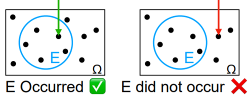
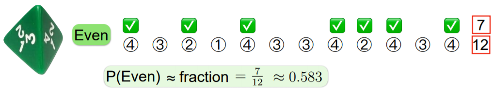
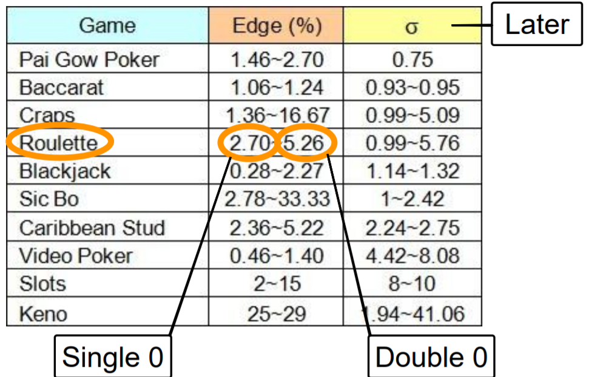

# Topic 5: Probability Introduction

## 5.1 Probability

+ Why probability?
  + something in life are certain
  + most are a less predictable
    + physicians: illness, medication
    + farmers: rain, diet trends
    + investors: stock price, economy
    + advertisers: views, competition
    + consumers: availability, sale
    + students: food line, grade, parents job, date, game

+ Random phenomena
  + give up or reasonintelligently

  <table style="font-family: arial,helvetica,sans-serif; width: 40vw;" table-layout="auto" cellspacing="0" cellpadding="5" border="1" align="center">
    <thead>
    <tr style="font-size: 1.2em;">
      <th style="text-align: center; background-color: #3d64ff; color: #ffffff; width:10%;">Properties</th>
      <th colspan="3" style="text-align: center; background-color: #3d64ff; color: #ffffff; width:20%;">Interests</th>
    </tr>
    </thead>
    <tbody>
    <tr> <th>Learn</th> <td>range</td> <td>average</td> <td>variability</td> </tr>
    <tr> <th>Infer</th> <td>relations</td> <td>structure</td> <td>change</td> </tr>
    <tr> <th>Predict</th> <td>future</td> <td>likelihood</td> <td>guarantees</td> </tr>
    <tr> <th>Benefit</th> <td>understand</td> <td>plan</td> <td>build</td> </tr>
    </tbody>
  </table>

+ Coming to terms
  + as with sets: need terminology
  + discuss
    + concisely
    + precisely
    + effectively
    + process of generating and observing data
    + individual and collection of observations
    + meaning of probability
  + precisely
    + intuitive approach
    + axioms $\gets$ data

+ Experiments
  + probability developed in part to aid science
  + process
    + generate random data
    + observe outcome
  + unified approach
    + applies generally
    + understand
    + analyze
    + generalize
  + generic
    + biology
    + engineering
    + business
    + sociology
  + understand
    + simple examples
    + progress

+ Outcomes and sample space
  + outcomes: possible experiment results
  + sample space: set of possible outcomes, denoted $\Omega, S \text{ or } U$

    <table style="font-family: arial,helvetica,sans-serif; width: 20vw;" table-layout="auto" cellspacing="0" cellpadding="5" border="1" align="center">
      <thead>
      <tr style="font-size: 1.2em;">
        <th style="text-align: center; background-color: #3d64ff; color: #ffffff; width:20%;">Experiment</th>
        <th style="text-align: center; background-color: #3d64ff; color: #ffffff; width:20%;">$\Omega$</th>
      </tr>
      </thead>
      <tbody>
      <tr> <td style="text-align: center;">Coin</td> <td style="text-align: center;">$\{h, t\}$</td> </tr>
      <tr> <td style="text-align: center;">Die</td> <td style="text-align: center;">$\{1, 2, \dots, 6\}$</td> </tr>
      <tr> <td style="text-align: center;">Gender</td> <td style="text-align: center;">$\{m, f\}$</td> </tr>
      <tr> <td style="text-align: center;">Age</td> <td style="text-align: center;">$\Bbb{N}$</td> </tr>
      <tr> <td style="text-align: center;">Temperature</td> <td style="text-align: center;">$\Bbb{R}$</td> </tr>
      </tbody>
    </table>

+ Two sample-space types
  + discrete: finite or countable infinite sample space
    + e.g., $\{h, t\}, \{1, 2, \dots, 6\}, \Bbb{N}, \Bbb{Z}, \{words\}, \{cities\}, \{people\}$
  + continuous: uncountably infinite sample space
    + e.g., $\Bbb{R}, [0, 1], \{\text{temperatures}\}, \underbrace{\{\text{salaries}\}, \{\text{prices}\}}_{\text{upgraded}}$
  + discrete space: easier to understand, visualize, analyze; important; first
  + continuous: important; conceptually harder; later

+ Random outcomes
  + algebra
    + unknown value, denote x $\gets$ lower case
    + e.g., $2x - 4=0$, solution
      + before: $x \in \Bbb{R}$
      + after: $x = 2$
  + probability
    + random value of outcome, denoted by $X$ $\gets$ upper case
    + experiment
      + $X$: coin flip outcome
      + before: $X \in \Omega$
      + after: $X = \begin{cases} \text{h} & \text{get h} \\ \text{t} & \text{get t} \end{cases}$

+ Probability of an outcome
  + the probability, or likelihood, of an outcome $x \in \Omega$, denoted $P(x), \Pr(x)$, or $P(X = x), \Pr(X = x)$, is the fraction of times $x$ will occur when experiment is repeated many times
  + fair coin
    + as \# experiment $\to \infty$, fraction of heads (or tails) $\to 1/2$
    + heads w/ probability $1/2$: $P(h) = 1/2 \quad P(X=h) = 1/2$
    + tails w/ probability $1/2$: $P(t) = 1/2 \quad P(X=t) = 1/2$
  + fair die
    + as \# experiments $\to \infty$, fraction of 1's (or 2,...,6) $\to 1/6$
    + 1 w/ probability $1/6$: $P(1) = 1/6 \quad P(X=1) = 1/6$
  + $P(X)$ or $P(X=x)$: probability of x; fraction of times will occur

+ Probability portrait
  + $n$ experiments
  + $x \in \Omega \quad n_x =$ \# times x appeared

    \[ \Pr(x) = \lim_{n \to \infty} \frac{n_x}{n} \]

    \[\begin{array}{ccccc}
      0 \leq n_x \leq n &\to& 0 \leq \frac{n_x}{n} \leq 1 &\to& 0 \leq p(x) \leq 1 \\\\
      \displaystyle \sum_{x \in \Omega} n_x = n &\to& \displaystyle\sum_{x \in \Omega} \dfrac{n_x}{n} = 1 &\to& \displaystyle\sum_{x\in \Omega} p(x) = 1
    \end{array}\]

+ Probability distribution function
  + $P(x)$: the fraction of times outcome $x$ occurs, e.g., $\Pr(h) = 1/2, \Pr(1) = 1/6$
  + viewed over the whole sample space $\to$ a pattern merges
    + coin: $\Pr(h) = 1/2, \Pr(t) = 1/2$
    + die: $\Pr(1) = 1/6, \dots, \Pr(6) = 1/6$
    + rain: $\Pr(\text{rain}) = 10\%, \Pr(\text{no rain}) = 90\%$
  + Probability distribution function (PDF): $\Pr$ mapping outcome in $\Omega$ to nonnegative values that sum to 1
  
    \[ \Pr: \Omega \to \Bbb{R} , \; \Pr(x) \geq 0 \text{ s.t. } \sum_{x\in \Omega} \Pr(x) = 1 \]

  + sample space $\Omega$ + distribution $P$ = probability space

+ [Original Slides](https://tinyurl.com/y7p67f6u)

### Problem Sets

0. Which of the following outcomes are random (not certain) when rolling a six-sided dice? 
  a. A real number. 
  b. An even number. 
  c. A positive number. 

  Ans: b
  Explanation: The outcome of dice is certainly real and positive, but it may or may not be even, so it is random.

1. Which of the following outcomes are random (not certain) after throwing a six-sided dice? 
  a. Get number  3  
  b. Get an even number 
  c. Get a positive number 

  Ans: ab 
  Explanation
    + True. We may get e.g. 4 as an outcome, which is not 3.
    + True. We may get e.g. 3 as an outcome, which is not even.
    + False. All outcomes of a six-sided dice are positive.

2. Imagine a single experiment where we flip a coin 6 times, and get “head, tail, head, head, head, head”.

  Which of the following statements hold?

  a. The coin is not fair. 
  b. The coin's "tail" probability is 1/6. 
  c. The sequence "head, tail, head, head, head, head" is an outcome in the sample space. 
  d. The sample space of the experiment is {head, tail}. 

  Ans: c
  Explanation
    + False. The outcome is random and the coin may be fair.
    + False. In this experiment 1 out of 6 outcomes was "tail", but the coin's "tail" probability may differ.
    + True. The sample space consists of all sequences of six "head" and "tail", and this is one of them.
    + False. The sample space is a set of tuples  {(head, head, head, head, head, head),(head, head, head, head, head, tail),⋯,(tail, tail, tail, tail, tail, tail)} .

### Lecture Video

 

## 5.2 Distribution Types

+ Uniform probability spaces
  + generally, outcomes may have different probability
    + e.g., Rain: P(rain) = 10%, P(no rain) = 190%
  + uniform (equiprobable) spaces: uniform distribution
    + all outcomes are equally likely
    + $\forall\, x \in \Omega \quad \Pr(x) = p$
    + $1 = \sum_{x \in \Omega} \Pr(x) = \sum_{x \in \Omega} p = |\Omega| \cdot p$
    + $p = 1 / |\Omega|$
  + example
    + $\sum_{x \in \{3,5\}} x^2 = 3^2 + 5^2 = 34$
    + $\sum_{x \in \{3,5\}} x = 3 + 5 = 8$
    + $\sum_{x \in \{3,5\}} p = p + p = 2p$
    + $\sum_{x \in \Omega} p = p + p + \cdots + p = |\Omega|$
    + fair coin: $\Pr(h) = P(t) = p \quad 1 = \Pr(h) + \Pr(t) = 2 \cdot p \quad p = 1/2$
  + drastically simplified probability specification
  + uniform spaces: every outcome w/ probability $1/|\Omega|$
  + all you need to know is $|\Omega|$
  + notation: denoted $U$, drawing uniformly, randomly

+ Example: Fair coin
  + $\Omega = \{ \text{heads}, \text{tails}\} = \{h, t\}$
  + $|\Omega| = 2$
  + flip, or toss
  + equally likely: $U \to \Pr(h) = \Pr(t)$
  + $\Pr(h) = \Pr(t) = \frac{1}{|\Omega|} = \frac{1}{2}$

+ Example: Fair die
  + sample space: $\Omega = \{1, 2, 3, 4, 5, 6\}$
  + $|\Omega| = 6$
  + roll
  + equally likely: $U \to \Pr(1) = \cdots = \Pr(6)$
  + $\Pr(1) = \cdots = \Pr(6) = \frac{1}{\Omega} = \frac{1}{6}$

+ Example: deck of cards
  + sample space: $\Omega = \{ \text{cards }\}$
  + $|\Omega| = 52$
  + draw a card
  + equally likely: $U \to \Pr(3C) = \cdots = \Pr(QH) = \frac{1}{\Omega} = \frac{1}{52}$

+ Non-uniform
  + uniform, equiprobable, spaces, e.g., coin, die, cards
  + in nature, nonuniform spaces around, e.g., rain, grades, words, illnesses, web pages, people, ...
  + example: Pie chart
    + usually non-uniform
    + challenge: non-uniform distribution we can remember
  + example: Tetrahedra die
    + 4-sided, pyramid die
    + used in games, D&D
    + in games die equiprobable
    + assumption: different probabilities
    + easy to remember
      + 4 faces
      + $\Pr(1) = .1, \;\Pr(2) = .2 \;\Pr(3) = .3 \;\Pr(4) = .4$
    + conveniently, add to 1
    + probability distribution

+ Do's and Don'ts
  + random notation may be confusing at first
  + which expressions are valid?
    + valid expression
      + $\Pr(x)$ specify $x$, e.g., for $\forall\, x, \Pr(x) = 1/4$
      + $\Pr(X=3)$ w/ fair die: 1/6
      + $\Pr(3) \stackrel{def}{=} P(X=3)$
    + possible, but less common, make sure it's what you mean
      + $\Pr(1 = 3): 0$
      + $\Pr(X)$: random value
    + even less likely, probably wrong
      + $\Pr(x=3)$

+ [original Slides](https://tinyurl.com/y84vwcva)

### Problem Sets

0. An outcome in a uniform probability space has probability 1/10, what is the size of the sample space? 
  a. 5 
  b. 10 
  c. 20 
  d. None of the above 

  Ans: b

1. Which of the following sample spaces are uniform? 
  a. {land,sea} for a randomly point on a globe 
  b. {odd, even} for a random integer from {1,2,. . . ,100} 
  c. {leap year, non-leap year} for a random year before 2019 
  d. {two heads, two tails, one head and one tail} when flipping two fair coins 
  e. {distance to origin} for a random point in {−3, −1, 1, 3} × {−4, −2, 2, 4} 

  Ans: be 
  Explanation
    + False. About 70% of the times will be "sea".
    + True. Half the time we'll observe even, and half odd.
    + False. "non-leap year" is roughly three times more likely.
    + False. "one head and one tail" is more likely.
    + True. There are four distances, and each shared by 4 of the 16 points.

2. Given an uniform probability space $\Omega = \{1,2,3, \dots ,100\}$, what is the probability that the outcome contains the digit 1 (e.g. 19,91)?

  Ans: 19/100 
  Explanation: There are 20 of them. Note that 11 should not be counted twice.

### Lecture Video

 

## 5.3 Events

+ Events
  + sometimes: care about one particular outcome; examples,
    + our hourse will win race
    + get ready B+ in class
  + usually: interested in a set of possible outcomes; examples,
    + temperature > 98.6 ℉
    + stock close higher
    + pass the course
  + outcome: single element of $\Omega$
  + event: subset of a space $\Omega$
  + analogy
    + social event: set of people
    + probability event: set of outcomes

+ Die events
  + event: subset of sample space $\Omega$
  + Die: $\Omega = \{1, 2, \dots, 6 \} \supseteq$ Events
  + complement

    <table style="font-family: arial,helvetica,sans-serif; width: 50vw;" table-layout="auto" cellspacing="0" cellpadding="5" border="1" align="center">
      <thead>
      <tr style="font-size: 1.2em;">
        <th style="text-align: center; background-color: #3d64ff; color: #ffffff; width:10%;">Set</th>
        <th style="text-align: center; background-color: #3d64ff; color: #ffffff; width:10%;">Name</th>
        <th style="text-align: center; background-color: #3d64ff; color: #ffffff; width:10%;">$\hspace{3em}$</th>
        <th style="text-align: center; background-color: #3d64ff; color: #ffffff; width:10%;">Set</th>
        <th style="text-align: center; background-color: #3d64ff; color: #ffffff; width:10%;">Name</th>
      </tr>
      </thead>
      <tbody>
      <tr> <td style="text-align: center;">$\{1, 2, \dots, 6\}$</td> <td style="text-align: center;">$\Omega$ (certain)</td> <td rowspan="5" style="text-align: center;">$\xrightarrow{\text{Complement}}$</td> <td style="text-align: center;">$\{ \}$</td> <td style="text-align: center;">$\varnothing$</td> </tr>
      <tr> <td style="text-align: center;">$\{2, 4, 6\}$</td> <td style="text-align: center;">Even</td> <td style="text-align: center;">$\{1, 3, 5\}$</td> <td style="text-align: center;">Odd</td> </tr>
      <tr> <td style="text-align: center;">$\{1, 4\}$</td> <td style="text-align: center;">Square</td> <td style="text-align: center;">$\{2, 3, 5, 6\}$</td> <td style="text-align: center;">Non square</td> </tr>
      <tr> <td style="text-align: center;">$\{5, 6\}$</td> <td style="text-align: center;">$> 4, \geq 5$</td> <td style="text-align: center;">$\{1, 2, 3, 4\}$</td> <td style="text-align: center;">$\leq 4, < 5$</td> </tr>
      <tr> <td style="text-align: center;">$\{1, 2, 5\}$</td> <td style="text-align: center;">$\{1, 2, 5\}$</td> <td style="text-align: center;">$\{3, 4, 6\}$</td> <td style="text-align: center;">$\{3, 4, 6\}$</td> </tr>
      </tbody>
    </table>

+ Tetrahedral die

  <table style="font-family: arial,helvetica,sans-serif; width: 18.8vw;" table-layout="auto" cellspacing="0" cellpadding="5" border="1" align="center">
    <tbody>
    <tr> <th style="text-align: center; background: seagreen">Face</th> <td style="text-align: center;">1</td> <td style="text-align: center;">2</td> <td style="text-align: center;">3</td> <td style="text-align: center;">4</td> </tr>
    <tr> <th style="text-align: center; background: seagreen">Probability</th> <td style="text-align: center;">.1</td> <td style="text-align: center;">.2</td> <td style="text-align: center;">.3</td> <td style="text-align: center;">.4</td> </tr>
    </tbody>
  </table>

  <table style="font-family: arial,helvetica,sans-serif; width: 30vw;" table-layout="auto" cellspacing="0" cellpadding="5" border="1" align="center">
    <thead>
    <tr style="font-size: 1.2em;">
      <th style="text-align: center; background-color: #3d64ff; color: #ffffff; width:20%;">Name</th>
      <th style="text-align: center; background-color: #3d64ff; color: #ffffff; width:20%;">Set</th>
    </tr>
    </thead>
    <tbody>
    <tr> <td style="text-align: center;">$\Omega$ (certain)</td> <td style="text-align: center;">$\{1, 2, 3, 4\}$</td> </tr>
    <tr> <td style="text-align: center;">Even</td> <td style="text-align: center;">$\{2, 4\}$</td> </tr>
    <tr> <td style="text-align: center;">Prime</td> <td style="text-align: center;">$\{2, 3\}$</td> </tr>
    <tr> <td style="text-align: center;">$\varnothing$ (null)</td> <td style="text-align: center;">$\{\hspace{0.5em} \}$</td> </tr>
    </tbody>
  </table>

+ Event occurrence  
  an event occurs, or happens, if it contains the observed outcome

    \[ E \;{\color{Magenta}{\text{ occurs }}} \text{ if } X \,{\color{Magenta}{\in}}\, E \]

    

      
    

    <table style="font-family: arial,helvetica,sans-serif; width: 40vw;" table-layout="auto" cellspacing="0" cellpadding="5" border="1" align="center">
      <thead>
      <tr style="font-size: 1.2em;">
        <th rowspan="2" style="text-align: center; background-color: #3d64ff; color: #ffffff; width:10%;">Event</th>
        <th rowspan="2" style="text-align: center; background-color: #3d64ff; color: #ffffff; width:10%;">Subset</th>
        <th colspan="4" style="text-align: center; background-color: #3d64ff; color: #ffffff; width:20%;">Outcome</th>
      </tr>
      <tr style="font-size: 1.2em;">
        <th style="text-align: center; background-color: #3d64ff; color: #ffffff; width:20%;">1</th>
        <th style="text-align: center; background-color: #3d64ff; color: #ffffff; width:20%;">2</th>
        <th style="text-align: center; background-color: #3d64ff; color: #ffffff; width:20%;">3</th>
        <th style="text-align: center; background-color: #3d64ff; color: #ffffff; width:20%;">4</th>
      </tr>
      </thead>
      <tbody>
      <tr>
        <td style="text-align: center;">$\Omega$ (certain)</td> <td style="text-align: center;">$\{1, 2, 3, 4\}$</td>
        <td style="text-align: center; background-color: darkgreen;">&#9745;</td> <td style="text-align: center; background-color: darkgreen;">&#9745;</td>
        <td style="text-align: center; background-color: darkgreen;">&#9745;</td> <td style="text-align: center; background-color: darkgreen;">&#9745;</td>
      </tr>
      <tr>
        <td style="text-align: center;">Even</td> <td style="text-align: center;">$\{2, 4\}$</td>
        <td style="text-align: center; background-color: darkred;">&#9746;</td> <td style="text-align: center; background-color: darkgreen;">&#9745;</td>
        <td style="text-align: center; background-color: darkred;">&#9746;</td> <td style="text-align: center; background-color: darkgreen;">&#9745;</td>
      </tr>
      <tr>
        <td style="text-align: center;">Prime</td> <td style="text-align: center;">$\{2, 3\}$</td>
        <td style="text-align: center; background-color: darkred;">&#9746;</td> <td style="text-align: center; background-color: darkgreen;">&#9745;</td>
        <td style="text-align: center; background-color: darkgreen;">&#9745;</td> <td style="text-align: center; background-color: darkred;">&#9746;</td>
      </tr>
      <tr>
        <td style="text-align: center;">$\varnothing$ (null)</td> <td style="text-align: center;">$\{\hspace{0.5em}\}$</td>
        <td style="text-align: center; background-color: darkred;">&#9746;</td> <td style="text-align: center; background-color: darkred;">&#9746;</td>
        <td style="text-align: center; background-color: darkred;">&#9746;</td> <td style="text-align: center; background-color: darkred;">&#9746;</td>
      </tr>
      </tbody>
    </table>

+ Event probability
  + $\Pr(E)$: probability of event $E$
  + $\Pr(X \in E)$: probability that $E$ occurs
  + fraction of experiments where $E$ occurs, as \# experiments grows

    

      
    

  + task: $\Pr(E)$ = fraction
    + \# experiments 12 $\to \infty$
    + general distributions and events

+ $\Pr(X) \to \Pr(E)$
  + related probability of event to probability of its elements (outcomes)
  + general event $E$
    + \# times E occurs = sum of \# times its elements occur

    \[\begin{align*}
      \Pr(E) &= \text{ fraction of times $E$ occurs} \\
      &= \text{ sum of fraction of times its elements occur} \\
      &= \text{ sum of its element probabilities} \\\\
      \Pr(E) &= \Pr(X \in E) = \sum_{x \in E} \Pr(x)
    \end{align*}\]

  + example: Tetrahedral die
    + \# times Event occurs = sum of \# times 2 and 4 occur
    + Pr(Even) = fraction of times Even occurs = sum of fraction of times 2 and 4 = Pr(2) + Pr(4)

    <table style="font-family: arial,helvetica,sans-serif; width: 50vw;" table-layout="auto" cellspacing="0" cellpadding="5" border="1" align="center">
      <thead>
      <tr style="font-size: 1.2em;">
        <th rowspan="2" style="text-align: center; background-color: #3d64ff; color: #ffffff; width:20%;">Event</th>
        <th rowspan="2" style="text-align: center; background-color: #3d64ff; color: #ffffff; width:20%;">Subset</th>
        <th style="text-align: center; background-color: #3d64ff; color: #ffffff; width:10%;">1</th>
        <th style="text-align: center; background-color: #3d64ff; color: #ffffff; width:10%;">2</th>
        <th style="text-align: center; background-color: #3d64ff; color: #ffffff; width:10%;">3</th>
        <th style="text-align: center; background-color: #3d64ff; color: #ffffff; width:10%;">4</th>
        <th style="text-align: center; background-color: #3d64ff; color: #ffffff; width:30%;">$\Pr(E)$</th>
      </tr>
      </thead>
      <tbody>
      <tr>
        <td style="text-align: center;">$\Omega$ (certain)</td> <td style="text-align: center;">$\{1, 2, 3, 4\}$</td>
        <td style="text-align: center; background-color: darkgreen;">&#9745;</td> <td style="text-align: center; background-color: darkgreen;">&#9745;</td>
        <td style="text-align: center; background-color: darkgreen;">&#9745;</td> <td style="text-align: center; background-color: darkgreen;">&#9745;</td>
        <td style="text-align: center;">$.1+.2+.3+.4 =1$</td>
      </tr>
      <tr>
        <td style="text-align: center;">Even</td> <td style="text-align: center;">$\{2, 4\}$</td>
        <td style="text-align: center; background-color: darkred;">&#9746;</td> <td style="text-align: center; background-color: darkgreen;">&#9745;</td>
        <td style="text-align: center; background-color: darkred;">&#9746;</td> <td style="text-align: center; background-color: darkgreen;">&#9745;</td>
        <td style="text-align: center;">$.2+.4 =.61$</td>
      </tr>
      <tr>
        <td style="text-align: center;">Prime</td> <td style="text-align: center;">$\{2, 3\}$</td>
        <td style="text-align: center; background-color: darkred;">&#9746;</td> <td style="text-align: center; background-color: darkgreen;">&#9745;</td>
        <td style="text-align: center; background-color: darkgreen;">&#9745;</td> <td style="text-align: center; background-color: darkred;">&#9746;</td>
        <td style="text-align: center;">$.2+.3 =.5$</td>
      </tr>
      <tr>
        <td style="text-align: center;">$\varnothing$ (null)</td> <td style="text-align: center;">$\{\hspace{0.5em}\}$</td>
        <td style="text-align: center; background-color: darkred;">&#9746;</td> <td style="text-align: center; background-color: darkred;">&#9746;</td>
        <td style="text-align: center; background-color: darkred;">&#9746;</td> <td style="text-align: center; background-color: darkred;">&#9746;</td>
        <td style="text-align: center;">$0$</td>
      </tr>
      </tbody>
    </table>

+ Uniform spaces
  + equiprobable spaces
  + simple formula for probability of
    + outcome: $\Pr(x) = 1/|\Omega|$
    + event

      \[ \Pr(E) = \sum_{x \in E} \Pr(x) = \sum_{x \in E} \dfrac{1}{|\Omega|} = \dfrac{\sum_{x \in E} 1}{|\Omega|} = \frac{|E|}{|\Omega|} \]

  + example: die
    + $\Omega = \{1, 2, 3, 4, 5 6\} \to |\Omega| = 6$

    <table style="font-family: arial,helvetica,sans-serif; width: 40vw;" table-layout="auto" cellspacing="0" cellpadding="5" border="1" align="center">
      <thead>
      <tr style="font-size: 1.2em;">
        <th style="text-align: center; background-color: #3d64ff; color: #ffffff; width:10%;">Event</th>
        <th style="text-align: center; background-color: #3d64ff; color: #ffffff; width:10%;">Set</th>
        <th style="text-align: center; background-color: #3d64ff; color: #ffffff; width:10%;">$|Event|$</th>
        <th style="text-align: center; background-color: #3d64ff; color: #ffffff; width:20%;">$\Pr(Event) = \frac{|Event|}{6}$</th>
      </tr>
      </thead>
      <tbody>
      <tr> <td style="text-align: center;">Even</td> <td style="text-align: center;">$\{2, 4, 6\}$</td> <td style="text-align: center;">3</td> <td style="text-align: center;">3/6 = 1/2</td> </tr>
      <tr> <td style="text-align: center;">Square</td> <td style="text-align: center;">$\{1, 4\}$</td> <td style="text-align: center;">2</td> <td style="text-align: center;">2/6 = 1/3</td> </tr>
      </tbody>
    </table>

+ Dos and Don'ts
  + Valid expression
    + $\Pr(X \in \text{ Even})$: die - $\Pr(X \in \{2, 4, 6\}= 3/6 = 1/2$
    + $\Pr(\text{ Even }) \,\stackrel{def}{=} \Pr(X \in \text{ Even })$
  + less likely
    + $\Pr(3 \in \text{ Even }) = 0$
      + 3 is a (constant) random variable, so possible
      + the r.v. 3 is never in Even, so probability is 0
    + $\Pr( 4 \in \text{ Even }) = 1$
      + less common
      + check that you meant it
  + unlikely: $\Pr( x \in \text{ Even })$
    + previous anomaly on steriods, what is x?
    + $\forall\, x \in \{3, 7\}, \Pr(x \in \text{ Even })=0$, double check meant it

+ [Original Slides](https://tinyurl.com/y8rpqaq6)

### Problem Sets

0. What is the probability of drawing a Red Ace from a standard deck of cards? 
  a. 1/52 
  b. 2/52 
  c. 4/52 
  d. None of the above 

  Ans: b  
  Explanation: Both "heart ace" and "diamond ace" are "red ace". Since the sample space is uniform, the answer is 2/52.

1. Which of the following holds for every event A? 
  a. $P(A) \geq 0$ 
  b. $P(A) \leq1$ 
  c. $P(A)+P(A^c)=1$ 
  d. $P(A)=P(A^c)$ 
  e. $A=\varnothing \implies P(A)=0$ 
  f. $P(A)=0 \implies A=\varnothing$ 
  
  Ans: abce 
  Explanation
    + True. $0 \leq P(A) \leq 1$.
    + True. Same as above.
    + True.
    + False.
    + True. Note that $A \cap \varnothing = \varnothing, A \cup \varnothing = \varnothing$ for any $A$. $P(A)=P(A \cup \varnothing) = P(A)+P(\varnothing)$, hence $P(\varnothing)=0$.
    + False. Suppose a uniform sample space $\Omega$  has infinite number of elements. Then for some events  A  with finite size (i.e. $|A|$ is finite ), $P(A)=|A|/|Ω|$.

2. Which of the following always hold for events  A  and  B ? 
  a. $A \subseteq B \implies P(A) \leq P(B)$ 
  b. $P(A) \leq P(B) \implies A \subseteq B$ 

  Ans: a 
  Explanation:
    + True.
    + False. Let  A  be the event of getting a head from a tossed coin, and B be the event of getting a tail.  P(A)=P(B)=12 , but A⊈B.

3. Which of the following implies  P(S−T)=P(S)−P(T)  for events  S  and  T ? 
  a. $T \subseteq S$ 
  b. $T \subset S$ 
  c. $S = T$ 
  d. $S \subseteq T$ 

  Ans: abc 
  Explanation:
    + Note that $P(S−T) = P(S \cup T)−P(T) .
    + When $T \subseteq S$, $T \subset S$, and $S=T$, we have $S \cup T=S$, hence $P(S−T)=P(S)−P(T)$.
    + When $S \subseteq T$, we have $S \cup T=T$, hence $P(S−T)=0$.

4. 50% of UCSD students play soccer, 40% play basketball, and 30% play both. What is the probability that a random UCSD student does not play any of the two games. 
  a. 0 
  b. 0.1 
  c. 0.4 
  d. 0.6 

  Ans: c 
  Explanation: Let $A$ be the event that a student play soccer, $B$ be the event that a student play basketball. Then $A \cap B$ is the event that a student play both. We already know $P(A)=0.5, P(B)=0.4, P(A \cap B)=0.3$, hence $P(A \cup B) = P(A)+P(B)−P(A∩B)=0.6$. The probability that a random UCSD student does not play any of the two games is $1 − P(A \cup B)=0.4$.

5. Which of the following are events in the sample space $\Omega = \{1,2,3,4,5\}$? 
  a. $\{1,2,3\}$ 
  b. $\varnothing$ 
  c. $\Omega$ 
  d. $\{1\}$ 
  e. $\{0,3,4\}$ 

  Ans: abcd 
  Explanation
    + True.
    + True.
    + True.
    + True.
    + False. {0,3,4} is not a subset of $\Omega$.

6. For the uniform space  {1,2,…,10} , find: 
  a. $P(\{\text{primes}\})$, 
  b. $P(\{\text{multiples of 3}\})$. 

  Ans: a. (0.4); b. (0.3) 
  Explanation
    + $\{\text{primes}\}=\{2,3,5,7\}$. Its probability is $P(\{\text{primes}\}) = |\text{primes}||Ω|=2/5$.
    + $\{\text{primes}\}=\{3,6,9\}$. Its probability is $P(\{\text{multiples of 3}\}) = |\text{multiples of 3}||Ω|=3/10$.

7. A bag contains 5 red and 3 blue balls. 
  a. Pick one ball at random and observe its random color. What is the size of the color sample space. 
  b. What is P(blue)? 
  c. Two balls added to the bag and now P(blue)=0.4. How many of the two balls are blue? 
  d. Two balls are removed from the original bag and now P(blue)=0.5. How many of the two balls were blue? 

  Ans: a. (2); b. (3/8); c. (1); d. (0) 
  Explanation:
    + The sample space is $\{Red ,Blue\}$.
    + $\frac{|\{\text{blue}\}|}{|Ω|} = 3/8 = 0.375$.
    + If $a$ blues balls are added, $P(\text{blue}) = \frac{3+a}{8+2}=0.4$. Hence $a=1$.
    + If $a$ blues balls are removed, $\frac{3−a}{8−2} = 0.5$. Hence $a=0$.

8. Six balls are numbered 1, 2, 3, 4, 5, and 6. What is the chance that the numbers on three balls, picked simultaneously and randomly, will sum to a multiple of 3? 
  a. 1/3 
  b. 1/4 
  c. 2/5 
  d. 4/15 

  Ans: c 
  Explanation: The number of ways to pick 3 balls is $\tbinom{6}{3}=20$. 8 of them have their sum as a multiple of 3.

9. A standard poker deck has 52 cards, of 13 ranks $\{A,2, \dots ,10,J,Q,K\}$  and 4 suits $\{diamonds,clubs,hearts,spades\}$. What is the probability that a hand of five cards contains:
  a. a queen of hearts,
  b. at least one queen,
  c. at least one heart?

  Ans: a. (5/52); b. (0.3412); c. (0.7785) 
  Explanation:
    + The probability that there's no queen of hearts is $\tbinom{51}{5}/\tbinom{52}{5}=47/52$. Thus the probability that there's a queen of hearts is $1−47/52=5/52$.
    + Similar to above, probability that there's no queen is $\tbinom{48}{5}/\tbinom{52}{5}=0.65884$. Thus the probability that there's a queen is $1−0.65884=0.34115$.
    + Following the same principle, probability that there's a hearts is $1−\tbinom{39}{5}/\tbinom{52}{5}=0.7785$.

### Lecture Video

 

## 5.4 Repeated Experiments

+ Composite experiments
  + experiments often consist of several parts
    + student: major, year, GPA
    + Advertisement: product, audience, cost
  + still viewed as a single experiment $\to$ outcomes more complex
    + 3-tuple: (CS, senior, 3.8), (book, teenage, $9.99)
    + sample space: Cartesian product
  + goal: combine simple, analyze complex

+ Independent repetitions
  + repetition
    + all experiments of same type
    + examples: daily temperatures, daily stock price, coin flips, die rolls, card draws
  + independent
    + different components unrelated
    + examples: first coin heads
      + second coin 50% heads / tails (independent)
      + second coin more likely heads (dependent)

+ Example: two coins
  + fair, independent flips
  + outcomes
    + coin 1 = {h, t}, coin 2 = {h, t}
    + $\Omega = \{hh, ht, th, tt\} = \{h, t\}^2$
  + probability
    + coin 1: $\Pr(\{h\}) = 1/2, \;\Pr(\{t\}) = 1/2$
    + coin 2: $\Pr(\{h\}) = 1/2, \;\Pr(\{t\}) = 1/2$
    + $\Pr(\{h, h\}) = 1/4, \;\Pr(\{h, t\}) = 1/4, \;\Pr(\{t, h\}) = 1/4, \;\Pr(\{t, t\}) = 1/4$
    + Cartesian power: $|\Omega| = 2^2 = 4$
    + 1 coin w/ $U \to$ 2 coins w/ $U$

    \[ \Pr(\text{hh}) = \Pr(\text{ht}) = \Pr(\text{th}) = \Pr(\text{tt}) = 1/|\Omega| = 1/4 \]

+ Example: two dice
  + fair, independent experiments
  + outcome: 
    + dice 1 = {1, 2, ..., 6}, dice 2 ={1, 2, ..., 6}
    + two dice: $\Omega = \{11, 12, \dots, 66\} = \{1, \dots, 6\} \to |\Omega| = 6^2 = 36$
  + probability
    + die 1: $\Pr(1) = \Pr(2) = \cdots = \Pr{6} =1/6$
    + die 2: $\Pr(1) = \Pr(2) = \cdots = \Pr{6} =1/6$
    + two dice: $\Pr(11) = \Pr(12) = \cdots = \Pr(66) = 1/36$
    + 1 die w/ $U \to$ 2 dice w/ $U$
    + $\Pr(11) = \Pr(12) = \Pr(21) = \cdots = \Pr(66) = 1/|\Omega| = 1/36$

+ Events
  + probability of event

    \[ \Pr(E) = \Pr(X \in E) = \sum_{x \in E} \Pr(x) \]

  + uniform space: $U \to \Pr(E) = |E|/|\Omega|$
  + example: 2 coins
    + $|\Omega| = 2^2 = 4$
    + $\Pr(\text{ Different outcomes }) = \Pr(\{\text{hh, tt} \}) = 2/|\Omega| = 2/4 = 1/2$
    + $\Pr(\text{ At least one h}) = \Pr(\{\text{ ht, th, hh }\}) = 3/|\Omega| = 3/4$
  + example: 3 coins
    + $|\Omega| = 2^3 = 8$
    + $\Pr(\text{ Alternating }) = \Pr(\{\text{ hth, tht }\}) = 2/8 = 1/4$
    + $\Pr(\text{ odd # h's }) = \Pr(\{\text{ htt, tht, tth, hhh }\}) = 4/8 = 1/2$

+ Sampling
  + many sources of randomness, e\.g., coin, die, ...
  + often sample (select) physical objects
    + patients in a study
    + customers at a restaurant
    + products for quality control
    + visitors to web pages
    + cards from a deck
    + balls from a urn
  + two sampling types: with or without replacement

+ Replacement
  + sequentially select physical objects
  + with replacement
    + replace (reuse) selected element
    + outcomes can repeat
    + experiments often independent
    + e.g., coins, dice
  + without replacement
    + do not replace (reuse) selected element
    + outcomes cannot repeat
    + experiments dependent
    + cf. difference largest for small $\Omega$

+ Sampling (selection) With / Without differences
  + __with__ replacement
    + repeat as if from scratch
    + same element able to be selected again
    + example: coin, die
  + __without__ replacement
    + repeat w/ smaller set
    + same element unable to be selected again
    + example: cards, people

+ Example: balls in a jar with replacement
  + activity
    + 1 yellow and 1 blue ball in a jar
    + pick one ball and then replace it
    + pick again
  + selection with replacement
  + second selection - from original set
  + outcome: $\Omega = \{\text{ yy }, \,\text{ yb }, \,\text{ by }, \,\text{ bb } \}$
  + probabilities
    + $|\Omega| = 4$
    + uniform space: $U \to \Pr(\text{ yy }) = \Pr(\text{ yb }) = \Pr(\text{ by }) = \Pr(\text{ bb }) = 1/4$

+ Example: balls in a jar without replacement
  + activity
    + 1 yellow and 1 blue ball in a jar
    + pick one ball and do not replace it
    + pick again
  + outcomes: $\Omega = \{\text{ yb }, \,\text{ by } \}$
  + selection without replacement
  + second selection - from a subset
  + probabilities
    + $\Pr(\text{ yy }) = \Pr(\text{ bb }) = 0, \;\Pr(\text{ yb }) = \Pr(\text{ by }) = 1/2$
    + $|\Omega| = 2$

+ Example: drawing cards
  + six cards: $\Omega = \{1, 2, 3, 4, 5, 6\}$
  + activity
    + draw one
    + w/o replacement, draw a second
  + outcomes
    + $\Omega = \{12, \dots, 16, 21, \dots, 26, \dots, 65\} =(6]^{\underline{2}} \gets$ 2-permutations of {1,2, ..., 6}
    + $|\Omega| = 6^{\underline{2}} = 6 \cdot 5 = 30$
  + probabilities
    + $i = j$ unable to happen
    + $i\neq j, \; \Pr(i, j) = 1/6 \cdot 1/5 = 1/30$
    + $\Pr(i, j) = 1/|\Omega| = 1/30$

+ Replacement summary
  + 2 selections

    <table style="font-family: arial,helvetica,sans-serif; width: 58vw;" table-layout="auto" cellspacing="0" cellpadding="5" border="1" align="center">
      <thead>
      <tr style="font-size: 1.2em;">
        <th style="text-align: center; background-color: #3d64ff; color: #ffffff; width:15%;"></th>
        <th style="text-align: center; background-color: #3d64ff; color: #ffffff; width:10%;">Original</th>
        <th style="text-align: center; background-color: #3d64ff; color: #ffffff; width:15%;">with replacement</th>
        <th style="text-align: center; background-color: #3d64ff; color: #ffffff; width:15%;">without replacement</th>
      </tr>
      </thead>
      <tbody>
      <tr>
        <td style="text-align: center;">Description</td>
        <td style="text-align: center;"></td>
        <td style="text-align: center;">outcomes can repeat</td>
        <td style="text-align: center;">outcomes cannot repeat</td>
      </tr>
      <tr>
        <td style="text-align: center;">Sample space</td>
        <td style="text-align: center;">$\Omega_1$</td>
        <td style="text-align: center;">$\{(x, y): x, y \in \Omega_1 \} = \Omega_1^2$</td>
        <td style="text-align: center;">$\{(x, y): x, y \in \Omega_1, x \neq y \} = \Omega_1^{\underline{2}}$</td>
      </tr>
      <tr>
        <td style="text-align: center;">| Sample space |</td>
        <td style="text-align: center;">$|\Omega_1|$</td>
        <td style="text-align: center;">$|\Omega_1^2|$</td>
        <td style="text-align: center;">$|\Omega_1^{\underline{2}}| = |\Omega_1| \cdot (|\Omega_1| - 1)$</td>
      </tr>
      </tbody>
    </table>

  + probabilities if original sample space uniform

    <table style="font-family: arial,helvetica,sans-serif; width: 50vw;" table-layout="auto" cellspacing="0" cellpadding="5" border="1" align="center">
      <thead>
      <tr style="font-size: 1.2em;">
        <th style="text-align: center; background-color: #3d64ff; color: #ffffff; width:10%;"></th>
        <th style="text-align: center; background-color: #3d64ff; color: #ffffff; width:10%;">Original</th>
        <th style="text-align: center; background-color: #3d64ff; color: #ffffff; width:20%;">with replacement</th>
        <th style="text-align: center; background-color: #3d64ff; color: #ffffff; width:20%;">without replacement</th>
      </tr>
      </thead>
      <tbody>
      <tr>
        <td style="text-align: center;">Uniformity</td>
        <td style="text-align: center;">Uniform</td>
        <td style="text-align: center;">Uniform</td>
        <td style="text-align: center;">Uniform</td>
      </tr>
      <tr>
        <td style="text-align: center;">$\Pr(\text{ element })$</td>
        <td style="text-align: center;">$1 / \Omega_1$</td>
        <td style="text-align: center;">$1 / |\Omega_1|^2$</td>
        <td style="text-align: center;">$1 / \left(|\Omega_1| \cdot (|\Omega_1| - 1) \right)$</td>
      </tr>
      </tbody>
    </table>

+ Order not matter
  + order matters: card $\Pr(5) = 1/6 \to \Pr(3) = 1/5$, stock $10 \to 50 \neq 50 \to 10$
  + sometimes order not matter: voting order in elections
  + when order not matter
    + tuple of outcome $\to$ set of outcomes
    + (2, 5), (5, 2) $\to$ {2, 5} $\implies$ Event {(2, 5), {5, 2)}}
    + (4, 4) $\to$ {4, 4}
  + $\to$: order matter, easier to calculate
  + $\gets$ order not matter, considering w/ & w/o replacement

+ order consideration with replacement
  + 2 cards $\in \{1, \dots, 6\}$ w/ replacement
  + equivalently, 2 dice
  + order
    + $\gets$, matter:
      + $\Pr(1, 1) = \Pr(1, 2) = \cdots = \Pr(6, 5) = \Pr(6, 6) = 1/36$
      + remaining uniform
    + $\to$, not matter
      + $\Pr(\{1, 2\}) = \Pr(\{(1, 2), (2,1)\}) = \Pr(1, 2) + \Pr(2, 1) = 2/36$
      + $\Pr(\{1, 1\}) = \Pr(1, 1) = 1/36$
      + not uniform
  + sanity check
    + $\sum$ Probabilities = 1
    + e.g., $\binom{6}{2} \cdot \frac{2}{36} + \binom{6}{1} \cdot \frac{1}{36} = \frac{5}{6} + \frac{1}{6} = 1$

+ Order consideration w/o replacement
  + 2 cards $\in \{1, \dots, 6\}$ sequentially w/o replacement
  + order:
    + $\gets$, matter:
      + $i \neq j, \,\Pr(i, j) = 1/6 \cdot 1/5 = 1/30$
      + remaining unifrom
    + $\to$, not matter:
      + $\Pr(\{1, 2\}) = \Pr(\{(1, 2), (2, 1)\}) = \Pr(1, 2) + \Pr(2, 1) = 2/30$
      + $\{1, 1\}$ not happened
      + remaining uniform
  + sanity check
    + probabilities sum to 1
    + $\binom{[6]}{2} \cdot \frac{2}{30} = 1$
  + alternative calculation
    + select both cards simultaneously
    + $\Omega = \{\{1, 2\}, \{1, 3\}, \dots, \{5, 6\}\} = \binom{[6]}{2}$
    + $|\Omega| = \binom{[6]}{2} = 15$, uniform space
    + $\Pr(\{1, 2\}) = 1/15$
    + sequential simultaneous same

+ Example: poker hand probabilities
  + deck: 52 cards, hand: 5 cards
  + $\Omega = \{\text{ possible hands } \} = \{\{2\heartsuit, 4\heartsuit, J\heartsuit, 4\heartsuit, 9\heartsuit\}, \{4\diamondsuit, 5\heartsuit, 6\clubsuit, 7\clubsuit, 8\spadesuit\}, \dots\}$
  
    \[\begin{align*}
      & \;{\color{Grey}{\approx 50 \cdot 50 \cdot 10 \cdot 100 = 2.5 \text{ M }}} \\
      |\Omega| = \binom{52}{5} = \frac{52!}{5! \cdot 47!} = \frac{52 \cdot 51 \cdot 50 \cdot 49 \cdot 48}{5 \cdot 4 \cdot 3 \cdot 2 \cdot 1} &= 2,598,960 \approx 2.6 \text{ million}
    \end{align*}\]
  + all hands equally likely $\to$ equiprobable
  + $\Pr(\{2\spadesuit, 4\clubsuit, A\diamondsuit, A\heartsuit, A\spadesuit\}) \stackrel{U}{\approx} 1/2.6 \text{ M }$

+ [Original Slides](https://tinyurl.com/yape5urh)

### Problem Sets

0. Which of the following are independent repetitive experiments? 
  a. card draws with replacement 
  b. card draws without replacement 
  c. neither 

  Ans: a 
  Explanation: Card draws with replacement will be independent repetitive experiments.

1. You have two fair coins. If you flip a head with the first coin, what is the probability of flipping a head with the second? 
  a. \(1\) 
  b. \(0\) 
  c. \(\frac{1}{2}\) 
  d. \(\frac{1}{4}\) 

  Ans: c 
  Explanation: Flipping the first and the second coin are independent.

2. A bag has 3 red and 3 green apples. You start by randomly selecting one red apple from the bag. Which of the following has the highest probability? 
  a. Select another red apple after replacing the first. 
  b. Select another red apple without replacing the first. 
  c. Select a green apple after replacing the first red apple. 
  d. Select a green apple without replacing the first red apple. 

  Ans: d 
  Explanation:
    + After replacement, there are 3 green and 3 red apples. The probability to select a red one is $\frac{1}{2}$.
    + Without replacement, there are 3 green and 2 red apples. The probability to select a red one is $\frac{2}{5}$ .
    + After replacement, there are 3 green and 3 red apples. The probability to select a red one is \frac{1}{2}$.
    + Without replacement, there are 3 green and 2 red apples. The probability to select a red one is \frac{3}{5}$.

3. Roll two fair and distinguishable six-sided dice. What is the probability that the outcome of the second die is strictly greater than the the first?

  Ans: 5/12 
  Explanation: The outcomes that give rise to this event are $(1,2),(1,3), \dots,(1,6), (2,3),(2,4), \dots,(2,6),(3,4),\dots,(3,6),(4,5),(4,6),(5,6)$, where in each ordered pair, the numbers correspond to the first and second die respectively. It can be easily verified that there are  15  such outcomes, each of probability 1/36, thus 15×1/36=5/12.

4. 5 Engineers and 3 artists align at random along line. What is the probability that the first and last are Engineers? 
  a. 3/14 
  b. 8/16 
  c. 9/14 
  d. 5/14 

  Ans: d 
  Explanation
    + The 5 engineers and 3 artists can line up in $\tbinom{8}{3}$ ways, each corresponding to one choice of the the 3 artist locations out of the total 8. Note that all these arrangements are equally likely, hence this space is uniform.
    + If the first and last are engineers, then there are 6 locations left, and the number of ways to choose the locations of the artists is $\tbinom{6}{3}$.
    + Hence the probability that the first and last are engineers is $\tbinom{6}{3}/\tbinom{8}{3}=6⋅5⋅4/8⋅7⋅6=5/14$.
    + In the sequential probability section we will see an easier way to find the answer.

5. Which of the following are distributed uniformly when rolling two fair dice? 
  a. The outcome (number) of the first die, e.g., "4", or "6", 
  b. The ordered pair of outcomes, e.g., \((1,3)\), \((3,1)\), or \((6,6)\), 
  c. The unordered pair of outcomes, e.g., \(\{1,3\}\) or \(\{6,6\}\), 
  d. the difference between the first and second outcomes, e.g. \((1,3)\to-2\), 
  e. the difference between the first and second outcomes mod 6, e.g. \((1,3)\to(-2)_6=4\), 
  f. The absolute value of difference\((1,3)\to|1-3|=2\), 
  g. The lower of the two outcomes, e.g. \((1,3)\to1\), 
  h. the sum of the two outcomes, e.g. \((1,3)\to4\). 

  Ans: abe 
  Explanation
    + True.
    + True.
    + False. $P(\{1,3\})=236 \neq P(\{6,6\})=136$.
    + False. $P(\text{difference is 0})=\frac{6}{36} \neq P(\text{difference is 1})=\frac{5}{36}$.
    + True.
    + False. $P(\text{absolute difference is 0})=\frac{6}{36} \neq P(\text{absolute difference is 1})=\frac{10}{36}$.
    + False.  

### Lecture Video

 

## 5.5 Games of Chance

+ Roulette
  + basics
    + history
      + where: France
      + time: 17th century
      + who: Blaise Pascal
      + letter wheel
    + wheel: integers from 1 to 36 and 0
    + spin wheel and a ball
    + bet on where ball will land
  + bets: place one token bet and return
    + number: 36
    + red, black, even, odd, low, high: 2
    + 1-12, 13-24, 25-36, $(x)_3 =0, (x)_3 = 1, (x)_3 = 2$: 3

+ Probabilities
  + individual outcomes
    + $\Omega = \{0, 1, \dots, 36\} \to |\Omega| = 37$
    + $\Pr(0) = \Pr(1) = \cdots = \Pr(36) = \frac{1}{|\Omega|} = \frac{1}{37} \gets$  should be 1/36 but 1/37 because of 0
  + events
    + Even = {2, 4,..., 36} $\to |\text{Even}| = 18 \to \Pr(\text{Even}) = \frac{|\text{Even}|}{|\Omega|} = \frac{18}{37} \gets$ should be half but slightly smaller because of 0
    + $|\text{Odd}| = |\text{Red}| = |\text{Black}| = |\text{1 to 18}| = |\text{19 to 36}| = 18 \to \Pr(\dots) = 18/37$
    + $|\text{1 to 12}| = \cdots = |(x)_3 = 0| = 12 \to \Pr(\dots) = 12/37$
  
+ Win or lose?
  + how much can you expect to make on Roulette?
    + one game: random
    + many games: more predictable
  + expected profit or loss
  + simplicity: each bet $1
  + evaluate two bet types
    + single-number bets
      + always bet on single number, e.g., 6
      + \# games: $n \gg 1$
      + bet: 1 each game $\to$ total n
      + get: correct $\approx \frac{n}{37}$ games $\to$ 36 each $\to$ total = $\frac{36}{37}n$
      + gain: $\frac{36}{37}n - n = -\frac{1}{37}n$
      + lose: &cent;2.7/bet = 2.7% $\gets$ house edge (advantage)
    + bet red
      + always bet red
      + \# games: $n \gg 1$
      + bet: 1 each game $\to$ total = n
      + get: correct $\frac{18}{37}n$ games $\to$ 2 each $\to$ total = $\frac{36}{37}n$
      + gain: $\frac{36}{37}n - n = -\frac{1}{37}n$
      + house edge $\approx 2.7\%$

+ House edge in other games

  

    
  

  

+ [Original Slides](https://tinyurl.com/ybolxett)

### Problem Sets

### Lecture Video

 

## 5.6 Axiomatic Formulation

### Problem Sets

### Lecture Video

 

## 5.7 Inequalities

### Problem Sets

### Lecture Video

 

## Lecture Notebook 5

## Programming Assignment 5

