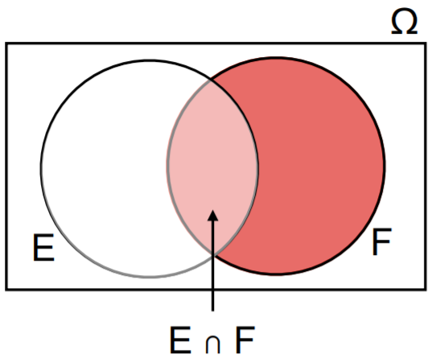

# Topic 6: Conditional Probability

## 6.1 Conditional Probability

+ Motivation
  + often having partial information about the world
  + modifying event probabilities
    + unemployment numbers $\to$ stock prices
    + LeBron James injured $\to$ Cavaliers game result
    + sunny weekend $\to$ beach traffic
  + importance
    + improving estimates
    + helping determine original unconditional probabilities

+ Intuitive definition
  + $E, F$: events
  + $\Pr(F \,|\, E)$ = probability that $F$ happens given that $E$ happened 
    $\hspace{4em}$ = fraction pf $E$ occurrences that F also occurs
  + e.g., Even = {2, 4, 6}, $\Pr(2 |\text{ Even }) = \frac{2}{6} = \frac{1}{3}$

+ Example: fair die
  + $\Pr(\{4\}) = \Pr(4) = 1/6$
    + $\Pr( 4 \,|\, \geq 3) = \Pr(4 \,|\, \{3, 4, 5, 4\}) = \tfrac{1}{4}$
    + $\Pr(4 \,|\, \leq 3) = \Pr(4 \,|\, \{1, 2, 3\}) = \tfrac{0}{3} = 0$
  + $\Pr(\leq 2) = \Pr(\{1, 2\}) = 1/3$
    + $\Pr(\leq 2 \,|\, \leq 4) = \Pr(\{1, 2\} \,|\, \{1, 2, 3, 4\}) = \frac{2}{4} = \frac{1}{4}$
    + $\Pr(\leq 2 \,|\, \geq 2) = \Pr(\{1, 2\} \,|\, \{2, 3, 4, 5, 6\}) = \frac{1}{5}$

+ General events - uniform spaces
  
  \[\begin{align*}
    \Pr(F \,|\, E) & = \Pr(X \in F \,|\, X \in E) = \Pr(X \in E \wedge X \in F \,|\, X \in E) \\
    &= \Pr(X \in E \cap F \,|\, X \in X \in E) = \Pr(E \cap F \,|\, E) \\
    &= \frac{|E \cap F|}{|E|}
  \end{align*}\]

  + example: fair die again
    + $\Pr(\text{ Prime } \,|\, \text{ Odd }) = \Pr(\{2, 3, 5\} \,|\, \{1, 3, 5\}) = \frac{|\{2, 3, 5\} \cap \{1, 3, 5\}|}{|\{1, 3, 5\}|} = \frac{|\{3, 5\}|}{|\{1, 3, 5\}|} = \frac{2}{3}$
    + $\Pr(\{4\} \,|\, \text{ Prime}) = \Pr(\{4\} \,|\, \{2, 3, 5\}) = \frac{|\{4\} \cap \{2, 3, 5\}|}{|\{2, 3, 5\}|} = \frac{|\varnothing|}{|\{2, 3, 5\}|} = 0$

+ General spaces
  
  \[\begin{align*}
    \Pr(F \,|\, E) &= \Pr(X \in F \,|\, X \in E) \\
      &= \Pr(X\in E \cap X \in F \,|\, X \in E) = \Pr(X \in E \cap F \,|\, X \in E) \\
      &= \frac{n \cdot \Pr(E \cap F)}{n \cdot \Pr(E)} = \frac{\Pr(E \cap F)}{\Pr(E)}
  \end{align*}\]

  + example: Tetrahedral die = 4-sided die

    \[\begin{align*}
      \Pr(\geq 2 \,|\, \leq 3) &= \frac{\Pr(\geq 2 \cap \leq 3)}{\Pr(\leq 3)} = \frac{\Pr(\{2, 3, 4\}) \cap \{1, 2, 3\})}{\Pr(\{1, 2, 3\})} \\
      &= \frac{\Pr(\{2, 3\})}{\Pr(\{1, 2, 3\})} = \frac{.5}{.6} = \frac{5}{6}
    \end{align*}\]

+ Product rule

  \[ \Pr(F \,|\, E) = \frac{\Pr(E \cap F)}{\Pr(E)}  \to \Pr(E \cap F) = \Pr(E) \cdot \Pr(F \,|\, E) \]

  + example: probability of both red?
    + urn: 1 blue, 2 reds
    + $R_1$: first ball red; $R_2$: second ball red

      \[\Pr(\text{ both red }) = \Pr(R_1) \cdot \Pr(R_2 \,|\, R_1) = \frac{2}{3} \cdot \frac{1}{2} \]

+ General product rule

  \[\begin{align*}
    \Pr(E \cap  F \cap G) &= P((E \cap G) \cap G) = \Pr(E \cap F) \cdot \Pr(G \,|\, E \cap F) \\
    &= \Pr(E) \cdot \Pr(F \,|\, E) \cdot \Pr(G \,|\, E \cap F)
  \end{align*}\]

+ Conditionals are probabilities too
  + Non-negativity: $\Pr(B \,|\, A) \geq 0$
  + Unitarity: $\Pr(\Omega \,|\, A) = 1$
  + Addition: B, C disjoint $\to \Pr(B \cup C \,|\, A) = \Pr(B \,|\, A) + \Pr(C \,|\, A)$

+ [Original Slides](https://tinyurl.com/y98gt8qw)

### Problem Sets

0. Let A and B be two positive-probability events. Does P(A|B)>P(A) imply P(B|A)>P(B)? 
  a. Yes 
  b. Not necessarily 

  Ans: a 
  Explanation: Yes. $P(A|B)=P(A,B) / P(B)$ and $P(B|A)=P(A,B) / P(A)$. Hence, $P(A|B)>P(A) \iff P(A,B)>P(A) * P(B) \iff P(B|A)>P(B)$.

1. Suppose $P(A)>0$. Find $P(B|A)$ when: 
  a. $B=A$, 
  b. $B \supseteq A$, 
  c. $B=\Omega$, 
  d. $B=A \subset $, 
  e. $A∩B= \varnothing$, 
  f. $B= \varnothing$. 

  Ans: a. (1); b. (1); c. (1); d. (0); d. (0); e. (0) 
  Explanation:
    + Given that $A$ happens, $B$ must happens. Hence $P(B|A)=1$.
    + Same as above.
    + Same as above.
    + Given that $A$ happens, $B$ can never happens. Hence $P(B|A)=0$.
    + Same as above.
    + Same as above.

2. If \(A\) and \(B\) are disjoint positive-probability events, then \(P(A|B)\)= 
  a. \(P(A)\), 
  b. \(P(B|A)\), 
  c. \(P(A\cup B)\), 
  d. \(P(A\cap B)\). 

  Ans: bc 
  Explanation: Since $A$ and $B$ are disjoint, $P(A|B)=0$. $P(A\ \cap B)=P(B|A)=0$, while $P(A)$ and $P(A∪B)$ are positive as $A$ and $B$ are positive-probability events.

3. Given events $A$, $B$ with $P(A)=0.5$, $P(B)=0.7$, and $P(A \cap B)=0.3$ , find: 
  a. $P(A|B)$ , 
  b. $P(B|A)$ , 
  c. $P(A^c|B^c)$ , 
  d. $P(B^c|A^c)$ . 

  Ans: a. (3/7); b. (3/5); c. (1/3); d. (1/5) 
  Explanation: 
    + $P(A|B)=P(A \cap B)/P(B)=0.3/0.7=3/7$.
    + $P(B|A)=P(B \cap A)/P(A)=0.3/0.5=3/5$.
    + $P(A^c|B^c)=P(A^c \cap B^c)/P(B^c)=0.1/0.3=1/3$.
    + $P(B^c|A^c)=P(B^c \cap A^c)/P(A^c)=0.1/0.5=1/5$.  

4. Find the probability that the outcome of a fair-die roll is at least 5, given that it is at least 4. 
  a. \(\frac{2}{3}\) 
  b. \(\frac{2}{4}\) 
  c. \(\frac{1}{3}\) 
  d. \(\frac{1}{2}\) 

  Ans: a 
  Explanation: $P(\text{at least 5 }|\text { at least 4})=P(\text{at least 5 } \cap \text{ at least 4})P(\text{ at least 4 })=P(\text{ at least 5 })P(\text{ at least 4 })=2/3$.

5. Two balls are painted red or blue uniformly and independently. Find the probability that both balls are red if: 
  a. at least one is red, 
  b. a ball is picked at random and it is pained red. 

  Ans: a. (1/3); b(0.5) 
  Explanation:
    + $\Pr(2R| \text{ at least 1R })=\frac{\Pr( \text{ 2R } \cap \text{ at least 1R })}{\Pr( \text{ at least 1R })} = \frac{\Pr(2R)}{\Pr(\text{ at least 1R })}= \frac{1/4}{3/4}=\frac{1}{3}$.
    + $\Pr(2R| \text{ random ball is R} )= \Pr(2R \wedge \text{ random ball is R }) \Pr(\text{ random ball is R })=\Pr(2R)\Pr(\text{ random ball is R })=\frac{1/4}{1/2}=\frac{1}{2}$.

6. Three fair coins are sequentially tossed. Find the probability that all are heads if: 
  a. the first is tails, 
  b. the first is heads, 
  c. at least one is heads. 

  Ans: a. (0); b. (1/4); c. (1/7) 
  Explanation:
    + If the first coin is tails, it's impossible for all coins to be heads, hence the probability is 0. More formally, $\Pr(X_1 \cap X_2 \cap X_3|\overline{X_3}) = \frac{\Pr(X_1 \cap X_2 \cap X_3 \cap \overline{X_3})}{P(\overline{X_3})= \frac{\Pr(\varnothing)}{P(\overline{X_3})= \frac{0}{1/2}=0$.
    + First intuitively, if the first coin is heads, then all are heads iff the second and third coins are heads, which by independence of coin flips happens with probability $\frac{1}{2} \cdot \frac{1}{2}=14$.  A bit more formally, let $X_1,X_2,X_3$ be the events that the first, second, and third coin is heads. Then $\Pr(X_1 \cap X_2 \cap X_3|X_1)=\frac{\Pr(X_1 \cap X_2 \cap X_3 \cap X_1)}{\Pr(X_1)}=\frac{\Pr(X_1 \cap X_2 \cap X_3)}{P(X_1)}=\frac{1/8}{1/2}=\frac{1}{4}$.
    + First intuitively, there are seven possible outcome triples where at least one of the coins is heads, and only one of them has all heads. Hence the probability of all heads given that one is heads is $1/7$.  More formally, $\Pr(X_1 \cap X_2 \cap X_3|X_1 \cup X_2 \cup X_3)=\frac{\Pr((X_1 \cap X_2 \cap X_3) \cap (X_1 \cup X_2 \cup X_3))}{\Pr(X_1 \cup X_2 \cup X_3)}=\frac{P(X_1 \cap X_2 \cap 3)}{\Pr(X_1 \cup X_2 \cup X_3)}=\frac{1/8}{7/8}=\frac{1}{7}$.

7. A 5-card poker hand is drawn randomly from a standard 52-card deck. Find the probability that: 
  a. all cards in the hand are  ≥7  (7, 8,..., K, Ace), given that the hand contains at least one face card (J, Q, or K), 
  b. there are exactly two suits given that the hand contains exactly one queen. 

  Ans: a. (0.0957); b. (0.16153846) 
  Explanation:
    + There are where $4 \cdot (13−3)=40$ non-face cards, hence $\tbinom{40}{5}$ hands without face cards. Therefore, of the $\tbinom{52}{5}$ hands, $\binom{52}{5}-\binom{40}{5}$ hands contain a face card.  Similarly, there are $\tbinom{32}{5}$ hands consisting of cards $\geq 7$, of which $\tbinom{20}{5}$ contain no face cards, and $\tbinom{32}{5} − \tbinom{20}{5}$ hands contain a face card. Hence, the requested probability is  $\frac{\tbinom{32}{5} − \tbinom{20}{5}}{\tbinom{52}{5}−\tbinom{40}{5}}=0.0957$
    + There are $4 \cdot \tbinom{48}{4}$ hands with exactly one queen.  To count the number of hands with exactly one queen and two suites, observe that there are 4 ways to choose the queen, then 3 ways to select the other suit, and from the $26−2=24$ non-queens of these two suits, $\tbinom{24}{4}$ ways to select the remaining 4 cards, but of those, $\tbinom{12}{4}$ hands will have all cards of the same suit as the queen. Hence there are $4 \cdot 3 \cdot \left(\tbinom{24}{4}−\tbinom{12}{4}\right)$  ways to select cards with exactly one queen and two suits.  The desired probability is therefore, $\frac{4 \cdot 3 \cdot \left(\tbinom{24}{4}−\tbinom{12}{4}\right)}{4 \cdot \tbinom{48}{4}}=0.156$.

### Lecture Video

 

## 6.2 Independence

+ Motivation
  + $\Pr(F \,|\, E) > \Pr(F)$
    + $E \nearrow$ probability of $F$
    + e.g., $\Pr(2 \,|\, \text{Even}) = 1/3 > 1/6 = \Pr(2)$
  + $\Pr(F  \,|\,  E) < \Pr(F)$
    + $E \searrow$ probability of $F$
    + $\Pr(2 \,|\, \text{Odd}) = 0 < 1/6 = \Pr(2)$
  + $\Pr(F \,|\, E) = \Pr(F)$
    + $E$ neither $\nearrow$ nor $\searrow$ probability of $F$
    + e.g., $\Pr(\text{Even} \,|\, \leq 4) = 1/2 = \Pr(\text{Even})$
    + whether or not $E$ occurs, does not change $|Pr(F)$
  + motivation $\to$ intuitive definition $|to$ formal

+ Independence - Intuitive
  + informal definition: (independence) Events $E$ and $F$ are independent ($ E {\perp \!\!\!\! \perp} F$) if occurrence of one does not change the probability  that the other occurs.
  + more formally, $\Pr(F \,|\, E) = \Pr(F)$
  + visual interpretation
    + $\Pr(F) = \frac{\Pr(F)}{\Pr(\Omega)}$: $F$ as a fraction of $\Omega$
    + $\Pr(F \,|\, E) \triangleq \frac{\Pr(E \cap F)}{\Pr(E)}$: $E \cap F$ as a fraction of $E$

      

        
      

  
+ Independence - formal
  + informal

    \[ \Pr(F) = \Pr(F \,|\, E) \triangleq \dfrac{\Pr(E \cap F)}{\Pr(E)} \]

  + two issues:
    + asymmetric: $\Pr(E \,|\, F)$
    + undefined if $\Pr(E) = 0$
  + formal definition: (independent) $E$ and $F$ are independent if $\Pr(E \cap F) = \Pr(E) \cdot \Pr(F)$, otherwise, dependent
  + symmetric and applied when $\Pr(\varnothing) = 0$
  + $\implies$ to intuitive definition
    + symmetric: $\Pr(F \,|\, E) = \Pr(F) \quad \Pr(E \,|\, F) = \Pr(E)$
    + $\Pr(F \,|\, \overline{E}) = \Pr(F) \quad \Pr(E \,|\, \overline{F}) = \Pr(E)$

+ Non-surprising independence
  + two coins
    + $H_1$: first coin heads, $\Pr(H_1) = 1/2$
    + $H_2$: second coin heads. $\Pr(H_2) = 1/2$
    + $H_1 \cap H_2$: both coin heads, $\Pr(H_1 \cap H_2) = 1/4$
    + $\Pr(H_1 \cap H_2) = 1/4 = \Pr(H_1) \cdot \Pr(H_2) \to H_1 {\perp \!\!\! \perp} H_2$
  + not surprising
    + two separate coins
    + "independent" experiments always
  + surprising (?): can have ${\perp \!\!\!\! \perp}$ even for one experiment

+ Example: single die
  + three events

    <table style="font-family: arial,helvetica,sans-serif; width: 30vw;" table-layout="auto" cellspacing="0" cellpadding="5" border="1" align="center">
      <thead>
      <tr style="font-size: 1.2em;">
        <th style="text-align: center; background-color: #3d64ff; color: #ffffff; width:10%;">Event</th>
        <th style="text-align: center; background-color: #3d64ff; color: #ffffff; width:20%;">Set</th>
        <th style="text-align: center; background-color: #3d64ff; color: #ffffff; width:10%;">Probability</th>
      </tr>
      </thead>
      <tbody>
      <tr> <td style="text-align: center;">Prime</td> <td style="text-align: center;">$\{2, 3, 5\}$</td> <td style="text-align: center;">1/2</td> </tr>
      <tr> <td style="text-align: center;">Odd</td> <td style="text-align: center;">$\{1, 3, 5\}$</td> <td style="text-align: center;">1/2</td> </tr>
      <tr> <td style="text-align: center;">Square</td> <td style="text-align: center;">$\{1, 4\}$</td> <td style="text-align: center;">1/3</td> </tr>
      </tbody>
    </table>

  + which pairs are ${\perp \!\!\!\! \perp}$ and ${\not\!\perp \!\!\!\! \perp}$

    <table style="font-family: arial,helvetica,sans-serif; width: 50vw;" table-layout="auto" cellspacing="0" cellpadding="5" border="1" align="center">
      <thead>
      <tr style="font-size: 1.2em;">
        <th style="text-align: center; background-color: #3d64ff; color: #ffffff; width:25%;">Intersection</th>
        <th style="text-align: center; background-color: #3d64ff; color: #ffffff; width:15%;">Set</th>
        <th style="text-align: center; background-color: #3d64ff; color: #ffffff; width:15%;">Prob</th>
        <th style="text-align: center; background-color: #3d64ff; color: #ffffff; width:20%;">product</th>
        <th style="text-align: center; background-color: #3d64ff; color: #ffffff; width:15%;">=?</th>
        <th style="text-align: center; background-color: #3d64ff; color: #ffffff; width:20%;">Independent</th>
      </tr>
      </thead>
      <tbody>
      <tr>
        <td style="text-align: center;">Prime $\cap$ Odd</td> <td style="text-align: center;">$\{3, 5\}$</td>
        <td style="text-align: center;">1/3</td> <td style="text-align: center;">$1/2 \cdot 1/2 = 1/4$</td>
        <td style="text-align: center;">$\neq$</td> <td style="text-align: center;">dependent</td>
      </tr>
      <tr>
        <td style="text-align: center;">Prime $\cap$ Square</td> <td style="text-align: center;">$\varnothing$</td>
        <td style="text-align: center;">0</td> <td style="text-align: center;">$1/2 \cdot 1/3 = 1/6$</td>
        <td style="text-align: center;">$\neq$</td> <td style="text-align: center;">dependent</td>
      </tr>
      <tr>
        <td style="text-align: center;">Odd $\cap$ Square</td> <td style="text-align: center;">$\{1\}$</td>
        <td style="text-align: center;">1/6</td> <td style="text-align: center;">$1/2 \cdot 1/3 = 1/6$</td>
        <td style="text-align: center;">$=$</td> <td style="text-align: center;">independent</td>
      </tr>
      </tbody>
    </table>

+ Example: three coins
  + three events

    <table style="font-family: arial,helvetica,sans-serif; width: 40vw;" table-layout="auto" cellspacing="0" cellpadding="5" border="1" align="center">
      <thead>
      <tr style="font-size: 1.2em;">
        <th style="text-align: center; background-color: #3d64ff; color: #ffffff; width:10%;">Event</th>
        <th style="text-align: center; background-color: #3d64ff; color: #ffffff; width:20%;">Description</th>
        <th style="text-align: center; background-color: #3d64ff; color: #ffffff; width:10%;">Set</th>
        <th style="text-align: center; background-color: #3d64ff; color: #ffffff; width:15%;">Probability</th>
      </tr>
      </thead>
      <tbody>
      <tr> <td style="text-align: center;">$H_1$</td> <td style="text-align: center;">1st coin heads</td> <td style="text-align: center;">{h**}</td> <td style="text-align: center;">1/2</td> </tr>
      <tr> <td style="text-align: center;">$H_2$</td> <td style="text-align: center;">2nd coin heads</td> <td style="text-align: center;">{*h*}</td> <td style="text-align: center;">1/2</td> </tr>
      <tr> <td style="text-align: center;">$HH$</td> <td style="text-align: center;">exactly 2 heads in a row</td> <td style="text-align: center;">{hht, thh}</td> <td style="text-align: center;">1/4</td> </tr>
      </tbody>
    </table>

  + which pairs are ${\perp \!\!\!\! \perp}$ and ${\not\!\perp \!\!\!\! \perp}$

    <table style="font-family: arial,helvetica,sans-serif; width: 50vw;" table-layout="auto" cellspacing="0" cellpadding="5" border="1" align="center">
      <thead>
      <tr style="font-size: 1.2em;">
        <th style="text-align: center; background-color: #3d64ff; color: #ffffff; width:15%;">Intersection</th>
        <th style="text-align: center; background-color: #3d64ff; color: #ffffff; width:15%;">Set</th>
        <th style="text-align: center; background-color: #3d64ff; color: #ffffff; width:10%;">Prob</th>
        <th style="text-align: center; background-color: #3d64ff; color: #ffffff; width:10%;">=?</th>
        <th style="text-align: center; background-color: #3d64ff; color: #ffffff; width:20%;">Product</th>
        <th style="text-align: center; background-color: #3d64ff; color: #ffffff; width:20%;">Independence</th>
      </tr>
      </thead>
      <tbody>
      <tr>
        <td style="text-align: center;">$H_1 \cap H_2$</td> <td style="text-align: center;">{hh*}</td>
        <td style="text-align: center;">1/4</td> <td style="text-align: center;">$=$</td>
        <td style="text-align: center;">$1/2 \cdot 1/2 = 1/4$</td> <td style="text-align: center;">independent</td>
      </tr>
      <tr>
        <td style="text-align: center;">$H_2 \cap HH$</td> <td style="text-align: center;">{hht, thh}</td>
        <td style="text-align: center;">1/4</td> <td style="text-align: center;">$\neq$</td>
        <td style="text-align: center;">$1/2 \cdot 1/4 = 1/8$</td> <td style="text-align: center;">dependent</td>
      </tr>
      <tr>
        <td style="text-align: center;">$H_1 \cap HH$</td> <td style="text-align: center;">{hht}</td>
        <td style="text-align: center;">1/8</td> <td style="text-align: center;">$=$</td>
        <td style="text-align: center;">$1/2 \cdot 1/4 = 1/8$</td> <td style="text-align: center;">independent</td>
      </tr>
      </tbody>
    </table>

+ Independence of $\Omega$ and $\varnothing$
  + $\Omega {\perp \!\!\!\! \perp}$ of any event
    + $\forall\,A \;\Pr(\Omega \cap A) = \Pr(A) = \Pr(\Omega) \cdot \Pr(A)$
    + $A$ occurring doesn't modify likelihood of $\Omega$
  + $\varnothing {\perp \!\!\!\! \perp}$ of any event
    + $\forall\,A \;\Pr(\varnothing \cap A) = \Pr(\varnothing) = \Pr(\varnothing) \cdot \Pr(A)$
    + $A$ occurring doesn't modify likelihood of $\varnothing$

+ [Original Slides](https://tinyurl.com/ybeanef9)

### Problem Sets

0. Two disjoint events cannot be independent. 
  a. Yes 
  b. Not exactly 

  Ans: b 
  Explanation: Not exactly. If the two disjoint events have positive probability, they are dependent. But if one of the two events has zero probability, they are independent.

1. Two dice are rolled. The event that the first die is 1 and the event that two dice sum up to be 7 are 
  a. Independent 
  b. Dependent 

  Ans: a 
  Explanation: Let $X$ be the outcome of the first die and $Y$ be the outcome of the second die. $P(X=1|X+Y=7)=1/6=P(X=1)$. Hence, they are independent.

2. Of 10 students, 4 take only history, 3 take only math, and 3 take both history and math. If you select a student at random, the event that the student takes history and the event that the student takes math are: 
  a. Independent 
  b. Dependent 

  Ans: b 
  Explanation: Let $H$ be the event that the student takes history, and $M$ the event that the student takes math. Then $P(H)=7/10$, $P(M)=6/10$, and $P(H,M)=3/10$. Since $P(H)P(M) \neq P(H,M)$, the two events are dependent.

3. 4 freshman boys, 6 freshman girls, and 6 sophomore boys go on a trip. How many sophomore girls must join them if a student's gender and class are to be independent when a student is selected at random?

  Ans:9  
  Explanation: 
    + First, let's do it the formal but hard way. Let $SG$ denote the number of sophomore girls. Then the total number of students is $4+6+6+SG=16+SG$.  If a student is selected at random, the probability that the student is a freshman is $4+616+SG$, the probability that a random student is a boy is $\frac{4+6}{16+SG}$, and the probability that the student is both a freshman and boy is $\frac{4}{16+SG}$. If the student's gender and class are independent, then by the product rule, the probability of the intersection is the product of the probabilities, hence $\frac{4}{16+SG}=\frac{4+6}{16+SG} \cdot \frac{4+6}{16+SG}$, hence $100=4 \cdot (16+SG)$, or $SG=9$.
    + Another way to see this is to observe that if the gender and class are independent, then the fraction of girls that are freshmen, namely $\frac{6}{6+SG}$ should be the same as the fraction of boys that are freshmen, namely $\frac{4}{4+6}=2/5$. Therefore $\frac{6}{6+SG}=2/5$, or $SG=9$. 

4. Every event $A$ is independent of: 
  a. $\varnothing$, 
  b. $\Omega$, 
  c. $A$ itself, 
  d. $A^c$. 

  Ans: ab 
  Explanation: Intuitively: $A$ is independent of the null event because occurrence of $A$ doesn't change the 0 probability of the null event. Similarly $A$ is independent of $\Omega$ because occurrence of $A$ does not change the probability 1 of $\Omega$.  If $A$ has probability strictly between 0 and 1, then its occurrence changes the probability of both itself and $A^c$, implying dependence. Mathematically:
    + True. $P(\varnothing|A)=0=P(\varnothing)$.
    + True. $P(A|\Omega)=P(A \cap \Omega)P(\Omega)=P(A)P(\Omega)=P(A)$.
    + False.
    + False.

5. Which of the following ensure that events $A$ and $B$ are independent: 
  a. $A$ and $B^c$ are independent, 
  b. $A \cap B= \varnothing$, 
  c. $A \subseteq B$, 
  d. at least one of $A$ or $B$ is $\varnothing$ or $\Omega$? 

  Ans: ad 
  Explanation
    + True. If $A$ and $B^c$ are independent, $1−\Pr(B|A)=\Pr(B^c|A)=\Pr(B^c)=1−\Pr(B)$, which implies $\Pr(B|A)=\Pr(B)$.
    + False.
    + False.
    + True. For $\varnothing$, $\Pr(\varnothing|A)=0=\Pr(\varnothing)$. For $\Omega$, $\Pr(A|\Omega)=\frac{\Pr(A \cap\Omega)}{\Pr(\Omega)}=\frac{\Pr(A)}{\Pr(\Omega)}=\Pr(A)$. $\varnothing$ and $\Omega$ are independent with any sets.

6. When rolling two dice, which of the following events are independent of the event that the first die is 4: 
  a. the second is 2, 
  b. the sum is 6, 
  c. the sum is 7, 
  d. the sum is even. 

  Ans: acd 
  Explanation: Let  X  be the outcome of the first dice, and  Y  be the second one.
    + True.  $P(X=4|Y=2)=P(X=4)=1/6$.
    + False. $P(X+Y=6|X=4)=1/6 .  P(X+Y=6)=5/36 .  P(X+Y=6) \neq P(X+Y=6|Y=4)$.
    + True.  $P(X+Y=6|X=4)=1/6=P(X+Y=7)$.
    + True.  $P(X+Y \text{ is even } |X=4)=P(Y \text{ is even })=1/2=P(X+Y \text{ is even })$.

7. Roll two dice, and let $F_e$ be the event that the first die is even, $S_4$ the event that the second die is 4, and $\Sigma_o$ the event that the sum of the two dice is odd. Which of the following events are independent: 
  a. $F_e$ and $S_4$, 
  b. $F_e$ and $\Sigma_o$, 
  c. $S_4$ and $\Sigma_o$, 
  d. $F_e$, $S_4$, and $\Sigma_o$ (mutually independent)$? 
  
  Ans: abc 
  Explanation
    + True.  $\Pr(F_e,S_4)=1/12, \Pr(F_e)=1/2, \Pr(S4)=1/6$. As $\Pr(F_e,S_4)= \Pr(F_e)\Pr(S_4)$, $F_e$ and $S_4$ are independent.
    + True.  $\Pr(F_e,\Sigma_o)=1/4, \Pr(F_e)=1/2, \Pr(\Sigma_o)=1/2$. As $\Pr(F_e,\Sigma_o) = \Pr(F_e) \Pr(\Sigma_o)$, $F_e$ and $\Sigma_o$ are independent.
    + True.  $\Pr(S_4,\Sigma_o)=1/12, \Pr(S4)=1/6, \Pr(\Sigma_o)=1/2$. As $\Pr(S_4,\Sigma_o)= \Pr(S_4) \Pr(\Sigma_o)$, $S_4$ and $\Sigma_o$ are independent.
    + False. $\Pr(F_e,S_4,\Sigma_o)=0 \neq P(F_e) \Pr(S_4) \Pr(\Sigma_o)$.

8. Two dice are rolled. Let $F_3$ be the event that the first die is 3, $S_4$ the event that the second die is 4, and $\Sigma_7$ the event that the sum is 7. Which of the following are independent: 
  a. $F_3$ and $S_4$, 
  b. $F_3$ and $\Sigma_7$, 
  c. $S_4$ and $\Sigma_7$, 
  d. $F_3$, $S_4$, and $\Sigma_7$ (mutually independent)? 

  Ans: abc 
  Explanation
    + True.  $\Pr(F_3,S_4)=1/36, \Pr(F_3)=1/6, \Pr(S_4)=1/6$. As $\Pr(F_3,S_4)=\Pr(F_3)\Pr(S_4)$, $F_3$ and $S_4$ are independent.
    + True.  $\Pr(F_3,\Sigma_7)=1/36, \Pr(F_3)=1/6, \Pr(\Sigma_7)=1/6$. As $\Pr(F_3,\Sigma_7)=\Pr(F_3)\Pr(\Sigma_7)$, $F_3$ and $\Sigma_7$ are independent.
    + True.  $\Pr(S_4,\Sigma_7)=1/36, \Pr(S_4)=1/6, \Pr(\Sigma_7)=1/6$. As $\Pr(S_4,\Sigma_7)=\Pr(S_4)\Pr(\Sigma_7)$, $S_4$ and $\Sigma_7$ are independent.
    + False. $\Pr(F_3,S_4,\Sigma_7)=1/36 \neq \Pr(F_3) \Pr(S_4) \Pr(\Sigma_7)=\frac{1}{6}\frac{1}{6}\frac{1}{6}=1/216$.

### Lecture Video

 

## 6.3 Sequential Probability

### Problem Sets

### Lecture Video

 

## 6.4 Total Probability

### Problem Sets

### Lecture Video

 

## 6.5 Bayes' Rule

### Problem Sets

### Lecture Video

 

## Lecture Notebook 6

## Programming Assignment 6

