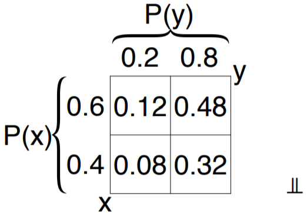

# Topic 7: Random Variables, Expectation, and Variance

## 7.1 Random Variables

+ Motivation
  + basic: coin, dice, cards, dominoes, marbles, ...
  + applications $\to$ numbers
    + Internet company: subscribers, clicks, viewers
    + manufacture: yield, weight, sales
    + traveler: time, congestion, delay
    + physician: age, temperature, heart rate
    + student: GPA, tuition, assignment
    + people: income, cost
  + random variable: number-valued random outcome

+ Difference w/ numbers
  + distribution, $p(x)$
    + viewing on a line
    + expressing as function, e.g., $p(x) = 1/x^2$
    + considering properties, e.g., decreasing, concentrated
  + random variable, $X$
    + performance operations, e.g., $X+1, X^2$
    + combining variables, e.g., $X+Y$
    + considering properties, e.g., average value of $X$

+ Types of random variables
  + size of sample space $\Omega$
  + discrete
    + finite: $\{1, 2, 3\}, \{e, \pi\}$
    + countably infinite: $\Bbb{N}, \Bbb{Z}$
  + continuous
    + uncountably infinite: $[0, 2], (-1, 3) \cup [4, 5), \Bbb{R}$
  + mixed
    + combination: $[0, 2] \cup \{e, \pi\}$

+ Numbered outcomes
  + several past examples had number outcomes
    + outcome of a die roll: $\{1, \dots, 6\}$
    + values of a domino tile: $\{0, \dots, 6\}$
    + number of heads in 3 coin tosses: $\{0, \dots, 3\}$
  + not using numerical features $\to$ use extensively

+ Numbers of Heads
  + 3 fair coins
  + $\Omega = \{\text{ttt, tth, tht, thh, htt, hth, hht, hhh}\} \to |\Omega| = 8$
  + equiprobable: $p = 1/8$

    

      
    

+ Specification of Tetrahedra die
  + old fashion
    + explicit: $p(1) = .1, p(2) = .2, p(3) = .3, p(4) = .4$
    + table
  + with numbers:
    + function: $p(x) = x/10, x \in \{1, 2, 3, 4\}$
    + graphs

      

        
      

  
+ Probability mass function
  + old fashion:
    + probability mass function (pmf)
    + $p: \Omega \to \Bbb{R}$
    + specify $\Omega$ and $p$
  + $\Omega$:
    + random variable $\to \subseteq \Bbb{R}$
    + discrete $\to$ finite or countably infinite
  + $p$:
    + $p(x) \geq 0 \quad \forall\, x \in \Omega$
    + $\sum_{x \in \Omega} p(x) = 1$
  + if $X$ is distributed according to $p$, denoted $X \sim p$

+ Alternative notation - discrete
  + $\Omega \subseteq \Bbb{R}$
  + often: $\Bbb{Z}, \Bbb{N}, \Bbb{P}, \{1, \dots, n\}$
  + $p(x) \to p_x \; p_i$
  + $p_i \geq 0 \quad \sum_i p_i = 1$

+ Types of discrete distributions
  + finite: $|\Omega| = n \in \Bbb{P}$
  + infinite: $|\Omega| = \infty = \aleph_0$

+ Finite distributions
  + $\exists\, |\Omega| = n$ specifying pmf, $p_1, p_2, \dots, p_n$

    \[ \forall\, 1 \leq i \leq n \quad p_i \geq 0 \qquad \sum_{i=1}^n p_i = 1 \]
  
  + uniform: $p_1 = p_2 = \cdots, p_n = 1/n$
  + increasing: $p_1 \leq p_2 \leq \cdots \leq p_n$
  + decreasing: $p_1 \geq p_2 \geq \cdots \geq p_n$

+ Infinite distributions
  + $|\Omega| = \infty$
  + one-side infinite
    + $p_1, p_2, p_3, \dots$
    + unable to be uniform: $p = 0 \to \sum = 0 \quad p > 0 \to \sum = \infty$
    + unable to be increasing: $p_i > 0 \to p_{i+1}, p_{i+2}, \dots > p_i \to \sum = \infty$
    + able to be decreasing: $\tfrac{1}{2}, \tfrac{1}{4}, \tfrac{1}{8}, \dots$
      + $\sum_{i=1}^n \frac{1}{2^i} = 1 - \frac{1}{2^n}$
      + $\sum_{i=1}^\infty \frac{1}{2^i} = 1$
  + double infinite
    + $\dots, p_{-2}, p_{-1}, p_0, p_1, p_2, \dots$
    + e.g., $\dots, \tfrac{1}{8}, \tfrac{1}{4}, 0, \tfrac{1}{4}, \tfrac{1}{8}, \dots$

+ Formal definition
  + random variable: a mapping $f: \Omega \to \Bbb{R}$
  + simplifying terminology, focusing on math
  + number-valued random experiment

+ [Original Slides](https://tinyurl.com/ya6muda5)

## Problem Sets

0. Which of the following statements is correct? 
  a. Random variables are mappings between outcomes and real numbers. 
  b. Random variables are mappings between events and real numbers. 
  c. Neither 

  Ans: a

1. For which value of $\alpha$ is the function $p_i= \frac{(\alpha+1)(i−\alpha)+2}{120}$ over $\{1,2, \dots, 10\}$ a p.m.f.?

  Ans: 1.5 
  Explanation: The p.m.f should add up to 1, hence, $\sum_{i=1}^{10} p_i= \sum_{i=1}^{10} \frac{(\alpha+1)(i− \alpha)+2}{120}= \sum_{i=1}^{10} −\alpha^2+(i−1) \alpha+i+2}{120}=1$.  This reduces to the quadratic equation $2\alpha^2 − 9 \alpha + 9 = 0$ with two solutions $\alpha=3/2$ and $\alpha=3$. Recall that $0 \leq p_i \leq 1$, the solution $\alpha=3$ is discarded as some $p_i$'s are negative, and we are left with $\alpha=3/2$.

2. Which of the following are true for random variables? 
  a. A random variable $X$ defines an event. 
  b. For a random variable $X$ and a fixed real number  a , "$X \leq a$" defines an event. 
  c. Random variables for the same sample space must be same. 
  d. For a random variable $X$, possible values for $\Pr(X=x)$ include 0, 0.5 and 1. 

  Ans: bd 
  Explanation: Recall either the informal definition of a random variable as a real-valued random experiment, or the more formal one as a function that maps the sample set $\Omega$ to real numbers $R$. Therefore:
    + False. A random variable does not define an event.
    + True. "$X\leq a$" is the set of outcomes that are at most a.
    + False. A fair coin and a biased coin are two different variables with the same sample space \(\{h,t\}).
    + True. $0 \leq \Pr(X=x) \leq 1$, hence both 0,0.5 and 1 are possible.

3. An urn contains 20 balls numbered 1 through 20. Three of the balls are selected from the run randomly without replacement, and $X$ denotes the largest number selected. 
  a. How many values can $X$ take? 
  b. What is $\Pr(X=18)$? 
  c. What is $\Pr(X \geq 17)$? 

  Ans: a. (18); b. (0.1192); c. (0.50877) 
  Explanation: 
    + 1 and 2 are impossible, the remaining 18 outcomes can occur.
    + 18 is fixed, while the other 2 balls should selected from 1 to 17. $\Pr(X = 18) = \binom{17}{2}/\binom{20}{3}=0.119$.
    + $\Pr(X \ge 17) = \Pr(X = 17) + \Pr(X = 18) + \Pr(X = 19) + \Pr(X = 20) = \frac{\binom{16}{2} + \binom{17}{2} + \binom{18}{2} + \binom{19}{2}}{\binom{20}{3}} = 0.508$

## Lecture Video

 

## 7.2 Cumulative Distribution Function

+ Areas of interest
  + for random variable, often, interested in probability of intervals
    + salary > 80K
    + GPA < 3.0
    + temperature btw 60 and $80 {}^\circ F$
  + one function determining all interval probabilities

+ Culmulative distribution function
  + probability mass function (pmf): $p: \Omega \to \Bbb{R}$
  + cumulative distribution function (cdf): $F: \Bbb{R} \to \Bbb{R}$

    \[\begin{align*}
      F(x) &\stackrel{\text{def}}{=}\, \Pr(X \in (-\infty, x]) \\
      &\stackrel{\text{def}}{=}\, \Pr(X \leq x) = \sum_{u \leq x} p(u)
    \end{align*}\]

  + $X$ discrete, still $F$ defined over $\Bbb{R}$

+ Example
  + PMF

    \[ p(x) = \begin{cases} .2 & -1 \\ .5 & 1 \\ .3 & 2 \end{cases} \]

  + CDF

    \[ F(x) = \Pr(X \leq x) = \sum_{u \leq x} p(u) \]

  

    
  

+ Properties
  + nondecreasing: $x \leq y \to F(x) \leq F(y)$
  + limits: $\displaystyle \lim_{x \to -\infty} F(x) = 0 \qquad \lim_{x \to \infty} F(x) = 1$
  + right-continuous: $\displaystyle \lim_{x \searrow a} F(x) = F(a)$

+ Interval probabilities
  + by definition: $\Pr(X \leq a) = F(a)$
  + $\Pr(X > a) = 1 - \Pr(X \leq a) = 1 - F(a)$
  + $\Pr(a < X \leq b) = \Pr((X \leq b) - (X \leq a)) = \Pr(X \leq b) - \Pr(X \leq a) = F(b) - F(a)$

+ [Original Slides](https://tinyurl.com/yazqvt68)

## Problem Sets

0. All cumulative distribution functions are: 
  a. Continuous. 
  b. Left continuous. 
  c. Right continuous. 
  d. None of the above. 

  Ans: b

1. For the probability mass function, Find:

  

    
  

  a. $\Pr(X = 1)$, 
  b. $\Pr(X \geq 1)$, 
  c. $\Pr(X \in \Bbb{Z})$. 

  Ans: a. (.1); b. (.4); c. () 
  Explanation
    + $\Pr(X=1)=0.1$ from the figure.
    + $\Pr(X\ge 1)=\Pr(X=1)+\Pr(X=2)=0.4$
    + $\Pr(X\in \mathbb{Z})=\Pr(X=-1)+\Pr(X=0)+\Pr(X=1)+\Pr(X=2)=0.6$

2. Recall that the "floor" of a real number $x$, denoted $\lfloor x \rfloor$, is the largest integer $\leq x$.  

  \[ F(x)= \begin{cases} k-\frac{1}{\lfloor x\rfloor} & x\ge 1,\\ 0 & x\lt 1,\end{cases} \]
  
  is a cumulative distribution function (cdf) for some fixed number $k$. Find: 
  a. $k$, 
  b. $x_{min}$ (the smallest number with non-zero probability), 
  c. $\Pr(X=4)$, 
  d. $\Pr(2 < X \leq 5)$. 

  Ans: a. (1); b. (2); c. (1/12); d. (3/10) 
  Explanation
    + Observe that $F(x)=0$ for $x<1$, and since $k=1$, also $F(1)=0$, hence the smallest number with non-zero probability is 2.
    + $\Pr(X = 4) = F(4) - F(3) = \frac{3}{4} - \frac{2}{3} = \frac{1}{12}$
    + $\Pr(2\lt X\le 5) = F(5) - F(2) = \frac{4}{5} - \frac{1}{2} = \frac{3}{10}$

3. Flip a coin with heads probability 0.6 repeatedly till it lands on tails, and let $X$ be the total number of flips, for example, for h, h, t, $X=3$. Find:
  a. $\Pr(X\le 3)$
  b. $\Pr(X\ge 5)$

  Ans: a. (0.784); b.(0.1296) 
  Explanation
    + $\Pr(X \le 3) = \Pr(X = 1) + \Pr(X = 2) + \Pr(X = 3)$ $= 0.4 + 0.6 \times 0.4 + 0.6 \times 0.6 \times 0.4 = 0.784$
    + $\Pr(X\ge 5) = 1 - \Pr(X \lt 5) = 1 - \Pr(X \le 4) = 1 - (\Pr(X \le 3) + \Pr(X = 4))$ $ = 1 - (\Pr(X \le 3) + 0.6 \times 0.6 \times 0.6 \times 0.4) = 0.1296$

## Lecture Video

 

## 7.3 Expectation

+ Motivation
  + important random-variable properties?
  + range:
    + min & max values of $X$
    + lowest & highest temperature / salary
    + $x_{\min} = \min\{x \in \Omega \mid p(x) > 0\}$
    + $x_{\max} = \max\{x \in \Omega \mid p(x) > 0\}$
  + average
    + average temperature / salary
    + range average: $ \frac{x_{\min} + x_{\max}}{2}$
    + element average
      + $\dfrac{1}{|\Omega|} \displaystyle\sum_{x \in \Omega} x?$
      + over $x$ s.t. $p(x) > 0$

+ Sample mean
  + $\Omega = \{0, 1, \dots, 100\}$
    + $p(0) = .8 \quad p(90) = .1 \quad p(100) = .1 \quad$ all other $p(x) =0$
    + range average: $(x_{\min} + x_{\max}) / 2 \to (0 + 100)/2 = 50$
    + element average: positive probabilities $\to (0+90+100)/3 = 63.3$
  + ten sample
    + typical: 0, 0, 0, 0, 90, 0, 0, 0, 100, 0
    + sample mean: $(8 \cdot 0 + 1 \cdot 90 + 1 \cdot 100)/10 = 190/10 = 19$
  + more representative of what we will observe

+ Example: fair die
  + rolling a fair die $n \to \infty$ times
  + average of the observed values = ?
  + each value $\sim n/6$ times
  + average

    \[ \frac{\frac{n}{6} \cdot 1 + \frac{n}{6} \cdot 2 + \cdots + \frac{n}{6} \cdot 6}{n} = \frac{1 + \cdots + 6}{6} = \frac{1}{6} \frac{(1+6) \cdot 6}{2} = 3.5 \]

  + outcomes $1, 2, \dots, 6 \to $ average = 3.5

+ Example: Tetrahedra die = 4-sided die
  + average

    \[\begin{align*}
      \text{average} &= \frac{.1n \cdot 1 + .2n \cdot 2 + .3n \cdot 3 + .4n \cdot 4}{n}\\
      &= .1 \cdot 1 + 0.2 \cdot 2 + .3 \cdot 3 + .4 \cdot 4 = 3
    \end{align*}\]

  + arithmetic average: $(1 + 2 + 3 + 4)/4 = 2.5$
  + probability skew to the right

+ Expectation
  + w/ $n \to \infty$ samples, $x$ appear $\to p(x) \cdot n$ times
  + expectation / mean

    \[ E(X) \,\stackrel{\text{def}}{=}\, \sum_x \Pr(x) \cdot x = \frac{\sum_x [\Pr(x) \cdot n] \cdot n}{n} \]

  + $E(x)$ also denoted $EX, \mu_x, \mu$
  + not random, constant, property of the distribution
  + example: fair die

    \[\begin{align*}
      E(x) &= \sum_{i=1}^6 \Pr(i) \cdot i = \sum_{i=1}^6 \frac{1}{6} \cdot i \\
      &= \frac{1+2+\cdots +6}{6} = \frac{1}{6} \frac{(1+6) \cdot 6}{2} = \frac{7}{2} = 3.5
    \end{align*}\]

  + example: 4 sided-die

    \[ E(x) = \sum_{i=1}^4 p_i \cdot i = 0.1 \cdot 1 + 0.2 \cdot 2 + 0.3 \cdot 3 + 0.4 \cdot 4 = 3 \]

+ Example: 3 fair coins
  + toss a coin 3 times
  + $X$: number of heads
  + $E(X) = ?$
  
    \[ \sum \Pr(x) \cdot x = 1/8 \cdot 0 + 3/8 \cdot 1 + 3/8 \cdot 2 + 1/8 \cdot 3 = 1.5 \]

  + \# heads ranges from 0 to 3, on average 1.5

+ Symmetry
  + a distribution $p$ is symmetric around $a$ if $\forall\, x > 0, p(a+x) = p(a-x)$
  + $p$ is symmetric around $a \implies E(x) = a$

+ Uniform variables
  + $X$ uniform over $\Omega$

    \[\begin{align*}
      p(x) &= \frac{1}{|\Omega|} \\
      E(X) &= \sum_{x \in \Omega} \,p(x) \cdot x = \sum_{x \in \Omega} \frac{1}{|\Omega|} \cdot x = \frac{1}{|\Omega|} \sum_{x \in \Omega} x
    \end{align*}\]

  + $E(x)$: the arithmetic average of element in $\Omega$

    \[ E(X) = \frac{1 + 2 + \cdots + 6}{6} = 3.5 \]

  + e.g., 3 fair coins w/ $E(X) = 1.5 \to$ symmetry around 1.5

+ Properties of expectation
  + $E(x)$
    + not random
    + number
    + property of distribution
    + e.g., $E(x) = 1.5$
  + $x_{\min} \leq E(x) \leq x_{\max}$
    + $=$ holds $\iff X = c, \quad c$ as a constant
    + e.g., $0 \leq E(x) \leq 3$
  + $X$ as a constant, viz. $X = c \to E(X) = c$
  + $E(E(X)) = E(X)$

+ Expectation expected
  + $\mu = EX$: expectation of $X$
  + expect to see it? $\quad p_\mu$ high?
  + not necessary, probably never see it
    + $X \in \{0, 1\} \text{ w/ } p_0 = p_1 = 0.5$
    + $EX = 0 \cdot p_0 + 1 \cdot p_1 = 0 \cdot \frac{1}{2} + 1 \cdot \frac{1}{2} = \frac{1}{2}$
    + symmetric around 1/2
    + 1/2 never happened
    + many samples $\to$ average = 1/2
  + $EX$: average of large sample
    + not necessary likely a number to see
    + probably not observed at all

+ Infinite expectation
  + Basel problem: $\sum_{i=1}^\infty \frac{1}{i^2} = \frac{\pi^2}{6}$
  + Euler proved 
  + unitary: $\frac{6}{\pi^2} \sum_{i=1}^\infty \frac{1}{i^2} = 1$
  + probability distribution over $\Bbb{P}$: $p_i = \frac{6}{\pi^2} \cdot \frac{1}{i^2}$
  + $E(X) = \sum_{i=1}^\infty i \cdot p_i = \frac{6}{\pi^2} \sum_{i=1}^\infty \frac{1}{i} = \infty$
  + many samples: average will go to $\infty$

  

    
  

+ Undefined expectation
  + $p_i = \frac{3}{\pi^2} \cdot \frac{1}{i^2}$ for $i \neq 0$
  + $E(X) = \infty - \infty \to$ undefined, oscillated btw $\infty$ and $-\infty$

  

    
  

+ Example: life expectancy

  

    
  

+ [Original Slides](https://tinyurl.com/y87kom5a)

## Problem Sets

0. The expectation of a random variable X must be a number X can take. 
  a. True 
  b. Not true 

  Ans: b 
  Explanation: The expectation of a die roll is 3.5.

1. Which 2 of the following are true about the expectation of a random variable? 
  a. Not random 
  b. Random value 
  c. Property of the distribution 
  d. Independent of the distribution 

  Ans: ac  
  Explanation: An expectation of a distribution is a constant, which can be deducted by the distribution.

2. A quiz-show contestant is presented with two questions, question 1 and question 2, and she can choose which question to answer first. If her initial answer is incorrect, she is not allowed to answer the other question. If the rewards for correctly answering question 1 and 2 are \$200 and \$100 respectively, and the contestant is 60% and 80% certain of answering question 1 and 2, which question should she answer first as to maximize the expected reward?

  Ans: Question 2 first 
  Explanation: 
    + The expected reward if Question  1  is answered first is given by $300\times 0.6\times0.8+200\times 0.6\times 0.2+0=168$
    + and if Question  2  is chosen to be answered first, $300\times 0.8\times0.6+100\times 0.8\times 0.4+0=176$
    + Thus she should choose to answer Question 2 first.
    + [StackExchange](https://tinyurl.com/y98xq579)

3. If we draw cards from a 52-deck with replacement 100 times, how many times can we expect to draw a black king? 
  a. 3.846 
  b. 1.923 
  c. 0.038 
  d. 7.692 

  Ans: a 
  Explanation: Create 100 random variables $X1,X2, \dots ,X100$, each of which is a binary number, with 1 denotes we get a black king and 0 otherwise. It is easy to show that $E[X_i]=2/52$.  The times we expect to draw a black king can be calculated using $E[X_1 + X_2 + \cdots + X_{100}] = E[X_1] + E[X_2] + \cdots + E[X_{100}] = \frac{200}{52} = 3.846$

4. Each time you play a die rolling game you must pay `$1`. If you roll an even number, you win `$2`. If you roll an odd number, you lose additional `$1`. What is the expected value of your winnings? 
  a. `−$0.50` 
  b. `+$0.50` 
  c. `+$0.00` 
  d. `+$1.00` 
  e. `−$1.00` 

  Ans: a 
  Explanation: Since each time you need to pay `$1` for the game, the question is equivalent to "If you roll an even number, you win `$1`. If you roll an odd number, you lose `$2`." With $\Pr(\text{even}) = \Pr(\text{odd}) = \frac{1}{2}$, the expectation is $1×12+(−2)×12=−0.5$.  [Quora](https://tinyurl.com/y89ctmc4)

5. Choose a random subset of $\{2^1,2^2,\cdots, 2^{10}\}$ by selecting each of the 10 elements independently with probability $1/2$. Find the expected value of the smallest element in the subset (e.g. the subset can be $\{2^1,2^3,2^4,2^7\}$. The smallest element is $2^1$).

  Ans: 10 
  Explanation: An element $2^j$, $(j\in\{1,\cdots, 10\})$ is the smallest if and only if all elements less than it have not been chosen and $j$ is chosen. The probability of this happening is $1/2^j$. Therefore the expectation is $\sum_{j=1}^{10} 1/2^{j}\cdot 2^j=10.$.

6. An edX assignment has $50$ multiple-choice questions, each with four choices of which one is correct. A student gets $3$ points for solving a question correctly, and loses a point for an incorrect answer. What is the expected score of a student who answers all questions uniformly at random?

  Ans: 0 
  Explanation: Since the probability of solving a question correctly here is $1/4$, the expected score is $50\cdot(3\cdot 1/4-1\cdot3/4)=0$.

7. Which of the following statements are true for a random variable $X$? 
  a. $E(X)$ must be in the range $(0,1)$ 
  b. $E(X)$ can take a value that $X$ does not take 
  c. $\Pr(X\le E(X))=1/2$ 
  d. $E(X)=\frac12 (x_{\text{max}}+x_{\text{min}})$ 

  Ans: b 
  Explanation: 
    + False.
    + True. For random variable $X$ uniformly distributed over $\{−1,1\}$, the expectation is $E(X)=0$, which cannot be taken by $X$.
    + False. For random variable $X$ uniformly distributed over $\{−1,0,1\}$, the expectation is $E(X)=0$. Then $\Pr(X \le E(X))=\Pr(X \le 0)=\frac23$.
    + False. For random variable $X$ uniformly distributed over $\{−2,0,1\}$, the expectation is $E(X)=−\frac13 \neq \frac12 (x_{max}+x_{min})=−0.5$.

8. A bag contains five balls numbered 1 to 5. Randomly draw two balls from the bag and let $X$ denote the sum of the numbers.
  a. What is $\Pr(X \le 5)$?
  b. What is $E(X)$?

  Ans: a. (0.4); b. (6) 
  Explanation:
    + The total number of ways to draw balls is $\tbinom52=10$. There are 4 ways to draw 2 balls with sum smaller or equal to 5 (i.e. $(1,2),(1,3),(1,4),(2,3)$).  Thus $\Pr(X \le 5)= \frac{4}{10}=0.4$.
    + ind out the distribution of $X$, which is $\Pr(X = 3) = 0.1,$ $\Pr(X = 4) = 0.1,$ $ \Pr(X = 5) = 0.2,$ $\Pr(X = 6) = 0.2,$ $\Pr(X = 7) = 0.2,$ $\Pr(X = 8) = 0.1,$ $\Pr(X = 9) = 0.1$.  The expectation is $E(X) = 0.1 \times 3 + 0.1 \times 4+ 0.2 \times 5 + 0.2 \times 6 + 0.2 \times 7 + 0.1 \times 8 + 0.1 \times 9 = 6$

9. A player flips two fair coins. The player wins `$3` if 2 heads occur and `$1` if 1 head occurs. How much money (in `$`) should the player lose when no heads occur for the game to be fair (expected gain is 0)?

  Ans: 5 
  Explanation: The probability distribution is $\Pr(\text{2 heads}) = \Pr(\text{no heads}) = \frac{1}{4}, \Pr(\text{1 head}) = \frac{1}{2}$.  Suppose the the player loses `$x` when no heads occur. To make the game fair, $E(X) = \frac{1}{4} \times 3 + \frac{1}{2} \times 1 + \frac{1}{4} \times (-x) = 0$. Hence we have $x=5$.

10. There are 3 classes with 20, 22 and 25 students in each class for a total of 67 students. Choose one out of the 67 students is uniformly at random, and let $X$ denote the number of students in his or her class. What is $E(X)$?

  Ans: 22.5224 
  Explanation: $\Pr(\text{from the class with 20 students}) = \frac{20}{67},$ $\Pr(\text{from the class with 22 students}) = \frac{22}{67},$ $\Pr(\text{from the class with 25 students}) = \frac{25}{67}$. Hence, $E(X) = 20\cdot\frac{20}{67}+22\cdot\frac{22}{67}+25\cdot\frac{25}{67}=22.5224$

## Lecture Video

 

## 7.4 Variable Modifications

+ Functions of a random variable
  + random variables $X$ taking values in $\Bbb{R}$
  + often interested in related variable
    + $Y = g(X)$ w/ $g: \Bbb{R} \to \Bbb{R}$ is a fixed function
    + example:
      + $X$: random salary in `$`
      + `$10` raise: $X \to Y = X + 10$
      + 10% raise: $X \to Y = 1.1\, X$
      + become CEO: $X \to Y = X^2$
  + deterministic Functions
    + $Y = g(X)$
      + $g$ is a deterministic function over $\Bbb{R}$ (or $\Omega$)
      + e.g., $Y = X + 3$
    + all randomness in $Y$ derived from $X$
    + deterministically modified by $g$, e.g., $X = 5 \text{ s.t. } Y = 8$

+ Translation
  + add constant $b$ to $X$ = translate $X$ by $b$
  + $Y = X +b$
  + $\Pr(Y=y) = \Pr(X+b = y) = \Pr(X=y-b)$

  

    
  

+ Scaling
  + multiplying $X$ by a constant $b$
  + scale $X$ by a factor $b$, $Y = b \cdot X$
  + $\Pr(Y=y) = \Pr(bX = y) = \Pr(X = y/b)$

  

    
  

+ Two square examples
  + Square: 1-1

    <table style="font-family: arial,helvetica,sans-serif; width: 40vw;" table-layout="auto" cellspacing="0" cellpadding="5" border="1" align="center">
      <thead>
      <tr style="font-size: 1.2em;">
        <th colspan="4" style="text-align: center; background-color: #3d64ff; color: #ffffff; width:20%;">$X$</th>
        <th colspan="4" style="text-align: center; background-color: #3d64ff; color: #ffffff; width:20%;">$Y = X^2$</th>
      </tr>
      </thead>
      <tbody>
      <tr>
        <td style="text-align: center;">$x$</td> <td style="text-align: center;">0</td>
        <td style="text-align: center;">1</td> <td style="text-align: center;">2</td>
        <td style="text-align: center;">$y$</td> <td style="text-align: center;">0</td>
        <td style="text-align: center;">1</td> <td style="text-align: center;">4</td>
      </tr>
      <tr>
        <td style="text-align: center;">$p(X = x)$</td> <td style="text-align: center;">$\tfrac12$</td>
        <td style="text-align: center;">$\tfrac13$</td> <td style="text-align: center;">$\tfrac16$</td>
        <td style="text-align: center;">$p(Y=y)$</td> <td style="text-align: center;">$\tfrac12$</td>
        <td style="text-align: center;">$\tfrac13$</td> <td style="text-align: center;">$\tfrac16$</td>
      </tr>
      </tbody>
    </table>

  + square: many to 1

    <table style="font-family: arial,helvetica,sans-serif; width: 50vw;" table-layout="auto" cellspacing="0" cellpadding="5" border="1" align="center">
      <thead>
      <tr style="font-size: 1.2em;">
        <th colspan="6" style="text-align: center; background-color: #3d64ff; color: #ffffff; width:30%;">$X$</th>
        <th colspan="4" style="text-align: center; background-color: #3d64ff; color: #ffffff; width:20%;">$Y = X^2$</th>
      </tr>
      </thead>
      <tbody>
      <tr>
        <td style="text-align: center;">$x$</td> <td style="text-align: center;">-2</td>
        <td style="text-align: center;">-1</td> <td style="text-align: center;">0</td>
        <td style="text-align: center;">1</td> <td style="text-align: center;">2</td>
        <td style="text-align: center;">$y$</td> <td style="text-align: center;">0</td>
        <td style="text-align: center;">1</td> <td style="text-align: center;">4</td>
      </tr>
      <tr>
        <td style="text-align: center;">$p(X=x)$</td> <td style="text-align: center;">$\tfrac15$</td>
        <td style="text-align: center;">$\tfrac15$</td> <td style="text-align: center;">$\tfrac15$</td>
        <td style="text-align: center;">$\tfrac15$</td> <td style="text-align: center;">$\tfrac15$</td>
        <td style="text-align: center;">$p(Y=y)$</td> <td style="text-align: center;">$\tfrac15$</td>
        <td style="text-align: center;">$\tfrac25$</td> <td style="text-align: center;">$\tfrac25$</td>
      </tr>
      </tbody>
    </table>

    

      
    

  \[ \Pr(Y=y) = \Pr(g(X) = y) = \Pr(X \in g^{-1}(y)) = \sum_{x \in g^{-1}(y)} \Pr(X=x) \]

+ [Original Slides](https://tinyurl.com/ycssyss3)

## Problem Sets

0. Let X be a random variable. For a fixed real function g, g(X) is also a random variable.

  Ans: yes

## Lecture Video

 

## 7.5 Expectation of Functions of Random Variables

+ Expectation of Square

    <table style="font-family: arial,helvetica,sans-serif; width: 50vw;" table-layout="auto" cellspacing="0" cellpadding="5" border="1" align="center">
      <thead>
      <tr style="font-size: 1.2em;">
        <th colspan="6" style="text-align: center; background-color: #3d64ff; color: #ffffff; width:30%;">$X$</th>
        <th colspan="4" style="text-align: center; background-color: #3d64ff; color: #ffffff; width:20%;">$Y = X^2$</th>
      </tr>
      </thead>
      <tbody>
      <tr>
        <td style="text-align: center;">$x$</td> <td style="text-align: center;">-2</td>
        <td style="text-align: center;">-1</td> <td style="text-align: center;">0</td>
        <td style="text-align: center;">1</td> <td style="text-align: center;">2</td>
        <td style="text-align: center;">$y$</td> <td style="text-align: center;">0</td>
        <td style="text-align: center;">1</td> <td style="text-align: center;">4</td>
      </tr>
      <tr>
        <td style="text-align: center;">$p(X=x)$</td> <td style="text-align: center;">$\tfrac15$</td>
        <td style="text-align: center;">$\tfrac15$</td> <td style="text-align: center;">$\tfrac15$</td>
        <td style="text-align: center;">$\tfrac15$</td> <td style="text-align: center;">$\tfrac15$</td>
        <td style="text-align: center;">$p(Y=y)$</td> <td style="text-align: center;">$\tfrac15$</td>
        <td style="text-align: center;">$\tfrac25$</td> <td style="text-align: center;">$\tfrac25$</td>
      </tr>
      </tbody>
    </table>

  \[\begin{align*}
    E(X) &= \sum_x p(x) \cdot x \\
    &= \underbrace{-2 \cdot \frac15 + \underbrace{-1 \cdot \frac15 + 0 \cdot \frac15 + 1 \cdot \frac15}_{0} + 2 \cdot \frac15}_{\substack{0 \\\\ \text{By Symmetry}}} = 0
  \end{align*}\]

  \[\begin{align*}
    \Pr(Y = 0) &= \Pr(X^2 = 0) = \Pr(X = 0) = \frac15 \\
    \Pr(Y = 1) &= \Pr(X^2 = 1) = \Pr(X \in \{-1, 1\}) = \frac25 \\
    \Pr(Y = 4) &= \Pr(X^2 = 4) = \Pr(X \in \{-2, 2\}) = \frac25 \\\\
    E(Y) &= \frac15 \cdot 0 + \frac25 \cdot 1 + \frac25 \cdot 4 = \frac{10}{5} = 2
  \end{align*}\]

  + Alternative formulation

    \[\begin{align*}
      E(Y) &= \sum_y y \cdot \Pr(Y=y) = \sum_y y \cdot \Pr(X \in g^{-1}(y)) = \sum_y y \sum_{x \in g^{-1}(y)} p(x) \\
      &= \sum_y \sum_{x \in g^{-1}(y)} y \cdot p(x) = \sum_y \sum_{x \in g^{-1}(y)} g(x) \cdot p(x) = \sum_x g(x) \cdot p(x)
    \end{align*}\]

  + Square again

    \[\begin{align*}
      E(Y) &= \sum_{y=0, 1, 4} y \cdot p(Y=y) = \frac15 \cdot 0 + \frac25 \cdot 1 + \frac25 \cdot 4 = \frac{10}{5} = 2 \\\\
      E(Y) &= \sum_x x^2 \cdot p(x) = (-2)^2 \cdot \frac15 + (-1)^2 \cdot \frac15 + 0^2 \cdot \frac15 + 1^2 \cdot \frac15 + 2^2 \cdot \frac15 \\
      &= \frac45 + \frac15 + \frac15 + \frac45 = 2
    \end{align*}\]

  + Visualization

    \[\begin{align*}
      E(Y) &= \sum_y y \cdot \Pr(Y=y) = \sum_y y \cdot \Pr(X \in g^{-1}(y)) = \sum_y y \sum_{x \in g^{-1}(y)} p(x)\\
      &= \sum_y \sum_{x \in g^{-1}(y)} y \cdot p(x) = \sum_y \sum_{x \in g^{-1}(y)} g(x) \cdot p(x) = \sum_x g(x) \cdot p(x)
    \end{align*}\]

    + diagram:
      + three red circles: $\sum_y y \cdot \Pr(Y=y) \to$ sum by $y$
      + $\sum_y y \sum_{x \in g^{-1}(y)} p(x)$
        + lowest red circle: $y_1(p_1 + p_5)$
        + middle red circle: $y_2(p_2 + p_4)$
        + top red circle: $y_3(p_3)$
      + $\sum_y \sum_{x \in g^{-1}(y)} y \cdot p(x)$: points $y_1p_1, y_1p_5, y_2p_2, y_2p_4, y_3p_5$
      + $\sum_y \sum_{x \in g^{-1}(y)} g(x) \cdot p(x)$: $y_1p_1 \to g(1)p_1,$ $y_1p_5 \to g(5)p_5,$ $y_2p_2 \to g(2)p_2,$ $y_2p_4 \to g(4)p_4,$ $y_3p_5 \to g(3)p_3$
      + blue circles: sum by $x, \sum_x g(x) \cdot p(x)$
    + $y$: fewer multiplication
    + $x$: properties w/ general formula

    

      
    

+ Constant addition

  \[\begin{align*}
    E(X + b) &= \sum p(x) \cdot (x + b) = \sum p(x) \cdot x + \sum p(x) \cdot b = E(X) + b \cdot \sum p(x) \\
    &= E(X) + b
  \end{align*}\]

  + example: Bernoulli p

    \[p(x) = \begin{cases} 1-p & \text{if } x = 0 \\ p x = 1 & \text{if } x = 1 \end{cases}\]

    \[\begin{align*}
      E(X) &= (1-p) \cdot 0 + p \cdot 1 = p \\
      E(X+2) &= (1-p) \cdot (0+2) + p \cdot (1+2) = 2 - 2p +30p = p + 2 = E(X) + 2
    \end{align*}\]

+ Constant multiplication
  
  \[ E(aX) = \sum p(x) \cdot (ax) = a \sum p(x) \cdot a = a E(X) \]

  + example: Bernoulli p

    \[E(3X) = (1-p) \cdot (3 \cdot 0) + p \cdot (3 \cdot 1) = 2p = 3 E(X) \]

+ Linearity of expectation

  \[ E(aX + b) = E(aX) + b = aE(X) + b \]

  + example: Bernoulli p

    \[ E(2X+3) = (1-p)(2 \cdot 0 + 3) + p(2\cdot 1 + 3) = 3 - 3p + 5p = 2p + 3 = 2E(X) +3 \]

+ [Original Slides](https://tinyurl.com/y9t3hykh)

## Problem Sets

0. Which of the following does not hold for all random variables? 
  a. $E[X+2]=E[X]+2$ 
  b. $E[2X]=2E[X]$ 
  c. $E[X^2]=E[X]^2$ 
  d. All of them hold 

  Ans: c 
  Explanation
    + $E[X^2]=E[X]^2$ doesn't hold. For example, if X is equally likely to be -1 or 1, then $E(X)=0$ so $E(X)^2=0^2=0$ But $X^2=1$, so $E(X^2)=E(1)=1$

1. Let $X$ be distributed over the set $\Bbb{N}$ of non-negative integers, with pmf

  \[ \Pr(X=i)= \frac{\alpha}{2^i} \]
  
  a. $\alpha$ 
  b. $E[X]$ 

  For $Y = X \mod 3$, find 
  c. $\Pr(Y=1)$ 
  d. $E[Y]$ 

  Ans: a. (1/2); b. (1); c. (2/7); d. (4/7) 
  Explanation
    + Since the total probability must sum to 1, We must have $1=\sum_{i=0}^{\infty}\Pr(X=i)=\sum_{i=0}^{\infty}\frac{\alpha}{2^i}= \alpha \cdot \sum_{i=0}^{\infty} \frac{1}{2^i} = \alpha\cdot 2$. Thus $\alpha=1/2$.
    + y definition, $E(X)=\sum_{i=0}^{\infty}i\cdot \Pr(X=i)=\sum_{i=1}^{\infty}i.\frac{\alpha}{2^i}$. This may be re-written to give $2E(X)=\sum_{i=0}^{\infty}(i+1).\frac{\alpha}{2^i}$. Subtracting the former from the latter we have $E(X)=\sum_{i=0}^{\infty}\frac{\alpha}{2^i}=2\cdot \alpha=1$.
    + $\Pr(Y=1) = \sum_{j=0}^{\infty} \Pr(X = 3j + 1) =$ $\sum_{j=0}^{\infty}\frac{\alpha}{2^{3j+1}} = $ $1/2\cdot\sum_{j=0}^{\infty}\frac{\alpha}{8^{j}} = $ $1/2\cdot\alpha \cdot 8/7 =2/7$
    + First note that $\Pr(Y=2) = \sum_{j=0}^{\infty} \Pr(X = 3j + 2) =$ $\sum_{j=0}^{\infty}\frac{\alpha}{2^{3j+2}} = $ $1/4\cdot\sum_{j=0}^{\infty}\frac{\alpha}{8^{j}} =$ $1/4\cdot\alpha\cdot8/7 = $ $1/7$. Now $E(Y)=1\cdot \Pr(Y=1)+2\cdot \Pr(Y=2)=2/7+2\cdot 1/7=4/7$

2. Which of the following statements hold for all finite-expectation random variables $X,Y$ and all fixed numbers $a,b \in \Bbb{R}$?  
  a. $E[X+a]=E[X+b]\quad\implies\quad a=b$ 
  b. $E[aX]=E[bX]\quad\implies\quad a=b$ 
  c. $E[X]\neq E[Y]\quad\implies\quad E[aX+b]\neq E[aY+b]\quad$ for $a \neq 0$ 
  d. $E[X]\neq E[Y]\quad\implies\quad E[X^2]\neq E[Y^2]$ 
  e. $E[X^2]\neq E[Y^2]\quad\implies\quad E[X]\neq E[Y]$ 

  Ans: ac  
  Explanation
    + Ture. $E[X+a]=E[X+b] \implies E[X]+a=E[X]+b \implies a=b$.
    + False. $E[aX]=E[bX] \implies aE[X]=bE[X]$. If $E[X]=0$, it does not guarantee $a=b$.
    + True. If $a \neq 0$ and $E[X] \neq E[Y]$, $aE[X] \neq aE[Y] \implies aE[X]+b \neq aE[Y]+b \implies E[aX+b] \neq E[aY+b]$.
    + False. Suppose $X$ is uniformly distributed over $\{−1,0\}$, $Y$ is uniformly distributed over $\{0,1\}$. Then $E[X]=−1/2$, $E[Y]=1/2$. However, $E[X2]=E[Y2]=1/2$.
    + False. Suppose $X$ is uniformly distributed over $\{−1,0,1\}$, $Y$ is uniformly distributed over $\{−2,0,2\}$. Then $E[X2]=2/3$, $E[Y2]=8/3$. However, $E[X]=E[Y]=0$.

3. Every morning, the campus coffeeshop orders the day's croissant supply. The coffeeshop buys each croissant for `$1`, and sells it for `$4`. Experience has shown that the number of croissants customers wish to buy on any given day is distributed uniformly between 0 and 49. Once the coffeeshop runs out of croissants, they cannot sell any more, while on the other hand, all croissants left at the end of the day are given to charity for free.

  How many croissants should the coffeeshop order to maximize their expected profit?

  For example, if the coffeeshop orders 1 croissant, then they spend $1 to buy it, and then with probability 0.02 they don't sell any croissants and with probability 0.98 they sell it and bring in `$4`, hence their expected `$` profit is $0.02 \cdot 0+0.98 \cdot 4−1=2.92$. If the coffeeshop orders 2 croissants, then they spend `$2` to buy them, and then with probability 0.02 they sell nothing, with probability 0.02 they sell 1, and with probability 0.96 they sell both, hence their expected `$` profit is $0.02 \cdot 0+0.02 \cdot 4+0.96 \cdot 8−2=7.76−2=5.76$.
  
  Ans: 37 
  Explanation: It may be clearer to track what happens if we use letters to represent the various values. Assume that the coffeeshop buys each croissant for `$b` and sells it for `$s`, the number of croissants customers wish to buy is uniformly distributed over $0, \dots, w−1$ so that each value in the range has probability $1/w$, and the store orders $r$ croissants. In the question, $b=1$, $s=4$, and $w=50$, and we are trying to find the $r$ that will maximize the expected profit.

  The coffeeshop will never order more than $w−1$ croissants, hence $r \leq w−1$. If customers wish to buy $1 \le i \le r−1$ croissants, their sale will bring in  $i \cdot s$ dollars, and if customers wish to buy more than $r$ croissants, their sale will fetch $r \cdot s$ dollars. Hence the expected revenue from selling the croissants is

  \[ \sum_{i=0}^{r-1} \frac{i \cdot s}{w} + \sum_{i=r}^{w-1} \frac{r \cdot s}{w} = \frac{s}{w} \cdot \frac{r \cdot (r-1)}{2} + \frac{s}{w} \cdot (w - r) \cdot r = \frac{s}{w} \cdot (-\frac{r^2}{2} + (w - \frac12) \cdot r) \]

  The coffeeshop spends $b \cdot r$ to purchase the croissants, hence their profit is $\frac{s}{w} \cdot (-\frac{r2}{2} + (w--\frac12)\cdot r) - b \cdot r$

  We would like to find the value of $r$ maximizing the equation. Since it is quadratic in $r$ with a negative leading coefficient, the profit is maximized when the derivative is 0, namely $-\frac{s}{w} \cdot r + \frac{s}{w} (w - \frac12) - b = 0$, or $r=w \cdot 1−\frac{b}{s})−\frac12$.

  In our case, $w=50$, $b=1$, and $s=4$, hence the expected profit is highest when $r=50 \cdot (1−\frac14)−\frac12=37$.

4. Let $X$ follows a distribution $P$ over $\Omega$. The indicator function of an event $A \subseteq \Omega$ , is the 0-1 function $I_A(x)= \begin{cases} 1 & \text{if } x \in A, \\0 & \text{if } x \notin A.\end{cases}$.

  Observe that $I_A(X)$ is a random variable whose value is 1 if $A$ occurred, and 0 if $A$ did not occur.

  $E[I_A(X)]$ is:

  a. always 0 or 1, 
  b. $E(X)$, 
  c. $\Pr(A)$. 

  Ans: c 
  Explanation $E(I_A(X)) = \displaystyle \sum_{x \in \Omega} I_A(X = x)\Pr(X = x) =$ $\displaystyle \sum_{x \in A} I_A(X = x)\Pr(X = x) + \sum_{x \not\in A} I_A(X = x)\Pr(X = x) =$ $\displaystyle \sum_{x \in A} \Pr(X = x) + \sum_{x \not\in A} 0 = \Pr(A)$

## Lecture Video

 

## 7.6 Variance

+ Distribution properties
  + deterministic function of distribution $\to$ not random
  + long term average
    + expectation, E[X], $\mu$
    + e.g., die: $\mu = 3.5$
  + consistency: variation from the mean

+ Example: money matter
  + two companies, each w/ 1000 employees
  + both same mean salary: \$100K
    + C1: every employee makes \$100K
    + C2: every employee make \$1, CEO \$99,999,001
  + which will you join?
    + same mean but very different distribution
    + mean not all, variation matters

+ Difference from mean
  + $X$: r.v. w/ mean $\mu$
  + how much $X$ differs from $\mu$ on average?
  + candidate: $E[|X - \mu|]$, mean absolute difference
  + not commonly used, absolute value function hard to analyze
  + instead: $E[(X - \mu)^2]$

+ variance
  + expected squared difference btw $X$ and its mean

    \[ Var(X) = E[(X - \mu)^2] = E(X - \mu)^2] \]

  + standard deviation

    \[ \sigma_X = +\sqrt{Var(X)} \]

  + constants
  + properties of distribution

+ Example:

  <table style="font-family: arial,helvetica,sans-serif; width: 30vw;" table-layout="auto" cellspacing="0" cellpadding="5" border="1" align="center">
    <thead>
    <tr style="font-size: 1.2em;">
      <th style="text-align: center; background-color: #3d64ff; color: #ffffff; width:10%;">x</th>
      <th style="text-align: center; background-color: #3d64ff; color: #ffffff; width:20%;">$p_x$</th>
      <th style="text-align: center; background-color: #3d64ff; color: #ffffff; width:20%;">$x = \mu$</th>
      <th style="text-align: center; background-color: #3d64ff; color: #ffffff; width:20%;">$(x - \mu)^2$</th>
    </tr>
    </thead>
    <tbody>
    <tr> <th style="text-align: center;">$-a$</th> <td style="text-align: center;">$\frac12$</td> <td style="text-align: center;">$-a$</td> <td style="text-align: center;">$a^2$</td> </tr>
    <tr> <th style="text-align: center;">$a$</th> <td style="text-align: center;">$\frac12$</td> <td style="text-align: center;">$a$</td> <td style="text-align: center;">$a^2$</td> </tr>
    </tbody>
  </table>

  + $X$ w/ $\mu = 0$
  + $Var(X) = \frac12 \cdot a^2 + \frac12 \cdot a^2 = a^2$
    + $X^2$: always $a^2$
    + $(X - \mu)^2 = a^2$ always
  + $\sigma_x =a$: "average" distance from mean

+ Example: fair die
  + $\mu = 3.5$
  + $Var(X) = E[(X - \mu)^2] = \frac{2(6.25+2.25+.25)}{6} = \frac{8.75}{3} = 2.92$
  + $\sigma = \sqrt{2.92 \dots} = 1.71\dots$

  <table style="font-family: arial,helvetica,sans-serif; width: 30vw;" table-layout="auto" cellspacing="0" cellpadding="5" border="1" align="center">
    <thead>
    <tr style="font-size: 1.2em;">
      <th style="text-align: center; background-color: #3d64ff; color: #ffffff; width:10%;">$x$</th>
      <th style="text-align: center; background-color: #3d64ff; color: #ffffff; width:20%;">$p_x$</th>
      <th style="text-align: center; background-color: #3d64ff; color: #ffffff; width:20%;">$x - \mu$</th>
      <th style="text-align: center; background-color: #3d64ff; color: #ffffff; width:20%;">$(x - \mu)^2$</th>
    </tr>
    </thead>
    <tbody>
    <tr> <td style="text-align: center;">1</td> <td style="text-align: center;">$\frac16$</td> <td style="text-align: center;">-2.5</td> <td style="text-align: center;">6.25</td> </tr>
    <tr> <td style="text-align: center;">2</td> <td style="text-align: center;">$\frac16$</td> <td style="text-align: center;">-1.5</td> <td style="text-align: center;">2.25</td> </tr>
    <tr> <td style="text-align: center;">3</td> <td style="text-align: center;">$\frac16$</td> <td style="text-align: center;">-0.5</td> <td style="text-align: center;">0.25</td> </tr>
    <tr> <td style="text-align: center;">4</td> <td style="text-align: center;">$\frac16$</td> <td style="text-align: center;">0.5</td> <td style="text-align: center;">0.25</td> </tr>
    <tr> <td style="text-align: center;">5</td> <td style="text-align: center;">$\frac16$</td> <td style="text-align: center;">1.5</td> <td style="text-align: center;">2.25</td> </tr>
    <tr> <td style="text-align: center;">6</td> <td style="text-align: center;">$\frac16$</td> <td style="text-align: center;">2.5</td> <td style="text-align: center;">6.25</td> </tr>
    </tbody>
  </table>

+ Example: Bernoulli p

  <table style="font-family: arial,helvetica,sans-serif; width: 30vw;" table-layout="auto" cellspacing="0" cellpadding="5" border="1" align="center">
    <thead>
    <tr style="font-size: 1.2em;">
      <th style="text-align: center; background-color: #3d64ff; color: #ffffff; width:10%;">$x$</th>
      <th style="text-align: center; background-color: #3d64ff; color: #ffffff; width:20%;">$p_x$</th>
      <th style="text-align: center; background-color: #3d64ff; color: #ffffff; width:20%;">$x - \mu$</th>
      <th style="text-align: center; background-color: #3d64ff; color: #ffffff; width:20%;">$(x - \mu)^2$</th>
    </tr>
    </thead>
    <tbody>
    <tr> <td style="text-align: center;">0</td> <td style="text-align: center;">$q$</td> <td style="text-align: center;">$0 - p = -p$</td> <td style="text-align: center;">$p^2$</td> </tr>
    <tr> <td style="text-align: center;">1</td> <td style="text-align: center;">$p$</td> <td style="text-align: center;">$1-p=q$</td> <td style="text-align: center;">$q^2$</td> </tr>
    </tbody>
  </table>

  \[ Var(X) = q \cdot p^2 + p \cdot q^2 = pq(p+q) = pq \]

  

    
  

+ Example: 3 coins
  + toss 3 fair coins
  + X = \# heads

    <table style="font-family: arial,helvetica,sans-serif; width: 30vw;" table-layout="auto" cellspacing="0" cellpadding="5" border="1" align="center">
      <thead>
      <tr style="font-size: 1.2em;">
        <th style="text-align: center; background-color: #3d64ff; color: #ffffff; width:10%;">$x$</th>
        <th style="text-align: center; background-color: #3d64ff; color: #ffffff; width:20%;">$p_x$</th>
        <th style="text-align: center; background-color: #3d64ff; color: #ffffff; width:20%;">$x - \mu$</th>
        <th style="text-align: center; background-color: #3d64ff; color: #ffffff; width:20%;">$(x - \mu)^2$</th>
      </tr>
      </thead>
      <tbody>
      <tr> <td style="text-align: center;">0</td> <td style="text-align: center;">$\frac18$</td> <td style="text-align: center;">-1.5</td> <td style="text-align: center;">2.25</td> </tr>
      <tr> <td style="text-align: center;">1</td> <td style="text-align: center;">$\frac38$</td> <td style="text-align: center;">-0.5</td> <td style="text-align: center;">0.25</td> </tr>
      <tr> <td style="text-align: center;">2</td> <td style="text-align: center;">$\frac38$</td> <td style="text-align: center;">0.5</td> <td style="text-align: center;">0.25</td> </tr>
      <tr> <td style="text-align: center;">3</td> <td style="text-align: center;">$\frac18$</td> <td style="text-align: center;">1.5</td> <td style="text-align: center;">2.25</td> </tr>
      </tbody>
    </table>

  + $\mu = 1.5$
  + $V = 2 (\frac18 \cdot 2.24 + \frac38 \cdot 0.25) = \frac14 (2.25 + 0.75) = \frac34$
  + $\sigma = \sqrt{3}/2$

+ Different formula
  
  \[\begin{align*}
    Var(X) &= E[(X - \mu)^2] = E[X^2 - 2\mu X + \mu^2] = E]X^2] - E[2\mu X] + E[\mu^2] \\
    &= E[X^2] - 2\mu E[X] + \mu^2 = E[X^2] -2\mu^2 + \mu^2 = E[X^2] - \mu^2 \\
    &= E[X^2] - (E[X])^2
  \end{align*}\]

  + example: Bernoulli p
    + $X \sim B(p)$
    + $E[X] = p, Var(X) = pq$
    + re-deriving w/ $Var(X) = E[X^2] - (E[X])^2$
      + $E[X^2] = (1-p) \cdot 0^2 + p \cdot 1^2 = p$
      + even simplier: $0^2 = 0, 1^2 = 1 \to X^2 =X \to E[X^2] = E[X] = p$

      \[ Var(X) = E[X^2] - (E[X])^2 = p - p^2 = p(1-p) = pq \]

+ Observation
  + $Var(X) = E[(X - \mu)^2]$
  
    \[\begin{array}{lcccr}
      0 &\le & Var(X) & \le & \max((X-\mu)^2) \\
      0 &\le & \sigma_x & \le & \max(|X - \mu|)
    \end{array}\]

    + left `=`: $X$ is a constant
    + right `=`: $X$ constant or taking two values w/ equal prob.

  + $Var(X) = E[X^2] - \mu^2 \to Var(X) \le E[X^2]$

+ Properties
  + how simple modification affect $V$ and $\sigma$
  + addition (translation): $X + b$
  + multiplication (scaling): $a \cdot X$
  + `+` & `x` (affine transformation): $aX+b$

+ Addition
  + $X$: random variable
  + $b$: constant (e.g., 2)
  + linearity of expectation: $\mu_{x+b} = \mu_x + b$
  + addition of variance
  
    \[ Var(X+b) = E[(X + b - \mu_{x+b})^2] = E[(X + b - \mu_x -b)^2] = E[(X - \mu_x)^2] = Var(X) \]

+ Example: translated $B(p)$
  + $X \sim B(p) \quad Var(X) = p(1-p)$
  + $Y = X + 1$
  + linearity of expectation: $\mu_y = 1 + p$
  
    \[\begin{align*}
      Var(Y) &= E[(Y - \mu_y)^2] = (1 - p)(1 - 1-p)^2 + p(2-1-p)^2 \\
      &= (1-p)p^2 + p (1-p)^2 = p(1-p)(p+1-p) = p(1-p) = Var(X)
    \end{align*}\]

  

    
  

+ Scaling
  + variance: different from mean grew by $a^2$

    \[\begin{align*}
      Var(aX) & = E[(aX - \mu_{ax})^2] = E[a^2(X - \mu_x)^2] \\
      &= a^2 E[(X - \mu_x)^2] = a^2 Var(X)
    \end{align*}\]

  + standard deviation: "average" difference from mean grew by a factor of $|a|$
  
    \[ \sigma_{aX} = \sqrt{Var(aX)} = \sqrt{a^2 Var(X)} = |a| \sigma_x \]

  

    
  

+ Affine transformation
  + $Var(aX + b) = Var(aX) = a^2 Var(X)$
  + $\sigma_{ax+b} = |a| \sigma_x$

+ [Original Slides](https://tinyurl.com/y6wpn2qe)

## Problem Sets

0. Which of the following is greater ($\ge$) for a random variable $X$? 
  a. $E[X^2]$ 
  b. $E[X]^2$ 
  c. Depends on X 

  Ans: a 
  Explanation: $E[X^2]$ will be greater. Since $Var(X)=E[X^2]-E[X]^2$, and $Var(X)$ is always non-negative.

1. Given 4 probability density functions, which one shows the greatest variance?

  

    
  

  a. $\(1\)$ 
  b. $\(2\)$ 
  c. $\(3\)$ 
  d. $\(4\)$ 
  
  Ans: c 
  Explanation: Variance measures how far a set of (random) numbers are spread out from their average value. 3 is the broadest one.

2. A random variable $X$ is distributed over $\{−1,0,1\}$ according to the p.m.f. $\Pr(X=x)=|x|+15$.<b/>
  a. Find its expectation $E(X)$<b/>
  b. and variance $Var(X)$<b/>

  Ans: a. (0); b. (4/5) 
  Explanation:
    + The pmf is symmetric around 0, hence the mean is 0.
    + By definition, $Var(X) = \frac{2}{5} \times (-1 - 0)^2 + \frac{1}{5} \times (0 - 0)^2 + \frac{2}{5} \times (1 - 0)^2 = \frac{2}{5} + 0 + \frac{2}{5} = \frac{4}{5}$, Or, $Var(X)=\mathbb{E}(X^2)-\mathbb{E}(X)^2=4/5-0=4/5$

3. Let random variable X be distributed according to the p.m.f

  \[\begin{array}{c|ccc}
    x & 1 & 2 & 3 \\
    \hline
    \Pr(x) & 0.3 & 0.5 & 0.2\\
  \end{array} \]

  If $Y=2^X$, what are 
  a. $E[Y]$ 
  b. $Var(Y)$ 
 
  If $Z=aX+b$ has $E[Z]=0$ and $Var(Z)=1$, what are: 
  c. |a| 
  d. |b| 

  Ans: a. (4.2); b. (4.36); c. (10/7); d. (19/7) 
  Explanation
    + $E(Y)=E(2^X)=2\times 0.3+4\times 0.5+8\times0.2=4.2$
    + For any random variable $Var(Z)=E(Z^2)-E(Z)^2$. Here, $E(Y^2)=E(2^{2X})=4\times 0.3+16\times 0.5+64\times0.2=22$. Thus, $Var(Y)=22-4.2^2=4.36$
    + 10/7
    + First, $E(X)=0.3×1+0.5×2+0.2×3=1.9$, $E(X2)=0.3×1+0.5×4+0.2×9=4.1$ and thus $Var(X)=E(X2)−E(X)2=4.1−1.92=0.49$.  Now, by linearity of expectation, $0=E(Z)=aE(X)+b=1.9 \cdot a+b$. Further, we know $1=Var(Z)=Var(aX+b)=a2 \cdot Var(X)=a2 \cdot 0.49$. Solving these two equations gives $|a|=1.42857$, $|b|=2.71485$.

4. Consider two games. One with a guaranteed payout $P_1=90$, and the other whose payout $P_2$ is equally likely to be 80 or 120. Find: 
  a. $E(P_1)$ 
  b. $E(P_2)$ 
  c. $Var(P_1)$ 
  d. $Var(P_2)$ 
  e. Which of games 1 and 2 maximizes the `risk-adjusted reward' $E(P_i)-\sqrt{\text{Var}(P_i)}$?

  Ans: a. (90); b. (100); c. (0); d. (); e. (1) 
  Explanation
    + The distribution of $P_1$ is $\Pr(P_1=90)=1$. Hence, $E(P1)=1×90=90$.
    + The distribution of $P_2$ is $\Pr(P_2=80)=\Pr(P_2=120)=1/2$. Hence, $E(P_2)=1/2×80+1/2×120=100$.
    + By definition, $Var(P_1)=1×(90−90)2=0$.
    + By definition, $Var(P_2)=12×(80−100)2+12×(120−100)2=400$.
    + By definition, $E(P_1)-\sqrt{\text{Var}(P_1)} = 90$, $E(P_2)-\sqrt{\text{Var}(P_2)} = 80$

5. Which of the following are always true for random variables \(X\), \(Y\) and real numbers \(a\), \(b\)? 
  a. The variance of \(X\) is always non-negative. 
  b. The standard deviation of \(X\) is always non-negative. 
  c. If \(Var(X)=Var(Y)\), then \(Var(X+a)=Var(Y+b)\). 
  d. If \(Var(aX)=Var(bX)\) for \(a\not=0\) and \(b\not=0\), then \(a=b\). 
  e. If \(E[X]=E[Y]\) and \(Var(X)=Var(Y)\), then \(X=Y\). 
  f. If \(E[X]=E[Y]\) and \(Var(X)=Var(Y)\), then \(E[X^2]=E[Y^2]\). 

  Ans: abcf 
  Explanation
    + True.
    + True. Standard deviation is defined by $\sqrt{Var(X)}$, which is also non-negative.
    + True. Adding a constant $a$ to random varianle $X$ will not affect its varaince. $Var(X + a) = E((X + a - E(X + a))^2) = E((X + a - E(X) - a)^2) = E((X - E(X))^2) = Var(X)$
    + False. When $Var(X)=0$, this does not hold.
    + False. Consider two random variables $X,Y$ with pmf, $\Pr(X= x) = \begin{cases} \frac12 & x = -1\\ \frac12 & x=1 \end{cases}$, and$\Pr(Y=y) = \begin{cases} \frac18 & y = -2 \\ \frac34 & y=0 \\ \frac18 & y=2 \end{cases}$.  Now $E(X) = E(Y) = 0, Var(X) = Var(Y) = 1$.  However, $X \neq Y$
    + True, as $E(X^2)=Var(X)+E^2 [X]$, if $E(X)=E(Y)$ and $Var(X)=Var(Y)$, then $E(X^2)=E(Y^2)$.

6. We say $X_A$ is an indicator variable for event $A$: $X_A=1$ if A occurs, $X_A=0$ if $A$ does not occur. 
  
  If $\Pr(A)=0.35$, what is: 
  a. $E(XA)$? 
  b. $Var(X_A)$? 

  Ans: a. (0.35); b. (0.2275) 
  Explanation
    + The distribution of $X_A$ is $\Pr(X_A=1)=\Pr(A)=0.35, \Pr(X_A=0)=1−\Pr(A)=0.65$. The spectation is $E(X_A)=0.35×1+0.65×0=0.35$
    + The variance of $X_A$ is $Var(X_A)=0.35×(1−0.35)2+0.65×(0−0.35)2=0.2275$

7. Let $X$ denote the number when rolling a fair six-sided die, then what is: 
  a. $Var(X)$? 
  b. $\sigma_X$? 

  Ans: a. (2.9167); b. (1.7078) 
  Explanation
    + The expectation of $X$ is $E(X)=3.5$. The variance of $X$ is $\text{Var}(X) = \frac{1}{6} \times (1 - 3.5)^2 + \frac{1}{6} \times (2 - 3.5)^2 + \frac{1}{6} \times (3 - 3.5)^2 + \frac{1}{6} \times (4 - 3.5)^2 + \frac{1}{6} \times (5 - 3.5)^2 + \frac{1}{6} \times (6 - 3.5)^2 = \frac{35}{12}$
    + The standard deviation of $X$ is $\sigma_X = \sqrt{\text{Var}(X)} = 1.7078$

8. Let $X$ and $Y$ be independent random variables with expectations 1 and 2, and variances 3 and 4, respectively. Find the variance of $Var(XY)$.

  Ans: 28 
  Explanation: $E(X^2)=Var(X)+(EX)^2=3+12=4$ and $E(Y^2)=Var(Y)+(EY)^2=4+22=8$. Hence $Var(XY)=E((XY)2)−E^2(XY)=E(X^2 \cdot Y^2)−(EX \cdot EY)^2 =$ $E(X^2) \cdot E(Y^2)−(EX)^2 \cdot (EY)^2=4 \cdot 8−(1⋅2)2=28$.

## Lecture Video

 

## 7.7 Two Variables

+ Motivation
  + experiments often result in multiple observations
  + examples:
    + weather: temperature and precipitation
    + economy: unemployment and inflation
    + database table: experience and salary
    + student: \# classes, GPA
    + human experiment: profession, age, cholesterol, salary, happiness, location, dinner plans, ...

+ Join distribution
  + simple extension of one variable

  <table style="font-family: arial,helvetica,sans-serif; width: 60vw;" table-layout="auto" cellspacing="0" cellpadding="5" border="1" align="center">
    <thead>
    <tr style="font-size: 1.2em;">
      <th style="text-align: center; background-color: #3d64ff; color: #ffffff; width:10%;"># Variables</th>
      <th style="text-align: center; background-color: #3d64ff; color: #ffffff; width:10%;">Variable Names</th>
      <th style="text-align: center; background-color: #3d64ff; color: #ffffff; width:10%;">Sample Space</th>
      <th style="text-align: center; background-color: #3d64ff; color: #ffffff; width:10%;">Prob.</th>
      <th style="text-align: center; background-color: #3d64ff; color: #ffffff; width:10%;">Abbr.</th>
      <th style="text-align: center; background-color: #3d64ff; color: #ffffff; width:20%;">Properties</th>
    </tr>
    </thead>
    <tbody>
    <tr>
      <th>One</th> <td style="text-align: center;">X</td> <td style="text-align: center;">$X$</td> <td style="text-align: center;">$p(X = x)$</td> <td style="text-align: center;">$p(x)$</td> <td style="text-align: center;">$p(x) \ge 1 \\ \sum_x p(x) =1$</td>
    </tr>
    <tr>
      <th>Two</th> <td style="text-align: center;">X, Y</td> <td style="text-align: center;">$X \times Y$</td> <td style="text-align: center;">$p((X, Y) = (x, y))$</td> <td style="text-align: center;">$p(x, y)$</td> <td style="text-align: center;">$p(x, y) \ge 0 \\ \sum_{x, y} p(x, y) = 1$</td>
    </tr>
    </tbody>
  </table>

+ Specification
  + state probability of every possible $(x, y)$ pair
  + ways to representation
    + table: 1-d
    + structure: 2-d
    + structured distributions
  + more natural options

+ Example: coins
  + fair coins
    + story: two independent fair coins
    + symbolic: $U, V \sim B(\frac12) \quad U {\perp \!\!\!\! \perp} V$
    + ways to indicate distribution
      + explicit: $\Pr(u, v) \stackrel{\text{def}}{=} \Pr(U = u, V = v) = \frac14 \quad \forall\, \{u, v\} \in \{0, 1\}$
      + table:

        

          
        

    + Min-Max: $X = \min(U, V) \quad Y = \max(U, V)$
      + $(u, v) = (0, 0) \to min(u, v) = 0, \max(u, v) = 0 \to p(X, Y) = p(0, 0) = \frac14$
      + $(u, v) = (0, 1) \& (1, 0) \to \min(u, v) = 0, \max(u, v) = 1 \to p(X, Y) = p(0, 1) = \frac12$
      + $(u, v) = (1, 1) \to min(u, v) = 1, \max(u, v) = 1 \to p(X, Y) = p(1, 1) = \frac14$
      + $p(X, Y) = p(1, 0) = 0$
    + Product-sum: $X = U\cdot V \quad Y = X + Y$
      + $(u, v) = (0, 0) \to x = 0, y = 0 \to p(x, y) = \frac14$
      + $(u, v) = (0, 1) or (1, 0) \to x = 0, y = 1 \to p(x, y) = \frac12$
      + $(u, v) = (1, 1) \to x = 1, y = 2 \to p(1, 2) = \frac14$
      + $p(1, 0) = p(1, 1) = p(0, 2) = 0$

  + 3 coins
    + $U_1, U_2, U_3 \sim B(1/2) \quad {\perp \!\!\!\! \perp}$
    + $X = U_1 + U_2$: \# heads among the first 2
    + $Y = U_2 + U_3$: \# heads among the last 2

      

        
      

  + bias coins
    + independent $B(p)$ and $B(q)$

      

        
      

+ General $B(p)$
  + $U \sim B(p), V \sim B(q), B {\perp \!\!\!\! \perp} V$
  + $X = \min(U, V), Y = \max(U, V)$

    

      
    

+ Fair and Rigged
  + two coins:
    + fair: $B(\frac12)$
    + rigged: $B(0)$
  + randomly choose fair or rigged
  + flip chosen coin

    

      
    

+ Join distribution
  + $X, Y$: random variables
  + joint distribution: probability of every possible $(x, y)$ pair

    \[ p(x, y) \stackrel{\text{def}}{=} \Pr(X = x, Y=y) \]

  + properties
    + $\forall\, x, y, \;p(x, y) \ge 0$
    + $\sum_{x, y} p(x, y) = 1$

  + omnipotent
    + joint distribution determines all probabilities of interest

    

      
    

    \[\begin{align*}
      \Pr(X \le Y) &= \Pr(X=0, Y=0) + \Pr(X = 0, Y = 1) + \Pr(X=1, Y=1) \\
      &= \Pr(0, 0) + \Pr(0, 1) + \Pr(1, 1) = 0.1 + 0.2 + 0.4 = 0.7
    \end{align*}\]

+ Quiz: find a simple description of following events and their probability
  + $X = Y$:
  + $X \neq Y$
  + $X+Y = 1$
  + $X \cdot Y$
  + $\min(X, Y)=1$
  + $\max(X, Y)=1$

+ Marginals
  + margin of $X$: $\Pr(x) \stackrel{\text{def}}{=} P_x(x) \stackrel{\text{def}}{=} \Pr(X = x) = \sum_y p(x, y)$
  + margin of $Y$: $\Pr(y) \stackrel{\text{def}}{=} P_Y(y) \stackrel{\text{def}}{=} \Pr(Y = y) = \sum_x p(x, y)$

    

      
    

    \[\begin{align*}
      \Pr(X=0) &= \Pr(X=0, Y=0) + \Pr(X=0, Y= 1) \qquad (\text{rule of total probability}) \\
      &= \Pr(0, 0) + \Pr(0, 1) = .1 + .2 = .3
    \end{align*}\]

+ Join matters
  + very different join distributions able to have the same marginals
  + in all following, $X, Y \sim B(.5)$, but very different joint distributions

    

      <a href="https://tinyurl.com/y8ge2yda" ismap target="_blank">
         
         &nbsp;&nbsp;&nbsp;&nbsp;&nbsp;&nbsp;
        
        
      </a>
    

+ Conditionals
  + $\Pr(X \mid y) = \frac{p(x, y)}{p(y)} \quad \Pr(y \mid x) = \frac{p(x, y)}{p(x)}$

    

      
    

    \[\begin{align*}
      \Pr(Y=0 \mid X=0) &= \tfrac{\Pr(X=0, Y=0)}{\Pr(X=0)} = \tfrac{0.1}{0.3} = \tfrac13 \\
      \Pr(Y=1 \mid X=0) &= \tfrac{\Pr(X=0, Y=1)}{\Pr(X=0)} = \tfrac{0.2}{0.3} = \tfrac23 \\
      \Pr(X=0 \mid Y=0) &= \tfrac{\Pr(X=0, Y=0)}{\Pr(Y=0)} = \tfrac{0.1}{0.4} = \tfrac14 \\
      \Pr(X=1 \mid Y=0) &= 1 - \Pr(X=0, Y=0) = 1 - \tfrac14 = \tfrac34
    \end{align*}\]

+ Independence
  + $X, Y$ independent: $X {\perp \!\!\!\! \perp} Y$
  + $\forall, x, y$

    \[\begin{align*}
      p(y \mid x) &= p(y) \qquad \text{Value of $X$ not affect distribution of $Y$} \\
      p(x \mid y) &= p(x) \qquad \text{Value of $Y$ not affect distribution of $X$} \\
      p(x, y) &= p(x) \cdot p(y) \gets \text{ more robust} \hspace{2em} \text{Formal}
    \end{align*}\]

  + quick checking

    \[\begin{align*}
      \text{independent} &\to \text{rows proportional to each other} \\
      &\to \text{columns proportional to each other}
    \end{align*}\]

    

      <a href="https://tinyurl.com/y8ge2yda" ismap target="_blank">
        &nbsp;&nbsp;&nbsp;&nbsp;
        
      </a>
    

  + example: $X \sim B(\frac12) \quad Y = X \quad Y = 1- X$

    

      
    

  + $X {\perp \!\!\!\! \perp} Y$: for all $x$ and all $y \to$ events $X = x {\perp \!\!\!\! \perp} Y = y$

+ Marginal events
  + $X$-event: defined on $X$
  + $Y$-event: similar
  + $X {\perp \!\!\!\! \perp} Y \implies$ all $X$-events are ${\perp \!\!\!\! \perp}$ of all $Y$-events

+ [Original Slides](https://tinyurl.com/y8ge2yda)

## Problem Sets

0. If X has three different outcomes and Y has four different outcomes, how many outcomes does the joint random variable (X,Y) have? 
  a. 4 
  b. 7 
  c. 12 
  d. None of the above 

  Ans: c 
  Explanation: The answer is 3x4=12.

1. Which of the following hold for all Independent random variables, $X$ and $Y$?
  a. $\Pr(X=x|Y=y) = \Pr(X=x)$ 
  b. $\Pr(X=x|Y=y) = \Pr(Y=y|X=x)$ 

  Ans: a 
  Explanation: If two random variables are independent, by definition, $\Pr(X=x,Y=y)=\Pr(X=x)\Pr(Y=y)$. Since $\Pr(X=x,Y=y)=\Pr(X=x|Y=y)\Pr(Y=y)$, we have $\Pr(X=x|Y=y)=\Pr(X=x)$.

2. A joint probabilty mass table is given as follows:

  \[ \begin{array}{|c|c|c|} \hline X\backslash Y & 0 & 1\\ \hline 0 & 0.15 & 0.25\\ \hline 1 & 0.45 & 0.15\\ \hline \end{array}  \]

  1) Choose the correct marginal PMFs for $X$ and $Y$. 
    a. $\begin{array}{|c|c|c|} \hline x,y & \Pr(x) & \Pr(y)\\ \hline 0 & 0.15 & 0.45\\ \hline 1 & 0.25 & 0.5\\ \hline \end{array}$ 
    b. $\begin{array}{|c|c|c|} \hline x,y & \Pr(x) & \Pr(y)\\ \hline 0 & 0.4 & 0.6\\ \hline 1 & 0.6 & 0.4\\ \hline \end{array}$ 
    c. $\begin{array}{|c|c|c|} \hline x,y & \Pr(x) & \Pr(y)\\ \hline 0 & 0.6 & 0.4\\ \hline 1 & 0.4 & 0.6\\ \hline \end{array}$ 

  2) Find $\Pr(X=0|Y=0)$. 
    a. 0.250  
    b. 0.375  
    c. 0.667  
    d. 1 

  3) Find $\Pr(Y=1|X=0)$. 
    a. 0.375 
    b. 0.417 
    c. 0.625 
    d. 0.750 

  Ans: 1) b; 2) a; 3) c

3. Given independent random variables $X$ and $Y$ with the following joint distribution. Find $a, b$

  \[ \begin{array}{c|cc|c}  X\setminus Y & 0 & 1 & \text{sum}\\  \hline  0 & b & ? & 0.7\\  1 & ? & 0.18 & ?\\  \hline  \text{sum} & a & ? &\end{array} \]

  Ans: a = 0.4, b = 0.28 
  Explanation
    + $\Pr(X=1)=1−\Pr(X=0)=0.3$, $\Pr(Y=1)=1−\Pr(Y=0)=1−a$. By independence of $X$ and $Y$, $\Pr(X=1,Y=1)=0.18=\Pr(X=1)⋅\Pr(Y=1)=0.3⋅(1−a)$. Thus $a=0.4$.
    + $b=\Pr(X=0,Y=0)=\Pr(X=0)⋅\Pr(Y=0)=\Pr(X=0)⋅a=0.7×0.4=0.28$.

4. Which equation accurately describes the marginal PMFs for the random variables, $X$ and $Y$? 
  a. $\Pr(X = x) = \sum_{x}p(X = x, Y = y), \quad \Pr(Y = y) = \sum_{y}p(X = x, Y = y)$ 
  b. $\Pr(X = x) = \sum_{y}p(X = x, Y = y), \quad \Pr(Y = y) = \sum_{x}p(X = x, Y = y)$ 
  c. $\Pr(X = x) = \sum_{x}p(Y = y), \quad \Pr(Y = y) = \sum_{y}p(X = x)$ 
  d. $\Pr(X = x) = \sum_{y}p(X = x), \quad \Pr(Y = y) = \sum_{x}p(Y = y)$ 

  Ans: b

5. Roll two fair six-sided dice, and let $X$, $Y$ denote the first and the second numbers.

  1) If $Z=\max{X,Y}$, find 
    a. $E(Z)$ 
    b. $Var(Z)$ 

  2) If $Z=|X−Y|$, find 
    c. $E(Z)$ 
    d. $Var(Z)$ 

  Ans: a. (4.4722 ); b. (1.97145); c. (1.9444); d. (2.0525) 
  Explanation
    + The distribution of $Z$ is $\Pr(Z=1)=1/36,$ $\Pr(Z=2)=3/36,$ $\Pr(Z=3)=5/36,$ $\Pr(Z=4)=7/36,$ $\Pr(Z=5)=9/36,$ $\Pr(Z=6)=11/36$. The expectation of $Z$ is $E(Z) = \sum_{i = 1}^{6} i \cdot \Pr(Z = i) = \frac{161}{36} = 4.472$
    + $E(Z) = \sum_{i = 1}^{6} i \cdot \Pr(Z = i) = \frac{161}{36} = 4.472$. The variance of $Z$ is $Var(Z) = E(Z^2) - E^2(Z) = 1.9715$
    + The distribution of $Z$ is $\Pr(Z=0)=6/36,$ $\Pr(Z=1)=10/36,$ $\Pr(Z=2)=8/36,$ $\Pr(Z=3)=6/36,$ $\Pr(Z=4)=4/36,$ $\Pr(Z=5)=236$.  The expectation of $Z$ is $E(Z) = \sum_{i = 0}^{5} i \cdot \Pr(Z = i) = \frac{35}{18} = 1.9444$
    + $E(Z^2) = \sum_{i = 0}^{5} i^2 \cdot \Pr(Z = i) = \frac{35}{6}$.  The variance of $Z$ is $Var(Z) = E(Z^2) - E^2(Z) = 2.0525$

## Lecture Video

 

## 7.8 Linearity of Expectations

+ Functions of two variables
  + $(X, Y) \sim p(x, y)$ over $\Bbb{R} \times \Bbb{R}$
  + $g: \Bbb{R} \times \Bbb{R} \to \Bbb{R}$
  + $g(X, Y)$: new random variable

    \[ \Pr(g(X, Y) = z) = \Pr((X, Y) \in g^{-1}(z)) = \sum_{(x, y) \in g^{-1}(z)} p(x, y) \]

+ Two unconscious statisticians

  \[\begin{align*}
    E_g(X) &= \sum_x z \cdot \Pr(g(x) = z) = \sum_x z \sum_{x \in g^{-1}(z)} p(x) \\
    &= \sum_x \sum_{x \in g^{-1}(z)} z \cdot p(x) = \sum_z \sum_{x \in g^{-1}(z)} g(x)p(x) \\
    &= \sum_x g(x)p(x)\\
  \end{align*}\]

  \[ E_g(X, Y) = \sum_{x, y} g(x, y) p(x, y) \]

+ Linearity of expectation

  \[\begin{align*}
    E[X+Y] &= \sum_x \sum_y (x+y) \cdot p(x, y) = \sum_x \sum_y x \cdot p(x, y) + \sum_x \sum_y y \cdot p(x, y) \\
    &= \sum_x x \sum_y p(x, y) + \sum_y y \sum_x p(x, y) = \sum_x x \cdot p(x) + \sum_y y \cdot p(y) \\
    &= E[X] + E[Y]
  \end{align*}\]

  + expection of sum = sum of expectations
  + example
    + $\Pr(1, 0) = .05,$ $\Pr(1, 1) = .15,$ $\Pr(1, 3) = .30,$ $\Pr(3, 0) = .15,$ $\Pr(3, 1) = .25,$ $\Pr(3, 3) = .10$
    + $Pr(X= 1) = 0.5$, $Pr(X= 3) = 0.5$, $Pr(Y= 0) = 0.2$, $Pr(Y= 1) = 0.4$, $Pr(Y= 3) = 0.4$
    + $E[Y] = .5 \cdot 1 + .5 \cdot 3 = 2$
    + $E[X] = .2 \cdot 0 + .4 \cdot 1 + .4 \cdot 4 = 2.0$

+ Variance
  + Expectations add: $E[X+Y]= E[X] + E[Y]$
  + $Var(X+Y) \stackrel{?}{=} Var(X) + Var(Y)$

    \[\begin{align*}
      Var(X+Y) &= E[(X+Y)^2] - (E[X+Y])^2 = E[X^2 + 2XY + Y^2) - (E[X] + E[Y])^2] \\
      &= E[X^2] + 2E[XY] + E[Y^2] - (E^2[X] + 2E[X] \cdot E[Y] + E^2[Y])\\
      &= E[X^2] - E^2[X] + E[Y^2] - E^2[Y] + 2(E[XY] - E[X] \cdot E[Y])\\
      &= V(X) + V(Y) + \underbrace{2(E[XY] - E[X] \cdot E[Y])}_{E[XY] \stackrel{?}{=} E[X]\cdot E[Y]} 
    \end{align*}\]

+ The hat problem
  + $\mathbf{1}_i$: indicator function $i^{th}$ student caught their own hat
  + $H$: \# students who caught their own hat, i.e., $H = \displaystyle \sum_{i=1}^n \mathbf{1}_i, \quad \mathbf{1}_i \sim$ Bernoulli

    \[\begin{align*}
      \Pr(\mathbf{1}_i = 1) &= \frac{\text{# permutations of $(\sigma_1, \cdots, \sigma_n)$ when $\sigma_i = i$}}{\text{# permutations of  $(\sigma_1, \cdots, \sigma_n)$}} = \frac{(n-1)!}{n!} = \frac{1}{n} \\\\
      E[\mathbf{1}_i] &= \Pr(\mathbf{1}_i) = \frac{1}{n} \\\\
      E[H] &= E\left[ \sum_{i=1}^n \mathbf{1}_i \right] = \sum_{i=1}^n E(\mathbf{1}_i) = \sum_{i=1}^n \frac{1}{n} = 1
    \end{align*}\]

  

    
  

+ Do variance add?
  + expectations add: linearity
  + do variances? $Var(X+Y) = Var(X) + Var(Y)$

    \[\begin{align*}
      Y = -X &\quad Var(X+Y) = Var(X-X) = Var(0) = 0\\
      Y = X &\quad Var(X+Y) = Var(X + X) = Var(2X) = 4Var(X)\\
      \therefore &\quad  Var(X + Y) \neq Var(X) + Var(Y)
    \end{align*}\]

+ [Original Slides](https://tinyurl.com/yc9g7yyz)

## Problem Sets

## Lecture Video

 

## 7.9 Covariance

## Problem Sets

## Lecture Video

 

## Lecture Notebook 7

## Programming Assignment 7

