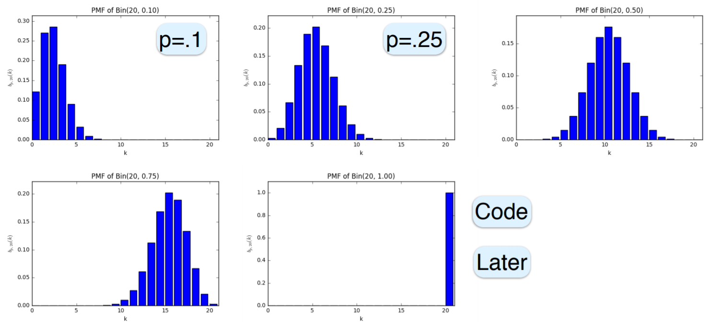
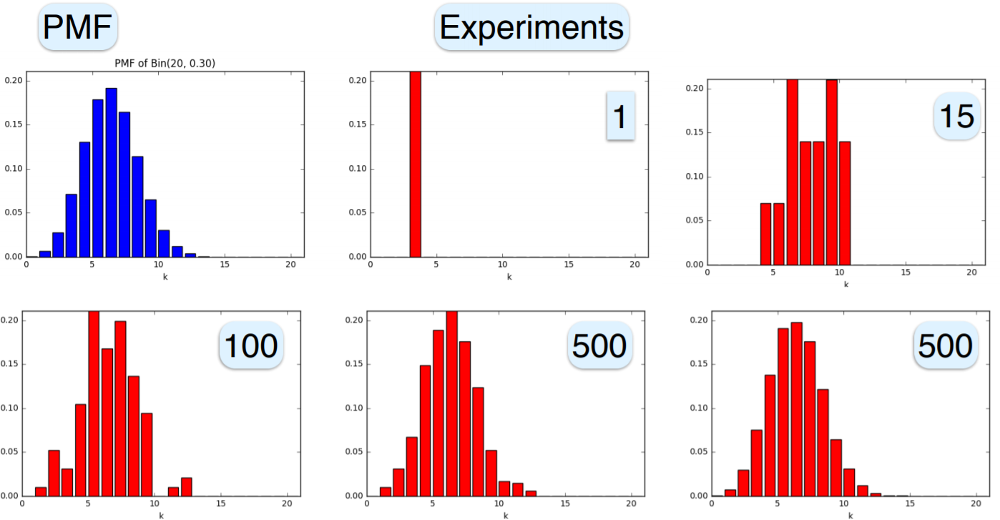

# Topic 8: Discrete Distribution Families


## 8.0 Introduction

+ Distributions
  + discrete: Bernoulli, Binomial, Poisson, Geometric
  + continuous: uniform, exponential, Gaussian

+ Discussion
  + Motivation
  + Applications
  + Formulate
  + Visualize
  + Examples
  + Properties: $\mu \; Var\; \sigma$
  + Python: plot and experiment within NB

+ Show distribution
  + non-negative
  + sum to 1


+ [Original Slides](https://tinyurl.com/ybc73cpq)


### Problem Sets

1. For which value of the parameter $\alpha$ is the function $f(x)=\frac{2(10−x)+\alpha}{100}$ over $\{1,2, \cdots,10\}$ a p.m.f.?<br/>
  a. -1<br/>
  b. 0<br/>
  c. 1<br/>
  d. 2<br/>

  Ans: c<br/>
  Explanation: Following $\sum_{x = 1}^{10} f(x) = 1$, we have $\alpha = 1$


### Lecture Video

<a href="url" target="_BLANK">
  
</a><br/>


## 8.1 Bernoulli Distribution

+ Contents covered w/ Bernoulli distribution
  + simplest non-constant distribution
  + foundation of many others
  + parameters: $\mu, Var, \sigma$
  + repeated experiments

+ Jacob Bernoulli
  + 1655 ~ 1705
  + Theology $\to$ Mathematics
  + main contribution:
    + calculus, integrals
    + "Euler" number: $e = \lim_{n \to \infty} (1 + \frac 1 n)^n$; $e \to b$
    + ars conjectandi = The Art of Conjecture
    + First law of large numbers
  + mentored brother Johann: Medicine $\to$ Math, Dynasty

+ The simplest distribution
  + simplest: one value, constant, always the same, trivial, e.g., 5
  + simplest non-trivial
    + two values
    + simplest values: 0 and 1
    + Bernoulli coin

+ Bernoulli distribution
  + two values: 0 and 1, or failure and success
  + $B_p\quad 0 \le p \le 1$
  + $p(0) = 1-p = \overline{p} = q \quad p(1) = p$
  + unitary: $p(0) + p(1) = (1-p) + p = 1$
  + $X \sim B_p$:
    + Bernoulli
    + random variable, coin, experiment, trial

+ Characteristics
  + binary version of complex events
    + example
      + products: 80 good, 20 defective
      + select one: good or not
      + $\sim B_{.8}$
    + next child will be a boy: $\sim B_{.5}$
  + generalized to more complex variables
    + e.g., patient has one of three diseases
  + repeated trials yield \# successes
    + many important distributions
    + Binomial, Geometric, Poisson, Normal
  
+ Mean
  + $X \sim B_p \quad p(0) = 1-p \quad p(1) = p$
  + $E[X] = \sum p(x) \cdot x = (1-p) \cdot 0 + p \cdot 1$
    + e.g. $X \sim B_{.8} \to E[X] = 0.8$
  + $E[X] = \Pr(X=1)$
  + fraction of times expect to see 1

+ Variance
  + $X \sim B_p \to E[X] = p$
  + variance
    + easy route
    + $0^2 = 0 \quad 1^2 =1 \quad X^2 = X \quad E[X^2]=E[X] = p$
    + $Var(X) = E[X^2] - (E[X])^2 = p - p^2 = p(1-p) = pq$
  + standard deviation: $\sigma = \sqrt{pq}$
  + various $p$
    + $p = 0 \to E[X] = 0, \;Var(X) = 0, \;\sigma = 0$
    + $p = 1 \to E[X] = 1, \;Var(1) = 0, \;\sigma = 0$
    + $p = \tfrac12 \to E[X] = \tfrac12, \;Var(X) = \frac14, \;\sigma = \frac12$
    + $B_p$ varying most when $p = \frac12$

+ Independent trials
  + much of $B_p$ importance stems from multiple trials
  + most common type of Bernoulli distribution: independent ${\perp \!\!\!\! \perp}$
    + $0 \le p \le 1\quad X_1, X_2, X_3 \sim B_p \to {\perp \!\!\!\! \perp}$
    + $q \stackrel{\text{def}}{=} 1-p\quad \Pr(110) = p^2q = \Pr(101) = \Pr(011)$
  + generally, $X_1, X_2, \cdots, X_n \sim B_p \to  {\perp \!\!\!\! \perp}$
    + $x^n = x_1, x_2, \cdots, x_n \in \{0, 1\}^n$
    + $n_0$ = number of 0's; &nbsp;&nbsp;&nbsp;&nbsp;  $n_1$ = number of 1's
    + $\Pr(x_1, \dots, x_n) = p^{n_1} q^{n_0}$
    + e.g., $\Pr(10101) = p^{n_1} q^{n_0} = p^3 q^2$

+ Typical samples

  <table style="font-family: arial,helvetica,sans-serif; width: 40vw;" table-layout="auto" cellspacing="0" cellpadding="5" border="1" align="center">
    <thead>
    <tr style="font-size: 1.2em;">
      <th style="text-align: center; background-color: #3d64ff; color: #ffffff; width:10%;">Distribution</th>
      <th style="text-align: center; background-color: #3d64ff; color: #ffffff; width:20%;">Typical seq.</th>
      <th style="text-align: center; background-color: #3d64ff; color: #ffffff; width:20%;">Decscription</th>
      <th style="text-align: center; background-color: #3d64ff; color: #ffffff; width:20%;">Probability</th>
    </tr>
    </thead>
    <tbody>
    <tr> <td style="text-align: center;">$B_0$</td> <td style="text-align: center;">$0000000000$</td> <td style="text-align: center;">constant 0</td> <td style="text-align: center;">$1^{10} = 1$</td> </tr>
    <tr> <td style="text-align: center;">$B_1$</td> <td style="text-align: center;">$1111111111$</td> <td style="text-align: center;">constant 1</td> <td style="text-align: center;">$1^{10} = 1$</td> </tr>
    <tr> <td style="text-align: center;">$B_{0.8}$</td> <td style="text-align: center;">$1110111011$</td> <td style="text-align: center;">80% 1's</td> <td style="text-align: center;">$0.8^8 \cdot 0.2^2$ ${}^{\star}$</td> </tr>
    <tr> <td style="text-align: center;">$B_{0.5}$</td> <td style="text-align: center;">$1011010010$</td> <td style="text-align: center;">50% 1's ${}^{\S}$</td> <td style="text-align: center;">$0.5^{10}$</td> </tr>
    <tr>
      <td colspan="4">${}^\star$: not most probable, most probable: $1, \dots, 1$, unlikely to be seen<br/>${}^\S$: fair coin flip</td>
    </tr>
    </tbody>
  </table>

+ Summary: Bernoulli distribution
  + simplest non-constant distribution
  + notation: $B_p \quad 0 \le p \le 1$
  + typical values
    + 0 and 1
    + $p(1) = p \quad p(0) = 1 - p$
  + properties:
    + $\mu = p$
    + $Var = pq$
    + $\sigma = \sqrt{pq}$
  + foundation of many other distributions


+ [Original Slides](https://tinyurl.com/yb6l3dwa)


### Problem Sets

0. Every random variable distributed over {0, 1} is Bernoulli.<br/>
  a. Yes<br/>
  b. Not necessarily<br/>

  Ans: <span style="color: magenta;">a</span><br/>
  Explanation: Every random variable over {0,1} attains the value 1 with some probability (p) and 0 with the remaining probability $(1-p)$, hence is \(B_p\). So the answer is Yes.


1. $X \sim B_p$ with  $p>0.5$  and  $Var(X)=0.24$. Find<br/>
  a. $p$,<br/>
  b. $E[X]$.<br/>

  Ans: a. (0.6); b. (0.6)<br/>
  Explanation:
    + For a Bernoulli distribution, $E[X^2]=E(X)=p$. Thus $Var(X)=E[X^2]−(E[X])^2=p−p^2=p(1−p)$. Since $0.24=Var(X)=p(1−p)$ and $p \ge 0.5$, we must have $p=0.6$.
    + $E[X]=p=0.6$.


2. Which of the following hold for two Bernoulli variables?<br/>
  a. Independent implies uncorrelated,<br/>
  b. Uncorrelated implies independent.<br/>

  Ans: ab<br/>
  Explanation
    + True. It is trivial.
    + True. Let  $X \sim B_p_x, Y \sim B_p_y$.

      If $X$ and $Y$ are uncorrelated, $\text{Cov}(X, Y) = E(XY) - E(X)E(Y) \\ = \sum_{x = 0}^{1} \sum_{y = 0}^{1} xy\Pr(X = x, Y = y) - p_{x}p_{y} \\ = \Pr(X = 1, Y = 1) - p_{x}p_{y} \\ = \Pr(X = 1 | Y = 1)\Pr(Y = 1) - p_{x}p_{y} \\ = (\Pr(X = 1 | Y = 1) - p_{x})p_{y} \\ = 0$.

      Hence, $\Pr(X=1 \mid Y=1)=p_x=\Pr(X=1)$ and similarly $\Pr(Y=1 \mid X=1)=p_y=\Pr(Y=1)$. From that, we have $\Pr(X = 0 | Y = 1) = \frac{\Pr(Y = 1 | X = 0)\Pr(X = 0)}{\Pr(Y = 1)} =$ $1 - p_{x} = \Pr(X = 0) \implies$ $\Pr(Y = 1 | X = 0) = p_{y} = \Pr(Y = 1)$, and similarly $\Pr(X=1|Y=0)=p_x=\Pr(X=1)$. Thus, $X$ and $Y$ are independent.


3. Consider ten independent $B_{0.3}$ trials. Which of the following is the most probable?<br/>
  a. 0000000000<br/>
  b. 1111111111<br/>
  c. 1110000000<br/>
  d. 0001111111<br/>

  Ans: a<br/>
  Explanation: Under $B_{0.3}$, the probability of sequence with $w$ ones and $n−w$ zeros is $0.3^w \cdot 0.7^{(n−w)}=0.7^n \cdot (3/7)^w$, which decreases with $w$. Hence 0000000000 is the most likely sequence with probability $0.7^{10}$, while 1111111111 is least likely with probability $0.3^{10}$. This is also logical as under $B_{0.3}$, every bit is more likely to be a 0 than a 1.


4. Consider ten independent $B_{0.3}$ trials. Which of the following is the most probable?

  Try to reconcile with the previous question.<br/>
  a. 10 zeros<br/>
  b. 10 ones<br/>
  c. 3 ones and 7 zeros<br/>
  d. 3 zeros and 7 ones.<br/>

  Ans: c<br/>
  Explanation: First, intuitively, for $B_{0.3}$ we expect to see roughly 30% 1's.  Slightly more rigorously, while individually, a sequence with 10 zeros is the most likely among all sequences, there is only one such sequence. When you balance the probability of each sequence with the number of such sequence, you see that observing a sequence with 3 ones and 7 zeros is most likely. We will do this calculation formally when we study binomial distributions in the next section.


5. Bernoulli modifications

  Let $X \sim B_{0.2}$. Find the Bernoulli parameter for the following random variables. Write $−1$ if they are not Bernoulli.
  a. $X^2$,
  b. $+\sqrt{X}$,
  c. $1 − X$,
  d. $−X$.

  Ans: a. (0.2); b. (0.2); c. (0.2); d. (-1)<br/>
  Explanation
    + Since $X \in \{0,1\}$, we have $X^2=X$.
    + Since $X \in \{0,1\}$, we have $+\sqrt{X}=X$.
    + $1−X$ takes values in {0,1}, hence is Bernoulli, and $1−X=1 \iff X=0$, which happens with probability 0.8.
    + $−X$ takes values in $\{0,−1\}$, hence is not Bernoulli.


6. Let $X \sim B_{0.4}$, $Y \sim B_{0.2}$, and they are independent. Find the Bernoulli parameter for the following random variables. Write $−1$ if they are not Bernoulli.<br/>
  a. $X⋅Y$,<br/>
  b. $XY$, recall that $0^ 0=1$,<br/>
  c. $|X−Y|$,<br/>
  d. $X+Y$.<br/>

  Ans: a. (0.08); b. (0.88); c. (0.44); d. (-1)<br/>
  Explanation
    + $X \cdot Y$ takes values in $\{0,1\}$ hence is Bernoulli. It is $1 \iff X=Y=1$ which happens with probability $0.4 cdot 0.2=0.08$.
    + $X^Y$ takes values in $\{0,1\}$, hence is Bernoulli. It is $0 \iff X=0$ and $Y=1$, which happens with probability $0.6 \cdot 0.2=0.12$, hence it is 1 with probability 0.88.
    + $|X−Y|$ takes values in $\{0,1\}$, hence is Bernoulli. It is $1 \iff X \neq Y$, which happens with probability $0.6 \cdot 0.2+0.4 \cdot 0.8=0.44$.
    + $X+Y$ takes values in $\{0,1,2\}$, hence is not Bernoulli.


7. Bernoulli sum

  $X=U+V$, where $U$ and $V$ are independent Bernoulli variables with different expectations but the same variance $0.21$. Find:<br/>
  a. $E(X)$,<br/>
  b. $Var(X)$,<br/>
  c. $\sigma_X$.<br/>

  Ans: a. (1); b. (0.42); c. (0.6481)<br/>
  Explanation
    + Let $U \sim B_p$ and $V \sim B_q$. Since $U$ and $V$ have the same variance, $p \cdot (1−p)=q \cdot (1−q)$, and since $p \neq q$, we must have $q=1−p$. Hence  $E[X]=E[U+V]=E[U]+E[V]=p+q=p+(1−p)=1$.
    + $Var(X)=Var(U)+Var(V)=0.42$.
    + $\sigma_X = \sqrt{Var(X)} = 0.6481$


8. Let $X$ be the number of heads when flipping four coins with heads probabilities 0.3, 0.4, 0.7, and 0.8. Find:<br/>
  a. $\Pr(X=1)$,<br/>
  b. $E(X)$,<br/>
  c. $Var(X)$.<br/>

  Ans: a. (); b. (); c. ()<br/>
  Explanation
    + $\Pr(X = 1) = 0.3 \cdot 0.6 \cdot 0.3 \cdot 0.2 + 0.7 \cdot 0.4 \cdot 0.3 \cdot 0.2 + 0.7 \cdot 0.6 \cdot 0.7 \cdot 0.2 + 0.7 \cdot 0.6 \cdot 0.3 \cdot 0.8 = 0.1872$
    + $E[X] = 0.3 + 0.4 + 0.7 + 0.8 = 2.2$
    + $Var(X) = 0.21 + 0.24 + 0.21 + 0.16 = 0.82$


9. Light bulbs

  Every light bulb is defective with 2% probability. What is the probability that a package of 8 bulbs will not suffice for a project requiring 7?

  Ans: 0.01034<br/>
  Explanation: Let $X \sim B(0.02,8)$ be the number of defective bulbs in a package. The box will not suffice if there are 2 or more defective bulbs, which happens with probability. $\Pr(X \gt 1) = 1 - \Pr(X = 0) - \Pr(X = 1) =$ $1 - \binom{8}{0} \cdot (1-0.02)^8 - \binom{8}{1} \cdot (1-0.02)^7 \cdot 0.02 = 0.0103.$


### Lecture Video

<a href="https://tinyurl.com/yajddf3n" target="_BLANK">
  
</a><br/>


## 8.2 Binomial Distribution

+ The Binomial distribution
  + $n$ independent Bernoulli experiments
  + each "success" w/ the same probability $p$
  + "failure" w/ probability $1 - p = \overline{p} = q$
  + $B_{p,n}$ or $B_{n, p}$: distribution of \# successes
    + $B_{n, p}$ more common
    + using $B_{p, n}$ as generalized $B_p$
    + $B_{p, n}$: natural for Poisson Binomial 
  + example: $n$ independent coin flips
    + $\Pr(\text{heads}) = p$
    + $B_{p, n}$: distribution of \# heads
    + e.g., $B_{\frac13, 5} \quad B_{.2, 10}$
  + no confusion: $n \in \Bbb{N}, \;0 \le p \le 1$
  + use $B_{p, n}$ because
    + generalized $B_p$
    + main parameter: $p$
    + extending to Poisson Binomial

+ Applications
  + positive responses to a treatment
  + faulty components
  + rainy days in a month
  + delayed flights

+ Small $n$
  + $n$ independent experiments
  + each w/ success probability $p$
  + failure probability: $q = 1 - p$
  + $b_{p, n}(k)$: probability of $k$ success, $0 \le k \le n$
  + example:
    + $n = 0$: $seq = \Lambda \quad k = 0 \quad b_{p, 0}(k) = 1$
    + $n = 1$: 
      + seq = 0: $k = 0 \quad b_{p, 1}(k) = q$
      + seq = 1: $k = 1 \quad b_{p, 1}(k) = p$
      + $p + q = 1$
    + $n = 2$:
      + seq = 00: $k = 0 \quad b_{p, 2}(k) =q^2$
      + seq${}^\star$ = 01, 10: $k = 1 \quad b_{p, 2}(k) = 2pq$
      + seq = 11: $k = 2 \quad b_{p, 2}(k) = p^2$
      + $p^2 + 2pq + q^2 = (p+q)^2 = 1^2 = 1$
      + ${}^\star$: each sequence w/ probability $pq$

+ General $n$ and $k$
  + $n$ ${\perp \!\!\!\! \perp}$ $B_p$ experiments
    + $k$ successes: success = 1
    + $0 \le k \le n$
  + $b_{p, n}(k) = p(k \text{ successes}) = \binom n k p^k q^{n-k}$
    + every $k$ successes sequence
      + $n-k$ failures
      + prob. $p^k \cdot q^{n-k}$
    + $\tbinom n k$ such sequences
  + distribution over $n+1$ values, including $0$ and $n$

+ Unitary
  + $0 \le k \le n \quad p(X = k) = b_{p, n}(k) = \binom n k p^k q^{n-k}$
  + Binomial theorem:

    \[ (a + b)^n = \sum_{k=0}^n \binom n k a^k b^{n-k} \]

  + sum to 1?

    \[ \sum_{k=0}^n b_{p, n} (k) = \sum_{k=0}^n p^k q^{n-k} = (p + q)^n = 1^n = 1 \]

+ Simulation: Typical distributions
  + $n= 20 \to b_{p, 20}(k)$
  + coin: $\Pr(\text{heads}) = p \quad$ 20 flips $\Pr(k, \text{ heads})$

  <div style="margin: 0.5em; display: flex; justify-content: center; align-items: center; flex-flow: row wrap;">
    <a href="https://tinyurl.com/yajcj3dk" ismap target="_blank">
      
    </a>
  </div>

+ Simulation: Typical samples

  <div style="margin: 0.5em; display: flex; justify-content: center; align-items: center; flex-flow: row wrap;">
    <a href="https://tinyurl.com/yajcj3dk" ismap target="_blank">
      
    </a>
  </div>

+ Example: Multiple choice
  + exam w/ 6 multiple-choice questions, each w/ 4 possible answers
  + each question, student selects one of the 4 answers randomly
  + $X$ = \# correct answer $\sim B_{\frac14, 6}$
  + passing: $\ge 4$ correct answers
  + $\Pr(\text{passing}) = ?$

    \[\begin{align*}
      \Pr(4) &= \tbinom64 \cdot (\tfrac14)^4 \cdot (\tfrac34)^2 \approx 0.0329 \\
      \Pr(5) &= \tbinom65 \cdot (\tfrac14)^5 \cdot (\tfrac34)^1 \approx 0.00439 \\
      \Pr(6) &= \tbinom66 \cdot (\tfrac14)^6 \cdot (\tfrac34)^0 \approx 0.000244 \\
      \Pr(\ge 4) &= \Pr(4) + \Pr(5) + \Pr(6) \approx 0.03759
    \end{align*}\]

+ Interpretation as a Sum
  + $B_{p, n}$: a sum of $n\;B_p$
  + $X_1, \cdots, X_n \sim B_p\quad {\perp \!\!\!\! \perp}$
  + $X \stackrel{\text{def}}{=} \sum_{i=1}^n X_i$
  + $\Pr(X=k) = \Pr(\text{exactly } k \text{ of } X_1, \cdots, X_n \text{ are } 1) = \binom n k p^k q^{n-k} = b_{p, n}(k)$
  + $X \sim B_{p, n}$
  + applied to mean and variance

+ Mean and Variance
  + $X \sim B_{p, n}$
  + $X = \sum_{i=1}^n X_i \qquad X_1, \cdots, X_n \sim B_p \quad{\perp \!\!\!\! \perp}$

    \[\begin{align*}
      E[X] &= E\left[\sum_{i=1}^n X_i\right] \underbrace{=}_{\text{LE}} \sum E[X_i] \underbrace{=}_{B_p} \sum p = np \\\\
      Var(X) &= Var \left(\sum_{i=1}^n X_i \right) \underbrace{=}_{{\perp \!\! \perp}} \sum Var(X_i) \underbrace{=}_{B_p} \sum pq = npq \\\\
      \sigma &= \sqrt{npq}
    \end{align*}\]

+ Example: Multiple choice
  + exam w/ 6 multiple-choice questions, each w/ 4 possible answers
  + for each question, student selects one of the 4 answers randomly
  + $X$ = \# correct answers $\sim B_{\frac14, 6}$
  + mean: $E[X] = np = 6 \cdot \frac14 = 1.5$
  + standard deviation: $\sigma = \sqrt{npq} = \sqrt{6 \cdot \frac14 \cdot \frac34} = \frac{\sqrt{18}}{4}$

+ Example: Voting
  + for simplicity odd \# voters: $2n+1$
  + each equally likely D or R
  + $\Pr(\text{voter makes a difference}) = \Pr(\text{other 2n voters equally split})$

    \[\begin{align*}
      b_{p, n}(k) &= \binom n k p^k q^{n-k} = \binom{2n}{n} \frac{1}{2^n} \cdot \frac{1}{2^n} = \frac{(2n)!}{n! \cdot n! \cdot 2^n \cdot 2^n} \\\\
      &\approx \frac{\sqrt{2\pi \cdot 2n} (\frac{2n}{e})^{2n}}{\left({\sqrt{2\pi n}\left(\frac n e\right)^n}\right)^2 2^{2n}} = \frac{1}{\pi n} \quad(\color{Magenta}{\gg \frac 1 n})
    \end{align*}\]

  + applying Stirling approximation

    \[ n! \approx \sqrt{2\pi n}\left(\frac n e\right)^n \]

+ Poisson binomial
  + generalizing the binomial distribution $n \ge 1$
    + binomial distribution:
      + notation: $B_{p,n}$
      + for $ 1 \le i \le n \quad X_i \sim B_p \quad {\perp \!\!\!\! \perp}$
      + $X = \sum_{i=1}^n X_i$
    + Poisson binomial
      + notation: $PB_{p_1, \dots, p_n}$
      + for $ 1 \le i \le n \quad X_i \sim B_{p_i} \quad {\perp \!\!\!\! \perp}$
      + $X = \sum_{i=1}^n X_i$
  + examples
    + $PB_{\frac14, \frac23} \to X_1 \sim B_{\frac14} \;\; X_2 \sim B_{\frac23} \quad {\perp \!\!\!\! \perp}$<br/><br/>

    <table style="font-family: arial,helvetica,sans-serif; width: 30vw;" table-layout="auto" cellspacing="0" cellpadding="5" border="1" align="center">
      <thead>
      <tr style="font-size: 1.2em;">
        <th style="text-align: center; background-color: #3d64ff; color: #ffffff; width:10%;">$X_1$</th>
        <th style="text-align: center; background-color: #3d64ff; color: #ffffff; width:10%;">$X_2$</th>
        <th style="text-align: center; background-color: #3d64ff; color: #ffffff; width:20%;">$\Pr$</th>
        <th style="text-align: center; background-color: #3d64ff; color: #ffffff; width:10%;">$X$</th>
        <th style="text-align: center; background-color: #3d64ff; color: #ffffff; width:10%;">$\Pr(X)$</th>
      </tr>
      </thead>
      <tbody>
      <tr>
        <td style="text-align: center;">$0$</td> <td style="text-align: center;">$0$</td> <td style="text-align: center;">$\frac34 \cdot \frac13 = \frac14$</td> <td style="text-align: center;">$0$</td> <td style="text-align: center;">$\frac14$</td>
      </tr>
      <tr>
        <td style="text-align: center;">$0$</td> <td style="text-align: center;">$1$</td> <td style="text-align: center;">$\frac34 \cdot \frac23 = \frac12$</td> <td rowspan="2" style="text-align: center;">$1$</td> <td rowspan="2" style="text-align: center;">$\frac{7}{12}$</td>
      </tr>
      <tr>
        <td style="text-align: center;">$1$</td> <td style="text-align: center;">$0$</td> <td style="text-align: center;">$\frac14 \cdot \frac 13 = \frac{1}{12}$</td>
      </tr>
      <tr>
        <td style="text-align: center;">$1$</td> <td style="text-align: center;">$1$</td> <td style="text-align: center;">$\frac14 \cdot \frac23 = \frac16$</td> <td style="text-align: center;">$2$</td> <td style="text-align: center;">$\frac16$</td>
      </tr>
      </tbody>
    </table>

+ Expectation and Variance
  + $X \sim PB_{p_1, p_2, \cdots, p_n} \qquad X = \sum_{i=1}^n X_i \qquad X_i \sim B_{p_i}$
  
    \[\begin{align*}
      E[X] &= E\left[\sum_{i=1}^n X_i\right] = \sum_{i=1}^n E[X_i] = \sum_{i=1}^n p_i \\\\
      Var(X) &= Var\left(\sum_{i=1}^n X_i\right) = \sum_{i=1}^n Var(X_i) = \sum_{i=1}^n p_i(1-p_i)
    \end{align*}\]

  + $p(k)$:
    + no closed form
    + computationally

+ Plot & Sample in Python
  + Notebook: plot distribution, and generating data
  + import libraries

    ```python
    from scipy.stats import binom
    from matplot.pyplot import plot, hist
    ```

  + coin heads w/ prob .3, 50 flips: prob of k heads $\sim B_{.3, 50}$

    ```python
    plot(range(51), binom.pmf(k=range(51), n=50, p=.3))
    ```

  + repeat 1000 times $\to$ histogram

    ```python
    hist(binom.rvs(n=50, p=.3, size=1000))
    ```

+ Example: Coin flips
  + most basic convergence to average: $B(p)$
  + flip $n\; B(p)$ coin, average \# 1's will approach $np$
  + probability of a sequence w/ $k$ 1's and $(n-k)$ 0's is $p^k q^{n-k}$
  + Wolog assume $p > 0.5$, then most likely is $1^n$
  + yet by WLLN w/ probability $\to 1$, roughly $pn$ 1's and $qn$ 0's
  + why do we observe these sequences and not the most likely ones?
  + strength in \#s: \# sequences of a given composition increasing near $\frac12$
  + $pn$ balances \# $x$ probability


+ [Original Slides](https://tinyurl.com/yajcj3dk)


### Problem Sets

0. If you flip a fair coin 10 times and let X be the total number of heads, then Var(X) is<br/>
  a. 1.5<br/>
  b. 2.5<br/>
  c. 3.5<br/>
  d. None of the above<br/>

  Ans: b<br/>
  Explanation: The answer is $Var(X) = np(1 - p) = 2.5.$


1. There are 5 traffic signals between your home and work. Each is red with probability 0.35, independently of all others. Find:

  1) the probability of encountering no red lights,<br/>
  a. 2.26%<br/>
  b. 5.2%<br/>
  c. 11.6%<br/>
  d. 17.5%<br/>

  2) the probability of encountering only red lights,<br/>
  a. 0.03%<br/>
  b. 0.52%<br/>
  c. 1.16%<br/>
  d. 16.4%<br/>

  3) the expected number of red lights you will encounter?<br/>
  a. 0.75 <br/>
  b. 1.42 <br/>
  c. 1.75 <br/>
  d. 2.25 <br/>

  Ans: 1. (c); 2. (b); c. (c)<br/>
  Explanation
    + $(1 - 0.35)^5 = 0.116$
    + $0.35^5=0.0052$
    + The expectation of the sum is the sum of the expectations. $0.35+0.35+0.35+0.35+0.35=1.75$.


2. If every student is independently late with probability 10%, find the probability that in a class of 30 students:

  1) nobody is late,<br/>
  a. 4.2%<br/>
  b. 8.0%<br/>
  c. 17.4%<br/>
  d. 33.3%<br/>

  2) exactly 1 student is late.<br/>
  a. 3.33%<br/>
  b. 5.25%<br/>
  c. 7.75%<br/>
  d. 14.1%<br/>

  Ans: 1. (a); b. (d)<br/>
  Explanation
    + $(1 - 0.1)^{30} = 0.042$
    + $(1 - 0.1)^{29} \times 0.1 \times \binom{30}{1} = 0.141$


3. A coin with heads probability 0.6 is tossed 6 times, calculate the probability of observing:<br/>
  a. exactly two heads,<br/>
  b. at most one tails,<br/>
  c. an even number of heads.<br/>

  Ans: a. (0.13824); b (0.23328); c. (0.5)<br/>
  Explanation
    + The number of heads, $H$ is distributed as $H \sim Binomial(6,0.6)$. Thus the probability here is $\Pr(H=2)=\binom62 0.6^2 c\dot 0.44=0.13824$.
    + The number of tails, $T$ is distributed as $T \sim Binomial(6,0.4)$. Thus the probability here is $\Pr(T=0)+\Pr(T=1) = \binom60 0.6^6+\binom61 0.4^1\cdot 0.6^5 = 0.23328$
    + Using the distribution of $H$, the probability here is $\Pr(H=0)+\Pr(H=2)+\Pr(H=4)+\Pr(H=6)$ $=\binom60 0.4^6+\binom62 0.6^2\cdot 0.4^4+\binom64 0.6^4\cdot 0.4^2+\binom66 0.6^6=0.50032$


4. A Binomial distribution $B_{p,n}$, where $p \neq 0$, has the same mean and standard deviation, namely $\mu=σ$.

  Find the mean of $B_{p,n+1}$

  Ans: 1<br/>
  Explanation: Since $B_{p,n}$ has $\sigma= \mu$, we have $np=\sqrt{npq}$, hence $1−p=q=np$, or $p⋅(n+1)=1$.


5. For $X \sim B_{0.7,10}$, find:<br/>
  a. $E(X)$,<br/>
  b. $Var(X)$,<br/>
  c. $\sigma_X$,<br/>
  d. The most likely outcome of $X$.<br/>

  Ans: a. (7); b. (2.1); c. (1.4491); d.(7)<br/>
  Explanation
    + $E[X]=np=7$.
    + $Var(X)=np(1−p)=2.1$.
    + $\sigma_X = \sqrt{Var(X)} = 1.4491$
    + $\Pr(X = 7) = \underset{x}{\max} \Pr(X = x)$

6. Ten balls are randomly dropped into four urns. Let $X$ be the number of balls dropped into one pre-selected urn. Find:<br/>
  a. $\Pr(X=0)$,<br/>
  b. $\Pr(X=1)$,<br/>
  c. $E(X)$,<br/>
  d. $Var(X)$.<br/>

  Ans: a. (0.05631); b. (0.1877); c. (2.5); d. (1.875)<br/>
  Explanation
    + Clearly $X$ is distributed $B_{1/4,10}$. Hence $\Pr(X=0)=\binom{10}0\cdot(1/4)^0\cdot(3/4)^{10}=(3/4)^{10}=0.056$
    + $\Pr(X = 1) = \binom{10}1 \cdot (1/4)^1 \cdot (3/4)^9=0.188$
    + $E(X) = np = 10\cdot\frac14=\frac52.$
    + $Var(X)= np(1-p) = 10\cdot\frac14\frac34=\frac{30}{16}=\frac{15}{8}$


7. Our TA owns four Porsches, each works  80%  of the time, and two Ferraris, each works  60%  of the time. What is the probability that on a given day, at least half of the Porsches and at least half of the Ferraris work?

  Ans: 0.8172<br/>
  Explanation: Let $Q$ be the number of Porshes that work and $F$ be the number of Ferraris that work.  $P(Q\ge 2)=1-P(Q=0)-P(Q=1)=$ $1-{4\choose 0}0.2^4-{4\choose 1}0.8^1\cdot 0.2^3=$ $0.9728$. $P(F\ge 1)=1-P(F=0)=$ $1-{2\choose 0}0.4^2=0.84$.  Therefore the required probability is $P(Q\ge 2)\cdot P(F\ge 1)=0.817152$.


8. Alice solves every puzzle with probability 0.6, and Bob, with probability 0.5. They are given 7 puzzle and each chooses 5 out of the 7 puzzles randomly and solves them independently. A puzzle is considered solved if at least one of them solves it. What is the probability that all the 7 puzzles are solved?

  Ans: <span style="color: magenta;">0.021</span><br/>
  Explanation: The probability that all the 7 puzzles are chosen is the probability that Bob chooses the two puzzles Alice did not pick, namely, \(\frac{\binom{5}{3}\binom22}{\binom{7}{5}} = \frac{10}{21}\). Every puzzle they both attempt, they both fail with probability \(0.4\cdot0.5=0.2\), hence at least one solves with probability \(1-0.2=0.8\). It follows that all puzzles are solved with probability \(\frac{10}{21}\cdot 0.6^2 \cdot 0.5^2 \cdot 0.8^3 = 0.0219\).


### Lecture Video

<a href="https://tinyurl.com/yamfgnzo" target="_BLANK">
  
</a><br/>


## 8.3 Poisson Distribution


+ [Original Slides]()


### Problem Sets


### Lecture Video

<a href="url" target="_BLANK">
  
</a><br/>


## 8.4 Geometric Distribution


+ [Original Slides]()


### Problem Sets


### Lecture Video

<a href="url" target="_BLANK">
  
</a><br/>


## 8.5 Geometric Distribution Example


+ [Original Slides]()


### Problem Sets


### Lecture Video

<a href="url" target="_BLANK">
  
</a><br/>


## Lecture Notebook 8


## Programming Assignment 8


