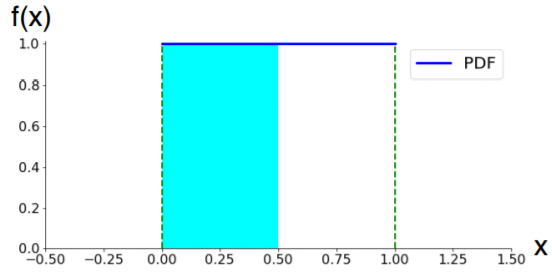
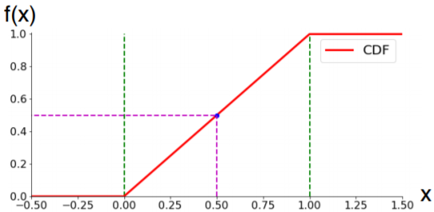
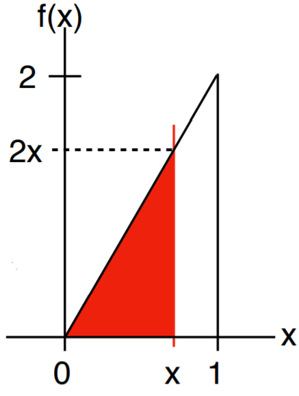
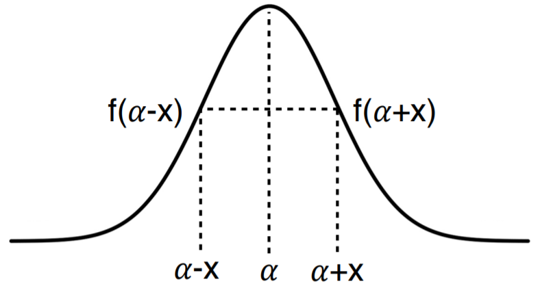
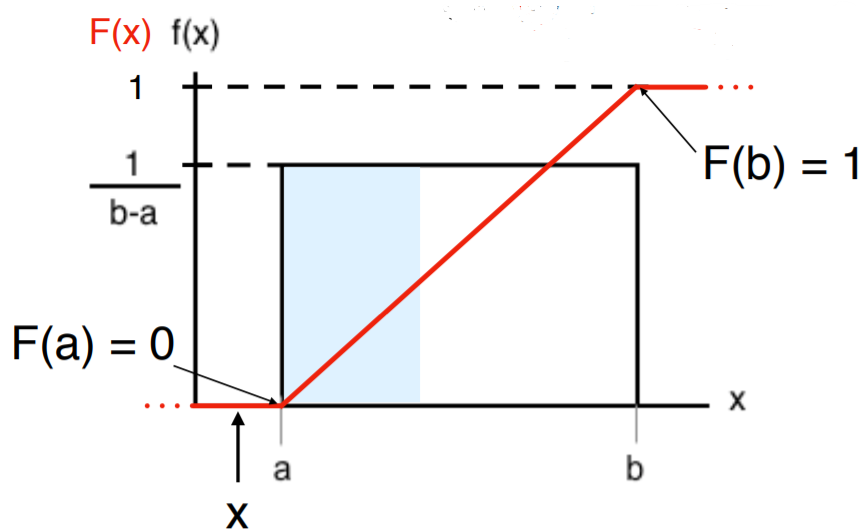
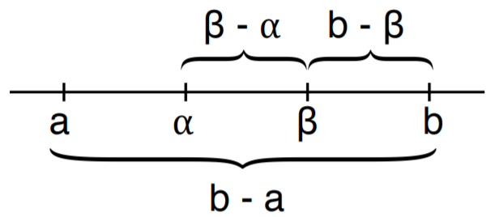
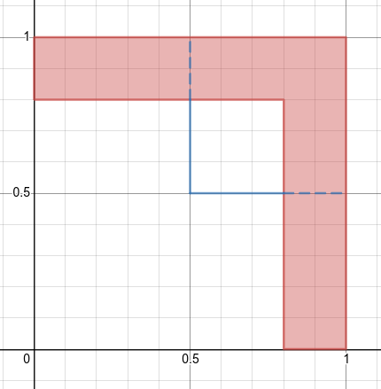

# Topic 9: Continuous Distribution Families


## 9.1 Continuous Distributions

+ Discrete to continuous
  + discrete distribution: countable \# values (finite or countably-infinite)
  + continuous distributions: uncountable \# values, intervals

+ Motivation
  + anything physics
    + time: flight, delivery, disease, life
    + space: height, storm area
    + mass: pet, cookie
    + temperature: air, body
  + nearly continuous variables
    + cost; stock, house, pork bellies
    + rates: interest, exchange, unemployment

+ Probability density function (PDF)
  + replacing the discrete pmf
  + relative likelihood of $x$: $f(x) \ge 0$
  + area under curve (area): $\int_{-\infty}^\infty f(x)\,dx$

+ Comparison

  <table style="font-family: arial,helvetica,sans-serif; width: 40vw;" table-layout="auto" cellspacing="0" cellpadding="5" border="1" align="center">
    <thead>
    <tr style="font-size: 1.2em;">
      <th style="text-align: center; background-color: #3d64ff; color: #ffffff; width:20%;"></th>
      <th style="text-align: center; background-color: #3d64ff; color: #ffffff; width:20%;">Discrete</th>
      <th style="text-align: center; background-color: #3d64ff; color: #ffffff; width:20%;">Continuous</th>
    </tr>
    <tr style="font-size: 1.2em;">
      <th style="text-align: center; background-color: #3d64ff; color: #ffffff; width:10%;">Prob. Func.</th>
      <th style="text-align: center; background-color: #3d64ff; color: #ffffff; width:20%;">mass (pmf)</th>
      <th style="text-align: center; background-color: #3d64ff; color: #ffffff; width:20%;">density (PDF)</th>
    </tr>
    </thead>
    <tbody>
    <tr> <td style="text-align: center;">$\ge 0$</td> <td style="text-align: center;">$p(x) \ge 0$</td> <td style="text-align: center;">$f(x) \ge 0$</td>  </tr>
    <tr> <td style="text-align: center;">$\sum = 1$</td> <td style="text-align: center;">$\sum_x p(x) = 1$</td> <td style="text-align: center;">$\int_{-\infty}^\infty f(x) dx = 1$</td> </tr>
    </tbody>
  </table>

+ Event probability
  + discrete: $\Pr(A) = \sum_{x\in A} p(x)$
  + continuous: $\Pr(A) = \int_{x \in A} f(x) dx$
  + typically interested in interval probability: $\Pr(a \le X \le b)$
  + AuC (area under curve) btw a and b
  + cumulative distribution function: $\Pr(X \le b) - \Pr(X \le a)$

+ Cumulative distribution function (CDF)

  <table style="font-family: arial,helvetica,sans-serif; width: 40vw;" table-layout="auto" cellspacing="0" cellpadding="5" border="1" align="center">
    <caption style="font-size: 1.0em; margin: 0.2em;">$F(X) \triangleq \Pr(X \le x)$</caption>
    <thead>
    <tr style="font-size: 1.2em;">
      <th style="text-align: center; background-color: #3d64ff; color: #ffffff; width:20%;"></th>
      <th style="text-align: center; background-color: #3d64ff; color: #ffffff; width:20%;">Discrete</th>
      <th style="text-align: center; background-color: #3d64ff; color: #ffffff; width:20%;">Continuous</th>
    </tr>
    </thead>
    <tbody>
    <tr> <td style="text-align: center;">PF $\to$ CDF</td> <td style="text-align: center;">$\displaystyle\sum_{u \le x} p(u)$</td> <td style="text-align: center;">$\int_{-\infty}^x f(u) du$</td> </tr>
    <tr> <td style="text-align: center;">CDF $\to$ PF</td> <td style="text-align: center;">$p(x) = F(x) - F(x^\ast)$</td> <td style="text-align: center;">$f(x) = F^\prime(x)$</td> </tr>
    <tr><td colspan="3">$x^\ast$: element preceding $x$</td></tr>
    </tbody>
  </table>

  + properties
    + $F(x) = $ integral
    + nondecreasing
    + $F(-\infty) = 0 \quad F(\infty) = 1$
    + continuous

+ Example: uniform distribution
  + PDF

    \[ f(x) = \begin{cases} 1 & 0 \le x \le 1 \\ 0 & \text{otherwise} \end{cases} \]

  + unitary: will it $\sum? \qquad \text{A.U.C. } = 1 \cdot 1 = 1$

    \[ \int_{-\infty}^\infty f(x) \,dx = \int^1_0 1\, dx = \left. x\right|^1_0 = 1 \]

  + CDF

    \[ F(x) = \int_{-\infty}^\infty  f(u) du = \begin{cases} 0 & x \le 0 \\ \int_0^x 1\,du = \left. u\right|_0^x = x & 0 < x \le 1 \\ 1 & 1 < x \end{cases} \]

    \[ F^\prime = \begin{cases} (0)^\prime = 0 & 0 \le x \\ (x)^\prime = 1 & 0 < x \le 1 \\ (1)^\prime = 0 & 1 < x \end{cases} \]

    <div style="margin: 0.5em; display: flex; justify-content: center; align-items: center; flex-flow: row wrap;">
      <a href="https://tinyurl.com/yb4obz4o" ismap target="_blank">
        
        
      </a>
    </div>

+ Example: triangle
  + PDF

  \[ f(x) = \begin{cases} 2x & 0 \le x \le 1 \\ 0 & \text{otherwise} \end{cases} \]

  + unitary: will it $\sum? \qquad \text{Area under curve } = 2 \cdot 1 \cdot \frac12 = 1$

    \[ \int_{-\infty}^{\infty} f(x) dx = \int_0^1 2x\,dx = \left.x^2 \right|_0^1 = 1 - 0 = 1 \]

  <div style="margin: 0.5em; display: flex; justify-content: center; align-items: center; flex-flow: row wrap;">
    <a href="https://tinyurl.com/yb4obz4o" ismap target="_blank">
      
    </a>
  </div>

  + CDF

    \[ F(x) = \int_{-\infty}^x f(u)\,du = \begin{cases} 0 & x \le 0 \\ \int_0^x 2u\,du = \left.u^2 \right|_0^x = x^2 = f(x) & 0 \le x \le 1 \\ 1 & 1 \le x \end{cases} \]

    \[ F^\prime(x) = \begin{cases} (0)^\prime = 0 & x < 0 \\ (x^2)^\prime = 2x & 0 \le x \le 1 \\ (1)^\prime = 0 & 1 < x \end{cases} \]


+ Infinite support
  + power paw distribution: PDF

    \[ f(x) = \begin{cases} \frac{1}{x^2} & x \ge 1 \\ 0 & x < 1 \end{cases} \]

  + unitary

    \[ \int_{-\infty}^\infty f(x) dx = \int_1^\infty \frac{1}{u^2}\, du = \left.\frac{-1}{u} \right|_1^\infty = 1 \]

  <div style="margin: 0.5em; display: flex; justify-content: center; align-items: center; flex-flow: row wrap;">
    <a href="https://tinyurl.com/ycl3n8dg" ismap target="_blank">
      
    </a>
  </div>

  + CDF

    \[ F(x) = \begin{cases} 0 & x \le 1 \\ \int_1^x \frac{1}{u^2} \,du = \left.\frac{-1}{u} \right|_1^x = 1 -\frac 1 x & x \ge 1 \end{cases} \]

    \[ F^\prime (x) = \begin{cases} (0)^\prime = 0 & x < 1 \\ (1 - \frac1 x)^\prime = \frac{1}{x^2} = f(x) & x \ge 1 \end{cases} \]

+ Interval probability

  \[ \Pr(a, b) = \Pr([a, b)) = \Pr((a, b]) = F(b) - F(a) \]

  + examples
    + uniform: $0 \le a \le b \le 1$

      \[ \Pr(a \le X \le b) = \begin{cases} \text{AuC } = (b-a) \cdot 1 = b-a \\ \int_a^b f(x)\,dx = \int_a^b 1\,dx = \left. x \right|_a^b = b-a \\ F(b) - F(a) = b-a \end{cases} \]

      + $\Pr(0.6 \le X \le 1.3) = \Pr(0.6 \le X \le 1) = 0.4$
      + $\Pr(0.6 \le X \le 1.3) = F(1.3) - F(0.6) = 1 - 0.6 = 0.4$
    + power law: $1 \le a \le b$

      \[ \Pr(a \le X \le b) = F(b) - F(a) = (1 - \frac 1 b) - (1 - \frac 1 a) = \frac1 a  - \frac 1 b \]

+ Differences between discrete and continuous

  <table style="font-family: arial,helvetica,sans-serif; width: 50vw;" table-layout="auto" cellspacing="0" cellpadding="5" border="1" align="center">
    <thead>
    <tr style="font-size: 1.2em;">
      <th style="text-align: center; background-color: #3d64ff; color: #ffffff; width:20%;">Discrete</th>
      <th style="text-align: center; background-color: #3d64ff; color: #ffffff; width:20%;">Continuous</th>
    </tr>
    </thead>
    <tbody>
    <tr> <td style="text-align: center;">$p(x) \le 1$</td> <td style="text-align: center;">$f(x)$ can be $> 1$</td> </tr>
    <tr> <td style="text-align: center;">Generally $p(x) \neq 0$</td> <td style="text-align: center;">$p(x) = 0$</td> </tr>
    <tr> <td rowspan="3" style="text-align: center;">Generally $\Pr(X \le a) \neq \Pr(X < a)$</td> <td style="text-align: center;">$\Pr(X \le a) = \Pr(X < a) = F(a)$</td> </tr>
    <tr> <td style="text-align: center;">$\Pr(X \ge a) = \Pr(X > a) = 1 -F(a)$</td></tr>
    <tr> <td style="text-align: center;">$\Pr(a \le X \le b) = \Pr(a < X < b) = F(b) - F(a)$</td> </tr>
    </tbody>
  </table>

+ Expectation
  + discrete: $E[X] = \sum x \cdot p(x)$
  + continuous: $E[X] = \int_{-\infty}^\infty xf(x)\, dx$
  + as discrete: average of many samples
  + properties
    + support set = [a, b]: $a \le E[X] \le b$
    + symmetry: $\exists\, \alpha, f(\alpha + x) = f(\alpha -x) \;\forall\, x \implies E[X] = \alpha$

  <div style="margin: 0.5em; display: flex; justify-content: center; align-items: center; flex-flow: row wrap;">
    <a href="https://tinyurl.com/yb4obz4o" ismap target="_blank">
      
    </a>
  </div>

  + examples
    + uniform: $E[X] = \int_{-\infty}^\infty x f(x)\,dx = \int_0^1 x \,1\, dx = \left.\frac{x^2}{2}\right|_0^1 = \frac12$
    + triangle: $E[X] = \int_0^1 x \cdot \,2x \,dx = \left.\frac{2x^3}{3}\right|_0^1 = \frac23$
    + power law: $E[X] = \int_1^\infty x\, \frac{1}{x^2}\,dx = \int_1^\infty \frac 1 x \,dx = \left.\ln x \right|_1^\infty = \infty$

+ Variance
  + definition: $Var(X) \triangleq E[(X - \mu)^2]$
    + discrete: $Var(x) = \sum_x p(x) (x - \mu)^2$
    + continuous: $Var(x) = \int_{-\infty}^\infty f(x)(x - \mu)^2\,dx$
  + as for discrete: $Var(X) = E[X^2] - (E[X])^2$

    \[\begin{align*}
      E[(X - \mu)^2] &= \int (x - \mu)^2 f(x)\,dx = \int (x^2 - 2x\mu + \mu^2)f(x)\,dx \\
      &= \int x^2f(x)\,dx - 2\mu \int xf(x)\,dx + \mu^2 \\
      &= E[X^2] - 2\mu^2 + \mu^2 = E[X^2] - \mu^2
    \end{align*}\]

  + standard deviation: $\sigma = \sqrt{Var(X)}$
  
+ Examples
  + uniform:
    + mean: $E[X] = \frac12$
    + $E[X^2] = \int_0^1 x^2 \,1\, dx = \left.\frac{x^3}{3}\right|_0^1 = \frac13$
    + variance: $Var(X) = E[X^2] - (E[X])^2 = \frac13 - \frac14 = \frac{1}{12}$
    + standard deviation: $\sigma = \frac{1}{\sqrt{12}} = \frac{1}{2\sqrt{3}}$
  + triangle
    + mean: $E[X] = \frac23$
    + $E[X^2] = \int_0^1 x^2 \, 2x \, dx = \left.\frac24 x^4 \right|_0^1 = \frac12$
    + variance: $Var(X) = E[X^2] - (E[X])^2 = \frac12 - (\frac23)^2 = \frac{9-8}{18} = \frac{1}{18}$
    + standard deviation: $\sigma = \frac{1}{\sqrt{18}} = \frac{1}{3\sqrt{2}}$

+ Discrete vs. Continuous

  <table style="font-family: arial,helvetica,sans-serif; width: 40vw;" table-layout="auto" cellspacing="0" cellpadding="5" border="1" align="center">
    <thead>
    <tr style="font-size: 1.2em;">
      <th style="text-align: center; background-color: #3d64ff; color: #ffffff; width:10%;"></th>
      <th style="text-align: center; background-color: #3d64ff; color: #ffffff; width:20%;">Discrete</th>
      <th style="text-align: center; background-color: #3d64ff; color: #ffffff; width:20%;">Continuous</th>
    </tr>
    </thead>
    <tbody>
    <tr> <th>Prob. Fun.</th> <td style="text-align: center;">pmf: p</td> <td style="text-align: center;">PDF: f</td> </tr>
    <tr> <th>$\ge 0$</th> <td style="text-align: center;">$p(x) \ge 0$</td> <td style="text-align: center;">$f(x) \ge 0$</td> </tr>
    <tr> <th>unitary</th> <td style="text-align: center;">$\sum p(x) = 1$</td> <td style="text-align: center;">$\int f(x)\,dx = 1$</td> </tr>
    <tr> <th>$\Pr(A)$</th> <td style="text-align: center;">$\sum_{x \in A} p(x)$</td> <td style="text-align: center;">$\int_{x \in A} f(x)\,dx$</td> </tr>
    <tr> <th>$F(X)$</th> <td style="text-align: center;">$\sum_{u \le x} p(u)$</td> <td style="text-align: center;">$\int_{-\infty}^x f(u)\, dx$</td> </tr>
    <tr> <th>$\mu = E[X]$</th> <td style="text-align: center;">$\sum x p(x)$</td> <td style="text-align: center;">$\int xf(x)\, dx$</td> </tr>
    <tr> <th>$Var(X)$</th> <td style="text-align: center;">$\sum (x-\mu)^2 p(x)$</td> <td style="text-align: center;">$\int (x-\mu)^2 f(x)\,dx$</td> </tr>
    </tbody>
  </table>


+ [Original Slides](https://tinyurl.com/yb4obz4o)


### Problem Sets

0. Which of the following is true about a continuous random variable on $\Bbb{R}$?<br/>
  a. Its pdf must integrate to 1 on $\Bbb{R}$<br/>
  b. Its cdf must integrate to 1 on $\Bbb{R}$<br/>
  c. None of the above<br/>

  Ans: a<br/>
  Explanation: Its pdf must integrate to 1 on $\Bbb{R}$.


1. \(F\) is the cumulative distribution function for a continuous random variable. If \(F(b) - F(a) = 0.20\), then<br/>
  a. \([a,b]\) has length \(0.20\)<br/>
  b. \(P(X = b) - P(X = a) = 20\%\)<br/>
  c. \(P(X\in(a,b])=20\%\)<br/>
  
  Ans: c<br/>
  Explanation: Recall that $F(b)=P(X \le b)$, $F(a)=P(X \le a)$. Hence $P(a < X \le b)=F(b)−F(a)=0.2$.


2. Which of the following holds for all continuous probability distribution function \(f(x)\) having support set \(\mathbb{R}\)?<br/>
  a. \(\forall x\in\mathbb{R},\quad f(x)\ge 0\)<br/>
  b. \(\forall x\in\mathbb{R},\quad f(x)\le 1\)<br/>
  c. \(\exists x\in\mathbb{R},\quad f(x)\le 1\)<br/>
  d. If the limits of \(f(x)\) at positive and negative infinity exist, then \(\lim_{x\rightarrow\infty}f(x)=\lim_{x\rightarrow -\infty}f(x)=0\)<br/>

  Ans: <span style="color: magenta;">ad</span><br/>
  Explanation
  + By definition, $f(x) \ge 0$.
  + Consider Gaussian $N(0,1/(8\pi))$. For this probability density function, $f(0)=2>1$.
  + If $f>1, \forall x \in \Bbb{R}$, $\int_{\Bbb{R}} f(z)dz= \infty$, but we require $\int_{\Bbb{R}} f(z)dz=1$.
  + Suppose $\exists \epsilon, x_0>0$ such that $\forall\, x \ge x_0,f(x)> \epsilon$, then $\int_{\Bbb{R}} f(z)dz= \infty$. Thus there cannot exist such an $\epsilon, x_0>0$ and hence $\lim_{x \to \infty} f(x)=0$. Similarly $\lim_{x \to −\infty} f(x)=0$.


3. Power Law

  Let  X  be a random variable with pdf $f_X(x) = C x^{−\alpha}, x \ge 1$.

  a. If $\alpha = 2$, $C=$?<br/>
  b. If $\alpha = 3$, $C=$?<br/>
  c. $E(X)=$?<br/>

  Ans: a. (1); b(12; c(2)<br/>
  Explanation: 
    + $\int_{-\infty}^{\infty} f_X(x) dx = \int_{1}^{\infty} Cx^{-2} dx = C = 1$
    + $\int_{-\infty}^{\infty} f_X(x) dx = \int_{1}^{\infty} Cx^{-3} dx = \frac{C}{2} = 1$
    + $E(X) = \int_{-\infty}^{\infty} x \cdot f_X(x) dx = \int_{1}^{\infty} 2x^{-2} dx = 2$


### Video Links

<a href="https://tinyurl.com/yac5tk4g" target="_BLANK">
  
</a><br/>


## 9.2 Functions of Random Variables

+ Functions of random variable
  + examples
    + $X$: income; $Y = 0.3X$: income tax
    + $X$: driving speed, $Y=2^x$: speeding ticket
  + $X \sim f_X$: $f_X$ known distribution
  + $Y = g(X)$: $g$ known deterministic function
  + what is the distribution of $Y$: $f_Y$?

+ Power law
  + $a > -1$

    \[ \int_0^1 \underbrace{(a+1) x^a}_{\ge 0} dx = \left. x^{a+1} \right|_0^1 = 1 \]

  + pdf

    \[ f(x) = \begin{cases} (a+1) x^a & 0 \le x \le 1 \\ 0 & \text{otherwise} \end{cases} \]

  + CDF: $a \le x \le 1$

    \[ F(x) = \int_0^x (a+1) u^a du = \left. u^{a+1} \right|_0^x = x^{a+1} \]

  + example
    + $X \sim f(x) = 3x^2 \quad F(x) = x^3 \quad 0 \le x \le 1$
    + $g \nearrow \to Y = g(X) \triangleq X^{\frac32}$
      + $0 \le x \le 1 \to 0 \le y \le 1$

        \[ F_Y(y) = \Pr(Y \le y) = \Pr(X^{\frac32} \le y) = \Pr(X \le y^{\frac23}) = F_X(y^{\frac23}) = y^2 \]

      + $F_Y(0) = 0 \quad F_Y(1) = 1$
      + $f_Y(y) = F_Y^\prime(y) = 2y$
    + $g \searrow \to Y = g(X) \triangleq X^{-3}$
      + $0 \le x \le 1 \to y \ge 1$

        \[\begin{align*}
          F_Y(y) &= \Pr(X \le y) = \Pr(X^{-3} \le y) = \Pr(X \ge y^{\frac{-1}{3}}) \\
          &= 1 - \Pr(X \le y^{\frac{-1}{3}}) = 1 - F_X(y^{\frac{-1}{3}}) = 1 - y^{-1} 
        \end{align*}\]

      + $F_Y(1) = 0 \quad F_Y(\infty) = 1$
      + $f_Y(y) = F_Y^\prime(y) = y^{-2}$

+ General power law function
  + $Y = g(X)$ w/ $g \nearrow$
    + $F_Y \to F_X$

      \[\begin{align*}
        F_Y (y) &\triangleq \Pr(Y \le y) = \Pr(g(X) \le y) \\
        &= \Pr(X \le^{-1}(y)) = F_X(g^{-1}(y)) \hspace{2em} (h(y) \triangleq g^{-1}(y)) \\
        &= F_X(h(y))
      \end{align*}\]

    + $f_Y \to f_X$

      \[\begin{align*}
        f_Y(y) &= F^\prime_Y (y) = [F_X(h(y))]^\prime \\
        &= F_X^\prime(h(y)) \cdot h^\prime(y) = f_X(h(y)) \cdot h^\prime(y)
      \end{align*}\]

    + example: $f_X(x) = 3x^2 \quad F_X(x) = x^3 \quad g(x) = x^{\frac32} \quad h(y) = y^{\frac23} \quad f_Y(y) = 2y$
      + $F_Y(y) = \Pr(Y \le y) = \Pr(X^{\frac32} \le y) = \Pr(X \le y^{\frac23}) = F_X(y^{\frac23})$
      + $f_Y(y) = F^\prime(y) = [(y^{\frac23})]^\prime = 3(y^{\frac23})^2 \cdot \frac23 y^{-\frac13} = 2y$

  + $Y = g(X)$ w/ $g \searrow$
    + $F_Y \to F_X$

      \[\begin{align*}
        F_Y(y) &\triangleq \Pr(g(X) \le y) = \Pr(X \ge g^{-1}(y)) \\
        &= 1 - \Pr(X \le g^{-1}(y)) = 1 - F_X(g^{-1}(y)) \\
        &= 1 - F_X(h(y))
      \end{align*}\]

    + $f_Y \to f_X$

      \[\begin{align*}
        f_Y(y) &= F_Y^\prime(y) = [1 - F_X(h(y))]^\prime = -F_X^\prime(h(y)) \cdot h^\prime(y) \\
        &= - f_X(h(y)) \cdot h^\prime(y)
      \end{align*}\]

  + Combining $g \nearrow$ and $g \searrow$
    + $g \nearrow \qquad f_Y(y) = f_X(h(y)) \cdot h^\prime(y)$
    + $g \searrow \qquad f_Y(y) = -f_Y(h(y)) \cdot h^\prime(y)$
    + both: $f_Y(y) = f_X(h(y)) \cdot |h^\prime(y)|$
    + alternative formulation:

      \[ f_Y(y) = \left. \frac{1}{|g^\prime(x)|} f_X(x) \right|_{y=g(x)} \]


+ [Original Slides](https://tinyurl.com/y8dosmt4)


### Problem Sets

0. Let X be a continuous random variable. What type of function g will make the random variable g(X) discrete?<br/>
  a. increasing<br/>
  b. decreasing<br/>
  c. linear<br/>
  d. step<br/>

  Ans: d<br/>
  Explanation: A step function will make g(X) discrete, as it will take only the y-values that correspond to the steps.


1. Let $(X,Y)$ be distributed over $[0,1]×[0,1]$ according to $f(x,y)=6xy^2$. Find $P(XY^3 \le 1/2)$.

  Ans: 3/4<br/>
  Explanation: Let $Z=XY^3$. For any $z \in (0, 1)$, $Z=XY^3 \le z \iff Y \le \min{(z/X)^{1/3}, 1}$. Therefore $P(Z\le z)=$ $P(XY^3\le z)=$ $\int_0^z\int_0^1f(x,y)dydx+\int_z^1\int_0^{(z/x)^{1/3}}f(x,y)dydx=$ $\int_0^z\int_0^1 6xy^2dydx+\int_z^1\int_0^{(z/x)^{1/3}}6xy^2 dydx=$ $z^2+2z(1-z)$. Plugging in $z=1/2$ gives the answer. [StackExchange](https://tinyurl.com/y8e48pv6)


2. A random variable  X  follows the distribution

  \[ f_X(x)=\begin{cases} Cx^2 & -1\le x\le 2,\\  0 & \text{otherwise},  \end{cases} \]

  and $Y=X^2$. Calculate

  a. $C$<br/>
  b. $P(X≥0)$<br/>
  c. $E[Y]$<br/>
  d. $Var(Y)$<br/>

  Ans: a. (1/3); b. (8/9); c. ($\frac{43}{7} - (\frac{11}{5})^2$)<br/>
  Explanation:
    + Since $1=\int_{-1}^2f_X(x)dx=\int_{-1}^2Cx^2dx=3C$, we must have $C=1/3$
    + $P(X\ge 0)=\int_{0}^2f_X(x)dx=\int_{0}^2\frac13x^2dx=\frac19\cdot\left.x^3\right|^2_0=\frac89$
    + $E(Y)=E(X^2)=\int_{-1}^2 x^2 f_X(x)dx=\int_{-1}^2\frac13\cdot x^4dx=33/15=11/5$
    + First, $E(Y^2)=E(X^4)=\int_{-1}^2 x^4 f_X(x)dx=\int_{-1}^2\frac13\cdot x^6dx=\frac{129}{21}$. Hence, $V(Y)=E(Y^2)-E(Y)^2=$ $\frac{129}{21}-\left(\frac{11}5\right)^2=\frac{228}{175}$
    + [Example 3, Distributions of Functions of Random variables - Stat. Dept. UW](../../Notes/p04.5-FuncRV.md)

3. Let $X$ be distributed according to $f(x)=ce^{−2x}$ over $x>0$. Find $P(X>2)$.

  Ans: $e^{-4}$<br/>
  Explanation: Since $\int_0^\infty f(x)dx=1$, we have $c=2$. $P(X > 2) = \int_{2}^{\infty} f(x) dx = \int_{2}^{\infty} 2e^{-2x} dx = e^{-4}$


### Video Links

<a href="https://youtu.be/EfOOhlwDfDU" target="_BLANK">
  
</a><br/>


## 9.3 Uniform Distribution

+ Uniform distribution
  + __Definition__: (uniform) for $a < b$, the <span style="color: cyan; font-weight: bold;">uniform</span> distribution, $U_{[a, b]}$, is constant inside $[a. b]$ and 0 outside

    \[ f(x) = \begin{cases} c & x \in [a, b] \quad \text{equally likely} \\ 0 & x \notin [a, b] \quad \text{never happen} \end{cases} \]

  + properties:  for $(\alpha, \beta) \subseteq [a, b]$
    + probability determined by, and is $\propto$ to, length $\beta - \alpha$
    + area under curve: always a rectangle
    + integrals: just height $\times$ width
  + unitary:
    + $1 = \int_{-\infty}^\infty f(x)\, dx = c(b-a)$
    + $c = \frac{1}{b-a}$
  + non-negative: $f(x) \ge 0$

+ Applications
  + departure times
  + wait time for a bus
  + location of chip defect
  + location of a molecule in space
  + considering a small area in time or space
  + not so many ...

+ Cumulative distribution function

  \[ F(x) = \int_{-\infty}^x f(u) du = \begin{cases}
    \int_{-\infty}^x 0\, du = 0 & x \le a \\\\ F(a) + \int_a^x \frac{1}{b-a} \,du = \frac{x-a}{b-a} & a \le x \le b \\\\ F(b) + \int_b^x 0\, du = 1 & x \ge b
  \end{cases}\]

  <div style="margin: 0.5em; display: flex; justify-content: center; align-items: center; flex-flow: row wrap;">
    <a href="https://tinyurl.com/yata7tbx" ismap target="_blank">
      
    </a>
  </div>

+ Interval probabilities
  
  for $a \le \alpha \le \beta \le b$

    <table style="font-family: arial,helvetica,sans-serif; width: 40vw;" table-layout="auto" cellspacing="0" cellpadding="5" border="1" align="center">
      <thead>
      <tr style="font-size: 1.2em;">
        <th style="text-align: center; background-color: #3d64ff; color: #ffffff; width:10%;">Interval</th>
        <th style="text-align: center; background-color: #3d64ff; color: #ffffff; width:20%;">Probability</th>
      </tr>
      </thead>
      <tbody>
      <tr>
        <td>$(\alpha, \beta]$</td>
        <td>$F(\beta) - F(\alpha) = \frac{\beta - a}{b-a} - \frac{\alpha - a}{b - a} = \frac{\beta - \alpha}{b - a}$</td>
      </tr>
      <tr>
        <td>$[\beta, \infty)$</td>
        <td>$F(\infty) - F(\beta) = 1 - \frac{\beta - a}{b-a} = \frac{b - \beta}{b - a}$</td>
      </tr>
      <tr>
        <td>$\{\alpha\}$</td>
        <td>$F(\alpha) - F(\alpha) = 0$</td>
      </tr>
      </tbody>
    </table>

  <div style="margin: 0.5em; display: flex; justify-content: center; align-items: center; flex-flow: row wrap;">
    <a href="https://tinyurl.com/yata7tbx" ismap target="_blank">
      
    </a>
  </div>

+ Expectation and variance
  + pdf: $X \sim U_{[0, 1]}$ first, $f(x) =1,\; 0 \le x \le 1$
  + mean: $E[X] = \int_0^1 x\,dx = \left.\frac{x^2}{2}\right|_0^1 = \frac12$ by symmetry
  + $E[X^2] = \int_0^1 x^2 \,dx = \left.\frac{x^3}{3}\right|_0^1 = \frac13$
  + variance: $Var(X) = E[X^2] - (E[X])^2 = \frac13 - \frac14 = \frac{1}{12}$
  + standard deviation: $\sigma = \sqrt{\frac{1}{12}} = \frac{1}{2\sqrt{3}} \approx 0.29$

+ Translation and scaling
  + uniformity preserved under translation and scaling
  + wolog
    + $X \sim U_{[0, 1]} \quad (a \neq 0)$
    + for any constants $a > 0$ and $b$, $Y \stackrel{\text{def}}{=} aX + b \sim U_{[b, a+b]}$
  + range: $0 \to b \quad 1 \to a+b$
  + pdf: $Y = aX + b \stackrel{\text{def}}{=} g(X)$

    \[ f_Y(y) = \left.\frac{f_X(x)}{|g^\prime(x)|}\right|_{x = g^{-1}(y)} = \frac 1 a \]

    + or: equal-length interval map to equal-length intervals

+ General $\mu$ and $\sigma$
  + notation: $Y \sim U_{[a, b]}$
  + pdf: $Y = (b-a)X + a$
  + mean: $E[Y] = (b-a) E[X] + a = \frac{b-a}{2} + a = \frac{a+b}{2}$
  + variance: $Var(Y) = Var((b-a)X + a) = (b-a)^2 Var(X) = \frac{(b-a)^2}{12}$
  + standard deviation: $\sigma = \frac{b-a}{2\sqrt{3}} \approx 0.29(b-a)$

+ Uniform Distributions
  + notation: $U_{[a, b]} \quad a < b$
  + pdf:

    \[ f(x) = \begin{cases} \frac{1}{b-a} & X \in [a, b] \\ 0 & x \notin [a, b] \end{cases} \]

  + CDF

    \[ F(X) = \begin{cases} 0 & x \le a \\ \frac{x-a}{b-a} & a \le x \le b \\ 1 & x \ge b \end{cases} \]

  + parameters
    + $\mu = \frac{a+b}{2}$
    + $Var = \frac{(b-a)^2}{12}$
    + $\sigma = \frac{b-a}{2\sqrt{3}}$


+ [Original Slides](https://tinyurl.com/yata7tbx)


### Problem Sets

0. Let X be a uniformly distributed continuous random variable, then which of the following is also uniform?<br/>
  a. 2X<br/>
  b. X+2<br/>
  c. Both<br/>
  d. Neither<br/>

  Ans: c <br/>
  Explanation: Both 2X and X+2 are also uniform.


1. The height of the probability density function of a uniformly distributed random variable is inversely proportional to the width of the interval it is distributed over. (True/False)

  Ans: True<br/>
  Explanation: Recall that $\int_{-\infty}^\infty f_X(x)dx=1$, which means the area under the pdf is one. For uniform distribution, it becomes the area of a rectangle, which is 1. Hence the height is inversely proportional to the width.


2. The variance of a uniformly distributed random variable on  [a,b]  is<br/>
  a. $(b−a)/2$<br/>
  b. $(b−a)/6$<br/>
  c. $(b−a)^2/6$<br/>
  d. $(b−a)^2/12$<br/>

  Ans: d<br/>
  Explanation: The expectation of a uniformly distributed random variable $X$ on $[a,b]$ is $E(X)=\frac{a+b}{2}$.  Its variance is $V(X) = \int_{a}^{b} (x - \frac{a + b}{2})^2 \frac{1}{b - a} dx = (b-a)^2/12$


3. Let $X,Y \sim U_{[0,1]}$ independently. Find $\Pr(\max(X,Y) \ge 0.8 \mid \min(X,Y)=0.5)$.

  Ans: <span style="color: magenta;">2/5</span><br/>
  Explanation: Red area is the region that $\max(X,Y) \ge 0.8$. Blue line (both solid and dash) is the region that $\min(X,Y)=0.5$.  Blue dash line is the region that $\max(X,Y) \ge 0.8$ and $\min(X,Y)=0.5$.  Notice that $P(\max(X,Y)\ge 0.8 \mid \min(X,Y)=0.5) = \frac{P(\max(X,Y)\ge 0.8, \min(X,Y)=0.5)}{P(\min(X,Y)=0.5)}$

  <div style="margin: 0.5em; display: flex; justify-content: center; align-items: center; flex-flow: row wrap;">
    <a href="https://tinyurl.com/ybblggz3" ismap target="_blank">
      
    </a>
  </div>

  Conditioning on $\min(X,Y)=0.5)$ restricts our focus to the L-shaped line from $(1,0.5)$ to $(0.5,0.5)$ to $(0.5,1)$ whose total length is $0.5+0.5=1$, and the distribution over that line is uniform. Within this line, $\max(X,Y) \ge 0.8$ forms the segments from $(0.8,0.5)$ to $(1,0.5)$ and from $(0.5,0.8)$ to $(0.5,1)$ whose total length is $0.2+0.2=0.4$. The probability of falling within these segments given the L-shaped line is $0.4/1=0.4$. [Stack Exchange](https://tinyurl.com/y8622gka)


4. Given $X \sim _{U[a,b]}$ with $E[X]=2$ and $Var(X)=3$, find $a$ and $b$.

  Ans: a. (-1); b. (5)<br/>
  Explanation: The mean and variance of $X \sim U_{[a,b]}$ are given by $E[X]=(a+b)/2$, $Var(X)=(b−a)^2/12$ respectively. Thus $(a+b)/2=2$ or $a=4−b$. Further $(b−a)^2/12=3$, and substituting $a=4−b$, we have $(b−2)^2=9$. Solving this and keeping the solution with $b \ge a$ gives $b=5,a=−1$.


### Video Links

<a href="https://tinyurl.com/ybblggz3" target="_BLANK">
  
</a><br/>


## 9.4 Exponential Distribution

+ Exponential distribution
  + extending geometric distribution to continuous values
  + pdf: $\lambda > 0$

    \[ f_\lambda(x) = \begin{cases} \lambda e^{-\lambda x} & x \ge 0 \\ 0 & x < 0 \end{cases} \]

  + non-negative: %f_\lambda(x) \ge 0$
  + unitary:

    \[ \int f(x) \,dx = \int_0^\infty \lambda e^{-\lambda x} dx = \left.-e^{-\lambda x}\right|_0^\infty = 0 - (-1) = 1 \]

  + cdf:

    \[\begin{align*}
      \Pr(X > x) &= \begin{cases} \int_x&\infty \lambda e^{-\lambda u}\,du = \left. -e^{-\mabdau \right|_x^\infty = e^{-\lambda x} & x \ge 0 \\ 1 & x \le 0 \end{cases} \\
      F(x) = \Pr(X \le x) &= \begin{cases} 1 - \Pr(X > x) = 1 - e^{-\lambda x} & x \gr 0 \\ 0 x \le 0 \end{cases}
    \end{align*}\]

  <div style="margin: 0.5em; display: flex; justify-content: center; align-items: center; flex-flow: row wrap;">
    <a href="https://tinyurl.com/prvqe7v" ismap target="_blank">
      
      
    </a>
  </div>

+ Applications
  + duration of a phone call
  + wait time when you call an airline
  + lifetime of a car
  + time between accidents

+ Example: $0 \le as \le b$

  \[\begin{align*}
    \Pr(a \le X \le b) &= \Pr(a < X < b) = F(b) - F(a) \\
    &= (1 - e^{-\lambda b}) - (1 - e^{-\lambda a}) = e^{-\lambda a} - e^{-\lambda b} 
  \end{align*}\]

+ Expectation and variance
  + mean

    \[\begin{align*}
      E[X] &= \int_0^\infty x \lambda e^{-\lambda x}\,dx = \left.-x e^{-\lambda x} \right|_0^\infty + \int_0^\infty e^{-\lambda x}\,dx \\
      &= 0 - \left.\frac{1}{\lambda} e^{-\lambda x} \right|_0^\infty = \frac{1}{\lambda}
    \end{align*}\]

    \[\begin{align*}
      u = x &\to \quad dv = \lambda e^{-\lambda x} dx \\
      du =1 &\to \quad v = -e^{-\lambda x} \\
      \implies &\int u\, dv = uv - \int v\,du
    \end{align*}\]

  + variance

    \[\begin{align*}
      E[X^2] &= \int_0^\infty x^2 \lambda e^{-\lambda x} dx \\
      & = \left.-x^2 e^{-\lambda x} \right|_0^\infty + \int_0^\infty 2x e^{-\lambda x} dx \hspace{2em} \left(E[X] = \int_0^\infty x \lambda e^{-\lambda x} dx = \frac{1}{\lambda}\right) \\
      &= 0 + \frac{2}{\lambda} E[X] = \frac{2}{\lambda^2}
    \end{align*}\]

    \[\begin{align*}
      u = x^2 &\to \quad dv = \lambda e^{-\lambda x}dx \\
      du = ex\,dx &\to \quad v = -e^{-\lambda x} \\
      \implies &\int u\, dv = uv - \int v\,du
    \end{align*}\]

    \[ Var(X) = E[X^2] - (E[X])^2 = \frac{2}{\lambda^2} - \frac{1}{\lambda^2} = \frac{1}{\lambda^2} \]

+ Memoryless
  + Exponential distribution: $X \sim f_\lambda \quad a, b \ge 0$

    \[\begin{align*}
      \Pr(X \ge a + b \mid X \ge a) &= \frac{\Pr(X \ge a +b, X \ge a)}{\Pr(X \ge a)}\\
      &= \frac{\Pr(X \ge a+b)}{\Pr(X \ge a)} = \frac{e^{-\lambda (a+b)}}{{e^{-\lambda a}} = e^{-\lambda b} \\
      &= \Pr(X \ge b)
    \end{align*}\]

    \[\begin{align*}
      \Pr(X < a + b \mid x \ge a) &= 1 - \Pr(X \ge a +b \mid X \ge a) = 1 -\Pr(X \ge b) \\
      &= \Pr(X < b)
    \end{align*}\]

  + pdf

    \[f(X = a + b \mid X \ge a) = f(X = b) \]

+ Example: waiting time in line
  + DMV w/ 2 clerks, each w/ exponential service time
  + when arrived, one person in line
  + while waiting, someone custs in front of you
  + at some point a clerk becomes available and starts serving the fist person
  + before 1st person finished, other clerk starts sercing 2nd person
  + if all 3 person served randomly, $\Pr(\text{you finish last}) = 1/3$
  + $\Pr(\text{you finish last now})?$
  + evaluation
    + A: time 1st person finished
    + B: time 2nd person finishes
    + C: time you finish
    + Service: $\Pr(A < B < C)$
      + fixed: 1
      + exponential: ?

    <table style="font-family: arial,helvetica,sans-serif; width: 40vw;" table-layout="auto" cellspacing="0" cellpadding="5" border="1" align="center">
      <thead>
      <tr style="font-size: 1.2em;">
        <th style="text-align: center; background-color: #3d64ff; color: #ffffff; width:10%;">Heading1</th>
        <th style="text-align: center; background-color: #3d64ff; color: #ffffff; width:20%;">Heading2</th>
      </tr>
      </thead>
      <tbody>
      <tr> <td style="text-align: center;">A < B < C</td> <td style="text-align: center;">$tfrac14$</td> </tr>
      <tr> <td style="text-align: center;">A < C < B</td> <td style="text-align: center;">$tfrac14$</td> </tr>
      <tr> <td style="text-align: center;">B < A < C</td> <td style="text-align: center;">$tfrac14$</td> </tr>
      <tr> <td style="text-align: center;">B < C < A</td> <td style="text-align: center;">$tfrac14$</td> </tr>
      <tr> <td style="text-align: center;">C < A < B</td> <td style="text-align: center;">0</td> </tr>
      <tr> <td style="text-align: center;">C < B < A</td> <td style="text-align: center;">0</td> </tr>
      </tbody>
    </table>

    \[\begin{align*}
      \Pr(A < B < C) &= \underbrace{\Pr(A < B)}_{\tfrac12} \cdot \underbrace{\Pr(B < C \mid A < B)}_{\tfrac12} = \frac14\\
      \Pr(B < C < A) &= \overbrace{\Pr({B < A})}_{} \cdot \overbrace{\Pr(C < A \mid B < A)}_{} = \frac14
    \end{align*}\]

  + conclusion
    + all 3 of you served randomly, $\Pr(\text{you finish last}) = \frac13$
    + fixed service time, $\Pr(\text{you finish last}) = 1$
    + exponential (memoryless) service time
      + you won't finish first
      + all 4 others equally likely
      + \$Pr(\text{you finish last}) = \frac14 + \frac14 = \frac12$
      + only slightly larger than $\frac13$

+ Intervals, multiples of exponential in Python
  + pdf:
    + `expon.pdf(n)` w/ note: [n] = {1 ... n}

      ```python
      from scipy.stats import expon
      print(expon.pdf(x=3, scale=2))  # 0.111565...
      ```

    + `range(m, n)` or `range(m, n, d)` -> {m, m+d, m+2d, ...} < n-1

      ```python
      print(set(range(2, 5)))       # {2, 3, 4}
      print(set(range(2, 12, 3)))   # {8, 2, 11, 5}
      ```

  + Summary: exponential
    + pdf

      \[ f_\lambda(x) = \begin{cases} \lamda e^{-\lambda x} & x \ge 0 \\ 0 & x \le 0 \end{cases} \]

    + cdf

      \[ F(x) = \begin{cases} 1 - e^{-\lambda x} & x \ge 0 \\ 0 & x \le 0 \end{cases} \]

    + properties
      + mena: $E[X] = \frac{1}{\lambda}$
      + vatinace: $Var(X) = \frac{1}{\lambda^2}$
      + \sigma: $\sigma = \frac{1}{\lambda}$
      + memoryless


+ [Original Slides](https://tinyurl.com/ycojutex)


### Problem Sets


### Video Links

<a href="url" target="_BLANK">
  
</a><br/>


## 9.5 Gaussian Distribution


+ [Original Slides]()


### Problem Sets


### Video Links

<a href="url" target="_BLANK">
  
</a><br/>


## 9.6 Gaussian Distribution - Probabilities


+ [Original Slides]()


### Problem Sets


### Video Links

<a href="url" target="_BLANK">
  
</a><br/>


## Lecture Notebook 9


## Programming Assignment 9


