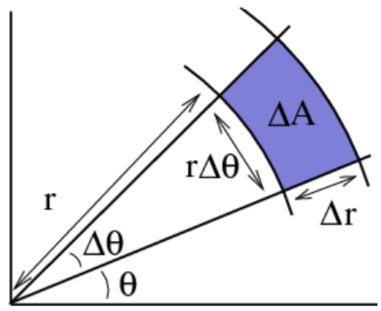
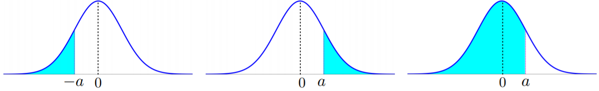
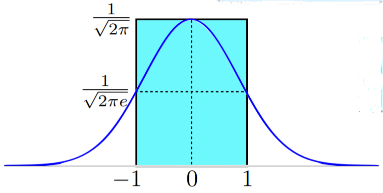
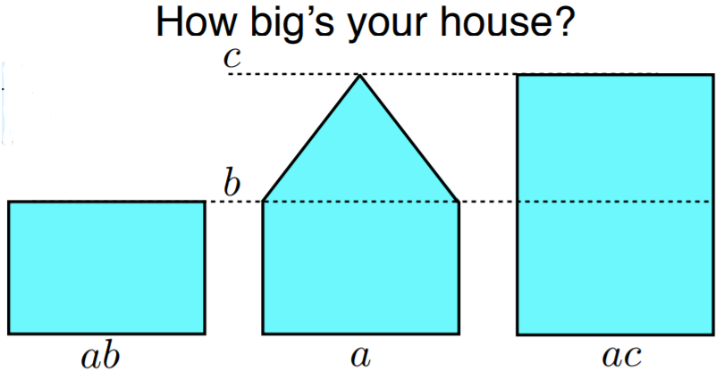
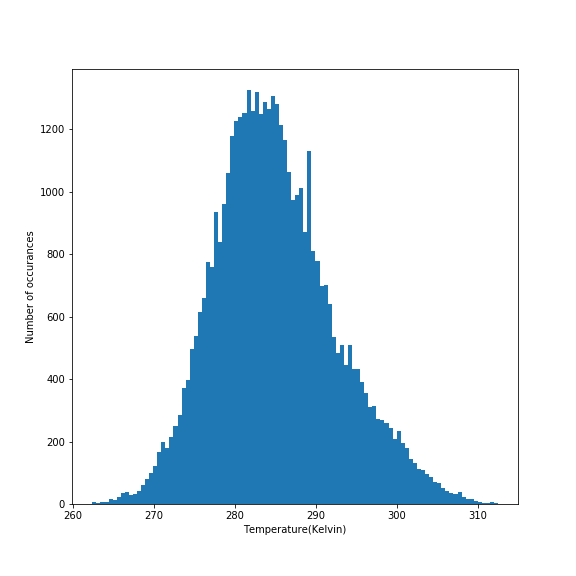
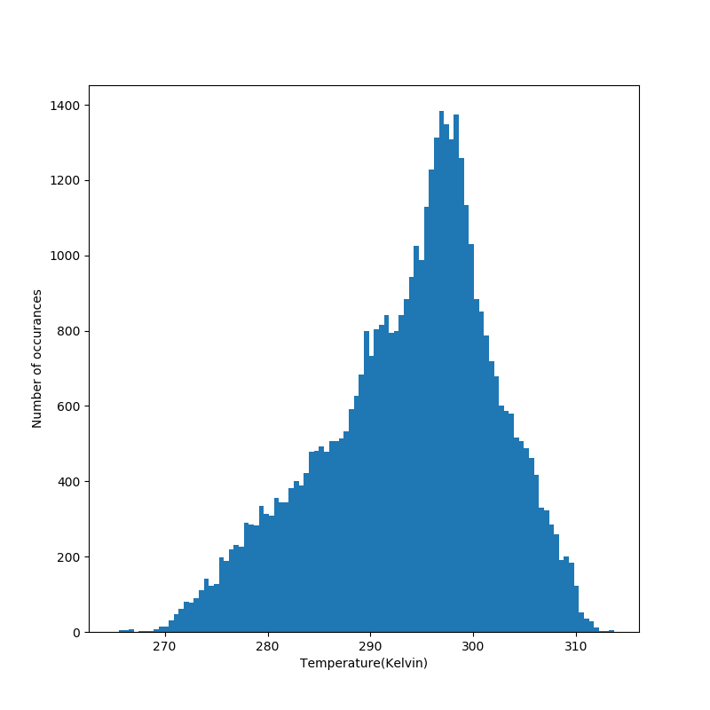
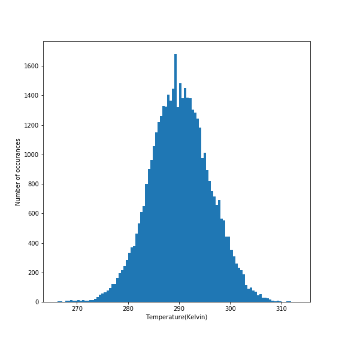
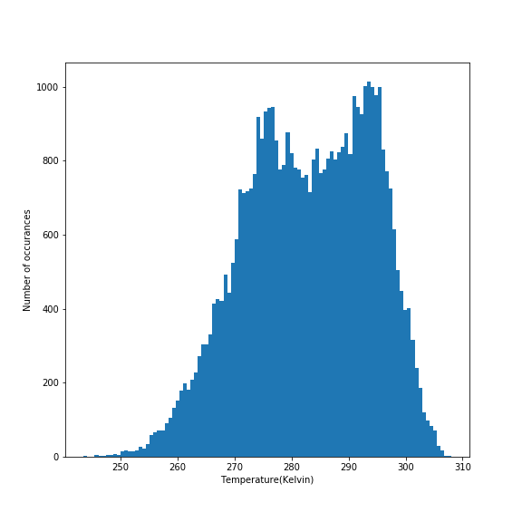

# Topic 9: Continuous Distribution Families

 
## 9.1 Continuous Distributions

+ Discrete to continuous
  + discrete distribution: countable \# values (finite or countably-infinite)
  + continuous distributions: uncountable \# values, intervals

+ Motivation
  + anything physics
    + time: flight, delivery, disease, life
    + space: height, storm area
    + mass: pet, cookie
    + temperature: air, body
  + nearly continuous variables
    + cost; stock, house, pork bellies
    + rates: interest, exchange, unemployment

+ Probability density function (PDF)
  + replacing the discrete pmf
  + relative likelihood of $x$: $f(x) \ge 0$
  + area under curve (area): $\int_{-\infty}^\infty f(x)\,dx$

+ Comparison

  <table style="font-family: arial,helvetica,sans-serif; width: 40vw;" table-layout="auto" cellspacing="0" cellpadding="5" border="1" align="center">
    <thead>
    <tr style="font-size: 1.2em;">
      <th style="text-align: center; background-color: #3d64ff; color: #ffffff; width:20%;"></th>
      <th style="text-align: center; background-color: #3d64ff; color: #ffffff; width:20%;">Discrete</th>
      <th style="text-align: center; background-color: #3d64ff; color: #ffffff; width:20%;">Continuous</th>
    </tr>
    <tr style="font-size: 1.2em;">
      <th style="text-align: center; background-color: #3d64ff; color: #ffffff; width:10%;">Prob. Func.</th>
      <th style="text-align: center; background-color: #3d64ff; color: #ffffff; width:20%;">mass (pmf)</th>
      <th style="text-align: center; background-color: #3d64ff; color: #ffffff; width:20%;">density (PDF)</th>
    </tr>
    </thead>
    <tbody>
    <tr> <td style="text-align: center;">$\ge 0$</td> <td style="text-align: center;">$p(x) \ge 0$</td> <td style="text-align: center;">$f(x) \ge 0$</td>  </tr>
    <tr> <td style="text-align: center;">$\sum = 1$</td> <td style="text-align: center;">$\sum_x p(x) = 1$</td> <td style="text-align: center;">$\int_{-\infty}^\infty f(x) dx = 1$</td> </tr>
    </tbody>
  </table>

+ Event probability
  + discrete: $P(A) = \sum_{x\in A} p(x)$
  + continuous: $P(A) = \int_{x \in A} f(x) dx$
  + typically interested in interval probability: $P(a \le X \le b)$
  + AuC (area under curve) btw a and b
  + cumulative distribution function: $P(X \le b) - P(X \le a)$

+ Cumulative distribution function (CDF)

  <table style="font-family: arial,helvetica,sans-serif; width: 40vw;" table-layout="auto" cellspacing="0" cellpadding="5" border="1" align="center">
    <caption style="font-size: 1.0em; margin: 0.2em;">$F(X) \triangleq P(X \le x)$</caption>
    <thead>
    <tr style="font-size: 1.2em;">
      <th style="text-align: center; background-color: #3d64ff; color: #ffffff; width:20%;"></th>
      <th style="text-align: center; background-color: #3d64ff; color: #ffffff; width:20%;">Discrete</th>
      <th style="text-align: center; background-color: #3d64ff; color: #ffffff; width:20%;">Continuous</th>
    </tr>
    </thead>
    <tbody>
    <tr> <td style="text-align: center;">PF $\to$ CDF</td> <td style="text-align: center;">$\displaystyle\sum_{u \le x} p(u)$</td> <td style="text-align: center;">$\int_{-\infty}^x f(u) du$</td> </tr>
    <tr> <td style="text-align: center;">CDF $\to$ PF</td> <td style="text-align: center;">$p(x) = F(x) - F(x^\ast)$</td> <td style="text-align: center;">$f(x) = F^\prime(x)$</td> </tr>
    <tr><td colspan="3">$x^\ast$: element preceding $x$</td></tr>
    </tbody>
  </table>

  + properties
    + $F(x) = $ integral
    + nondecreasing
    + $F(-\infty) = 0 \quad F(\infty) = 1$
    + continuous

+ Example: uniform distribution
  + PDF

    \[ f(x) = \begin{cases} 1 & 0 \le x \le 1 \\ 0 & \text{otherwise} \end{cases} \]

  + unitary: will it $\sum? \qquad \text{A.U.C. } = 1 \cdot 1 = 1$

    \[ \int_{-\infty}^\infty f(x) \,dx = \int^1_0 1\, dx = \left. x\right|^1_0 = 1 \]

  + CDF

    \[ F(x) = \int_{-\infty}^\infty  f(u) du = \begin{cases} 0 & x \le 0 \\ \int_0^x 1\,du = \left. u\right|_0^x = x & 0 < x \le 1 \\ 1 & 1 < x \end{cases} \]

    \[ F^\prime = \begin{cases} (0)^\prime = 0 & 0 \le x \\ (x)^\prime = 1 & 0 < x \le 1 \\ (1)^\prime = 0 & 1 < x \end{cases} \]

    <div style="margin: 0.5em; display: flex; justify-content: center; align-items: center; flex-flow: row wrap;">
      <a href="https://tinyurl.com/yb4obz4o" ismap target="_blank">
        
        
      </a>
    </div>

+ Example: triangle
  + PDF

  \[ f(x) = \begin{cases} 2x & 0 \le x \le 1 \\ 0 & \text{otherwise} \end{cases} \]

  + unitary: will it $\sum? \qquad \text{Area under curve } = 2 \cdot 1 \cdot \frac12 = 1$

    \[ \int_{-\infty}^{\infty} f(x) dx = \int_0^1 2x\,dx = \left.x^2 \right|_0^1 = 1 - 0 = 1 \]

  <div style="margin: 0.5em; display: flex; justify-content: center; align-items: center; flex-flow: row wrap;">
    <a href="https://tinyurl.com/yb4obz4o" ismap target="_blank">
      
    </a>
  </div>

  + CDF

    \[ F(x) = \int_{-\infty}^x f(u)\,du = \begin{cases} 0 & x \le 0 \\ \int_0^x 2u\,du = \left.u^2 \right|_0^x = x^2 = f(x) & 0 \le x \le 1 \\ 1 & 1 \le x \end{cases} \]

    \[ F^\prime(x) = \begin{cases} (0)^\prime = 0 & x < 0 \\ (x^2)^\prime = 2x & 0 \le x \le 1 \\ (1)^\prime = 0 & 1 < x \end{cases} \]


+ Infinite support
  + power paw distribution: PDF

    \[ f(x) = \begin{cases} \frac{1}{x^2} & x \ge 1 \\ 0 & x < 1 \end{cases} \]

  + unitary

    \[ \int_{-\infty}^\infty f(x) dx = \int_1^\infty \frac{1}{u^2}\, du = \left.\frac{-1}{u} \right|_1^\infty = 1 \]

  <div style="margin: 0.5em; display: flex; justify-content: center; align-items: center; flex-flow: row wrap;">
    <a href="https://tinyurl.com/ycl3n8dg" ismap target="_blank">
      
    </a>
  </div>

  + CDF

    \[ F(x) = \begin{cases} 0 & x \le 1 \\ \int_1^x \frac{1}{u^2} \,du = \left.\frac{-1}{u} \right|_1^x = 1 -\frac 1 x & x \ge 1 \end{cases} \]

    \[ F^\prime (x) = \begin{cases} (0)^\prime = 0 & x < 1 \\ (1 - \frac1 x)^\prime = \frac{1}{x^2} = f(x) & x \ge 1 \end{cases} \]

+ Interval probability

  \[ P(a, b) = P([a, b)) = P((a, b]) = F(b) - F(a) \]

  + examples
    + uniform: $0 \le a \le b \le 1$

      \[ P(a \le X \le b) = \begin{cases} \text{AuC } = (b-a) \cdot 1 = b-a \\ \int_a^b f(x)\,dx = \int_a^b 1\,dx = \left. x \right|_a^b = b-a \\ F(b) - F(a) = b-a \end{cases} \]

      + $P(0.6 \le X \le 1.3) = P(0.6 \le X \le 1) = 0.4$
      + $P(0.6 \le X \le 1.3) = F(1.3) - F(0.6) = 1 - 0.6 = 0.4$
    + power law: $1 \le a \le b$

      \[ P(a \le X \le b) = F(b) - F(a) = (1 - \frac 1 b) - (1 - \frac 1 a) = \frac1 a  - \frac 1 b \]

+ Differences between discrete and continuous

  <table style="font-family: arial,helvetica,sans-serif; width: 50vw;" table-layout="auto" cellspacing="0" cellpadding="5" border="1" align="center">
    <thead>
    <tr style="font-size: 1.2em;">
      <th style="text-align: center; background-color: #3d64ff; color: #ffffff; width:20%;">Discrete</th>
      <th style="text-align: center; background-color: #3d64ff; color: #ffffff; width:20%;">Continuous</th>
    </tr>
    </thead>
    <tbody>
    <tr> <td style="text-align: center;">$p(x) \le 1$</td> <td style="text-align: center;">$f(x)$ can be $> 1$</td> </tr>
    <tr> <td style="text-align: center;">Generally $p(x) \neq 0$</td> <td style="text-align: center;">$p(x) = 0$</td> </tr>
    <tr> <td rowspan="3" style="text-align: center;">Generally $P(X \le a) \neq P(X < a)$</td> <td style="text-align: center;">$P(X \le a) = P(X < a) = F(a)$</td> </tr>
    <tr> <td style="text-align: center;">$P(X \ge a) = P(X > a) = 1 -F(a)$</td></tr>
    <tr> <td style="text-align: center;">$P(a \le X \le b) = P(a < X < b) = F(b) - F(a)$</td> </tr>
    </tbody>
  </table>

+ Expectation
  + discrete: $E[X] = \sum x \cdot p(x)$
  + continuous: $E[X] = \int_{-\infty}^\infty xf(x)\, dx$
  + as discrete: average of many samples
  + properties
    + support set = [a, b]: $a \le E[X] \le b$
    + symmetry: $\exists\, \alpha, f(\alpha + x) = f(\alpha -x) \;\forall\, x \implies E[X] = \alpha$

  <div style="margin: 0.5em; display: flex; justify-content: center; align-items: center; flex-flow: row wrap;">
    <a href="https://tinyurl.com/yb4obz4o" ismap target="_blank">
      
    </a>
  </div>

  + examples
    + uniform: $E[X] = \int_{-\infty}^\infty x f(x)\,dx = \int_0^1 x \,1\, dx = \left.\frac{x^2}{2}\right|_0^1 = \frac12$
    + triangle: $E[X] = \int_0^1 x \cdot \,2x \,dx = \left.\frac{2x^3}{3}\right|_0^1 = \frac23$
    + power law: $E[X] = \int_1^\infty x\, \frac{1}{x^2}\,dx = \int_1^\infty \frac 1 x \,dx = \left.\ln x \right|_1^\infty = \infty$

+ Variance
  + definition: $Var(X) \triangleq E[(X - \mu)^2]$
    + discrete: $Var(x) = \sum_x p(x) (x - \mu)^2$
    + continuous: $Var(x) = \int_{-\infty}^\infty f(x)(x - \mu)^2\,dx$
  + as for discrete: $Var(X) = E[X^2] - (E[X])^2$

    \[\begin{align*}
      E[(X - \mu)^2] &= \int (x - \mu)^2 f(x)\,dx = \int (x^2 - 2x\mu + \mu^2)f(x)\,dx \\
      &= \int x^2f(x)\,dx - 2\mu \int xf(x)\,dx + \mu^2 \\
      &= E[X^2] - 2\mu^2 + \mu^2 = E[X^2] - \mu^2
    \end{align*}\]

  + standard deviation: $\sigma = \sqrt{Var(X)}$
  
+ Examples
  + uniform:
    + mean: $E[X] = \frac12$
    + $E[X^2] = \int_0^1 x^2 \,1\, dx = \left.\frac{x^3}{3}\right|_0^1 = \frac13$
    + variance: $Var(X) = E[X^2] - (E[X])^2 = \frac13 - \frac14 = \frac{1}{12}$
    + standard deviation: $\sigma = \frac{1}{\sqrt{12}} = \frac{1}{2\sqrt{3}}$
  + triangle
    + mean: $E[X] = \frac23$
    + $E[X^2] = \int_0^1 x^2 \, 2x \, dx = \left.\frac24 x^4 \right|_0^1 = \frac12$
    + variance: $Var(X) = E[X^2] - (E[X])^2 = \frac12 - (\frac23)^2 = \frac{9-8}{18} = \frac{1}{18}$
    + standard deviation: $\sigma = \frac{1}{\sqrt{18}} = \frac{1}{3\sqrt{2}}$

+ Discrete vs. Continuous

  <table style="font-family: arial,helvetica,sans-serif; width: 40vw;" table-layout="auto" cellspacing="0" cellpadding="5" border="1" align="center">
    <thead>
    <tr style="font-size: 1.2em;">
      <th style="text-align: center; background-color: #3d64ff; color: #ffffff; width:10%;"></th>
      <th style="text-align: center; background-color: #3d64ff; color: #ffffff; width:20%;">Discrete</th>
      <th style="text-align: center; background-color: #3d64ff; color: #ffffff; width:20%;">Continuous</th>
    </tr>
    </thead>
    <tbody>
    <tr> <th>Prob. Fun.</th> <td style="text-align: center;">pmf: p</td> <td style="text-align: center;">PDF: f</td> </tr>
    <tr> <th>$\ge 0$</th> <td style="text-align: center;">$p(x) \ge 0$</td> <td style="text-align: center;">$f(x) \ge 0$</td> </tr>
    <tr> <th>unitary</th> <td style="text-align: center;">$\sum p(x) = 1$</td> <td style="text-align: center;">$\int f(x)\,dx = 1$</td> </tr>
    <tr> <th>$P(A)$</th> <td style="text-align: center;">$\sum_{x \in A} p(x)$</td> <td style="text-align: center;">$\int_{x \in A} f(x)\,dx$</td> </tr>
    <tr> <th>$F(X)$</th> <td style="text-align: center;">$\sum_{u \le x} p(u)$</td> <td style="text-align: center;">$\int_{-\infty}^x f(u)\, dx$</td> </tr>
    <tr> <th>$\mu = E[X]$</th> <td style="text-align: center;">$\sum x p(x)$</td> <td style="text-align: center;">$\int xf(x)\, dx$</td> </tr>
    <tr> <th>$Var(X)$</th> <td style="text-align: center;">$\sum (x-\mu)^2 p(x)$</td> <td style="text-align: center;">$\int (x-\mu)^2 f(x)\,dx$</td> </tr>
    </tbody>
  </table>


+ [Original Slides](https://tinyurl.com/yb4obz4o)


### Problem Sets

0. Which of the following is true about a continuous random variable on $\Bbb{R}$?<br/>
  a. Its pdf must integrate to 1 on $\Bbb{R}$<br/>
  b. Its cdf must integrate to 1 on $\Bbb{R}$<br/>
  c. None of the above<br/>

  Ans: a<br/>
  Explanation: Its pdf must integrate to 1 on $\Bbb{R}$.


1. \(F\) is the cumulative distribution function for a continuous random variable. If \(F(b) - F(a) = 0.20\), then<br/>
  a. \([a,b]\) has length \(0.20\)<br/>
  b. \(P(X = b) - P(X = a) = 20\%\)<br/>
  c. \(P(X\in(a,b])=20\%\)<br/>
  
  Ans: c<br/>
  Explanation: Recall that $F(b)=P(X \le b)$, $F(a)=P(X \le a)$. Hence $P(a < X \le b)=F(b)−F(a)=0.2$.


2. Which of the following holds for all continuous probability distribution function \(f(x)\) having support set \(\mathbb{R}\)?<br/>
  a. \(\forall x\in\mathbb{R},\quad f(x)\ge 0\)<br/>
  b. \(\forall x\in\mathbb{R},\quad f(x)\le 1\)<br/>
  c. \(\exists x\in\mathbb{R},\quad f(x)\le 1\)<br/>
  d. If the limits of \(f(x)\) at positive and negative infinity exist, then \(\lim_{x\rightarrow\infty}f(x)=\lim_{x\rightarrow -\infty}f(x)=0\)<br/>

  Ans: <span style="color: magenta;">acd</span><br/>
  Explanation
    + By definition, $f(x) \ge 0$.
    + Consider Gaussian $\mathcal{N}(0,1/(8\pi))$. For this probability density function, $f(0)=2>1$.
    + If $f>1, \forall x \in \Bbb{R}$, $\int_{\Bbb{R}} f(z)dz= \infty$, but we require $\int_{\Bbb{R}} f(z)dz=1$.
    + Suppose $\exists \epsilon, x_0>0$ such that $\forall\, x \ge x_0,f(x)> \epsilon$, then $\int_{\Bbb{R}} f(z)dz= \infty$. Thus there cannot exist such an $\epsilon, x_0>0$ and hence $\lim_{x \to \infty} f(x)=0$. Similarly $\lim_{x \to −\infty} f(x)=0$.


3. Power Law

  Let  X  be a random variable with pdf $f_X(x) = C x^{−\alpha}, x \ge 1$.

  a. If $\alpha = 2$, $C=$?<br/>

  If $\alpha = 3$,<br/>
  b. $C=$?<br/>
  c. $E(X)=$?<br/>

  Ans: a. (1); b(2); c(2)<br/>
  Explanation: 
    + $\int_{-\infty}^{\infty} f_X(x) dx = \int_{1}^{\infty} Cx^{-2} dx = C = 1$
    + $\int_{-\infty}^{\infty} f_X(x) dx = \int_{1}^{\infty} Cx^{-3} dx = \frac{C}{2} = 1$
    + $E(X) = \int_{-\infty}^{\infty} x \cdot f_X(x) dx = \int_{1}^{\infty} 2x^{-2} dx = 2$


### Video Links

<a href="https://tinyurl.com/yac5tk4g" target="_BLANK">
  
</a><br/>


## 9.2 Functions of Random Variables

+ Functions of random variable
  + examples
    + $X$: income; $Y = 0.3X$: income tax
    + $X$: driving speed, $Y=2^x$: speeding ticket
  + $X \sim f_X$: $f_X$ known distribution
  + $Y = g(X)$: $g$ known deterministic function
  + what is the distribution of $Y$: $f_Y$?

+ Power law
  + $a > -1$

    \[ \int_0^1 \underbrace{(a+1) x^a}_{\ge 0} dx = \left. x^{a+1} \right|_0^1 = 1 \]

  + pdf

    \[ f(x) = \begin{cases} (a+1) x^a & 0 \le x \le 1 \\ 0 & \text{otherwise} \end{cases} \]

  + CDF: $a \le x \le 1$

    \[ F(x) = \int_0^x (a+1) u^a du = \left. u^{a+1} \right|_0^x = x^{a+1} \]

  + example
    + $X \sim f(x) = 3x^2 \quad F(x) = x^3 \quad 0 \le x \le 1$
    + $g \nearrow \to Y = g(X) \triangleq X^{\frac32}$
      + $0 \le x \le 1 \to 0 \le y \le 1$

        \[ F_Y(y) = P(Y \le y) = P(X^{\frac32} \le y) = P(X \le y^{\frac23}) = F_X(y^{\frac23}) = y^2 \]

      + $F_Y(0) = 0 \quad F_Y(1) = 1$
      + $f_Y(y) = F_Y^\prime(y) = 2y$
    + $g \searrow \to Y = g(X) \triangleq X^{-3}$
      + $0 \le x \le 1 \to y \ge 1$

        \[\begin{align*}
          F_Y(y) &= P(X \le y) = P(X^{-3} \le y) = P(X \ge y^{\frac{-1}{3}}) \\
          &= 1 - P(X \le y^{\frac{-1}{3}}) = 1 - F_X(y^{\frac{-1}{3}}) = 1 - y^{-1} 
        \end{align*}\]

      + $F_Y(1) = 0 \quad F_Y(\infty) = 1$
      + $f_Y(y) = F_Y^\prime(y) = y^{-2}$

+ General power law function
  + $Y = g(X)$ w/ $g \nearrow$
    + $F_Y \to F_X$

      \[\begin{align*}
        F_Y (y) &\triangleq P(Y \le y) = P(g(X) \le y) \\
        &= P(X \le^{-1}(y)) = F_X(g^{-1}(y)) \hspace{2em} (h(y) \triangleq g^{-1}(y)) \\
        &= F_X(h(y))
      \end{align*}\]

    + $f_Y \to f_X$

      \[\begin{align*}
        f_Y(y) &= F^\prime_Y (y) = [F_X(h(y))]^\prime \\
        &= F_X^\prime(h(y)) \cdot h^\prime(y) = f_X(h(y)) \cdot h^\prime(y)
      \end{align*}\]

    + example: $f_X(x) = 3x^2 \quad F_X(x) = x^3 \quad g(x) = x^{\frac32} \quad h(y) = y^{\frac23} \quad f_Y(y) = 2y$
      + $F_Y(y) = P(Y \le y) = P(X^{\frac32} \le y) = P(X \le y^{\frac23}) = F_X(y^{\frac23})$
      + $f_Y(y) = F^\prime(y) = [(y^{\frac23})]^\prime = 3(y^{\frac23})^2 \cdot \frac23 y^{-\frac13} = 2y$

  + $Y = g(X)$ w/ $g \searrow$
    + $F_Y \to F_X$

      \[\begin{align*}
        F_Y(y) &\triangleq P(g(X) \le y) = P(X \ge g^{-1}(y)) \\
        &= 1 - P(X \le g^{-1}(y)) = 1 - F_X(g^{-1}(y)) \\
        &= 1 - F_X(h(y))
      \end{align*}\]

    + $f_Y \to f_X$

      \[\begin{align*}
        f_Y(y) &= F_Y^\prime(y) = [1 - F_X(h(y))]^\prime = -F_X^\prime(h(y)) \cdot h^\prime(y) \\
        &= - f_X(h(y)) \cdot h^\prime(y)
      \end{align*}\]

  + Combining $g \nearrow$ and $g \searrow$
    + $g \nearrow \qquad f_Y(y) = f_X(h(y)) \cdot h^\prime(y)$
    + $g \searrow \qquad f_Y(y) = -f_Y(h(y)) \cdot h^\prime(y)$
    + both: $f_Y(y) = f_X(h(y)) \cdot |h^\prime(y)|$
    + alternative formulation:

      \[ f_Y(y) = \left. \frac{1}{|g^\prime(x)|} f_X(x) \right|_{y=g(x)} \]


+ [Original Slides](https://tinyurl.com/y8dosmt4)


### Problem Sets

0. Let X be a continuous random variable. What type of function g will make the random variable g(X) discrete?<br/>
  a. increasing<br/>
  b. decreasing<br/>
  c. linear<br/>
  d. step<br/>

  Ans: d<br/>
  Explanation: A step function will make g(X) discrete, as it will take only the y-values that correspond to the steps.


1. Let $(X,Y)$ be distributed over $[0,1]×[0,1]$ according to $f(x,y)=6xy^2$. Find $P(XY^3 \le 1/2)$.

  Ans: 3/4<br/>
  Hint: Let $Z=XY^3$. The cdf of $Z$ is $F_Z(z) = P(Z \le z) = P(XY^3 \le z) = \underset{xy^3 \le z}{\int\int} f(x,y) dxdy$

  Explanation:
    + Let $Z=XY^3$. For any $z \in (0, 1)$, $Z=XY^3 \le z \iff Y \le \min{(z/X)^{1/3}, 1}$. Therefore $P(Z\le z)=$ $P(XY^3\le z)=$ $\int_0^z\int_0^1f(x,y)dydx+\int_z^1\int_0^{(z/x)^{1/3}}f(x,y)dydx=$ $\int_0^z\int_0^1 6xy^2dydx+\int_z^1\int_0^{(z/x)^{1/3}}6xy^2 dydx=$ $z^2+2z(1-z)$. Plugging in $z=1/2$ gives the answer.
    + [StackExchange](https://tinyurl.com/y8e48pv6)


2. A random variable  X  follows the distribution

  \[ f_X(x)=\begin{cases} Cx^2 & -1\le x\le 2,\\  0 & \text{otherwise},  \end{cases} \]

  and $Y=X^2$. Calculate

  a. $C$<br/>
  b. $P(X≥0)$<br/>
  c. $E[Y]$<br/>
  d. $Var(Y)$<br/>

  Ans: a. (1/3); b. (8/9); c. (11/5); d. (228/175)<br/>
  Explanation:
    + Since $1=\int_{-1}^2f_X(x)dx=\int_{-1}^2Cx^2dx=3C$, we must have $C=1/3$
    + $P(X\ge 0)=\int_{0}^2f_X(x)dx=\int_{0}^2\frac13x^2dx=\frac19\cdot\left.x^3\right|^2_0=\frac89$
    + $E(Y)=E(X^2)=\int_{-1}^2 x^2 f_X(x)dx=\int_{-1}^2\frac13\cdot x^4dx=33/15=11/5$
    + First, $E(Y^2)=E(X^4)=\int_{-1}^2 x^4 f_X(x)dx=\int_{-1}^2\frac13\cdot x^6dx=\frac{129}{21}$. Hence, $V(Y)=E(Y^2)-E(Y)^2=$ $\frac{129}{21}-\left(\frac{11}5\right)^2=\frac{228}{175}$
    + [Example 3, Distributions of Functions of Random variables - Stat. Dept. UW](../../Notes/p04.5-FuncRV.md)

3. Let $X$ be distributed according to $f(x)=ce^{−2x}$ over $x>0$. Find $P(X>2)$.

  Ans: $e^{-4}$<br/>
  Explanation: Since $\int_0^\infty f(x)dx=1$, we have $c=2$. $P(X > 2) = \int_{2}^{\infty} f(x) dx = \int_{2}^{\infty} 2e^{-2x} dx = e^{-4}$


### Video Links

<a href="https://youtu.be/EfOOhlwDfDU" target="_BLANK">
  
</a><br/>


## 9.3 Uniform Distribution

+ Uniform distribution
  + __Definition__: (uniform) for $a < b$, the <span style="color: cyan; font-weight: bold;">uniform</span> distribution, $U_{[a, b]}$, is constant inside $[a. b]$ and 0 outside

    \[ f(x) = \begin{cases} c & x \in [a, b] \quad \text{equally likely} \\ 0 & x \notin [a, b] \quad \text{never happen} \end{cases} \]

  + properties:  for $(\alpha, \beta) \subseteq [a, b]$
    + probability determined by, and is $\propto$ to, length $\beta - \alpha$
    + area under curve: always a rectangle
    + integrals: just height $\times$ width
  + unitary:
    + $1 = \int_{-\infty}^\infty f(x)\, dx = c(b-a)$
    + $c = \frac{1}{b-a}$
  + non-negative: $f(x) \ge 0$

+ Applications
  + departure times
  + wait time for a bus
  + location of chip defect
  + location of a molecule in space
  + considering a small area in time or space
  + not so many ...

+ Cumulative distribution function

  \[ F(x) = \int_{-\infty}^x f(u) du = \begin{cases}
    \int_{-\infty}^x 0\, du = 0 & x \le a \\\\ F(a) + \int_a^x \frac{1}{b-a} \,du = \frac{x-a}{b-a} & a \le x \le b \\\\ F(b) + \int_b^x 0\, du = 1 & x \ge b
  \end{cases}\]

  <div style="margin: 0.5em; display: flex; justify-content: center; align-items: center; flex-flow: row wrap;">
    <a href="https://tinyurl.com/yata7tbx" ismap target="_blank">
      
    </a>
  </div>

+ Interval probabilities
  
  for $a \le \alpha \le \beta \le b$

    <table style="font-family: arial,helvetica,sans-serif; width: 40vw;" table-layout="auto" cellspacing="0" cellpadding="5" border="1" align="center">
      <thead>
      <tr style="font-size: 1.2em;">
        <th style="text-align: center; background-color: #3d64ff; color: #ffffff; width:10%;">Interval</th>
        <th style="text-align: center; background-color: #3d64ff; color: #ffffff; width:20%;">Probability</th>
      </tr>
      </thead>
      <tbody>
      <tr>
        <td>$(\alpha, \beta]$</td>
        <td>$F(\beta) - F(\alpha) = \frac{\beta - a}{b-a} - \frac{\alpha - a}{b - a} = \frac{\beta - \alpha}{b - a}$</td>
      </tr>
      <tr>
        <td>$[\beta, \infty)$</td>
        <td>$F(\infty) - F(\beta) = 1 - \frac{\beta - a}{b-a} = \frac{b - \beta}{b - a}$</td>
      </tr>
      <tr>
        <td>$\{\alpha\}$</td>
        <td>$F(\alpha) - F(\alpha) = 0$</td>
      </tr>
      </tbody>
    </table>

  <div style="margin: 0.5em; display: flex; justify-content: center; align-items: center; flex-flow: row wrap;">
    <a href="https://tinyurl.com/yata7tbx" ismap target="_blank">
      
    </a>
  </div>

+ Expectation and variance
  + pdf: $X \sim U_{[0, 1]}$ first, $f(x) =1,\; 0 \le x \le 1$
  + mean: $E[X] = \int_0^1 x\,dx = \left.\frac{x^2}{2}\right|_0^1 = \frac12$ by symmetry
  + $E[X^2] = \int_0^1 x^2 \,dx = \left.\frac{x^3}{3}\right|_0^1 = \frac13$
  + variance: $Var(X) = E[X^2] - (E[X])^2 = \frac13 - \frac14 = \frac{1}{12}$
  + standard deviation: $\sigma = \sqrt{\frac{1}{12}} = \frac{1}{2\sqrt{3}} \approx 0.29$

+ Translation and scaling
  + uniformity preserved under translation and scaling
  + wolog
    + $X \sim U_{[0, 1]} \quad (a \neq 0)$
    + for any constants $a > 0$ and $b$, $Y \stackrel{\text{def}}{=} aX + b \sim U_{[b, a+b]}$
  + range: $0 \to b \quad 1 \to a+b$
  + pdf: $Y = aX + b \stackrel{\text{def}}{=} g(X)$

    \[ f_Y(y) = \left.\frac{f_X(x)}{|g^\prime(x)|}\right|_{x = g^{-1}(y)} = \frac 1 a \]

    + or: equal-length interval map to equal-length intervals

+ General $\mu$ and $\sigma$
  + notation: $Y \sim U_{[a, b]}$
  + pdf: $Y = (b-a)X + a$
  + mean: $E[Y] = (b-a) E[X] + a = \frac{b-a}{2} + a = \frac{a+b}{2}$
  + variance: $Var(Y) = Var((b-a)X + a) = (b-a)^2 Var(X) = \frac{(b-a)^2}{12}$
  + standard deviation: $\sigma = \frac{b-a}{2\sqrt{3}} \approx 0.29(b-a)$

+ Uniform Distributions
  + notation: $U_{[a, b]} \quad a < b$
  + pdf:

    \[ f(x) = \begin{cases} \frac{1}{b-a} & X \in [a, b] \\ 0 & x \notin [a, b] \end{cases} \]

  + CDF

    \[ F(X) = \begin{cases} 0 & x \le a \\ \frac{x-a}{b-a} & a \le x \le b \\ 1 & x \ge b \end{cases} \]

  + parameters
    + $\mu = \frac{a+b}{2}$
    + $Var = \frac{(b-a)^2}{12}$
    + $\sigma = \frac{b-a}{2\sqrt{3}}$


+ [Original Slides](https://tinyurl.com/yata7tbx)


### Problem Sets

0. Let X be a uniformly distributed continuous random variable, then which of the following is also uniform?<br/>
  a. 2X<br/>
  b. X+2<br/>
  c. Both<br/>
  d. Neither<br/>

  Ans: c <br/>
  Explanation: Both 2X and X+2 are also uniform.


1. The height of the probability density function of a uniformly distributed random variable is inversely proportional to the width of the interval it is distributed over. (True/False)

  Ans: True<br/>
  Explanation: Recall that $\int_{-\infty}^\infty f_X(x)dx=1$, which means the area under the pdf is one. For uniform distribution, it becomes the area of a rectangle, which is 1. Hence the height is inversely proportional to the width.


2. The variance of a uniformly distributed random variable on  [a,b]  is<br/>
  a. $(b−a)/2$<br/>
  b. $(b−a)/6$<br/>
  c. $(b−a)^2/6$<br/>
  d. $(b−a)^2/12$<br/>

  Ans: d<br/>
  Explanation: The expectation of a uniformly distributed random variable $X$ on $[a,b]$ is $E(X)=\frac{a+b}{2}$.  Its variance is $V(X) = \int_{a}^{b} (x - \frac{a + b}{2})^2 \frac{1}{b - a} dx = (b-a)^2/12$


3. Let $X,Y \sim U_{[0,1]}$ independently. Find $P(\max(X,Y) \ge 0.8 \mid \min(X,Y)=0.5)$.

  Ans: <span style="color: magenta;">2/5</span><br/>
  Explanation: Red area is the region that $\max(X,Y) \ge 0.8$. Blue line (both solid and dash) is the region that $\min(X,Y)=0.5$.  Blue dash line is the region that $\max(X,Y) \ge 0.8$ and $\min(X,Y)=0.5$.  Notice that $P(\max(X,Y)\ge 0.8 \mid \min(X,Y)=0.5) = \frac{P(\max(X,Y)\ge 0.8, \min(X,Y)=0.5)}{P(\min(X,Y)=0.5)}$

  <div style="margin: 0.5em; display: flex; justify-content: center; align-items: center; flex-flow: row wrap;">
    <a href="https://tinyurl.com/ybblggz3" ismap target="_blank">
      
    </a>
  </div>

  Conditioning on $\min(X,Y)=0.5)$ restricts our focus to the L-shaped line from $(1,0.5)$ to $(0.5,0.5)$ to $(0.5,1)$ whose total length is $0.5+0.5=1$, and the distribution over that line is uniform. Within this line, $\max(X,Y) \ge 0.8$ forms the segments from $(0.8,0.5)$ to $(1,0.5)$ and from $(0.5,0.8)$ to $(0.5,1)$ whose total length is $0.2+0.2=0.4$. The probability of falling within these segments given the L-shaped line is $0.4/1=0.4$. [Stack Exchange](https://tinyurl.com/y8622gka)


4. Given $X \sim U_{[a,b]}$ with $E[X]=2$ and $Var(X)=3$, find $a$ and $b$.

  Ans: a. (-1); b. (5)<br/>
  Explanation: The mean and variance of $X \sim U_{[a,b]}$ are given by $E[X]=(a+b)/2$, $Var(X)=(b−a)^2/12$ respectively. Thus $(a+b)/2=2$ or $a=4−b$. Further $(b−a)^2/12=3$, and substituting $a=4−b$, we have $(b−2)^2=9$. Solving this and keeping the solution with $b \ge a$ gives $b=5,a=−1$.


### Video Links

<a href="https://tinyurl.com/ybblggz3" target="_BLANK">
  
</a><br/>


## 9.4 Exponential Distribution

+ Exponential distribution
  + extending geometric distribution to continuous values
  + pdf: $\lambda > 0$

    \[ f_\lambda(x) = \begin{cases} \lambda e^{-\lambda x} & x \ge 0 \\ 0 & x < 0 \end{cases} \]

  + non-negative: $f_\lambda(x) \ge 0$
  + unitary:

    \[ \int f(x) \,dx = \int_0^\infty \lambda e^{-\lambda x} dx = \left.-e^{-\lambda x}\right|_0^\infty = 0 - (-1) = 1 \]

  + cdf:

    \[\begin{align*}
      P(X > x) &= \begin{cases} \int_x^\infty \lambda e^{-\lambda u}\,du = \left. -e^{-\lambda u} \right|_x^\infty = e^{-\lambda x} & x \ge 0 \\ 1 & x \le 0 \end{cases} \\\\
      F(x) = P(X \le x) &= \begin{cases} 1 - P(X > x) = 1 - e^{-\lambda x} & x \ge 0 \\ 0 & x \le 0 \end{cases}
    \end{align*}\]

  <div style="margin: 0.5em; display: flex; justify-content: center; align-items: center; flex-flow: row wrap;">
    <a href="https://tinyurl.com/prvqe7v" ismap target="_blank">
      
      
    </a>
  </div>

+ Applications
  + duration of a phone call
  + wait time when you call an airline
  + lifetime of a car
  + time between accidents

+ Example: $0 \le a \le b$

  \[\begin{align*}
    P(a \le X \le b) &= P(a < X < b) = F(b) - F(a) \\
    &= (1 - e^{-\lambda b}) - (1 - e^{-\lambda a}) = e^{-\lambda a} - e^{-\lambda b} 
  \end{align*}\]

+ Expectation and variance
  + mean

    \[\begin{align*}
      E[X] &= \int_0^\infty x \lambda e^{-\lambda x}\,dx = \left.-x e^{-\lambda x} \right|_0^\infty + \int_0^\infty e^{-\lambda x}\,dx \\
      &= 0 - \left.\frac{1}{\lambda} e^{-\lambda x} \right|_0^\infty = \frac{1}{\lambda}
    \end{align*}\]

    \[\begin{align*}
      u = x &\to \quad du =1 \\
      dv = \lambda e^{-\lambda x} dx &\to \quad v = -e^{-\lambda x} \\
      \implies &\int u\, dv = uv - \int v\,du
    \end{align*}\]

  + variance

    \[\begin{align*}
      E[X^2] &= \int_0^\infty x^2 \lambda e^{-\lambda x} dx \\
      & = \left.-x^2 e^{-\lambda x} \right|_0^\infty + \int_0^\infty 2x e^{-\lambda x} dx \hspace{2em} \left(E[X] = \int_0^\infty x \lambda e^{-\lambda x} dx = \frac{1}{\lambda}\right) \\
      &= 0 + \frac{2}{\lambda} E[X] = \frac{2}{\lambda^2}
    \end{align*}\]

    \[\begin{align*}
      u = x^2 &\to \quad du = e^x\,dx \\
      dv = \lambda e^{-\lambda x}dx &\to \quad v = -e^{-\lambda x} \\
      \implies &\int u\, dv = uv - \int v\,du
    \end{align*}\]

    \[ Var(X) = E[X^2] - (E[X])^2 = \frac{2}{\lambda^2} - \frac{1}{\lambda^2} = \frac{1}{\lambda^2} \]

+ Memoryless
  + Exponential distribution: $X \sim f_\lambda \quad a, b \ge 0$

    \[\begin{align*}
      P(X \ge a + b \mid X \ge a) &= \frac{P(X \ge a +b, X \ge a)}{P(X \ge a)}\\
      &= \frac{P(X \ge a+b)}{P(X \ge a)} = \frac{e^{-\lambda (a+b)}}{e^{-\lambda a}} = e^{-\lambda b} \\
      &= P(X \ge b)
    \end{align*}\]

    \[\begin{align*}
      P(X < a + b \mid x \ge a) &= 1 - P(X \ge a +b \mid X \ge a) = 1 -P(X \ge b) \\
      &= P(X < b)
    \end{align*}\]

  + pdf

    \[f(X = a + b \mid X \ge a) = f(X = b) \]

+ Example: waiting time in line
  + DMV w/ 2 clerks, each w/ exponential service time $f_\lambda$
  + when arrived, one person in line
  + while waiting, someone custs in front of you
  + at some point a clerk becomes available and starts serving the fist person
  + before 1st person finished, other clerk starts serving 2nd person
  + if all 3 person served randomly, $P(\text{you finish last}) = 1/3$
  + $P(\text{you finish last now})?$
  + evaluation
    + A: time 1st person finished
    + B: time 2nd person finishes
    + C: time you finish
    + Service: $P(A < B < C)$
      + fixed: 1
      + exponential: ?

    \[\begin{align*}
      P(A < B < C) &= \underbrace{P(A < B)}_{\tfrac12} \cdot \underbrace{P(B < C \mid A < B)}_{\tfrac12} = \frac14\\
      P(B < C < A) &= \overbrace{P({B < A})}_{} \cdot \overbrace{P(C < A \mid B < A)}_{} = \frac14
    \end{align*}\]

    <table style="font-family: arial,helvetica,sans-serif; width: 30vw;" table-layout="auto" cellspacing="0" cellpadding="5" border="1" align="center">
      <thead>
      <tr style="font-size: 1.2em;">
        <th style="text-align: center; background-color: #3d64ff; color: #ffffff; width:10%;">Orders</th>
        <th style="text-align: center; background-color: #3d64ff; color: #ffffff; width:20%;">Probability</th>
      </tr>
      </thead>
      <tbody>
      <tr> <td style="text-align: center;">A < B < C</td> <td style="text-align: center;">$\tfrac14$</td> </tr>
      <tr> <td style="text-align: center;">A < C < B</td> <td style="text-align: center;">$\tfrac14$</td> </tr>
      <tr> <td style="text-align: center;">B < A < C</td> <td style="text-align: center;">$\tfrac14$</td> </tr>
      <tr> <td style="text-align: center;">B < C < A</td> <td style="text-align: center;">$\tfrac14$</td> </tr>
      <tr> <td style="text-align: center;">C < A < B</td> <td style="text-align: center;">0</td> </tr>
      <tr> <td style="text-align: center;">C < B < A</td> <td style="text-align: center;">0</td> </tr>
      </tbody>
    </table>

  + conclusion
    + all 3 of you served randomly, $P(\text{you finish last}) = \frac13$
    + fixed service time, $P(\text{you finish last}) = 1$
    + exponential (memoryless) service time
      + you won't finish first
      + all 4 others equally likely
      + \$Pr(\text{you finish last}) = P(A < B < C) + P(B < A< C) = \frac14 + \frac14 = \frac12$
      + only slightly larger than $\frac13$

+ Intervals, multiples of exponential in Python
  + pdf:
    + `expon.pdf(n)` w/ note: [n] = {1 ... n}

      ```python
      from scipy.stats import expon
      print(expon.pdf(x=3, scale=2))  # 0.111565...
      ```

    + `range(m, n)` or `range(m, n, d)` -> {m, m+d, m+2d, ...} < n-1

      ```python
      print(set(range(2, 5)))       # {2, 3, 4}
      print(set(range(2, 12, 3)))   # {8, 2, 11, 5}
      ```

  + Summary: exponential
    + pdf

      \[ f_\lambda(x) = \begin{cases} \lambda e^{-\lambda x} & x \ge 0 \\ 0 & x \le 0 \end{cases} \]

    + cdf

      \[ F(x) = \begin{cases} 1 - e^{-\lambda x} & x \ge 0 \\ 0 & x \le 0 \end{cases} \]

    + properties
      + mean: $E[X] = \frac{1}{\lambda}$
      + varianace: $Var(X) = \frac{1}{\lambda^2}$
      + standard deviation: $\sigma = \frac{1}{\lambda}$
      + memoryless


+ [Original Slides](https://tinyurl.com/ycojutex)


### Problem Sets

0. In terms of memorylessness, the exponential distribution is analogous to which discrete random variable distribution?<br/>
  a. Bernoulli distribution<br/>
  b. Binomial distribution<br/>
  c. Poisson distribution<br/>
  d. Geometric distribution<br/>

  Ans: d<br/>
  Explanation: Geometric distributions are also memoryless.


1. The y-intercept of the pdf of an exponentially distribution with $\lambda = 2$ is<br/>
  a. 0 <br/>
  b. 0.5 <br/>
  c. 1 <br/>
  d. 2 <br/>
  
  Ans: <span style="color: magenta;">d</span><br/>
  Explanation: The y-intercept of a pdf is $f_X(0)$. For an exponential distribution that has pdf $f_X(x)=2e^{−2x}$, the y-intercept is $f_X(0)=2$.


2. Assume the lifetimes of some kind of batteries follow exponential distribution with mean 1 year.<br/>
  a. What is the probability that one such batteries can be used for more than 1.5 years?<br/>
  b. What is the probability that one such batteries can be used for more than 1.5 years  in total  if it has already been used for 0.5 year?<br/>

  Ans: a. ($e^{-1.5}$); b. (1/e)<br/>
  Explanation:
    + Let $X \sim Exponential(\lambda)$ denote the age of the battery. Since $1=E(X)=1/\lambda$, we have $\lambda=1$. Further, for an exponential distribution, the CDF is given by $F_X(x)=P(X \le x)=1−e^{−λ \cdot x}, x \ge 0$. Thus $P(X> 1.5)=1-P(X\le 1.5)=1-F_X(1.5)=e^{-1.5}=0.22313$
    + By the memoryless property of exponential distribution, $P(X>1.5 \mid X>0.5)=P(X>1)$. Following the same steps as the previous part above, $P(X>1)=e^{-1}=0.367879$


3. Let $X,Y$ be two independent exponential random variables with means $1$ and $3$, respectively. Find $P(X>Y)$.

  Ans: <span style="color: magenta;">0.25</span><br/>
  Explanation: From the description we have $f_X(x)=e^{−x}, f_Y(y)=\frac13 e^{\frac{−y}{3}}$.  Hence, $P(Y \lt y) = F_Y(y)$ $= \int_{-\infty}^{y} f_Y(y^\prime) dy^\prime$ $= \int_{0}^{y} \frac{1}{3}e^{-\frac{y^\prime}{3}} dy\prime$ $= 1 - e^{\frac{y}{3}}$.  $P(X>Y) = \int_{0}^{\infty} \int_{0}^{t} f_X(t) f_Y(y) dydt$ $=\int_{0}^{\infty}f_X(t)P(Y \lt t)dt$ $= \int_{0}^{\infty}e^{-t}(1-e^{-t/3})dt$ $= \int_{0}^{\infty}e^{-t}-e^{-4t/3}dt=1/4$ [Stack Exchange](https://tinyurl.com/yarpua5l)


4. In order to attend an important $8$ A.M. lecture, you arrive at the shuttle stop at a time distributed uniformly between $7:20$ A.M. and $7:30$ A.M. The time between consecutive shuttle arrivals is known to be exponentially distributed with mean $15$ minutes. If the journey takes $30$ minutes, what is the probability that you arrive late to the lecture?

  Ans: <span style="color: magenta;">0.7298</span><br/>
  Explanation: 
  + Let $Y$ be the time in minutes between $7:20$ A.M. and $7:30$ A.M. that you arrive at the shuttle stop. Let $Z$ be the time you have to wait until the next shuttle arrives. Then $Y \sim Unif(0,10)$ and by the memoryless property of the exponential, $Z \sim Exp(1/15)$. Note also that in this case $Y$ is independent of $Z$.  Now you arrive late to class iff $Y+Z>10$. Therefore the required probability is $P(Y+Z > 10)$ $=\int_{0}^{10}f_Y(t)P(Z> 10-t)dt$ $=\int_{0}^{10}1/10\cdot e^{-(10-t)/15}dt$ $=3/2\cdot (1-e^{-2/3})=0.730$
  + [HomeworkLib](https://tinyurl.com/ybthhuk4)


### Video Links

<a href="https://tinyurl.com/ycsakrcj" target="_BLANK">
  
</a><br/>


## 9.5 Gaussian Distribution

+ Normal distribution
  + notation: $X \sim \mathcal{N}(\mu, \sigma^2)$
  + pdf: $f(x) = \frac{1}{\sqrt{2\pi \sigma^2}} e^{-\frac{(x-\mu)^2}{2\sigma^2}}$
  + a.k.a. Bell curve
  + very common
  + occurs whenever adding many independent factors, e.g., height, weight, rainfall, salaries, ...
  + approximating binomial distribution

  <div style="margin: 0.5em; display: flex; justify-content: center; align-items: center; flex-flow: row wrap;">
    <a href="https://tinyurl.com/muts22v" ismap target="_blank">
      
      
    </a>
  </div>

+ Observations
  + symmetric around mean $\mu$
  + $\mu$ most likely: $f(\mu) = \frac{1}{2\pi \sigma^2}$
  + as $\sigma$ grows, distribution gets more flat

+ Linear transformations
  + linear transformation of normal distributions are normal
    + $X \sim \mathcal{N}(\mu, \sigma^2)$
    + pdf: $f(x) = \frac{1}{\sqrt{2\pi \sigma^2}} e^{-\frac{(x-\mu)^2}{2\sigma^2}}$
    + affine: $Y = aX +b$
    + $\forall\,$ r.v.: $\mu_Y = a \mu_X + b \quad \sigma_Y = a \sigma_X$
  + variable transformation: show normal

    \[\begin{align*}
      f_Y(y) &= \left.\frac{1}{(ax+b)^\prime} f_X(x) \right|_{y=ax+b} \qquad \left( x = \frac{y - b}{a} \right) \\
      &= \frac 1 a \frac{1}{\sqrt{2\pi \sigma^2}} e^{-\frac{\left(\frac{y-b}{a} - \mu\right)^2}{2\sigma^2}} = \frac{1}{\sqrt{2\pi(a\sigma)^2}} e^{- \frac{(y - (a\mu +b))^2}{2(a\sigma)^2}}\\\\
      Y &\sim \mathcal{N}eft(a\mu+b, (a\sigma)^2\right)
    \end{align*}\]

+ Standard Normal distribution
  + w/o loss of generality considering $X \sim \mathcal{N}(0, 1)$

    \[ f(x) = \frac{1}{2\pi} e^{-\frac{x^2}{2}} \]

  + helpful integral: $\int xe^{-\frac{x^2}{2}} \,dx = - e^{-\frac{x^2}{2}}$
  + unitary

    \[\begin{align*}
      I &= \int_{-\infty}^\infty e^{-\frac{x^2}{2}} \,dx \\\\
      I^2 &= \left( \int_{-\infty}^\infty e^{-\frac{x^2}{2}} \,dx \right) \left( \int_{-\infty}^\infty e^{-\frac{y^2}{2}}\, dy \right) = \int_{-\infty}^\infty\int_{-\infty}^\infty e^{\frac{-(x^2+y^2)}{2}} \,dx\,dy \\
      &= \int_0^\infty \int_0^{2\pi} e^{\frac{-r^2}{2}} r \,d\theta\,dr \qquad \left( x = r\cos\theta, y = r\sin\theta \to dx\,dy = r dr\,d\theta \right) \\
      &= \int_0^\infty r e^{\frac{-r^2}{2}} \int_0^{2\pi} d\theta \, dr = 2\pi \int_0^\infty r e^{\frac{-r^2}{2}} dr \qquad \left( \int r e^{\frac{-r^2}{2}} dr = -e^{\frac{-r^2}{2}}  \right) \\
      &= \left. -2\pi e^{\frac{-r^2}{2}} \right|_0^\infty = 2 \pi\\\\
      \therefore\, I &= \sqrt{2\pi} \to \int \frac{1}{\sqrt{2\pi}} e^{\frac{-x^2}{2}} dx = 1
    \end{align*}\]

    <div style="margin: 0.5em; display: flex; justify-content: center; align-items: center; flex-flow: row wrap;">
      <a href="url" ismap target="_blank">
        
      </a>
    </div>

  + mean
    + symmetry: $E[X] = 0$
    + calculation

      \[ E[X] = \frac{1}{\sqrt{2\pi}} \int_{-\infty}^\infty x e^{\frac{-x^2}{2}} \,dx = \frac{1}{\sqrt{2\pi}} \left.-e^{\frac{-x^2}{2}} \right|_{-\infty}^\infty = 0 \]

  + variance

    \[\begin{align*}
      E[X^2] &= \frac{1}{\sqrt{2\pi}} \int x^2 e^{\frac{-x^2}{2}}\,dx = \left. \frac{-1}{\sqrt{2\pi}} x e^{\frac{-x^2}{2}} \right|_{-\infty}^\infty + \frac{1}{\sqrt{2\pi}} \int_{-\infty}^\infty e^{\frac{-x^2}{2}}\,dx \\
      &= 0 + 1 = 1 \\\\
      Var(x) &= E[X^2] - (E[X])^2 = 1 - 0 = 1
    \end{align*}\]

    \[\begin{align*}
      u &= x  \quad\to\quad du = dx \\
      dv &= x e^{\frac{-x^2}{2}} \,dx  \quad\to\quad v = -e^{\frac{-x^2}{2}} \\
      &\implies \int u dv = uv - \int v du
    \end{align*}\]

+ Summary
  + notation: $X \sim \mathcal{N}(\mu, \sigma)$
  + pdf: $f(x) = \frac{1}{\sqrt{2\pi \sigma^2}} e^{\frac{-(x-\mu)^2}{2\sigma^2}} \quad -\infty < x < \infty$
  + mean: $E[X] = \mu$
  + variance: $Var = \sigma^2$
  + standard deviation: $\sigma = \sigma$
  + very common in nature


+ [Original Slides](https://tinyurl.com/yc6hpw5v)


### Problem Sets

0. If you fix the mean but increase the variance of a normal distribution, its pdf will<br/>
  a. move to the left<br/>
  b. move to the right<br/>
  c. become taller and narrower<br/>
  d. become shorter and flatter<br/>

  Ans: d


1. Let \(X\sim\mathcal{N}(\mu,\sigma^2)\) be a normal random variable, then the maximum value of its pdf is<br/>
  a. \(1\)<br/>
  b. \(\frac{1}{\sqrt{2\pi}}\)<br/>
  c. \(\frac{1}{\sqrt{2\pi\sigma}}\)<br/>
  d. \(\frac{1}{\sqrt{2\pi\sigma^2}}\)<br/>

  Ans: d<br/>
  Explanation: A Gaussian pdf achieves its maximum value at its mean $f_X(μ)=\frac{1}{\sqrt{2\pi\sigma^2}}$.


2. Linear transformations

  The linear transformation of a normal random variable is also a normal random variable. (True/False)

  Ans: True<br/>
  Explanation: For any $X \sim \mathcal{N}(\mu, \sigma^2)$, we have $aX+b \sim \mathcal{N}(a\mu+b, a^2 \sigma^2)$


3. If $X,Y$ are two independent random variable with $X \sim \mathcal{N}(1,16)$ and $Y \sim \mathcal{N}(1,9)$, then find $Var(XY)$.

  Ans: <span style="color: magenta;">169</span><br/>
  Explanation: Noted that $E[X^2]=Var(X)+E^2[X]=17, E[Y^2]=Var(Y)+E^2[Y]=10$, we have $Var(XY) = E[X^2Y^2] - E^2[XY] = E[X^2]E[Y^2] - E^2[X]E^2[Y] = 170 - 1 = 169$ [StackExchange](https://tinyurl.com/yavkx3ez)


4. Suppose $X$ is a Gaussian random variable with mean $2$ and variance $4$. Find $E\left(e^{\frac{X}{2}}\right)$.

  Ans: $\exp(\frac32)$<br/>
  Explanation: $E(e^{\frac{x}{2}})$ $= \int_{-\infty}^{\infty} \frac{1}{\sqrt{2\pi 2^2}} e^{-\frac{(x - 2)^2}{2\cdot 2^2}} e^{\frac{x}{2}} dx$ $= \int_{-\infty}^{\infty} \frac{1}{\sqrt{2\pi 2^2}} e^{-\frac{x^2 - 8x + 4}{2\cdot 2^2}} dx$ $= \int_{-\infty}^{\infty} \frac{1}{\sqrt{2\pi 2^2}} e^{-\frac{(x - 4)^2}{2\cdot 2^2}} e^{\frac{3}{2}} dx$ $= e^{\frac{3}{2}} \int_{-\infty}^{\infty} \frac{1}{\sqrt{2\pi 2^2}} e^{-\frac{(x - 4)^2}{2\cdot 2^2} } dx$ $= e^{\frac{3}{2}}$. Or using the MGF (taught in Topic 10), which is $e^{\mu t+\sigma^2 t^2/2}$, and plugging in $t=1/2$, we get $e^{3/2}$.


5. If $x\sim \mathcal{N}(0,1)$, find $E\left[e^{-X^2}\right]$.

  Ans: $3^{-1/2}$<br/>
  Explanation: $E\left(e^{-X^2}\right) = \int_{-\infty}^{\infty} \frac{1}{\sqrt{2\pi}} e^{-\frac{x^2}{2}} e^{-x^2} dx = \frac{1}{\sqrt{3}} \int_{-\infty}^{\infty} \underbrace{\frac{1}{\sqrt{2\pi \frac{1}{3}}} e^{-\frac{x^2}{2 \cdot \frac{1}{3}}}}_{\mathcal{N}(0, \frac{1}{3})} dx = 1/\sqrt{3}$


6. Let $X$ be distributed according to the pdf $ke^{−x^2−7x}$. Find $E[X^2]$.

  Ans: $51/4$<br/>
  Explanation: Notice that $f_X(x)=k e^{-x^2-7x}= (ke^{49/4})\cdot e^{-\frac{(x+7/2)^2}{2\times 0.5}} = c \cdot e^{-\frac{(x+7/2)^2}{2\times 0.5}}$,  where $c$ is a constant. Therefore $X$ is normally distributed with $μ=−7/2$ and $\sigma^2=0.5$ and thus $E(X^2)$ $=V(X)+E(X)^2$ $=1/2+49/4$ $=51/4.$.


7. Let $X \sim \mathcal{N}(0,9)$ have mean 0 and variance 9. Find the expected value of $X^2(X+1)$.

  Ans: 9<br/>
  Explanation:
    + Notice that since the Guassian distribution is symmetric around its mean $0$, $E[X^3]=0$. Further since $E[X^2]=Var(X)+E[X]^2=9$, the answer follows. 
    + [StackExchange](https://tinyurl.com/ycnb77hj)


### Video Links

<a href="https://youtu.be/9anq5ZssVfA" target="_BLANK">
  
</a><br/>


## 9.6 Gaussian Distribution - Probabilities

+ Cumulative distribution function
  + distribution: $X \sim \mathcal{N}(0, 1)$
  + cdf: 
    + $\Phi(x) \triangleq F(x) = \frac{1}{2\pi} \int_{-\infty}^x \exp(-\frac{x^2}{2})\, dx$
    + no known formula
    + instead use table or computer
  + table for each $\mu, \sigma$?
    + standard normal table
    + z table

+ Using the z table
  + distribution: $X \sim \mathcal{N}(0, 1)$

    \[\begin{align*}
      P(X \le a) &= \Phi(a) \\
      P(X \ge a) &= 1 - \Phi(a) \\
      P(a \le X \le b) &= \Phi(b) - \Phi(a)
    \end{align*}\]

  + negative values
    + $a > 0$
    + $\Phi(-a) = P(X \le -a) = P(X \ge a) = 1 - P(X \le a) = 1 - \Phi(a)$

      <div style="margin: 0.5em; display: flex; justify-content: center; align-items: center; flex-flow: row wrap;">
        <a href="https://tinyurl.com/yaef2n9n" ismap target="_blank">
          
        </a>
      </div>

    + $P(x \le -a) = \Phi(-a) = 1 - \Phi(a)$
    + $P(X \ge -a) = 1 - \Phi(-a) = \Phi(a)$
    + $P(-a \le X \le b) = \Phi(b) - \Phi(-a) = \Phi(b) - (1 - \Phi(a)) = \Phi(a) + \Phi(b) - 1$

+ General normal distribution
  + distribution: $X \sim \mathcal{N}(\mu, \sigma^2)$
  + $P(a \le X \le b) = P\left( \frac{a - \mu}{\sigma} \le \frac{X - \mu}{\sigma} \le \frac{b - \mu}{\sigma} \right) = P\left.(\frac{a - \mu}{\sigma} \le Z \le \frac{b - \mu}{\sigma}\right)$
  + standardized version of $X$ = Z score: $Z = \frac{X- \mu}{\sigma} \sim \mathcal{N}(0, 1)$
  + example:
    + $X \sim \mathcal{N}(15, 4) \quad \mu = 15 \quad \sigma=2$
    + Z score: $Z = \frac{X - 15}{2}$

    \[\begin{align*}
      P(11 \le X \le 17) &= P(\frac{11-15}{2} \le Z \le \frac{17-15}{2}) \\
      &= P(-2 \le Z \le 1) = \Phi(1) + \Phi(2) - 1 \\
      &\approx 0.8413 + 0.9772 - 1 = 0.8185
    \end{align*}\]

+ Probability and standard deviation
  + $P(|X - \mu| \le \sigma)?$
  + standard normal: $f(x) = \frac{1}{\sqrt{2\pi}} \exp\left(-\frac{x^2}{2}\right)$
  + area of th house: $ab + \frac{a(c-b)}{2} = \frac{ab + ac}{2}$
  + $0.48 \approx \sqrt{\frac{2}{\pi e}} \le P(|X - \mu| \le \sigma) \le \sqrt{\frac{2}{\pi}} \approx 0.8 \implies \frac{\sqrt{\frac{2}{\pi e}} + \sqrt{\frac{2}{\pi}}}{2} \approx 0.64$

  <div style="margin: 0.5em; display: flex; justify-content: center; align-items: center; flex-flow: row wrap;">
    <a href="https://tinyurl.com/yaef2n9n" ismap target="_blank">
      
      
    </a>
  </div>


+ 68 - 95 - 99.7 Rule

  \[ P(\mu - \alpha \sigma \le X \le \mu + \alpha \sigma) = P(-\alpha \le Z \le \alpha) = 2\Phi(\alpha) - 1 \]

  <table style="font-family: arial,helvetica,sans-serif; width: 30vw;" table-layout="auto" cellspacing="0" cellpadding="5" border="1" align="center">
    <thead>
    <tr style="font-size: 1.2em;">
      <th style="text-align: center; background-color: #3d64ff; color: #ffffff; width:5%;">$\alpha$</th>
      <th style="text-align: center; background-color: #3d64ff; color: #ffffff; width:20%;">$P(|X - \mu| \le \alpha \sigma)$</th>
    </tr>
    </thead>
    <tbody>
    <tr> <td style="text-align: center;">1</td> <td style="text-align: center;">2(0.8413) -1 = 0.682</td> </tr>
    <tr> <td style="text-align: center;">2</td> <td style="text-align: center;">2(0.9772) - 1 = 0.9544</td> </tr>
    <tr> <td style="text-align: center;">3</td> <td style="text-align: center;">2(0.9987) - 1 = 0.9974</td> </tr>
    </tbody>
  </table>

  <div style="margin: 0.5em; display: flex; justify-content: center; align-items: center; flex-flow: row wrap;">
    <a href="https://tinyurl.com/yba6p7dj" ismap target="_blank">
      
    </a>
  </div>

+ Rare events

  <table style="font-family: arial,helvetica,sans-serif; width: 50vw;" table-layout="auto" cellspacing="0" cellpadding="5" border="1" align="center">
    <thead>
    <tr style="font-size: 1.2em;">
      <th style="text-align: center; background-color: #3d64ff; color: #ffffff; width: 5%;">$\alpha$</th>
      <th style="text-align: center; background-color: #3d64ff; color: #ffffff; width:20%;">$P(\left| X - \mu\right| \le \alpha \sigma)$</th>
      <th style="text-align: center; background-color: #3d64ff; color: #ffffff; width:20%;">$P(\left| X - \mu\right| > \alpha \sigma$)</th>
      <th style="text-align: center; background-color: #3d64ff; color: #ffffff; width:20%;">Daily event ~</th>
    </tr>
    </thead>
    <tbody>
    <tr> <td style="text-align: center;">1</td> <td style="text-align: center;">68.2%</td> <td style="text-align: center;">31.8%</td> <td style="text-align: center;">3 days</td> </tr>
    <tr> <td style="text-align: center;">2</td> <td style="text-align: center;">95.4%</td> <td style="text-align: center;">4.6%</td> <td style="text-align: center;">3 weeks</td> </tr>
    <tr> <td style="text-align: center;">3</td> <td style="text-align: center;">99.7%</td> <td style="text-align: center;">0.3%</td> <td style="text-align: center;">year</td> </tr>
    <tr> <td style="text-align: center;">4</td> <td style="text-align: center;">99.99%</td> <td style="text-align: center;">0.01%</td> <td style="text-align: center;">43 years</td> </tr>
    <tr> <td style="text-align: center;">5</td> <td style="text-align: center;">99.9999%</td> <td style="text-align: center;">$10^{-6}$</td> <td style="text-align: center;">4776 years</td> </tr>
    <tr> <td style="text-align: center;">6</td> <td style="text-align: center;">99.9999998%</td> <td style="text-align: center;">$2\cdot 10^{-9}$</td> <td style="text-align: center;">1.3 millions years</td> </tr>
    </tbody>
  </table>

  + $6 \cdot \sigma$ philosophy: life is abnormal

+ Normal approximation of Binomial distribution
  + Binomial: $X \sim B_{n, p} \qquad \mu = np \quad \sigma = \sqrt{npq}$
  + Normal approximation: $Y \sim \mathcal{N}(np, npq) \qquad P(X = k) \approx P(k - \frac12 \le Y \le k + \frac12)$
  + example:
    + $X \sim B_{100, 0.5} \qquad \mu = np = 50 \quad \sigma = \sqrt{npq} = 5$
    + $Y \sim \mathcal{N}(50, 25)$

      \[\begin{align*}
        P(X = 60) &\approx P(59.5 \le Y \le 60.5) \\
        &= P(1.9 = \frac{59.5 - 50}{5} \le Z = \frac{Y - 50}{5} \le \frac{60.5 - 50}{5} = 2.1)\\
        &= \Phi(2.1) - \Phi(1.9) \approx 0.9821 - 0.9713 = 0.0108 \\
        P(X = 60) &= \binom{100}{60} 0.5^{100} \approx 0.0108
      \end{align*}\]

  + example: interval probabilities
    + Binomial: $X \sim B_{100, 0.5} \qquad np = 50 \quad \sqrt{npq} = 5$
    + Normal approximation: $Y \sim \mathcal{N}(50, 25)$

      \[\begin{align*}
        P(42 \le X \le 53) &\approx P(41.5 \le Y \le 53.3) \\
        &= P(-1.7 = \frac{41.5 - 50}{5} \le Z \le \frac{53.5 - 50}{5} \le 0.7) \\
        &= \Phi(0.7) + \Phi(1.7) - 1 \approx 0.7580 + 0.9554 - 1 = 0.7134 \\\\
        \text{Actual } &= \sum_{k=42}^{53} \binom{100}{k} (\frac12)^{100} \approx 0.7136
      \end{align*}\]


+ [Original Slides](https://tinyurl.com/yaef2n9n)


### Problem Sets

0. Why z table only cover one half of the normal curve?<br/>
  a. The positive half is most frequently used.<br/>
  b. The table will be too large to include the negative half.<br/>
  c. The values of the negative half can be deduced from symmetry.<br/>

  Ans: c<br/>
  Explanation: The values of the negative half can be deduced from symmetry.


1. If $X$ is a normal random variable with $\mu=−2$ and $\sigma=3$, and has probability density function and cumulative density function $f_X(x)$, $F_X(x)$, calculate<br/>
  a. $P(−3 < X < 0)$<br/>
  b. $F(1/4)$<br/>
  c. $F^{−1}(1/4)$<br/>

  Ans: a. (0.378066); b. (0.7734); c. (-4.01)<br/>
  Explanation:
    + We may rewrite $P(−3 < X < 0)=P(−1/3 < (X+2)/3 < 2/3)$. Define $Z=(X+2)/3$. Now $Z=(X+2)/3 \sim Normal(0,1)$. Thus $P(−1/3 < (X+2)/3 < 2/3)=P(−1/3 < Z < 2/3)= \Phi(2/3)− \Phi(−1/3)=0.378066$, where the latter is obtained from a standard Guassian table.
    + $F(1/4) = P(X \le 1/4) = P((X+2)/3 \le 3/4) = P(Z \le 3/4)$. Similar to the above part, we evaluate the latter as $P(Z \le 3/4)= \Phi(3/4)=0.773373$.
    + Using the same transformation as above: $Z=(X+2)/3$, $F^{−1}(1/4)=3 \cdot F^{−1}_Z (1/4)−2$. Now $F^{−1}_Z(1/4)=−0.67449$. Thus $F^{−1}(1/4)=3 \cdot −0.67449−2=−4.02347$.


2. Suppose $X,Y$ are independent and $X \sim \mathcal{N}(1,4)$ and $Y \sim \mathcal{N}(1,9)$. If $P(2X+Y \le a)$ $=P(4X−2Y \ge 4a)$, then find $a$.

  And: 4/3<br/>
  Explanation:
    + Notice that $2X+Y \sim \mathcal{N}(3,25), 4X−2Y \sim \mathcal{N}(2,100)$. Then $P(2X+Y \le a)$ $= \Phi(\frac{a−3}{5})$, and $P(4X−2Y \ge 4a)$ $=1− \Phi(\frac{4a−2}{10})$ $= \Phi(\frac{2−4a}{10})$. By solving the equation $\frac{a−3}{5}=\frac{2−4a}{10}$, we have $a=\frac43$.
    + [Stack Exchange](https://tinyurl.com/yavpnhnv)


3. Let $X \sim B_{.36,1600}$. Approximate $P(552 \le X \le 600)$.

  Ans: 0.798<br/>
  Explanation: First note that $P(X > 600)=P(X−576 > 24)$ $=P(X−0.36∗1600 > 24)$ $=P((X−0.36∗1600)/19.2>24/19.2)$. From the Gaussian approximation, noting that $(X−0.36∗1600)/19.2$ has zero mean and unit variance, $P((X−0.36∗1600)/19.2 > 24/19.2)≈P(Z > 24/19.2)$, where $Z \sim \mathcal{N}(0,1)$. Repeating the same for $P(X < 552)$, we have our desired answer.


4. Suppose a binary message is transmitted through a noisy channel. The transmitted signal $S$ is equally likely to be $1$ or $−1$, the noise $N$ follows a normal distribution $\mathcal{N}(0,4)$, and the received signal is $R=S+N$. $S$ and $N$ are independent. The receiver concludes that the signal is $1$ when $R \ge 0$ and $−1$ when $R < 0$.<br/>
  a. What is the error probability when one signal is transmitted?<br/>
  b. What is the error probability when one signal is transmitted if we triple the amplitude of the transmitted signal, namely, $S=3$ or $−3$ with equal probability.<br/>
  c. What is the error probability if we send the original signal (with amplitude $1$) three times, and take majority for conclusion? For example, if three received signal was concluded $1$, $−1$, $1$ by receiver, we determine the transmitted signal to be $1$.<br/>

  Ans: a. (0.3085); b. (0.0668); c. (0.2268)<br/>
  Explanation:
    + An error occurs under either of these two events, $S=1,Z<0$ or if $S=−1,Z \ge0$. Now $P(S=1,Z<0)$ $=P(S=1)P(Z<0|S=1)$ $=1/2 \cdot P(N<−1)$. Since $N/2∼\mathcal{N}(0,1)$, $P(N < −1)$ $=P(N/2 < −1/2)= \Phi(−1/2)=0.308538$. Thus $P(S=1,Z<0)$ $=1/2 \cdot 0.308538$. Similarly, by symmetry it follows that $P(S=−1,Z \ge 0)=1/2 \cdot 0.308538$. The probability of error thus is $2 \cdot 1/2 \cdot 0.308538=0.308538$.
    + Following the same analysis as above, the first error event $P(S=3,Z<0)$ $=P(S=3)P(Z<0|S=3)$ $=1/2 \cdot P(N<−3)$. Since $N/2∼\mathcal{N}(0,1)$, $P(N<−3)$ $=P(N/2<−3/2)$ $=\Phi (−3/2)=0.0668072$. Thus $P(S=3,Z<0)$ $=1/2 \cdot 0.0668072$. Similarly, by symmetry it follows that $P(S=−3,Z \ge 0)$ $=1/2 \cdot 0.0668072$. Thus the probability of error is $2 \cdot 1/2 \cdot 0.0668072$ $=0.0668072$ and is drastically smaller than the previous scenario.
    + If we denote the error probability in the first part by $p(=0.308538)$, on repeated transmission, an error occurs if and only if the incorrect signal is concluded in least 2 of the 3 transmissions. Since the transmission are independent, the probability of error is thus $\binom32 p^2 \cdot (1−p)+\binom33 p^3=0.226844$.
    + [Homeworklib](https://tinyurl.com/y43rycan)


### Video Links

<a href="https://youtu.be/hre92jE2D4I" target="_BLANK">
  
</a><br/>


## Lecture Notebook 9

+ [Original Lecture NB](https://tinyurl.com/y72sut2u)

+ [Local Lecture NB](src/Topic09_Lecture.ipynb)

+ [Local Lecture Python code](src/Topic09_Lecture.py)

+ `scipy.stats.xxx` classes: Uniform, Exponential, Gaussian<br/><br/>

  <table style="font-family: arial,helvetica,sans-serif; width: 55vw;" table-layout="auto" cellspacing="0" cellpadding="5" border="1" align="center">
    <thead>
    <tr style="font-size: 1.2em;">
      <th style="text-align: center; background-color: #3d64ff; color: #ffffff; width:10%;">Methods</th>
      <th style="text-align: center; background-color: #3d64ff; color: #ffffff; width:20%;">Return Value(s)</th>
    </tr>
    </thead>
    <tbody>
    <tr>
      <td style="font-weight: bold;">rvs(loc=0, size=1, random_state=None)</td>
      <td>Random variates.</td>
    </tr>
    <tr>
      <td style="font-weight: bold;">pdf(x, loc=0, scale=1)</td>
      <td>Probability mass function.</td>
    </tr>
    <tr>
      <td style="font-weight: bold;">logpdf(x, loc=0, scale=1)</td>
      <td>Log of the probability mass function.</td>
    </tr>
    <tr>
      <td style="font-weight: bold;">cdf(x, loc=0, scale=1)</td>
      <td>Cumulative distribution function.</td>
    </tr>
    <tr>
      <td style="font-weight: bold;">logcdf(x, loc=0, scale=1)</td>
      <td>Log of the cumulative distribution function.</td>
    </tr>
    <tr>
      <td style="font-weight: bold;">sf(x, loc=0, scale=1)</td>
      <td>Survival function (also defined as <code>1 - cdf</code>, but <i>sf</i> is sometimes more accurate).</td>
    </tr>
    <tr>
      <td style="font-weight: bold;">logsf(x, loc=0, scale=1)</td>
      <td>Log of the survival function.</td>
    </tr>
    <tr>
      <td style="font-weight: bold;">ppf(<code>args3</code>, loc=0, scale=1)</td>
      <td>Percent point function (inverse of <code>cdf</code> — percentiles).</td>
    </tr>
    <tr>
      <td style="font-weight: bold;">isf(<code>args3</code>, loc=0, scale=1)</td>
      <td>Inverse survival function (inverse of <code>sf</code>).</td>
    </tr>
    <tr>
      <td style="font-weight: bold;">moment(n, loc=0, scale=1)</td>
      <td>Non-central moment of order <code>n</code></td>
    </tr>
    <tr>
      <td style="font-weight: bold;">stats(loc=0, moments='mv')</td>
      <td>Mean('m'), variance('v'), skew('s'), and/or kurtosis('k').</td>
    </tr>
    <tr>
      <td style="font-weight: bold;">entropy(loc=0, scale=1)</td>
      <td>(Differential) entropy of the RV.</td>
    </tr>
    <tr>
      <td style="font-weight: bold;">expect(func, args=(), loc=0, lb=None, ub=None, conditional=False, **kwds)</td>
      <td>Expected value of a function (of one argument) with respect to the distribution.</td>
    </tr>
    <tr>
      <td style="font-weight: bold;">median(loc=0, scale=1)</td>
      <td>Median of the distribution.</td>
    </tr>
    <tr>
      <td style="font-weight: bold;">mean(loc=0, scale=1)</td>
      <td>Mean of the distribution.</td>
    </tr>
    <tr>
      <td style="font-weight: bold;">var(loc=0, scale=1)</td>
      <td>Variance of the distribution.</td>
    </tr>
    <tr>
      <td style="font-weight: bold;">std(loc=0, scale=1)</td>
      <td>Standard deviation of the distribution.</td>
    </tr>
    <tr>
      <td style="font-weight: bold;">interval(alpha, loc=0, scale=1)</td>
      <td>Endpoints of the range that contains alpha percent of the distribution</td>
    </tr>
    <tr>
      <td colspan="2">
        <a href="https://tinyurl.com/glrgcp6">Statistical functions (scipy.stats)</a>: &nbsp&nbsp; loc = translation, &nbsp&nbsp; scale = scaling<br/>
        <a href="https://tinyurl.com/ydxsxxe9">Uniform</a>: &nbsp&nbsp; [loc, loc + scale]<br/>
        <a href="https://tinyurl.com/ybxfwap3">Exponential</a>: &nbsp&nbsp; scale = 1/ &lambda;<br/>
        <a href="https://tinyurl.com/yd9z99fq">Normal</a>: &nbsp&nbsp; local = mean = &mu;, &nbsp&nbsp; scale = standard deviation = &sigma;
      </td>
    </tr>
    </tbody>
  </table>

+ Numpy Random Generator<br/><br/>

  <table style="font-family: arial,helvetica,sans-serif; width: 55vw;" table-layout="auto" cellspacing="0" cellpadding="5" border="1" align="center">
    <caption style="font-size: 1.5em; margin: 0.2em;"><a href="https://tinyurl.com/yb2ekh9n">Random Generator w/ Distributions</a></caption>
    <thead>
    <tr style="font-size: 1.2em;">
      <th style="text-align: center; background-color: #3d64ff; color: #ffffff; width:10%;">Distributions</th>
      <th style="text-align: center; background-color: #3d64ff; color: #ffffff; width:90%;">Description</th>
    </tr>
    </thead>
    <tbody>
    <tr><td><p><a href="https://numpy.org/doc/stable/reference/random/generated/numpy.random.Generator.beta.html#numpy.random.Generator.beta" title="numpy.random.Generator.beta"><code class="xref py py-obj docutils literal notranslate"><span class="pre">beta</span></code></a>(a,&nbsp;b[,&nbsp;size])</p></td>
      <td><p>Draw samples from a Beta distribution.</p></td>
    </tr>
    <tr><td><p><a href="https://numpy.org/doc/stable/reference/random/generated/numpy.random.Generator.binomial.html#numpy.random.Generator.binomial" title="numpy.random.Generator.binomial"><code class="xref py py-obj docutils literal notranslate"><span class="pre">binomial</span></code></a>(n,&nbsp;p[,&nbsp;size])</p></td>
      <td><p>Draw samples from a binomial distribution.</p></td>
    </tr>
    <tr><td><p><a href="https://numpy.org/doc/stable/reference/random/generated/numpy.random.Generator.chisquare.html#numpy.random.Generator.chisquare" title="numpy.random.Generator.chisquare"><code class="xref py py-obj docutils literal notranslate"><span class="pre">chisquare</span></code></a>(df[,&nbsp;size])</p></td>
      <td><p>Draw samples from a chi-square distribution.</p></td>
    </tr>
    <tr><td><p><a href="https://numpy.org/doc/stable/reference/random/generated/numpy.random.Generator.dirichlet.html#numpy.random.Generator.dirichlet" title="numpy.random.Generator.dirichlet"><code class="xref py py-obj docutils literal notranslate"><span class="pre">dirichlet</span></code></a>(alpha[,&nbsp;size])</p></td>
      <td><p>Draw samples from the Dirichlet distribution.</p></td>
    </tr>
    <tr><td><p><a href="https://numpy.org/doc/stable/reference/random/generated/numpy.random.Generator.exponential.html#numpy.random.Generator.exponential" title="numpy.random.Generator.exponential"><code class="xref py py-obj docutils literal notranslate"><span class="pre">exponential</span></code></a>([scale,&nbsp;size])</p></td>
      <td><p>Draw samples from an exponential distribution.</p></td>
    </tr>
    <tr><td><p><a href="https://numpy.org/doc/stable/reference/random/generated/numpy.random.Generator.f.html#numpy.random.Generator.f" title="numpy.random.Generator.f"><code class="xref py py-obj docutils literal notranslate"><span class="pre">f</span></code></a>(dfnum,&nbsp;dfden[,&nbsp;size])</p></td>
      <td><p>Draw samples from an F distribution.</p></td>
    </tr>
    <tr><td><p><a href="https://numpy.org/doc/stable/reference/random/generated/numpy.random.Generator.gamma.html#numpy.random.Generator.gamma" title="numpy.random.Generator.gamma"><code class="xref py py-obj docutils literal notranslate"><span class="pre">gamma</span></code></a>(shape[,&nbsp;scale,&nbsp;size])</p></td>
      <td><p>Draw samples from a Gamma distribution.</p></td>
    </tr>
    <tr><td><p><a href="https://numpy.org/doc/stable/reference/random/generated/numpy.random.Generator.geometric.html#numpy.random.Generator.geometric" title="numpy.random.Generator.geometric"><code class="xref py py-obj docutils literal notranslate"><span class="pre">geometric</span></code></a>(p[,&nbsp;size])</p></td>
      <td><p>Draw samples from the geometric distribution.</p></td>
    </tr>
    <tr><td><p><a href="https://numpy.org/doc/stable/reference/random/generated/numpy.random.Generator.gumbel.html#numpy.random.Generator.gumbel" title="numpy.random.Generator.gumbel"><code class="xref py py-obj docutils literal notranslate"><span class="pre">gumbel</span></code></a>([loc,&nbsp;scale,&nbsp;size])</p></td>
      <td><p>Draw samples from a Gumbel distribution.</p></td>
    </tr>
    <tr><td><p><a href="https://numpy.org/doc/stable/reference/random/generated/numpy.random.Generator.hypergeometric.html#numpy.random.Generator.hypergeometric" title="numpy.random.Generator.hypergeometric"><code class="xref py py-obj docutils literal notranslate"><span class="pre">hypergeometric</span></code></a>(ngood,&nbsp;nbad,&nbsp;nsample[,&nbsp;size])</p></td>
      <td><p>Draw samples from a Hypergeometric distribution.</p></td>
    </tr>
    <tr><td><p><a href="https://numpy.org/doc/stable/reference/random/generated/numpy.random.Generator.laplace.html#numpy.random.Generator.laplace" title="numpy.random.Generator.laplace"><code class="xref py py-obj docutils literal notranslate"><span class="pre">laplace</span></code></a>([loc,&nbsp;scale,&nbsp;size])</p></td>
      <td><p>Draw samples from the Laplace or double exponential distribution with specified location (or mean) and scale (decay).</p></td>
    </tr>
    <tr><td><p><a href="https://numpy.org/doc/stable/reference/random/generated/numpy.random.Generator.logistic.html#numpy.random.Generator.logistic" title="numpy.random.Generator.logistic"><code class="xref py py-obj docutils literal notranslate"><span class="pre">logistic</span></code></a>([loc,&nbsp;scale,&nbsp;size])</p></td>
      <td><p>Draw samples from a logistic distribution.</p></td>
    </tr>
    <tr><td><p><a href="https://numpy.org/doc/stable/reference/random/generated/numpy.random.Generator.lognormal.html#numpy.random.Generator.lognormal" title="numpy.random.Generator.lognormal"><code class="xref py py-obj docutils literal notranslate"><span class="pre">lognormal</span></code></a>([mean,&nbsp;sigma,&nbsp;size])</p></td>
      <td><p>Draw samples from a log-normal distribution.</p></td>
    </tr>
    <tr><td><p><a href="https://numpy.org/doc/stable/reference/random/generated/numpy.random.Generator.logseries.html#numpy.random.Generator.logseries" title="numpy.random.Generator.logseries"><code class="xref py py-obj docutils literal notranslate"><span class="pre">logseries</span></code></a>(p[,&nbsp;size])</p></td>
      <td><p>Draw samples from a logarithmic series distribution.</p></td>
    </tr>
    <tr><td><p><a href="https://numpy.org/doc/stable/reference/random/generated/numpy.random.Generator.multinomial.html#numpy.random.Generator.multinomial" title="numpy.random.Generator.multinomial"><code class="xref py py-obj docutils literal notranslate"><span class="pre">multinomial</span></code></a>(n,&nbsp;pvals[,&nbsp;size])</p></td>
      <td><p>Draw samples from a multinomial distribution.</p></td>
    </tr>
    <tr><td><p><a href="https://numpy.org/doc/stable/reference/random/generated/numpy.random.Generator.multivariate_hypergeometric.html#numpy.random.Generator.multivariate_hypergeometric" title="numpy.random.Generator.multivariate_hypergeometric"><code class="xref py py-obj docutils literal notranslate"><span class="pre">multivariate_hypergeometric</span></code></a>(colors,&nbsp;nsample)</p></td>
      <td><p>Generate variates from a multivariate hypergeometric distribution.</p></td>
    </tr>
    <tr><td><p><a href="https://numpy.org/doc/stable/reference/random/generated/numpy.random.Generator.multivariate_normal.html#numpy.random.Generator.multivariate_normal" title="numpy.random.Generator.multivariate_normal"><code class="xref py py-obj docutils literal notranslate"><span class="pre">multivariate_normal</span></code></a>(mean,&nbsp;cov[,&nbsp;size,&nbsp;…])</p></td>
      <td><p>Draw random samples from a multivariate normal distribution.</p></td>
    </tr>
    <tr><td><p><a href="https://numpy.org/doc/stable/reference/random/generated/numpy.random.Generator.negative_binomial.html#numpy.random.Generator.negative_binomial" title="numpy.random.Generator.negative_binomial"><code class="xref py py-obj docutils literal notranslate"><span class="pre">negative_binomial</span></code></a>(n,&nbsp;p[,&nbsp;size])</p></td>
      <td><p>Draw samples from a negative binomial distribution.</p></td>
    </tr>
    <tr><td><p><a href="https://numpy.org/doc/stable/reference/random/generated/numpy.random.Generator.noncentral_chisquare.html#numpy.random.Generator.noncentral_chisquare" title="numpy.random.Generator.noncentral_chisquare"><code class="xref py py-obj docutils literal notranslate"><span class="pre">noncentral_chisquare</span></code></a>(df,&nbsp;nonc[,&nbsp;size])</p></td>
      <td><p>Draw samples from a noncentral chi-square distribution.</p></td>
    </tr>
    <tr><td><p><a href="https://numpy.org/doc/stable/reference/random/generated/numpy.random.Generator.noncentral_f.html#numpy.random.Generator.noncentral_f" title="numpy.random.Generator.noncentral_f"><code class="xref py py-obj docutils literal notranslate"><span class="pre">noncentral_f</span></code></a>(dfnum,&nbsp;dfden,&nbsp;nonc[,&nbsp;size])</p></td>
      <td><p>Draw samples from the noncentral F distribution.</p></td>
    </tr>
    <tr><td><p><a href="https://numpy.org/doc/stable/reference/random/generated/numpy.random.Generator.normal.html#numpy.random.Generator.normal" title="numpy.random.Generator.normal"><code class="xref py py-obj docutils literal notranslate"><span class="pre">normal</span></code></a>([loc,&nbsp;scale,&nbsp;size])</p></td>
      <td><p>Draw random samples from a normal (Gaussian) distribution.</p></td>
    </tr>
    <tr><td><p><a href="https://numpy.org/doc/stable/reference/random/generated/numpy.random.Generator.pareto.html#numpy.random.Generator.pareto" title="numpy.random.Generator.pareto"><code class="xref py py-obj docutils literal notranslate"><span class="pre">pareto</span></code></a>(a[,&nbsp;size])</p></td>
      <td><p>Draw samples from a Pareto II or Lomax distribution with specified shape.</p></td>
    </tr>
    <tr><td><p><a href="https://numpy.org/doc/stable/reference/random/generated/numpy.random.Generator.poisson.html#numpy.random.Generator.poisson" title="numpy.random.Generator.poisson"><code class="xref py py-obj docutils literal notranslate"><span class="pre">poisson</span></code></a>([lam,&nbsp;size])</p></td>
      <td><p>Draw samples from a Poisson distribution.</p></td>
    </tr>
    <tr><td><p><a href="https://numpy.org/doc/stable/reference/random/generated/numpy.random.Generator.power.html#numpy.random.Generator.power" title="numpy.random.Generator.power"><code class="xref py py-obj docutils literal notranslate"><span class="pre">power</span></code></a>(a[,&nbsp;size])</p></td>
      <td><p>Draws samples in [0, 1] from a power distribution with positive exponent a - 1.</p></td>
    </tr>
    <tr><td><p><a href="https://numpy.org/doc/stable/reference/random/generated/numpy.random.Generator.rayleigh.html#numpy.random.Generator.rayleigh" title="numpy.random.Generator.rayleigh"><code class="xref py py-obj docutils literal notranslate"><span class="pre">rayleigh</span></code></a>([scale,&nbsp;size])</p></td>
      <td><p>Draw samples from a Rayleigh distribution.</p></td>
    </tr>
    <tr><td><p><a href="https://numpy.org/doc/stable/reference/random/generated/numpy.random.Generator.standard_cauchy.html#numpy.random.Generator.standard_cauchy" title="numpy.random.Generator.standard_cauchy"><code class="xref py py-obj docutils literal notranslate"><span class="pre">standard_cauchy</span></code></a>([size])</p></td>
      <td><p>Draw samples from a standard Cauchy distribution with mode = 0.</p></td>
    </tr>
    <tr><td><p><a href="https://numpy.org/doc/stable/reference/random/generated/numpy.random.Generator.standard_exponential.html#numpy.random.Generator.standard_exponential" title="numpy.random.Generator.standard_exponential"><code class="xref py py-obj docutils literal notranslate"><span class="pre">standard_exponential</span></code></a>([size,&nbsp;dtype,&nbsp;method,&nbsp;out])</p></td>
      <td><p>Draw samples from the standard exponential distribution.</p></td>
    </tr>
      <tr><td><p><a href="https://numpy.org/doc/stable/reference/random/generated/numpy.random.Generator.standard_gamma.html#numpy.random.Generator.standard_gamma" title="numpy.random.Generator.standard_gamma"><code class="xref py py-obj docutils literal notranslate"><span class="pre">standard_gamma</span></code></a>(shape[,&nbsp;size,&nbsp;dtype,&nbsp;out])</p></td>
      <td><p>Draw samples from a standard Gamma distribution.</p></td>
    </tr>
    <tr><td><p><a href="https://numpy.org/doc/stable/reference/random/generated/numpy.random.Generator.standard_normal.html#numpy.random.Generator.standard_normal" title="numpy.random.Generator.standard_normal"><code class="xref py py-obj docutils literal notranslate"><span class="pre">standard_normal</span></code></a>([size,&nbsp;dtype,&nbsp;out])</p></td>
      <td><p>Draw samples from a standard Normal distribution (mean=0, stdev=1).</p></td>
    </tr>
    <tr><td><p><a href="https://numpy.org/doc/stable/reference/random/generated/numpy.random.Generator.standard_t.html#numpy.random.Generator.standard_t" title="numpy.random.Generator.standard_t"><code class="xref py py-obj docutils literal notranslate"><span class="pre">standard_t</span></code></a>(df[,&nbsp;size])</p></td>
      <td><p>Draw samples from a standard Student’s t distribution with <em">df</em> degrees of freedom.</p></td>
    </tr>
    <tr><td><p><a href="https://numpy.org/doc/stable/reference/random/generated/numpy.random.Generator.triangular.html#numpy.random.Generator.triangular" title="numpy.random.Generator.triangular"><code class="xref py py-obj docutils literal notranslate"><span class="pre">triangular</span></code></a>(left,&nbsp;mode,&nbsp;right[,&nbsp;size])</p></td>
      <td><p>Draw samples from the triangular distribution over the interval <code>[left, right]</code>.</p></td>
    </tr>
    <tr><td><p><a href="https://numpy.org/doc/stable/reference/random/generated/numpy.random.Generator.uniform.html#numpy.random.Generator.uniform" title="numpy.random.Generator.uniform"><code class="xref py py-obj docutils literal notranslate"><span class="pre">uniform</span></code></a>([low,&nbsp;high,&nbsp;size])</p></td>
      <td><p>Draw samples from a uniform distribution.</p></td>
    </tr>
    <tr><td><p><a href="https://numpy.org/doc/stable/reference/random/generated/numpy.random.Generator.vonmises.html#numpy.random.Generator.vonmises" title="numpy.random.Generator.vonmises"><code class="xref py py-obj docutils literal notranslate"><span class="pre">vonmises</span></code></a>(mu,&nbsp;kappa[,&nbsp;size])</p></td>
      <td><p>Draw samples from a von Mises distribution.</p></td>
    </tr>
    <tr><td><p><a href="https://numpy.org/doc/stable/reference/random/generated/numpy.random.Generator.wald.html#numpy.random.Generator.wald" title="numpy.random.Generator.wald"><code class="xref py py-obj docutils literal notranslate"><span class="pre">wald</span></code></a>(mean,&nbsp;scale[,&nbsp;size])</p></td>
      <td><p>Draw samples from a Wald, or inverse Gaussian, distribution.</p></td>
    </tr>
    <tr><td><p><a href="https://numpy.org/doc/stable/reference/random/generated/numpy.random.Generator.weibull.html#numpy.random.Generator.weibull" title="numpy.random.Generator.weibull"><code class="xref py py-obj docutils literal notranslate"><span class="pre">weibull</span></code></a>(a[,&nbsp;size])</p></td>
      <td><p>Draw samples from a Weibull distribution.</p></td>
    </tr>
    <tr><td><p><a href="https://numpy.org/doc/stable/reference/random/generated/numpy.random.Generator.zipf.html#numpy.random.Generator.zipf" title="numpy.random.Generator.zipf"><code class="xref py py-obj docutils literal notranslate"><span class="pre">zipf</span></code></a>(a[,&nbsp;size])</p></td>
      <td><p>Draw samples from a Zipf distribution.</p></td>
    </tr>
    </tbody>
  </table>


+ `numpy.exp` function
  + Syntax: `numpy.exp(x, /, out=None, *, where=True, casting='same_kind', order='K', dtype=None, subok=True[, signature, extobj]) = <ufunc 'exp'>`
  + Docstring: Calculate the exponential of all elements in the input array.
  + Parameters
    + `x`: array_like<br/>
      Input values.
    + `out`: ndarray, None, or tuple of ndarray and None, optional<br/>
      A location into which the result is stored. If provided, it must have a shape that the inputs broadcast to. If not provided or None, a freshly-allocated array is returned. A tuple (possible only as a keyword argument) must have length equal to the number of outputs.
    + `where`: array_like, optional<br/>
      This condition is broadcast over the input. At locations where the condition is True, the out array will be set to the ufunc result. Elsewhere, the out array will retain its original value. Note that if an uninitialized out array is created via the default out=None, locations within it where the condition is False will remain uninitialized.
    + `**kwargs` <br/>
      For other keyword-only arguments, see the ufunc docs.
  + Returns
    + `out`: ndarray or scalar<br/>
      Output array, element-wise exponential of x. This is a scalar if x is a scalar.


## Programming Assignment 9

### Introduction

A continuous random variable is a random variable that represents an infinite number of outcomes.If we sample a continuous random variable $X$, the obtained samples may not cover the whole sample space. Since the sample space of a continuous distribution has infinite number of observations, to estimate the exact distribution of the random variable we need infinite number of samples. Since this is not practically possible, we can use parameterized continuous distributions to approximate the observed distribution.

In this assignment we will use the [hourly weather](https://tinyurl.com/yajzg88h) dataset and look at the temperature recording for the city of Detroit. We will use continuous distributions we have studied to approximate the observed distributions.


### Useful functions

The module [scipy.stats](https://tinyurl.com/glrgcp6) has an extensive number of probability distributions and useful statistical function definitions.

For plotting the probability density of the data use the `hist` function in the library `matplotlib.pyplot` and set the argument `density=True`. How this function estimates the probability is outlined in [matplotlib library](https://tinyurl.com/y7zydvp4) documentation.

1. If you plot a histogram with 100 bins using all the samples, which one would represesnt Detroit

  <div style="margin: 0.5em; display: flex; justify-content: center; align-items: center; flex-flow: row wrap;">
    <a href="url" ismap target="_blank">
      
      
      
      
    </a>
  </div>

  Ans: d


2. Which of the following PDF's approximate the distribution of the data in Question1 as closely as possible? You can overlay the different distributions below over the histogram<br/>
  a. $P_X(x) = \frac{1}{\sqrt{2\pi \sigma^2}}e^{\frac{-(x-\mu)^2}{2\sigma^2}},\ \mu=283K,\sigma=11K$<br/>
  b. $P_X(x) = \frac{1}{\sqrt{2\pi \sigma_1^2}}e^{\frac{-(x-\mu_1)^2}{2\sigma_1^2}}*0.5 + \frac{1}{\sqrt{2\pi \sigma_2^2}}e^{\frac{-(x-\mu_2)^2}{2\sigma_2^2}}*0.5\ ,$ $\mu_1=276K,$ $\sigma_1=6K,$ $\mu_2=293K\sigma_2=6.5K$<br/>
  c. $P_X(x) = \frac{1}{\sqrt{2\pi \sigma_1^2}}e^{\frac{-(x-\mu_1)^2}{2\sigma_1^2}}*0.5 + \frac{1}{\sqrt{2\pi \sigma_2^2}}e^{\frac{-(x-\mu_2)^2}{2\sigma_2^2}}*0.5\ ,$ $\mu_1=276K,$ $\sigma_1=6.5K,$ $\mu_2=293K,$ $\sigma_2=6K$<br/>

  Ans: c<br/>

  ```python
  import numpy as np
  import pandas as pd
  import matplotlib.pyplot as plt
  import scipy.stats

  # Plot histogram
  temperature = pd.read_csv('./data/temperature.csv', delimiter = ',')
  Detroit = temperature['Detroit'][1:].values
  plt.hist(Detroit, bins = 100, density = True)

  # Plot pdf
  mu1 = 276
  sigma1 = 6.5
  mu2 = 293
  sigma2 = 6
  x = np.arange(240, 320, 0.5)
  plt.plot(x, 0.5 * scipy.stats.norm.pdf(x, loc = mu1, scale = sigma1) \
    + 0.5 * scipy.stats.norm.pdf(x, loc = mu2, scale = sigma2))
  plt.xlabel('Temperature (Kelvin)')
  plt.ylabel('Probability')

  plt.show()
  ```


3. Using the PDF in question 2, find the probability of the temperature lying in between 281K and 291K for the city of Detroit.

  Ans: 0.2772

  ```python
  import scipy.stats

  p = 0.5 * (scipy.stats.norm.cdf(291, mu1, sigma1) - scipy.stats.norm.cdf(281, mu1, sigma1) \
            + scipy.stats.norm.cdf(291, mu2, sigma2) - scipy.stats.norm.cdf(281, mu2, sigma2))
  print('The probability of the temperature lying in between 281K and 291K for the\
     city of Detroit is {}'.format(p))
  ```


