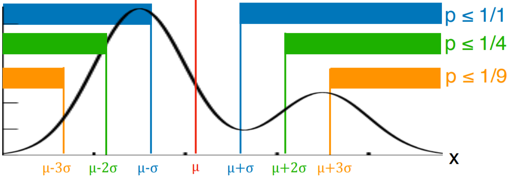
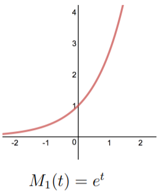
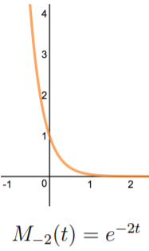
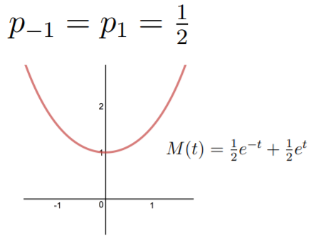

# Topic10: Inequalities and Limit Theorems

## 10.1 Markov Inequality

+ Motivation: Probability bounds
  + bound probability of events (often bad)
  + e.g., excessive rain, heavy traffic, large loss, disease outbreak
  
+ Example: Markov's meerkats
  + average meerkat height: $10^{\prime\prime}$
    + can half the meerkats $\ge 40^{\prime\prime}$ tall?
    + No, if half meerkats were $\ge 40$ tall, average would be $\ge \frac12 \times 40^{\prime\prime} = 20^{\prime\prime} > 10^{\prime\prime}$
  + $F_{40}$: fraction of meerkats $\ge 40^{\prime\prime}$ tall
  + $F_{40} \cdot 40 > 10 \implies$ average would be $> 10$
  + $F_{40} \cdot 40 \le 10 \implies F_{40} \le 10/40 = \frac14$
  + general $\mu$: $F_{4 \cdot \mu} \cdot (4 \cdot \mu) \le \mu \to F_{4 \cdot \mu} \le \frac14$

+ Markov's Inequality
  + two forms
    + intuitive, memorable
    + direct, applicable, common
  + $X$: nonnegative r.v. (discrete or continuous) w/ finite mean $\mu$
  + intuitive, memorable

    \[ \forall\; \alpha \ge 1 \quad \Pr(X \ge \alpha) \mu \le \frac{1}{\alpha} \]

    + a nonnegative r.v. is at least $\alpha$ times $\le$ its mean w/ probability $\le \frac{1}{\alpha}$
  + direct proof, easier to apply, more common

    \[ a = \alpha \mu \quad \forall\; \alpha \ge \mu \quad \Pr(X \ge a) \le \frac{\mu}{a} \]

  + proof
    + proof for discrete r.v.'s, same proof works for continuous, just $\sum \to \int$
    + $\Pr(X \ge \alpha) \le \frac{\mu}{a}$
    + $\mu = \int_x x \cdot p(x) \,dx \ge \int_{x \ge a} x \cdot p(x) \, dx$

        \[ \mu = \sum_x x \cdot p(x) \ge \sum_{x \ge a} x \cdot p(x) \ge \sum_{x \ge a} a \cdot p(x) = a \cdot \Pr(X \ge a) \]

    

      
    

+ Example: Citation counts
  + a journal paper cited 8 times on average
  + Y. Benjamin and Y. Hochberg, [Controlling the False Discovery Rate: a Practical and Powerful Approach to Multiple Testing](https://tinyurl.com/y8a4o7bw), J. R., Stat. Soc. B, 1995
    + popular (mutiple) hypothesis-testing paper
    + cited $\ge 40,000$ times
  + bound probability that a paper get cited $\ge 40,000$ times
    + $X$: \# paper citations
      + $X \ge 0 \quad \mu=8$
    + Markov:
      + $\Pr(X \ge a) \le \frac{\mu}{a}$
      + $\Pr(X \ge 40,000) \le \mu / 40K = 8 / 40K = 0.02\%$

+ Generalization?
  + can the Markov $\le$ be
    + generalized (conditions relaxed)?
    + strengthened?
  + generalization attempt: removing non-negative?
    + $X < 0 \implies \Pr(x \ge a)$ be closed to 1 for any $a$
    + $p(x) = \begin{cases} 1 - \epsilon & x = a \\ \epsilon & x = \frac{\mu - (1 - \epsilon)a}{\epsilon} \end{cases}$
    + $E[X] = \mu \implies p(X \ge a) = p(a) \approx 1 \to$ unable to remove
  + strengthening $\Pr(X \ge a) \le \frac{\mu}{a}$?
    + viz. the probability at most $\frac{\mu}{a}$
    + can the $\le$ hold with equality?

      \[ \mu = \sum_x x \cdot p(x) \ge \sum_{x \ge a} x \cdot p(x) \ge \sum_{x \ge a} a \cdot p(x) = a \cdot \Pr(X \ge a) \]

      + equality in 1st $\ge$: $\forall\, x \in (0, a), \quad p(x) = 0$
      + equality in 2nd $\ge$: $\forall \,x > a, \quad p(x) = 0$
    + only hold w/ $X \in \{0, a\}$

+ Properties of Markov's Inequality
  + applied to all non-negative random variables
  + can always be used
  + used to derive other inequalities: Chebyshev, Chernoff
  + limited to inequalities that hold for all distributions

+ Different views
  + from outside: $[0, a)$
    + $\Pr(X \ge a)$
    + upper bound $\Pr \le \frac{\mu}{a}$
  + from inside: $[0, a)$
    + $\Pr(X \le a)$
    + lower bound: $\Pr > 1 - \frac{\mu}{a}$

+ [Original Slides](https://tinyurl.com/yac6dd37)

### Problem Sets

0. A mob of 30 meerkats has an average height of 10”, and 10 of them are 30” tall. According to Markov's Inequality this is: 
  a. Possible 
  b. Impossible 

  Ans: b
  Explanation: Impossible. For the average to be 10, the remaining 20 meerkats would need to have height zero.

1. Which of the following are correct versions of Markov’s Inequality for a nonnegative random variable  X : 
  a. $\Pr(X \ge \alpha \mu) \le \frac{1}{\alpha}$ 
  b. $\Pr(X \ge \alpha \mu ) \le \mu \alpha$ 
  c. $\Pr(X \ge \mu) \le frac{1}{\alpha}$ 
  d. $\Pr(X \ge \alpha) \le \frac{\mu}{\alpha}$ 

  Ans: ad

2. Markov variations

  Upper bound $P(X \ge 3)$ when $X \ge 2$ and $E[X]=2.5$.

  Ans: 0.5 
  Explanation: Let $Y=X−2$. Then $Y \ge 0$ and $E[Y]=E[X]−2=0.5$. By Markov's inequality, $P(X \ge 3) = P(Y \ge 1) \le \frac{E[Y]}{1}=0.5$. [StackExchange](https://tinyurl.com/yc6qj6vs)

3. a. In a town of 30 families, the average annual family income is \$80,000. What is the largest number of families that can have income at least \$100,000 according to Markov’s Inequality? (Note: The annual family income can be any non-negative number.)

  b. In the same town of 30 families, the average household size is 2.5. What is the largest number of families that can have at least 4 members according to Markov’s Inequality? (Note the household size can be any postive integer.)

  Ans: a. (24); b. (15)>br/>
    + This question can be answered using the Meerkat paradigm, or we can convert it to a probability question and use Markov's Inequality. Imagine that you pick one of the 30 families uniformly at random. The expected income is the average over all families, $80,000. The probability that the random family has income at least $100,000 is the number of families with such income, normalized by 30. By Markov's Inequality, this probability is at most  80000/100000=0.8 . Hence the number of families with such income is at most  30⋅0.8=24 .
    + Let $X$ be the size of a family picked uniformly at random. Then $X \ge 1$  and $E[X]=2.5$. Define $Y=X−1$. Then $Y \ge 0$ and $E[Y]=E[X]−1=1.5$. By Markov's Inequality $P(X \ge 4)=P(Y \ge 3) \le \frac{1.5}{3}=\frac12$. Hence the fraction of families with at least 4 members is at most $\frac12⋅30=15$.

### Lecture Video

 

## 10.2 Chebyshev Inequalities

+ Motivation
  + Pafunty Chebyshev, 1821~1894
    + &gt; 12K "descendents"
    + "Father" of modern Russian mathematics
    + most famous for spelling: Chebychev, Chebysheff, Chebychov, Chebyshow, Tchebychev, Tchebycheff, Tschebyschev, Tschebychef, Tschebyscheff, ...
  + many contributions
    + $\forall\; n < \;\;\; \exists\; \text{ prime } < 2n$
    + probability theory
  + legendary teacher
    + Punctual
    + advocated applied math
    + flowery language
  + to isolate mathematics from practical sciences is to shut the cow away from the bulls
  + famous students
    + Markov
    + Lyapunov

+ Markov Inequality to Chebychev Inequality
  + Markov inequality 
    Probability that non-negative $X$ is $\alpha$ times larger than its mean is $\le \frac{1}{\alpha}$

    \[ \Pr(\text{non-negative } X \ge \alpha \mu) \le \frac{1}{\alpha} \]

  + Chebyshev inequality 
    Probability that any $X$ is $\alpha$ times further from $\mu$ than $\sigma$ is $\le \frac{1}{\alpha^2}$

    \[ \Pr(\text{any } X \ge \alpha \sigma \text{ away from } \mu) \le \frac{1}{\alpha^2} \]

+ Chebyshev's inequality
  + two forms
    + easier to illustrate, understand, remember
    + easier to prove, use
  + $X$: any r.v. (discrete or continuous) w/ finite  mean $\mu$ and  std $\sigma$
  + 1st formulation

    \[ \forall\; \alpha \ge 1 \quad \Pr(|X - \mu| \ge \alpha \sigma) \le \frac{1}{\alpha^2} \]

  + 2nd formulation: $a = \alpha \sigma$, $a$ a value of interest

    \[ \forall\; a \ge \sigma \quad \Pr(|X - \mu| \ge a) \le \frac{\sigma^2}{a^2} \]

    

      
    

  + toward a proof
    + Markov inequality

      \[ \forall\; a \ge \mu \quad \Pr(X \ge a) \le \frac{\mu}{a} \]

    + Chebyshev inequality

      \[\begin{align*}
        \forall\; a \ge \sigma \quad &\Pr(|X - \mu| \ge a) \le \frac{\sigma^2}{a^2} \qquad\quad\qquad\; |X - \mu| \ge a\\
        & \Pr \left((X - \mu)^2 \ge a^2\right) \le \frac{\sigma^2}{a^2} \qquad\qquad (X - \mu)^2 \ge  a^2
      \end{align*}\]

    + applying Markov to $(X - \mu)^2$
  + proof
    + $X$: any random variable
    + $\mu_X = E[X] \quad \sigma_X^2 = Var(X) = E[(X - \mu_X)^2]$

      \[ \Pr(|X - \mu_X| \ge a) \le \frac{\sigma_X^2}{a^2} \]

    + $Y = (X - \mu_X)^2 \to Y \ge 0 \to \mu_Y = E[(X - \mu_X)^2] = \sigma^2_X$

      \[\begin{align*}
        \Pr(|X - \mu_X| \ge a) &= \Pr((X - \mu_X)^2 \ge a^2) = \Pr(Y \ge a^2) \\
        &\le \frac{\mu_Y}{a^2} = \frac{\sigma_X^2}{a^2} \quad (\text{Markov})
      \end{align*}\]

+ Example: citations
  + $X$: \# paper citations
  + $\mu = 8, \text{suppose } \sigma = 5$
  + $\Pr(X \ge 28)?$
  + Markov
    + $\Pr(X \ge a) \le \frac{\mu}{a}$
    + $\Pr(X \ge 28) \le 8/28 \approx 29\%$
  + Chebyshev
    + $\Pr(|X - \mu| \ge a) \le \frac{\sigma^2}{a^2}$
    + $\Pr(X \ge 28) = \Pr(X - \mu \ge 20) \le \Pr(|X - \mu| \ge 20) \le (\frac{\sigma}{20})^2 = (\frac{5}{20})^2 = \frac{1}{16} \approx 6.3\%$
    + $\Pr(X \ge 40,000) = \Pr(X -\mu \ge 39,992)$ $\le \Pr(|X - \mu| \ge 39,992)$ $\le \left( \frac{\sigma}{39,992} \right)^2$ $= \left( \frac{5}{39,992} \right)^2$ $= 1.6 \times 10^{-6} \%$

+ Example: survey responses
  + survey expected to result in $\mu =$ 1M responses w/ $\sigma = 50K$
  + bound $\Pr(0.8M < \# \text{ responses } < 1.2M)$
    + 0.8M = $\mu - 4\sigma$
    + 1.2M = $\mu + 4\sigma$
  + $\Pr( \mu - 4\sigma < X < \mu + 4\sigma) = \Pr(|X - \mu| < 4\sigma) = 1 - \Pr(|X - \mu| \ge 4\sigma) \ge 1 - \frac{1}{16} = \frac{15}{16}$

+ Markov vs. Chebyshev inequalities

  <table style="font-family: arial,helvetica,sans-serif; width: 50vw;" table-layout="auto" cellspacing="0" cellpadding="5" border="1" align="center">
    <thead>
    <tr style="font-size: 1.2em;">
      <th style="text-align: center; background-color: #3d64ff; color: #ffffff; width:10%;"></th>
      <th style="text-align: center; background-color: #3d64ff; color: #ffffff; width:20%;">Formula</th>
      <th style="text-align: center; background-color: #3d64ff; color: #ffffff; width:10%;">Applies</th>
      <th style="text-align: center; background-color: #3d64ff; color: #ffffff; width:10%;">Input</th>
      <th style="text-align: center; background-color: #3d64ff; color: #ffffff; width:10%;">Range</th>
      <th style="text-align: center; background-color: #3d64ff; color: #ffffff; width:10%;">Deceases</th>
    </tr>
    </thead>
    <tbody>
    <tr>
      <th style="text-align:center;">Markov</th>
      <td style="text-align:center;">$\Pr(X \ge a) \le \frac{\mu}{a}$</td>
      <td style="text-align:center;">$X \ge 0$</td>
      <td style="text-align:center;">$\mu$</td>
      <td style="text-align:center;">$a \ge \mu$</td>
      <td style="text-align:center;">Linearity</td>
    </tr>
    <tr>
      <th style="text-align:center;">Chebyshev</th>
      <td style="text-align:center;">$\Pr(|X - \mu| \ge a) \le \frac{\sigma^2}{a^2}$</td>
      <td style="text-align:center;">Any $X$</td>
      <td style="text-align:center;">$\mu$ &amp; $\sigma$</td>
      <td style="text-align:center;">$a \ge \sigma$</td>
      <td style="text-align:center;">Quadratically</td>
    </tr>
    </tbody>
  </table>

+ One-sided Chebyshev inequality
  + [Henry Bottomley](http://www.se16.info/hgb/cheb.htm)
  + Theorem: (Chebyshev inequality - one-sided version) for $t > 0$

    \[ \Pr(X - \mu \ge t) \le \frac{1}{1 + t^2/Var(X)} = \frac{Var{X}}{Var(X) + t^2} \]

  + Proof: [Ref1](http://www.se16.info/hgb/cheb.htm#OTProof) and [Ref2](http://www.se16.info/hgb/cheb2.htm)
    + one of these, loosely based on _Probability and Random Process_ by Grimmett and Stirzaker
    + w/ $a > 0, \forall\, b \ge 0$ 

      \[ \Pr(X \ge a) = \Pr(X+b \ge a + b) \le E\left[ \frac{(X+b)^2}{(a+b)^2} \right] = \frac{\alpha^2+b^2}{(a+b)^2} \]

    + treating $\frac{\sigma^2+b^2}{(a+b)^2}$ as a function of $b$, the minimum occurs at $b = \sigma^2/a$, so 

      \[ \Pr(X \ge a) \le \frac{\sigma^2 + (\sigma^2/a)^2}{(a+\sigma^2/a)^2} = \frac{\sigma^2(a^2+\sigma^2)}{(a^2 + \sigma^2)^2} = \frac{\sigma^2}{\sigma^2 + a^2} \]

+ [Original Slides](https://tinyurl.com/y9yygxbq)

### Problem Sets

0. Which of the following is correct about Chebyshev's inequality? 
  a. It only applys to non-negative distribution 
  b. It only applys to discrete distribution 
  c. It only applys to continuous distribution 
  d. None of the above 

  Ans: d 
  Explanation: Chebyshev's inequality applies to all of those distributions.

1. Apply Chebyshev's Inequality to lower bound $P(0 < X < 4)$ when $E[X]=2$ and $E[X^2]=5$.

  Ans: 3/4 
  Explanation: Note that $P(0 < X < 4)=P(|X−2| < 2)= 1 − P(|X−2| \ge 2)$. Also, $Var(X)=E[X^2]−E^2[X]=5−2^2=1$.  By Chebyshev's inequality, $P(|X−2| \ge 2)=P(|X−E[X]| \ge 2) \le \frac{Var(X)}{2^2}=\frac14$.  Hence, $\Pr(0 < X < 4)=1−P(|X−2| \ge 2) \ge 1−\frac14= \frac34$.

2. The average number of spelling errors on a page is  5  and the standard deviation is  2 . What is the probability of more than  20  mistakes on a page? 
  a. no greater than  1%  
  b. no greater than  2%  
  c. no greater than  5%  
  d. no greater than  10% 

  Ans: b 
  Explanation: Using Chebyshev's inequality, we have $P(X > 20) < P(X \ge 20)=P(X−5 \ge 15)=P(|X−5| \ge 15) \le (\frac{2}{15})^2 \le \frac{1}{50}=2\%$. P.S. Since we cannot get negative number of mistakes, $P(X−5 \le −15)=0$. Hence, $P(|X−5| \ge 15) = P(X−5 \ge 15)+P(X−5 \le −15)=P(X−5 \ge 15)$

3. Let $X\sim \text{Exponential}(1)$. For $\Pr(X \ge 4)$, evaluate: 
  a. Markov's inequality, 
  b. Chebyshev's inequality, 
  c. the exact value. 

  Ans: a. (1/4); b. (1/9); c. ($e^{-4}$) 
  Explanation
    + $E[X]=\frac{1}{\lambda}=1$. $P(X \ge 4) \le \frac{E[X]}{4}=\frac14$.
    + $E[X]=\frac{1}{\lambda}=1, Var(X)=\frac{1}{\lambda^2}=1$. $P(X \ge 4)=P(|X−1| \ge 3) \le \frac{Var(X)}{9}=\frac19$.
    + $P(X \ge 4)=\int_4^\infty e^{−x}\,dx= e^{−4}=0.0183$.

4. A gardener has new tomato plants sprouting up in her garden. Their expected height is 8”, with standard deviation of 1". Which of the following lower bounds the probability that a plant will be between 6" and 10" tall? 
  a. 10% 
  b. 25% 
  c. 50% 
  d. 75% 
  
  Ans: abcd 
  Explanation: By Chebyshev's Inequality, $P(|X−8| \ge 2) \le \frac{Var(X)}{4}=\frac14$. Hence $P(6 \le X \le 10)=1−P(|X−8| \ge 2) \ge 1−\frac14=\frac34=75%$.  Since the probability is at least 75\%, it is also at least 50\%, etc.

5. If $E[X]=15$, $P(X \le 11)=0.2$, and $P(X \ge 19)=0.3$, which of the following is _impossible_? 
  a. $Var(X) \le 7$ 
  b. $Var(X) \le 8$ 
  c. $Var(X) > 8$ 
  d. $Var(X) > 7$ 

  Ans: a 
  Explanation: According to Chebyshev's inequality, $P(|X−15| \ge 4) \le \frac{Var(X)}{16}$. As $P(|X−15| \ge 4)=P(X \le 11)+P(X \ge 19)=0.5$, we have $Var(X) \ge 8$.

### Lecture Video

 

## 10.3 Law of Large Numbers

+ Motivation
  + probability theory based on sample averages converging to expectation
    + flip many coins, fraction of heads converges to $\frac12$
    + rolling many fair dice, average value converges to 3.5
  + previous lectures: intuition
  + current lecture: rigorous

+ Sample mean
  + sequence abbreviation: $x^n \stackrel{\text{def}}{=} x_1, x_2, \dots, x_n$
  + mean:
    + $\overline{x^n} \stackrel{\text{def}}{=} \dfrac{x_1+x_2+\cdots+x_n}{n}$
    + e.g., $n=4 \quad x^4 = 3, 1, 4, 2 \quad \overline{x^4} = \frac{3+1+4+2}{4} = 2.5$
  + $n$ samples from a distribution
    + $X^n = X_1, X_2, \dots, X_n$
    + sample mean: $\overline{X^n} \stackrel{\text{def}}{=} \dfrac{X_1 + \cdots + X_n}{n}$
    + $\overline{X^n}$: a random variable

+ Independent samples
  + Definition: (__iid__) _independent_ random variables w/ the _same_ distribution are independent identically distributed (iid)
  + examples
    + independent $B_{0.3}$ r.v.'s are iid $B_{0.3}$ or iid
    + $X_1, X_2, X_3$ are iid $B_{0.3} \to$ each $X \sim B_{0.3}$ selected ${\perp \!\!\!\! \perp}$ of all others
    + $\Pr(X_1=1, X_2=0, X_3=1) = 0.3 \cdot 0.7 \cdot 0.3 = 0.063$

+ Weak law of large numbers
  + as \# samples increases, the sample mean $\to$ distribution mean
  + $X^n = X_1, \dots, X_n$ iid samples from distribution w/ finite mean $\mu$ and finite std $\sigma$
  + $n \to \infty \implies \overline{X^n} \to \mu$
  + $\Pr(\text{sample mean differs from $\mu$ by any given amount}) \searrow 0 \text{ with } n \nearrow$

    \[ \Pr\left( \left|\overline{X^n} - \mu \right| \ge \epsilon \right) \le \frac{\sigma^2}{\epsilon^2} \cdot \frac{1}{n} \]

  + $\overline{X^n}$ converges in probability to $\mu$

+ Example: polling error
  + 2016 Presidential elections
  + poll 100,000 people
  + assuming every person voted for Trump independently w/ probability $p$
  + bound the probability that off by more than 1%
  + weak law of large number (WLLN)

    \[\begin{align*}
      \Pr\left(\left|\overline{X^n} - \mu\right| \ge \epsilon\right) &\le \frac{\sigma^2}{\epsilon^2} \cdot \frac{1}{n} \\
      \sigma^2 = p(1-p) &\le \frac14\\\\
      \Pr\left(\left|\overline{X^{100,000}} - p\right| \ge 0.01\right) &\le \frac{1/4}{0.01^2 \cdot 100,000} = 2.5\%
    \end{align*}\]

+ Properties of WLLN
  + theorem: $\Pr\left(\left|\overline{X^n} - \mu\right| \ge \epsilon\right) \le \frac{\sigma^2}{n \cdot \epsilon^2}$
  + $X_1, X_2, \dots$, iid w/ finite $\mu$ and $\sigma$
  + sample mean $\overline{X^n} \stackrel{\text{def}}{=}  \frac{1}{n} \sum_{i=1}^n X_i$
  + expectation

    \[ E\left[\overline{X^n}\right] = E\left[\frac{1}{n} \sum X_i\right] = \frac{1}{n} \sum E[X_i] = \frac{1}{n} \sum \mu = \mu \]

  + variance

    \[ Var\left(\overline{X^n}\right) = Var\left(\frac{1}{n} \sum X_i\right) = \frac{1}{n^2} Var\left(\sum X_i\right) = \frac{1}{n^2} \sum Var(X_i) = \frac{1}{n^2} \sum \sigma^2 = \frac{\sigma^2}{n} \]

  + Chebyshev inequality

    \[ \forall\, \epsilon > 0 \quad \Pr\left(\left|\overline{X^n} - \mu \right| \ge \epsilon\right) \le \frac{\sigma^2}{n\cdot \epsilon^2} \;\searrow\; 0 \text{ as } n \to \infty \]

+ Example: sensors
  + $n$ sensors measure temperature $t$
  + each reads $T_i = t + Z_i$
  + $Z_i$: noise w/ zero mean and variance $\le 2$
  + how many sensors needed to estimate $t$ to $\pm \frac12$ w/ probability $\ge 95\%$
  + WLLN

    \[ \Pr\left(\overline{X^n} \ge \epsilon\right) \le \frac{\sigma^2}{\epsilon} \cdot \frac{1}{n} \]

  + $\Pr\left(\left|\overline{T^n} - t\right| \ge 0.5 \right) \le \frac{2}{\frac14 n} \le 0.05 \to n \ge \frac{2}{\frac14 \cdot 0.05} = 2 \cdot 4 \cdot 20 = 160$

+ Generalization  
  let $\mu \stackrel{\text{def}}{=} \frac{1}{n} \sum \mu_i \quad$ and $\quad \sigma^2   \stackrel{\text{def}}{=} \frac 1 n \sum \sigma^2_i$

  \[ \Pr\left( \left|\overline{X^n} - \mu\right| \ge \epsilon \right) \le \frac{\sigma^2}{\epsilon^2} \cdot \frac{1}{n} \]

+ Convergence in probability
  + $X_1, X_2, \dots$ infinite sequence of random variables
  + $X_n$  converges in probability to a random variable $Y$: $X_n \xrightarrow{p} Y$
  + Pr($X_n$ differs from $Y$ by any given fixed amount) $\,\searrow\, 0$ with $n$
  + for every $\delta > 0 \quad \Pr\left(\left|X_n - Y\right| \ge \delta\right) \searrow 0 \text{ with } n$
  + for every $\delta > 0$ and $\epsilon > 0, \;\exists\; N \text{ s.t. } \forall\, n \ge N$

    \[ \Pr\left(\left|X_n - Y\right| \ge \delta\right) < \epsilon \]

  + WLLN: $\overline{X^n}$ converges in probability to $\mu \quad \overline{X^n} \xrightarrow{p} \mu$

+ Example: coin flips
  + most basic convergence to average: $B(p)$
  + flip $n B(p)$ coins, average \# 1's will approach $np$
  + probability of a sequence w/ $k$ 1's ad $n-k$ 0's is $p^k q^{n-k}$
  + wolog assume $p > 0.5$, then most likely is $1^n$
  + yet by WLLN w/ probability $\to 1$ we see roughly $pn$ 1's and $qn$ 0's
  + why do we observer these sequences and not the most likely ones?
  + strength in \#'s. \# sequences of a given composition increases near $\frac12$
  + $pn$ balances \# x probability

+ [Original Slides](https://tinyurl.com/yczvjc9r)

### Problem Sets

0. You have two fair coins, and you toss the pair 10,000 times (so you get 10,000 outcome pairs). Roughly how many pairs will not show any tails? 
  a. 0 
  b. 1250 
  c. 2500 
  d. 5000 

  Ans: c 
  Explanation: The probability of not getting any tails is 1/4. According to the weak law of large number, when the number of experiments grows, the sample mean gets closer to the true mean, which is 1/4 in this case. Hence, the answer is 10000 * 1/4 = 2500.

1. In plain terms, the Weak Law of Large Numbers states that as the number of experiments approaches infinity, the difference between the sample mean and the distribution mean can be as small as possible. (True/False)

  Ans: True

2. Given n iid random varibles $X_1,X_2, \dots ,X_n$ with mean $\mu$, standard deviation $\alpha < \infty$ , and the sample mean $S_n = \frac{1}{n} \sum_{i=1}^n X_i$, is it true that $\lim_{n\to\infty} E[(S_n−\mu)^2]=0$? (True/False)

  Ans: True 
  Explanation: $\lim_{n\to\infty} E[(S_n−μ)^2) = \lim_{n\to\infty} Var(S_n)= \lim_{n\to\infty} \sigma^2=0$. This means $S_n$ converges to the true mean $\mu$ in mean square sense.

3. The height of a person is a random variable with variance $\le 5 \text{ inches }^2$. According to Mr. Chebyshev, how many people do we need to sample to ensure that the sample mean is at most 1 inch away from the distribution mean with probability $\ge 95\%$?

  Ans: 100 
  Explanation: Recall from the proof of the weak law of large numbers that if $X_1, \dots X_n$ are iid samples each with variance $\sigma^2$, then the variance of the sample mean  $\overline{X^n}$ is $\sigma^2/n$. Therefore, if we sample $n$ people, the sample mean of their heights will have a variance $\le 5/n \text{ inches }^2$.  By Chebyshev's Inequality, the probability that the sample mean will be at least 1 inch away from the mean is at most $\frac{5/n}{1^2}=\frac{5}{n}$, hence the probability that the sample mean will be at most 1 inch away is at least $1−\frac{5}{n}$. We would like to have $1−\frac 5 n  \ge 0.95$, hence $\frac 5 n \le 0.05$, or $n \ge 100$.

4. For $i=1,2,\dots ,n$, let $X_i \sim U(0,4)$, $Y_i \sim N(2,4)$, and they are independent. Calculate, 
  a. $E(X_i)$ 
  b. $V(X_i)$ 
  c. $E(Y_i)$ 
  d. $V(Y_i)$ 

  Find the limit in probability of when $n \to \infty$ 
  e. $\frac 1 n \sum_{i=1}^n (X_i+Y_i)$ 
  f. $\frac 1 n \sum_{i=1}^n (X_iY_i)$ 

  Ans: a. (2); b. (4/3); c. (2); d. (4); e. (4); f. (4) 
  Explanation:
    + For $X_i \sim U(a,b)$, $E(X_i)=\frac{a+b}{2}=2$.
    + For $X_i \sim U(a,b)$, $Var(X_i)=\frac{(b−a)^2}{12}=\frac43$.
    + For $Y_i \sim N(\mu, \sigma^2)$, $E(Y_i)=\mu$.
    + For $Y_i \sim N\mu, \sigma^2)$, $E(Y_i)= \sigma^2$.
    + According to WLLN, when $n \to \infty$, $\frac 1 n \sum^n_{i=0} (X_i+Y_i) \to E(X_i+Y_i)=E(X_i)+E(Y_i)=4$.
    + According to WLLN, when $n \to \infty$, $\frac 1 n \sum^n_{i=0} (X_iY_i) \to E(X_iY_i)=E(X_i)E(Y_i)=4$.

5. a. Flip a fair coin $n$ times and let $X_n$ be the number of heads. Is it true that $P(|X_n − \frac n 2|>1000)<0.99$? (True/False)

   b. Does the result above contradict with the WLLW? (Yes/No)

  Ans: a. (False); b. (No) 
  Explanation:
    + Very roughly, $|X_n− \\frac n 2| \approx \frac{\sqrt{n}{2}$, which grows as $n$ grows. We cannont guarantee $P(|X_n− \\frac n 2|>1000)<0.99$.
    + The WLLN shows that $\lim_{n \to \infty} P(|\\frac{X}n}{n}−\\frac12|> \epsilon)=0 \to \Pr(|X_n−\\frac n 2|> \epsilonn)=0$. $\epsilon n$ increases when $n$ increases, but 1000 is not changed.

### Lecture Video

 

## 10.4 Moment Generating Functions

+ The mathematician's revenge
  + engineers have machines they can sell
  + computer scientists have software
  + food makers have production lines (McDonalds)
  + even service providers franchise (massage Envy)
  + mathematicians need to think about every problem
  + many envy

+ Moments
  + expectations of powers of $X$ are call moments
    + e.g., $E(X), E(X^2), E(X^3)$
  + sometimes call raw moments to distinguish from central moments
    + e.g., $E[(X - \mu)^n]$
  + determine
    + mean, variance, ... 
    + all together $\to$ distribution itself
  + general method to find all moments

+ Moment generating function (MGF)
  + maps a random variable $X$ to a real function $M \quad M:\Bbb{R} \to \Bbb{R}$

    \[ M(t) \stackrel{\text{def}}{=} M_X(t) \stackrel{\text{def}}{=} E[e^{tX}] = begin{cases} \sum p(x) \exp(tX) & text{discrete} \\ \int f(x) \exp(tx) & \text{continuous} \end{cases} \]

  + determined by distribution $p$ or $f$
  + $X$ more convenient
  + constant R.V.
    + r.v.: $X = c$

      \[ M_c(t) = E\left(e^{tX}\right) = \sum_x p(x) \cdot \exp(tx) = p(c) \cdot \exp(ct) = \exp(ct) \]

    

      
    

  + two constant r.v.s
    + arbitrary values: $p(c_1) = p_1 \quad p(c_2) = p_2$
    + moment generating fucntion

      \[ M(t) = E(e^{tX}) = p1 e^{c_1 t} + p_2 e^{c_2 t} \]

  + Bernoulli
    + values: 0, 1
    + $X \sim B_p \quad p_0 = 1- p \quad p_1 =p$
    + moment generating function

      \[ M(t) = (1-p) \exp(t \cdot 0) + p \exp(t \cdot 1) = (1-p) + p \exp(t) \]

    

      
    

+ Basic properties
  + non-negative: $M(t) = E(e^{tX}) > 0$
  + unitary: $M(0) = E(e^{0X}) = E(e^0) = 1$
  + finite support $X$: $t \to \infty$

    \[ M(t) \sim p(x_{\max}) \cdot e^{t \cdot x_{\max}} \]

+ Translation and scaling
  + translation: $X \to X + b$

    \[ M_{X+b}(t) = E\left(\exp(t(X+b))\right) = E(\exp(tX) \cdot \exp(tb)) = e^{tb} \cdot E(\exp(tX)) = e^{tb} M_X(t) \]

  + Scaling: $X \to aX$

    \[ M_{aX}(t) = E(\exp(t(aX))) = E(\exp(atX)) = M_X(at) \]

  + translation and scaling: $X \to aX + b$

    \[ M_{aX+b}(t) = e^{bt} \cdot M_{aX}(t) = e^{bt} \cdot M_X(at) \]

  \[ M_x(t) = e^{ct} \to M_{a\cdot c+b} = e^{bt} \cdot M_c(at) = e^{bt} \cdot e^{cat} = e^{(ac+b)\cdot t} \]

+ Independent addition
  + independent variable: MGF of sum as product of MGF's
  + two cariables:
    + $X {\perp \!\!\!\! \perp} \quad M_{X+Y}(t) = M_X(t) \cdot M_Y(t)$
    + $M_{X+Y}(t) = E[e^{t(X+Y)}] = E[e^{tX} \cdot e^{tY}] = E[e^{tX}] \cdot E[e^{tY}] = M_X(t) \cdot M_y(t)$
  + n variables
    + $X_1, X_2, \dots, X_n \;\; {\perp \!\!\!\! \perp}$
    + $X \stackrel{\text{def}} X_1 + X_2 + \cdots + X_n$
    + $M_X(t) = \prod_{i=1}^n M_{X_i}(t)$
  + mean
    + $X_1, X_2, \dots, X_n \;\; {\perp \!\!\!\! \perp}$
    + $\overline{X} \stackrel{\text{def}}{=} \frac{X_1 + X_2 + \cdots + X_n}{n}$
    + $M_{\overline{X}}(t) = \prod_{i=1}^n M_{X_i}\left(\dfrac{t}{n}\right)$

+ Moment generating function and raw moment
  + $M_X(t)$: moment generating function of $X$
  + $E(X^n)$: nth "raw" moment of $X$
  + $M_X(t) \xrightarrow{\text{determines ("generates") all moments}} E(X^n)$

+ Moment generation
  + Taylor series
  
    \[ e^y = 1 + \frac{y}{1!} + \frac{y^2}{2!} + \frac{y^3}{3!} + cdots \]

  + Derivation of MGF

    \[\begin{align*}
      M_X(t) &= E(e^{tX}) = E[1 + \frac{y}{1!} + \frac{y^2}{2!} + \frac{y^3}{3!} + \cdots] \\
      &= 1 + \frac{t}{1!} E[X] + \frac{t^2}{2!} E[X^2] + \frac{t^3}{3!} E[X^3] +\cdots \\
      M_X^\prime(t) &= \hspace{2.9em} E[X] + \frac{t}{1!} E[X^2] + \frac{t^2}{2!} E[X^3] + \cdots \\
      M_X^{\prime\prime} &= \hspace{7.5em} E[X^2] + \frac{t}{1!} E[X^3] + \cdots
    \end{align*}\]

  + raw moment
    + 0th: $M_X(0) = 1 = E[X^0]$
    + 1st: $M_X^\prime(0) = E[X]$
    + 2nd: $M_X^{\prime\prime}(0) = E[X^2]$
    + ...
    + nth: $M_X^{(n)}(0) = E[X^n]$

+ [Original Slides](https://tinyurl.com/ybwlhoup)

### Problem Sets

### Lecture Video

 

## 10.5 Chernoff Bound

### Problem Sets

### Lecture Video

 

## 10.6 Central Limit Theorem

### Problem Sets

### Lecture Video

 

## 10.7 Central Limit Theorem Proof

### Problem Sets

### Lecture Video

 

## Lecture Notebook 10

## Programming Assignment 10

