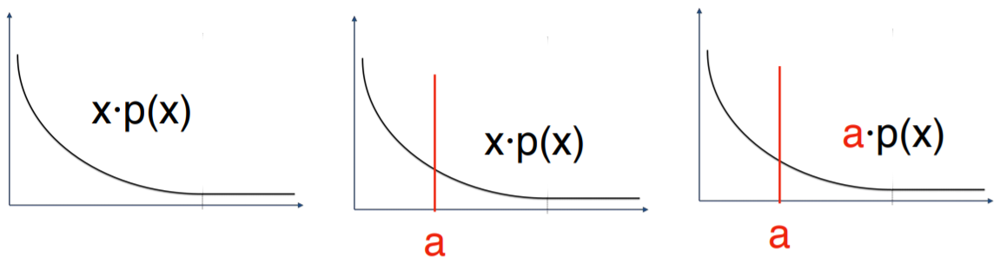

# Topic10: Inequalities and Limit Theorems

## 10.1 Markov Inequality

+ Motivation: Probability bounds
  + bound probability of events (often bad)
  + e.g., excessive rain, heavy traffic, large loss, disease outbreak
  
+ Example: Markov's meerkats
  + average meerkat height: $10^{\prime\prime}$
    + can half the meerkats $\ge 40^{\prime\prime}$ tall?
    + No, if half meerkats were $\ge 40$ tall, average would be $\ge \frac12 \times 40^{\prime\prime} = 20^{\prime\prime} > 10^{\prime\prime}$
  + $F_40}$: fraction of meerkats $\ge 40^{\prime\prime}$ tall
  + $F_{40} \cdot 40 > 10 \implies$ average would be $> 10$
  + $F_{40} \cdot 40 \le 10 \to F_{40} \le 10/40 = \frac14$
  + general $\mu$: $F_{4 \cdot \mu} \cdot (4 \cdot \mu) \le \mu \to F_{4 \cdot \mu} \le \frac14$

+ Markov's Inequality
  + two forms
    + intuitive, memorable
    + direct, applicable, common
  + $X$: nonnegative r.v. (discrete or continuous) w/ finite mean $\mu$
  + intuitive, memorable

    \[ \forall\; \alpha \ge 1 \quad \Pr(X \ge \alpha \mu \le \frac{1}{\alpha}) \]

    + a nonnegative r.v. is at least $\alpha$ times $\le$ its mean w/ probability $\le \frac{1}{\alpha}$
  + direct proof, easier to apply, more common

    \[ a = \alpha \mu \quad \forall\; \alpha \ge \mu \quad \Pr(X \ge a) \le \frac{\mu}{a} \]

  + proof
    + proof for discrete r.v.'s, same proof works for continuous, jusr $\sum \to \int$
    + $\Pr(X \ge a) \le \frac{\mu}{a}$
    + $\mu = \int_x x \cdot p9x) \ge \int_{x \ge a} x \cdot p(x)$

        \[ \mu = \sum_x x \cdot p(x) \ge \sum_{x \ge a} x \cdot p(x) \ge \sum_{x \ge a} a \cdot p(x) = a \cdot \Pr(X \ge a) \]

    

      
    

+ Example: Citation counts
  + a journal paper cited 8 times on average
  + Y. Benjamin and Y. Hochberg, [Controlling the False Discovery Rate: a Practical and Powerful Approach to Multiple Testing](https://tinyurl.com/y8a4o7bw), J. R., Stat. Soc. B, 1995
    + popular (mutiple) hypothesis-testing paper
    + cited $\ge 40,000$ times
  + bound probability that a paper get cited $\ge 40,000$ times
    + $X$: \# paper citations
      + $X \ge 0 \quad \mu=8$
    + Markov:
      + $\Pr(X \ge a) \le \frac{\mu}{a}$
      + $\Pr(X \ge 40,000) \le \mu / 40K = 8 / 40K = 0.02\%$

+ Generalization?
  + can the Markov $\le$ be
    + generalized (conditions relaxed)?
    + strengthened?
  + generalization attempt: removing non-negative?
    + $X < 0 \implies \Pr(x \ge a)$ be closed to 1 for any $a$
    + $p(x) = \begin{cases} 1 - \epsilon & x = a \\ \epsilon & x = \frac{\mu - (1 - \epsilon)a}{\epsilon} \end{cases}$
    $E[X] = \mu \implies p(X \ge a) = p(a) \approx 1 \to$ unable to remove
  + strengthening $\Pr(X \ge a) \le \frac{\mu}{a}$?
    + viz. the probability at most $\frac{\mu}{a}$
    + can the $\le$ hold with equality?

      \[ \mu = \sum_x x \cdot p(x) \ge \sum_{x \ge a} x \cdot p(x) \ge \sum_{x \ge a} a \cdot p(x) = a \cdot \Pr(X \ge a) \]

      + equality in 1st $\ge$: $\forall\, x \in (0, a), \quad p(x) = 0$
      + equality in 2nd $\ge$: $\forall \,x > a, \quad p9x) = 0$
    + only hold w/ $X \in \{0, a\}$

  + properties of strengths
    + applied to all non-negative random variables
    + can always be used
    + used to derive other inequalities: Chenushev, Chernoff
    + applied to all non-negative random variables

+ Different views
  + from outside: $[0, a)$
    + $\Pr(X \ge a)$
    + upper bound $\Pr \le \frac{\mu}{a}$
  + from inside: $[0, a)$
    + $\Pr(X \le a)$
    + lower bound: $P > 1 - \frac{\mu}{a}$

+ [Original Slides](https://tinyurl.com/yac6dd37)

### Problem Sets

### Lecture Video

 

## 10.2 Chebyshev Inequalities

### Problem Sets

### Lecture Video

 

## 10.3 Law of Large Numbers

### Problem Sets

### Lecture Video

 

## 10.4 Moment Generating Functions

### Problem Sets

### Lecture Video

 

## 10.5 Chernoff Bound

### Problem Sets

### Lecture Video

 

## 10.6 Central Limit Theorem

### Problem Sets

### Lecture Video

 

## 10.7 Central Limit Theorem Proof

### Problem Sets

### Lecture Video

 

## Lecture Notebook 10

## Programming Assignment 10

