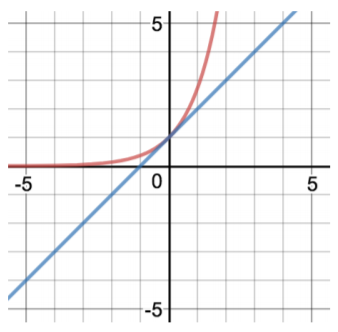
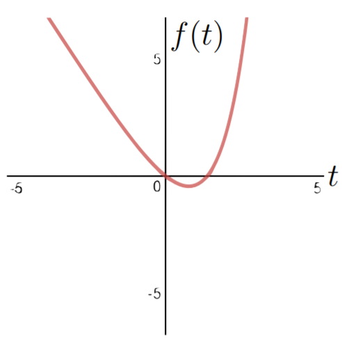
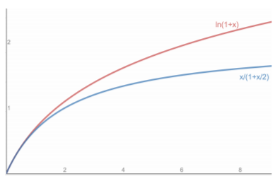
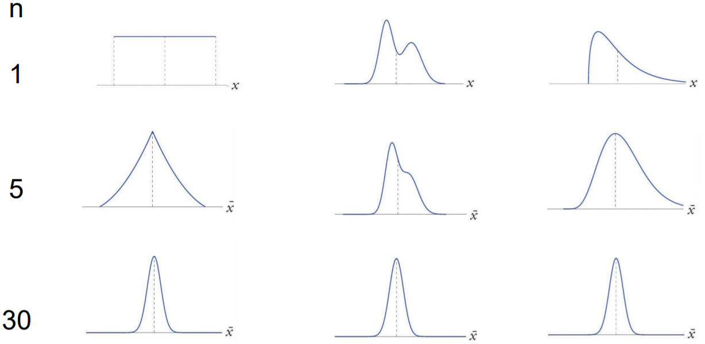

# Topic10: Inequalities and Limit Theorems

## 10.1 Markov Inequality

+ Motivation: Probability bounds
  + bound probability of events (often bad)
  + e.g., excessive rain, heavy traffic, large loss, disease outbreak
  
+ Example: Markov's meerkats
  + average meerkat height: $10^{\prime\prime}$
    + can half the meerkats $\ge 40^{\prime\prime}$ tall?
    + No, if half meerkats were $\ge 40$ tall, average would be $\ge \frac12 \times 40^{\prime\prime} = 20^{\prime\prime} > 10^{\prime\prime}$
  + $F_{40}$: fraction of meerkats $\ge 40^{\prime\prime}$ tall
  + $F_{40} \cdot 40 > 10 \implies$ average would be $> 10$
  + $F_{40} \cdot 40 \le 10 \implies F_{40} \le 10/40 = \frac14$
  + general $\mu$: $F_{4 \cdot \mu} \cdot (4 \cdot \mu) \le \mu \to F_{4 \cdot \mu} \le \frac14$

+ Markov's Inequality
  + two forms
    + intuitive, memorable
    + direct, applicable, common
  + $X$: nonnegative r.v. (discrete or continuous) w/ finite mean $\mu$
  + intuitive, memorable

    \[ \forall\; \alpha \ge 1 \quad \Pr(X \ge \alpha) \mu \le \frac{1}{\alpha} \]

    + a nonnegative r.v. is at least $\alpha$ times $\le$ its mean w/ probability $\le \frac{1}{\alpha}$
  + direct proof, easier to apply, more common

    \[ a = \alpha \mu \quad \forall\; \alpha \ge \mu \quad \Pr(X \ge a) \le \frac{\mu}{a} \]

  + proof
    + proof for discrete r.v.'s, same proof works for continuous, just $\sum \to \int$
    + $\Pr(X \ge \alpha) \le \frac{\mu}{a}$
    + $\mu = \int_x x \cdot p(x) \,dx \ge \int_{x \ge a} x \cdot p(x) \, dx$

        \[ \mu = \sum_x x \cdot p(x) \ge \sum_{x \ge a} x \cdot p(x) \ge \sum_{x \ge a} a \cdot p(x) = a \cdot \Pr(X \ge a) \]

    

      
    

+ Example: Citation counts
  + a journal paper cited 8 times on average
  + Y. Benjamin and Y. Hochberg, [Controlling the False Discovery Rate: a Practical and Powerful Approach to Multiple Testing](https://tinyurl.com/y8a4o7bw), J. R., Stat. Soc. B, 1995
    + popular (mutiple) hypothesis-testing paper
    + cited $\ge 40,000$ times
  + bound probability that a paper get cited $\ge 40,000$ times
    + $X$: \# paper citations
      + $X \ge 0 \quad \mu=8$
    + Markov:
      + $\Pr(X \ge a) \le \frac{\mu}{a}$
      + $\Pr(X \ge 40,000) \le \mu / 40K = 8 / 40K = 0.02\%$

+ Generalization?
  + can the Markov $\le$ be
    + generalized (conditions relaxed)?
    + strengthened?
  + generalization attempt: removing non-negative?
    + $X < 0 \implies \Pr(x \ge a)$ be closed to 1 for any $a$
    + $p(x) = \begin{cases} 1 - \epsilon & x = a \\ \epsilon & x = \frac{\mu - (1 - \epsilon)a}{\epsilon} \end{cases}$
    + $E[X] = \mu \implies p(X \ge a) = p(a) \approx 1 \to$ unable to remove
  + strengthening $\Pr(X \ge a) \le \frac{\mu}{a}$?
    + viz. the probability at most $\frac{\mu}{a}$
    + can the $\le$ hold with equality?

      \[ \mu = \sum_x x \cdot p(x) \ge \sum_{x \ge a} x \cdot p(x) \ge \sum_{x \ge a} a \cdot p(x) = a \cdot \Pr(X \ge a) \]

      + equality in 1st $\ge$: $\forall\, x \in (0, a), \quad p(x) = 0$
      + equality in 2nd $\ge$: $\forall \,x > a, \quad p(x) = 0$
    + only hold w/ $X \in \{0, a\}$

+ Properties of Markov's Inequality
  + applied to all non-negative random variables
  + can always be used
  + used to derive other inequalities: Chebyshev, Chernoff
  + limited to inequalities that hold for all distributions

+ Different views
  + from outside: $[0, a)$
    + $\Pr(X \ge a)$
    + upper bound $\Pr \le \frac{\mu}{a}$
  + from inside: $[0, a)$
    + $\Pr(X \le a)$
    + lower bound: $\Pr > 1 - \frac{\mu}{a}$

+ [Original Slides](https://tinyurl.com/yac6dd37)

### Problem Sets

0. A mob of 30 meerkats has an average height of 10”, and 10 of them are 30” tall. According to Markov's Inequality this is: 
  a. Possible 
  b. Impossible 

  Ans: b
  Explanation: Impossible. For the average to be 10, the remaining 20 meerkats would need to have height zero.

1. Which of the following are correct versions of Markov’s Inequality for a nonnegative random variable  X : 
  a. $\Pr(X \ge \alpha \mu) \le \frac{1}{\alpha}$ 
  b. $\Pr(X \ge \alpha \mu ) \le \mu \alpha$ 
  c. $\Pr(X \ge \mu) \le frac{1}{\alpha}$ 
  d. $\Pr(X \ge \alpha) \le \frac{\mu}{\alpha}$ 

  Ans: ad

2. Markov variations

  Upper bound $P(X \ge 3)$ when $X \ge 2$ and $E[X]=2.5$.

  Ans: 0.5 
  Explanation: Let $Y=X−2$. Then $Y \ge 0$ and $E[Y]=E[X]−2=0.5$. By Markov's inequality, $P(X \ge 3) = P(Y \ge 1) \le \frac{E[Y]}{1}=0.5$. [StackExchange](https://tinyurl.com/yc6qj6vs)

3. a. In a town of 30 families, the average annual family income is \$80,000. What is the largest number of families that can have income at least \$100,000 according to Markov’s Inequality? (Note: The annual family income can be any non-negative number.)

  b. In the same town of 30 families, the average household size is 2.5. What is the largest number of families that can have at least 4 members according to Markov’s Inequality? (Note the household size can be any postive integer.)

  Ans: a. (24); b. (15)>br/>
    + This question can be answered using the Meerkat paradigm, or we can convert it to a probability question and use Markov's Inequality. Imagine that you pick one of the 30 families uniformly at random. The expected income is the average over all families, $80,000. The probability that the random family has income at least $100,000 is the number of families with such income, normalized by 30. By Markov's Inequality, this probability is at most  80000/100000=0.8 . Hence the number of families with such income is at most  30⋅0.8=24 .
    + Let $X$ be the size of a family picked uniformly at random. Then $X \ge 1$  and $E[X]=2.5$. Define $Y=X−1$. Then $Y \ge 0$ and $E[Y]=E[X]−1=1.5$. By Markov's Inequality $P(X \ge 4)=P(Y \ge 3) \le \frac{1.5}{3}=\frac12$. Hence the fraction of families with at least 4 members is at most $\frac12⋅30=15$.

### Lecture Video

 

## 10.2 Chebyshev Inequalities

+ Motivation
  + Pafunty Chebyshev, 1821~1894
    + &gt; 12K "descendents"
    + "Father" of modern Russian mathematics
    + most famous for spelling: Chebychev, Chebysheff, Chebychov, Chebyshow, Tchebychev, Tchebycheff, Tschebyschev, Tschebychef, Tschebyscheff, ...
  + many contributions
    + $\forall\; n < \;\;\; \exists\; \text{ prime } < 2n$
    + probability theory
  + legendary teacher
    + Punctual
    + advocated applied math
    + flowery language
  + to isolate mathematics from practical sciences is to shut the cow away from the bulls
  + famous students
    + Markov
    + Lyapunov

+ Markov Inequality to Chebychev Inequality
  + Markov inequality 
    Probability that non-negative $X$ is $\alpha$ times larger than its mean is $\le \frac{1}{\alpha}$

    \[ \Pr(\text{non-negative } X \ge \alpha \mu) \le \frac{1}{\alpha} \]

  + Chebyshev inequality 
    Probability that any $X$ is $\alpha$ times further from $\mu$ than $\sigma$ is $\le \frac{1}{\alpha^2}$

    \[ \Pr(\text{any } X \ge \alpha \sigma \text{ away from } \mu) \le \frac{1}{\alpha^2} \]

+ Chebyshev's inequality
  + two forms
    + easier to illustrate, understand, remember
    + easier to prove, use
  + $X$: any r.v. (discrete or continuous) w/ finite  mean $\mu$ and  std $\sigma$
  + 1st formulation

    \[ \forall\; \alpha \ge 1 \quad \Pr(|X - \mu| \ge \alpha \sigma) \le \frac{1}{\alpha^2} \]

  + 2nd formulation: $a = \alpha \sigma$, $a$ a value of interest

    \[ \forall\; a \ge \sigma \quad \Pr(|X - \mu| \ge a) \le \frac{\sigma^2}{a^2} \]

    

      
    

  + toward a proof
    + Markov inequality

      \[ \forall\; a \ge \mu \quad \Pr(X \ge a) \le \frac{\mu}{a} \]

    + Chebyshev inequality

      \[\begin{align*}
        \forall\; a \ge \sigma \quad &\Pr(|X - \mu| \ge a) \le \frac{\sigma^2}{a^2} \qquad\quad\qquad\; |X - \mu| \ge a\\
        & \Pr \left((X - \mu)^2 \ge a^2\right) \le \frac{\sigma^2}{a^2} \qquad\qquad (X - \mu)^2 \ge  a^2
      \end{align*}\]

    + applying Markov to $(X - \mu)^2$
  + proof
    + $X$: any random variable
    + $\mu_X = E[X] \quad \sigma_X^2 = Var(X) = E[(X - \mu_X)^2]$

      \[ \Pr(|X - \mu_X| \ge a) \le \frac{\sigma_X^2}{a^2} \]

    + $Y = (X - \mu_X)^2 \to Y \ge 0 \to \mu_Y = E[(X - \mu_X)^2] = \sigma^2_X$

      \[\begin{align*}
        \Pr(|X - \mu_X| \ge a) &= \Pr((X - \mu_X)^2 \ge a^2) = \Pr(Y \ge a^2) \\
        &\le \frac{\mu_Y}{a^2} = \frac{\sigma_X^2}{a^2} \quad (\text{Markov})
      \end{align*}\]

+ Example: citations
  + $X$: \# paper citations
  + $\mu = 8, \text{suppose } \sigma = 5$
  + $\Pr(X \ge 28)?$
  + Markov
    + $\Pr(X \ge a) \le \frac{\mu}{a}$
    + $\Pr(X \ge 28) \le 8/28 \approx 29\%$
  + Chebyshev
    + $\Pr(|X - \mu| \ge a) \le \frac{\sigma^2}{a^2}$
    + $\Pr(X \ge 28) = \Pr(X - \mu \ge 20) \le \Pr(|X - \mu| \ge 20) \le (\frac{\sigma}{20})^2 = (\frac{5}{20})^2 = \frac{1}{16} \approx 6.3\%$
    + $\Pr(X \ge 40,000) = \Pr(X -\mu \ge 39,992)$ $\le \Pr(|X - \mu| \ge 39,992)$ $\le \left( \frac{\sigma}{39,992} \right)^2$ $= \left( \frac{5}{39,992} \right)^2$ $= 1.6 \times 10^{-6} \%$

+ Example: survey responses
  + survey expected to result in $\mu =$ 1M responses w/ $\sigma = 50K$
  + bound $\Pr(0.8M < \# \text{ responses } < 1.2M)$
    + 0.8M = $\mu - 4\sigma$
    + 1.2M = $\mu + 4\sigma$
  + $\Pr( \mu - 4\sigma < X < \mu + 4\sigma) = \Pr(|X - \mu| < 4\sigma) = 1 - \Pr(|X - \mu| \ge 4\sigma) \ge 1 - \frac{1}{16} = \frac{15}{16}$

+ Markov vs. Chebyshev inequalities

  <table style="font-family: arial,helvetica,sans-serif; width: 50vw;" table-layout="auto" cellspacing="0" cellpadding="5" border="1" align="center">
    <thead>
    <tr style="font-size: 1.2em;">
      <th style="text-align: center; background-color: #3d64ff; color: #ffffff; width:10%;"></th>
      <th style="text-align: center; background-color: #3d64ff; color: #ffffff; width:20%;">Formula</th>
      <th style="text-align: center; background-color: #3d64ff; color: #ffffff; width:10%;">Applies</th>
      <th style="text-align: center; background-color: #3d64ff; color: #ffffff; width:10%;">Input</th>
      <th style="text-align: center; background-color: #3d64ff; color: #ffffff; width:10%;">Range</th>
      <th style="text-align: center; background-color: #3d64ff; color: #ffffff; width:10%;">Deceases</th>
    </tr>
    </thead>
    <tbody>
    <tr>
      <th style="text-align:center;">Markov</th>
      <td style="text-align:center;">$\Pr(X \ge a) \le \frac{\mu}{a}$</td>
      <td style="text-align:center;">$X \ge 0$</td>
      <td style="text-align:center;">$\mu$</td>
      <td style="text-align:center;">$a \ge \mu$</td>
      <td style="text-align:center;">Linearity</td>
    </tr>
    <tr>
      <th style="text-align:center;">Chebyshev</th>
      <td style="text-align:center;">$\Pr(|X - \mu| \ge a) \le \frac{\sigma^2}{a^2}$</td>
      <td style="text-align:center;">Any $X$</td>
      <td style="text-align:center;">$\mu$ &amp; $\sigma$</td>
      <td style="text-align:center;">$a \ge \sigma$</td>
      <td style="text-align:center;">Quadratically</td>
    </tr>
    </tbody>
  </table>

+ One-sided Chebyshev inequality
  + [Henry Bottomley](http://www.se16.info/hgb/cheb.htm)
  + Theorem: (Chebyshev inequality - one-sided version) for $t > 0$

    \[ \Pr(X - \mu \ge t) \le \frac{1}{1 + t^2/Var(X)} = \frac{Var{X}}{Var(X) + t^2} \]

  + Proof: [Ref1](http://www.se16.info/hgb/cheb.htm#OTProof) and [Ref2](http://www.se16.info/hgb/cheb2.htm)
    + one of these, loosely based on _Probability and Random Process_ by Grimmett and Stirzaker
    + w/ $a > 0, \forall\, b \ge 0$ 

      \[ \Pr(X \ge a) = \Pr(X+b \ge a + b) \le E\left[ \frac{(X+b)^2}{(a+b)^2} \right] = \frac{\alpha^2+b^2}{(a+b)^2} \]

    + treating $\frac{\sigma^2+b^2}{(a+b)^2}$ as a function of $b$, the minimum occurs at $b = \sigma^2/a$, so 

      \[ \Pr(X \ge a) \le \frac{\sigma^2 + (\sigma^2/a)^2}{(a+\sigma^2/a)^2} = \frac{\sigma^2(a^2+\sigma^2)}{(a^2 + \sigma^2)^2} = \frac{\sigma^2}{\sigma^2 + a^2} \]

+ [Original Slides](https://tinyurl.com/y9yygxbq)

### Problem Sets

0. Which of the following is correct about Chebyshev's inequality? 
  a. It only applys to non-negative distribution 
  b. It only applys to discrete distribution 
  c. It only applys to continuous distribution 
  d. None of the above 

  Ans: d 
  Explanation: Chebyshev's inequality applies to all of those distributions.

1. Apply Chebyshev's Inequality to lower bound $P(0 < X < 4)$ when $E[X]=2$ and $E[X^2]=5$.

  Ans: 3/4 
  Explanation: Note that $P(0 < X < 4)=P(|X−2| < 2)= 1 − P(|X−2| \ge 2)$. Also, $Var(X)=E[X^2]−E^2[X]=5−2^2=1$.  By Chebyshev's inequality, $P(|X−2| \ge 2)=P(|X−E[X]| \ge 2) \le \frac{Var(X)}{2^2}=\frac14$.  Hence, $\Pr(0 < X < 4)=1−P(|X−2| \ge 2) \ge 1−\frac14= \frac34$.

2. The average number of spelling errors on a page is  5  and the standard deviation is  2 . What is the probability of more than  20  mistakes on a page? 
  a. no greater than  1%  
  b. no greater than  2%  
  c. no greater than  5%  
  d. no greater than  10% 

  Ans: b 
  Explanation: Using Chebyshev's inequality, we have $P(X > 20) < P(X \ge 20)=P(X−5 \ge 15)=P(|X−5| \ge 15) \le (\frac{2}{15})^2 \le \frac{1}{50}=2\%$. P.S. Since we cannot get negative number of mistakes, $P(X−5 \le −15)=0$. Hence, $P(|X−5| \ge 15) = P(X−5 \ge 15)+P(X−5 \le −15)=P(X−5 \ge 15)$

3. Let $X\sim \text{Exponential}(1)$. For $\Pr(X \ge 4)$, evaluate: 
  a. Markov's inequality, 
  b. Chebyshev's inequality, 
  c. the exact value. 

  Ans: a. (1/4); b. (1/9); c. ($e^{-4}$) 
  Explanation
    + $E[X]=\frac{1}{\lambda}=1$. $P(X \ge 4) \le \frac{E[X]}{4}=\frac14$.
    + $E[X]=\frac{1}{\lambda}=1, Var(X)=\frac{1}{\lambda^2}=1$. $P(X \ge 4)=P(|X−1| \ge 3) \le \frac{Var(X)}{9}=\frac19$.
    + $P(X \ge 4)=\int_4^\infty e^{−x}\,dx= e^{−4}=0.0183$.

4. A gardener has new tomato plants sprouting up in her garden. Their expected height is 8”, with standard deviation of 1". Which of the following lower bounds the probability that a plant will be between 6" and 10" tall? 
  a. 10% 
  b. 25% 
  c. 50% 
  d. 75% 
  
  Ans: abcd 
  Explanation: By Chebyshev's Inequality, $P(|X−8| \ge 2) \le \frac{Var(X)}{4}=\frac14$. Hence $P(6 \le X \le 10)=1−P(|X−8| \ge 2) \ge 1−\frac14=\frac34=75%$.  Since the probability is at least 75\%, it is also at least 50\%, etc.

5. If $E[X]=15$, $P(X \le 11)=0.2$, and $P(X \ge 19)=0.3$, which of the following is _impossible_? 
  a. $Var(X) \le 7$ 
  b. $Var(X) \le 8$ 
  c. $Var(X) > 8$ 
  d. $Var(X) > 7$ 

  Ans: a 
  Explanation: According to Chebyshev's inequality, $P(|X−15| \ge 4) \le \frac{Var(X)}{16}$. As $P(|X−15| \ge 4)=P(X \le 11)+P(X \ge 19)=0.5$, we have $Var(X) \ge 8$.

### Lecture Video

 

## 10.3 Law of Large Numbers

+ Motivation
  + probability theory based on sample averages converging to expectation
    + flip many coins, fraction of heads converges to $\frac12$
    + rolling many fair dice, average value converges to 3.5
  + previous lectures: intuition
  + current lecture: rigorous

+ Sample mean
  + sequence abbreviation: $x^n \stackrel{\text{def}}{=} x_1, x_2, \dots, x_n$
  + mean:
    + $\overline{x^n} \stackrel{\text{def}}{=} \dfrac{x_1+x_2+\cdots+x_n}{n}$
    + e.g., $n=4 \quad x^4 = 3, 1, 4, 2 \quad \overline{x^4} = \frac{3+1+4+2}{4} = 2.5$
  + $n$ samples from a distribution
    + $X^n = X_1, X_2, \dots, X_n$
    + sample mean: $\overline{X^n} \stackrel{\text{def}}{=} \dfrac{X_1 + \cdots + X_n}{n}$
    + $\overline{X^n}$: a random variable

+ Independent samples
  + Definition: (__iid__) _independent_ random variables w/ the _same_ distribution are independent identically distributed (iid)
  + examples
    + independent $B_{0.3}$ r.v.'s are iid $B_{0.3}$ or iid
    + $X_1, X_2, X_3$ are iid $B_{0.3} \to$ each $X \sim B_{0.3}$ selected ${\perp \!\!\!\! \perp}$ of all others
    + $\Pr(X_1=1, X_2=0, X_3=1) = 0.3 \cdot 0.7 \cdot 0.3 = 0.063$

+ Weak law of large numbers
  + as \# samples increases, the sample mean $\to$ distribution mean
  + $X^n = X_1, \dots, X_n$ iid samples from distribution w/ finite mean $\mu$ and finite std $\sigma$
  + $n \to \infty \implies \overline{X^n} \to \mu$
  + $\Pr(\text{sample mean differs from $\mu$ by any given amount}) \searrow 0 \text{ with } n \nearrow$

    \[ \Pr\left( \left|\overline{X^n} - \mu \right| \ge \epsilon \right) \le \frac{\sigma^2}{\epsilon^2} \cdot \frac{1}{n} \]

  + $\overline{X^n}$ converges in probability to $\mu$

+ Example: polling error
  + 2016 Presidential elections
  + poll 100,000 people
  + assuming every person voted for Trump independently w/ probability $p$
  + bound the probability that off by more than 1%
  + weak law of large number (WLLN)

    \[\begin{align*}
      \Pr\left(\left|\overline{X^n} - \mu\right| \ge \epsilon\right) &\le \frac{\sigma^2}{\epsilon^2} \cdot \frac{1}{n} \\
      \sigma^2 = p(1-p) &\le \frac14\\\\
      \Pr\left(\left|\overline{X^{100,000}} - p\right| \ge 0.01\right) &\le \frac{1/4}{0.01^2 \cdot 100,000} = 2.5\%
    \end{align*}\]

+ Properties of WLLN
  + theorem: $\Pr\left(\left|\overline{X^n} - \mu\right| \ge \epsilon\right) \le \frac{\sigma^2}{n \cdot \epsilon^2}$
  + $X_1, X_2, \dots$, iid w/ finite $\mu$ and $\sigma$
  + sample mean $\overline{X^n} \stackrel{\text{def}}{=}  \frac{1}{n} \sum_{i=1}^n X_i$
  + expectation

    \[ E\left[\overline{X^n}\right] = E\left[\frac{1}{n} \sum X_i\right] = \frac{1}{n} \sum E[X_i] = \frac{1}{n} \sum \mu = \mu \]

  + variance

    \[ Var\left(\overline{X^n}\right) = Var\left(\frac{1}{n} \sum X_i\right) = \frac{1}{n^2} Var\left(\sum X_i\right) = \frac{1}{n^2} \sum Var(X_i) = \frac{1}{n^2} \sum \sigma^2 = \frac{\sigma^2}{n} \]

  + Chebyshev inequality

    \[ \forall\, \epsilon > 0 \quad \Pr\left(\left|\overline{X^n} - \mu \right| \ge \epsilon\right) \le \frac{\sigma^2}{n\cdot \epsilon^2} \;\searrow\; 0 \text{ as } n \to \infty \]

+ Example: sensors
  + $n$ sensors measure temperature $t$
  + each reads $T_i = t + Z_i$
  + $Z_i$: noise w/ zero mean and variance $\le 2$
  + how many sensors needed to estimate $t$ to $\pm \frac12$ w/ probability $\ge 95\%$
  + WLLN

    \[ \Pr\left(\overline{X^n} \ge \epsilon\right) \le \frac{\sigma^2}{\epsilon} \cdot \frac{1}{n} \]

  + $\Pr\left(\left|\overline{T^n} - t\right| \ge 0.5 \right) \le \frac{2}{\frac14 n} \le 0.05 \to n \ge \frac{2}{\frac14 \cdot 0.05} = 2 \cdot 4 \cdot 20 = 160$

+ Generalization  
  let $\mu \stackrel{\text{def}}{=} \frac{1}{n} \sum \mu_i \quad$ and $\quad \sigma^2   \stackrel{\text{def}}{=} \frac 1 n \sum \sigma^2_i$

  \[ \Pr\left( \left|\overline{X^n} - \mu\right| \ge \epsilon \right) \le \frac{\sigma^2}{\epsilon^2} \cdot \frac{1}{n} \]

+ Convergence in probability
  + $X_1, X_2, \dots$ infinite sequence of random variables
  + $X_n$  converges in probability to a random variable $Y$: $X_n \xrightarrow{p} Y$
  + Pr($X_n$ differs from $Y$ by any given fixed amount) $\,\searrow\, 0$ with $n$
  + for every $\delta > 0 \quad \Pr\left(\left|X_n - Y\right| \ge \delta\right) \searrow 0 \text{ with } n$
  + for every $\delta > 0$ and $\epsilon > 0, \;\exists\; N \text{ s.t. } \forall\, n \ge N$

    \[ \Pr\left(\left|X_n - Y\right| \ge \delta\right) < \epsilon \]

  + WLLN: $\overline{X^n}$ converges in probability to $\mu \quad \overline{X^n} \xrightarrow{p} \mu$

+ Example: coin flips
  + most basic convergence to average: $B(p)$
  + flip $n B(p)$ coins, average \# 1's will approach $np$
  + probability of a sequence w/ $k$ 1's ad $n-k$ 0's is $p^k q^{n-k}$
  + wolog assume $p > 0.5$, then most likely is $1^n$
  + yet by WLLN w/ probability $\to 1$ we see roughly $pn$ 1's and $qn$ 0's
  + why do we observer these sequences and not the most likely ones?
  + strength in \#'s. \# sequences of a given composition increases near $\frac12$
  + $pn$ balances \# x probability

+ [Original Slides](https://tinyurl.com/yczvjc9r)

### Problem Sets

0. You have two fair coins, and you toss the pair 10,000 times (so you get 10,000 outcome pairs). Roughly how many pairs will not show any tails? 
  a. 0 
  b. 1250 
  c. 2500 
  d. 5000 

  Ans: c 
  Explanation: The probability of not getting any tails is 1/4. According to the weak law of large number, when the number of experiments grows, the sample mean gets closer to the true mean, which is 1/4 in this case. Hence, the answer is 10000 * 1/4 = 2500.

1. In plain terms, the Weak Law of Large Numbers states that as the number of experiments approaches infinity, the difference between the sample mean and the distribution mean can be as small as possible. (True/False)

  Ans: True

2. Given n iid random varibles $X_1,X_2, \dots ,X_n$ with mean $\mu$, standard deviation $\alpha < \infty$ , and the sample mean $S_n = \frac{1}{n} \sum_{i=1}^n X_i$, is it true that $\lim_{n\to\infty} E[(S_n−\mu)^2]=0$? (True/False)

  Ans: True 
  Explanation: $\lim_{n\to\infty} E[(S_n−μ)^2) = \lim_{n\to\infty} Var(S_n)= \lim_{n\to\infty} \sigma^2=0$. This means $S_n$ converges to the true mean $\mu$ in mean square sense.

3. The height of a person is a random variable with variance $\le 5 \text{ inches }^2$. According to Mr. Chebyshev, how many people do we need to sample to ensure that the sample mean is at most 1 inch away from the distribution mean with probability $\ge 95\%$?

  Ans: 100 
  Explanation: Recall from the proof of the weak law of large numbers that if $X_1, \dots X_n$ are iid samples each with variance $\sigma^2$, then the variance of the sample mean  $\overline{X^n}$ is $\sigma^2/n$. Therefore, if we sample $n$ people, the sample mean of their heights will have a variance $\le 5/n \text{ inches }^2$.  By Chebyshev's Inequality, the probability that the sample mean will be at least 1 inch away from the mean is at most $\frac{5/n}{1^2}=\frac{5}{n}$, hence the probability that the sample mean will be at most 1 inch away is at least $1−\frac{5}{n}$. We would like to have $1−\frac 5 n  \ge 0.95$, hence $\frac 5 n \le 0.05$, or $n \ge 100$.

4. For $i=1,2,\dots ,n$, let $X_i \sim U(0,4)$, $Y_i \sim N(2,4)$, and they are independent. Calculate, 
  a. $E(X_i)$ 
  b. $V(X_i)$ 
  c. $E(Y_i)$ 
  d. $V(Y_i)$ 

  Find the limit in probability of when $n \to \infty$ 
  e. $\frac 1 n \sum_{i=1}^n (X_i+Y_i)$ 
  f. $\frac 1 n \sum_{i=1}^n (X_iY_i)$ 

  Ans: a. (2); b. (4/3); c. (2); d. (4); e. (4); f. (4) 
  Explanation:
    + For $X_i \sim U(a,b)$, $E(X_i)=\frac{a+b}{2}=2$.
    + For $X_i \sim U(a,b)$, $Var(X_i)=\frac{(b−a)^2}{12}=\frac43$.
    + For $Y_i \sim N(\mu, \sigma^2)$, $E(Y_i)=\mu$.
    + For $Y_i \sim N\mu, \sigma^2)$, $E(Y_i)= \sigma^2$.
    + According to WLLN, when $n \to \infty$, $\frac 1 n \sum^n_{i=0} (X_i+Y_i) \to E(X_i+Y_i)=E(X_i)+E(Y_i)=4$.
    + According to WLLN, when $n \to \infty$, $\frac 1 n \sum^n_{i=0} (X_iY_i) \to E(X_iY_i)=E(X_i)E(Y_i)=4$.

5. a. Flip a fair coin $n$ times and let $X_n$ be the number of heads. Is it true that $P(|X_n − \frac n 2|>1000)<0.99$? (True/False)

   b. Does the result above contradict with the WLLW? (Yes/No)

  Ans: a. (False); b. (No) 
  Explanation:
    + Very roughly, $|X_n− \\frac n 2| \approx \frac{\sqrt{n}{2}$, which grows as $n$ grows. We cannont guarantee $P(|X_n− \\frac n 2|>1000)<0.99$.
    + The WLLN shows that $\lim_{n \to \infty} P(|\\frac{X}n}{n}−\\frac12|> \epsilon)=0 \to \Pr(|X_n−\\frac n 2|> \epsilonn)=0$. $\epsilon n$ increases when $n$ increases, but 1000 is not changed.

### Lecture Video

 

## 10.4 Moment Generating Functions

+ The mathematician's revenge
  + engineers have machines they can sell
  + computer scientists have software
  + food makers have production lines (McDonalds)
  + even service providers franchise (massage Envy)
  + mathematicians need to think about every problem
  + many envy

+ Moments
  + moments: expectations of powers of $X$, e.g., $E[X], E[X^2], E[X^3]$
  + sometimes called raw moments to distinguish from central moments, e.g., $E[(X - \mu)^n]$
  + determining
    + mean, variance, ...
    + all together $\to$ distribution itself
  + general method to find all moments

+ Moment generating function (MGF)
  + maps a random variable $X$ to a real function $M \quad M:\Bbb{R} \to \Bbb{R}$

    \[ M(t) \stackrel{\text{def}}{=} M_X(t) \stackrel{\text{def}}{=} E[e^{tX}] = \begin{cases} \sum p(x) \;e^{tx} & \text{discrete} \\\\ \int f(x) \;e^{tx}\,dx & \text{continuous} \end{cases} \]

  + determined by distribution $p(X)$ or $f(X)$
  + $X$ more convenient

+ Example: few values
  + one value (constant).
    + r.v.: $X = c$

      \[ M_c(t) = E\left[e^{tX}\right] = \sum_x p(x) \cdot e^{tx} = p(c) \cdot e^{ct} = e^{ct} \]

    

      
    

  + two arbitary values
    + arbitrary values: $p(c_1) = p_1 \quad p(c_2) = p_2$
    + moment generating fucntion

      \[ M(t) = E[e^{tX}] = p_1 e^{c_1 t} + p_2 e^{c_2 t} \]

+ Example: Bernoulli w/ values 0, 1
  + r.v.: $X \sim B_p \quad p_0 = 1- p \quad p_1 =p$
  + moment generating function

    \[ M(t) = (1-p) \;e^{t \cdot 0} + p \;e^{t \cdot 1} = (1-p) + p \;e^{t} \]

  

    
  

+ Basic properties
  + non-negative: $M(t) = E[e^{tX}] > 0$
  + unitary: $M(0) = E[e^{0X}] = E[e^0] = 1$
  + finite support $X$: $t \to \infty$

    \[ M(t) \sim p(x_{\max}) \cdot e^{t \cdot x_{\max}} \]

+ Translation and scaling
  + translation: $X \to X + b$

    \[ M_{X+b}(t) = E\left[e^{t(X+b)}\right] = E[e^{tX} \cdot e^{tb}] = e^{tb} \cdot E[e^{tX}] = e^{tb} M_X(t) \]

  + Scaling: $X \to aX$

    \[ M_{aX}(t) = E[e^{t(aX)}] = E[e^{atX}] = M_X(at) \]

  + translation and scaling: $X \to aX + b$

    \[ M_{aX+b}(t) = e^{bt} \cdot M_{aX}(t) = e^{bt} \cdot M_X(at) \]

  + constant MGF

    \[ M_c(t) = e^{ct} \to M_{a\cdot c+b}(t) = e^{bt} \cdot M_c(at) = e^{bt} \cdot e^{cat} = e^{(ac+b)\cdot t} \]

+ Independent addition
  + independent variable: MGF of sum as product of MGF's
  + two variables:
    + $X {\perp \!\!\!\! \perp} Y \quad M_{X+Y}(t) = M_X(t) \cdot M_Y(t)$
    + proof: $M_{X+Y}(t) = E[e^{t(X+Y)}] = E[e^{tX} \cdot e^{tY}] = E[e^{tX}] \cdot E[e^{tY}] = M_X(t) \cdot M_Y(t)$
  + n variables
    + $X_1, X_2, \dots, X_n \;\; {\perp \!\!\!\! \perp}$
    + $X \stackrel{\text{def}}{=} X_1 + X_2 + \cdots + X_n$
    + $M_X(t) = \prod_{i=1}^n M_{X_i}(t)$
  + mean
    + $X_1, X_2, \dots, X_n \;\; {\perp \!\!\!\! \perp}$
    + $\overline{X} \stackrel{\text{def}}{=} \frac{X_1 + X_2 + \cdots + X_n}{n}$
    + $M_{\overline{X}}(t) = \prod_{i=1}^n M_{X_i}\left(\tfrac{t}{n}\right)$

+ Moment generation
  + $E[X^n]$: nth "raw" moment of $X$
  + $M_X(t)$: moment generating function of $X$
  + $M_X(t)$ determining ("generating") all moments of $X$
  + Taylor series
  
    \[ e^y = 1 + \frac{y}{1!} + \frac{y^2}{2!} + \frac{y^3}{3!} + \cdots \]

  + Derivation of MGF

    \[\begin{align*}
      M_X(t) &= E\left[e^{tX}\right] = E\left[1 + \frac{tX}{1!} + \frac{(tX)^2}{2!} + \frac{(tX)^3}{3!} + \cdots\right] \\
      &= 1 + \frac{t}{1!} E[X] + \frac{t^2}{2!} E[X^2] + \frac{t^3}{3!} E[X^3] +\cdots \\\\
      M_X^\prime(t) &= \hspace{2.9em} E[X] + \frac{t}{1!} E[X^2] + \frac{t^2}{2!} E[X^3] + \cdots \\
      M_X^{\prime\prime}(t) &= \hspace{7.5em} E[X^2] + \frac{t}{1!} E[X^3] + \cdots 
    \end{align*}\]

  + derivatives of MGF
    + 1st moment

      \[\begin{align*}
        M^\prime(t) &= \frac{d}{dt} E[e^{tX}] = \frac{d}{dt}\sum_x p(x)\,e^{tx} \\
        &= \sum_x\frac{d}{dt} p(x)\,e^{tx} = E\left[\frac{d}{dt} e^{tX}\right] = E[X\,e^{tX}] \\\\
        M^\prime(0) &= E[X\,e^0] = E[X]
      \end{align*}\]

    + 2nd moment

      \[\begin{align*}
        M^{\prime\prime}(t) &= \frac{d}{dt} M^\prime(t) = \frac{d}{dt} E\left[X\,e^{tX}\right] = E\left[\frac{d}{dt} X\,e^{tX}\right] = E[X^2\,e^{tX}] \\\\
        M^{\prime\prime}(0) &= E[X^2\,e^0] = E[X^2]
      \end{align*}\]

    + general: $n > 0$

      \[ M^{(n)}(t) = E[X^n \,e^{Xt}] \to M^{(n)}(0) = E[X^n] \]

+ Example: Binomial
  + r.v.: $B_{p, n} \quad 0 \le p \le 1, n \ge 0$
  + pdf: $p(k) = \tbinom{n}{k} p^k (1 - p)^{n-k}$
  + moment generating function: $M(t) = \left(1+p(e^t -1)\right)^n$

    \[\begin{align*}
      M(t) &= E[e^{tX}] = \sum_{k=0}^n p(k) \cdot e^{tk} = \sum_{k=0}^n \binom{n}{k} p^k (1-p)^{n-k} \cdot e^{tk} \\
      &= \sum_{k=0}^n \binom{n}{k} (pe^{t})^k (1-p)^{n-k} \hspace{2em}\left( \text{Binomial Thm: } (a+b)^n = \sum_{k=0}^n \binom{n}{k} a^k b^{n-k} \right) \\
      &= (p\,e^t + 1 - p)^n = \left(1+p(e^t -1)\right)^n
    \end{align*}\]

  + 1st moment: mean $E[X]$

    \[ M^\prime(t) = n(pe^t + 1 - p)^{n-1} \cdot pe^t \to M^\prime(0) = n(pe^0 + 1 - pe^0)^{n-1} \cdot pe^0 = np \]

+ Example: Poisson
  + r.v.: $P_\lambda, \lambda > 0$
  + pdf: $p(k) = e^{-\lambda} \frac{\lambda^k}{k!}$
  + moment generating function: $M(t) = e^{\lambda(e^t - 1)}$

    \[\begin{align*}
      M(t) &= E[e^{tX}] = \sum_{k=0}^\infty p(k) \cdot e^{tk} = \sum_{k=0}^\infty e^{-\lambda} \frac{\lambda^k}{k!} \cdot e^{tk}\\
      &= \sum_{k=0}^\infty e^{-\lambda} \frac{(\lambda \,e^t)^k}{k!} = e^{\lambda\,e^t - \lambda} \sum_{k=0}^\infty e^{-\lambda e^t} \frac{(\lambda e^t)^k}{k!}\\\\
      &= e^{\lambda(e^t - 1)}
    \end{align*}\]

+ Example: standard normal
  + r.v.: $Z \sim N(0, 1)$
  + pdf: $f(x) = \frac{1}{\sqrt{2\pi}} \exp(-\frac{x^2}{2})$
  + MGF: $M_Z(t) = \exp\left({\frac{t^2}{2}}\right)$

    \[\begin{align*}
      M(t) &= E[e^{tX}] = \int_{-\infty}^\infty e^{tx}f(x)\,dx = \int_{-\infty}^\infty e^{tx} \cdot \frac{1}{\sqrt{2\pi}} e^{-\frac{x^2}{2}}\,dx \\\\
      &= \frac{1}{\sqrt{2\pi}} \int_{-\infty}^\infty \exp\left[-\frac{x^2 - 2tx}{2}\right]\, dx = \frac{1}{\sqrt{2\pi}} \int_{-\infty}^\infty \exp\left[-\frac{(x-t)^2}{2} + \frac{t^2}{2}\right] \,dx \\\\
      &= e^{\frac{t^2}{2}} \frac{1}{\sqrt{2\pi}} \int_{-\infty}^\infty \exp\left[ -\frac{(x-t)^2}{2} \right]\,dx = \exp\left(\frac{t^2}{2}\right)
    \end{align*}\]

+ Example: linear transformed normal
  + r.v.: $Z \sim N(\mu, \sigma^2)$
  + function: $X = \sigma Z + \mu$
  + moment generating function: $M_X(t) = \exp(\mu t + \frac{\sigma^2 t^2}{2})$

    \[ M_X(t) = M_{\sigma Z+\mu}(t) = e^{\mu t} M_Z(\sigma t) = e^{\mu t} \cdot \exp\left(\frac{\sigma^2 t^2}{2}\right) = \exp\left(\mu t+\frac{\sigma^2 t^2}{2}\right) \]

+ Properties (informally)
  + $M_X(t) = M_Y(y) \implies X \text{ and } Y$ w/ the same distribution
  + able to invert $M_X(t)$ to obtain $X$
  + $M_{X_n}(t) \to M_X(t) \implies f_{X_n} \to f_X$

+ Example: Poisson and Binomial
  + Binomial
    + pdf: $B_{p,n}(k) = \binom{n}{k} p^k (1-p)^{n-k}$
    + MGF: $M_{p, n} = \left(1 + p(e^t - 1)\right)^n$
  + Poisson
    + pdf: $P_\lambda(k) = e^{-\lambda} \frac{\lambda^k}{k!}$
    + MGF: $M_\lambda(t) = e^{\lambda(e^t -1)}$
  + convergence
    + pdf: $B_{\frac{\lambda}{n}, n} \to P_\lambda$
    + MGF: $M_{\frac{\lambda}{n}, n} \xrightarrow{?} M_\lambda(t)$
  + derivative
    + $(1+\frac 1 n)^n \to e$
    + $(1+\frac a n)^n = \left((1 + \frac a n)^{\frac a n}\right)^a \to e^a$
    + $M_{\frac{\lambda}{n}, n}(t) = \left(1 + \frac{\lambda}{n} (e^t - 1)\right)^n \to \exp\left(\lambda(e^t - 1)\right) = M_\lambda(t)$
  
+ Sum of ${\perp \!\!\!\! \perp}$ Gaussians
  + alternative proof: sum of ${\perp \!\!\!\! \perp}$ normals is normal
  + $X_1 \sim N(\mu_1, \sigma_1^2) \to M_{X_1}(t) = \exp(\mu_1 t+ \frac{\sigma_1^2 t^2}{2})$
  + $X_2 \sim N(\mu_2, \sigma_2^2) \to M_{X_2}(t) = \exp(\mu_2 t+ \frac{\sigma_2^2 t^2}{2})$
  
    \[\begin{align*}
      M_{X_1 + X_2}(t) &= M_{X_1}(t) \cdot M_{X_2}(t) \\
      &= \exp\left(\mu_1 + \frac{\sigma^2_1 t^2}{2}\right) \cdot \exp\left(\mu_2 + \frac{\sigma^2_2 t^2}{2}\right)\\
      &= \exp\left( (\mu_1 + \mu_2)t + \frac{(\sigma_1^2 + \sigma_2^2) t^2}{2} \right)
    \end{align*}\]

  + $X_1 + X_2 \sim N\left( \mu_1 + \mu_2, \sigma_1^2 + \sigma_2^2 \right)$

+ Summary of Common Distribution w/ MGF  

  <table style="font-family: arial,helvetica,sans-serif; width: 55vw;" table-layout="auto" cellspacing="0" cellpadding="5" border="1" align="center">
    <caption style="font-size: 1.5em; margin: 0.2em;"><a href="https://tinyurl.com/ycbw3koq">Common MGF of Distribution</a></caption>
    <thead>
    <tr style="font-size: 1.2em;">
      <th style="text-align: center; background-color: #3d64ff; color: #ffffff; width:10%;">Random Variable</th>
      <th style="text-align: center; background-color: #3d64ff; color: #ffffff; width:20%;">PMF/PDF</th>
      <th style="text-align: center; background-color: #3d64ff; color: #ffffff; width:20%;">$M(t)$</th>
    </tr>
    </thead>
    <tbody>
    <tr>
      <td style="text-align: center;">$\text{Bern}(p) = B_p$</td>
      <td style="text-align: center;">$p_X(1) =p, \;\;p_X(0) = 1 - p$</td>
      <td style="text-align: center;">$pe^t + (1-p)$</td>
    </tr>
    <tr>
      <td style="text-align: center;">$\text{Genom}(p) = G_p$</td>
      <td style="text-align: center;">$p_X(k) = p(1-p)^{k-1}, \;\; k=1, 2, \dots$</td>
      <td style="text-align: center;">$\dfrac{pe^t}{1 - (1-p)e^t}$</td>
    </tr>
    <tr>
      <td style="text-align: center;">$\text{B}(n, p) = B_{n, p}$</td>
      <td style="text-align: center;">$p_X(k) = \binom{n}{k} p^k (1-p)^{n-k}, \;\; k=0, 1, 2, \dots, n$</td>
      <td style="text-align: center;">$\left(pe^t + (1-p)\right)^n$</td>
    </tr>
    <tr>
      <td style="text-align: center;">$\text{Poisson}(\lambda) = P_\lambda$</td>
      <td style="text-align: center;">$p_X(k) = \frac{\lambda^k}{k!} e^{-\lambda}, \;\;k=0, 1, \dots$</td>
      <td style="text-align: center;">$e^{\lambda(e^t - 1)}$</td>
    </tr>
    <tr>
      <td style="text-align: center;">$\text{Exp}(\lambda)$</td>
      <td style="text-align: center;">$f_X(x) = \lambda e^{-\lambda x}, \;\;x \ge 0$</td>
      <td style="text-align: center;">$\frac{\lambda}{\lambda - t}$</td>
    </tr>
    <tr>
      <td style="text-align: center;">$N(\mu, \sigma^2)$</td>
      <td style="text-align: center;">$\frac{1}{\sqrt{2\pi \sigma^2}} \exp\left(-\frac{(x-\mu)^2}{2\sigma^2}\right)$</td>
      <td style="text-align: center;">$\exp\left(\mu t+ \frac{\sigma^2 t^2}{2}\right)$</td>
    </tr>
    </tbody>
  </table>

+ [Original Slides](https://tinyurl.com/ybwlhoup)

+ [Original Slides - Examples](https://tinyurl.com/yaz9mkkt)

### Problem Sets

0. If $M(t)$ is a moment generating function, then what is $M(0)$?
  a. 0 
  b. 1 
  c. infinity 
  d. depends on the distribution

  Ans: b 
  Explanation: $M(0)=E[e^0]=1$

1. If $X$ has moment generating function $M_X(t)=(1−3t)^{−1}$, what is $Var(X)$? 
  a. 6 
  b. 9 
  c. 12 

  Ans: b 
  Explanation: $E(X) = \frac{\partial M_X(t)}{\partial t} |_{t = 0} = 3, E(X^2) = \frac{\partial^2 M_X(t)}{\partial t^2} |_{t = 0} = \frac{18}{(1 - 3t)^3} |_{t = 0} = 18, V(X) = E(X^2) - E^2(X) = 9$

2. Let $M_X(t)$ be the MGF of $X$. Which of the following hold for all $X$ and $Y$? 
  a. $M_{X}(0)=1$ 
  b. $M_{X}(t) \ge 0$ for all $t$ 
  c. $M_{3X+2}(t)=e^{2t}⋅M_X(3t)$ 
  d. $M_{X+Y}(t)=M_X(t)M_Y(t)$ 

  Ans: abc 
  Explanation
    + True. $M_X(0)=E(e^{0X})=E(1)=1$.
    + True. As $e^{tx} \ge 0$ for all $t$, $M_X(t)=E(e^{tX}) \ge 0$.
    + True. $M_{3X+2}(t)=E(e^{t(3X+2)})=e^{2t}E(e^{3tX})=e^{2t}\cdot M_X(3t)$.
    + False. It only holds when $X$ and $Y$ are independent.

3. If $X$ is a non-negative continuous random variable with moment generating function

  \[ M_X(t)=\frac{1}{(1-2t)^2},\quad t<\frac{1}{2} \]

  a. $E[X]$ 
  b. $Var(X)$ 

  Ans: a(4); b. (8); 
  Explanation:
    + Recall that $E(X)=M^\prime(0)$.  $M^\prime (t)=(−2)⋅(1−2t)^{-3}−3⋅(−2)=4⋅(1−2t)^{−3}$. Hence $E(X)=4$.
    + Similar to the first part $E(X^2)=M^{\prime\prime}(0)$. $M^{\prime\prime}(t)=(−12)⋅(1−2t)^{−4}⋅(−2)=24⋅(1−2t)^{−4}$. Hence $E(X^2)=24$, and $Var(X)=E(X^2)−E^2(X)=24−16=8$.

4. Let $X_1, X_2, \dots$  be independent $B_{1/2}$ random variables, and let $M \sim P_4$, namely Poisson with mean $4$. Which of the following is the MGF of $X_1+X_2+ \cdots +X_M$? 
  a. $e^{2(1+e^t)}e^{−4}$ 
  b. $e^{1+e^t}e^{−2}$ 
  c. $\frac{1+e^t}{2}$ 
  d. $\frac{1+e^2t}{2}$ 

  Ans: a 
  Explanation: Let $Y=X_1+X_2+ \cdots+X_M$, then $P(Y=k \mid M=m)=\binom{m}{k}\frac{1}{2}^m$ and using the product rule we get $P(Y=k,M=m)=\binom{m}{k}\frac{1}{2}^m e^{−4} \frac{4^m}{m!}=\binom{m}{k} 2^m \frac{e^{−4}}{m!}$, and $P(Y=k)= \sum^\infty_{m=k} P(Y=k,M=m)$. Thus the moment generating function of $Y$ is given by

  \[\begin{align} M_Y(t) &= E[e^{Yt}] = \sum_{k = 0}^{\infty} e^{kt}P(Y = k) = \sum_{k = 0}^{\infty} e^{kt} \sum_{m = k}^{\infty} P(Y = k, M = m) \\ &= \sum_{m = 0}^{\infty} \sum_{k = 0}^{m} e^{kt} P(Y = k, M = m) = \sum_{m=0}^{\infty} \sum_{k=0}^{m}e^{kt}{m\choose k} 2^m{\frac{e^{-4}}{m!}} \\ &= \sum_{m=0}^{\infty} \left( \sum_{k=0}^{m}e^{kt}{m\choose k} \right) 2^m{\frac{e^{-4}}{m!}} = \sum_{m=0}^{\infty} (1 + e^t)^m 2^m{\frac{e^{-4}}{m!}} = e^{-4}e^{2(1+e^{t})} \end{align}\]

5. Let $X$ be a random variable with MGF $M_X(t)=\frac13 e^{−t}+\frac16+\frac12 e^{2t}$. What is $P(X \le 1)$?

  Ans: 

6. Let $M_X(t)$ be an MGF, which of the following are valid MGF's? 
  a. $M_X(2t)M_X(7t)$ 
  b. $e^{−5t}M_X(t)$ 
  c. $3M_X(t)$ 

  Ans: ab 
  Explanation:
    + Tru$.
    + True. $e^{−5t}M(t)=E[e^{t(X−5)}]$.
    + False. $3M(0)=3≠1$.

7. a. If $M_X(t)=e^{−5(1−e^t)}$, find $Var(X)$. 
   b. $P(X = 3)$ 

  Ans: a. (5); b. ($5^3/6 \cdot e^{-5}$) 
  Explanation
    + $E(X) = \frac{\partial M_X(t)}{\partial t} |_{t = 0} = 5$, $E(X^2) = \frac{\partial^2 M_X(t)}{\partial t^2} |_{t = 0} = 30$, $V(X) = E(X^2) - E^2(X) = 5$
    + $X \sim P_5$, hence, $P(X = k) = \frac{5^k}{k!} e^{-5}$, $P(X = 3) = \frac{5^3}{3!} e^{-5} = 0.14037389581428056$

8. Find the MGF of $(X_1+X_2+X_3+X_4)/3$ where each $X_i$ is an independent $B_{1/2}$ random variable? 
  a. $((1+e^{t/3})/2)^4$ 
  b. $((1+e^t)/2)^4$ 
  c. $((2/3+e^t/3))^4$ 
  d. $((2/3+e^t/3/3))^4$ 

  Ans: a 
  Explanation: $E[e^\frac{{tX_1}{3}}]= \frac{(1+e^{\frac t 3})}{2}$.  $M_X(t) = E(e^{\frac{tX_1}{3}}) E(e^{\frac{tX_2}{3}}) E(e^{\frac{tX_3}{3}}) E(e^{\frac{tX_4}{3}}) = (\frac{1 + e^{\frac{t}{3}}}{2})^4$

### Lecture Video

 

## 10.5 Chernoff Bound

+ Herman Chernoff
  + 1923 ~
  + statistician
  + UIUC, Standford, MIT, Harvard
  + broadd view of statistics
  + Chernoff bounds: Markov $\to$ Chebyshev $\to$ Chernoff
  + > Years ago a statistician might have claimed that statisticians deals w/ the processing of data ... to-days statistician will be more likely to say thst statistics is concerned w/ decision making in the case of uncertainty. -- Herman Chernoff
  + Chernoff faces
    + displaying multivariate data in the shape of a human face to handle each variable differently
    + display high-dimensional data
    + impossible to display  in one way
    + representing as feature of a face
    + easier to understand the different dimensions

+ Motivation
  + r.v.: $X \sim B_{p, n} \quad \mu=pn \quad \sigma=\sqrt{pqn}$
  + probability inequalities
    + decreasing w/ $n$: $P(X \ge \text{ constant times its mean}) \to P(X \ge \left(1+\delta) \mu\right)$
    + Markov (constant): $P\left(X \ge (1 + \delta)\mu\right) \le \frac{1}{1+ \delta}$
    + Chebyshev (linear)

      \[\begin{align*}
        (1+\delta)\mu = \mu + \delta pn &= \mu + \delta \sqrt{\frac{pn}{q}} \cdot \sqrt{pqn} \\
        P(X \ge (1+\delta) \mu) &\le \frac{1}{\delta^2pn}
      \end{align*}\]

    + Chernoff (exponential): ?

+ Chernoff bound
  + r.v.: $X \sim B_{p, n} \quad \mu=pn$
  + probability: $P(X \ge (1 + \delta)\mu)$
  + decreasing bound
    + Markov - constant
    + Chebyshev - linear
    + Chernoff - exponential
  + using Markov to derive exponential bound

    \[
      \forall\, a \;\; \forall\,t \ge 0, X \ge a \iff tX \ge ta \iff e^{tX} \ge e^{ta} \\
      \hspace{3em} P(X \ge a) = P(e^{tX} \ge e^{ta}) \le \frac{E[e^{tX}]}{e^{ta}} \hspace{2em} \text{(Markov ineq})
    \]

+ $E[e^tX]$
  + evaluate: $E\left[e^{tX}\right] = \left((1-p) + p e^t \right)^n$
    + exactly moment generating functions
    + self-containing
    + $X\sim B_{p, n} \quad X = \sum_{i=1}^n X_i \quad X_i \sim B_p \; {\perp \!\!\!\! \perp}$

      \[\begin{align*}
        E[e^{tX}] &= E[e^{t\sum X_i}] = E\left[e^{\sum tX_i}\right] \\
        &= E\left[ \prod_{i=1}^n e^{tX_i}\right] = \prod_{i=1}^n E\left[e^{tX_i}\right] = \left((1-p)+pe^t\right)^n\\\\
        E\left[e^{tX_i}\right] &= P(X_i = 0) \cdot e^{t \cdot 0} + P(X_i = 1) \cdot e^{t \cdot 1} = (1 -p) + pe^t
      \end{align*}\]

  + bound: $E\left[e^{tX}\right] \le \exp\left(\mu(e^t -1 )\right)$

    \[\begin{align*}
      E[e^{tX}] &= \left( (1-p) + pe^t \right)^n \le \left(\exp\left[p(e^t - 1)\right]\right)^n \\
      &= \exp\left[ np(e^t - 1) \right] = \exp\left[ \mu(e^t - 1) \right] \\\\
      (1-p) + p e^t &= 1 + p(e^t -1) \le \exp\left[ p(e^t - 1) \right] \\
      1+ x \le e^x \quad & \xleftarrow{\text{tangent line}} e^x = 1 + x + \frac{x^2}{2} + \cdots \ge 1 + x
    \end{align*}\]

  + incorporate in Markov ($\le$): $P(X \ge a) \le \frac{\exp\left[\mu(e^t - 1) \right]}{e^{ta}}$ & $P(X \ge (1 +\delta)\mu) \le e^{\mu((e^t -1) - t(1+\delta))}$
    + $X \sim B_{p, n}\quad \forall\, a \;\; \forall\,t \ge 0$

      \[\begin{align*}
        P(X \ge a) &= P\left(e^{tX} \ge e^ta\right) \le \frac{E[e^{tX}]}{e^{ta}} \\
        E\left[e^{tX}\right] &\le \exp\left( \mu(e^t - 1) \right) \\
        \to & P(X \ge a) \le \frac{\exp\left( \mu(e^t - 1) \right)}{\exp(ta)}
      \end{align*}\]

    + $a = (1 + \delta) \mu \quad \delta \ge 0 \quad \forall\, t \ge 0$

      \[ P(X \ge (1+\delta)\mu) \le \frac{\exp\left( \mu(e^t - 1) \right)}{\exp\left( \mu (1 + \delta)t \right)} \]

  + optimization: $\forall\, t \ge 0 \;\; P(X \ge (1+\delta)\mu) \le \exp\left[\mu(\delta - (1+\delta) \ln(1+\delta)) \right]$

    \[\begin{align*}
      \text{objective: minimizing } \quad&P(X \ge (1 + \delta) \mu) \le \exp\left( \mu((e^t - 1) - t(1+\delta)) \right)\\
      \text{find t minimizing } \quad& f(t) \stackrel{\text{def}}{=} (e^t - 1) - t(1+\delta) \\
      & f^\prime(t) = e^t - (1+\delta) = 0 \\
      & \hspace{2em} e^t = 1 + \delta \to t = \ln(1+\delta) \\
      & f^{\prime\prime}(t) = e^t \ge 0 \\\\
      P(X \ge (1+\delta) \mu) &\le \exp\left[\mu ((e^t -1) - t (1+ \delta)) \right] \\
      &= \exp\left[ \mu(\delta - (1+\delta) \ln(1+\delta)) \right]
    \end{align*}\]

  + final specification:

    \[\begin{align*}
      P(X \ge (1 + \delta) \mu) &\le \exp\left[\mu(\delta - (1+\delta) \ln(1+\delta))\right) \le \exp\left( -\frac{\delta^2}{2+\delta} \mu \right) \\\\
      \text{inequality }\quad& \ln(1+x) \ge \frac{x}{1 + \frac{x}{2}} \quad \forall\, x \ge 0\\
      \text{define } \quad& f(x) = \ln(1+x) - \frac{x}{1 + \frac{x}{2}} \\
      \text{show } \quad& f(x) \ge 0 \quad \forall\, x \ge 0 \\
      f(0) &= \ln 1 - \frac01 \\
      f^\prime(x) &= \frac{1}{1+x} - \frac{(1+\frac x 2) - \frac x 2}{(1 + \frac x 2)^2} \\
      &= \frac{1}{1+x} - \frac{1}{(1+\frac x 2)^2} = \frac{1}{1+x} - \frac{1}{1+x+\frac{x^2}{2}} \ge 0 \\
      f(x) \ge 0 \quad& \forall\, x\ge 0 \\
      \delta - (1-\delta) \ln(1+\delta) &\le \delta - (1+\delta) \frac{\delta}{1+\frac{\delta}{2}} = \delta\left(1 - \frac{1+\delta}{1+\frac{\delta}{2}} \right) \\
      &= \delta\left(\frac{2+\delta-2-2\delta}{2+\delta} \right) = \frac{-\delta^2}{2+\delta}
    \end{align*}\]

    

      
    

+ Summary: Chernoff bound
  + r.v.: $X \sim B_{p, n} \quad \delta \ge 0$
  + showed: $P(X \ge (1+\delta) \mu) \le \exp\left(-\frac{\delta^2}{2+\delta}\mu\right)$
  + similarly: $P(X \le (1-\delta) \mu) \le \exp\left(-\frac{\delta^2}{2}\mu\right)$
  + $\searrow$ exponentially in $n$

+ Example: poll
  + data: 47% vote D w/ 6000 samples
  + r.v.: $X$ - \# vote D, $X \sim B_{0.47, 6000}$
  + poll wrong: $X \ge 0.5 \cdot 6000 = 3000$

    \[\begin{align*}
      \mu &= np = 6000 \cdot 0.47 = 2820 \\
      3000 &= (1 + \delta)\mu \\
      1 + \delta &= \frac{3000}{2820} = \frac{6000 \cdot 0.5}{6000 \cdot 0.47} = \frac{50}{47} \approx 1.06383 \\
      \delta &\approx 0.0638\\
    \end{align*}\]

  + wrong probability $P(\text{wrong})$

    \[ P(X \ge 3000) = P(X \ge (1 + \delta)\mu) \le \exp\left( \frac{\delta^2}{2+\delta} \mu \right) \approx 0.38\% \]

+ [Original Slides](https://tinyurl.com/yc8qqe73)

### Problem Sets

0. If we want to apply Chernoff bound to other distributions, the formulas are going to be different from Chernoff bound on binomial distributions. Because different distributions have the different moment generating functions. (True/False)

  Ans: True

1. You toss a fair coin $1000$ times and take a step forward if the coin lands head and a step backward if it lands tail. Upper bound the probability that you end up $\ge 100$ steps from your starting point (in either direction) using Chernoff bound (after the final simplification as in the slides).

  Ans: 

2. A coin is equally likely to be either $B_{1/3}$ or $B_{2/3}$. To figure out the bias, we toss the coin $99$ times and declare $B_{1/3}$ if the number of heads is less than $49.5$ and $B_{2/3}$ otherwise. Bound the error probability using the Chernoff bound derived in lecture video (in its final form, after simplifcation).

  Ans: 

### Lecture Video

 

## 10.6 Central Limit Theorem

+ Overview
  + Central Limited Theorem (CLT): central result in statistics
  + mild consitions:
    + normalized sum of random variables is roughly Normal
    + applied to discrete, continuous, mixed distributions
  + explaining why Bell curve so popular
  + allowing for simple probability estimation
  + examples
    + r.v.: $B_{1/2}$
    + r.v.: sum of rolling dice
    + continuous distributions

  

    
    
    
  

+ Rule of thumb
  + normalized average distributed roughly Normal: \# samples $\ge 30$
  + why 30
    + convergence rate of CLT
    + hippie wisdom
  + beyond 30: everything is Normal

+ Central Limited Theorem (CLT)
  + let $X_1, X_2, X_3, \dots$ be iid w/ finite $\mu$ and $\sigma$
    + iid: independent identically distributed
    + $\mu$: mean
    + $\sigma$: standard deviation

    \[n \to \infty, \text{ the distribution of } \frac{X_1+X_2 + \cdots + X_n - n\mu}{\sigma\sqrt{n}} \to N(0, 1) \]

  + normalization:
    + r.v.: $X_1, X_2, X_3, \dots$ iid w/ $\mu=0$ and $\sigma=1$
    + tranlation: $-n\mu$
    + scaling: $/\sigma$
    + w/o loss of generality, assume $\mu = 0, \;\sigma =1$

    \[n \to \infty, \text{ the distribution of } \frac{X_1+X_2 + \cdots + X_n - n\mu}{\sigma\sqrt{n}} \to N(0, 1) \]

  + greatly generalizing the Weak Law of Large Numbers

+ CLT and Weak Law of Large Number (WLLN)
  + r.v.: $X_1, X_2, X_3, \dots$ iid w/ $\mu=0$ and $\sigma=1$
  + WLLN
    + $n \to \infty, \frac{X_1 + X_2 + \cdots + X_n}{n} \to 0$
    + $E[X] = 0 \quad Var(X = X_1 + \cdots + X_n) = n \implies Var(\frac{X_1 + X_2 + \cdots + X_n}{n}) = \frac{n}{n^2} = \frac{1}{n} \to 0$
  + CLT
    + $n \to \infty, \frac{X_1 + X_2 + \cdots + X_n}{\sqrt{n}} \sim N(0, 1)$
    + $E[X] = 0, Var(\frac{X_1 + X_2 + \cdots + X_n}{\sqrt{n}}) = \frac n n  = 1$
    + more important
    + much more information
  + normalized by
    + $> \sqrt{n} \implies Var \to 0$
    + $< \sqrt{n} \implies Var \to \infty$
    + $\sqrt{n} \implies Var = 1$
  + $\forall\, X_i,$ converge to $N(0, 1)$

+ Example: store income
  + customer spending at a store: $\mu = 80 \quad \sigma = 40$
  + chance of purchase 10% below average: P(a customer spends $\le 72$)
  + care more about total revenue
  + 100 customers w/ P(average spending $\le 72$)
  + applying CLT to get answer

+ General CLT application
  + r.v.: $X_1, \dots, X_n {\perp \!\!\!\! \perp}, \sim$ any distribution w/ mean $\mu$ and stdev $\sigma$
  + $\overline{X^n} \stackrel{\text{def}}{=} \frac{X_1 + X_2 + \cdots + X_n}{n} \quad P\left(\overline{X^n} \le \alpha \right) = ?$
  + $Z_n \stackrel{\text{def}}{=} \frac{(X_1 + X_2 + \cdots + X_n) - n\mu}{\sigma\sqrt{n}}$
  + applying CLT, for sufficiently large $n$ (say 30) approximating $Z_n \sim N(0, 1)$

    \[ Z_n = \frac{n\overline{X^n} - n\mu}{\sigma\sqrt{n}} = \frac{n\left(\overline{X^n} - \mu \right)}{\sigma\sqrt{n}} = \frac{\overline{X^n} - \mu}{\sigma / \sqrt{n}} \]

  + general formula for average of random variables

    \[ P\left(\overline{X^n} \le \alpha \right) = P\left(\frac{\overline{X^n} - \mu}{\sigma / \sqrt{n}} \le \frac{\alpha - \mu}{\sigma / \sqrt{n}} \right) = P\left(Z_n \le \frac{\alpha - \mu}{\sigma / \sqrt{n}} \right) \approx \Phi\left(\frac{\alpha - \mu}{\sigma / \sqrt{n}}\right) \]

  + CDF:
    + r.v.: $N(0, 1)$
    + cdf: $\Phi(x) \triangleq F(x) = \frac{1}{\sqrt{2\pi}} \displaystyle \int_{-\infty}^x e^{-\frac{y^2}{2}} \,dy$
    + no know formula
    + using table or computer instead
      + standard normal table
      + z table

+ Example: store income (cont.)
  + customer spending
    + r.v.: $X_i\; {\perp \!\!\!\! \perp}$
    + mean: $\mu = 80$
    + stdev: $\sigma = 40$
    + samples: $n = 100$ customers
  + 10% below average: P(average spending $\le 72$)

    \[\begin{align*}
      P\left( \overline{X^n} \le \alpha \right) &\approx \Phi\left(\frac{\alpha - \mu}{\sigma / \sqrt{n}}\right) \\\\
      P\left( \overline{X^{100}} \le 72 \right) &\approx \Phi\left( \frac{72 - 80}{40/\sqrt{100}} \right) = \Phi\left(-\frac84 \right) = \Phi\left(-2\right) \\\\
      &= 1 - \Phi(2) \approx 1 - 0.9772 = 0.0228 \approx 2.3\% \\\\
      P(X \le -a) &= \Phi(-a) = 1 - \Phi(a)
    \end{align*}\]

+ [Original Slides](https://tinyurl.com/ycz858wd)

### Problem Sets

0. Let X be a random variable with $\mu = 10$ and $\sigma = 4$. If X is sampled 100 times, what is the approximate probability that the sample mean of these 100 observations is less than 9? 
  a. 0.002 
  b. 0.004 
  c. 0.006 
  d. None of the above 

  Ans: c

1. For  i≥1 , let  Xi∼G1/2  be distributed Geometrically with parameter $1/2$.

  Define $Y_n=\frac{1}{\sqrt{n}}\sum_{i=1}^n (X_i-2)$

  Approximate $P(−1 \le Y_n \le 2)$  with large enough $n$.

  Ans: 0.6787 
  Explanation: Recall that the Geometric Distribution $G_p$ has mean $\frac 1 p$ and standard deviation $\frac{\sqrt{1−p)}}{p}$.  Since the $X_i \sim G_{1/2}$, their mean is 2 and their standard deviation is $\frac{\sqrt{1/2}{1/2}=\sqrt{2}$.  Let $Z_n = \frac{Y_n}{\sqrt{2}}$. Then by the central limit theorem, for sufficiently large $n$, $Z_n \sim N(0,1)$.  Hence $P(-1\le Y_n\le 2)=P(-1/\sqrt{2}\le Z_n\le \sqrt2)$ $=\Phi(\sqrt2)-\Phi(-1/\sqrt2)$ $=0.9214-0.2398$ $=0.6816$.

2. A class has 100 students. Each student's score is a random variable with mean $85$ and standard deviation $40$. Use the CLT to approximate the probability that the class average score is below $80$.

  Ans: 0.1056 
  Explanation: The class average score $\frac{1}{100} \sum^{100}_{i=1} X_i$ has mean $85$ and standard deviation $\frac{40}{\sqrt{100}}=4$. The probability can be calculated using $\Phi(\frac{80−85}{4})= \Phi(−1.25)=0.1056$.

3. The time between consecutive shuttle arrivals is known to be exponentially distributed with mean 10 minutes. You arrive at the shuttle stop at a uniformly-distributed time.

  a. What is the probability that you wait for less than 9 minutes?  
  
  b. Assume that you took the shuttle once a day during the past 30 days. What is the approximate probability, according to the CLT, that your average wait time was less than  9  muinutes?

  Ans: a. (0.5934); b. (0.2912) 
  Explanation: 
    + Let $X$ be the wait time. $P(X \le 9) = 1 - e^{-\frac{9}{10}} = 0.5934$
    + Let $X_i$ be the wait time on the $i$-th day, and $\bar{X} = \frac{X_1 + \cdots + X_{30}}{30}$ be the average wait time. As $P(\bar{X} \le \alpha) = \Phi(\frac{\alpha - \mu}{\sigma / \sqrt{n}})$ with $\alpha =9,\mu=10,\sigma=10,n=30$, we have $P(\overline{X} \le 9)=0.2919$

### Lecture Video

 

## 10.7 Central Limit Theorem Proof

### Problem Sets

### Lecture Video

 

## Lecture Notebook 10

## Programming Assignment 10

