# Topic11: Statistics, Parameter Estimation and Confidence Interval
  

## 11.1 Statistics

+ Probability x Statistics
  + probability
    + distribution $\to$ samples
    + $\mu = \sum x p(x) \to$ average of many samples $\sim \mu$
    + $X \ge 0 \to \Pr(X \ge 2 \mu) \le 0.5$ (Markov's inequality)
  + statistics
    + samples $\to$ distribution
    + samples $\to$ parameters $\mu, \sigma$
    + samples $\to$ distribution type, e.g., discrete, monotone

+ Distribution parameters
  + most distribution families determined by <span style="color: magenta;">parameters</span>
    + e.g., $B_p, B_{p, n}, P_\lambda, G_p, U_{a, b}, E_\lambda, N_{\mu, \sigma^2}$
  + generally, any deterministic function of the distribution as a <span style="color: magenta;">parameter</span> or <span style="color: magenta;">property</span>
    + e.g., mean, variance, standard deviation
    + e.g., min, max, values, mode, median

+ Sampling from a distribution
  + distribution
    + discrete: $p$
    + continuous: $f$
  + n independent samples: $X^n \stackrel{\text{def}}{=} X_1, X_2, \dots, X_n \sim p \text{ or } f \quad {\perp \!\!\!\! \perp}$

+ Population
  + population: collection of objects
    + typically many
    + e.g., all UCSD students
  + sample n objects
    + often n $\ll$ population size
    + e.g., pick n students at random
  + deducing population parameter from sample, e.g., average height
  + able to view collection of heights as a distribution, e.g., {153, 178, 165, 153, ...}
  + sampling from population $\to$ sampling from distribution
  + $n \ll$ population size $\to$ roughly ${\perp \!\!\!\! \perp}$

+ Statistic
  + any function of the data observed, e.g., average, maximum, max-min value observed
  + using statistics to infer properties of the distribution or population
    + parameters
    + type of distribution
  + how to do it
  + how well can do it

+ Recall
  + done some of them already
  + WLLN:
    + sample mean $\to \mu$
    + no need to know $p$
  + CLT:
    + normalized mean $to N(0, 1)$
    + no need to know $p$
  + important tools in both probability and statistics
  + revisit both shortly


+ [Original Slides](https://tinyurl.com/y9bunnkc)


### Problem Sets

0. Recall a statistic is a single value calculated from the sample. Which of the following is a statistic?<br/>
  a. sample max<br/>
  b. sample mean<br/>
  c. sample median<br/>
  d. all of the above<br/>

  Ans: d


1. $225$ iPhones go on sale on black Friday, and 100 customers are in line to buy them. If the random number of iPhones that each customer wishes to buy is distributed Poisson with mean 2, approximate the probability that all 100 customers get their desired number of iPhones?

  Ans: 0.96145<br/>
  Explanation: The total iPhone demand may be expressed as a sum $S=X_1+...+X_{100}$, where each $X_i$ is distributed $Poission(2)$, denoting the number of iPhones demanded by the $i$th customer. By the central limit theorem, $S=X_1+...+X_{100}$ is distributed approximately $N(200,200)$. Therefore we may approximate the probability as $\Pr(S\le 225)=\Pr(\frac{S-200}{\sqrt{200}}\le \frac{25}{\sqrt{200}})\approx \Phi(\frac{25}{\sqrt{200}})=0.9615$


2. The number of years a Bulldog lives is a random variable with mean 9 and standard deviation 3, while for Chihuahuas, the mean is 15 and the standard deviation is 4. Approximate the probability the that in a kennel of 100 Bulldogs and 100 Chihuahuas, the average Chihuahua lives at least 7 years longer than the average Bulldog.

  Ans: 0.02275<br/>
  Explanation: Let $B_i$, $C_i$, $i \in \{1,...,100\}$ denote the number of years the $i$th Bulldog, Chihuahua lives respectively, hence $B_i \sim N(9,9),C_i \sim N(15,16)$. Then, by the central limit theorem, the difference in average lifetime, $D= \sum^{100}_{i=1} \frac{C_i - B_i}{100}$ is distributed $N(6,25/100)$. Therefore $\Pr(D\ge 7)$ $=\Pr(\frac{D-6}{\sqrt{25/100}}\ge\frac{1}{\sqrt{25/100}})$ $\approx 1-\Phi(\sqrt{100/25})$ $=1-\Phi(2)=0.0228$


### Lecture Video

<a href="https://tinyurl.com/y9uhpoym" target="_BLANK">
  
</a><br/>


## 11.2 Mean and Variance Estimation

+ Estimators
  + r.v.'s: $X^n \stackrel{\text{def}}{=} X_1, X_2, \dots, X_n$ independent samples from distribution or a population
  + $p$: unknown distribution or population
  + estimate a distribution parameter $\theta$
    + parameter of $p$
    + wish to estimate
    + e.g., mean example: $\mu, \sigma, X_{\max}$, mode
  + sample
    + $X^n \stackrel{\text{def}}{=} X_1, X_2, \dots, X_n \sim p {\perp \!\!\!\! \perp}$
    + e.g., $X^3 = 5, -2, 6$
  + estimator for parameter $\theta$ as a function
    + function $\widehat{\theta}: \Bbb{R} \to \Bbb{R}$
    + mapping $X^n \to \Bbb{R}$
    + e.g., $\max(X_1, \dots, X_n)$
  + upon observing $X^n$, estimate $\theta$ and defined as $\widehat{\Theta} \stackrel{\text{def}}{=} \widehat{\theta}(X^n)$
    + random variable
    + determined by $X^n$
    + examples
      + $\mu$ - $\widehat{\theta}(X^n): \;\; \frac{X_1 + \cdots + X_n}{n} \quad \frac{\min\{X_i\} + \max\{X_i\}}{2} \quad X_1 \cdot X_2$
      + $\widehat{\Theta}: 3 \quad 2, \quad -10$

+ Observations
  + distribution parameter $\theta$
    + constant
    + e.g., mean: 3.2
  + estimate $\widehat{\Theta} \stackrel{\text{def}}{=} \widehat{\theta}(X^n)$
    + random variable
    + ideally close to $\theta$
  + sample $X^n$ draw $\to$ determining $\widehat{\Theta}$
  + point estimate vs. interval
    + point estimate: single value, e.g., 3.5
    + interval: [3, 4]
  + estimator
    + any function
    + good or bad
  + considering how to
    + come up w/ an estimator?
    + evaluate its performance?

+ Sample $X$
  + applying sample to any parameter $X$
  + property

    <table style="font-family: arial,helvetica,sans-serif; width: 50vw;" table-layout="auto" cellspacing="0" cellpadding="5" border="1" align="center">
      <thead>
      <tr style="font-size: 1.2em;">
        <th colspan="2" style="text-align: center; background-color: #3d64ff; color: #ffffff; width:20%;">$X$</th>
        <th colspan="2" style="text-align: center; background-color: #3d64ff; color: #ffffff; width:20%;">Sample $X$</th>
      </tr>
      </thead>
      <tbody>
      <tr>
        <th>min, $X_{\min}$</th>
        <td style="text-align: center;">$\displaystyle\min_x\{ x: p(x) > 0 \}$</td>
        <th>sample min</th>
        <td style="text-align: center;">$\displaystyle\min_i \{X_i\}$</td>
      </tr>
      <tr>
        <th>max, $X_{\max}$</th>
        <td style="text-align: center;">$\displaystyle\max_x \{x: p(x) > 0\}$</td>
        <th>sample max</th>
        <td style="text-align: center;">$\displaystyle\max_i \{X_i\}$</td>
      </tr>
      <tr>
        <th>mean, $\mu$</th>
        <td style="text-align: center;">$\displaystyle\sum_x x \cdot p(x)$</td>
        <th>sample mean</th>
        <td style="text-align: center;">$\displaystyle\frac 1 n \sum_{i=1}^n X_i$</td>
      </tr>
      </tbody>
    </table>

  + simple estimator: if sample is whole population, exact
  + sometimes works well, even for small samples

+ Estimator evaluation
  + parameter may have several estimators
  + evaluate quality of estimator for a parameter
  + e.g., bias, variance, and mean squared error

    <div style="margin: 0.5em; display: flex; justify-content: center; align-items: center; flex-flow: row wrap;">
      <a href="https://tinyurl.com/y7s47zez" ismap target="_blank">
        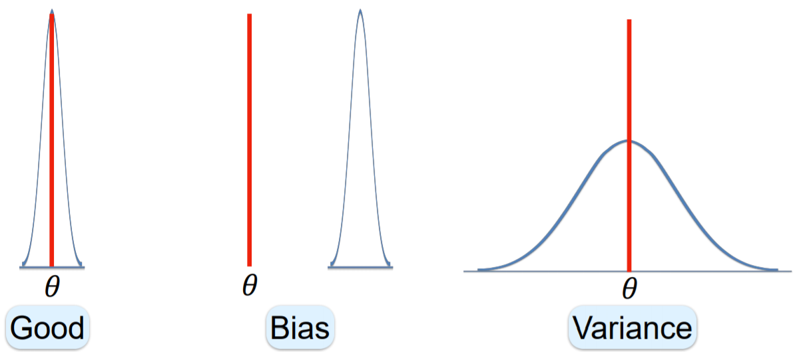
      </a>
    </div>

+ Bias and variance
  + bias: $\widehat{\Theta}$ estimator for $\theta$
    + definition: <span style="color: magenta;">bias</span> of $\widehat{\Theta}$ as the expected overestimate of $\theta$

      \[\text{Bias}_\theta (\widehat{\Theta}) \stackrel{\text{def}}{=} E[\widehat{\Theta} - \theta] = \mu_{\widehat{\Theta}} - \theta \quad\to\quad \text{Bias}(\widehat{\Theta}) \]

    + <span style="color: magenta;">unbiased</span>: estimator w/ 0 bias, i.e., $\mu_{\widehat{\Theta}} = \theta$
    + bias = inequality
  + variance
    + definition: $Var(\widehat{\Theta}) = E[(\widehat{\Theta} - \mu_{\widehat{\Theta}})^2]$
    + unrelated to $\theta$
  + ideally 0 bias and variance
    + 0 bias: mean as $\theta$
    + 0 variance: a constant, always the value of $\theta$
  + typically trade off btw bias and variance

+ Mean squared error
  + single measure for performance of estimator $\widehat{\Theta}$ for $\theta$
  + <span style="color: magenta;">MSE</span> of $\widehat{\Theta}$: expected squared distance from $\theta$

    \[ \text{MSE}_{\theta}(\widehat{\Theta}) \stackrel{\text{def}}{=} E[(\widehat{\Theta} - \theta)^2] \quad\to\quad \text{MSE}(\widehat{\Theta}) \]

  + common in science and engineering, e.g., communication, transportation, and production
  + need to re-evaluate?
    + MSE related to bias and variance

+ Bias-Variance decomposition <br/>
  MSE = $\text{Bias}^2$ + Variance

  \[\begin{align*}
    \text{MSE}(\Theta) &= E[(\Theta - \theta)^2] = E^2[\Theta - \theta] + Var(\Theta - \theta) \\
    &= \text{Bias}^2(\Theta) + Var(\Theta) \\\\
    E[\Theta - \theta] &\stackrel{\text{def}}{=} \text{Bias}(\Theta) \qquad Var(\Theta - \theta) = Var(\Theta)
  \end{align*}\]

+ Mean example
  + unknown distribution or population $p$
  + estimate mean $\mu$
  + n samples: $X_1, X_2, \dots, X_n \sim p \; {\perp \!\!\!\! \perp}$
  + sample mean: $\overline{X} \stackrel{\text{def}}{=} \frac{1}{n} \sum_{i=1}^n X_i$
  + evaluate
    + bias, variance, MSE
    + weak law of large numbers

  + bias
    + sample mean: $\overline{X} \stackrel{\text{def}}{=} \frac{1}{n} \sum_{i=1}^n X_i$
    + expectation

      \[ E[\overline{X}] = E\left[ \frac 1 n \sum_{i=1}^n X_i \right] = \frac 1 n \sum_{i=1}^n E[X_i] = \mu \]

    + bias: 

      \[ \text{Bias}(\overline{X}) = E[\overline{X}] - \mu = \mu - \mu = 0 \]

    + sample mean: unbiased estimator for distribution mean

  + variance

    \[\begin{align*}
      Var(\overline{X}) &= Var\left( \frac{1}{n} \sum_{i=1}^n X_i \right) = \frac{1}{n^2} Var\left( \sum_{i=1}^n X_i \right) \\
      &= \frac{1}{n^2} \sum_{i=1}^n Var(X_i) = \frac{1}{n^2} \sum_{i=1}^n \sigma^2 = \frac{\sigma^2}{n} \\\\
      &\therefore\; \sigma_{\overline{X}} = \frac{\sigma}{\sqrt{n}}
    \end{align*}\]

    + decreasing w/ $n \nearrow$
    + increasing w/ $\sigma \nearrow$
  + experiments

    <div style="margin: 0.5em; display: flex; justify-content: center; align-items: center; flex-flow: row wrap;">
      <a href="url" ismap target="_blank">
        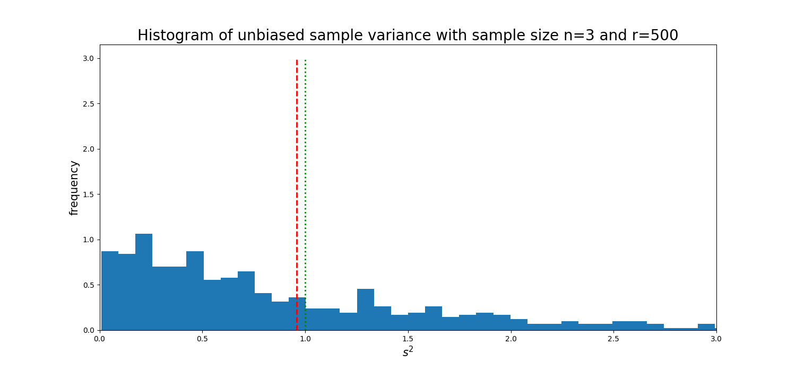
        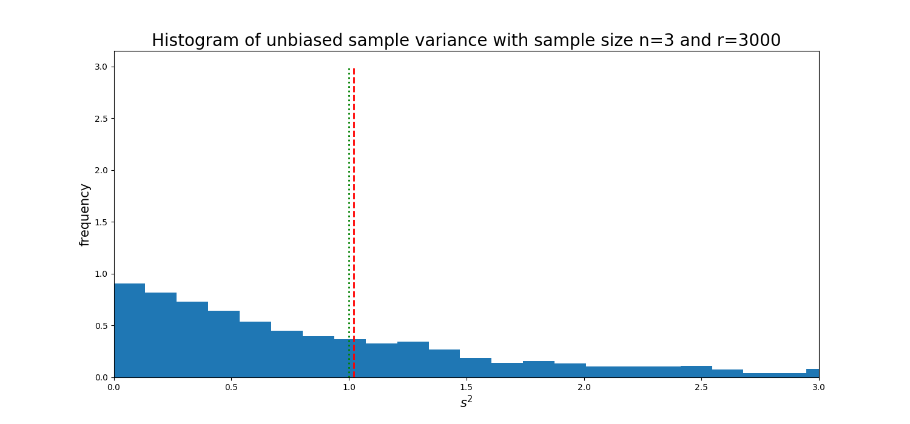
        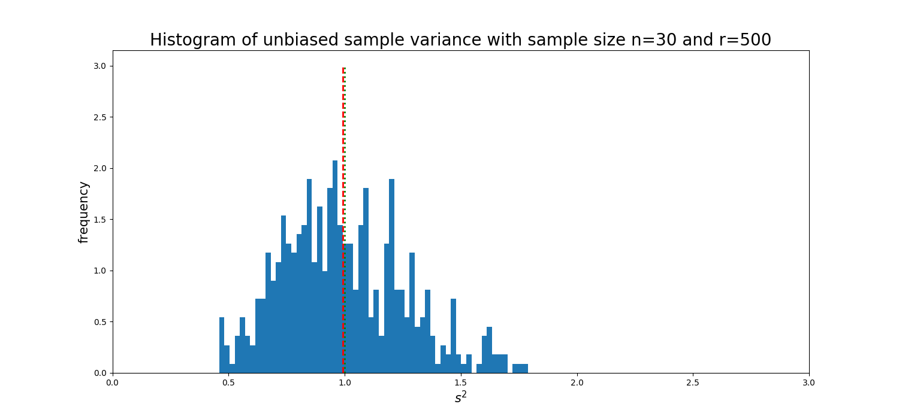
        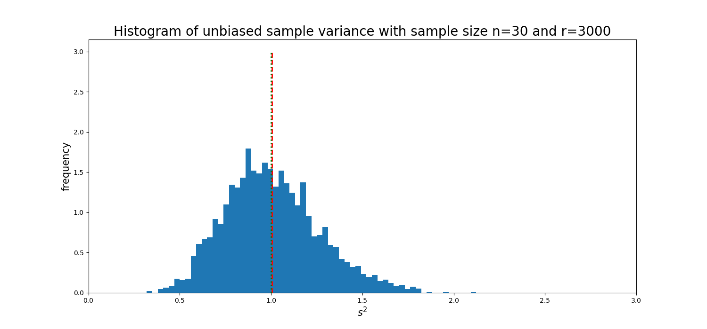
      </a>
    </div>

  + MSE of sample mean

    \[ \text{MSE}_\mu (\overline{X}) = \text{Bias}_\mu^2(\overline{X}) + Var(\overline{X}) = \frac{\sigma^2}{n} \]

    + increasing w/ $\sigma \nearrow$
    + decreasing w/ $n \nearrow$
    + same estimator works for all distributions
    + accuracy (MSE) independent of population size


+ [Original Slides](https://tinyurl.com/y7s47zez)


### Problem Sets

0. A distribution has mean 5 and variance 10. If we collect a sample by making 20 independent observations, what is the variance of the sample mean?<br/>
  a. 2<br/>
  b. 1/2<br/>
  c. 1/4<br/>
  d. 1/40<br/>

  Ans: b<br/>
  Explanation: The answer is 10/20 = 1/2.


1. If an estimator is unbiased, then<br/>
  a. its value is always the value of the parameter,<br/>
  b. its expected value is always the value of the parameter,<br/>
  c. it variance is the same as the variance of the parameter.<br/>

  Ans: b<br/>
  Expectation: An estimator $\widehat{A}$ for a parameter $A$ is unbiased if $E[\widehat{A}]=A$.


2. If $\{X_1, \dots, X_n\}$ are the observed values of $n$ sample items, which of the following are unbiased estimators for distribution mean?<br/>
  a. $X_1$<br/>
  b. $\frac{1}{n}\sum_{i=1}^n X_i$<br/>
  c. $\sqrt{\frac{1}{n}\sum_{i=1}^n X_i^2}$<br/>

  Ans: ab<br/>
  Explanation: Denote the distribution mean as $\mu$
    + True. $E[X_1] = \mu$
    + True. $E[\frac{1}{n}\sum_{i=1}^n X_i] = \frac{1}{n} E[\sum_{i=1}^n X_i] = \frac{1}{n} n\mu = \mu$
    + False. $E\left[\sqrt{\frac{1}{n}\sum_{i=1}^n X_i^2}\right] \ne \mu$$


3. As the sample size $n$ grows, the sample mean estimates the distribution mean better. Because<br/>
  a. its bias decreases,<br/>
  b. its variance decreases,<br/>
  c. none of the above.<br/>

  Ans: $Var(\frac{1}{n} \sum_{i = 1}^{n} X_i) = \frac{V(X)}{n}$.  The variance of the sample mean decreases as $n$ grows.


4. A sample of size $n$ has sample mean $20.20$. After adding a new observed value $21$, the sample mean increases to $20.25$. What is $n$?

  Ans: 15<br/>
  Explanation: Let $S_n$ denote the sum of the $n$ samples. Thus $S_n/n=20.20$ or $S_n=20.20n$. We're also told $20.20n+21=S_{n+1}=20.25 \cdot (n+1)$. Hence $0.75=0.05n$ or $n=15$.


5. To estimate the average alcohol consumption of UCSD students, we take three random samples of 40, 45 and 50 students respectively, and their sample means turn out to be 3.15, 3.20 and 2.76 pints per week respectively. What is the sample mean of the collection of all three samples?

  Ans: 3.0222<br/>
  Explanation: Let the total sum of samples be $S$. Clearly, $S=40 \cdot 3.15+45 \cdot 3.20+50 \cdot 2.76=408$. The sample mean is thus $\overline{X}=\frac{S}{n}=408/135=3.022222222$.


6. Let $X_1,X_2, \dots,X_n$ be independent samples from a distribution with pdf $f_X(x)=\frac{1}{\theta^2}xe^{−x\theta} (X\ge 0)$. Which of the following is an unbiased estimator for $θ$?<br/>
  a. $\overline{X}$<br/>
  b. $\frac{\overline{X}}{2}$<br/>
  c. $\frac{\overline{X}}{3}$<br/>
  d. $\frac{\overline{X}}{6}$<br/>

  Ans: <span style="color: cyan;">b</span><br/>
  Explanation: By linearity of expectation, $E(\bar{X})=E(X_1)=\int_{0}^{\infty}x\frac1{\theta^2}xe^{-\frac x\theta}dx=2\theta$. Thus $E[\frac{\bar{X}}{2}]=\theta$  and is therefore an unbiased estimator for $\theta$.


7. For $i \in \{1,\dots,n\}$, let $X_i \sim U(0,W)$ independently of each other, and let $M_n = \max_{i \in \{1, \dots,n\}}X_i$. For what value of $c$ is $c \cdot M_n$ an unbiased mean estimator?<br/>
  a. $\frac{n+1}{2n}$<br/>
  b. $\frac{n}{2(n−1)}$<br/>
  c. $\frac{2n+1}{4n}$<br/>
  d. $\frac{2n}{4n−1}$<br/>

  Ans: <span style="color: cyan;">a</span><br/>
  Explanation: Consider $M_n$. For some $m \in (0,W)$, $M_n \le m$ if and only if $X_i \le m \;\forall\,i$. This gives $\Pr(M_n \le m)=\Pr(X_1 \le m \cap \dots  \cap X_n \le m)=\prod^n_{i=1}P(X_i \le m)=(\frac m W)^n$. Differentiating the previous expression w.r.t. $m$, the density of $M_n$ is given by $f_{M_n}(m)=\frac{nm^{n−1}}{W^n}$. Thus $E(M_n)=\int^W_0 z \cdot f_{M_n}(z)dz= \int^W_0 z \cdot \frac{nz^{n−1}}{W^n}dz=\frac{n}{n+1} \cdot W$. Therefore $\frac{n+1}{2n} \cdot M_n$ is an unbiased estimator for $W/2$. [Solved Problems - problem 3](https://tinyurl.com/yaqnslkx)


8. Let $X$ be distributed $Poisson(λ)$. Which of the following is an unbiased estimator for $λ^2$.<br/>
  a. $X^2$<br/>
  b. $X^2−X$<br/>
  c. $2X^2−X$<br/>
  d. $3X^2−2X$<br/>

  Ans: <span style="color: cyan;">b</span><br/>
  Explanation: For $X$ that is distributed $Poisson(\lambda)$, we know that $E[X]=Var(X)=\lambda$. Thus $E[X^2]=Var(X)+E^2[X]=λ+λ^2$ and therefore $E(X^2−X)=\lambda^2$.


### Lecture Video

<a href="https://tinyurl.com/y8dqvrvo" target="_BLANK">
  
</a><br/>


## 11.3 Variance Estimation

+ Estimating the variance
  + estimating $\sigma^2$
    + unknown distribution or population $p$
    + mean: $\mu$
    + variance: $\sigma^2$
  + sample of $n$ observations: $X_1, \dots, X_n  \sim p \;{\perp \!\!\!\! \perp}$
  + no distribution
    + expectation $\to$ average
    + mean: $\mu = E[X_i] \to \overline{X} \stackrel{\text{def}}{=} \frac 1 n \sum_{i=1}^n X_i$
    + variance: $\sigma^2 = E[(X - \mu)^2] \to S^2 \stackrel{\text{def}}{=} \frac 1 n \sum_{i=1}^n \left(X_i - \overline{X}\right)^2$
  + $S^2$
    + Raw sample variance
    + random variable

+ Example: samples
  + samples: $n=5$ observations, e.g., 2, 1, 4, 2, 6
  + estimated mean: $\overline{\text{X}} = \frac15 \sum_{i=1}^5 x_i = \frac{2+1+4+2+6}{5} = \frac{15}{5} = 3$
  + estimated variance (raw sample varinace): $S^2 = \frac15 \sum_{i=1}^5 (x_i - \overline{x})^2 = \frac{16}{5} = 3.2$
  + variance: $Var(X) = E[(X - \mu)^2] = E[X^2] - \mu^2$
  + similar expression for $S^2$

+ One-pass calculation

  \[\begin{align*}
    \sum_{i=1}^n (X_i - \overline{x})^2 &= \sum_{i=1}^n (x_i^2 - 2 x_i \overline{x} + \overline{x}^2) = \sum_{i=1}^n x_i^2 - 2\overline{x} \sum_{i=1}^n x_i + \sum_{i=1}^n \overline{x}^2 \qquad \left(\sum_{i=1}^n x_i = n \overline{x}\right)\\
    &= \sum_{i=1}^n x_i -2n\overline{x}^2 + n \overline{x}^2 = \sum_{i=1}^n x_i - n \overline{x}^2\\\\
    S^2 &\stackrel{\text{def}}{=} \frac 1 n \sum_{i=1}^n (x_i - \overline{x})^2 \hspace{4em} \left[\substack{\text{intuitive}\\\text{proof arguments}}\right] \\
    & = \frac 1 n \sum_{i=1}^n x_i^2 - \overline{x}^2 \hspace{4.8em} \left[\substack{\text{fewer subtractions}\\ \text{one pass calculation}}\right]
  \end{align*}\]

+ Example: samples (cont.)
  + samples: $n= 5 \;\;$ 2, 1 , 4, 2, 6
  + estimated parameters: $\overline{X} = 3 \;\; S^2 = 3.2$
  + one pass: $S^2 = \frac 1 5 \sum_{i=1}^5 x_i^2 - \overline{x}^2 = \frac{4+1+16+4+36}{5} - 3^2 = 12.2 -9 = 3.2$

+ $S^2$ and Bias
  + mean: $E[X_i] = \mu$
    + Expectation $\to$ average of samples: $\overline{X} \stackrel{\text{def}}{=} \frac 1 n \sum_{i=1}^n X_i$
    + unbiased (WLLN): $E[\overline{X}] = \mu$
  + variance: $E[(X_i - \mu)^2] = \sigma^2$
    + Expectation $\to$ average of samples: $S^2 \stackrel{\text{def}}{=} \frac 1 n \sum_{i=1}^n \left(X_i - \overline{X}\right)^2$
    + unbiased?: $E[S^2] = \sigma^2$

+ Simulation plan
  + pick a distribution w/ known $\sigma^2$
  + generating n observations: $X_1, \dots, X_n$
  + raw sample variance: $S^2 = \frac 1 n \sum_{i=1}^n \left(X_i - \overline{X}\right)^2$
  + check: $E[S^2] \stackrel{?}{=} \sigma^2$
  + finding expectation?
    + weak law of large number
    + E $\approx$ average of many
  + $r$ experiments
    + obtaining $S^2$ for each
    + averaging $\overline{S^2} \to E[S^2]$
  + comparison btw
    + calculated $\overline{S^2}$ to estimate $E[S^2]$
    + known $\sigma^2$
  + scenarios
    + similar $\to$ unbiased
    + different $\to$ biased

+ Example: simulating $N(0, 16)$ and $Exp(2)$
  + raw sample variance: $S^2 = \frac 1 n \sum_{i=1}^n \left(X_i - \overline{X}\right)^2$ w/ $n = 2$
  + 100K experiments: $\overline{S^2} \approx E[S^2]$
  + $E[S^2] \stackrel{?}{=} \sigma^2$

  <div style="margin: 0.5em; display: flex; justify-content: center; align-items: center; flex-flow: row wrap;">
    <a href="https://tinyurl.com/y9fkmcpp" ismap target="_blank">
      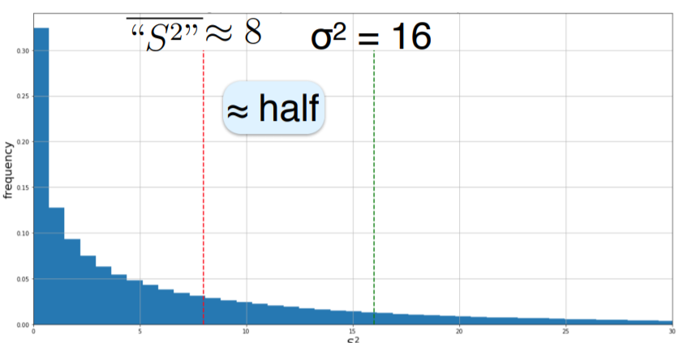
      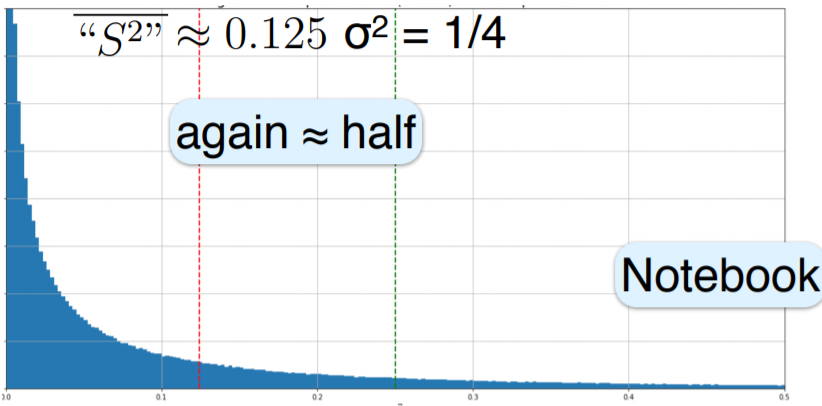
    </a>
  </div>

  + determining exact difference?

+ Example: Bernoulli
  + r.v.'s: $B_p \;\; \Pr(1) = p \; \Pr(0) = 1 - p = q \quad \sigma^2 = pq$
  + number of samples: $n=2$
    + samples: $x_1, x_2$
    + sample mean: $\overline{x} = \frac{x_1+ x_2}{2}$
    + raw sample variance: $S^2 (x_1, x_2) = \frac12 \left((x_1 - \overline{x})^2 + (x_2 - \overline{x})^2 \right)$<br/><br/>

    <table style="font-family: arial,helvetica,sans-serif; width: 50vw;" table-layout="auto" cellspacing="0" cellpadding="5" border="1" align="center">
      <thead>
      <tr style="font-size: 1.2em;">
        <th style="text-align: center; background-color: #3d64ff; color: #ffffff; width:10%;">$X_1, X_2$</th>
        <th style="text-align: center; background-color: #3d64ff; color: #ffffff; width:10%;">$\Pr(X_1, X_2)$</th>
        <th style="text-align: center; background-color: #3d64ff; color: #ffffff; width:10%;">$\overline{X}$</th>
        <th style="text-align: center; background-color: #3d64ff; color: #ffffff; width:10%;">$S^2$</th>
      </tr>
      </thead>
      <tbody>
      <tr>
        <td style="text-align: center;">0, 0</td> <td style="text-align: center;">$q^2$</td> <td style="text-align: center;">0</td> <td style="text-align: center;">$\frac12 ((0-0)^2 + (0-0)^2) = 0$</td>
      </tr>
      <tr>
        <td style="text-align: center;">0, 1</td><td style="text-align: center;">$qp$</td><td style="text-align: center;">$\frac12$</td><td style="text-align: center;">$\frac12 \left((0-\frac12)^2+ (1-\frac12)^2 \right) = \frac12 \cdot (\frac14 + \frac14) = \frac14$</td>
      </tr>
      <tr>
        <td style="text-align: center;">1, 0</td> <td style="text-align: center;">$pq$</td> <td style="text-align: center;">$\frac12$</td> <td style="text-align: center;">$\frac14$</td>
      </tr>
      <tr>
        <td style="text-align: center;">1, 1</td> <td style="text-align: center;">$p^2$</td> <td style="text-align: center;">1</td> <td style="text-align: center;">0</td>
      </tr>
      </tbody>
    </table>

  \[\begin{align*}
    E[S^2] &= \sum_{x_1, x_2} p(x_1, x_2) \cdot S^2(x_1, x_2) \\
    &= q^2 \cdot 0 + qp \cdot \frac14 + pq \cdot \cdot \frac14 + p^2 \cdot 0 = \frac{pq}{2} = \frac{\sigma^2}{2}
  \end{align*}\]

+ Summary
  + simulation
    + number of r.v's: $n = 2$
    + distribution: $N(0, 16)$ and $Exp(2)$
    + $E[S^2] \ne \sigma^2 \approx \frac12 \sigma^2$
  + exact calculation
    + r.v.: $B_p$
    + indeed $E[X^2] \ne \sigma^2$
    + raw sample variance: $E[S^2] = \frac12 \sigma^2$ exactly
  + applied to other distributions? other n? why?
  + general $n$: simulations shown $E[S^2] \approx \frac{n-1}{n} \cdot \sigma^2$


+ [Original Slides](https://tinyurl.com/y9fkmcpp)


### Problem Sets

0. As an estimator for distribution variance, the "raw" sample variance is<br/>
  a. biased<br/>
  b. unbiased<br/>

  Ans: a


1. Let $\overline{X}_n$ and $S_n^2$ be the sample mean and the sample variance of $\{X_1, \dots, X_n\}$. Let $\overline{X}_{n+1}$ and $S^2_{n+1}$ be the sample mean and the sample variance of $\{X_1, \dots, X_n, \overline{X}_n\}$. Which of the following hold

  a) for sample means,<br/>
  a. $\overline{X}_n > \overline{X}_{n+1}$<br/>
  b. $\overline{X}_n < \overline{X}_{n+1}$<br/>
  c. $\overline{X}_n = \overline{X}_{n+1}$<br/>

  b) for sample variances?<br/>
  a. $S^2_n > S^2_{n+1}$<br/>
  b. $S^2_n < S^2_{n+1}$<br/>
  c. $S^2_n = S^2_{n+1}$<br/>

  Ans: a. (c); b. (a)<br/>
  Explanation:
    + $\overline{X}_{n+1}=\frac{\sum_{i=1}^{n}X_i+\overline{X}_n}{n+1}$ $=\frac{n\cdot\overline{X}_n+\overline{X}_n}{n+1}=\overline{X}_n$.
    + ${S}^2_{n+1}=\frac{\sum_{i=1}^{n}(X_i-\overline{X}_{n+1})^2+(\overline{X}_n-\overline{X}_{n+1})^2}{n}$ $=\frac{\sum_{i=1}^{n}(X_i-\overline{X}_{n})^2+(\overline{X}_n-\overline{X}_{n})^2}{n}$ $< \frac{\sum_{i=1}^{n}(X_i-\overline{X}_{n})^2}{n-1}$ $={S}^2_{n}$.


2. Consider the following array of $m \times n$ random variables $X_{11}, X_{12}, \cdots, X_{1n}, \cdots,$ $X_{i1}, X_{i2}, \cdots, X_{in}, \cdots,$ $X_{m1}, X_{m2}, \cdots, X_{mn}$. For $i = 1, \cdots, m$, let $\overline{X}_i$ be the sample mean of $\{X_{i1}, X_{i2}, \cdots, X_{in}\}$, and $\overline{S}^2$ be the "raw" sample variance of $\{\overline{X}_1, \overline{X}_2, \cdots,\overline{X}_m\}$. If $\forall i, j, Var(X_{ij}) = \sigma^2$, what is $E[\overline{S}^2]$?<br/>
  a. $\frac{n−1}{n} \sigma^2$<br/>
  b. $\frac{m−1}{m} \sigma^2$<br/>
  c. $\frac{1}{n} \sigma^2$<br/>
  d. $\frac{1}{m} \sigma^2$<br/>
  e. $\frac{n−1}{mn} \sigma^2$<br/>
  f. $\frac{m−1}{mn} \sigma^2$<br/>

  Ans: <span style="color:cyan;">f</span><br/>
  Explanation: According to WLLN, $V(\overline{X}_i) = \frac{\sigma^2}{n}$. $E(\overline{S}^2) = \frac{m - 1}{m} V(\overline{X}_i) = \frac{m - 1}{mn}\sigma^2$


3. If all the observations in a sample increase by 5<br/>
  a. the sample mean increases by 5,<br/>
  b. the sample mean stays the same,<br/>
  c. the sample variance increases by 5,<br/>
  d. the sample variance stays the same.<br/>

  Ans: <span style="color:cyan;">ad</span><br/>
  Explanation: Let $y_i=x_i+5$.
  + True. $\bar{y} = \frac{1}{n} \sum_{i = 1}^{n} y_i = \frac{1}{n} \sum_{i = 1}^{n} (x_i + 5) = \frac{1}{n} \sum_{i = 1}^{n} x_i + 5 = \bar{x} + 5$
  + False
  + False
  + True. $s_y^2 = \frac{1}{n} \sum_{i = 1}^{n} (y_i - \bar{y})^2 = \frac{1}{n} \sum_{i = 1}^{n} (x_i + 5 - (\bar{x} + 5))^2 = \frac{1}{n} \sum_{i = 1}^{n} (x_i - \bar{x})^2 = s_x^2$


### Lecture Video

<a href="https://tinyurl.com/y9p4guln" target="_BLANK">
  
</a><br/>


## 11.4 Unbiased Variance Estimation

+ Mystery of the missing man
  + unbiased sample mean
    + sample mean: $\overline{X} \stackrel{\text{def}}{=} \frac 1 n \sum_{i=1}^n X_i$
    + expectation of sample mean: $E[\overline{X}] = \mu$
  + raw sample variance: $S^2 \stackrel{\text{def}}{=} \frac 1 n \sum_{i=1}^n (X_i - \overline{X})^2$
  + experiments: $E[S^2] \approx \frac{n-1}{n} \cdot \sigma^2 \to $ Biased
  + example
    + height of 10 people
    + sample mean: normalized by 10
    + sample variance: normalized by 9
  + proof: $E[S^2] = \frac{n-1}{n} \cdot \sigma^2$
    + why?
    + how to fix

+ Partial explanation
  + $S^2$ under-estimating $\sigma^2$
    + sample variance: $\overline{X} \stackrel{\text{def}}{=} \frac 1 n \sum_{i=1}^n X_i$
    + expectation of sample variance: $E[S^2] = \frac{n-1}{n} \cdot \sigma^2$
    + why under-estimation?
  + minimizing variance w/ $a$
    + given $n$ points $x_1, \dots, x_n$
    + variance: $\sum_{i=1}^n (x_i - a)^2$
    + minimizing variance as $a = \frac{x_1 + \cdots + x_n}{n}$
    + e.g., $(x_1, x_2) = (1, -1)$, variance = $(1-a)^2 + (-1-a)^2 = 2 + 2a^2 \to$ minimized for $a=0 \to$ average
  + variance
    + $\sigma^2 \stackrel{\text{def}}{=} E[(X - \mu)^2]$
    + $\mu \approx$ average of observations, not exactly
  + raw sample variance
    + $S^2 \stackrel{\text{def}}{=} \frac 1 n \sum_{i=1}^n \left(X_i - \overline{X}\right)^2$
    + $\overline{X}$: exact average of samples
    + giving a lower sum than what the distribution given
  + summary
    + explaining $S^2$ under-estimating $\sigma^2$
    + not explaining $\frac{n-1}{n}$
    + nor capturing whole reason
  + elementary: derivation w/ properties
    + linearity of expectation
    + symmetry: $\forall\, i, (X_i - \overline{X})$ expecting the same and using $X_1$ to represent

    \[\begin{align*}
      E[S^2] &= E\left[ \frac 1 n \sum_{i=1}^n \left(X_i - \overline{X}\right)^2 \right] = \frac 1 n E\left[ \sum_{i=1}^n \left(X_1 - \overline{X}\right)^2 \right] \\
      &= \frac 1 n \sum_{i=1}^n E\left[\left(X_i - \overline{X}\right)^2\right] = \frac{1}{n} \sum_{i=1}^n E\left[\left(X_1 - \overline{X}\right)^2\right] \\
      &= E\left[\left(X_1 - \overline{X}\right)^2\right] \hspace{3em} \left(\text{ intuitive, simple}\right)
    \end{align*}\]

  + easier to understand and explain

+ Example: Bernoulli (revisit)
  + r.v.'s: $B_p \;\; \Pr(1) = p \; \Pr(0) = 1 - p = q \quad \sigma^2 = pq$
  + number of samples: $n=2$
    + samples: $x_1, x_2$
    + sample mean: $\overline{x} = \frac{x_1+ x_2}{2}$
    + raw sample variance: $S^2 (x_1, x_2) = \frac12 \left((x_1 - \overline{x})^2 + (x_2 - \overline{x})^2 \right)$<br/><br/>

      \[\begin{align*}
        E[S^2] &= \sum_{x_1, x_2} p(x_1, x_2) \cdot S^2(x_1, x_2) \\
        &= q^2 \cdot 0 + qp \cdot \frac14 + pq \cdot \cdot \frac14 + p^2 \cdot 0 = \frac{pq}{2} = \frac{\sigma^2}{2}
      \end{align*}\]

+ Example: Bernoulli (alternative)
  + r.v.'s: $B_p \;\; \Pr(1) = p \; \Pr(0) = 1 - p = q \quad \sigma^2 = E[(X - \mu)^2] = p(1-p) = pq$
  + simplified calculation: $n = 2 \to X_1, X_2$

  \[\begin{align*}
    E[S^2] &= E\left[\left(X_1 - \overline{X}\right)^2\right] = \sum_{x_1, x_2} p(x_1, x_2) \cdot (x_1 - \overline{x})^2 \\
    &= 2 \cdot pq \cdot \frac14 = \frac12 pq = \frac12 \sigma^2
  \end{align*}\]

    <table style="font-family: arial,helvetica,sans-serif; width: 30vw;" table-layout="auto" cellspacing="0" cellpadding="5" border="1" align="center">
      <thead>
      <tr style="font-size: 1.2em;">
        <th style="text-align: center; background-color: #3d64ff; color: #ffffff; width:10%;">$x_1, x_2$</th>
        <th style="text-align: center; background-color: #3d64ff; color: #ffffff; width:10%;">$p(x_1, x_2)$</th>
        <th style="text-align: center; background-color: #3d64ff; color: #ffffff; width:10%;">$\overline{x}$</th>
        <th style="text-align: center; background-color: #3d64ff; color: #ffffff; width:10%;">$(x_1 - \overline{x})$</th>
      </tr>
      </thead>
      <tbody>
      <tr>
        <td style="text-align: center;">0, 0</td> <td style="text-align: center;">$q^2$</td> <td style="text-align: center;">$0$</td> <td style="text-align: center;">$0$</td>
      </tr>
      <tr>
        <td style="text-align: center;">0, 1</td> <td style="text-align: center;">$qp$</td> <td style="text-align: center;">$\frac12$</td> <td style="text-align: center;">$\frac14$</td>
      </tr>
      <tr>
        <td style="text-align: center;">1, 0</td> <td style="text-align: center;">$pq$</td> <td style="text-align: center;">$\frac12$</td> <td style="text-align: center;">$\frac14$</td>
      </tr>
      <tr>
        <td style="text-align: center;">1, 1</td> <td style="text-align: center;">$p^2$</td> <td style="text-align: center;">$1$</td> <td style="text-align: center;">$0$</td>
      </tr>
      </tbody>
    </table>

  + simpler and easier to analyze

+ Simplified formulation
  + proving $E[S^2] = \frac{n-1}{n} \cdot \sigma^2$
    + asymmetric, unclear
    + expectation of sample variance:

      \[ E[S^2] \stackrel{\text{def}}{=} E\left[ \frac{1}{n} \sum_{i=1}^n \left(X_1 - \overline{X}\right)^2 \right] = E\left[\left(X_1 - \overline{X}\right)^2 \right] \]

    + variance

      \[ X_1 \sim p \qquad \sigma^2 \stackrel{\text{def}}{=} E\left[(X_1 - \mu)^2\right] \]

  + proving $E\left[\left(X_1 - \overline{X}\right)^2\right] = \frac{n-1}{n} \cdot E\left[\left(X_1 - \mu\right)^2\right] \to$ symmetric, shows difference
  + simplistic argument
    + $\overline{X}$ including $X_1$, hence closer than $\mu$: $E\left[\left(X_1 - \overline{X}\right)^2\right] < E\left[ \left(X_1 - \mu\right)^2 \right]$
    + not explaining $\frac{n-1}{n}$
    + not whole story

+ Simplest case: $n=2$
  + proving: $E\left[\left(X_1 - \overline{X}\right)^2\right] = \frac12 \cdot E\left[\left(X_1 - \mu\right)^2\right] = \frac{\sigma^2}{2}$
  + decoupling $X_1$ from $\overline{X}$
    + $X_1 - \overline{X} = X_1 - \frac{X_1 + X_2}{2} = \frac{X_2 - X_1}{2}$
    + $E\left[\left(X_1 - \overline{X}\right)^2\right] = E\left[\left(\frac{X_1 - X_2}{2}\right)^2\right] = \frac14 \cdot E\left[ \left(X_1 - X_2\right)^2 \right]$
    + $X_1 {\perp \!\!\!\! \perp} X_2$
      + difference just from correlation btw $X_1$ and $\overline{X} \implies \frac14 \cdot E[(X_1 - \mu)^2] = \frac{\sigma^2}{4} \to$ even smaller!
      + $X_2$ not closer to $X_1$ than $\mu \to$ replacing $X_2$ by $\mu$
    + not whole story
      + randomness of $X_2$ reverses half of decrease.
      + $X_2$ random but $\mu$ fixed
      + $X_1$ minusing some random value by symmetric $\to$ increasing the expected squared
      + the quantity actually twice the expected value of $(X_1 - \mu)^2$
      + $\therefore\; E\left[ (X_1 - X_2)^2 \right] = 2 \cdot E[(X_1 - \mu)^2] \to$ proof required

    \[ E\left[\left(X_1 - \overline{X}\right)^2\right] = \underbrace{\frac14 \cdot E\left[\left(X_1 - X_2\right)^2 \right]}_{\text{gain $\frac14$ from proximty}} = \underbrace{\frac14 \cdot 2 \cdot E\left[\left(X_1 - \mu\right)^2\right]}_{\text{lose 2 for randomness}} = \frac{\sigma^2}{2} \]

  + derivation of $E[(X_1 - X_2)^2] = 2 \cdot E[(X_1 - \mu)^2]$
    + 0-mean
      + $E[X_1 - X_2] = \mu - \mu = 0$
      + $E[X_1 - \mu] = \mu - \mu = 0$
    + independence ${\perp \!\!\!\! \perp}$: $Var(X_1 - X_2) = Var(X_1) + Var(X_2) = 2 \cdot Var(X_1)$
    + for 0-mean random variable $Z$: $E[Z^2] = Var(Z)$

      \[ E\left[\left(X_1 - X_2\right)^2\right] = 2 \cdot E\left[\left(X_1 - \mu\right)^2\right] \iff Var(X_1 - X_2) = 2 \cdot Var(X_1) \]

  + summary

    \[\begin{align*}
      E[S^2] &\stackrel{\text{def}}{=} E\left[ \frac 1 n \sum_{i=1}^n \left(X_i - \overline{X}\right)^2 \right] \stackrel{\text{symmetry}}{=} E\left[ \left(X_1 - \overline{X}\right)^2 \right] \quad \text{any } n \\
      &= E\left[ \left(\frac{X_1 - X_2}{2}\right)^2 \right] \hspace{3.5em} \left( X_1 - \overline{X} = \frac{X_1 - X_2}{2} \right) \\
      &= \frac14 \cdot E\left[ (X_1 - X_2)^2 \right]  \hspace{3.5em} \left( \substack{\text{Linearity of Expection }\\ \tfrac14 \text{ from $\overline{X}$ being closer than $\mu$ to $X_1$}} \right) \\
      &= \frac14 \cdot Var(X_1 - X_2) = \frac14 \big(Var(X_1) + Var(X_2)\big) \hspace{2em} \left( \text{0 mean } \;\&\; {\perp \!\!\!\! \perp} \right)\\
      &= \frac14 \cdot 2 \cdot Var(X_1) \hspace{4.3em} \left( iid, \;\; 2 \text{ from $\overline{X}$ being random} \right) \\
      &= \frac14 \cdot 2 \cdot \sigma^2 = \frac{\sigma^2}{2}  \hspace{4.5em} \left(\tfrac12 \text{ together}\right)
    \end{align*}\]

+ General $n$

  \[\begin{align*}
    X_1 - \overline{X} &= X - \frac{X_! + \cdots + X_N}{n} = \frac{(n-1)X_1 - X_2 - \cdots - X_n}{n} \\
    &= \frac{n-1}{n} \left(X_1 - \frac{X_2 + \cdots + X_n}{n-1}\right)\\\\
    E[S^2] &= E\left[ \frac 1 n \sum_{i=1}^n \left(X_i - \overline{X}\right)^2 \right] = E\left[ \left(X_1 - \overline{X}\right)^2 \right] \\
    &= E\left[ \left(\frac{n-1}{n} \left(X_1 - \frac{X_2 + \cdots + X_n}{n-1}\right)\right)^2 \right] \\
    &= \left(\frac{n-1}{n}\right)^2 \cdot E\left[\left(X_1 - \frac{X_2 + \cdots + X_n}{n-1}\right)^2\right] \hspace{1em} \left( \left(\frac{n-1}{n}\right)^2 \text{ as } \overline{X} \text{ closer than $\mu$ to } X_1 \right) \\
    &= \left(\frac{n-1}{n}\right)^2 \cdot Var\left(X_1 - \frac{X_2 + \cdots + X_n}{n-1}\right) \hspace{2em} \left( \text{0-mean} \right) \\
    &= \left(\frac{n-1}{n}\right)^2 \cdot \left[ Var(X_1) + Var\left(\frac{X_2 + \cdots + X_n}{n-1}\right) \right] \hspace{2em} \left( {\perp \!\!\!\! \perp} \right) \\
    &= \left(\frac{n-1}{n}\right)^2 \cdot \left[ \sigma^2 + \frac{\sigma^2}{n-1} \right] \hspace{3em} \left( \text{iid, var. scaling } \;\&\; \frac{n-1}{n} \text{ from $\overline{X}$ being random} \right) \\
    &= \left(\frac{n-1}{n}\right)^2 \cdot \frac{n}{n-1} \cdot \sigma^2 = \frac{n-1}{n} \cdot \sigma^2 \hspace{4em} \left( \frac{n-1}{n} \text{ together } \right)
  \end{align*}\]

+ Unbiased variance estimate
  + raw sample variance

    \[\begin{align*}
      S^2 &= \frac 1 n \sum_{i=1}^n \left(X_i - \overline{X}\right)^2 \\
      E[S^2] &= \frac{n-1}{n} \cdot \sigma^2
    \end{align*}\]

  + Bessel's correction

    \[ s^2 = \frac{n}{n-1} \cdot S^2 = \frac{1}{n-1} \sum_{i=1}^n \left( X_1 - \overline{X} \right)^2 \]

  + unbiased estiamtor of variance: $E[s^2] = \sigma^2$
  + $s^2$: typically called __sample variance__

+ Example: samples
  + observations: $n= 5 \quad$ 2, 1, 4, 2, 6
  + sample mean: $\overline{X} = \frac{1}{n} \sum_{i=1}^n X_i = \frac{2+1+4+2+6}{5} = 3$
  + raw sample variance: $S^2 = 3.2$
  + sample variance: unbiased estimate of $\sigma^2$

    \[s^2 =\frac{n-1}{n} \sum_{i=1}^n \left( X_1 - \overline{X} \right)^2 = \frac{1+4+1+1+9}{4} = \frac{16}{4} = 4 \]

  + one-pass calculation

    \[ S^2 = \frac 1 n \sum_{i=1}^n X_i^2 - \overline{X}^2 \to s^2 = \frac{1}{n-1} \left( \sum_{i=1}^n X_i^2 - n \overline{X}^2 \right) \]

+ Final simulations

  <div style="margin: 0.5em; display: flex; justify-content: center; align-items: center; flex-flow: row wrap;">
    <a href="https://tinyurl.com/y7zytf8z" ismap target="_blank">
      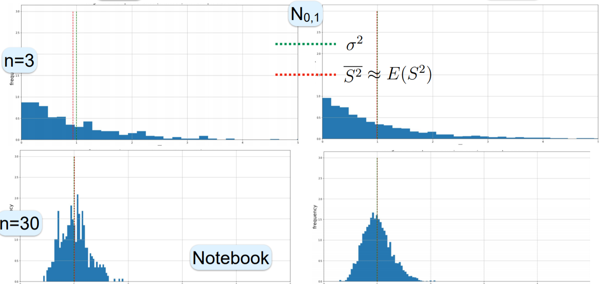
    </a>
  </div>


+ [Original Slides](https://tinyurl.com/y7zytf8z)


### Problem Sets

0. Compared to the distribution variance, the expectation of the biased "raw" sample variance is<br/>
  a. always larger<br/>
  b. always smaller<br/>
  c. always equal<br/>
  d. could be any of the above<br/>

  Ans: b


1. As the sample size $n$ grows, the effect of the Bessel correction<br/>
  a. becomes larger,<br/>
  b. becomes smaller,<br/>
  c. stays the same<br/>

  Ans: b<br/>
  Explanation: Sample variance $S^2_{n} = \frac{n - 1}{n}\sigma^2$. When $n$ grows, $\frac{n - 1}{n} \to 1$ and the effect becomes smaller.


2. According to the U.S. Department of Agriculture, ten to twenty earthworms per cubic foot is a sign of healthy soil. The soil of a garden is checked by digging 8 holes, each of one-cubic-foot, and counting the earthworms, and the following counts are found: 5, 25, 15, 10, 7, 12, 16, 20. Use the unbiased estimators discussed in the video to estimate<br/>
  a. the true mean,<br/>
  b. the true variance.<  br/>

  Ans: a. (12.75); b. (44.5)<br/>
  Explanation:
  + If $X_i, 1 \le i \le 8$  denotes the samples, the unbiased estimator for the true mean is given by $\overline{X} = \sum^8_{i=1} Xi /n=110/8=13.75$. Python functon - [statistics.mena(x)](https://docs.python.org/3/library/statistics.html#statistics.mean)
  + The unbiased estimator for the true variance is given by $S=\sum_{i=1}^8 (X_i-\overline{X})^2/(n-1)=311.5/7=44.5$.  Python function: unbiased sample variance - [statistics.variance(x)](https://docs.python.org/3/library/statistics.html#statistics.variance), population variance - [statistics.pvariance(x)](https://docs.python.org/3/library/statistics.html#statistics.pvariance)


### Lecture Video

<a href="https://tinyurl.com/yccyp9gl" target="_BLANK">
  
</a><br/>


## 11.5 Estimating Standard Deviation

+ Variance ($\sigma^2$) $\to$ Standard Deviation ($\sigma$)
  + variance estimator
    + sample vaince: $s^2 = \frac{1}{n-1} \sum_{i=1}^n \left( X_1 - \overline{X} \right)^2$
    + shown $E[s^2] = \sigma^2$
    + $s^2$: an unbiased estimator for $\sigma^2$
  + stanbdard standard-deviation estimator
    + natural $\sigma$ estimator
    + sample standard deviation: $\sigma = \sqrt{\sigma^2}$

      \[ s \stackrel{\text{def}}{=} +\sqrt{s^2} = +\sqrt{\frac{1}{n-1} \sum_{i=1}^n \left( X_1 - \overline{X} \right)^2} \]

+ Example: samples
  + observations: $n=5\quad$ 2, 1, 4, 2, 6
  + estimators
    + $\mu$: $\overline{X} = \frac 1 n \sum_{i=1}^n X_i = \frac{2+1+4+2+6}{5} = 3$
    + $\sigma^2$: $s^2 = \frac{1}{n-1} \sum_{i=1}^n \left( X_1 - \overline{X} \right)^2 = \frac{1+4+1+1+9}{4} = \frac{16}{4} = 4$
    + $\sigma$: natural $\to s = \sqrt{s^2} = \sqrt{4} = 2$

+ $s$ unbiased?
  + is $s$ an unbiased estiamtor for $\sigma$?
    + $E[s^2] = \left( E[s] \right)^2 + Var(s) \ge (E[s])^2: \quad = \text{ hold } \iff Var(s) \iff s$ as a constant
    + $\left( E[s] \right)^2 \le E[s^2] = \sigma^2$
    + $s^2$: an unbiased variance estimator
    + $E[s] \le \sigma$: < whenever $X$ not a constant
  + $s$ underestimating $\sigma$: = hold only when $x$ a constant
  + on average $s$ under-estimating $\sigma$
  + concrete example

+ Exampple: Bernoulli
  + $s$ strictly underestimating $\sigma$
  + $B_p$: $\sigma = \sqrt{p(1-p)} = \sqrt{pq}$
  + $n=2$: show $E[s] < \sqrt{pq}$

    <table style="font-family: arial,helvetica,sans-serif; width: 30vw;" table-layout="auto" cellspacing="0" cellpadding="5" border="1" align="center">
      <thead>
      <tr style="font-size: 1.2em;">
        <th style="text-align: center; background-color: #3d64ff; color: #ffffff; width:10%;">$x_1, x_2$</th>
        <th style="text-align: center; background-color: #3d64ff; color: #ffffff; width:10%;">$p(x_1, x_2)$</th>
        <th style="text-align: center; background-color: #3d64ff; color: #ffffff; width:10%;">$\overline{x}$</th>
        <th style="text-align: center; background-color: #3d64ff; color: #ffffff; width:10%;">$s^2$</th>
        <th style="text-align: center; background-color: #3d64ff; color: #ffffff; width:10%;">$s$</th>
      </tr>
      </thead>
      <tbody>
      <tr>
        <td style="text-align: center;">0, 0</td> <td style="text-align: center;">$q^2$</td> <td style="text-align: center;">$0$</td> <td style="text-align: center;">$0$</td> <td style="text-align: center;">$0$</td>
      </tr>
      <tr>
        <td style="text-align: center;">0, 1</td> <td style="text-align: center;">$qp$</td> <td style="text-align: center;">$\frac12$</td> <td style="text-align: center;">$\frac12$</td> <td style="text-align: center;">$\frac{1}{\sqrt{2}}$</td>
      </tr>
      <tr>
        <td style="text-align: center;">1, 0</td> <td style="text-align: center;">$pq$</td> <td style="text-align: center;">$\frac12$</td> <td style="text-align: center;">$\frac12$</td> <td style="text-align: center;">$\frac{1}{\sqrt{2}}$</td>
      </tr>
      <tr>
        <td style="text-align: center;">1, 1</td> <td style="text-align: center;">$p^2$</td> <td style="text-align: center;">$1$</td> <td style="text-align: center;">$0$</td> <td style="text-align: center;">$0$</td>
      </tr>
      </tbody>
    </table>

  + sample variance: $s^2 = \frac11 \left(\left(0 - \frac12\right)^2 + \left(1 - \frac12\right)^2\right) = \frac12$
  + $E[S] = q^2 \cdot 0 + qp \cdot \frac{1}{\sqrt{2}} + pq \cdot \frac{1}{\sqrt{2}} + p^2 \cdot 0 = \sqrt{2} \cdot pq < \sqrt{pq}$

    <div style="margin: 0.5em; display: flex; justify-content: center; align-items: center; flex-flow: row wrap;">
      <a href="https://tinyurl.com/ya9l73th" ismap target="_blank">
        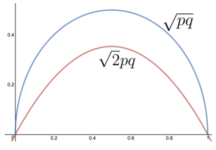
      </a>
    </div>

+ Unbaised estimator for $\sigma$
  + is there an unbiased estimator for $\sigma$
    + known $p \to$ estimator = $\sigma \implies$ nothing to estimate
    + estimator must work for all distributions
    + e.g., $\forall\,p \;\; E[\overline{X}] = \mu \quad E[s^2] = \sigma^2$
  + estimator $\widehat{\sigma}$ s.t. for all distributions
    + $E[\widehat{\sigma}\left( X^n \right)] = \sigma$ hold?
    + no, no general unbiased estimator for $\sigma$
  + how to prove the impossible?

+ Proof techniques
  + handwaving: as you can see ...
  + induction: true for 1, 2, 3, so must be true
  + e.g., true for this trivial example so must be true

+ No unbiased $\sigma$ estimator
  + no unbiased estimator: even for $B_p$ w/ unknown $p$
  + no unbiased estimators for general distributions
  + show for $n=2$ samples
  + similar for any $n$
  + how to prove the impossible?

+ Proving impossiblility for Bernoulli
  + $\widehat{\sigma}$: any estimator for $\sigma$ of $B_p$ distributions
  + $\widehat{\sigma}(x_1, x_2)$
    + estimate of $\sigma$ when observing $x_1, x_2$
    + predeterminined constants
  + expectation of standard deviation estimator
    + polynomial in $p$
    + degree-2 polynomial

    \[\begin{align*}
      E\left[ \widehat{\sigma}\left(X_1, X_2\right) \right] &= \sum_{x_1, x_2} p(x_1, x_2) \widehat{\sigma}(x_1, x_2) \\
      &= \Pr(0, 0)\widehat{\sigma}(0, 0) + \Pr(0, 1)\widehat{\sigma}(0, 1) + \Pr(1, 0)\widehat{\sigma}(1, 0) + \Pr(1, 1)\widehat{\sigma}(1, 1)\\
      &= (1-p)^2\widehat{\sigma}(0,0) + (1-p)p\widehat{\sigma}(0, 1) + p(1-p)\widehat{\sigma}(1, 0) + p^2\widehat{\sigma}(1, 1)
    \end{align*}\]

  + $\sigma = \sqrt{p(1-p)}$: not a polynomial in $p$
  + the two functions different: $\exists\,p \; E\left[\widehat{\sigma}(X_1, X_2)\right] \ne \sigma$

+ Impossibility
  + how to prove the impossible?
  + estimators for $B_p$
  + shown that $\forall\, \widehat{\sigma}, E[\widehat{\sigma}(X_1, X_2)] \implies $ polynomial in $p$
    + $\sigma = \sqrt{p(1-p)} \to$ not polynomial in $p$
    + $\exists\, p, E\left[\widehat{\sigma}(X_1, X_2)\right] \ne \sigma$
    + $\therefore\, \widehat{\sigma}$ not unbiased
  + how to prove $E\left[\widehat{\sigma}(X_1, X_2)\right] \ne \sigma$?
    + no proof required, it is true.

+ Observations
  + bias not so bad
  + providing more freedom
  + best estimator (MSE) often biased
  + as the number of samples $n \nearrow \implies s \to \sigma$
  + consistent

+ Summary
  + estimator for $\sigma$: $s \stackrel{\text{def}}{=} + \sqrt{s^2} = +\sqrt{\frac{1}{n-1} \sum_{i=1}^n \left(X_1 - \overline{X}\right)^2}$
  + evaulating $\sigma$: $E[s] \le \sigma$ and '<' hold for non-constant distributions
  + unbiased estiamtor
  + simple proof: no unbiaised estimator
  + property: some bias ok as long as MSE small


+ [Original Slides](https://tinyurl.com/ya9l73th)


### Problem Sets

0. There is an unbiased estimator for standard deviation for general distributions. (True/False)

  Ans: False


### Lecture Video

<a href="https://tinyurl.com/y82a5scv" target="_BLANK">
  
</a><br/>


## 11.6 Confidence Interval

+ Point and interval parameters
  + distribution or population: estimate __parameters__
  + point estimates:
    + precise
    + certainly wrong: not exactly the values got
    + no confidence
    + e.g., $\mu \approx 3.14 \quad p \approx 0.48$
  + confidence intervals
    + precision $\searrow$
    + confidence $\nearrow$
    + e.g. w/ 95% confidence (probability): $\mu \in (3.1, 3.18)$

+ Normal distribution
  + CLT
    + averages: normally distributed
    + intuition
    + almost everything
  + r.v's: $X_1, \dots, X_n \;\; {\perp \!\!\!\! \perp},\; \sim$ any distribution w/ mean $\mu$ and stdev $\sigma$
  + sample mean
  
    \[ \overline{X^n} \stackrel{\text{def}}{=} \frac{X_1 + \cdots + X_n}{n} \]

  + normalized sample mean:
  
    \[Z_n \stackrel{\text{def}}{=} \frac{(X_1 + cdots + X_n) -  n\mu}{\sigma\sqrt{n}} \]

  + applying CLT
    + for sufficiently large $n$, typically $\ge 30$
    + standard Normal variable: $Z_n \mathrel{\dot\sim} N(0, 1)$
  + $X \dot\sim N(0, 1)$: x is approximately distributed as standard normal

+ Predicting standard Normal
  + standard normal variable: $Z \sim N(0, 1)$
  + predict value of $Z$
  + point prediction
    + $Z = 0$: highest probability, unbiased
    + precise
    + wrong: $\Pr(Z=0) = 0$
  + interval

    \[ -a \le Z \le a \quad \Pr(-a \le Z \le a) > 0 \to \Pr(-a \le Z \le a) = ? \]

+ Interval probability
  + r.v.: $Z \sim N(0, 1)$
  + CDF:

    \[ \Phi(a) = F(a) = \frac{1}{\sqrt{2\pi}} \int_{-\infty}^a e^{-t^2/2} \,dt \]

    <div style="margin: 0.5em; display: flex; justify-content: center; align-items: center; flex-flow: row wrap;">
      <a href="https://tinyurl.com/yb3dyuhl" ismap target="_blank">
        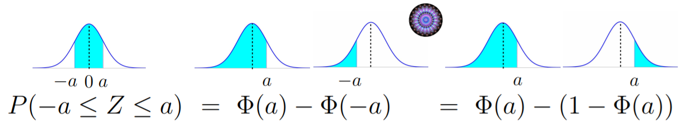
        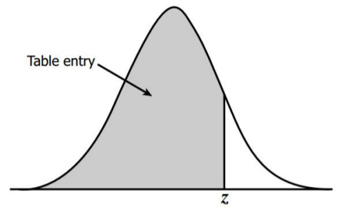
      </a>
    </div>

  + calculating $\Phi(a)$
    + no known formula
    + using z/standard normal table

  + Python code for z-table
    + linbrary: `from scipy.stats import norm`
    + CDF of standard normal: `norm.cdf(x)`
    + examples

      ```python
      norm.cdf(1)   # 0.8413447460685429
      norm.cdf(2)   # 0.9772498680518208
      norm.cdf(3)   # 0.9986501019683699
      ```

+ 68-95-99.7 rule

  \[ \Pr(-a \le Z \le a) = 2 \Phi(a) -1 \]

  <div style="margin: 0.5em; display: flex; justify-content: center; align-items: center; flex-flow: row wrap;">
    <a href="https://tinyurl.com/yaofkz54" ismap target="_blank">
      
    </a>
  </div>

  + $a = 1$: $\Pr(-1 \le Z \le 1) = 2 \cdot 0.8413 - 1 = 0.682$
  + $a = 2$: $\Pr(-2 \le Z \le 2) = 2 \cdot 0.9772 - 1 = 0.9544$
  + $a = 3$: $\Pr(-3 \le Z \le 3) = 2 \cdot 0.9987 - 1 = 0.9974$

+ Intervals $\to$ Probability
  + $p$: given desired probability
  + finding $a$ s.t. $\Pr(-a \le Z \le a) = p$
  
    \[ p = \Pr(-a \le Z \le a) = 2\Phi(a) -1 \to \Phi(a) = \frac{1+p}{2} \implies a = \Phi^{-1}\left(\frac{1+p}{2}\right) \]

  <div style="margin: 0.5em; display: flex; justify-content: center; align-items: center; flex-flow: row wrap;">
    <a href="https://tinyurl.com/yb3dyuhl" ismap target="_blank">
      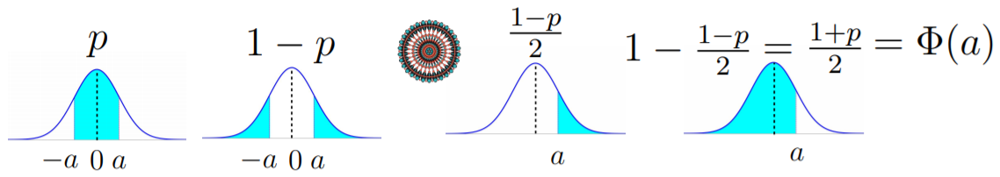
    </a>
  </div>

  + Python code to get probability
    + convert a percentile to a point
    + library: `import scipy.stats as stat`
    + percent point function $\Phi^{-1}(p)$: `stat.norm.ppf(x)`
    + example

      ```python
      stat.norm.ppf(0.95)   # 1.6448536269514722
      stat.norm.ppf(0.975)  # 1.959963984540054
      stat.norm.ppf(0.99)   # 2.3263478740408408
      ```

  + common values
    + $p = 95\%$

      \[ a = \Phi^{-1}\left(\frac{1+p}{2}\right) = \Phi^{-1}(0.975) \approx 1.96 \]

    + verification: $\Pr(-1.96 \le Z \le 1.96) \approx 0.95$
    + 68-97.5-99 rule: $\Pr(-2 \le Z \le 2) \approx 0.95$<br/><br/>

    <table style="font-family: arial,helvetica,sans-serif; width: 30vw;" table-layout="auto" cellspacing="0" cellpadding="5" border="1" align="center">
      <thead>
      <tr style="font-size: 1.2em;">
        <th style="text-align: center; background-color: #3d64ff; color: #ffffff; width:10%;">$p$</th>
        <th style="text-align: center; background-color: #3d64ff; color: #ffffff; width:20%;">$\frac{1+p}{2}$</th>
        <th style="text-align: center; background-color: #3d64ff; color: #ffffff; width:20%;">$\Phi^{-1}\left(\frac{1+p}{2}\right)$</th>
      </tr>
      </thead>
      <tbody>
      <tr>
        <td style="text-align: center;">90</td> <td style="text-align: center;">0.95</td> <td style="text-align: center;">1.645</td>
      </tr>
      <tr>
        <td style="text-align: center;">95</td> <td style="text-align: center;">0.975</td> <td style="text-align: center;">1.960</td>
      </tr>
      <tr>
        <td style="text-align: center;">98</td> <td style="text-align: center;">0.99</td> <td style="text-align: center;">2.056</td>
      </tr>
      </tbody>
    </table>

+ General Normal distribution
  + normal distribution: $X \sim N_{\mu, \sigma^2} \quad N(\mu, \sigma^2)$
  + standard normal distribution: $Z \stackrel{\text{def}}{=} \frac{X - \mu}{\sigma} \;\;\sim N_{0, 1}$

    \[\begin{align*}
      \Pr(\underbrace{\mu - a\sigma \le X \le \mu+a\sigma}_{\substack{X \text{ within "a" stdev}\\\text{from its mean}}}) &= \Pr(-a\sigma \le X - \mu \le a \sigma) = \Pr\left(-a \le \frac{X - \mu}{\sigma} \le a\right) \\
      &= \Pr(\underbrace{-a \le Z \le a}_{\substack{Z \text{ within "a" stdev}\\\text{from its mean}}})
    \end{align*}\]

  <div style="margin: 0.5em; display: flex; justify-content: center; align-items: center; flex-flow: row wrap;">
    <a href="https://tinyurl.com/ya5tozvb" ismap target="_blank">
      
    </a>
  </div>

  + example
    + r.v.: $X \sim N(1, 4) \quad p = 0.95$
    + parameters: $\mu = 1 \quad \sigma = 2$

      \[ 0.95 \approx \Pr(-1.96 \le Z \le 1.96) = \Pr(\mu - 1.96 \sigma \le X \le \mu + 1.96 \sigma) = \Pr(-2.92 \le X \le 4.96) \]


+ Confidence intervals
  + applied to any parameter
  + simplest and by far the most common for
    + mean $\mu$
    + proportion $p$, e.g., probability $p$ in Bernoulli or percentage of people vote for a party in election
  + given a simple $X_1, \dots, X_n$
  + finding an interval containing $\mu$

+ Sample-mean distribution
  + sampling distribution of the same mean
  + normalized sample mean as standard normal distribution

    \[ \frac{X_1 + \cdots + X_n - n \mu}{\sigma\sqrt{n}} \mathrel{\dot\sim} N(0,1) \]

  + scaled sample mean as 0-mean normal distribution

    \[ \frac{X_1 + \cdots + X_n - n \mu}{n} \mathrel{\dot\sim} N\left(0,\frac{\sigma^2}{n}\right) \]

  + sample mean as normal distribution

    \[ \overline{X} = \frac{X_1 + \cdots + X_n}{n} \mathrel{\dot\sim} N\left(\mu, \frac{\sigma^2}{n}\right) \]

  + sample mean $\overline{X}$
    + roughly normal
    + centered at distribution mean: $\mu_{\overline{X}} = \mu$
    + standard deviation: $var(\overline{X}) = \frac{\sigma^2}{n} \quad\to\quad \sigma_{\overline{X}} = \frac{\sigma}{\sqrt{n}}$ (standard error)

+ Proximity
  + Reciporocal: applied to both direction
  + sample mean and population mean
    + $\overline{X}$ near $\mu$: $\overline{X}$ likely near $\mu$
    + $\mu$ near $\overline{X}$:

      \[ \overline{X} \in (\mu - a, \mu +a) \xleftarrow{\text{proximity}} |\overline{X} - \mu| < a \xrightarrow{\text{proximity}} \mu \in \left( \overline{X} -a, \overline{X} + a \right) \]

  + example
    + left diagram
      + $\overline{X}$ within the range of $(\mu -a, \mu + a)$
      + $\mu$ within the range of $(\overline{X}-a , \overline{X} + 1)$
    + right diagram
      + $\overline{X}$ not within the range of $(\mu -a, \mu + a)$
      + $\mu$ falls not the range of $(\overline{X}-a , \overline{X} + 1)$

  <div style="margin: 0.5em; display: flex; justify-content: center; align-items: center; flex-flow: row wrap;">
    <a href="https://tinyurl.com/yb3dyuhl" ismap target="_blank">
      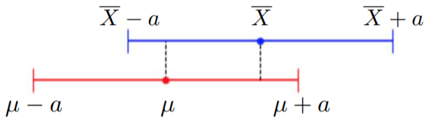
      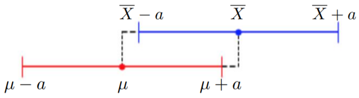
    </a>
  </div>

  + sample mean $\overline{X} \sim N\left(\mu, \frac{\sigma}{\sqrt{n}}\right)$
    + w/ high probability $\overline{X}$ near $\mu$
    + w/ high probability $\mu$ near $\overline{X}$

+ Confidence interval with probability $p$

  \[\begin{align*}
    &\overline{X} \in (\mu - z_p \sigma_{\overline{X}}, \mu + z_p \sigma_{\overline{X}}) \\
    &|\overline{X} - \mu| < z_p \sigma_{\overline{X}} \\
    &\mu \in \left(\overline{X} - z_p \frac{\sigma}{\sqrt{n}}, \overline{X} + z_p \frac{\sigma}{\sqrt{n}}\right)
  \end{align*}\]

  + demo
    + normal distribution w/ $n=5, r=30$ w/ CI level 85%
    + blue curve: theoretical normal distribution
    + mean and its CI of experiment samples
      + green bars: $\mu$ and $\overline{X}$ close to each other within 85% range
      + red bars: $\mu$ and $\overline{X}$ outside the 85% range

    <div style="margin: 0.5em; display: flex; justify-content: center; align-items: center; flex-flow: row wrap;">
      <a href="https://tinyurl.com/yb3dyuhl" ismap target="_blank">
        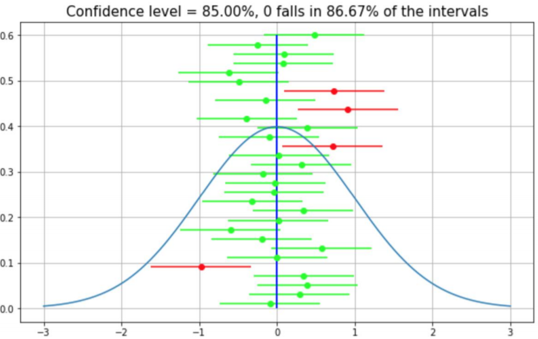
      </a>
    </div>

+ Example: Daily Tweets
  + \# tweets of a random Tweeter user as a r.v. w/ $\sigma = 2$
  + sample mean = 3.7 w/ a sample of 121 users
  + finding the 95% CI for the distribution mean

    \[ z_p = \Phi^{-1}\left(\frac{1+p}{2}\right) = \Phi^{-1}(0.975) = 1.96 \]

  + 95% CI for mean

    \[ (\mu - z_p \sigma_{\overline{X}}, \mu + z_p \sigma_{\overline{X}}) = \left(\overline{X} - z_p \frac{\sigma}{\sqrt{n}}, \overline{X} + z_p \frac{\sigma}{\sqrt{n}}\right) = (3.344, 4.056) \]

  + $z_p \sigma_{\overline{X}} = z_p \frac{\sigma}{\sqrt{n}}$: margin of error

+ Example: heart rate per minute
  + adult heart rate w/ standard deviation $\sigma = 7.5$ beats per min
  + estimated average heart rate within margin of error < 2
  + with CI level 90%

    \[ z_p = \Phi^{-1}\left(\frac{1+p}{2}\right) = \Phi^{-1}(0.95) = 1.645 \]

  + sample size:

    \[ z_p\sigma_{\overline{X}} = z_p \frac{\sigma}{\sqrt{n}} = 2 \implies n = \left(z_p \frac{\sigma}{2}\right)^2 = 38.05 \]


+ [Original Slides](https://tinyurl.com/yb3dyuhl)


### Problem Sets

0. The margin of error of confidence interval with 100% confidence level will be<br/>
  a. Zero<br/>
  b. One standard deviation<br/>
  c. Infinity<br/>
  d. None of the above<br/>

  Ans: c


1. Which of the following will increase the length of the confidence interval?<br/>
  a. Increase confidence level<br/>
  b. Decrease confidence level<br/>
  c. Increase sample size<br/>
  d. Decrease sample size<br/>

  Ans: ad<br/>
  Explanation: 
  + As $\Pr(−a \le Z \le a)= \text{confidence level}$, when confidence level increase, the the length of the interval $(−a,a)$ will increase.
  + When sample size decreases, the variance increases, and probability under the original interval decreases. Since the confidence level is not changed, the length of the confidence interval will increase.


2. A psychologist estimates the standard deviation of a driver's reaction time to be 0.05 seconds. How large a sample of measurements must be taken to derive a confidence interval for the mean with margin of error at most 0.01 second, and confidence level 95%?

  Ans: 97<br/>
  Explanation: For the margin of error of 0.01, to be within the 95% confidence interval, we require \(1.96*(0.05/\sqrt{n})\le 0.01\) or \(n\ge 1.96^2*25=96.04\). A choice of \(n=97\) thus gives the answer.


3. A sample of size $n=25$ with the population standard deviation $\sigma=3$, compute the margin of error of a 90% confidence interval for the mean $\mu$.

  Ans: 0.9870<br/>
  Explanation: $z_p \frac{\sigma}{\sqrt{n}} = 1.645 \times \frac{3}{5} = 0.987$


### Lecture Video

<a href="https://tinyurl.com/y8qmpgwf" target="_BLANK">
  
</a><br/>


## 11.7 Confidence Interval - Sigma Unknown

+ Confidence interval w/ known $\sigma$
  + standard normal distribution: $N(0, 1)$
  + critical point $z_p$: point of probability $p$ s.t. area btw $-z_p$ and $z_p$ w/ $0 \le p \le 1$
  + rv. w/ standard normal: $Z \sim N(0, 1)$

    \[\begin{align*}
      p &= \Pr(|Z| \le z_p) = \Pr(-z_p \le Z \le z_p) \\
      &= \Phi(z_p) - \Phi(-z+p) = \Phi(z_p) - (1- \Phi(z_p)) = 2 \Phi(z_p) -1
    \end{align*}\]

  + $\Phi(x)$: CDF of standard normal

    \[ \Phi(z_p) = \frac{1+p}{2} \implies z_p = \Phi^{-1}\left( \frac{1+p}{2} \right) \]

  + example

    \[ z_{0.9} = \Phi^{-1}\left(\frac{1+0.9}{2} \right) = \Phi^{-1}(0.95) = 1.645 \to \Pr(|Z| \le 1.645) = 0.9  \]

+ Sample mean $\mathrel{\dot\sim}$ Normal
  + r.v's: $X_1, X_2, \dots, X_n$ iis w/ known $\sigma$ and unknown $\mu$
  + sample mean: $\overline{X} = \frac{X_1 + \cdots + X_n}{n}$
  + unbiased sample mean: $\mu_{\overline{X}} = \mu$
  + variance and standard deviation: $var(\overline{X}) = \frac{\sigma^2}{n} \quad \sigma_{\overline{X}} = \frac{\sigma}{\sqrt{n}}$

    \[ \frac{\overbrace{\overline{X} - \mu}^{\text{mean } 0}}{\underbrace{\sigma_{\overline{X}}}_{\text{stdev } 1}} = \frac{\overline{X} - \mu}{\sigma/\sqrt{n}} \quad\underbrace{\mathrel{\dot\sim}}_{\text{CLT}}\quad N(0, 1) \]

+ Confidence interval
  + standard normal: $Z \sim N(0, 1) \quad \Pr(|Z| \le z_p) = p$
  + normalized standard normal: $\frac{\overline{X} - \mu}{\sigma/\sqrt{n}} \mathrel{\dot\sim} N(0, 1)$

    \[ \Pr\left( \left|\frac{\overline{X} - \mu}{\sigma/\sqrt{n}} \right| \le z_p \right) \approx p \implies \Pr\left( |\overline{X} - \mu | \le z_p \frac{\sigma}{\sqrt{n}} \right) \approx p \]

  + with probability $\approx p$

    \[ |\overline{X} - \mu| \le \underbrace{z_p \frac{\sigma}{\sqrt{n}}}_{\text{margin of error}} \implies \mu \in \left[ \overline{X} - z_p \frac{\sigma}{\sqrt{n}}, \overline{X} + z_p \frac{\sigma}{\sqrt{n}} \right] \]

+ Confidence level to confidence interval
  + given confidence $p$ and samples $X_1, \dots, X_n$
  + determining
    + criticall value $z$: $ \Phi^{-1}\left( \frac{1+p}{2}\right) \to $ `scipy.stats.norm.ppf((1+p)/2)`
    + sample mean: $\overline{X} = \frac{X_1+\cdots+X_n}{n}$
    + margin of error w/ know $\sigma$: $z_p \frac{\sigma}{\sqrt{n}}$
    + confidence interval: $\left[ \overline{X} - z_p \frac{\sigma}{\sqrt{n}}, \overline{X} + z_p \frac{\sigma}{\sqrt{n}} \right]$
  + problem: $\sigma$ almost never known

+ Statistics w/ unknown $\sigma$
  + r.v's: $X_1, \dots, X_n \;\;{\perp \!\!\!\! \perp} \;\; \; N(\mu, \sigma^2)$
  + neither $\sigma,$ nor $\mu$ known?
  + finding $\mu$
  + sample mean: $\overline{X} = \frac{X_1 + \dots + X_n}{n}$
  + unbiased sample mean: $\mu_{\overline{X}} = \mu$
  + standard deviation: $\sigma_{\overline{X}} = \frac{\sigma}{\sqrt{n}}$
  + standard normal: $\frac{\overline{X} - \mu}{\sigma_{\overline{X}}} = \frac{\frac{\overline{X}} - \mu}{\sigma/\sqrt{n}} \mathrel{\dot\sim} N(0, 1)$
  + sample variance w/ Bessel correction: $s^2 = \frac{1}{n-1}\sum_{i=1}^n \left(X_i - \overline{X}\right)^2$
  + unbiased sample variance: $\mu_{s^2} = \sigma^2$
  + $\frac{\overline{X}-\mu}{s/\sqrt{n}}$
    + almost standard: $s \approx \sigma$
    + almost normal: $s$ as a r.v.
  + student's t-distribution w/ $n-1$ degrees of freedom

+ Student's t-distribution
  + student t-distribution w/ $\nu$ degrees of freedom: $T_{\nu} = \frac{\overline{X} - \mu}{s/\sqrt{\nu + 1}}$
  + PDF:

    \[ T_{\nu} \sim f_{\nu}(t) = \frac{\Gamma(\frac{\nu+1}{2})}{\sqrt{\nu \pi}\cdot \Gamma{\frac{\nu}{2}}} \left( 1 + \frac{t^2}{\nu} \right)^{-\frac{\nu+1}{2}} \]

    + $\nu$: degrees of freedom
    + $\Gamma(n) = n!$: gamma function
    + only depending on $t$
    + symmetric around 0
  + Python code
    + `t` class in `scipy.stats` module
    + probability density function: `scipy.stats.t.pdf(x, v)`
    + example: $$f_3(1)$

      ```python
      from scipy.stats import t
      t.pdf(1, 3)   # 0.206748
      ```

  + properties:
    + Bell shaped like
    + similar to Gaussian
      + as $\nu \nearrow \to $ standard Normal
      + $n$ increasing $\to s$ concentrated $\to$ a constant $\to \sigma$

      <div style="margin: 0.5em; display: flex; justify-content: center; align-items: center; flex-flow: row wrap;">
        <a href="https://tinyurl.com/y4ewofss" ismap target="_blank">
          
        </a>
      </div>

+ Analytical argument
  + showing that t-distribution converged to standard normal distribution
  + PDF of t-distribution: $f_{\nu}(t) = \frac{\Gamma(\frac{\nu+1}{2})}{\sqrt{\nu \pi}\cdot \Gamma(\frac{\nu}{2})} \left( 1 + \frac{t^2}{\nu} \right)^{-\frac{\nu+1}{2}}$
  + small $x$: $1 + x \approx e^x$
  + t distribution $\to$ standard normal as $\nu \to \infty$

    \[ \left( 1 + \frac{t^2}{\nu} \right)^{-\frac{\nu+1}{2}} \approx \left( e^{\frac{t^2}{\nu}} \right)^{-\frac{\nu + 1}{2}} \approx e^{-\frac{t^2}{\nu} \frac{\nu+1}{2}} \approx e^{-\frac{t^2}{2}} \]

  + constant portion

    \[ \frac{\Gamma\left( \frac{\nu+1}{2} \right)}{\sqrt{\nu\pi} \cdot \Gamma(\frac{\nu}{2})} \approx \frac{1}{\sqrt{2\pi}} \]

+ William Sealy Gosset
  + worked for Guinness Brewery: world's largest
  + production
    + Billion pints / year
    + $\sim 1.75$ Billion bottles
  + main job content: quality control, consistency, statisticians
  + worked w/ Pearson
  + trade secret, publish, pseudonym

+ Confidence interval for t distribution
  + $T_\nu$: student's t-distribution, $\nu$ degrees of freedom
  + critical value $t_{p, \nu}: \Pr(|T_\nu| \le r_{p, \nu}) = p$
  
    \[ p = \Pr(|T_\nu| \le t_{p, \nu}) = \Pr(-t_{p, \nu} \le t_{p, \nu}) = 2 F(T_{p, \nu}) - 1 \]

  + CDF of $T_\nu$: $F(t_{p, \nu}) = \frac{1+p}{2}$
  + critical value: $t_{p, \nu} = F^{-1} \left(\frac{1+p}{2}\right)$
  + Python code
    + cumulative distribution function: `t.cdf(x, v)`, e.g., $F_3(1)$

      ```python
      from scipy.stats import t
      t.cdf(1, 3)   # 0.80449889052211476
      ```

    + inverse cdf: percent point function `t.ppf(x, v)`, e.g., $F_3^{-1}(0.95)$

      ```python
      t.ppf(0.95, 3)    # 2.3533634348018264
      ```

+ Confidence interval for general t distribution
  + t-distribution, $\nu$ degrees of freedom
  + t-statistic: $\frac{\overline{X} - \mu}{S/\sqrt{n}} \sim f_{n-1}(t)$

    \[ \Pr\left(\left|\overline{X} - \mu \right| \le t_{p, n-1}\right) = p \implies \Pr\left(\left|\overline{X} - \mu\right| \le t_{p, n-1} \frac{s}{\sqrt{n}}\right) = p \]

  + w/ probability $p$

    \[ |\overline{X} - \mu| \le \underbrace{t_{p, n-1} \frac{s}{\sqrt{n}}}_{\text{margin of error}} \implies \mu \in \left[\overline{X} - t_{p, n-1} \frac{s}{\sqrt{n}}, \overline{X} + t_{p, n-1} \frac{s}{\sqrt{n}}  \right] \]

+ Confidence level $\to$ confidence interval
  + given confidence $p$ and samples $X_1, \dots, X_n$
  + determining
    + t-score: $t_{p, n-1} = F^{-1}_{n-1} \left(\frac{1+p}{n}\right) \to$ `t.ppf((1+p)/2)` 
    + sample mean: $\overline{X} = \frac{X_1 + \cdots + X_n}{n}$
    + sample variance: $s^2 = \frac{1}{n-1} \sum_{i=1}^m \left( X_i - \overline{X}\right)^2$
    + margin of error: $t_{p, n-1}\frac{s}{\sqrt{n}} \to$ no \sigma required
    + confidence interval: $\left[ \overline{X} - t_{p, n-1} \frac{s}{\sqrt{n}}, \overline{X} + t_{p, n-1} \frac{S}{\sqrt{n}} \right]$

+ Example: mature African elephant trunk length
  + sample measurements (in feet): $n=8 \;\;$, 5.62, 6.07, 6.64, 5.91, 6.30, 6.55, 6.19, 5.48
  + finding: 95% CI for distribution mean
  + t-score: $t_{p, n-1} = F_{n-1}^{-1}(\frac{1+p}{2}) = F_7^{-1}(0.975) \approx 2.3646 \to$ `t.ppf(0.975, 7) # 2.3646`
  + sample mean: $\overline{X} = 6.095$
  + sample variance: $s^2 \approx 0.1705 \to s = 0.4130$
  + margin of error: $t_{p, n-1} \frac{s}{\sqrt{n}} \approx 0.3453$
  + confidence interval: $\left( \overline{X} - t_{p, n-1} \frac{s}{\sqrt{n}}, \overline{X} + t_{p, n-1} \frac{S}{\sqrt{n}} \right) \approx (5.7497, 6.4403)$

+ Observations
  + $n$ large
    + $f_{n-1}(t) \to \phi(t)$, where $\phi(t)$ as standard normal PDF
    + $t_{p, n-1} \to z_p$
    + $s \to \sigma$
    + able to use z-based techniques
  + $n$ small
    + t-distribution more accurate
    + yields larger margin of error than known $\sigma$
    + assumed $X_i \sim N$, best when this roughly holds


+ [Original Slides](https://tinyurl.com/ybjkhdo8)


### Problem Sets


### Lecture Video

<a href="url" target="_BLANK">
  
</a><br/>


## Lecture Notebook 11


## Programming Assignment 11


