# Topic 12: Regression and PCA

## 12.1 Review of Linear Algebra

### Lecture Notes

+ Vectors representing
  + arrows
  + velocity and directions
  + location in the plane or in 3D space
  + ...

+ vector space:
  + basis of linear algebra
  + used to describe, e.g.,
    + points in the plane
    + time series to configuration of electrons in an atom
  + main concepts regarding vectors in finite dimensional Euclidean space
  + examples
    + 2D vector
    + 3D vector

  <div style="margin: 0.5em; display: flex; justify-content: center; align-items: center; flex-flow: row wrap;">
    <a href="https://tinyurl.com/yyx9syva" ismap target="_blank">
      
      
    </a>
  </div>

+ Vector notation
  + __vectors__: letters with a little arrow on top, e.g., $\vec{a},\vec{b},\vec{v}_1,\vec{v}_2,\ldots$
  + $\Bbb{R}^d$: vectors grouped by __dimension d__, the set of all $d$ dimensional (Euclidean) vectors
  + 2D vector:
    + an element of $\Bbb{R}^2$
    + described by a sequence of two real numbers
    + e.g., $\vec{a} = [1, \pi]$, $\vec{b} = [-1.56, 1.2]$
  + 3D vector
    + an element of $\Bbb{R^3}$
    + described by a sequence of 3 numbers
    + e.g., $\vec{a} = [1, \pi, -\pi]$, $\vec{b} = [-1.56, 1.2, 0]$
  + $d$ dimensional vector
    + an element of $\Bbb{R}^d$
    + described by a sequence of $d$ real numbers
    + e.g., $\vec{a} = [a_1, a_2, \dots, a_d]$

+ Python: List vs Numpy Arrays
  + numpy (`np`) library: the workhorse library for linear algebra
  + creating a vector simply surround a Python list w/ the `np.array` function, e.g., `x_vec = np.array([1, 2, 3])`
  + converting a Python list to an array by `np.array` function, e.g., `c_lst = [1, 2]; c_vec = no.array(c_lst)`
  + example

    ```python
    c_list = [1,2]
    print("The list:",c_list)           # The list: [1, 2]
    print("Has length:", len(c_list))   # Has length: 2

    c_vector = np.array(c_list)
    print("The vector:", c_vector)      # The vector: [1 2]
    print("Has shape:",c_vector.shape)  # Has shape: (2,)

    z = [5,6]   # a list
    print("This is a list, not an array:",z)  # This is a list, not an array: [5, 6]
    print(type(z))                            # <class 'list'>

    zarray = np.array(z)
    print("This is an array, not a list",zarray)    # This is an array, not a list [5 6]
    print(type(zarray))                             # <class 'numpy.ndarray'>
    ```

+ Array dimension as vector dimension
  + dimension $d$: `np.array([1, 2, 3, 4])` defines a vector in $\Bbb{R}^4$, i.e., a vector of dimension 4
  + 1D array: `np.array([1, 2, 3, 4])` as a list of number
  + 2D array: `np.array([[1, 2], [3, 4]])` as a rectangle of numbers
  + matrix: a 2D array, e.g., `np.array([[1, 2], [3, 4]])`

+ Visualizing 2D vectors
  + human being able to view 3D
  + vectors in $\Bbb{R}^3$ able to be visualized
  + vectors commonly represented by arrows
  + tail of arrow at zero
  + $(x, y)$ coordinating of the head of the arrow
    + corresponding to the two components of the vector
    + e.g., $\vec{a} = [a_1, a_2]$
  + python code to plot line w/ arrow to represent vector

    ```python
    import matplotlib.pyplot as plt
    from numpy.linalg import norm
    text_loc=1.1
    def plot_arrows(L,scale=4,text_loc=0.2,fontsize=12):
        """ Plot a list of arrows. Each arrow defined by start and end points and 
        a color and optionally text"""
        plt.figure(figsize=[6,6])
        plt.xlim([-scale,scale])
        plt.ylim([-scale,scale])
        ax = plt.axes()
        plt.xlabel('1st coord (x)')
        plt.ylabel('2nd coord (y)')
        #ax.axis('equal')

        for A in L:
            s,e,c=A[:3]
            ax.arrow(s[0], s[1], e[0], e[1], head_width=0.05*scale, head_length=0.1*scale, \
                    fc=c, ec=c,length_includes_head=True);
            if len(A)==4:
                t=A[3]
                _loc=1+text_loc/norm(e)
                ax.text(_loc*e[0],_loc*e[1],t,fontsize=fontsize)
        plt.grid()
        return ax
    zero=np.array([0,0])

    v1=np.array([1,2])
    v2=np.array([-1,1])
    v3=np.array([0,-2])
    plot_arrows([[zero,v1,'r',str(v1)],[zero,v2,'k',str(v2)],[zero,v3,'b',str(v3)]]);
    ```

    <div style="margin: 0.5em; display: flex; justify-content: center; align-items: center; flex-flow: row wrap;">
      <a href="./src/Topic12-Lectures/1.Linear_Algebra_Review.ipynb" ismap target="_blank">
        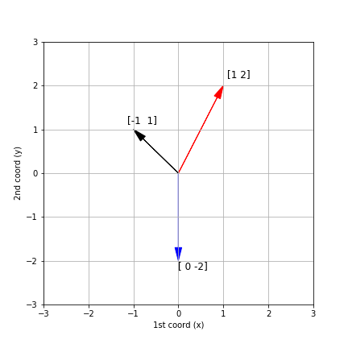
      </a>
    </div>

+ Operations on vectors
  + basic
    + v1= [1 2] v2= [-1  1]
    + v1+v2= [0 3]
    + 4*v2= [-4  4]
    + -v1= [-1 -2]
  + dimension checking for vector operations

    ```python
    try:
      np.array([1, 1])+np.array([1, 2, 1])
    except:
      print('the two vectors have different dimensions')
    ```

  + the inner product
    + __inner product__ or __dot product__: an operation taking two vectors w/ same dimension and returning a number (scalar)
    + math notation: $\vec{a} \cdot \vec{b}$
    + implementation: 3 ways to calculate the dot product
      + `np.dot(v1, v2)`
      + `v1[0]*v2[0] + v1[1]*v2[1]`
      + `np.sum([v1[i]*v2[i] for i in range(len(v1))])`

  + the norm of a vector
    + __length__, __magnitude__, or __norm__ of a vector
    + the distance btw origin, where the vector starts, and its tip

      \[\parallel\vec{v}\parallel = \sqrt{\sum_i v_i^2} = \sqrt{\vec{v} \cdot \vec{v}} \]

    + implementation
      + `np.norm(v)`
      + `np.sqrt(np.dot(v, v))`
  
  + unit vectors
    + vectors whose norm is 1
    + normalizing any vector by dividing its length
    + implementation
      + length of v: `np.norm(v)`
      + `u = v/np.norm(v)`

  + projection
    + taking the dot product of an arbitrary vector w/ a unit vector
    + a simple geometric interpretation
    + example (right diagram)
      + red arrow: unit vector $\vec{u}_1$
      + black arrow: unit vector of $\vec{v}_2$
      + blue line: projection of $\vec{v}_2$ on the direction $\vec{u}_1$
      + green arrow: result of the projection
      + norm of the green arrow: the dot product of `np.dot(u1, v2)`

    <div style="margin: 0.5em; display: flex; justify-content: center; align-items: center; flex-flow: row wrap;">
      <a href="https://tinyurl.com/yyx9syva" ismap target="_blank">
        
      </a>
      <a href="./src/Topic12-Lectures/1.Linear_Algebra_Review.ipynb" ismap target="_blank">
        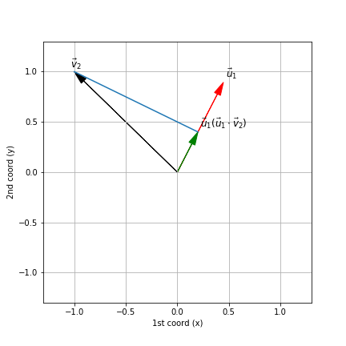
      </a>
    </div>

  + orthogonal vectors
    + two vectors w/ zero dot product
    + the angle btw two vectors is 90 degrees

+ Orthonormal basis
  + Definition: (orthonormal basis) the vectors $\vec{u}_1, \vec{u}_2, \dots, \vec{u}_d \in \Bbb{R}^d$ form an <span style="color: magenta; font-weight: bold;"> orthonormal basis of $\Bbb{R}^d$, if
    + __normality__: $\vec{u}_1, \vec{u}_2, \dots, \vec{u}_d$ are unit vectors, i.e., $\forall\, 1 \le i \le d: \vec{u}_i \cdot \vec{u}_i = 1$
    + __orthogonality__: every pair of vectors are orthogonal, i.e., $\forall\, 1 \le i \ne j \le d: \vec{u}_i \cdot \vec{u}_j = 0$
  + the standard basis
    + $\vec{e}_1 = [1,0,0,\ldots,0], \vec{e}_2 = [0,1,0,\ldots,0], \dots,\vec{e}_d = [0,0,0,\ldots,1]$
    + $v_i$: the $i$th coordinate of $\vec{v} =$ the dot product of a vector $\vec{v}$ w/ a standard basis vector $\vec{e}_i$
  + reconstruction using an orthonormal basis $\vec{u}_1,\ldots,\vec{u}_d$
    + orthonormal basis defining a _coordinate system_
    + allowing to move btw coordinate systems
    + represented as a list of $d$ dot products: $[\vec{v}\cdot\vec{u}_1,\vec{v}\cdot\vec{u}_2,\ldots,\vec{v}\cdot\vec{u}_d]$
    + reconstructing by summing its projections on the basis vectors: $\vec{v} = (\vec{v}\cdot \vec{u}_1)\, \vec{u}_1 + \cdots + (\vec{v}\cdot \vec{u}_d)\, \vec{u}_d$
  + $[v_1, v_2, \dots, v_d]$: representing a vector $\vec{v}$ w/ the standard basis
  + __change of basis__
    + representing $\vec{v}$ using an orthonormal basis
    + demo (see diagram)
      + representing the vector $\vec{v}$ from the standard basis $[\vec{e}_1, \vec{e}_2]$ to a new orthonormal basis $[vec{u}_1, \vec{u}_2]$
      + green arrow: projections of $\vec{v}$ onto the directions defined by $\vec{u}_1$ and $\vec{u}_2$

    <div style="margin: 0.5em; display: flex; justify-content: center; align-items: center; flex-flow: row wrap;">
      <a href="./src/Topic12-Lectures/1.Linear_Algebra_Review.ipynb" ismap target="_blank">
        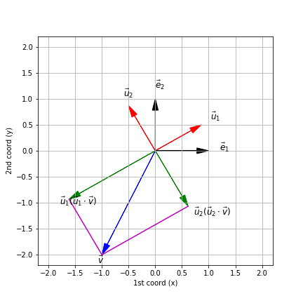
      </a>
    </div>


+ [Original Slide](./src/Topic12-Lectures/1.Linear_Algebra_Review.ipynb)


### Problem Sets

0. Which is NOT true of an orthonormal basis?	<br/>
  a. All of the vectors in the set are orthogonal to each other. The norm of each vector is 1.<br/>
  b. The standard basis in $\Bbb{R}^3$, $e_1=(1,0,0), e_2=(0,1,0), e_3=(0,0,1)$, is orthonormal.<br/>
  c. A vector in the set cannot be a scalar multiple of another vector in the set.<br/>
  d. An orthonormal basis can contain infinitely many vectors for any vector space.<br/>

  Ans: c<br/>
  Explanation: "An orthonormal basis can contain infinitely many vectors for any vector space." is not true. For example, you cannot have an orthonormal basis containing more than 2 vectors for the vector space $\Bbb{R}^2$.


1. What is the length of $\vec{u}$ such that $\vec{u} = \frac{\vec{v}}{\parallel \vec{v}\parallel}$, $\vec{v} =(2,3,7)$?<br/>
  a. 1 <br/>
  b. 3.61 <br/>
  c. 7.84 <br/>
  d. 62<br/>

  Ans: a <br/>
  Explanation: The length of $\vec{u}$ is $\Vert \vec{u} \Vert = \sqrt{\vec{u}^\top \vec{u}} = \sqrt{ \frac{\vec{v}^\top \vec{v}}{ \Vert v \Vert^2} } = \sqrt { \frac{\Vert v \Vert^2}{\Vert v \Vert^2} } = 1$


2. If every vector in an orthonormal basis is orthogonal to each other, this implies that there can be one and only one vector for each dimension of the vector space in this set. (True/False)

  Ans: <span style="color: cyan;">True</span><br/>
  Explanation: Orthogonality implies linear independence. The vectors in an orthonormal basis are linear independent.


3. An inner product, such as the dot product, always uses two vectors as operands and produces a scalar number as the result.

  Ans: True<br/>
  Explanation: An inner product maps two vectors to a scalar $\langle \cdot, \cdot\rangle: \mathbb{R}^n \times \mathbb{R}^n \to \mathbb{R}$


4. If vectors $\vec{a}$ and $\vec{b}$ are orthogonal, then what is the value of $\vec{a} \cdot \vec{b}$?<br/>
  a. 0 <br/>
  b. 1 <br/>
  c. 2 <br/>
  d. 90<br/>

  Ans: a<br/>
  Explanation: By the definition of orthogonality, $\vec{a} \cdot \vec{b} = \vec{a}^\top \vec{b} = 0$


### Lecture Video

<a href="https://tinyurl.com/yxhm83ka" target="_BLANK">
  
</a><br/>


## 12.2 Matrix Notation and Operations

### Lecture Notes

+ Matrix notation
  + Matlab based on Matrix notation
  + Python: similar functionality by using numpy

  <div style="margin: 0.5em; display: flex; justify-content: center; align-items: center; flex-flow: row wrap;">
    <a href="https://tinyurl.com/y2te9nw3" ismap target="_blank">
      
    </a>
  </div>

+ Matrix
  + vector: represented as a one dimensional array of numbers
  + matrix: a 2-dim rectangle of numbers
    + rows: indexed from the top to the bottom
    + columns: indexed from the left to the right
  + notation: $M_{m\times n}$
    + $M$ as an $m \times n$ matrix
    + $n$ rows and $m$ columns
    + the shape pf the matrix: (m, n) in python
  
+ Transposing a matrix

  \[ A = \begin{bmatrix} a_{11} & a_{12} \\ a_{21} & a_{22} \\ a_{31} & a_{32} \end{bmatrix} \quad \xrightarrow{\text{transpose}} \quad
    A^\top = \begin{bmatrix} a_{11} & a_{21} & a_{31} \\ a_{12} & a_{22} & a_{32} \end{bmatrix} \]

+ Vectors represented in matrix context
  + vector: either [row or column vectors](https://tinyurl.com/zwrwnf8)
  + $\vec{v}$ vector denoted by a bold-face letter
    + ${\bf v}$: a column vector
    + ${\bf v}^\top$: a row vector
  + column vector: a matrix consisting of a single column
  + $\vec{v}$ a column vector $\implies$ its transpose, $\vec{v}^\top$, as a row vector

    \[ {\bf v} = \begin{bmatrix} v_1 \\ v_2 \\ \vdots \\ v_d \end{bmatrix} \quad\xrightarrow{\text{transpose}}\quad {\bf v}^\top = \begin{bmatrix} v_1 & v_2 & \cdots & v_d \end{bmatrix} \]

  + a vector as a matrix
    + column vector ${\bf v}$ as a $d \times 1$ matrix
    + row vector ${\bf c}^\top$ as a $1 \times d$ matrix
  + a matrix as a collection of vectors, e.g., a $2 \times 3$ matrix $A = \begin{bmatrix} a_{11} & a_{12} & a_{13} \\ a_{21}& a_{22} & a_{23} \end{bmatrix}$
    + a row of column vectors

      \[ {\bf A} = \begin{bmatrix} {\bf c_1} & {\bf c_2} & {\bf c_2} \end{bmatrix} \quad\to\quad {\bf c_1} = \begin{bmatrix} a_{11} \\ a_{21} \end{bmatrix}, \; {\bf c_2} = \begin{bmatrix} a_{12} \\ a_{22} \end{bmatrix}, \; {\bf c_3} = \begin{bmatrix} a_{13} \\ a_{23} \end{bmatrix}  \]

    + a column of row vectors

      \[ {\bf A} = \begin{bmatrix} {\bf r_1} \\ {\bf r_2} \end{bmatrix} \quad\to\quad {\bf r_1} = \begin{bmatrix} a_{11} & a_{12} & a_{13} \end{bmatrix},\; {\bf r_2} = \begin{bmatrix} a_{21} & a_{22} & a_{23} \end{bmatrix} \]

+ Matrix scalar operation
  + adding a scalar value to a matrix

    \[ A + 3 = \begin{bmatrix} a_{11} & a_{12} \\ a_{21} & a_{22} \end{bmatrix} + 3 = \begin{bmatrix} a_{11}+3 & a_{12}+3 \\ a_{21}+3 & a_{22}+3 \end{bmatrix} \]

  + subtracting a scalar value to a matrix

    \[ A - 3 = \begin{bmatrix} a_{11} & a_{12} \\ a_{21} & a_{22} \end{bmatrix} - 3 = \begin{bmatrix} a_{11}-3 & a_{12}-3 \\ a_{21}-3 & a_{22}-3 \end{bmatrix} \]

  + product of a scalar and a matrix

    \[ 3 \times A = 3 \times \begin{bmatrix} a_{11} & a_{12} \\ a_{21} & a_{22} \end{bmatrix} = \begin{bmatrix} 3 a_{11} & 3 a_{12}\\ 3 a_{21} & 3 a_{22} \end{bmatrix} \]

  + dividing a matrix by a scalar

    \[ A/5 = A \times \frac{1}{5} = \begin{bmatrix} a_{11}/5 & a_{12}/5 \\ a_{21}/5 & a_{22}/5 \end{bmatrix} \]

+ Adding and subtracting two matrices
  + subtracting

    \[ A -B =	\begin{bmatrix} a_{11} & a_{12} \\ a_{21} & a_{22} 	\end{bmatrix} -	\begin{bmatrix} b_{11} & b_{12} \\ b_{21} & b_{22} \end{bmatrix} = \begin{bmatrix} a_{11}-b_{11} & a_{12}-b_{12} \\ a_{21}-b_{21} & a_{22}-b_{22} \end{bmatrix} \]

  + adding

    \[ A + B = \begin{bmatrix} a_{11} & a_{12} \\ a_{21} & a_{22} 	\end{bmatrix} +	\begin{bmatrix} b_{11} & b_{12} \\ b_{21} & b_{22} \end{bmatrix} = \begin{bmatrix} a_{11}+b_{11} & a_{12}+b_{12} \\ a_{21}+b_{21} & a_{22}+b_{22} \end{bmatrix} \]

  + only applied to $A$ and $B$ w/ the same size
  + explicit about the dimensions of matrices for checking conformability

    \[ A_{2 \times 2} + B_{2 \times 2}= \begin{bmatrix} a_{11}+b_{11} & a_{12}+b_{12} \\ a_{21}+b_{21} & a_{22}+b_{22} 	\end{bmatrix}_{2 \times 2} \]
  
  + dimension checking in Python

    ```python
    try:
        result = A + B
    except Exception as err: 
        print(err)
    ```

+ Matrix-Matrix production
  + dot product of 2 vectors
    + a vector = a skinny matrix
    + e.g., $(1, 2, 3) \cdot (1, 1, 0) = 1 \times 1 + 2 \times 1 + 3 \times 0 = 3$
  + convention of dot product in matrix notation
    + 1st vector aas a row vector while the 2nd vector as a column vector
    + no operator ($\cdot$) btw 2 vectors

    \[ \begin{bmatrix} 1,2,3 \end{bmatrix}  \begin{bmatrix} 1 \\ 1 \\ 0 \end{bmatrix} = 1 \times 1 + 2 \times 1 +3 \times 0= 3 \]

  + dot product of a matrix and a vector

    \[\begin{equation}
    {\bf A}=\begin{bmatrix}  a_{11} & a_{12} & a_{13}\\  a_{21} & a_{22} & a_{23}	\end{bmatrix} \qquad {\bf c}=\begin{bmatrix} c_1 \\ c_2 \\ c_3 \end{bmatrix} \\
    {\bf A} = \begin{bmatrix} {\bf r}_1 \\ {\bf r}_2 \end{bmatrix} \quad\to\quad {\bf r}_1=\begin{bmatrix} a_{11} &  a_{12} &  a_{13} \end{bmatrix},  {\bf r}_2=\begin{bmatrix} a_{21} &  a_{22} &  a_{23} \end{bmatrix} \\
    \therefore\; {\bf A} {\bf c} = \begin{bmatrix} {\bf r}_1 {\bf c} \\ {\bf r}_2 {\bf c} \end{bmatrix}  = \begin{bmatrix} a_{11}c_1 + a_{12}c_2 + a_{13} c_3 \\ a_{21}c_1 + a_{22}c_2 + a_{23} c_3	\end{bmatrix}
    \end{equation}\]

  + dot product of two matrices
    + considering a $2 \times 3$ matrix ${\bf C}$ and a $3 \times 2$ matrix ${\bf A}$

      \[ {\bf A}=\begin{bmatrix}  a_{11} & a_{12} \\  a_{21} & a_{22} \\  a_{31} & a_{32} \end{bmatrix} \to {\bf A} =\begin{bmatrix} {\bf a}_1 \\ {\bf a}_2 \\ {\bf a}_3	\end{bmatrix}, \quad{\bf C} = \begin{bmatrix}	c_{11} & c_{12} & c_{13} \\  c_{21} & c_{22} & c_{23} \end{bmatrix} \to {\bf C} =\begin{bmatrix}  {\bf c}_1 & {\bf c}_2 & {\bf c}_3	\end{bmatrix} \]

    + ${\bf AC}$: a matrix generated from taking the dot product of each row vector in ${\bf A}$ w/ each column vector in ${\bf C}$

      \[\begin{align*}
        {\bf AC} &= \begin{bmatrix} {\bf a}_1 \\ {\bf a}_2 \\ {\bf a}_3 \end{bmatrix} \begin{bmatrix} {\bf c}_1 &  {\bf c}_2 &  {\bf c}_3 \end{bmatrix} = \begin{bmatrix} {\bf a}_1 \cdot {\bf c}_1 & {\bf a}_1 \cdot {\bf c}_2 & {\bf a}_1 \cdot {\bf c}_3 \\ {\bf a}_2 \cdot {\bf c}_1 & {\bf a}_2 \cdot {\bf c}_2 & {\bf a}_2 \cdot {\bf c}_3 \\ {\bf a}_3 \cdot {\bf c}_1 & {\bf a}_3 \cdot {\bf c}_2 & {\bf a}_3 \cdot {\bf c}_3 \end{bmatrix} \\\\
        &= \begin{bmatrix} a_{11} c_{11}+a_{12} c_{21} & a_{11} c_{12}+a_{12} c_{22} & a_{11} c_{13}+a_{12} c_{23} \\ a_{21} c_{11}+a_{22} c_{21} & a_{21} c_{12}+a_{22} c_{22} & a_{21} c_{13}+a_{22} c_{23} \\ a_{31} c_{11}+a_{32} c_{21} & a_{31} c_{12}+a_{32} c_{22} & a_{31} c_{13}+a_{32} c_{23} \end{bmatrix}
      \end{align*}\]

    + conformity
      + conform: the number of columns in the 1st matrix = the number of rows in the 2nd matrix
      + e.g., ${\bf A}_{m \times n} \times {\bf B}_{n \times k}$
      + otherwise, matrix product undefined

+ Orthonormal matrices and change of Basis
  + change of basis using matrix notation
    + let ${\bf u}_i = \begin{bmatrix} u_{i1} & u_{i2} & \cdots & u_{id} \end{bmatrix}$
    + orthonormal matrix

    \[ {\bf U} = \begin{bmatrix} {\bf u}_1 \\ {\bf u}_2 \\ \vdots \\ {\bf u}_d \end{bmatrix} = \begin{bmatrix}  u_{11} & u_{12} & \ldots & u_{1d} \\  u_{21} & u_{22} & \ldots & u_{2d} \\  \vdots\\ u_{d1} & u_{d2} & \ldots & u_{dd}  \end{bmatrix} \]

  + orthonormality: ${\bf UU}^\top = {\bf I}$
  + representation of a column vector ${\bf v}$ in the orthonormal basis corresponding to the rows of ${\bf U}$ equal to

    \[ {\bf Uv} = \begin{bmatrix} {\bf u}_1 {\bf v} \\ {\bf u}_2 {\bf v} \\ \vdots \\ {\bf u}_d {\bf v} \end{bmatrix} \]

  + reconstruction of ${\bf v} = $ ${\bf UU}^\top {\bf v}$

+ The identity matrix
  + behaving like the number 1
  + dot product of any matrix ${\bf A}$ by the identity matrix ${\bf I}$ yields ${\bf A}$: ${\bf AI} = {\bf IA} = {\bf A}$

+ Inverting a matrix
  + multiplicative inverse of the number $a$: $a^{-1} = 1/a$
    + property of $a^{-1}$: $aa^{-1} = 1$
    + no multiplicative inverse w/ 0
  + Definition: (inverse matrix) $\exists\, {\bf A}$ w/ multiplicative inverse ${\bf A^{-1}}$ s.t. ${\bf AA^{-1}} = {\bf A^{-1}A} = {\bf I}$
  + inverting the matrix
    + finding the inverse of a matrix
    + Definition: (__invertible__) an $m \times n$ represents a linear transformation from $\Bbb{R}^n$ to $\Bbb{R}^n$,  the matrix is [invertible](https://tinyurl.com/pj2u5h7) $\implies \exists$ inverse transformation ${\bf A^{-1}}$ s.t. $\forall$ any column vector ${\bf v} \in \Bbb{R}^n$:

      \[ {\bf A^{-1}A v} = {\bf AA^{-1}v} = {\bf v} \]

  + inverting a $2 \times 2$ matrix:

    \[ {\bf A} = \begin{bmatrix} a_{11} & a_{12} \\ a_{21} & a_{22}\end{bmatrix} \quad\to\quad {\bf A}^{-1}=\begin{bmatrix} a_{11} & a_{12} \\ a_{21} & a_{22} \end{bmatrix}^{-1}=\frac{1}{a_{11}a_{22}-a_{12}a_{21}}	\begin{bmatrix}  a_{22} & -a_{12} \\ -a_{21} & a_{11} \end{bmatrix} \]

  + singular matrices: matrix w/o inverse matrix

    ```python
    try:
        C_inverse = np.linalg.inv(C)
    except: 
        print('C cannot be inverted: it is a singular matrix')
    ```

+ Python implementation
  + converting a list to a matrix w/ given dimension: `B = A.reshape(m, n)`
  + retrieving dimension: `A.shape`
  + transpose: `B = A.T`
  + splitting matrix into columns: `np.split(ary, indices_or_sections, axis=0)`
  + reconstructing matrix from vectors: `np.concatenate((a1, a2, ...), axis=0, out=None)`
  + product of 2 matrices: `np.dot(A, B)`
  + identity matrix: `np.eye(n)`
  + inverse matrix: `np.linalg.inv(A)`


+ [Original Slide](./src/Topic12-Lectures/2.Matrix_notation_and_operations.ipynb)


### Problem Sets

0. Select the correct statement about matrices from the following:<br/>
  a. A matrix cannot be divided by a scalar, and a scalar cannot be divided by a matrix<br/>
  b. A matrix can be divided by a scalar, but a scalar cannot be divided by a matrix<br/>
  c. A matrix cannot be divided by a scalar, but a scalar can be divided by a matrix<br/>
  d. A matrix can be divided by a scalar, and a scalar can be divided by a matrix<br/>

  Ans: b


1. A $m \times n$ matrix can be added with a $n \times m$ matrix, but they cannot be multiplied. (Assume $m \ne n$) (True/False)

  Ans: False<br/>
  Explanation: A $m \times n$ matrix can be multiplied with a $n \times m$ matrix, but they cannot be added.


2. Let $\vec{a} =(1,0,0)$, $\vec{b} =(0,1,0)$, and $\vec{c} =(0,0,1)$. This is the standard basis that spans $\Bbb{R}^3$. Answer the following questions about this set of vectors:

  a) $\vec{a} +\vec{b} =?$<br/>
    <span style="padding-left: 1em">a.</span> (1,1)<br/>
    <span style="padding-left: 1em">b.</span> (0,0,1)<br/>
    <span style="padding-left: 1em">c.</span> (1,1,1)<br/>
    <span style="padding-left: 1em">d.</span> (1,1,0)<br/>

  b) $\vec{a} \cdot \vec{b} =?$<br/>
    <span style="padding-left: 1em">a.</span> (0,0,0)<br/>
    <span style="padding-left: 1em">b.</span> 0<br/>
    <span style="padding-left: 1em">c.</span> (1,1,0)<br/>
    <span style="padding-left: 1em">d.</span> 2<br/>

  c) $(\vec{a} \cdot \vec{b} )\vec{c}$ =?<br/>
    <span style="padding-left: 1em">a.</span> (0,0,0)<br/>
    <span style="padding-left: 1em">b.</span> 0<br/>
    <span style="padding-left: 1em">c.</span> 1<br/>
    <span style="padding-left: 1em">d.</span> (0,0,1)<br/>

  d) $−\vec{c} =?$<br/>
    <span style="padding-left: 1em">a.</span> (0,0,1)<br/>
    <span style="padding-left: 1em">b.</span> (0,0,−1)<br/>
    <span style="padding-left: 1em">c.</span> (1,0,0)<br/>
    <span style="padding-left: 1em">d.</span> Vectors cannot be negative<br/>

  e) $\parallel \vec{a} \parallel = \sqrt{\vec{a} \cdot \vec{a}}$<br/>
    <span style="padding-left: 1em">a.</span> True<br/>
    <span style="padding-left: 1em">b.</span> False<br/>
    <span style="padding-left: 1em">c.</span> This notation is meaningless<br/>

  f) $\parallel \vec{a} \parallel +\parallel \vec{b} \parallel = ?$<br/>
    <span style="padding-left: 1em">a.</span> \parallel \vec{c} \parallel  <br/>
    <span style="padding-left: 1em">b.</span> 1 <br/>
    <span style="padding-left: 1em">c.</span> 2 <br/>
    <span style="padding-left: 1em">d.</span> (1,1,0) <br/>

  Ans: a. (d); b. (b); c. (a, xb), d. (b); e. (a); f. (b)


3. Given a matrix, $A = \begin{bmatrix} 4 \ 1 \\ 1 \ 9 \end{bmatrix}$, find $(4A)^{-1}$.<br/>
  a. $(4A)^{-1} = \begin{bmatrix} 1 \ \, {- \frac{1}{9}} \\ \!\!\!\! \, {- \frac{1}{9}} \ \hspace{.3cm} \frac{4}{9} \end{bmatrix}$<br/>
  b. $(4A)^{-1} = \begin{bmatrix} \frac{9}{140} \ \ {\,-\frac{1}{140}} \\ \!\!\!\!\!\!\! \,- \frac{1}{140} \ \hspace{.4cm} \frac{1}{35} \end{bmatrix}$<br/>
  c. $(4A)^{-1} = \begin{bmatrix} \frac{1}{16} \ \hspace{.5cm} \! \frac{1}{4} \\  \frac{1}{4} \ \hspace{.4cm} \frac{1}{36} \end{bmatrix}$<br/>
  d. $(4A)^{-1} = \begin{bmatrix} \frac{1}{36} \ \hspace{.1cm} {-\frac{1}{4}} \\ \!\!\!\!  \, {-\frac{1}{4}} \ \hspace{.4cm} \frac{1}{16} \end{bmatrix}$<br/>

  Ans: b<br/>
  Explanation: $(4A)^{-1} = \frac{1}{4}A^{-1} = \begin{bmatrix} \frac{9}{140} \ \ {\,-\frac{1}{140}} \\ \!\!\!\!\!\!\! \,- \frac{1}{140} \ \hspace{.4cm} \frac{1}{35} \end{bmatrix}$


4. Given the matrix $A$ below, answer the following questions:

  \[ A = \begin{bmatrix} a_{11} \ a_{12} \\ a_{21} \ a_{22} \end{bmatrix} \]

  a) $4A+4A=$?<br/>
    <span style="padding-left: 1em">a.</span> $4A$<br/>
    <span style="padding-left: 1em">b.</span> $8A$<br/>
    <span style="padding-left: 1em">c.</span> $16A$<br/>
    <span style="padding-left: 1em">d.</span> Cannot add two matrices of the same dimension<br/>

  b) $A-2 = \begin{bmatrix} {a_{11}\!-2} \ {a_{12}\!-2} \\ {a_{21}\!-2} \ {a_{22}\!-2} \end{bmatrix}$ (True/False)
  
  c) $A^{−1}= \frac{1}{A}$ (True/False)
  
  d) $(A^\top)I=$?<br/>
    <span style="padding-left: 1em">a.</span> $A$ <br/>
    <span style="padding-left: 1em">b.</span> $A^\top$ <br/>
    <span style="padding-left: 1em">c.</span> $1$ <br/>
    <span style="padding-left: 1em">d.</span> $A^{−1}$ <br/>

  e) $(A^\top)^\top=A$ (True/False)

  Ans: a. (b); b. (True); c. (False); d. (b); e. (True)


5. Recall, from linear algebra, that the determinate of a matrix, $A = \begin{bmatrix} a_{11} \ a_{12} \\ a_{21} \ a_{22} \end{bmatrix}$, is equal to $(a_{11}a_{22}-a_{12}a_{21})$. If this determinant is equal to $0$, what does that indicate about the matrix, $A$?<br/>
  a. The difference of the norms of the column vectors is $0$<br/>
  b. The matrix $A$ has no transpose<br/>
  c. The matrix $A$ has no inverse<br/>
  d. This is an identity matrix<br/>

  Ans: c<br/>
  Explanation: $A^{-1} = \frac{1}{a_{11}a_{22}-a_{12}a_{21}} \begin{bmatrix} a_{22} \ -a_{12} \\ -a_{21} \ a_{11} \end{bmatrix}$. a_{11}a_{22}-a_{12}a_{21} = 0


6. If $A = \begin{bmatrix} a_{11} \ a_{12} \\ a_{21} \ a_{22} \end{bmatrix}$ and $B = \begin{bmatrix} b_{11} \ b_{12} \\ b_{21} \ b_{22} \end{bmatrix}$, then $BA=$?<br/>
  a. $C$<br/>
  b. $C^{−1}$<br/>
  c. $C^\top$<br/>
  d. None of the above<br/>

  Ans: d, xc


7. Only square matrices have inverses. (True/False)

  Ans: True


### Lecture Video 

<a href="https://tinyurl.com/y2qzrtcu" target="_BLANK">
  
</a><br/>


## 12.3 Solving a System of Linear Equations

### Lecture Notes

+ Finding a line passing through 2 points
  + $y = w_0 + w_1 x$
    + expressing a line as $(x, y)$ are points along the line, except for vertical line
    + $w_0$: y-axis intercept
    + $w_1$: the slope of the line
  + identifying the line by finding $w_0, w_1$ that satisfies the constraints w/ given points
  + e.g., two points (-1, 2) and (1, 1) in $\Bbb{R}^2$
    + point $(x, y) = (-1, 2) \implies w_0 - w_1 = 2$
    + point $(x, y) = (1, 2) \implies w_0 + w_1 = 1$

+ Writing equations in matrix form
  + ways to solve the equations
  + finding $w_x, w_y$ to satisfy both constraints
  + two ways to find solution w/ `Numpy`
  + equations in matrix form

    \[ \begin{bmatrix} 1 & -1 \\ 1 & 1	 \end{bmatrix} \begin{bmatrix} w_0 \\ w_1	 \end{bmatrix} = \begin{bmatrix} 2 \\ 1	 \end{bmatrix} \]
  
  + writing succinctly as ${\bf Aw = b}$
    + _coefficient_ matrix: ${\bf A} = \begin{bmatrix} 1 & -1 \\1 & 1	\end{bmatrix}$
    + _ordinate_ or _dependent variable_ vector: ${\bf b}=\begin{bmatrix} 2 \\ 1 \end{bmatrix}$
    + _parameter_ vector: ${\bf w} = \begin{bmatrix} w_0 \\ w_1	\end{bmatrix}$
  + goal: find $w$ s.t. ${\bf Aw = b}$
    + w/ A is invertible, multiplying both sides by ${\bf A^{-1}}$

      \[ {\bf w =  A^{-1} A w = A^{-1} b } \]

    + alternatively, solving linear equations
  + Demo: solving using numpy

    ```python
    from numpy.linalg import inv
    from numpy.linalg import solve

    A = np.array([[1,-1], [1,1]])
    b = np.array([[2],[1]])

    # solve using inv(A)
    Ainv=inv(A)
    w=inv(A).dot(b)
    # w= inv(A)*b = 
    # [[ 1.5]
    # [-0.5]]

    # solve using solve()
    w = solve(A, b)
    # [[ 1.5]
    # [-0.5]]
    ```

  + more than 2 points: no straight line amoung them

+ Using `numpy.linalg.solve()`
  + used to solve a set of $n$ linear equations w/ $n$ unknowns
  + simply expressing the set of equation in a matrix format ${\bf Ax = b}$
  + calling `x = np.linalg.solve(A, b)` and returning a vector w/ the solution for ${\bf x}$  
  + classification of systems
    + constraint: the number of equations ($eqs$) = the number of unknowns ($unks$)
    + _undetermined_ or _singular_ system
      + $eqs < unks$
      + not enough info to specify a unique solution
    + _overdetermined_ system:
      + $eqs > unks$
      + no solution  satisfying all constraints
  + demo: $x+y-z=5 \\ z+2y=3 \\ y-x=4$

    ```python
    A=np.array([[1,1,-1],[0,2,1],[-1,1,0]])
    b=np.array([5,3,4])
    solve(A,b)
    # array([-1.,  3., -3.])
    ```


+ [Original Slide](./src/Topic12-Lectures/3.Solving_a_system_of_Equations.ipynb)


### Problem Sets

0. In the matrix equation, ${\bf A\vec{w}=\vec{b}$,what does the matrix, A, contain?<br/>
  a. The x-values of two points<br/>
  b. The slope and y-intercept of the line connecting two points<br/>
  c. The y-values of two points<br/>
  d. The slope of the line connecting two points<br/>

  Ans: <span style="color: cyan;">b</span>


### Lecture Video 

<a href="https://tinyurl.com/y47u7bh4" target="_BLANK">
  
</a><br/>


## 12.4 Linear Regression

### Lecture Notes

+ Linear regression by example
  + 9 points on the plane, defined by $(x, y)$ coordinates
  + points: (0, 19), (1, 20), (2, 20.5), (3, 21.5), (4, 22), (5, 23), (6, 23), (7, 25.5), (8, 24)
  + points close to a straight line trending upwards
  + a function of the form: $f_{w_0, w_1}(x) = w_0 + w_1 x$
  + goal: find $w_0$ and $w_1$
  + __overconstrained__ system
    + more than 2 points
    + no straight line to pass through all of the points
  + points not falling __exactly__ on a line $\to$ finding $w_0, w_1$ s.t. the line is __closest__ to the points

+ Least squared linear regression
  + Definition: (squared difference) __square difference__ btw the line $f_{w_0, w_1}$ and the points $\langle(x_1, y_1), (x_2, y_2), \dots, (x_n, y_n)\rangle$

    \[ \sum_{i=1}^n \left[ f_{w_0, w_1}(x_i) - y_i \right]^2 \]

  + Definition: (least square) the <span style="color: magenta;">least squares</span> solution are the values of $w_0, w_1$ which minimize the square difference
  + using matrix notsation and `np.linalg` to find the optimal vector ${\bf w} = [w_0 \; w_1]$
    + $A_{n\times 2}$ matrix
    + ${\bf y}$ and ${\bf w}$: column vectors

      \[ {\bf A} = \begin{bmatrix} 1 & x_1 \\ \vdots & \vdots \\ 1 & x_n \end{bmatrix}, \;\; {\bf y} = \begin{bmatrix} y_1 \\ \vdots \\ y_n \end{bmatrix}, \;\; {\bf w} = \begin{bmatrix} w_0 \\ w_1 \end{bmatrix} \]

  + the differences: a vector ${\bf d}$

    \[ {\bf d} = {\bf Aw} - {\bf y} \]

  + minimizing the square difference $\implies$ finding the square of the norm of ${\bf d}$
  + goal: find ${\bf w}$ to minimize

    \[ \parallel {\bf d} \parallel_2^2 = \sum_{i=1}^n d_i^2 \]

  + demo

    ```python
    import numpy as np
    from numpy import arange, array, ones, linalg

    x = arange(0,9)
    y = np.array([[19, 20, 20.5, 21.5, 22, 23, 23, 25.5, 24]]).T

    A = array([ones(9), x ]).T
    # A.T=
    #  [[1. 1. 1. 1. 1. 1. 1. 1. 1.]
    #  [0. 1. 2. 3. 4. 5. 6. 7. 8.]]
    # y.T = [[19.  20.  20.5 21.5 22.  23.  23.  25.5 24. ]]
    A.shape,y.shape     # ((9, 2), (9, 1))

    # linearly generated sequence -> obtaining the parameters
    w = linalg.lstsq(A,y)[0]
    # array([[19.18888889],
    #        [ 0.71666667]])
    ```

    <div style="margin: 0.5em; display: flex; justify-content: center; align-items: center; flex-flow: row wrap;">
      <a href="./src/Topic12-Lectures/4.Regression_I.ipynb" ismap target="_blank">
        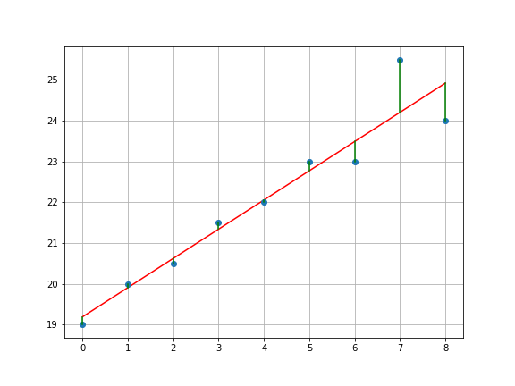
      </a>
    </div>


+ Example: weight prediction from height

  ```python
  HW = pd.read_csv('data/HW25000.csv')
  HW = HW.iloc[:,1:]
  HW.columns = ['Height','Weight']
  HW.head()

  # Copute some basic descriptive statistics
  HW.describe()

  # obtaing weight and height and forming related matrix and vectors
  A = np.array(HW['Height'])
  A = np.array([ones(len(A)),A])
  y = np.array(HW['Weight'])
  A.shape,y.shape

  # finding the optimal parameters (left diagram)
  w1 = linalg.lstsq(A.T,y)[0]       # array([-82.57574306,   3.08347645])

  # the graph of averages (right diagram)
  # calculate the mean weight for each 1-inch interval of height.
  HW['round_height'] = HW['Height'].round()
  HW['round_weight'] = HW['Weight'].round()
 
  per_height_means = HW.groupby('round_height').mean()[['Weight']]
  ```

  <div style="margin: 0.5em; display: flex; justify-content: center; align-items: center; flex-flow: row wrap;">
    <a href="./src/Topic12-Lectures/4.Regression_I.ipynb" ismap target="_blank">
      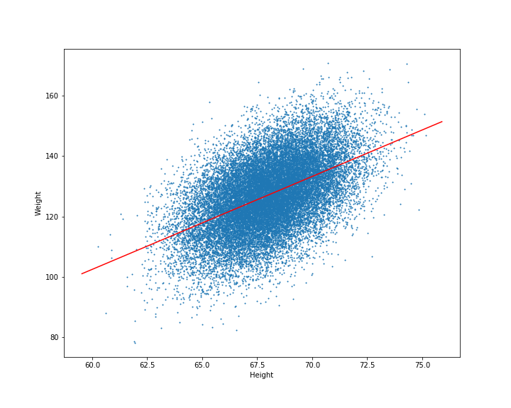
      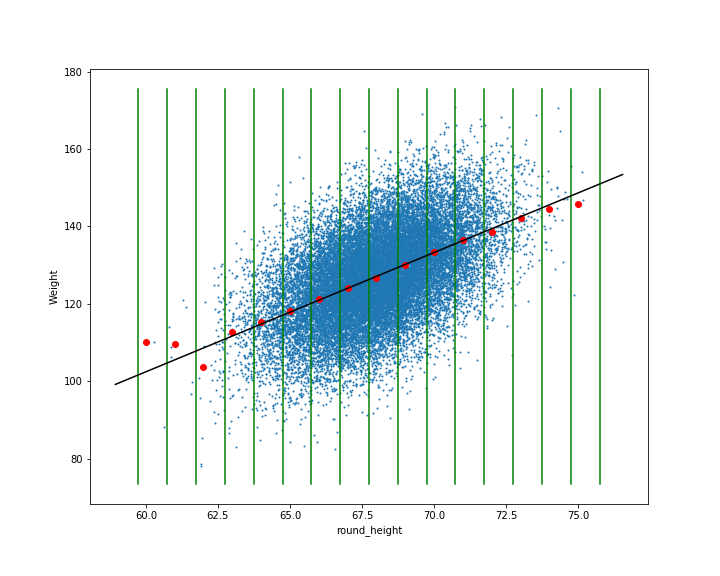
    </a>
  </div>


+ Example: two regression line - predicting height from weight

  ```python
  A=np.array(HW['Weight'])
  A=np.array([ones(len(A)),A])
  y=np.array(HW['Height'])
  A.shape,y.shape

  # finding the optimal parameters
  w2 = linalg.lstsq(A.T,y)[0]
  ```

  <div style="margin: 0.5em; display: flex; justify-content: center; align-items: center; flex-flow: row wrap;">
    <a href="./src/Topic12-Lectures/4.Regression_I.ipynb" ismap target="_blank">
      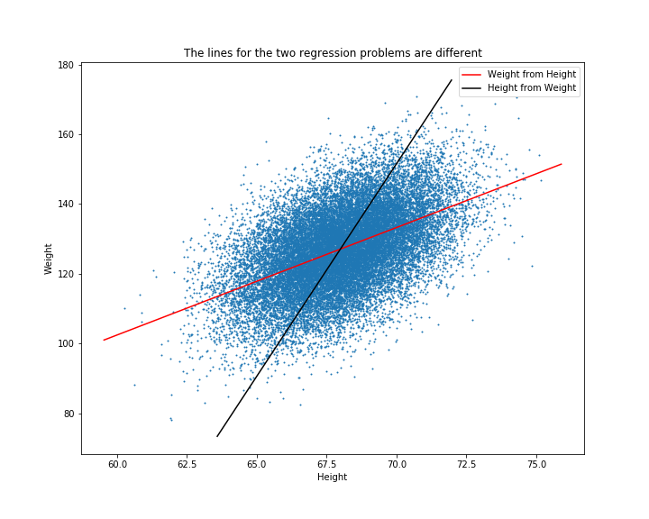
    </a>
  </div>


+ [Original Slide](./src/Topic12-Lectures/4.Regression_I.ipynb)


### Problem Sets


0. If your data set contains 10 colinear points, meaning they are all points on the same line, should you use a linear regression to find that line? (yes/no)

  Ans: no<br/>
  Explanation: No, we do not need to use linear regression. Simply taking two points, we can calculate the slope of the line.


1. When a system has more dimensions than points, it is called an “overdetermined system”. (True/False)

  Ans: False<br/>
  Explanation: It is an "underdetermined system".


2. The purpose of linear regression is to find a line that most closely matches a set of data with multiple data points. (True/ False)

  Ans: True


3. Given points $p_1=(2,3)$ and $p_2=(3,0)$, and the equation $A_{\vec{w}} = \vec{b}$ answer the following:

  a) Find the coefficient matrix, $A$.<br/>
    <span style="padding-left: 1em;">a.</span> $A = \begin{bmatrix} 1 \ 1 \\ 2 \ 3 \end{bmatrix}$<br/>
    <span style="padding-left: 1em;">b.</span> $A = \begin{bmatrix} 1 \ 2 \\ 1 \ 3 \end{bmatrix}$<br/>
    <span style="padding-left: 1em;">c.</span> $A = \begin{bmatrix} 1 \ 3 \\ 1 \ 2 \end{bmatrix}$<br/>
    <span style="padding-left: 1em;">d.</span> $A = \begin{bmatrix} 1 \ 3 \\ 2 \ 1 \end{bmatrix}$<br/>

  b) Find the dependent variable vector, $\vec{b}$.<br/>
    <span style="padding-left: 1em;">a.</span> $\vec{b} = \begin{bmatrix} 9 \\ {-3} \end{bmatrix}$<br/>
    <span style="padding-left: 1em;">b.</span> $\vec{b} = \begin{bmatrix} 3 \\ { 0} \end{bmatrix}$<br/>
    <span style="padding-left: 1em;">c.</span> $\vec{b} = \begin{bmatrix} 9 \\ {-1} \end{bmatrix}$<br/>
    <span style="padding-left: 1em;">d.</span> $\vec{b} = \begin{bmatrix} 6 \\ { 2} \end{bmatrix}$<br/>

  c) Solve for the parameter vector, $\vec{w}$.<br/>
    <span style="padding-left: 1em;">a.</span> $\vec{w} = \begin{bmatrix} 9 \\ -3 \end{bmatrix}$<br/>
    <span style="padding-left: 1em;">b.</span> $\vec{w} = \begin{bmatrix} 1 \\ 1 \end{bmatrix}$<br/>
    <span style="padding-left: 1em;">c.</span> $\vec{w} = \begin{bmatrix} 3 \\ 0 \end{bmatrix}$<br/>
    <span style="padding-left: 1em;">d.</span> $\vec{w} = \begin{bmatrix} -3 \\ 1 \end{bmatrix}$<br/>

  d) Give the equation for the line connecting $p_1$ and $p_2$.<br/>
    <span style="padding-left: 1em;">a.</span> $y = 3x + 9$<br/>
    <span style="padding-left: 1em;">b.</span> $y = x - 3$<br/>
    <span style="padding-left: 1em;">c.</span> $y = -3x+3$<br/>
    <span style="padding-left: 1em;">d.</span> $y = -3x+9$<br/>

  Ans: a. (b); b. (b); c. (a); d. (d)<br/>
  Explanation:
    + The definition in the video.
    + The definition in the video.
    + With $A = \begin{bmatrix} 1 \ 2 \\ 1 \ 3 \end{bmatrix}$ and $\vec{b} = \begin{bmatrix} 3 \\ 0 \end{bmatrix}$, we get $\vec{w} = \begin{bmatrix} 9 \\ -3 \end{bmatrix}$ by solving the linear equation $A_{\vec{w}} = \vec{b}$


4. The parameter vector, $\vec{w} \in \Bbb{R}^2$, represents the slope and Y-intercept of a line in the 2-D plane. (True/False)

  Ans: True

  
5. Why do we want to minimize the square difference from a point to the line instead of the actual difference when using the least squares method?<br/>
  a. It’s more accurate to minimize the larger value<br/>
  b. We could minimize the actual difference as well<br/>
  c. We want to ensure the value is positive because it is a distance<br/>
  d. We want to ensure that far away points are weighted more heavily than nearby points<br/>

  Ans: cd<br/>
  Explanation:
    + False.
    + False.
    + True. If we use a value that can be negative, for example, the actual difference, it can arbitary small by makeing the line far away from the points.
    + True. The square difference penalizes far away points heavily than the absolute difference does.  


### Lecture Video 

<a href="https://tinyurl.com/y5oddnfj" target="_BLANK">
  
</a><br/>


## 12.5 Polynomial Regression

### Lecture Notes

+ 2nd degree polynomial regression
  + form:

    \[ f_2(x)=w_0+w_1 x + w_2 x^2 \]

  + goal: find rge parameters $w_0, w_1$, and $w_2$ to minimize the root-square error

+ Linear and nonlinear regression

  ```python
  import pandas as pd
  from numpy import arange,array,ones,linalg

  # linear regression for average (top left diagram)
  HW = pd.read_csv('data/HW25000.csv')
  HW = HW.iloc[:,1:]
  HW.columns=['Height','Weight']
  HW.head()

  A = np.array(HW['Height'])
  A = np.array([ones(len(A)),A])
  y = np.array(HW['Weight'])

  w1 = linalg.lstsq(A.T,y)[0]
  # w1= [-82.57574306   3.08347645]

  # non-liner graph of average (top right diagram)
  HW['P2'] = HW['Weight']+(HW['Height']-68)**2

  # limit of linear regression (bottom left diagram)
  A=np.array(HW['Height'])
  A=np.array([ones(len(A)),A])
  y=np.array(HW['P2'])

  w1 = linalg.lstsq(A.T,y)[0]
  # w1= [-77.29147795   3.05894484]

  # 2nd degree polynomial w/ a good fit (bottom right diagram)
  A=np.array(HW['Height'])
  A=np.array([ones(len(A)),A,A**2])
  y=np.array(HW['P2'])

  w2 = linalg.lstsq(A.T,y)[0]
  # w2= [ 4.57718628e+03 -1.33969361e+02  1.00774285e+00]
  ```

  <div style="margin: 0.5em; display: flex; justify-content: center; align-items: center; flex-flow: row wrap;">
    <a href="./src/Topic12-Lectures/5.Polynomial_Regression.ipynb" ismap target="_blank">
      
      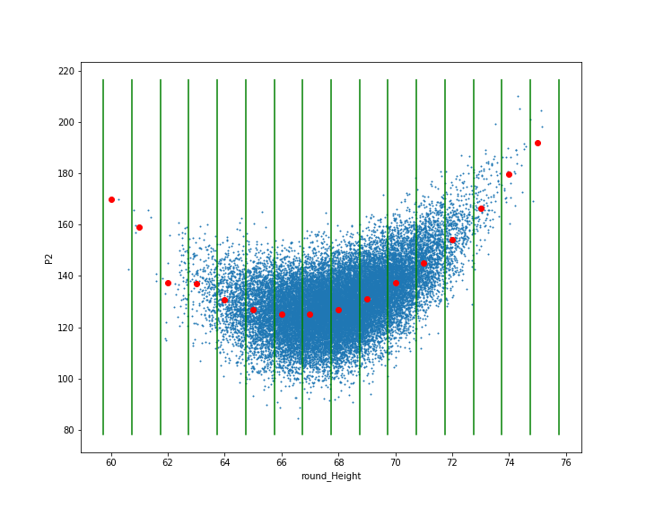
    </a>
    <a href="./src/Topic12-Lectures/5.Polynomial_Regression.ipynb" ismap target="_blank">
      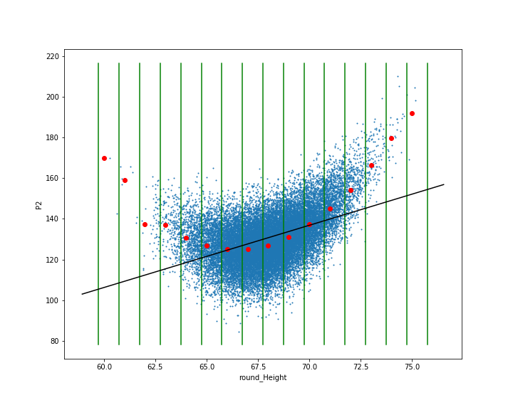
      
    </a>
  </div>

+ Over-fitting, under-fitting and model selection
  + covered in machine learning
  + unknown degree polynomial
  + underfit = degree of polynomial is too low $\to$ poor fit to the data
  + overfit = degree of polynomial is too high $\to$ fitting the data too well
  + overfit issue: interested in the fit of polynomial on unseen data

+ Training error and test error<br/>
  partitioning the data, at random, into two sets
  + training set: polynomial chosen to minimize training error
  + test set: used to measure the error

+ Overfitting and test error
  + increasing the degree of the polynomial
    + training error keep decreasing
    + test error decreasing up to some degree and then increasing
  + overfitting: the increasing portion
  
+ Example: polynomial fitting
  + the minimum of test RMS occurs for $d=1$

  ```python
  # A function for computing a polynomial of an arbitrary degree
  # The degree is determined by the length of the parameter vector w
  def F(X,w):
      Accum = w[0]*np.ones(len(X))
      for i in range(1,len(w)):
          Accum += w[i]*X**i
      return Accum

  # polynomial fitting
  def polyfit(ax, d=8):
      Train = Data[Data['split']==1]
      Test = Data[Data['split']==0]

      A = np.array([Train['x']])
      D = np.ones([1,A.shape[1]])
      for i in range(1,d+1):
          D = np.concatenate([D,A**i])
      w = linalg.lstsq(D.T,Train['y'])[0]
      train_RMS = sqrt(mean((Train['y']-F(Train['x'],w))**2))
      test_RMS = sqrt(mean((Test['y']-F(Test['x'],w))**2))

      return train_RMS,test_RMS

  # generate data
  np.random.seed(0)
  X=np.arange(-1,1.6,0.25)
  Y=X+np.random.rand(len(X))

  # 3-degree polynomial fit (bottom left subplot)
  polyfit(ax,3) 
  # (0.04129876638352148, 0.519905344002559)

  # polynomial fit w degree from 0~5 (see diagram)
  rows = 2; cols = 3; max_d = 6
  fig = plt.figure(figsize=[14,10])
  train_RMS = np.zeros(max_d)
  test_RMS = np.zeros(max_d)
  for d in range(max_d):
      if d == 0:
          ax = plt.subplot(rows,cols,d+1)
          ax0 = ax
      else:
          ax = plt.subplot(rows,cols,d+1,sharex=ax0)
      train_RMS[d],test_RMS[d]=polyfit(ax,d)
  ```

  <div style="margin: 0.5em; display: flex; justify-content: center; align-items: center; flex-flow: row wrap;">
    <a href="./src/Topic12-Lectures/5.Polynomial_Regression.ipynb" ismap target="_blank">
      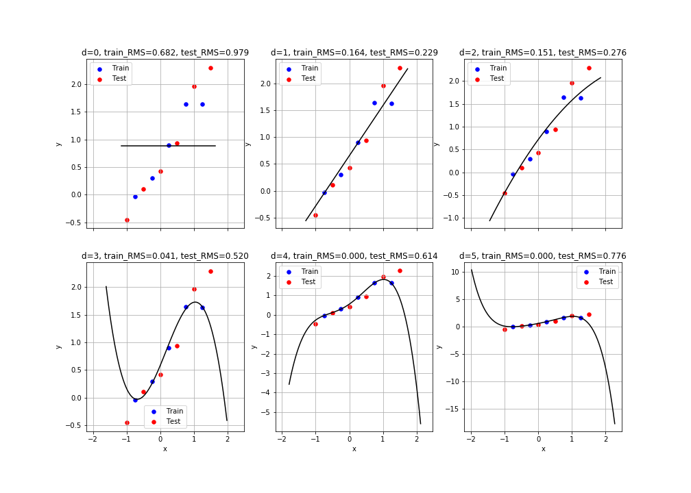
    </a>
    <a href="./src/Topic12-Lectures/5.Polynomial_Regression.ipynb" ismap target="_blank">
      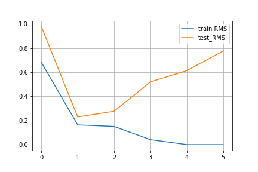
    </a>
  </div>

+ [Original Slide](./src/Topic12-Lectures/5.Polynomial_Regression.ipynb)


### Lecture Video 

<a href="https://tinyurl.com/yxsyhq44" target="_BLANK">
  
</a><br/>


## 12.6 Regression Towards the Mean

### Lecture Notes

+ Regression to the mean by example
  + students taking a standard exam at 2 time points $\to$ getting two grades
    + grades on a 0-100 scale
    + average grade: 70 
    + 1st grade = 97 $\to$ 2nd grade likely to be lower than 97
    + 1st grade = 55 $\to$ 2nd grade likely to be higher than 55
  + 1st grade <font style="color: magenta;">higher</font> than average $\implies$ 2nd grade tending to be <font style="color: cyan;">lower</font> than the 1st
  + 1st grade <font style="color: cyan;">lower</font> than average $\implies$ 2nd grade tending to be <font style="color: magenta;">higher</font> than the 1st
  + happend even if 2 gardes __statistically independent__
  + happend even if grade 1 and grade 2 exchanged
  + nothing interested: no judgement
  + regression to the mean

+ Example: fathers and sons (left diagram)
  + a classical example of regression to the mean involving the height of fathers and sone
  + Sir Francis Gatlon (1885): extreme characteristics (e.g., height) in parents not passed on completely to their offspring
  + demo 1: simple regression
    + father's height: 58" ~ 77"
    + son's height: 63" ~ 72"
    + son's height much closer to mean height

    ```python
    HH = pd.read_csv('data/Pearson.csv')
    HH.head()

    # Copute some basic descriptive statistics.
    HH.describe()

    # regression for fathers and sons height
    A = np.array(HH['Father'])
    A = np.array([ones(len(A)),A])
    y = np.array(HH['Son'])
    A.shape,y.shape

    # finding the optimal parameters
    w1 = linalg.lstsq(A.T,y)[0]
    # array([33.892801, 0.514006])
    # son's height = 33.892801 + 0.514006 * father's height
    ```

  + demo2: considering the difference (right diagram)
    + regression to the mean providing more evidence when comparing the fathers' height and the differences of the father and son
    + the higher the fater's height $\to$ the shorter the son's height

    ```python
    # regression for father and the difference btw (father and son)
    HH['Son-Father'] = HH['Son'] - HH['Father']
    A = np.array(HH['Father'])
    A = np.array([ones(len(A)),A])
    y = np.array(HH['Son-Father'])
    A.shape,y.shape

    # finding the optimal parameters
    w2 = linalg.lstsq(A.T,y)[0]
    # array([33.89280054, -0.48599409])
    ```

  <div style="margin: 0.5em; display: flex; justify-content: center; align-items: center; flex-flow: row wrap;">
    <a href="./src/Topic12-Lectures/5.Regressing_to_the_mean.ipynb" ismap target="_blank">
      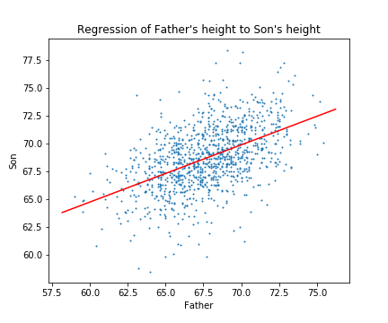
      
    </a>
  </div>

  + conclusions
    + a pair of iid independent variables $X_1, X_2$
    + selecting pairs $x_1, x_2$ s.t. $x_1$ far from the mean of the distribution $\implies$ $x-2$ for those pairs tending to be closer to the mean


+ [Original Slide](./src/Topic12-Lectures/6.Regressing_to_the_mean.ipynb)


### Lecture Video 

<a href="https://tinyurl.com/y59y55k3" target="_BLANK">
  
</a><br/>


## 12.7 Principle Component Analysis

### Lecture Notes

+ Linear regression example
  + 9 points on the plane, defined by $(x, y)$ coordinates
    + points closer to a straight line trending upwards
    + line as a function of a form: $f_{w_0, w_1} (x) = w_0 + w_1 x$
    + goal: find $w_0$ and $w_1$
    + overconstrainted system: more than 2 points $\to$ no straight line passed through all of the points
    + not falling exactly on a line
    + find $w_0, w_1$ s.t. the line is closest to the points
  + square difference btw the line $(w_0, w_1)$ and the points $\langle (x_1, y_1), (x_2, y_2), \dots, (x_n, y_n)\rangle$ to be 
  
    \[ \sum_{i=1}^n \left( f_{w_0, w_1}(x_i) - y_i \right)^2 \]

  + __least squares__ solution: the values of $w_0, w_1$ to minimize the square difference
  + Python: using `numpy.linalg` to find the minimum
  + defining the problem using `np.linalg` w/ matrix notation
    + ${\bf A_{n \times 2}}$: coefficient matrix
    + ${\bf y}$: ordinate or dependent variable vector
    + ${\bf w}$: parameter vector

    \[ {\bf A} = \begin{bmatrix} 1 & x_1 \\ 1 & x_2 \\ \vdots & \vdots \\ 1 & x_n \end{bmatrix}, \; {\bf y} = \begin{bmatrix} y_1 \\ y_2 \\ \vdots \\ y_n \end{bmatrix}, \; {\bf w} = \begin{bmatrix} w_0 \\ w_1 \end{bmatrix} \]

  + the difference as a vector ${\bf d}$

    \[ {\bf d} = {\bf A w - y} \]

  + minimizing the square difference

    \[ \parallel {\bf d} \parallel_2^2 = \sum_{i=1}^n d_i^2 \]

+ No preferred coordinate
  + regression problem: find a function to preddict $y$ from $x$
  + a differetnt solution if predicting $x$ from $y$
  + supervised learning: predicting $x \to y$ or $y \to x$, both $x$ and $y$ labeled
  + unsupervised learning: fit a line w/o making a choice btw $x \to y$ and $y \to x$
  + PCA: using unsupervised learning to find the optimal linear function
  + regresssion and PCA 
    + both minimizing RMS (root mean square)
    + w/ different definitions of error

+ Example: simple regression (see diagram)
  + black line: regression line
  + red line: PCA solution
  + blue segment: error btw PCA and data
  + green segment: amount of error associated w/ each point

  ```python
  import pandas as pd
  from numpy import arange,array,ones,linalg

  def PCA(A):
      Mean = mean(A.T,axis=1) # Compute the location of the mean.
      M = (A-Mean).T # subtract the mean (along columns)
      [eigvals,eigvecs] = linalg.eig(cov(M))
      order = argsort(eigvals)[-1::-1] # ordering vectors so that eigen-values decreasing order
      eigvals = eigvals[order]
      eigvecs = eigvecs[:,order]
      eigvecs = eigvecs.T

      return Mean,eigvals,eigvecs

  x = arange(0,9)
  y = [21, 19, 23, 21, 25, 22, 25, 23, 24]
  A = array([ ones(9),x ])

  # linearly generated sequence
  w = linalg.lstsq(A.T,y)[0]
  Mean,eigvals,eigvecs = PCA(A)
  # order= [0 1]
  # Mean= [ 4.         22.55555556]
  # eigvals= [9.78318072 1.74459706]
  # eigvecs=
  #  [[ 0.84615144  0.53294253]
  #  [-0.53294253  0.84615144]]
  ```

  <div style="margin: 0.5em; display: flex; justify-content: center; align-items: center; flex-flow: row wrap;">
    <a href="./src/Topic12-Lectures/7.PCA.ipynb" ismap target="_blank">
      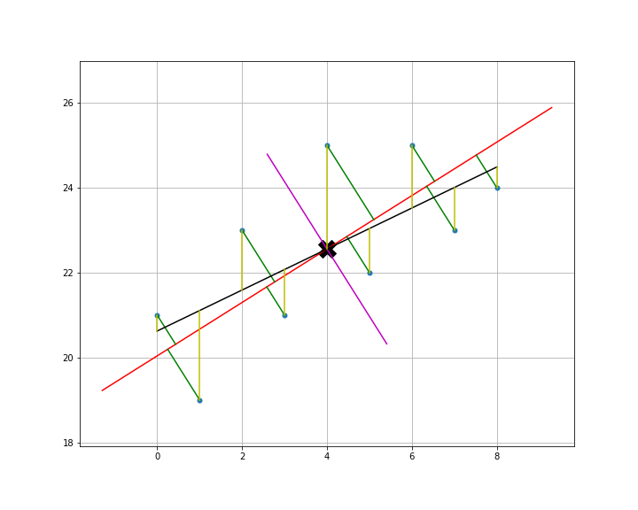
    </a>
  </div>

+ Maximizing variance: alternative criterion
  + PCA = the direction to maximize the variance
  + r.v's / data / samples: $\vec{x}_1, \vec{x}_2 \dots, \vec{x}_n$
  + each unit vector $\vec{u}$ defining a projection of each data point onto the rel line: $a_i = \vec{x}_i \cdot \vec{u}$
  + the variance of the projection $V(\vec{u}) = var(a_i)$
  + modeling
    + considering all possible unit vector - all possible projections
    + $\forall\,$ projection calculating the stdev
    + putting a point one stdev away from the origin in the unit vector direction 
    + the collection of all of these points forms an ellipse
  + the larger axis of the ellipse corresponding to the direction of maximal variance
  + the smaller axis of the ellipse corresponds to the direction of minimal variance
  + directions = eigenvectors
  + generalizing to higher dimension
    + direction of largest variance = 1st eigenvector
    + direction of 2nd largest variance = 2nd eigenvector
    + direction of 3rd largest variance = 3rd eigenvector
    + ...

  + PCA providing one of the most common ways to normalize data
    + subtract the mean
    + rotate the data s.t. the coordinates w/ eigenvectors
  + demo: weight and height
    + left diagram: original data
    + middle diagram: subtracting the mean
    + right diagram: rotation

    ```python
    HW = pd.read_csv('data/HW25000.csv')
    HW = HW.iloc[:,1:]
    HW.columns = ['Height','Weight']

    from math import sin,cos
    def rotate(data, theta):
        Mean = mean(data.T, axis=1)
        M = np.array([[cos(theta), -sin(theta)], [sin(theta), cos(theta)]])
        return (data-Mean).dot(M.T) + Mean

    _array = rotate(np.array(HW),0)
    Mean,eigvals,eigvecs = PCA(_array)
    # order= [1 0]
    # Mean= [ 67.9931136  127.07942116]
    # eigvals= [136.90940491   2.68350923]
    # eigvecs=
    #  [[-0.08336679 -0.99651893]
    #  [-0.99651893  0.08336679]]
    ```

    <div style="margin: 0.5em; display: flex; justify-content: center; align-items: center; flex-flow: row wrap;">
      <a href="./src/Topic12-Lectures/7.PCA.ipynb" ismap target="_blank">
        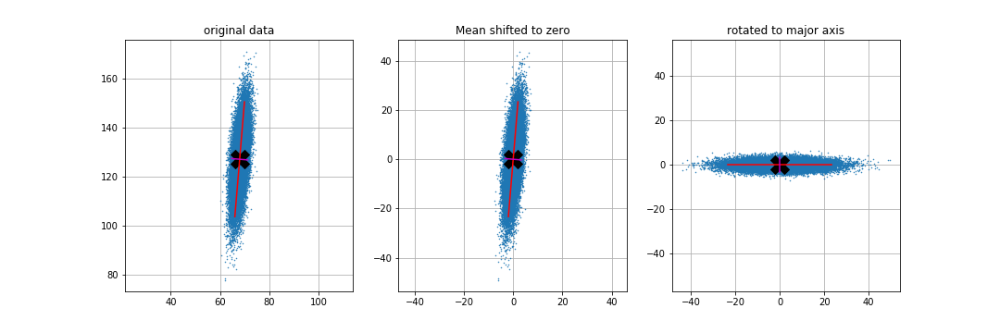
      </a>
    </div>


+ PCA in 2D and computer vision

  ```python
  n = 100
  image = np.zeros([n,n])
  theta = pi/7
  scale_x = 0.2
  scale_y = 1
  Scale = np.array([[scale_x,0],[0,scale_y]])
  M = np.array([[cos(theta),-sin(theta)],[sin(theta),cos(theta)]])
  P = M.dot(Scale)
  for i in arange(-n/2,n/2,.5):
      for j in arange(-n/2,n/2,.5):
          if max(abs(i),abs(j))<30:
              v = np.array([i,j])
              s = P.dot(v)+np.array([n/2,n/2])
              x,y = [int(a) for a in s]
              image[x,y]=1

  nz = np.array(nonzero(image))
  Mean,eigvals,eigvecs = PCA(nz.T)
  # order= [1 0]
  # Mean= [49.5 49.5]
  # eigvals= [301.53805674  14.04345802]
  # eigvecs=
  #  [[ 0.43719437 -0.89936704]
  #  [-0.89936704 -0.43719437]]
  ```

  <div style="margin: 0.5em; display: flex; justify-content: center; align-items: center; flex-flow: row wrap;">
    <a href="./src/Topic12-Lectures/7.PCA.ipynb" ismap target="_blank">
      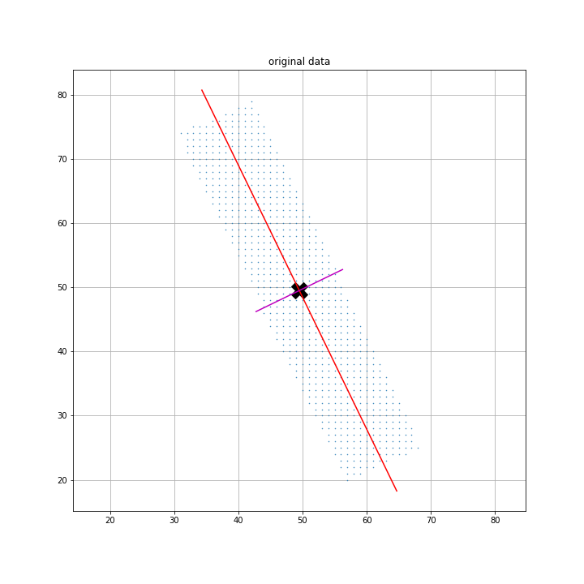
    </a>
  </div>

+ Summary
  + PCA and regression modeling methods based om minimizing RMS error
  + regression
    + a supervised method
    + choosing what to predict
  + PCA: unsupervised method
  + both based on linear algebra and very efficient


+ [Original Slide](./src/Topic12-Lectures/7.PCA.ipynb)


### Problem Sets


### Lecture Video 

<a href="url" target="_BLANK">
  
</a><br/>


## Lecture Notebook 12


### Numpy `ndarray` attributes

+ `ndarray` attributes
  + `T`: ndarray
      Transpose of the array.
  + `data`: buffer<br/>
      The array's elements, in memory.
  + `dtype`: dtype object<br/>
      Describes the format of the elements in the array.
  + `flags`: dict<br/>
      Dictionary containing information related to memory use, e.g., 'C_CONTIGUOUS', 'OWNDATA', 'WRITEABLE', etc.
  + `flat`: numpy.flatiter object<br/>
      Flattened version of the array as an iterator.  The iterator allows assignments, e.g., `x.flat = 3` (See `ndarray.flat` for assignment examples; TODO).
  + `imag`: ndarray<br/>
      Imaginary part of the array.
  + `real`: ndarray<br/>
      Real part of the array.
  + `size`: int<br/>
      Number of elements in the array.
  + `itemsize`: int<br/>
      The memory use of each array element in bytes.
  + `nbytes`: int<br/>
      The total number of bytes required to store the array data,
      i.e., `itemsize * size`.
  + `ndim`: int<br/>
      The array's number of dimensions.
  + `shape`: tuple of ints<br/>
      Shape of the array.
  + `strides`: tuple of ints<br/>
    + The step-size required to move from one element to the next in memory. For example, a contiguous `(3, 4)` array of type
      `int16` in C-order has strides `(8, 2)`.  This implies that to move from element to element in memory requires jumps of 2 bytes.
    + To move from row-to-row, one needs to jump 8 bytes at a time
      (`2 * 4`).
  + `ctypes`: ctypes object<br/>
      Class containing properties of the array needed for interaction
      with ctypes.
  + `base`: ndarray<br/>
      If the array is a view into another array, that array is its `base`
      (unless that array is also a view).  The `base` array is where the
      array data is actually stored.


### Array manipulation routines

  <table style="font-family: arial,helvetica,sans-serif; width: 55vw;" table-layout="auto" cellspacing="0" cellpadding="5" border="1" align="center">
    <caption style="font-size: 1.5em; margin: 0.2em;"><a href="https://tinyurl.com/y2fcsphd">Basic operations</a></caption>
    <thead>
    <tr style="font-size: 1.2em;">
      <th style="text-align: center; background-color: #3d64ff; color: #ffffff; width:10%;">Methods</th>
      <th style="text-align: center; background-color: #3d64ff; color: #ffffff; width:30%;">Description</th>
    </tr>
    </thead>
    <tbody>
    <tr>
      <td><p><a href="https://numpy.org/doc/stable/reference/generated/numpy.copyto.html#numpy.copyto" title="numpy.copyto"><code>copyto</code></a>(dst,&nbsp;src[,&nbsp;casting,&nbsp;where])</p></td>
      <td><p>Copies values from one array to another, broadcasting as necessary.</p></td>
    </tr>
    <tr>
      <td><p><a href="https://numpy.org/doc/stable/reference/generated/numpy.shape.html#numpy.shape" title="numpy.shape"><code>shape</code></a>(a)</p></td>
      <td><p>Return the shape of an array.</p></td>
    </tr>
    </tbody>
  </table>

  <table style="font-family: arial,helvetica,sans-serif; width: 55vw;" table-layout="auto" cellspacing="0" cellpadding="5" border="1" align="center">
    <caption style="font-size: 1.5em; margin: 0.2em;"><a href="https://tinyurl.com/y3b84lwy">Changing array shape</a></caption>
    <thead>
    <tr style="font-size: 1.2em;">
      <th style="text-align: center; background-color: #3d64ff; color: #ffffff; width:10%;">Methods</th>
      <th style="text-align: center; background-color: #3d64ff; color: #ffffff; width:30%;">Description</th>
    </tr>
    </thead>
    <tbody>
    <tr>
      <td><p><a href="https://numpy.org/doc/stable/reference/generated/numpy.reshape.html#numpy.reshape" title="numpy.reshape"><code>reshape</code></a>(a,&nbsp;newshape[,&nbsp;order])</p></td>
      <td><p>Gives a new shape to an array without changing its data.</p></td>
    </tr>
    <tr>
      <td><p><a href="https://numpy.org/doc/stable/reference/generated/numpy.ravel.html#numpy.ravel" title="numpy.ravel"><code>ravel</code></a>(a[,&nbsp;order])</p></td>
      <td><p>Return a contiguous flattened array.</p></td>
    </tr>
    <tr>
      <td><p><a href="https://numpy.org/doc/stable/reference/generated/numpy.ndarray.flat.html#numpy.ndarray.flat" title="numpy.ndarray.flat"><code>ndarray.flat</code></a></p></td>
      <td><p>A 1-D iterator over the array.</p></td>
    </tr>
    <tr>
      <td><p><a href="https://numpy.org/doc/stable/reference/generated/numpy.ndarray.flatten.html#numpy.ndarray.flatten" title="numpy.ndarray.flatten"><code>ndarray.flatten</code></a>([order])</p></td>
      <td><p>Return a copy of the array collapsed into one dimension.</p></td>
    </tr>
    </tbody>
  </table>

  <table style="font-family: arial,helvetica,sans-serif; width: 55vw;" table-layout="auto" cellspacing="0" cellpadding="5" border="1" align="center">
    <caption style="font-size: 1.5em; margin: 0.2em;"><a href="https://tinyurl.com/y4dzggdw">Transpose-like operations</a></caption>
    <thead>
    <tr style="font-size: 1.2em;">
      <th style="text-align: center; background-color: #3d64ff; color: #ffffff; width:10%;">Methods</th>
      <th style="text-align: center; background-color: #3d64ff; color: #ffffff; width:30%;">Description</th>
    </tr>
    </thead>
    <tbody>
    <tr>
      <td><p><a href="https://numpy.org/doc/stable/reference/generated/numpy.moveaxis.html#numpy.moveaxis" title="numpy.moveaxis"><code>moveaxis</code></a>(a,&nbsp;source,&nbsp;destination)</p></td>
      <td><p>Move axes of an array to new positions.</p></td>
    </tr>
    <tr>
      <td><p><a href="https://numpy.org/doc/stable/reference/generated/numpy.rollaxis.html#numpy.rollaxis" title="numpy.rollaxis"><code>rollaxis</code></a>(a,&nbsp;axis[,&nbsp;start])</p></td>
      <td><p>Roll the specified axis backwards, until it lies in a given position.</p></td>
    </tr>
    <tr>
      <td><p><a href="https://numpy.org/doc/stable/reference/generated/numpy.swapaxes.html#numpy.swapaxes" title="numpy.swapaxes"><code>swapaxes</code></a>(a,&nbsp;axis1,&nbsp;axis2)</p></td>
      <td><p>Interchange two axes of an array.</p></td>
    </tr>
    <tr>
      <td><p><a href="https://numpy.org/doc/stable/reference/generated/numpy.ndarray.T.html#numpy.ndarray.T" title="numpy.ndarray.T"><code>ndarray.T</code></a></p></td>
      <td><p>The transposed array.</p></td>
    </tr>
    <tr>
      <td><p><a href="https://numpy.org/doc/stable/reference/generated/numpy.transpose.html#numpy.transpose" title="numpy.transpose"><code>transpose</code></a>(a[,&nbsp;axes])</p></td>
      <td><p>Reverse or permute the axes of an array; returns the modified array.</p></td>
    </tr>
    </tbody>
  </table>

  <table style="font-family: arial,helvetica,sans-serif; width: 55vw;" table-layout="auto" cellspacing="0" cellpadding="5" border="1" align="center">
    <caption style="font-size: 1.5em; margin: 0.2em;"><a href="https://tinyurl.com/yyh28g4w">Changing kind of array</a></caption>
    <thead>
    <tr style="font-size: 1.2em;">
      <th style="text-align: center; background-color: #3d64ff; color: #ffffff; width:10%;">Methods</th>
      <th style="text-align: center; background-color: #3d64ff; color: #ffffff; width:30%;">Description</th>
    </tr>
    </thead>
    <tbody>
    <tr>
      <td><p><a href="https://numpy.org/doc/stable/reference/generated/numpy.asarray.html#numpy.asarray" title="numpy.asarray"><code>asarray</code></a>(a[,&nbsp;dtype,&nbsp;order])</p></td>
      <td><p>Convert the input to an array.</p></td>
    </tr>
    <tr>
      <td><p><a href="https://numpy.org/doc/stable/reference/generated/numpy.asanyarray.html#numpy.asanyarray" title="numpy.asanyarray"><code>asanyarray</code></a>(a[,&nbsp;dtype,&nbsp;order])</p></td>
      <td><p>Convert the input to an ndarray, but pass ndarray subclasses through.</p></td>
    </tr>
    <tr>
      <td><p><a href="https://numpy.org/doc/stable/reference/generated/numpy.asmatrix.html#numpy.asmatrix" title="numpy.asmatrix"><code>asmatrix</code></a>(data[,&nbsp;dtype])</p></td>
      <td><p>Interpret the input as a matrix.</p></td>
    </tr>
    <tr>
      <td><p><a href="https://numpy.org/doc/stable/reference/generated/numpy.asfarray.html#numpy.asfarray" title="numpy.asfarray"><code>asfarray</code></a>(a[,&nbsp;dtype])</p></td>
      <td><p>Return an array converted to a float type.</p></td>
    </tr>
    <tr>
      <td><p><a href="https://numpy.org/doc/stable/reference/generated/numpy.asfortranarray.html#numpy.asfortranarray" title="numpy.asfortranarray"><code>asfortranarray</code></a>(a[,&nbsp;dtype])</p></td>
      <td><p>Return an array (ndim &gt;= 1) laid out in Fortran order in memory.</p></td>
    </tr>
    <tr>
      <td><p><a href="https://numpy.org/doc/stable/reference/generated/numpy.ascontiguousarray.html#numpy.ascontiguousarray" title="numpy.ascontiguousarray"><code>ascontiguousarray</code></a>(a[,&nbsp;dtype])</p></td>
      <td><p>Return a contiguous array (ndim &gt;= 1) in memory (C order).</p></td>
    </tr>
    <tr>
      <td><p><a href="https://numpy.org/doc/stable/reference/generated/numpy.asarray_chkfinite.html#numpy.asarray_chkfinite" title="numpy.asarray_chkfinite"><code>asarray_chkfinite</code></a>(a[,&nbsp;dtype,&nbsp;order])</p></td>
      <td><p>Convert the input to an array, checking for NaNs or Infs.</p></td>
    </tr>
    <tr>
      <td><p><a href="https://numpy.org/doc/stable/reference/generated/numpy.asscalar.html#numpy.asscalar" title="numpy.asscalar"><code>asscalar</code></a>(a)</p></td>
      <td><p>Convert an array of size 1 to its scalar equivalent.</p></td>
    </tr>
    <tr>
      <td><p><a href="https://numpy.org/doc/stable/reference/generated/numpy.require.html#numpy.require" title="numpy.require"><code>require</code></a>(a[,&nbsp;dtype,&nbsp;requirements])</p></td>
      <td><p>Return an ndarray of the provided type that satisfies requirements.</p></td>
    </tr>
    </tbody>
  </table>

  <table style="font-family: arial,helvetica,sans-serif; width: 55vw;" table-layout="auto" cellspacing="0" cellpadding="5" border="1" align="center">
    <caption style="font-size: 1.5em; margin: 0.2em;"><a href="https://tinyurl.com/y3rgd7gu">Joining arrays</a></caption>
    <thead>
    <tr style="font-size: 1.2em;">
      <th style="text-align: center; background-color: #3d64ff; color: #ffffff; width:10%;">Methods</th>
      <th style="text-align: center; background-color: #3d64ff; color: #ffffff; width:30%;">Description</th>
    </tr>
    </thead>
    <tbody>
    <tr>
      <td><p><a href="https://numpy.org/doc/stable/reference/generated/numpy.concatenate.html#numpy.concatenate" title="numpy.concatenate"><code>concatenate</code></a>([axis,&nbsp;out])</p></td>
      <td><p>Join a sequence of arrays along an existing axis.</p></td>
    </tr>
    <tr>
      <td><p><a href="https://numpy.org/doc/stable/reference/generated/numpy.stack.html#numpy.stack" title="numpy.stack"><code>stack</code></a>(arrays[,&nbsp;axis,&nbsp;out])</p></td>
      <td><p>Join a sequence of arrays along a new axis.</p></td>
    </tr>
    <tr>
      <td><p><a href="https://numpy.org/doc/stable/reference/generated/numpy.block.html#numpy.block" title="numpy.block"><code>block</code></a>(arrays)</p></td>
      <td><p>Assemble an nd-array from nested lists of blocks.</p></td>
    </tr>
    <tr>
      <td><p><a href="https://numpy.org/doc/stable/reference/generated/numpy.vstack.html#numpy.vstack" title="numpy.vstack"><code>vstack</code></a>(tup)</p></td>
      <td><p>Stack arrays in sequence vertically (row wise).</p></td>
    </tr>
    <tr>
      <td><p><a href="https://numpy.org/doc/stable/reference/generated/numpy.hstack.html#numpy.hstack" title="numpy.hstack"><code>hstack</code></a>(tup)</p></td>
      <td><p>Stack arrays in sequence horizontally (column wise).</p></td>
    </tr>
    <tr>
      <td><p><a href="https://numpy.org/doc/stable/reference/generated/numpy.dstack.html#numpy.dstack" title="numpy.dstack"><code>dstack</code></a>(tup)</p></td>
      <td><p>Stack arrays in sequence depth wise (along third axis).</p></td>
    </tr>
    <tr>
      <td><p><a href="https://numpy.org/doc/stable/reference/generated/numpy.column_stack.html#numpy.column_stack" title="numpy.column_stack"><code>column_stack</code></a>(tup)</p></td>
      <td><p>Stack 1-D arrays as columns into a 2-D array.</p></td>
    </tr>
    </tbody>
  </table>

  <table style="font-family: arial,helvetica,sans-serif; width: 55vw;" table-layout="auto" cellspacing="0" cellpadding="5" border="1" align="center">
    <caption style="font-size: 1.5em; margin: 0.2em;"><a href="https://tinyurl.com/yytgvopz">Splitting arrays</a></caption>
    <thead>
    <tr style="font-size: 1.2em;">
      <th style="text-align: center; background-color: #3d64ff; color: #ffffff; width:10%;">Methods</th>
      <th style="text-align: center; background-color: #3d64ff; color: #ffffff; width:30%;">Description</th>
    </tr>
    </thead>
    <tbody>
    <tr>
      <td><p><a href="https://numpy.org/doc/stable/reference/generated/numpy.split.html#numpy.split" title="numpy.split"><code>split</code></a>(ary,&nbsp;indices_or_sections[,&nbsp;axis])</p></td>
      <td><p>Split an array into multiple sub-arrays as views into <em class="xref py py-obj">ary</em>.</p></td>
    </tr>
    <tr>
      <td><p><a href="https://numpy.org/doc/stable/reference/generated/numpy.array_split.html#numpy.array_split" title="numpy.array_split"><code>array_split</code></a>(ary,&nbsp;indices_or_sections[,&nbsp;axis])</p></td>
      <td><p>Split an array into multiple sub-arrays.</p></td>
    </tr>
    <tr>
      <td><p><a href="https://numpy.org/doc/stable/reference/generated/numpy.dsplit.html#numpy.dsplit" title="numpy.dsplit"><code>dsplit</code></a>(ary,&nbsp;indices_or_sections)</p></td>
      <td><p>Split array into multiple sub-arrays along the 3rd axis (depth).</p></td>
    </tr>
    <tr>
      <td><p><a href="https://numpy.org/doc/stable/reference/generated/numpy.hsplit.html#numpy.hsplit" title="numpy.hsplit"><code>hsplit</code></a>(ary,&nbsp;indices_or_sections)</p></td>
      <td><p>Split an array into multiple sub-arrays horizontally (column-wise).</p></td>
    </tr>
    <tr>
      <td><p><a href="https://numpy.org/doc/stable/reference/generated/numpy.vsplit.html#numpy.vsplit" title="numpy.vsplit"><code>vsplit</code></a>(ary,&nbsp;indices_or_sections)</p></td>
      <td><p>Split an array into multiple sub-arrays vertically (row-wise).</p></td>
    </tr>
    </tbody>
  </table>

  <table style="font-family: arial,helvetica,sans-serif; width: 55vw;" table-layout="auto" cellspacing="0" cellpadding="5" border="1" align="center">
    <caption style="font-size: 1.5em; margin: 0.2em;"><a href="https://tinyurl.com/y42xs9ne">Adding and removing elements</a></caption>
    <thead>
    <tr style="font-size: 1.2em;">
      <th style="text-align: center; background-color: #3d64ff; color: #ffffff; width:10%;">Methods</th>
      <th style="text-align: center; background-color: #3d64ff; color: #ffffff; width:30%;">Description</th>
    </tr>
    </thead>
    <tbody>
    <tr>
      <td><p><a href="https://numpy.org/doc/stable/reference/generated/numpy.delete.html#numpy.delete" title="numpy.delete"><code>delete</code></a>(arr,&nbsp;obj[,&nbsp;axis])</p></td>
      <td><p>Return a new array with sub-arrays along an axis deleted.</p></td>
    </tr>
    <tr>
      <td><p><a href="https://numpy.org/doc/stable/reference/generated/numpy.insert.html#numpy.insert" title="numpy.insert"><code>insert</code></a>(arr,&nbsp;obj,&nbsp;values[,&nbsp;axis])</p></td>
      <td><p>Insert values along the given axis before the given indices.</p></td>
    </tr>
    <tr>
      <td><p><a href="https://numpy.org/doc/stable/reference/generated/numpy.append.html#numpy.append" title="numpy.append"><code>append</code></a>(arr,&nbsp;values[,&nbsp;axis])</p></td>
      <td><p>Append values to the end of an array.</p></td>
    </tr>
    <tr>
      <td><p><a href="https://numpy.org/doc/stable/reference/generated/numpy.resize.html#numpy.resize" title="numpy.resize"><code>resize</code></a>(a,&nbsp;new_shape)</p></td>
      <td><p>Return a new array with the specified shape.</p></td>
    </tr>
    <tr>
      <td><p><a href="https://numpy.org/doc/stable/reference/generated/numpy.trim_zeros.html#numpy.trim_zeros" title="numpy.trim_zeros"><code>trim_zeros</code></a>(filt[,&nbsp;trim])</p></td>
      <td><p>Trim the leading and/or trailing zeros from a 1-D array or sequence.</p></td>
    </tr>
    <tr>
      <td><p><a href="https://numpy.org/doc/stable/reference/generated/numpy.unique.html#numpy.unique" title="numpy.unique"><code>unique</code></a>(ar[,&nbsp;return_index,&nbsp;return_inverse,&nbsp;…])</p></td>
      <td><p>Find the unique elements of an array.</p></td>
    </tr>
    </tbody>
      </table>

  <table style="font-family: arial,helvetica,sans-serif; width: 55vw;" table-layout="auto" cellspacing="0" cellpadding="5" border="1" align="center">
    <caption style="font-size: 1.5em; margin: 0.2em;"><a href="https://tinyurl.com/y5zlc8uz">Rearranging elements</a></caption>
    <thead>
    <tr style="font-size: 1.2em;">
      <th style="text-align: center; background-color: #3d64ff; color: #ffffff; width:10%;">Methods</th>
      <th style="text-align: center; background-color: #3d64ff; color: #ffffff; width:30%;">Description</th>
    </tr>
    </thead>
    <tbody>
    <tr>
      <td><p><a href="https://numpy.org/doc/stable/reference/generated/numpy.flip.html#numpy.flip" title="numpy.flip"><code>flip</code></a>(m[,&nbsp;axis])</p></td>
      <td><p>Reverse the order of elements in an array along the given axis.</p></td>
    </tr>
    <tr>
      <td><p><a href="https://numpy.org/doc/stable/reference/generated/numpy.fliplr.html#numpy.fliplr" title="numpy.fliplr"><code>fliplr</code></a>(m)</p></td>
      <td><p>Flip array in the left/right direction.</p></td>
    </tr>
    <tr>
      <td><p><a href="https://numpy.org/doc/stable/reference/generated/numpy.flipud.html#numpy.flipud" title="numpy.flipud"><code>flipud</code></a>(m)</p></td>
      <td><p>Flip array in the up/down direction.</p></td>
    </tr>
    <tr>
      <td><p><a href="https://numpy.org/doc/stable/reference/generated/numpy.reshape.html#numpy.reshape" title="numpy.reshape"><code>reshape</code></a>(a,&nbsp;newshape[,&nbsp;order])</p></td>
      <td><p>Gives a new shape to an array without changing its data.</p></td>
    </tr>
    <tr>
      <td><p><a href="https://numpy.org/doc/stable/reference/generated/numpy.roll.html#numpy.roll" title="numpy.roll"><code>roll</code></a>(a,&nbsp;shift[,&nbsp;axis])</p></td>
      <td><p>Roll array elements along a given axis.</p></td>
    </tr>
    <tr>
      <td><p><a href="https://numpy.org/doc/stable/reference/generated/numpy.rot90.html#numpy.rot90" title="numpy.rot90"><code>rot90</code></a>(m[,&nbsp;k,&nbsp;axes])</p></td>
      <td><p>Rotate an array by 90 degrees in the plane specified by axes.</p></td>
    </tr>
    </tbody>
  </table>

### Numpy Linear Algebra

  <table style="font-family: arial,helvetica,sans-serif; width: 55vw;" table-layout="auto" cellspacing="0" cellpadding="5" border="1" align="center">
    <caption style="font-size: 1.5em; margin: 0.2em;"><a href="https://tinyurl.com/y52df8mf">Matrix and vector products</a></caption>
    <thead>
    <tr style="font-size: 1.2em;">
      <th style="text-align: center; background-color: #3d64ff; color: #ffffff; width:10%;">Methods</th>
      <th style="text-align: center; background-color: #3d64ff; color: #ffffff; width:30%;">Description</th>
    </tr>
    </thead>
    <tbody>
    <tr>
      <td><p><a href="https://numpy.org/doc/stable/reference/generated/numpy.dot.html#numpy.dot" title="numpy.dot"><code>dot</code></a>(a,&nbsp;b[,&nbsp;out])</p></td>
      <td><p>Dot product of two arrays.</p></td>
    </tr>
    <tr>
      <td><p><a href="https://numpy.org/doc/stable/reference/generated/numpy.linalg.multi_dot.html#numpy.linalg.multi_dot" title="numpy.linalg.multi_dot"><code>linalg.multi_dot</code></a>(arrays,&nbsp;\*[,&nbsp;out])</p></td>
      <td><p>Compute the dot product of two or more arrays in a single function call, while automatically selecting the fastest evaluation order.</p></td>
    </tr>
    <tr>
      <td><p><a href="https://numpy.org/doc/stable/reference/generated/numpy.vdot.html#numpy.vdot" title="numpy.vdot"><code>vdot</code></a>(a,&nbsp;b)</p></td>
      <td><p>Return the dot product of two vectors.</p></td>
    </tr>
    <tr>
      <td><p><a href="https://numpy.org/doc/stable/reference/generated/numpy.inner.html#numpy.inner" title="numpy.inner"><code>inner</code></a>(a,&nbsp;b)</p></td>
      <td><p>Inner product of two arrays.</p></td>
    </tr>
    <tr>
      <td><p><a href="https://numpy.org/doc/stable/reference/generated/numpy.outer.html#numpy.outer" title="numpy.outer"><code>outer</code></a>(a,&nbsp;b[,&nbsp;out])</p></td>
      <td><p>Compute the outer product of two vectors.</p></td>
    </tr>
    <tr>
      <td><p><a href="https://numpy.org/doc/stable/reference/generated/numpy.matmul.html#numpy.matmul" title="numpy.matmul"><code>matmul</code></a>(x1,&nbsp;x2,&nbsp;/[,&nbsp;out,&nbsp;casting,&nbsp;order,&nbsp;…])</p></td>
      <td><p>Matrix product of two arrays.</p></td>
    </tr>
    <tr>
      <td><p><a href="https://numpy.org/doc/stable/reference/generated/numpy.tensordot.html#numpy.tensordot" title="numpy.tensordot"><code>tensordot</code></a>(a,&nbsp;b[,&nbsp;axes])</p></td>
      <td><p>Compute tensor dot product along specified axes.</p></td>
    </tr>
    <tr>
      <td><p><a href="https://numpy.org/doc/stable/reference/generated/numpy.einsum.html#numpy.einsum" title="numpy.einsum"><code>einsum</code></a>(subscripts,&nbsp;*operands[,&nbsp;out,&nbsp;dtype,&nbsp;…])</p></td>
      <td><p>Evaluates the Einstein summation convention on the operands.</p></td>
    </tr>
    <tr>
      <td><p><a href="https://numpy.org/doc/stable/reference/generated/numpy.einsum_path.html#numpy.einsum_path" title="numpy.einsum_path"><code>einsum_path</code></a>(subscripts,&nbsp;*operands[,&nbsp;optimize])</p></td>
      <td><p>Evaluates the lowest cost contraction order for an einsum expression by considering the creation of intermediate arrays.</p></td>
    </tr>
    <tr>
      <td><p><a href="https://numpy.org/doc/stable/reference/generated/numpy.linalg.matrix_power.html#numpy.linalg.matrix_power" title="numpy.linalg.matrix_power"><code>linalg.matrix_power</code></a>(a,&nbsp;n)</p></td>
      <td><p>Raise a square matrix to the (integer) power <em class="xref py py-obj">n</em>.</p></td>
    </tr>
    <tr>
      <td><p><a href="https://numpy.org/doc/stable/reference/generated/numpy.kron.html#numpy.kron" title="numpy.kron"><code>kron</code></a>(a,&nbsp;b)</p></td>
      <td><p>Kronecker product of two arrays.</p></td>
    </tr>
    </tbody>
  </table>

  <table style="font-family: arial,helvetica,sans-serif; width: 55vw;" table-layout="auto" cellspacing="0" cellpadding="5" border="1" align="center">
    <caption style="font-size: 1.5em; margin: 0.2em;"><a href="https://tinyurl.com/y4n8yc9n">Decompositions</a></caption>
    <thead>
    <tr style="font-size: 1.2em;">
      <th style="text-align: center; background-color: #3d64ff; color: #ffffff; width:10%;">Methods</th>
      <th style="text-align: center; background-color: #3d64ff; color: #ffffff; width:30%;">Description</th>
    </tr>
    </thead>
    <tbody>
    <tr>
      <td><p><a href="https://numpy.org/doc/stable/reference/generated/numpy.linalg.cholesky.html#numpy.linalg.cholesky" title="numpy.linalg.cholesky"><code>linalg.cholesky</code></a>(a)</p></td>
      <td><p>Cholesky decomposition.</p></td>
    </tr>
    <tr>
      <td><p><a href="https://numpy.org/doc/stable/reference/generated/numpy.linalg.qr.html#numpy.linalg.qr" title="numpy.linalg.qr"><code>linalg.qr</code></a>(a[,&nbsp;mode])</p></td>
      <td><p>Compute the qr factorization of a matrix.</p></td>
    </tr>
    <tr>
      <td><p><a href="https://numpy.org/doc/stable/reference/generated/numpy.linalg.svd.html#numpy.linalg.svd" title="numpy.linalg.svd"><code>linalg.svd</code></a>(a[,&nbsp;full_matrices,&nbsp;compute_uv,&nbsp;…])</p></td>
      <td><p>Singular Value Decomposition.</p></td>
    </tr>
    </tbody>
  </table>

  <table style="font-family: arial,helvetica,sans-serif; width: 55vw;" table-layout="auto" cellspacing="0" cellpadding="5" border="1" align="center">
    <caption style="font-size: 1.5em; margin: 0.2em;"><a href="https://tinyurl.com/yy34rdxx">Matrix eigenvalues</a></caption>
    <thead>
    <tr style="font-size: 1.2em;">
      <th style="text-align: center; background-color: #3d64ff; color: #ffffff; width:10%;">Methods</th>
      <th style="text-align: center; background-color: #3d64ff; color: #ffffff; width:30%;">Description</th>
    </tr>
    </thead>
    <tbody>
    <tr>
      <td><p><a href="https://numpy.org/doc/stable/reference/generated/numpy.linalg.eig.html#numpy.linalg.eig" title="numpy.linalg.eig"><code>linalg.eig</code></a>(a)</p></td>
      <td><p>Compute the eigenvalues and right eigenvectors of a square array.</p></td>
    </tr>
    <tr>
      <td><p><a href="https://numpy.org/doc/stable/reference/generated/numpy.linalg.eigh.html#numpy.linalg.eigh" title="numpy.linalg.eigh"><code>linalg.eigh</code></a>(a[,&nbsp;UPLO])</p></td>
      <td><p>Return the eigenvalues and eigenvectors of a complex Hermitian (conjugate symmetric) or a real symmetric matrix.</p></td>
    </tr>
    <tr>
      <td><p><a href="https://numpy.org/doc/stable/reference/generated/numpy.linalg.eigvals.html#numpy.linalg.eigvals" title="numpy.linalg.eigvals"><code>linalg.eigvals</code></a>(a)</p></td>
      <td><p>Compute the eigenvalues of a general matrix.</p></td>
    </tr>
    <tr>
      <td><p><a href="https://numpy.org/doc/stable/reference/generated/numpy.linalg.eigvalsh.html#numpy.linalg.eigvalsh" title="numpy.linalg.eigvalsh"><code>linalg.eigvalsh</code></a>(a[,&nbsp;UPLO])</p></td>
      <td><p>Compute the eigenvalues of a complex Hermitian or real symmetric matrix.</p></td>
    </tr>
    </tbody>
  </table>

  <table style="font-family: arial,helvetica,sans-serif; width: 55vw;" table-layout="auto" cellspacing="0" cellpadding="5" border="1" align="center">
    <caption style="font-size: 1.5em; margin: 0.2em;"><a href="https://tinyurl.com/yyrmojqp">Norms and other numbers</a></caption>
    <thead>
    <tr style="font-size: 1.2em;">
      <th style="text-align: center; background-color: #3d64ff; color: #ffffff; width:10%;">Methods</th>
      <th style="text-align: center; background-color: #3d64ff; color: #ffffff; width:30%;">Description</th>
    </tr>
    </thead>
    <tbody>
    <tr>
      <td><p><a href="https://numpy.org/doc/stable/reference/generated/numpy.linalg.norm.html#numpy.linalg.norm" title="numpy.linalg.norm"><code>linalg.norm</code></a>(x[,&nbsp;ord,&nbsp;axis,&nbsp;keepdims])</p></td>
      <td><p>Matrix or vector norm.</p></td>
    </tr>
    <tr>
      <td><p><a href="https://numpy.org/doc/stable/reference/generated/numpy.linalg.cond.html#numpy.linalg.cond" title="numpy.linalg.cond"><code>linalg.cond</code></a>(x[,&nbsp;p])</p></td>
      <td><p>Compute the condition number of a matrix.</p></td>
    </tr>
    <tr>
      <td><p><a href="https://numpy.org/doc/stable/reference/generated/numpy.linalg.det.html#numpy.linalg.det" title="numpy.linalg.det"><code>linalg.det</code></a>(a)</p></td>
      <td><p>Compute the determinant of an array.</p></td>
    </tr>
    <tr>
      <td><p><a href="https://numpy.org/doc/stable/reference/generated/numpy.linalg.matrix_rank.html#numpy.linalg.matrix_rank" title="numpy.linalg.matrix_rank"><code>linalg.matrix_rank</code></a>(M[,&nbsp;tol,&nbsp;hermitian])</p></td>
      <td><p>Return matrix rank of array using SVD method</p></td>
    </tr>
    <tr>
      <td><p><a href="https://numpy.org/doc/stable/reference/generated/numpy.linalg.slogdet.html#numpy.linalg.slogdet" title="numpy.linalg.slogdet"><code>linalg.slogdet</code></a>(a)</p></td>
      <td><p>Compute the sign and (natural) logarithm of the determinant of an array.</p></td>
    </tr>
    <tr>
      <td><p><a href="https://numpy.org/doc/stable/reference/generated/numpy.trace.html#numpy.trace" title="numpy.trace"><code>trace</code></a>(a[,&nbsp;offset,&nbsp;axis1,&nbsp;axis2,&nbsp;dtype,&nbsp;out])</p></td>
      <td><p>Return the sum along diagonals of the array.</p></td>
    </tr>
    </tbody>
  </table>

  <table style="font-family: arial,helvetica,sans-serif; width: 55vw;" table-layout="auto" cellspacing="0" cellpadding="5" border="1" align="center">
    <caption style="font-size: 1.5em; margin: 0.2em;"><a href="https://tinyurl.com/y4lzb4sq">Solving equations and inverting matrices</a></caption>
    <thead>
    <tr style="font-size: 1.2em;">
      <th style="text-align: center; background-color: #3d64ff; color: #ffffff; width:10%;">Methods</th>
      <th style="text-align: center; background-color: #3d64ff; color: #ffffff; width:30%;">Description</th>
    </tr>
    </thead>
    <tbody>
    <tr>
      <td><p><a href="https://numpy.org/doc/stable/reference/generated/numpy.linalg.solve.html#numpy.linalg.solve" title="numpy.linalg.solve"><code>linalg.solve</code></a>(a,&nbsp;b)</p></td>
      <td><p>Solve a linear matrix equation, or system of linear scalar equations.</p></td>
    </tr>
    <tr>
      <td><p><a href="https://numpy.org/doc/stable/reference/generated/numpy.linalg.tensorsolve.html#numpy.linalg.tensorsolve" title="numpy.linalg.tensorsolve"><code>linalg.tensorsolve</code></a>(a,&nbsp;b[,&nbsp;axes])</p></td>
      <td><p>Solve the tensor equation <code class="docutils literal notranslate"><span class="pre">a</span> <span class="pre">x</span> <span class="pre">=</span> <span class="pre">b</code> for x.</p></td>
    </tr>
    <tr>
      <td><p><a href="https://numpy.org/doc/stable/reference/generated/numpy.linalg.lstsq.html#numpy.linalg.lstsq" title="numpy.linalg.lstsq"><code>linalg.lstsq</code></a>(a,&nbsp;b[,&nbsp;rcond])</p></td>
      <td><p>Return the least-squares solution to a linear matrix equation.</p></td>
    </tr>
    <tr>
      <td><p><a href="https://numpy.org/doc/stable/reference/generated/numpy.linalg.inv.html#numpy.linalg.inv" title="numpy.linalg.inv"><code>linalg.inv</code></a>(a)</p></td>
      <td><p>Compute the (multiplicative) inverse of a matrix.</p></td>
    </tr>
    <tr>
      <td><p><a href="https://numpy.org/doc/stable/reference/generated/numpy.linalg.pinv.html#numpy.linalg.pinv" title="numpy.linalg.pinv"><code>linalg.pinv</code></a>(a[,&nbsp;rcond,&nbsp;hermitian])</p></td>
      <td><p>Compute the (Moore-Penrose) pseudo-inverse of a matrix.</p></td>
    </tr>
    <tr>
      <td><p><a href="https://numpy.org/doc/stable/reference/generated/numpy.linalg.tensorinv.html#numpy.linalg.tensorinv" title="numpy.linalg.tensorinv"><code>linalg.tensorinv</code></a>(a[,&nbsp;ind])</p></td>
      <td><p>Compute the ‘inverse’ of an N-dimensional array.</p></td>
    </tr>
    </tbody>
  </table>


## Programming Assignment 12


