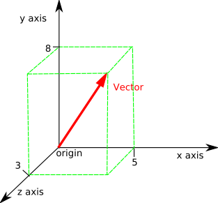

# Topic 12: Regression and PCA

## 12.1 Review of Linear Algebra

### Lecture Notes

+ Vectors representing
  + arrows
  + velocity and directions
  + location in the plane or in 3D space
  + ...

+ vector space:
  + basis of linear algebra
  + used to describe, e.g.,
    + points in the plane
    + time series to configuration of electrons in an atom
  + main concepts regarding vectors in finite dimensional Euclidean space
  + examples
    + 2D vector
    + 3D vector

  <div style="margin: 0.5em; display: flex; justify-content: center; align-items: center; flex-flow: row wrap;">
    <a href="https://tinyurl.com/yyx9syva" ismap target="_blank">
      
      
    </a>
  </div>

+ Vector notation
  + __vectors__: letters with a little arrow on top, e.g., $\vec{a},\vec{b},\vec{v}_1,\vec{v}_2,\ldots$
  + $\Bbb{R}^d$: vectors grouped by __dimension d__, the set of all $d$ dimensional (Euclidean) vectors
  + 2D vector:
    + an element of $\Bbb{R}^2$
    + described by a sequence of two real numbers
    + e.g., $\vec{a} = [1, \pi]$, $\vec{b} = [-1.56, 1.2]$
  + 3D vector
    + an element of $\Bbb{R^3}$
    + described by a sequence of 3 numbers
    + e.g., $\vec{a} = [1, \pi, -\pi]$, $\vec{b} = [-1.56, 1.2, 0]$
  + $d$ dimensional vector
    + an element of $\Bbb{R}^d$
    + described by a sequence of $d$ real numbers
    + e.g., $\vec{a} = [a_1, a_2, \dots, a_d]$

+ Python: List vs Numpy Arrays
  + numpy (`np`) library: the workhorse library for linear algebra
  + creating a vector simply surround a Python list w/ the `np.array` function, e.g., `x_vec = np.array([1, 2, 3])`
  + converting a Python list to an array by `np.array` function, e.g., `c_lst = [1, 2]; c_vec = no.array(c_lst)`
  + example

    ``python
    c_list = [1,2]
    print("The list:",c_list)           # The list: [1, 2]
    print("Has length:", len(c_list))   # Has length: 2

    c_vector = np.array(c_list)
    print("The vector:", c_vector)      # The vector: [1 2]
    print("Has shape:",c_vector.shape)  # Has shape: (2,)

    z = [5,6]   # a list
    print("This is a list, not an array:",z)  # This is a list, not an array: [5, 6]
    print(type(z))                            # <class 'list'>

    zarray = np.array(z)
    print("This is an array, not a list",zarray)    # This is an array, not a list [5 6]
    print(type(zarray))                             # <class 'numpy.ndarray'>
    ``

+ Array dimension as vector dimension
  + dimension $d$: `np.array([1, 2, 3, 4])` defines a vector in $\Bbb{R}^4$, i.e., a vector of dimension 4
  + 1D array: `np.array([1, 2, 3, 4])` as a list of number
  + 2D array: `np.array([[1, 2], [3, 4]])` as a rectangle of numbers
  + matrix: a 2D array, e.g., `np.array([[1, 2], [3, 4]])`

+ Visualizing 2D vectors
  + human being able to view 3D
  + vectors in $\Bbb{R}^3$ able to be visualized
  + vectors commonly represented by arrows
  + tail of arrow at zero
  + $(x, y)$ coordinating of the head of the arrow
    + corresponding to the two components of the vector
    + e.g., $\vec{a} = [a_1, a_2]$
  + python code to plot line w/ arrow to represent vector

    ``python
    import matplotlib.pyplot as plt
    from numpy.linalg import norm
    text_loc=1.1
    def plot_arrows(L,scale=4,text_loc=0.2,fontsize=12):
        """ Plot a list of arrows. Each arrow defined by start and end points and 
        a color and optionally text"""
        plt.figure(figsize=[6,6])
        plt.xlim([-scale,scale])
        plt.ylim([-scale,scale])
        ax = plt.axes()
        plt.xlabel('1st coord (x)')
        plt.ylabel('2nd coord (y)')
        #ax.axis('equal')

        for A in L:
            s,e,c=A[:3]
            ax.arrow(s[0], s[1], e[0], e[1], head_width=0.05*scale, head_length=0.1*scale, \
                    fc=c, ec=c,length_includes_head=True);
            if len(A)==4:
                t=A[3]
                _loc=1+text_loc/norm(e)
                ax.text(_loc*e[0],_loc*e[1],t,fontsize=fontsize)
        plt.grid()
        return ax
    zero=np.array([0,0])

    v1=np.array([1,2])
    v2=np.array([-1,1])
    v3=np.array([0,-2])
    plot_arrows([[zero,v1,'r',str(v1)],[zero,v2,'k',str(v2)],[zero,v3,'b',str(v3)]]);
    ``

    <div style="margin: 0.5em; display: flex; justify-content: center; align-items: center; flex-flow: row wrap;">
      <a href="./src/Topic12-Lectures/1.Linear_Algebra_Review.ipynb" ismap target="_blank">
        
      </a>
    </div>

+ Operations on vectors
  + basic
    + v1= [1 2] v2= [-1  1]
    + v1+v2= [0 3]
    + 4*v2= [-4  4]
    + -v1= [-1 -2]
  + dimension checking for vector operations

    ``python
    try:
      np.array([1, 1])+np.array([1, 2, 1])
    except:
      print('the two vectors have different dimensions')
    ``

  + the inner product
    + __inner product__ or __dot product__: an operation taking two vectors w/ same dimension and returning a number (scalar)
    + math notation: $\vec{a} \cdot \vec{b}$
    + implementation: 3 ways to calculate the dot product
      + `np.dot(v1, v2)`
      + `v1[0]*v2[0] + v1[1]*v2[1]`
      + `np.sum([v1[i]*v2[i] for i in range(len(v1))])`

  + the norm of a vector
    + __length__, __magnitude__, or __norm__ of a vector
    + the distance btw origin, where the vector starts, and its tip

      \[\parallel\vec{v}\parallel = \sqrt{\sum_i v_i^2} = \sqrt{\vec{v} \cdot \vec{v}} \]

    + implementation
      + `np.norm(v)`
      + `np.sqrt(np.dot(v, v))`
  
  + unit vectors
    + vectors whose norm is 1
    + normalizing any vector by dividing its length
    + implementation
      + length of v: `np.norm(v)`
      + `u = v/np.norm(v)`

  + projection
    + taking the dot product of an arbitrary vector w/ a unit vector
    + a simple geometric interpretation
    + example (right diagram)
      + red arrow: unit vector $\vec{u}_1$
      + black arrow: unit vector of $\vec{v}_2$
      + blue line: projection of $\vec{v}_2$ on the direction $\vec{u}_1$
      + green arrow: result of the projection
      + norm of the green arrow: the dot product of `np.dot(u1, v2)`

    <div style="margin: 0.5em; display: flex; justify-content: center; align-items: center; flex-flow: row wrap;">
      <a href="https://tinyurl.com/yyx9syva" ismap target="_blank">
        
      </a>
      <a href="./src/Topic12-Lectures/1.Linear_Algebra_Review.ipynb" ismap target="_blank">
        
      </a>
    </div>

  + orthogonal vectors
    + two vectors w/ zero dot product
    + the angle btw two vectors is 90 degrees

+ Orthonormal basis
  + Definition: (orthonormal basis) the vectors $\vec{u}_1, \vec{u}_2, \dots, \vec{u}_d \in \Bbb{R}^d$ form an <span style="color: magenta; font-weight: bold;"> orthonormal basis of $\Bbb{R}^d$, if
    + __normality__: $\vec{u}_1, \vec{u}_2, \dots, \vec{u}_d$ are unit vectors, i.e., $\forall\, 1 \le i \le d: \vec{u}_i \cdot \vec{u}_i = 1$
    + __orthogonality__: every pair of vectors are orthogonal, i.e., $\forall\, 1 \le i \ne j \le d: \vec{u}_i \cdot \vec{u}_j = 0$
  + the standard basis
    + $\vec{e}_1 = [1,0,0,\ldots,0], \vec{e}_2 = [0,1,0,\ldots,0], \dots,\vec{e}_d = [0,0,0,\ldots,1]$
    + $v_i$: the $i$th coordinate of $\vec{v} =$ the dot product of a vector $\vec{v}$ w/ a standard basis vector $\vec{e}_i$
  + reconstruction using an orthonormal basis $\vec{u}_1,\ldots,\vec{u}_d$
    + orthonormal basis defining a _coordinate system_
    + allowing to move btw coordinate systems
    + represented as a list of $d$ dot products: $[\vec{v}\cdot\vec{u}_1,\vec{v}\cdot\vec{u}_2,\ldots,\vec{v}\cdot\vec{u}_d]$
    + reconstructing by summing its projections on the basis vectors: $\vec{v} = (\vec{v}\cdot \vec{u}_1)\, \vec{u}_1 + \cdots + (\vec{v}\cdot \vec{u}_d)\, \vec{u}_d$
  + $[v_1, v_2, \dots, v_d]$: representing a vector $\vec{v}$ w/ the standard basis
  + __change of basis__
    + representing $\vec{v}$ using an orthonormal basis
    + demo (see diagram)
      + representing the vector $\vec{v}$ from the standard basis $[\vec{e}_1, \vec{e}_2]$ to a new orthonormal basis $[vec{u}_1, \vec{u}_2]$
      + green arrow: projections of $\vec{v}$ onto the directions defined by $\vec{u}_1$ and $\vec{u}_2$

    <div style="margin: 0.5em; display: flex; justify-content: center; align-items: center; flex-flow: row wrap;">
      <a href="./src/Topic12-Lectures/1.Linear_Algebra_Review.ipynb" ismap target="_blank">
        
      </a>
    </div>


### Problem Sets

0. Which is NOT true of an orthonormal basis?	<br/>
  a. All of the vectors in the set are orthogonal to each other. The norm of each vector is 1.<br/>
  b. The standard basis in $\Bbb{R}^3$, $e_1=(1,0,0), e_2=(0,1,0), e_3=(0,0,1)$, is orthonormal.<br/>
  c. A vector in the set cannot be a scalar multiple of another vector in the set.<br/>
  d. An orthonormal basis can contain infinitely many vectors for any vector space.<br/>

  Ans: c<br/>
  Explanation: "An orthonormal basis can contain infinitely many vectors for any vector space." is not true. For example, you cannot have an orthonormal basis containing more than 2 vectors for the vector space $\Bbb{R}^2$.


1. What is the length of $\vec{u}$ such that $\vec{u} = \frac{\vec{v}}{\parallel \vec{v}\parallel}$, $\vec{v} =(2,3,7)$?<br/>
  a. 1 <br/>
  b. 3.61 <br/>
  c. 7.84 <br/>
  d. 62<br/>

  Ans: a <br/>
  Explanation: The length of $\vec{u}$ is $\Vert \vec{u} \Vert = \sqrt{\vec{u}^\top \vec{u}} = \sqrt{ \frac{\vec{v}^\top \vec{v}}{ \Vert v \Vert^2} } = \sqrt { \frac{\Vert v \Vert^2}{\Vert v \Vert^2} } = 1$


2. If every vector in an orthonormal basis is orthogonal to each other, this implies that there can be one and only one vector for each dimension of the vector space in this set. (True/False)

  Ans: <span style="color: cyan;">True</span><br/>
  Explanation: Orthogonality implies linear independence. The vectors in an orthonormal basis are linear independent.


3. An inner product, such as the dot product, always uses two vectors as operands and produces a scalar number as the result.

  Ans: True<br/>
  Explanation: An inner product maps two vectors to a scalar $\langle \cdot, \cdot\rangle: \mathbb{R}^n \times \mathbb{R}^n \to \mathbb{R}$


4. If vectors $\vec{a}$ and $\vec{b}$ are orthogonal, then what is the value of $\vec{a} \cdot \vec{b}$?<br/>
  a. 0 <br/>
  b. 1 <br/>
  c. 2 <br/>
  d. 90<br/>

  Ans: a<br/>
  Explanation: By the definition of orthogonality, $\vec{a} \cdot \vec{b} = \vec{a}^\top \vec{b} = 0$


### Lecture Video

<a href="https://tinyurl.com/yxhm83ka" target="_BLANK">
  
</a><br/>


## 12.2 Matrix Notation and Operations

### Lecture Notes

+ Matrix notation
  + Matlab based on Matrix notation
  + Python: similar functionality by using numpy

  <div style="margin: 0.5em; display: flex; justify-content: center; align-items: center; flex-flow: row wrap;">
    <a href="https://tinyurl.com/y2te9nw3" ismap target="_blank">
      
    </a>
  </div>

+ Matrix
  + vector: represented as a one dimensional array of numbers
  + matrix: a 2-dim rectangle of numbers
    + rows: indexed from the top to the bottom
    + columns: indexed from the left to the right
  + notation: $M_{m\times n}$
    + $M$ as an $m \times n$ matrix
    + $n$ rows and $m$ columns
    + the shape pf the matrix: (m, n) in python
  
+ Transposing a matrix

  \[ A = \begin{bmatrix} a_{11} & a_{12} \\ a_{21} & a_{22} \\ a_{31} & a_{32} \end{bmatrix} \quad \xrightarrow{\text{transpose}} \quad
    A^\top = \begin{bmatrix} a_{11} & a_{21} & a_{31} \\ a_{12} & a_{22} & a_{32} \end{bmatrix} \]

+ Vectors represented in matrix context
  + vector: either [row or column vectors](https://tinyurl.com/zwrwnf8)
  + $\vec{v}$ vector denoted by a bold-face letter
    + ${\bf v}$: a column vector
    + ${\bf v}^\top$: a row vector
  + column vector: a matrix consisting of a single column
  + $\vec{v}$ a column vector $\implies$ its transpose, $\vec{v}^\top$, as a row vector

    \[ {\bf v} = \begin{bmatrix} v_1 \\ v_2 \\ \vdots \\ v_d \end{bmatrix} \quad\xrightarrow{\text{transpose}}\quad {\bf v}^\top = \begin{bmatrix} v_1 & v_2 & \cdots & v_d \end{bmatrix} \]

  + a vector as a matrix
    + column vector ${\bf v}$ as a $d \times 1$ matrix
    + row vector ${\bf c}^\top$ as a $1 \times d$ matrix
  + a matrix as a collection of vectors, e.g., a $2 \times 3$ matrix $A = \begin{bmatrix} a_{11} & a_{12} & a_{13} \\ a_{21}& a_{22} & a_{23} \end{bmatrix}$
    + a row of column vectors

      \[ {\bf A} = \begin{bmatrix} {\bf c_1} & {\bf c_2} & {\bf c_2} \end{bmatrix} \quad\to\quad {\bf c_1} = \begin{bmatrix} a_{11} \\ a_{21} \end{bmatrix}, \; {\bf c_2} = \begin{bmatrix} a_{12} \\ a_{22} \end{bmatrix}, \; {\bf c_3} = \begin{bmatrix} a_{13} \\ a_{23} \end{bmatrix}  \]

    + a column of row vectors

      \[ {\bf A} = \begin{bmatrix} {\bf r_1} \\ {\bf r_2} \end{bmatrix} \quad\to\quad {\bf r_1} = \begin{bmatrix} a_{11} & a_{12} & a_{13} \end{bmatrix},\; {\bf r_2} = \begin{bmatrix} a_{21} & a_{22} & a_{23} \end{bmatrix} \]

+ Matrix scalar operation
  + adding a scalar value to a matrix

    \[ A + 3 = \begin{bmatrix} a_{11} & a_{12} \\ a_{21} & a_{22} \end{bmatrix} + 3 = \begin{bmatrix} a_{11}+3 & a_{12}+3 \\ a_{21}+3 & a_{22}+3 \end{bmatrix} \]

  + subtracting a scalar value to a matrix

    \[ A - 3 = \begin{bmatrix} a_{11} & a_{12} \\ a_{21} & a_{22} \end{bmatrix} - 3 = \begin{bmatrix} a_{11}-3 & a_{12}-3 \\ a_{21}-3 & a_{22}-3 \end{bmatrix} \]

  + product of a scalar and a matrix

    \[ 3 \times A = 3 \times \begin{bmatrix} a_{11} & a_{12} \\ a_{21} & a_{22} \end{bmatrix} = \begin{bmatrix} 3 a_{11} & 3 a_{12}\\ 3 a_{21} & 3 a_{22} \end{bmatrix} \]

  + dividing a matrix by a scalar

    \[ A/5 = A \times \frac{1}{5} = \begin{bmatrix} a_{11}/5 & a_{12}/5 \\ a_{21}/5 & a_{22}/5 \end{bmatrix} \]

+ Adding and subtracting two matrices
  + subtracting

    \[ A -B =	\begin{bmatrix} a_{11} & a_{12} \\ a_{21} & a_{22} 	\end{bmatrix} -	\begin{bmatrix} b_{11} & b_{12} \\ b_{21} & b_{22} \end{bmatrix} = \begin{bmatrix} a_{11}-b_{11} & a_{12}-b_{12} \\ a_{21}-b_{21} & a_{22}-b_{22} \end{bmatrix} \]

  + adding

    \[ A + B = \begin{bmatrix} a_{11} & a_{12} \\ a_{21} & a_{22} 	\end{bmatrix} +	\begin{bmatrix} b_{11} & b_{12} \\ b_{21} & b_{22} \end{bmatrix} = \begin{bmatrix} a_{11}+b_{11} & a_{12}+b_{12} \\ a_{21}+b_{21} & a_{22}+b_{22} \end{bmatrix} \]

  + only applied to $A$ and $B$ w/ the same size
  + explicit about the dimensions of matrices for checking conformability

    \[ A_{2 \times 2} + B_{2 \times 2}= \begin{bmatrix} a_{11}+b_{11} & a_{12}+b_{12} \\ a_{21}+b_{21} & a_{22}+b_{22} 	\end{bmatrix}_{2 \times 2} \]
  
  + dimension checking in Python

    ```python
    try:
        result = A + B
    except Exception as err: 
        print(err)
    ```

+ Matrix-Matrix production
  + dot product of 2 vectors
    + a vector = a skinny matrix
    + e.g., $(1, 2, 3) \cdot (1, 1, 0) = 1 \times 1 + 2 \times 1 + 3 \times 0 = 3$
  + convention of dot product in matrix notation
    + 1st vector aas a row vector while the 2nd vector as a column vector
    + no operator ($\cdot$) btw 2 vectors

    \[ \begin{bmatrix} 1,2,3 \end{bmatrix}  \begin{bmatrix} 1 \\ 1 \\ 0 \end{bmatrix} = 1 \times 1 + 2 \times 1 +3 \times 0= 3 \]

  + dot product of a matrix and a vector

    \[\begin{equation}
    {\bf A}=\begin{bmatrix}  a_{11} & a_{12} & a_{13}\\  a_{21} & a_{22} & a_{23}	\end{bmatrix} \qquad {\bf c}=\begin{bmatrix} c_1 \\ c_2 \\ c_3 \end{bmatrix} \\
    {\bf A} = \begin{bmatrix} {\bf r}_1 \\ {\bf r}_2 \end{bmatrix} \quad\to\quad {\bf r}_1=\begin{bmatrix} a_{11} &  a_{12} &  a_{13} \end{bmatrix},  {\bf r}_2=\begin{bmatrix} a_{21} &  a_{22} &  a_{23} \end{bmatrix} \\
    \therefore\; {\bf A} {\bf c} = \begin{bmatrix} {\bf r}_1 {\bf c} \\ {\bf r}_2 {\bf c} \end{bmatrix}  = \begin{bmatrix} a_{11}c_1 + a_{12}c_2 + a_{13} c_3 \\ a_{21}c_1 + a_{22}c_2 + a_{23} c_3	\end{bmatrix}
    \end{equation}\]

  + dot product of two matrices
    + considering a $2 \times 3$ matrix ${\bf C}$ and a $3 \times 2$ matrix ${\bf A}$

      \[ {\bf A}=\begin{bmatrix}  a_{11} & a_{12} \\  a_{21} & a_{22} \\  a_{31} & a_{32} \end{bmatrix} \to {\bf A} =\begin{bmatrix} {\bf a}_1 \\ {\bf a}_2 \\ {\bf a}_3	\end{bmatrix}, \quad{\bf C} = \begin{bmatrix}	c_{11} & c_{12} & c_{13} \\  c_{21} & c_{22} & c_{23} \end{bmatrix} \to {\bf C} =\begin{bmatrix}  {\bf c}_1 & {\bf c}_2 & {\bf c}_3	\end{bmatrix} \]

    + ${\bf AC}$: a matrix generated from taking the dot product of each row vector in ${\bf A}$ w/ each column vector in ${\bf C}$

      \[\begin{align*}
        {\bf AC} &= \begin{bmatrix} {\bf a}_1 \\ {\bf a}_2 \\ {\bf a}_3 \end{bmatrix} \begin{bmatrix} {\bf c}_1 &  {\bf c}_2 &  {\bf c}_3 \end{bmatrix} = \begin{bmatrix} {\bf a}_1 \cdot {\bf c}_1 & {\bf a}_1 \cdot {\bf c}_2 & {\bf a}_1 \cdot {\bf c}_3 \\ {\bf a}_2 \cdot {\bf c}_1 & {\bf a}_2 \cdot {\bf c}_2 & {\bf a}_2 \cdot {\bf c}_3 \\ {\bf a}_3 \cdot {\bf c}_1 & {\bf a}_3 \cdot {\bf c}_2 & {\bf a}_3 \cdot {\bf c}_3 \end{bmatrix} \\\\
        &= \begin{bmatrix} a_{11} c_{11}+a_{12} c_{21} & a_{11} c_{12}+a_{12} c_{22} & a_{11} c_{13}+a_{12} c_{23} \\ a_{21} c_{11}+a_{22} c_{21} & a_{21} c_{12}+a_{22} c_{22} & a_{21} c_{13}+a_{22} c_{23} \\ a_{31} c_{11}+a_{32} c_{21} & a_{31} c_{12}+a_{32} c_{22} & a_{31} c_{13}+a_{32} c_{23} \end{bmatrix}
      \end{align*}\]

    + conformity
      + conform: the number of columns in the 1st matrix = the number of rows in the 2nd matrix
      + e.g., ${\bf A}_{m \times n} \times {\bf B}_{n \times k}$
      + otherwise, matrix product undefined

+ Orthonormal matrices and change of Basis
  + change of basis using matrix notation
    + let ${\bf u}_i = \begin{bmatrix} u_{i1} & u_{i2} & \cdots & u_{id} \end{bmatrix}$
    + orthonormal matrix

    \[ {\bf U} = \begin{bmatrix} {\bf u}_1 \\ {\bf u}_2 \\ \vdots \\ {\bf u}_d \end{bmatrix} = \begin{bmatrix}  u_{11} & u_{12} & \ldots & u_{1d} \\  u_{21} & u_{22} & \ldots & u_{2d} \\  \vdots\\ u_{d1} & u_{d2} & \ldots & u_{dd}  \end{bmatrix} \]

  + orthonormality: ${\bf UU}^\top = {\bf I}$
  + representation of a column vector ${\bf v}$ in the orthonormal basis corresponding to the rows of ${\bf U}$ equal to

    \[ {\bf Uv} = \begin{bmatrix} {\bf u}_1 {\bf v} \\ {\bf u}_2 {\bf v} \\ \vdots \\ {\bf u}_d {\bf v} \end{bmatrix} \]

  + reconstruction of ${\bf v} = $ ${\bf UU}^\top {\bf v}$

+ The identity matrix
  + behaving like the number 1
  + dot product of any matrix ${\bf A}$ by the identity matrix ${\bf I}$ yields ${\bf A}$: ${\bf AI} = {\bf IA} = {\bf A}$

+ Inverting a matrix
  + multiplicative inverse of the number $a$: $a^{-1} = 1/a$
    + property of $a^{-1}$: $aa^{-1} = 1$
    + no multiplicative inverse w/ 0
  + Definition: (inverse matrix) $\exists\, {\bf A}$ w/ multiplicative inverse ${\bf A^{-1}}$ s.t. ${\bf AA^{-1}} = {\bf A^{-1}A} = {\bf I}$
  + inverting the matrix
    + finding the inverse of a matrix
    + Definition: (__invertible__) an $m \times n$ represents a linear transformation from $\Bbb{R}^n$ to $\Bbb{R}^n$,  the matrix is [invertible](https://tinyurl.com/pj2u5h7) $\implies \exists$ inverse transformation ${\bf A^{-1}}$ s.t. $\forall$ any column vector ${\bf v} \in \Bbb{R}^n$:

      \[ {\bf A^{-1}A v} = {\bf AA^{-1}v} = {\bf v} \]

  + inverting a $2 \times 2$ matrix:

    \[ {\bf A} = \begin{bmatrix} a_{11} & a_{12} \\ a_{21} & a_{22}\end{bmatrix} \quad\to\quad {\bf A}^{-1}=\begin{bmatrix} a_{11} & a_{12} \\ a_{21} & a_{22} \end{bmatrix}^{-1}=\frac{1}{a_{11}a_{22}-a_{12}a_{21}}	\begin{bmatrix}  a_{22} & -a_{12} \\ -a_{21} & a_{11} \end{bmatrix} \]

  + singular matrices: matrix w/o inverse matrix

    ```python
    try:
        C_inverse = np.linalg.inv(C)
    except: 
        print('C cannot be inverted: it is a singular matrix')
    ```

+ Python implementation
  + converting a list to a matrix w/ given dimension: `B = A.reshape(m, n)`
  + retrieving dimension: `A.shape`
  + transpose: `B = A.T`
  + splitting matrix into columns: `np.split(ary, indices_or_sections, axis=0)`
  + reconstructing matrix from vectors: `np.concatenate((a1, a2, ...), axis=0, out=None)`
  + product of 2 matrices: `np.dot(A, B)`
  + identity matrix: `np.eye(n)`
  + inverse matrix: `np.linalg.inv(A)`


### Problem Sets


### Lecture Video 

<a href="url" target="_BLANK">
  
</a><br/>


## 12.3 Solving a System of Linear Equations

### Lecture Notes


+ [Original Slide]()


### Problem Sets


### Lecture Video 

<a href="url" target="_BLANK">
  
</a><br/>


## 12.4 Linear Regression

### Lecture Notes


+ [Original Slide]()


### Problem Sets


### Lecture Video 

<a href="url" target="_BLANK">
  
</a><br/>


## 12.5 Polynomial Regression

### Lecture Notes


+ [Original Slide]()


### Problem Sets


### Lecture Video 

<a href="url" target="_BLANK">
  
</a><br/>


## 12.6 Regression Towards the Mean

### Lecture Notes


+ [Original Slide]()


### Problem Sets


### Lecture Video 

<a href="url" target="_BLANK">
  
</a><br/>


## 12.7 Principle Component Analysis

### Lecture Notes


+ [Original Slide]()


### Problem Sets


### Lecture Video 

<a href="url" target="_BLANK">
  
</a><br/>


## Lecture Notebook 12


+ `ndarray` attributes
  + `T`: ndarray
      Transpose of the array.
  + `data`: buffer<br/>
      The array's elements, in memory.
  + `dtype`: dtype object<br/>
      Describes the format of the elements in the array.
  + `flags`: dict<br/>
      Dictionary containing information related to memory use, e.g., 'C_CONTIGUOUS', 'OWNDATA', 'WRITEABLE', etc.
  + `flat`: numpy.flatiter object<br/>
      Flattened version of the array as an iterator.  The iterator allows assignments, e.g., `x.flat = 3` (See `ndarray.flat` for assignment examples; TODO).
  + `imag`: ndarray<br/>
      Imaginary part of the array.
  + `real`: ndarray<br/>
      Real part of the array.
  + `size`: int<br/>
      Number of elements in the array.
  + `itemsize`: int<br/>
      The memory use of each array element in bytes.
  + `nbytes`: int<br/>
      The total number of bytes required to store the array data,
      i.e., `itemsize * size`.
  + `ndim`: int<br/>
      The array's number of dimensions.
  + `shape`: tuple of ints<br/>
      Shape of the array.
  + `strides`: tuple of ints<br/>
    + The step-size required to move from one element to the next in memory. For example, a contiguous `(3, 4)` array of type
      `int16` in C-order has strides `(8, 2)`.  This implies that to move from element to element in memory requires jumps of 2 bytes.
    + To move from row-to-row, one needs to jump 8 bytes at a time
      (`2 * 4`).
  + `ctypes`: ctypes object<br/>
      Class containing properties of the array needed for interaction
      with ctypes.
  + `base`: ndarray<br/>
      If the array is a view into another array, that array is its `base`
      (unless that array is also a view).  The `base` array is where the
      array data is actually stored.


+ Array manipulation routines

  <table style="font-family: arial,helvetica,sans-serif; width: 55vw;" table-layout="auto" cellspacing="0" cellpadding="5" border="1" align="center">
    <caption style="font-size: 1.5em; margin: 0.2em;"><a href="https://tinyurl.com/y2fcsphd">Basic operations</a></caption>
    <thead>
    <tr style="font-size: 1.2em;">
      <th style="text-align: center; background-color: #3d64ff; color: #ffffff; width:10%;">Methods</th>
      <th style="text-align: center; background-color: #3d64ff; color: #ffffff; width:30%;">Description</th>
    </tr>
    </thead>
    <tbody>
    <tr>
      <td><p><a href="generated/numpy.copyto.html#numpy.copyto" title="numpy.copyto"><code>copyto</code></a>(dst,&nbsp;src[,&nbsp;casting,&nbsp;where])</p></td>
      <td><p>Copies values from one array to another, broadcasting as necessary.</p></td>
    </tr>
    <tr class="row-even">
      <td><p><a href="generated/numpy.shape.html#numpy.shape" title="numpy.shape"><code>shape</code></a>(a)</p></td>
      <td><p>Return the shape of an array.</p></td>
    </tr>
    </tbody>
  </table>

  <table style="font-family: arial,helvetica,sans-serif; width: 55vw;" table-layout="auto" cellspacing="0" cellpadding="5" border="1" align="center">
    <caption style="font-size: 1.5em; margin: 0.2em;"><a href="https://tinyurl.com/y3b84lwy">Changing array shape</a></caption>
    <thead>
    <tr style="font-size: 1.2em;">
      <th style="text-align: center; background-color: #3d64ff; color: #ffffff; width:10%;">Methods</th>
      <th style="text-align: center; background-color: #3d64ff; color: #ffffff; width:30%;">Description</th>
    </tr>
    </thead>
    <tbody>
    <tr>
      <td><p><a href="generated/numpy.reshape.html#numpy.reshape" title="numpy.reshape"><code>reshape</code></a>(a,&nbsp;newshape[,&nbsp;order])</p></td>
      <td><p>Gives a new shape to an array without changing its data.</p></td>
    </tr>
    <tr class="row-even">
      <td><p><a href="generated/numpy.ravel.html#numpy.ravel" title="numpy.ravel"><code>ravel</code></a>(a[,&nbsp;order])</p></td>
      <td><p>Return a contiguous flattened array.</p></td>
    </tr>
    <tr>
      <td><p><a href="generated/numpy.ndarray.flat.html#numpy.ndarray.flat" title="numpy.ndarray.flat"><code>ndarray.flat</code></a></p></td>
      <td><p>A 1-D iterator over the array.</p></td>
    </tr>
    <tr class="row-even">
      <td><p><a href="generated/numpy.ndarray.flatten.html#numpy.ndarray.flatten" title="numpy.ndarray.flatten"><code>ndarray.flatten</code></a>([order])</p></td>
      <td><p>Return a copy of the array collapsed into one dimension.</p></td>
    </tr>
    </tbody>
  </table>

  <table style="font-family: arial,helvetica,sans-serif; width: 55vw;" table-layout="auto" cellspacing="0" cellpadding="5" border="1" align="center">
    <caption style="font-size: 1.5em; margin: 0.2em;"><a href="https://tinyurl.com/y4dzggdw">Transpose-like operations</a></caption>
    <thead>
    <tr style="font-size: 1.2em;">
      <th style="text-align: center; background-color: #3d64ff; color: #ffffff; width:10%;">Methods</th>
      <th style="text-align: center; background-color: #3d64ff; color: #ffffff; width:30%;">Description</th>
    </tr>
    </thead>
    <tbody>
    <tr>
      <td><p><a href="generated/numpy.moveaxis.html#numpy.moveaxis" title="numpy.moveaxis"><code>moveaxis</code></a>(a,&nbsp;source,&nbsp;destination)</p></td>
      <td><p>Move axes of an array to new positions.</p></td>
    </tr>
    <tr class="row-even">
      <td><p><a href="generated/numpy.rollaxis.html#numpy.rollaxis" title="numpy.rollaxis"><code>rollaxis</code></a>(a,&nbsp;axis[,&nbsp;start])</p></td>
      <td><p>Roll the specified axis backwards, until it lies in a given position.</p></td>
    </tr>
    <tr>
      <td><p><a href="generated/numpy.swapaxes.html#numpy.swapaxes" title="numpy.swapaxes"><code>swapaxes</code></a>(a,&nbsp;axis1,&nbsp;axis2)</p></td>
      <td><p>Interchange two axes of an array.</p></td>
    </tr>
    <tr class="row-even">
      <td><p><a href="generated/numpy.ndarray.T.html#numpy.ndarray.T" title="numpy.ndarray.T"><code>ndarray.T</code></a></p></td>
      <td><p>The transposed array.</p></td>
    </tr>
    <tr>
      <td><p><a href="generated/numpy.transpose.html#numpy.transpose" title="numpy.transpose"><code>transpose</code></a>(a[,&nbsp;axes])</p></td>
      <td><p>Reverse or permute the axes of an array; returns the modified array.</p></td>
    </tr>
    </tbody>
  </table>

  <table style="font-family: arial,helvetica,sans-serif; width: 55vw;" table-layout="auto" cellspacing="0" cellpadding="5" border="1" align="center">
    <caption style="font-size: 1.5em; margin: 0.2em;"><a href="https://tinyurl.com/yyh28g4w">Changing kind of array</a></caption>
    <thead>
    <tr style="font-size: 1.2em;">
      <th style="text-align: center; background-color: #3d64ff; color: #ffffff; width:10%;">Methods</th>
      <th style="text-align: center; background-color: #3d64ff; color: #ffffff; width:30%;">Description</th>
    </tr>
    </thead>
    <tbody>
    <tr>
      <td><p><a href="generated/numpy.asarray.html#numpy.asarray" title="numpy.asarray"><code>asarray</code></a>(a[,&nbsp;dtype,&nbsp;order])</p></td>
      <td><p>Convert the input to an array.</p></td>
    </tr>
    <tr class="row-even">
      <td><p><a href="generated/numpy.asanyarray.html#numpy.asanyarray" title="numpy.asanyarray"><code>asanyarray</code></a>(a[,&nbsp;dtype,&nbsp;order])</p></td>
      <td><p>Convert the input to an ndarray, but pass ndarray subclasses through.</p></td>
    </tr>
    <tr>
      <td><p><a href="generated/numpy.asmatrix.html#numpy.asmatrix" title="numpy.asmatrix"><code>asmatrix</code></a>(data[,&nbsp;dtype])</p></td>
      <td><p>Interpret the input as a matrix.</p></td>
    </tr>
    <tr class="row-even">
      <td><p><a href="generated/numpy.asfarray.html#numpy.asfarray" title="numpy.asfarray"><code>asfarray</code></a>(a[,&nbsp;dtype])</p></td>
      <td><p>Return an array converted to a float type.</p></td>
    </tr>
    <tr>
      <td><p><a href="generated/numpy.asfortranarray.html#numpy.asfortranarray" title="numpy.asfortranarray"><code>asfortranarray</code></a>(a[,&nbsp;dtype])</p></td>
      <td><p>Return an array (ndim &gt;= 1) laid out in Fortran order in memory.</p></td>
    </tr>
    <tr class="row-even">
      <td><p><a href="generated/numpy.ascontiguousarray.html#numpy.ascontiguousarray" title="numpy.ascontiguousarray"><code>ascontiguousarray</code></a>(a[,&nbsp;dtype])</p></td>
      <td><p>Return a contiguous array (ndim &gt;= 1) in memory (C order).</p></td>
    </tr>
    <tr>
      <td><p><a href="generated/numpy.asarray_chkfinite.html#numpy.asarray_chkfinite" title="numpy.asarray_chkfinite"><code>asarray_chkfinite</code></a>(a[,&nbsp;dtype,&nbsp;order])</p></td>
      <td><p>Convert the input to an array, checking for NaNs or Infs.</p></td>
    </tr>
    <tr class="row-even">
      <td><p><a href="generated/numpy.asscalar.html#numpy.asscalar" title="numpy.asscalar"><code>asscalar</code></a>(a)</p></td>
      <td><p>Convert an array of size 1 to its scalar equivalent.</p></td>
    </tr>
    <tr>
      <td><p><a href="generated/numpy.require.html#numpy.require" title="numpy.require"><code>require</code></a>(a[,&nbsp;dtype,&nbsp;requirements])</p></td>
      <td><p>Return an ndarray of the provided type that satisfies requirements.</p></td>
    </tr>
    </tbody>
  </table>

  <table style="font-family: arial,helvetica,sans-serif; width: 55vw;" table-layout="auto" cellspacing="0" cellpadding="5" border="1" align="center">
    <caption style="font-size: 1.5em; margin: 0.2em;"><a href="https://tinyurl.com/y3rgd7gu">Joining arrays</a></caption>
    <thead>
    <tr style="font-size: 1.2em;">
      <th style="text-align: center; background-color: #3d64ff; color: #ffffff; width:10%;">Methods</th>
      <th style="text-align: center; background-color: #3d64ff; color: #ffffff; width:30%;">Description</th>
    </tr>
    </thead>
    <tbody>
    <tr>
      <td><p><a href="generated/numpy.concatenate.html#numpy.concatenate" title="numpy.concatenate"><code>concatenate</code></a>([axis,&nbsp;out])</p></td>
      <td><p>Join a sequence of arrays along an existing axis.</p></td>
    </tr>
    <tr class="row-even">
      <td><p><a href="generated/numpy.stack.html#numpy.stack" title="numpy.stack"><code>stack</code></a>(arrays[,&nbsp;axis,&nbsp;out])</p></td>
      <td><p>Join a sequence of arrays along a new axis.</p></td>
    </tr>
    <tr>
      <td><p><a href="generated/numpy.block.html#numpy.block" title="numpy.block"><code>block</code></a>(arrays)</p></td>
      <td><p>Assemble an nd-array from nested lists of blocks.</p></td>
    </tr>
    <tr class="row-even">
      <td><p><a href="generated/numpy.vstack.html#numpy.vstack" title="numpy.vstack"><code>vstack</code></a>(tup)</p></td>
      <td><p>Stack arrays in sequence vertically (row wise).</p></td>
    </tr>
    <tr>
      <td><p><a href="generated/numpy.hstack.html#numpy.hstack" title="numpy.hstack"><code>hstack</code></a>(tup)</p></td>
      <td><p>Stack arrays in sequence horizontally (column wise).</p></td>
    </tr>
    <tr class="row-even">
      <td><p><a href="generated/numpy.dstack.html#numpy.dstack" title="numpy.dstack"><code>dstack</code></a>(tup)</p></td>
      <td><p>Stack arrays in sequence depth wise (along third axis).</p></td>
    </tr>
    <tr>
      <td><p><a href="generated/numpy.column_stack.html#numpy.column_stack" title="numpy.column_stack"><code>column_stack</code></a>(tup)</p></td>
      <td><p>Stack 1-D arrays as columns into a 2-D array.</p></td>
    </tr>
    </tbody>
  </table>

  <table style="font-family: arial,helvetica,sans-serif; width: 55vw;" table-layout="auto" cellspacing="0" cellpadding="5" border="1" align="center">
    <caption style="font-size: 1.5em; margin: 0.2em;"><a href="https://tinyurl.com/yytgvopz">Splitting arrays</a></caption>
    <thead>
    <tr style="font-size: 1.2em;">
      <th style="text-align: center; background-color: #3d64ff; color: #ffffff; width:10%;">Methods</th>
      <th style="text-align: center; background-color: #3d64ff; color: #ffffff; width:30%;">Description</th>
    </tr>
    </thead>
    <tbody>
    <tr>
      <td><p><a href="generated/numpy.split.html#numpy.split" title="numpy.split"><code>split</code></a>(ary,&nbsp;indices_or_sections[,&nbsp;axis])</p></td>
      <td><p>Split an array into multiple sub-arrays as views into <em class="xref py py-obj">ary</em>.</p></td>
    </tr>
    <tr class="row-even">
      <td><p><a href="generated/numpy.array_split.html#numpy.array_split" title="numpy.array_split"><code>array_split</code></a>(ary,&nbsp;indices_or_sections[,&nbsp;axis])</p></td>
      <td><p>Split an array into multiple sub-arrays.</p></td>
    </tr>
    <tr>
      <td><p><a href="generated/numpy.dsplit.html#numpy.dsplit" title="numpy.dsplit"><code>dsplit</code></a>(ary,&nbsp;indices_or_sections)</p></td>
      <td><p>Split array into multiple sub-arrays along the 3rd axis (depth).</p></td>
    </tr>
    <tr class="row-even">
      <td><p><a href="generated/numpy.hsplit.html#numpy.hsplit" title="numpy.hsplit"><code>hsplit</code></a>(ary,&nbsp;indices_or_sections)</p></td>
      <td><p>Split an array into multiple sub-arrays horizontally (column-wise).</p></td>
    </tr>
    <tr>
      <td><p><a href="generated/numpy.vsplit.html#numpy.vsplit" title="numpy.vsplit"><code>vsplit</code></a>(ary,&nbsp;indices_or_sections)</p></td>
      <td><p>Split an array into multiple sub-arrays vertically (row-wise).</p></td>
    </tr>
    </tbody>
  </table>

  <table style="font-family: arial,helvetica,sans-serif; width: 55vw;" table-layout="auto" cellspacing="0" cellpadding="5" border="1" align="center">
    <caption style="font-size: 1.5em; margin: 0.2em;"><a href="https://tinyurl.com/y42xs9ne">Adding and removing elements</a></caption>
    <thead>
    <tr style="font-size: 1.2em;">
      <th style="text-align: center; background-color: #3d64ff; color: #ffffff; width:10%;">Methods</th>
      <th style="text-align: center; background-color: #3d64ff; color: #ffffff; width:30%;">Description</th>
    </tr>
    </thead>
    <tbody>
    <tr>
      <td><p><a href="generated/numpy.delete.html#numpy.delete" title="numpy.delete"><code>delete</code></a>(arr,&nbsp;obj[,&nbsp;axis])</p></td>
      <td><p>Return a new array with sub-arrays along an axis deleted.</p></td>
    </tr>
    <tr class="row-even">
      <td><p><a href="generated/numpy.insert.html#numpy.insert" title="numpy.insert"><code>insert</code></a>(arr,&nbsp;obj,&nbsp;values[,&nbsp;axis])</p></td>
      <td><p>Insert values along the given axis before the given indices.</p></td>
    </tr>
    <tr>
      <td><p><a href="generated/numpy.append.html#numpy.append" title="numpy.append"><code>append</code></a>(arr,&nbsp;values[,&nbsp;axis])</p></td>
      <td><p>Append values to the end of an array.</p></td>
    </tr>
    <tr class="row-even">
      <td><p><a href="generated/numpy.resize.html#numpy.resize" title="numpy.resize"><code>resize</code></a>(a,&nbsp;new_shape)</p></td>
      <td><p>Return a new array with the specified shape.</p></td>
    </tr>
    <tr>
      <td><p><a href="generated/numpy.trim_zeros.html#numpy.trim_zeros" title="numpy.trim_zeros"><code>trim_zeros</code></a>(filt[,&nbsp;trim])</p></td>
      <td><p>Trim the leading and/or trailing zeros from a 1-D array or sequence.</p></td>
    </tr>
    <tr class="row-even">
      <td><p><a href="generated/numpy.unique.html#numpy.unique" title="numpy.unique"><code>unique</code></a>(ar[,&nbsp;return_index,&nbsp;return_inverse,&nbsp;…])</p></td>
      <td><p>Find the unique elements of an array.</p></td>
    </tr>
    </tbody>
      </table>

  <table style="font-family: arial,helvetica,sans-serif; width: 55vw;" table-layout="auto" cellspacing="0" cellpadding="5" border="1" align="center">
    <caption style="font-size: 1.5em; margin: 0.2em;"><a href="https://tinyurl.com/y5zlc8uz">Rearranging elements</a></caption>
    <thead>
    <tr style="font-size: 1.2em;">
      <th style="text-align: center; background-color: #3d64ff; color: #ffffff; width:10%;">Methods</th>
      <th style="text-align: center; background-color: #3d64ff; color: #ffffff; width:30%;">Description</th>
    </tr>
    </thead>
    <tbody>
    <tr>
      <td><p><a href="generated/numpy.flip.html#numpy.flip" title="numpy.flip"><code>flip</code></a>(m[,&nbsp;axis])</p></td>
      <td><p>Reverse the order of elements in an array along the given axis.</p></td>
    </tr>
    <tr class="row-even">
      <td><p><a href="generated/numpy.fliplr.html#numpy.fliplr" title="numpy.fliplr"><code>fliplr</code></a>(m)</p></td>
      <td><p>Flip array in the left/right direction.</p></td>
    </tr>
    <tr>
      <td><p><a href="generated/numpy.flipud.html#numpy.flipud" title="numpy.flipud"><code>flipud</code></a>(m)</p></td>
      <td><p>Flip array in the up/down direction.</p></td>
    </tr>
    <tr class="row-even">
      <td><p><a href="generated/numpy.reshape.html#numpy.reshape" title="numpy.reshape"><code>reshape</code></a>(a,&nbsp;newshape[,&nbsp;order])</p></td>
      <td><p>Gives a new shape to an array without changing its data.</p></td>
    </tr>
    <tr>
      <td><p><a href="generated/numpy.roll.html#numpy.roll" title="numpy.roll"><code>roll</code></a>(a,&nbsp;shift[,&nbsp;axis])</p></td>
      <td><p>Roll array elements along a given axis.</p></td>
    </tr>
    <tr class="row-even">
      <td><p><a href="generated/numpy.rot90.html#numpy.rot90" title="numpy.rot90"><code>rot90</code></a>(m[,&nbsp;k,&nbsp;axes])</p></td>
      <td><p>Rotate an array by 90 degrees in the plane specified by axes.</p></td>
    </tr>
    </tbody>
  </table>


## Programming Assignment 12


