# Topic13: Hypothesis Testing


## 13.1 Hypothesis Test - Introduction

### Lecture Notes

+ Hypotheses
  + assumptions (statements) about <font style="color: magenta; font-wight: bold;">parameters</font> of
    + distribution
    + population
  + examples
    + a coin is biased
    + average student GPA < 3.0
    + amazon average delivery time > 2 days
    + people tweet more on weekend
    + men play more video games than women on average

+ Hypotheses types
  + simple
    + parameters taking a single specific value
    + e.g. $\mu = 2.5, \sigma = 2.4$
  + composite
    + parameter taking one of several values
    + e.g., $\mu \in \{4.5, 6.3\}, \mu > \sigma, \sigma \in \{4.5, 6.3\}$
  + one-sided: $\mu \le 2.3, \mu > 4.5$
  + two-sided: $\mu \le 2.3 \text{ or } > 4.5, \mu < 2.3 \text{ or } > 2.3, \mu \ne 2.3$

+ Null and Alternative Hypotheses
  + null hypothesis
    + more often
    + assumption believed to be true
    + Status quo
    + notation: $H_0$
  + alternative hypothesis
    + complementary view
    + research
    + notation: $H_1$ or $H_A$
  + $H_A$ often complement or "one-side complement" of $H_0$

+ Example: simple $H_0$
  + coin:
    + null hypothesis: unbiased $\to p_h = 0.5$
    + alternative hypothesis
      + 2-sided: biased $\to p_h \ne 0.5$
      + 1-sided: heads more likely $\to p_h > 0.5$
  + gender equality average GPA
    + null hypothesis: same average GPA (not exactly simple: {(x, x)})
    + alternative hypothesis
      + 2-sided: different average GPA
      + 1-sided: men's average GPA higher

+ Example: one-sided $H_0$
  + smartphones iOS x Android
    + null hypothesis: $\ge 50\%$ using iOS
    + alternative hypothesis: < 60% of phones use iOS
  + checkout self x cashier
    + null hypothesis: self checkout faster (not exactly one sided: {(x, y): x < y})
    + alternative hypothesis: self checkout slower

+ How to test
  + design experiment
  + gather data
  + data consistent w/ null hypothesis?
    + no: reject null in favor of alternative
    + yes: do not reject null
  + equivalently, strong evidence for alternative hypothesis?
    + yes: reject null in favor of alternative
    + no: do not reject null
  + conservative
    + reject null (status quo)
    + only if stronger evidence against it
    + two analogies

+ Test vs. trial
  + hypothesis test: strong evidence for alternative hypothesis?
    + yes: reject null in favor of alternative
    + no: do not reject null
  + legal trial: strong incriminating evidence? presumed innocence
    + guilty: innocent = null
    + not guilty: reject only by strong evidence

+ Test vs. Myth
  + hypothesis test: strong evidence for alternative hypothesis?
    + yes: reject null in favor of alternative
    + no: do not reject null
  + myth: strong evidence for myth?
    + yes: accept
    + no: keep default belief

+ Testing hypotheses
  + test: design experiment
  + test statistic
    + define numerical outcome, $T$
    + related to hypothesis
  + $P_{H_0}(T=t)$: determine distribution of $T$ under $H_0$
  + observe data: calculate value $t$ of the test statistic $T$
  + $P_{H_0}(t)$ value:
    + large $t$ toward $H_0$
      + $H_0$ consistent w/ data
      + do not reject $H_0$
      + accept $H_0$
    + small $t$ toward $H_A$
      + $H_0$ inconsistent w/ data
      + reject $H_0$ in favor of $H_A$
      + intuitive $\to$ formal

+ Example: biased coin, 1-sided $H_A$
  + simple null:
    + unbiased
    + $H_0: p_h = 0.5$
  + 1-sided alternative:
    + biased towards heads
    + $H_A: p_h > 0.5$
  + test statistic
    + $X$ as number of heads
    + test 20 times
  + intuitive: $X \ge 16$ (left diagram)
    + unlikely under $H_0$
    + more likely under $H_A$
    + reject null in favor of $H_A$

+ Example: biased coin, 2-sided $H_A$
  + simple null:
    + unbiased
    + $H_0: p_h = 0.5$
  + 2-sided alternative hypothesis
    + biased
    + $H_A: p_h \ne 0.5$
  + test statistics
    + $X$: number of heads
    + 20 times
  + intuitive (middle diagram)
    + $5 \le X \le 15$
      + do not reject $H_0$
      + accept $H_0$
    + otherwise: reject $H_0$ in favor of $H_A$

<div style="margin: 0.5em; display: flex; justify-content: center; align-items: center; flex-flow: row wrap;">
  <a href="https://tinyurl.com/y4k2be2r" ismap target="_blank">
    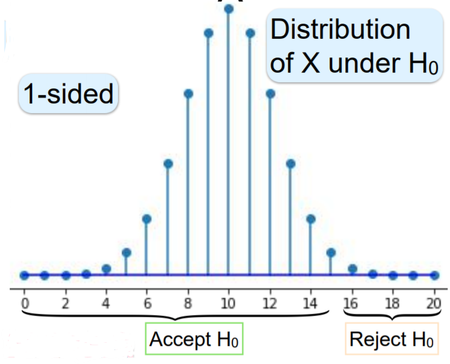
    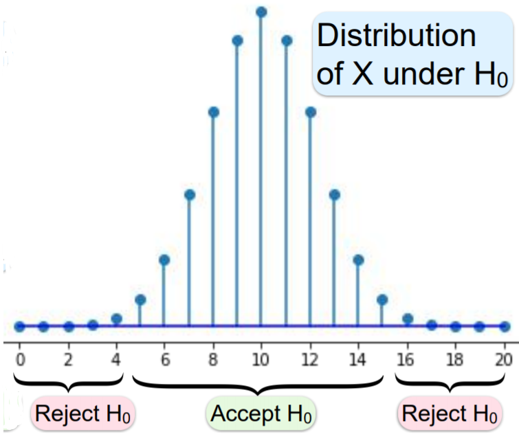
  </a>
  <a href="https://tinyurl.com/y2jyy58c" ismap target="_blank">
     100 is a right-tail test while an alternative hypothesis of the type H1 : μ_X < 100 is a left-tail test." title="Summary of the Different Tests" height=200>
  </a>
</div>

+ [Test statistic](https://tinyurl.com/vkvx9b8)
  + a random variable that is calculated from sample data and used in a hypothesis test
  + determining whether to reject the null hypothesis
  + comparing data with what is expected under the null hypothesis
  + used to calculate the p-value
  + measuring the degree of agreement between a sample of data and the null hypothesis
  + containing information about the data relevant for deciding whether to reject the null hypothesis
  + <font style="color: cyan;">null distribution</font>: the sampling distribution of the test statistic under the null hypothesis
  + When the data show strong evidence against the assumptions in the null hypothesis, the magnitude of the test statistic becomes too large or too small depending on the alternative hypothesis.
  + the test's p-value small enough to reject the null hypothesis
  + Z-statistic
    + the test statistic for a Z-test
    + the standard normal distribution under the null hypothesis
  + Different hypothesis tests using different test statistics based on the probability model assumed in the null hypothesis (hypothesis test $\to$ test statistic)
    + z-test $\to$ z-statistic
    + t-tests $\to$ t-statistic
    + ANOVA $\to$ F-statistic
    + $\chi^2$-tests $\to \chi^2$ statistic

+ Critical value
  + a point on the test distribution compared to the test statistic to determine whether to reject the null hypothesis
  + the absolute value of test statistic is greater than the critical value $\implies$ statistical significance and reject the null hypothesis
  + corresponding to $\alpha$

  <div style="margin: 0.5em; display: flex; justify-content: center; align-items: center; flex-flow: row wrap;">
    <a href="https://tinyurl.com/tq5prhd" ismap target="_blank">
      
      
    </a>
  </div>


+ [Original Slides](https://tinyurl.com/y4k2be2r)


### Problem Sets

0. If we fail to reject the null hypothesis, does it mean that the null hypothesis is correct?<br/>
  a. Yes, it must be correct.<br/>
  b. No, we just don't have enough evidence to reject it.<br/>

  Ans: b


1. The distribution of the test statistic T depends on<br/>
  a. Null hypothesis $H_0$,<br/>
  b. Alternative hypothesis $H_A$,<br/>
  c. Observed data t,<br/>
  d. None of above.<br/>

  Ans: a


2. The null hypothesis says that  Z  follows normal distribution $N(0,\sigma^2)$. If the null hypothesis is correct, which of the following is the most unlikely event?<br/>
  a. $Z \in [−\sigma, \sigma]$<br/>
  b. $Z \notin [−2\sigma,2\sigma]$<br/>
  c. $Z \ge \sigma$<br/>

  Ans: <font style="color: cyan;">b</font><br/>
  Explanation: By the 68-95-99.7 Rule:
    + $\Pr(Z \in [−\sigma,\sigma]) \approx 68\%$
    + $\Pr(Z \notin [−2\sigma,2\sigma]) \approx 100−95=5\%$
    + $\Pr(Z \ge \sigma) \approx (100−68)/2=16\%$,

  hence the second is smallest.


### Lecture Video

<a href="https://tinyurl.com/y3f3np38" target="_BLANK">
  
</a><br/>


## 13.2 Hypothesis Testing - p-Values

### Lecture Notes

+ Example: coin bias
  + $\underbrace{H_0: p_h = 0.5}_{\text{Unbiased}} \quad \underbrace{H_A: p_h > 0.5}_{\substack{\text{Heads more}\\\text{likely}}}$
  + data: 20 trials
  + test statistic: $X$ as the number of heads
  + Type-I error
    + $H_0$: coin unbiased
    + declare $H_A$: heads more likely
  + under $H_0$: $X \sim B_{0.5, 20} \to P_{H_0}$ (see diagram)

  <div style="margin: 0.5em; display: flex; justify-content: center; align-items: center; flex-flow: row wrap;">
    <a href="https://tinyurl.com/y4s4tdt5" ismap target="_blank">
      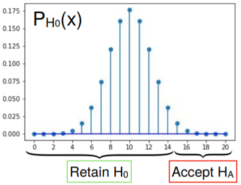
    </a>
  </div>

+ Nomencalture
  + complicated work for terminology, e.g., appropos = appropriate
  + $H_A$ is true, allowed statements
    + reject $H_0$ in favor of $H_A$
    + reject $H_0$
    + <font style="color: cyan;">accept $H_A$</font>
  + $H_0$ is true, allowed statements
    + do not reject $H_0$
    + data not significant
    + $H_0$ plausible
    + <font style="text-decoration: line-through;">accept $H_0$</font>
    + (reluctantly) <font style="color: cyan;">retain $H_0$</font> 
  + why verbal gymnastics? $\to$ test asymmetric
  + example
    + 20 trials w/ $X= 12 \to$ accept $H_0$?
    + what if $p_H$ = 0.6 or 0.55?
    + better explain 12 than $p_h = 0.5$
    + not knowing that $H_0$ is true
    + just not enough data to reject it

+ Significance level
  + reject null (status quo) hypothesis $H_0$ only if strong evidence for alternative $H_A$
  + precise probabilistic formulation
  + $\alpha$: significant level, typically 5%, 1%
  + if $H_0$ is true, accept $H_A$ w/ probability $\le \alpha$ (Type-I error)
  
    \[ P_{H_0}(\text{accept} H_A) \le \alpha \]

  + two methods
    + critical values
    + p-values

+ Critical value
  + hypotheses: $H_0: p_h = 0.5 \quad H_A: p_h > 0.5$
  + sampling data: 20 trials
  + test statistic: $X$ as number of heads
  + $H_0 \to X \approx 10$
  + accept $H_A$ when $X = 16, 17, 18, 19, 20$
  + critical value: $x_\alpha$ as a threshold
    + $X \ge x_\alpha \to$ accept $H_A$
    + $X < x_\alpha \to$ retain $H_0$
  + $x_\alpha \gets$ significance level $\alpha$
  + $\alpha$: upper bound on $P_{H_0}(\text{accept } H_A)$

  <div style="margin: 0.5em; display: flex; justify-content: center; align-items: center; flex-flow: row wrap;">
    <a href="https://tinyurl.com/y4s4tdt5" ismap target="_blank">
      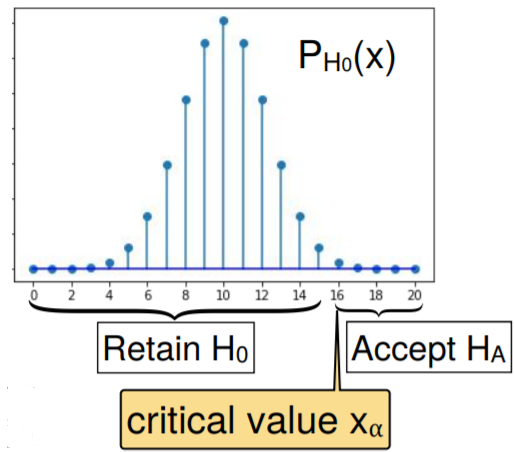
    </a>
  </div>

+ Finding $x_\alpha$
  + hypotheses: $H_0: p_h = 0.5 \quad H_A: p_h > 0.5$
  + sampling data: 20 trials
  + test statistic: $X$ as number of heads
  + critical value $x_\alpha$
    + $X < x_\alpha \to$ retain $H_0$
    + $X \ge x_\alpha \to$ accept $H_A$
  + significance level $\alpha$
    + typical $\alpha = 5\%, 1\%$
    + $P_{H_0} (X \ge x\alpha) = P_{H_0}(\text{falsely accept } H_A) \le \alpha$
  + requirement: $P_{H_0}( X \ge x_\alpha) \le \alpha$
    + $x_\alpha$ large: almost never declare $H_A$
    + smallest $x$ s.t. $P_{H_0}(X \ge x) \le \alpha$

  <div style="margin: 0.5em; display: flex; justify-content: center; align-items: center; flex-flow: row wrap;">
    <a href="https://tinyurl.com/y4s4tdt5" ismap target="_blank">
      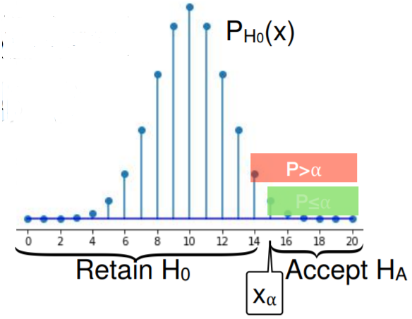
    </a>
  </div>

+ Example: $X_{5\%}$ and $X_{1\%}$
  + hypotheses: $H_0: p_h = 0.5 \quad H_A: p_h > 0.5$
  + sampling data: 20 trials
  + test statistic: $X$ as number of heads
  + significance level: $\alpha = 5\%$
  + critical value: $x_{5\%}$
  + finding smallest $x$ s.t. $P_{H_0}(X \ge x) \le 5\%$

  <div style="margin: 0.5em; display: flex; justify-content: center; align-items: center; flex-flow: row wrap;">
    <a href="https://tinyurl.com/y4s4tdt5" ismap target="_blank">
      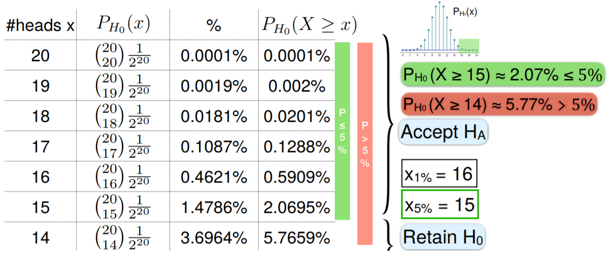
    </a>
  </div>

+ Room for improvement: critical value
  + significance level: $\alpha = 5\%$
  + critical value: $x_\alpha = 15$
  + testing
    + $X < x_\alpha$: retain $H_0$
    + $X \ge x_\alpha$: accept $H_A$
  + practically observe one value $x$ of $X$
  + $X = 13 \to$ retain $H_0$ or accept $H_A$?
    + get around finding smallest $x$ for accepting $H_A$? $\to$ critical value
    + find a rule just for $X$ itself? $\to$ p-value

+ p (probability) value
  + critical value recall
    + $x_{5\%} = 15$
    + finding smallest $x$ s.t. $P_{H_0}(X \ge x) \le 5\%$
    + $X \ge x_{x_{5\%}} \to$ accept $H_A$: $x \ge x_{5\%} \iff P_{H_0}(X \ge x) \le P_{H_0}(X \ge x_{5\%}) \le 5\%$
    + $X < x_{x_{5\%}} \to$ retain $H_0$: $x < x_{5\%} \iff P_{H_0}(X \ge x) > 5\%$
  + p values of $x$
    + accept $H_A$: $P_{H_0}(X \ge x) \le 5\% \to x \ge x_{5\%}$
    + retain $H_0$: $P_{H_0}(X > x) > 5\% \to x < x_{5\%}$
  + same $H_0$ and $H_A$ regions as in critical values
  + intuitively $P$ under $H_0$ small $\to H_A$ more likely

+ Example: 1-sided hypothesis testing
  + hypotheses: $H_0: p_h = 0.5 \quad H_A: p_h > 0.5$
  + sampling data: 20 trials
  + test statistic: $X$ as number of heads
  + significance level: $\alpha = 5\%$
  + critical value testing
    + $x_{5\%} = 15$
    + $X \ge 15 \to H_A$
    + $X < 15 \to H_0$
  + p-value testing
    + $\le 5\%: x \ge x_{5\%} \to $ accept $H_A$
    + $> 5\% : x < x_{5\%} \to$ retain $H_0$
  + p-value of $x$ = Probability $X \ge x$
    + $\le \alpha$: accept $H_A$
    + $> \alpha$: retain $H_0$

  <div style="margin: 0.5em; display: flex; justify-content: center; align-items: center; flex-flow: row wrap;">
    <a href="https://tinyurl.com/y4s4tdt5" ismap target="_blank">
      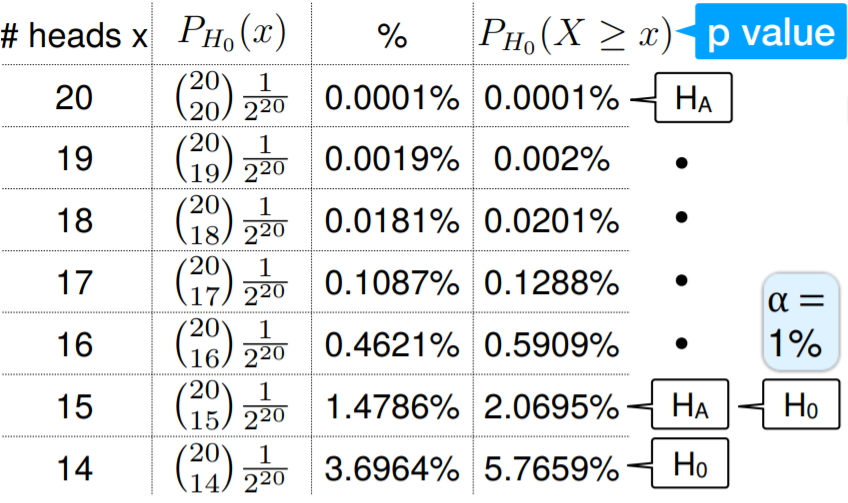
    </a>
  </div>

+ Example: 1-sided hypothesis testing in opposite alternative
  + critical values
    + hypotheses: $H_0: p_h = 0.5 \quad H_A: p_h {\color{Magenta}<}\, 0.5$
    + sampling data: 20 trials
    + test statistic: $X$ as number of heads
    + significance level: $\alpha = 5\% \text{ or } 1\% \to P_{H_0}(\text{falsely accept } H_A) \le \alpha$
    + critical value $x_\alpha$ (refer to diagram in example for p-value)
      + <font style="color: magenta;">largest</font> $x$ s.t. $P_{H_0}(X {\color{magenta}\le}\, x) \le \alpha \xrightarrow{\text{snsures}} P_{H_0}(\text{falsely accept } H_A) \le \alpha$
      + largest $x \to$ left tail
    + $X \le x_\alpha$: accept $H_0$
    + $x > x_\alpha$: retain $H_0$
    + $\alpha = 5\% \xrightarrow{\text{by symmetry}} x_{5\%} = 5$
  + p-value

    <div style="margin: 0.5em; display: flex; justify-content: center; align-items: center; flex-flow: row wrap;">
      <a href="https://tinyurl.com/y4s4tdt5" ismap target="_blank">
        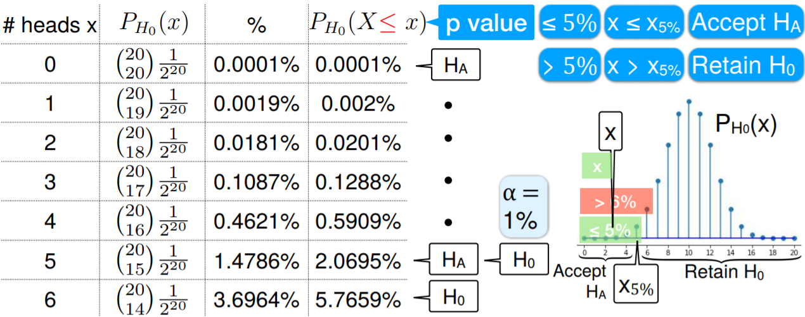
      </a>
    </div>

+ Example: two-sided alternative hypothesis
  + $\underbrace{H_0: p_h = 0.5}_{\text{unbiased}} \quad \underbrace{H_A: p_h {\color{Magenta}\ne}\, 0.5}_{\text{2-sided}}$
  + sampling data: 20 trials
  + test statistic: $X$ as number of heads
  + $H_0$ mean: $\mu_x = 10$
  + probability under the area
    + $H_0$: $X$ close to 10
    + $H_A$: $X$ far from 10
  + $P(|X - 10| > x)$: two far ends
    + small: retain $H_0$
    + large: accept $H_A$

  <div style="margin: 0.5em; display: flex; justify-content: center; align-items: center; flex-flow: row wrap;">
    <a href="https://tinyurl.com/y4s4tdt5" ismap target="_blank">
      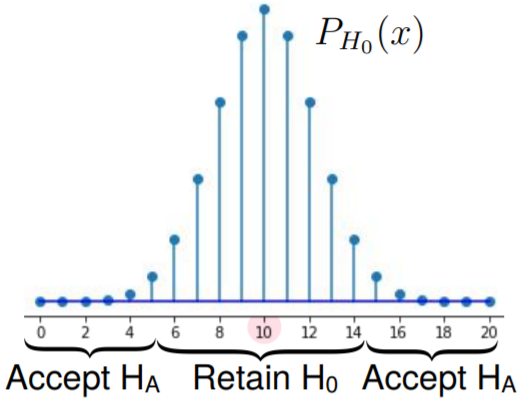
    </a>
  </div>

+ Critical value for 2-sided $H_A$
  + hypotheses: $H_0: p_h = 0.5 \quad H_A: p_h {\color{Magenta}\ne}\, 0.5$
  + sampling data: 20 trials
  + test statistic: $X$ as number of heads
  + significance level $\alpha$
    + upper bound on Type-I error
    + $H_o$ mean: $\mu_x = 10$
  + critical value $x_\alpha$: $x$ close to 10 s.t. $P_{H_0}(|X - 10| \ge |x - 10|) \le \alpha$
  + testing
    + $|X - 10| \ge |x - 10|$: accept $H_A$
    + $|X - 10| < |x - 10|$: retain $H_0$
  
    \[ P_{H_0} (\text{type-I error}) = P_{H_0}(|X - 10| \ge |x_{\alpha} -10|) \le \alpha \]

  + $x_\alpha$ closest to 10 minimizes type-II error

  <div style="margin: 0.5em; display: flex; justify-content: center; align-items: center; flex-flow: row wrap;">
    <a href="https://tinyurl.com/y4s4tdt5" ismap target="_blank">
      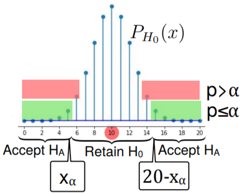
    </a>
  </div>

+ p values for 2-sided $H_A$
  + p value of $x$
    + $P_{H_0}(X \text{ is at least as far from 10 as } x)$
    + $P_{H_0}(|X - 10| \ge |x - 10|)$
  + low p-value
    + $x$ far from mean
    + low $H_0$ prob of outcome $x$ or further towards $H_A$
    + $x$ less likely to be generated under $H_0$
  + higher p-value
    + $x$ far from mean
    + high $H_0$ prob of outcome $x$ or further towards $H_A$
    + $x$ more likely to be generated under $H_0$
  + p-values $\to$ hypothesis

  <div style="margin: 0.5em; display: flex; justify-content: center; align-items: center; flex-flow: row wrap;">
    <a href="https://tinyurl.com/y4s4tdt5" ismap target="_blank">
      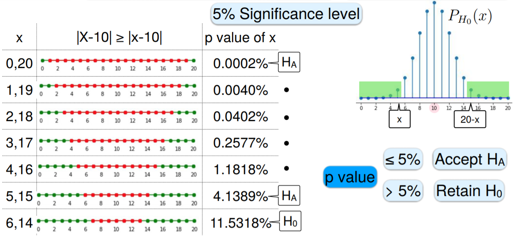
    </a>
  </div>

+ General p-value
  + p value of statistic $t$ of $T$: $P_{H_0}(T \text{ is $t$ or further towards } H_A)$
  + significance level: $\alpha$
  + p-value
    + $\le \alpha$: accep $H_A$
    + $> \alpha$: retain $H_0$


+ [Original Slides](https://tinyurl.com/y4s4tdt5)


### Problem Sets

0. If the statistic T is observed to be t, the p-value is<br/>
  a. The probability that T=t<br/>
  b. The probability under the null hypothesis that T=t<br/>
  c. The probability under the null hypothesis that T=t or is further towards the alternative hypothesis<br/>
  d. None of the above<br/>

  Ans: c


1. One- and two-sided tests

  We know the male students' height is approximately normal, and has standard deviation 4 inches. In a sample of 10 male students, the mean height is 68 inches. Calculate the p value corresponding to the following null hypotheses.

  a) $H_0$: The average height of male students in this college is 70 inches.<br/>
     $H_1$: The average height of male students in this college is not 70 inches.

  b) $H_0$: The average height of male students in this college is at least 70 inches.<br/>
     $H_1$: The average height of male students in this college less than 70 inches.

  Ans: a. (0.1138); b. (0.056923)<br/>
  Explanation: 
    + Since we take a sample of 10 students, the standard deviation of the sample mean is $4/\sqrt{10}$. $P(N(0,4/\sqrt{10}) \le 2)=0.9431$. Hence, $P(|N(0,4/\sqrt{10})|>2)=2(1−0.9431)=0.1138$.
    + $P(N(0,4/\sqrt{10}) \le 2)=0.9431$. Hence, $P(N(0,4/\sqrt{10}) < −2)=(1−0.9431)=0.0569$.


2. The null hypothesis says that 20% of college students are left-handed, while the alternative hypothesis says that less than 20% of college students are left-handed. If we took a sample of 20 college students and let $X$ be the number of lefties in the sample. Calculate the p values if

  a) $X=1$

  b) $X=2$
  
  Ans: a. (0.06918); b(0.2061)<br/>
  Explanation:
    + The p-value is $P(X \le 1) = P(X = 0) + P(X = 1) = 0.069$
    + The p-value is $P(X \le 2) = P(X = 0) + P(X = 1) + P(X = 2) = 0.206$


3. The null hypothesis states that a random variable follows the standard normal distribution, while the alternative hypothesis states that the random variable has negative mean. Which of the following shaded areas represents the  p  value when the observed outcome is  z ?

  <div style="margin: 0.5em; display: flex; justify-content: center; align-items: center; flex-flow: row wrap;">
    <a href="https://tinyurl.com/y3ceuemh" ismap target="_blank">
      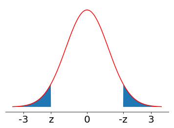
      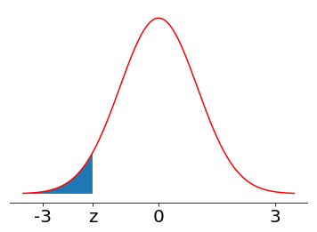
      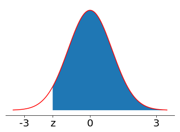
      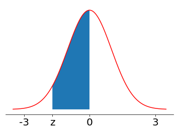
    </a>
  </div>

  Ans: b<br/>
  Explanation: The alternative hypothesis is one-sided. According to definition the p value is $P(X \le z)$.


4. In the following problem we discuss the test comparing two distribution means with the same variance. Assume $X \sim \mathcal{N}(\mu_1, \sigma^2)$, $Y \sim \mathcal{N}(\mu_2, \sigma^2)$, and they are independent.

  a) What is the variance of $X−Y$?<br/>
    a. $\sigma^2$<br/>
    b. $2\sigma^2$<br/>
    c. $\sigma^2/2$<br/>
 
  b) If $\overline{X}$ is the sample mean of $n$ independent random observations of $X$ and  $\overline{Y}$ is the sample mean of $n$ independent random observations of $Y$, what distribution does $\overline{X}-\overline{Y}$ follow?<br/>
    a. $\mathcal{N}(\mu_1-\mu_2,\frac{\sigma^2}{n})$<br/>
    b. $\mathcal{N}(\mu_1-\mu_2,\frac{\sigma^2}{2n})$<br/>
    c. $\mathcal{N}(\mu_1-\mu_2,\frac{2\sigma^2}{n})$<br/>
  
  c) we now want to test the null hypothesis $H_0$

    + $H_0$: In college, the average GPA of men is equal to the average GPA of women.<br/>
    + $H_1$: In college, the average GPA of men is different from the average GPA of women.<br/>

    A sample of 10 men's GPA in college has sample mean 2.9, and a sample of 10 women's GPA has sample mean 3.1. We also know the GPAs of men and women have the same standard deviation 0.2. Calculate the p value.

  Ans: a. (b, xc); b. (c, xb); c. (0.025352, x0.4795-z, x0.00155-t)<br/>
  Explanation:
    + $V(X - Y) = V(X) + V(-Y) = 2\sigma^2$
    + $E(\overline{X} - \overline{Y}) = \mu_1 - \mu_2$, and $V(\overline{X} - \overline{Y}) = V(\overline{X}) + V(-\overline{Y}) = \frac{2\sigma^2}{n}$
    + Let $\overline{X}$ be the men's average GPA, $\overline{Y}$  be the women's average GPA. The p value is $P(|\overline{X}−\overline{Y}| \le |2.9−3.1|)=0.025$. Under the null hypothesis, $\frac{\overline{X} - \overline{Y}}{\sqrt{2\sigma^2 / n}} \sim \mathcal{N} (0, 1)$


### Lecture Video

<a href="https://youtu.be/ccg48X-HMwY" target="_BLANK">
  
</a><br/>


## 13.3 Lady Tasting Tea

### Lecture Notes


+ Proper preparation of milk tea
  + in preparing milk tea: should tea or milk be added first?
  + most say
    + does not matter
    + can't tell the difference
  + Algologist Lay Muiel Bristol
    + adamant: utterly unyielding in attitude or opinion in spite of all appeals, urgings, etc.
    + tea first or it's foul
    + is she right?
    + is she wrong?
    + can she even tell???
  + Statistics Dr. Ronald Fisher
    + $H_0$: Lady cannot tell which of tea or milk was poured first
    + $H_1$: Lady can discern order w/ probability > 0.5
  + Fisher's test
    + 8 cups of tea: 4 tea first, 4 milk first
    + mix them up
    + ask Lady Bristol which 4 are which?

+ Decision & Interpretation
  + Lady knows: 4 tea first, 4 milk first
  + asked for which 4 tea first and which 4 milk first
  + random guesses: 4 right, 4 wrong
  + if she can discern
    + &gt; 4
    + ideally 8
  + calculate probabilities

+ Ever even
  + always guess same number of tea-first and milk-first correctly
    + guess 3 tea-first correctly as tea-first
    + guess 1 tea-first as milk-first
    + guess 3 milk-first as milk-first correctly
    + 3 tea-first $\to$ 3 milk-first
  + never odd number correct
  + always guess same # correctly: $x$ tea-first $\to x$ milk-first
  + always guess even number correctly

+ Probability formulation
  + hypotheses: $H_0: $ Lady randomly chooses 4 tea-first cups
  + probability: $P_{H_0}(x \text{ cups correct }) = ?$
  + Lady chooses 4 tea-first cups: \# ways to make such choices = $\binom{8}{4} = \frac{8!}{4!\cdot 4!} = 70$
  + assume $x = 6$
    + 6 correct $\iff$ 3 tea-first & 3 milk-first correct
    + 6 correct $\iff$ of lady's 4 tea-first choices, 3 tea-first and 1 milk-first
    + \# ways to make such choices: $\binom{4}{3} \cdot \binom{4}{1} = 16$

    \[ P(6 \text{ correct }) = \frac{16}{70} \approx 0.229 \]

+ p-values
  + hypotheses: $H_0:$ Lady guesses randonly $\quad H_A:$ correct w/ prob. > 0.5
  + notation
    + $c$: specific choice
    + $C$: random r.v.
  + test statistic: \# correct guesses
  + p value of $c$:
    + $P_{H_0}(c \text{ or more correct guesses})$
    + $P_{H_0}(C \ge c)$<br/><br/>

  <table style="font-family: arial,helvetica,sans-serif; width: 40vw;" table-layout="auto" cellspacing="0" cellpadding="5" border="1" align="center">
    <thead>
    <tr style="font-size: 1.2em;">
      <th style="text-align: center; background-color: #3d64ff; color: #ffffff; width:10%;">$c$</th>
      <th style="text-align: center; background-color: #3d64ff; color: #ffffff; width:20%;">$P_{H_0}(C = c)$</th>
      <th style="text-align: center; background-color: #3d64ff; color: #ffffff; width:20%;">$P_{H_o}(C \ge c)$</th>
    </tr>
    </thead>
    <tbody>
    <tr>
      <td style="text-align: center;">0</td>
      <td style="text-align: center;">$\binom{4}{0}\binom{4}{4}/70 = 1/70$</td>
      <td style="text-align: center;">$70/70 = 1$</td>
    </tr>
    <tr>
      <td style="text-align: center;">2</td>
      <td style="text-align: center;">$\binom{4}{1}\binom{4}{3}/70 = 16/70$</td>
      <td style="text-align: center;">$69/70 \approx 0.986$</td>
    </tr>
    <tr>
      <td style="text-align: center;">4</td>
      <td style="text-align: center;">$\binom{4}{2}\binom{4}{2}/70 = 36/70$</td>
      <td style="text-align: center;">$53/70 \approx 0.757$</td>
    </tr>
    <tr>
      <td style="text-align: center;">6</td>
      <td style="text-align: center;">$\binom{4}{3}\binom{4}{1}/70 = 16/70$</td>
      <td style="text-align: center;">$17/70 \approx 0.243$</td>
    </tr>
    <tr>
      <td style="text-align: center;">8</td>
      <td style="text-align: center;">$\binom{4}{4}\binom{4}{0}/70 = 1/70$</td>
      <td style="text-align: center;">$1/70 \approx 0.014$</td>
    </tr>
    </tbody>
  </table>

+ p-value $\to$ hypothesis test
  + hypotheses: $H_0: $ Lady guesses randomly $\quad H_A: $ correct w. prob. > 0.5
  + significance level: 5%
    + Prob. type_I error $\le 5\%$
    + $P_{H_0}(\text{accept } H_A) \le 5\%$
  + p value of $c$
    + $P_{H_0}( C \ge c) > 5\%$: outcome likely under $H_0$ $\to$ retain $H_0$
    + $P_{H_0}( C \ge c) \le 5\%$: unlikely under $H_0$ $\to$ accept $H_A$<br/><br/>

    <table style="font-family: arial,helvetica,sans-serif; width: 35vw;" table-layout="auto" cellspacing="0" cellpadding="5" border="1" align="center">
      <thead>
      <tr style="font-size: 1.2em;">
        <th style="text-align: center; background-color: #3d64ff; color: #ffffff; width:10%;">$c$</th>
        <th style="text-align: center; background-color: #3d64ff; color: #ffffff; width:20%;">p-value</th>
        <th style="text-align: center; background-color: #3d64ff; color: #ffffff; width:20%;">$\%$</th>
        <th style="text-align: center; background-color: #3d64ff; color: #ffffff; width:20%;">vs. $5\%$</th>
        <th style="text-align: center; background-color: #3d64ff; color: #ffffff; width:20%;">Hypothesis</th>
      </tr>
      </thead>
      <tbody>
      <tr>
        <td style="text-align: center;">0</td>
        <td style="text-align: center;">70/70</td>
        <td style="text-align: center;">100.</td>
        <td style="text-align: center;">&gt;</td>
        <td style="text-align: center;">$H_0$</td>
      </tr>
      <tr>
        <td style="text-align: center;">2</td>
        <td style="text-align: center;">69/70</td>
        <td style="text-align: center;">98.6</td>
        <td style="text-align: center;">&gt;</td>
        <td style="text-align: center;">$H_0$</td>
      </tr>
      <tr>
        <td style="text-align: center;">4</td>
        <td style="text-align: center;">53/70</td>
        <td style="text-align: center;">75.7</td>
        <td style="text-align: center;">&gt;</td>
        <td style="text-align: center;">$H_0$</td>
      </tr>
      <tr>
        <td style="text-align: center;">6</td>
        <td style="text-align: center;">17/70</td>
        <td style="text-align: center;">24.3</td>
        <td style="text-align: center;">&gt;</td>
        <td style="text-align: center;">$H_0$</td>
      </tr>
      <tr>
        <td style="text-align: center;">8</td>
        <td style="text-align: center;">1/70</td>
        <td style="text-align: center;">1.40</td>
        <td style="text-align: center;">&le;</td>
        <td style="text-align: center;">$H_A$</td>
      </tr>
      </tbody>
    </table>

  + conclusion: need all 8 cups correct to accept $H_A$ w/ 5% significance level


+ [Original Slides](https://tinyurl.com/y4z9wnec)


### Problem Sets

0. If instead of preparing 4 cups milk-first ,and 4 tea-first, each cup is prepared randomly, with equal probability of milk- and tea-first. Which of the following most closely approximates the p value of correctly guessing all 8 milk/tea orders?<br/>
  a. 0.014<br/>
  b. 0.010<br/>
  c. 0.004<br/>
  d. 0.001<br/>

  Ans: <font style="color: cyan;">c</font><br/>
  Explanation: Under the null hypothesis, the distribution of the number of cups the lady guesses correctly is is binomial, and the p value of 8 is (8 choose 0)/(2^8)=1/256, or roughly 0.004.


1. Continuing the poll question, what is the smallest number of milk-tea cups the lady must guess correctly to reject the null hypothesis with significance level $\alpha=5\%$.

  Ans: <font style="color: cyan;">7</font><br/>
  Explanation: The p-value value of 7, namely the probability of guessing 7 or more cups correctly, is $\frac{\binom87+\binom88}{2^8}\approx3.5\%$, which is below  5%. The p-value of 6 cups is  ≈14.4% , which exceeds 5%. Hence the lady must guess at least 7 cups correctly to reject the null hypothesis with significance level  5% .


2. For a real $−1 \le \alpha \le 1$, define $f_\alpha(x)=2\alpha x+1− \alpha$.

  It is easy to see that $f_\alpha$ is non-negative and integrates to 1, namely is a distribution, over $[0,1]$.

  a) Consider the null hypothesis that $\alpha=0$, namely $f_\alpha$ is uniform, and the alternative hypothesis that $\alpha > 0$. Given a single sample, 0.8, from $f_\alpha$, find the  $p$-value.

  b) Find the lowest outcome for rejecting the null hypothesis with 5% significance level.
  
  Ans: a. (0.2); b(0.95); <br/>
  Explanation:
    + Under the null hypothesis, $f_\alpha$  is uniform. The $p$-value is $P_{H_0}(X \ge 0.8) = 1 - 0.8 = 0.2$. [StackExchange](https://tinyurl.com/y35q3wya)
    + To reject the null hypothesis with  5%  significance level, the  p -value should be smaller than  0.05 . Hence the lowest outcome is  0.95 .


3. An old scale displays a weight that is uniformly distributed between the real weight  ±10  lbs. For example for a person with weight 100 lbs, the scale will show a weight uniformly distributed between 90 and 110.

  Consider the null hypothesis that a person weighs 100 lbs, and the alternative hypothesis that the weight is lower.

  a) What is the $p$-value (in percentage) of 91?
  
  b) What is the $p$-value (in percentage) of 90?

  c) What is the highest weight in lbs for which we can reject the null hypothesis with significance level 10%?
  

  Ans: a. (5); b. (0); c(92)<br/>
  Explanation:
    + Under the null hypothesis, the distribution is uniform. The $p$-value is $1 - \frac{91 - 90}{110 - 90} = 0.05 = 5\%$
    + Under the null hypothesis, the distribution is uniform. The $p$-value is $1 - \frac{90 - 90}{110 - 90} = 0$
    + To reject the null hypothesis with 10% significance level, the p-value should be smaller than 0.1. Hence the lowest outcome is 92.


### Lecture Video

<a href="https://tinyurl.com/y3t5o5a4" target="_BLANK">
  
</a><br/>


## 13.4 Hypothesis Testing - Z and T Tests

### Lecture Notes

+ Motivation
  + task: tests for mean
  + knowing $P_{H_0}$ exactly: binomial and related distributions
  + knowing $P_{H_0}$ approximately
    + normal distributions
    + example: sample mean
      + few samples, distributed $\approx$ normal
      + many (&ge; 30) samples, any distribution

+ Central limit theorem - Review
  + r.v.'s: $X_1, X_2, \dots, X_n \;\; {\perp \!\!\!\! \perp} \sim$ any fixed distribution w/ mean $\mu$ and stdev $\sigma$
  + sample mean
    + $\overline{X} = \frac 1 n \left( X_1 + \cdots + X_n \right)$
    + distribution or population parameters: $\mu_{\overline{X}} = \mu \quad var(\overline{X}) = \frac{\sigma^2}{n} \quad \sigma_{\overline{X}} = \frac{\sigma}{\sqrt{n}}$
  + CLT: for large n (&ge; 30) 

    \[ \overline{X} \;\dot\sim\; \mathcal{N}(\mu_{\overline{X}}, \sigma^2_{\overline{X}}) = \mathcal{N}\left(\mu, \frac{\sigma^2}{n}\right) \]

  + transformation: $\overline{X} \;\dot\sim\; \mathcal{N}\left(0, \frac{\sigma^2}{n}\right)$

    \[ Z = \frac{\overline{X} - \mu}{\sigma/\sqrt{n}} \;\dot\sim\; \mathcal{N}(0, 1) \]

+ Typical application of CLT
  + unknown distribution or population w/ known $\sigma$
  + hypotheses: $H_0: \text{ mean } = \mu \quad H_A: \text{ mean } > \mu$
  + testing
    + n independent samples: $X_1, X_2, \dots, X_n$
    + sample mean: $\overline{X} = \frac{1}{n} \sum_{i=1}^n X_i$
    + moderate n (&ge; 30)
      + $H_0: Z = \frac{\overline{X} - \mu}{\sigma/\sqrt{n}} \;\dot\sim\; \mathcal{N}(0, 1)$ w/ mean 0
      + $H_A:$ Normal w/ mean > 0
  

+ z-test
  + hypotheses: $H_0: \mu_Z = 0 \text{ as } Z \;\dot\sim\; \mathcal{N}(0, 1) \quad H_A: \mu_Z > 0$
  + significance level $\alpha$
    + $\alpha = 5\%, 1\%$
    + ensuring $P_{H_o}(\text{accept } H_A) \le \alpha \gets$ (type-I Error)
  + critical value $z_\alpha$ w/ $P(Z \ge z\alpha) = \alpha$
    + right-tailed normal distribution w/ critical value $z_\alpha$ (see diagram)
    + $Z \ge z_\alpha$: accept $H_A$
    + $Z < z_\alpha$: retain $H_0$
  + p-value of $z$: $P_{H_0}(\text{accept } H_A) = P(Z \ge z_\alpha) = \alpha$
    + $P(Z \ge z) \le \alpha: z \ge z_\alpha \to$ accept $H_A$
    + $P(Z \ge z) > \alpha: z < z_\alpha \to$ retain $H_0$
  + computationally $P(Z \ge z) = 1 - \Phi(z)$

  <div style="margin: 0.5em; display: flex; justify-content: center; align-items: center; flex-flow: row wrap;">
    <a href="https://tinyurl.com/yxafyms4" ismap target="_blank">
      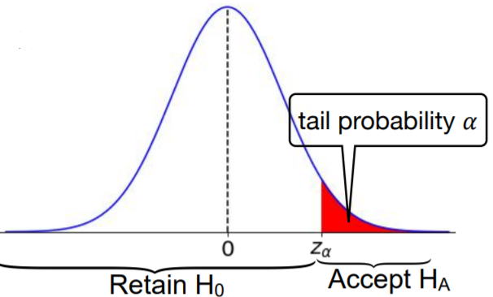
    </a>
  </div>

+ 1-tailed & 2-tailed tests
  + $H_0$ also applied to 
    + $H_0: \text{ mean } \le \mu$ also applied to right-tailed normal distribution
    + $H_0: \text{ mean } \ge \mu$ also applied to left-tailed normal distribution
  + p-value
    + one-tailed (left tail): $P(Z \le z)$
    + one-tailed (right tail): $P(Z \ge z)$
    + 2-tailed: $P(|Z| \ge z)$

  <div style="margin: 0.5em; display: flex; justify-content: center; align-items: center; flex-flow: row wrap;">
    <a href="https://tinyurl.com/y2jyy58c" ismap target="_blank">
       100 is a right-tail test while an alternative hypothesis of the type H1 : μ_X < 100 is a left-tail test." title="Summary of the Different Tests" height=200>
    </a>
  </div>

+ Example: cocoa in chocolate - one-trailed test
  + 100g dark chocolate bar contains 85g cacao
  + suspect less
  + hypotheses: $H_0: \mu = 85 g \quad H_A: \mu < 85 g$
  + significance level: 5%
  + testing
    + sample size: $n = 30$
    + buying 30 bars
    + measuring cocoa in each
    + fact: $\sigma = 0.5g$
  + $n \ge 30 \to \overline{X} \;\dot\sim\; \mathcal{N}(\mu, \frac{\sigma}{\sqrt{n}})$
  + known $\sigma$
  + get the p-value w/ Z-test
  + r.v.'s: $n=30, \;\;X_1, \dots, X_{30} = 84.1, 83.2, 85.7, \dots \to \overline{X} = 84.83$
  + z-score:

    \[ Z = \frac{\overline{X} - \mu}{\sigma/\sqrt{n}} \;\dot\sim\; \mathcal{N}(0, 1) \to Z = \frac{84.83 - 85}{0.5/\sqrt{30}} \approx -1.8623\]

  + p-value: left-tailed z-distribution w/ z = -1.8623

    \[ p\text{-value} = P(Z \le -1.8623) = \Phi(-1.8623) \approx 0.0313 < 5\% \]

  + python implementation

    ```python
    from scipy.stats import norm
    print(norm.cdf(-1.8623))  # 0.0312804077445571
    ```

  + conclusion: accept $H_A$
  + average bar contains < 85 g cocoa
  + same calculation if $H_0: \mu \ge 85 g$
  + statement for p-value &lt; 5%: under $H_0: \mu = 85 g, \sigma = 0.5g$, probability that 30 bars have average &le; 84.83 g is $\approx 3.13\%$. This low probability is < 5% significance level.  We reject $H_0$ and accept $H_A$.

+ Example: two-tailed test
  + hypotheses: $H_0: \mu = 85 g \quad H_A: \mu \ne 85 g$
  + significance level: 5%
  + z-score: $Z = \frac{\overline{X} - \mu}{\sigma/\sqrt{n}} \approx -1.8623$
  + p-value

    \[ p\text{-value} = P(|Z| \ge 1.8623) = 2 \cdot \Phi(-1.8623) \approx 0.0626 > 5% \]

  + conclusion:
    + retain $H_0$
    + retain possibility that on average a chocolate bar contains 85 g cocoa
  + statement for p-value &gt; 5%: under $H_0:  \mu = 85g, \sigma = 0.5g$, the probability that 30 bars have average &le; 84.83 or &ge; 85.17g is $\approx$ 6.26%.  This 'high' probability is > 5% significance level. 'Likely' to happen under $H_0$. Retain $H_0$.
  
+ 1-sided vs. 2-sided alternatives
  + same level and score:
    + significance level = 5%
    + z-score = -1.8623
  + different results:
    + 1-sided $H_A$: accept $H_A$
    + 2-sided $H_A$: retain $H_0$
  + p-value = $P_{H_0}$(observed value or one more towards $H_A$)
    + &le; 5%: accept $H_A$
    + &gt; 5%: retain $H_0$

    <table style="font-family: Arial,Helvetica,sans-serif; width: 44vw;" table-layout="auto" cellspacing="0" cellpadding="5" border="1" align="center">
      <thead>
      <tr style="font-size: 1.2em;">
        <th style="text-align: center; background-color: #3d64ff; color: #ffffff; width:20%;">$H_A$</th>
        <th style="text-align: center; background-color: #3d64ff; color: #ffffff; width:20%;">p-value</th>
        <th style="text-align: center; background-color: #3d64ff; color: #ffffff; width:20%;">$\%$</th>
        <th style="text-align: center; background-color: #3d64ff; color: #ffffff; width:20%;">vs. $5\%$</th>
        <th style="text-align: center; background-color: #3d64ff; color: #ffffff; width:20%;">Prob.</th>
        <th style="text-align: center; background-color: #3d64ff; color: #ffffff; width:20%;">Hypothesis</th>
      </tr>
      </thead>
      <tbody>
      <tr>
        <td style="text-align: center;">one-sided</td>
        <td style="text-align: center;">$P(Z < -1.86)$</td>
        <td style="text-align: center;">3.13%</td>
        <td style="text-align: center;">&lt;</td>
        <td style="text-align: center;">Low</td>
        <td style="text-align: center;">$H_A$</td>
      </tr>
      <tr>
        <td style="text-align: center;">Two-sided</td>
        <td style="text-align: center;">$P(|Z| > 1.86)$</td>
        <td style="text-align: center;">6.26%</td>
        <td style="text-align: center;">&gt;</td>
        <td style="text-align: center;">High</td>
        <td style="text-align: center;">$H_0$</td>
      </tr>
      </tbody>
    </table>

+ Relation to confidence intervals
  + hypothesis testing $\iff$ 95% confidence interval
  + hypothesis testing
    + hypotheses: $H_0: \text{ mean } = \mu \quad H_A: \text{ 2-sided, mean } \ne \mu$
    + z-test: $Z = \frac{\overline{X} - \mu}{\sigma/\sqrt{n}}$
    + significance level: 5%
      + accept $H_A$
      + $|Z| \ge 1.96$
  + 95% confidence interval

    \[ \left( \overline{X} - z_{95\%} \frac{\sigma}{\sqrt{n}}, \overline{X} + z_{95\%} \frac{\sigma}{\sqrt{n}} \right) \]

    + $\mu \notin \text{ confidence interval } \iff 0 \notin (Z - z_{95\%}, Z + z_{95\%}) \iff |Z| \ge 1.96$

  <div style="margin: 0.5em; display: flex; justify-content: center; align-items: center; flex-flow: row wrap;">
    <a href="https://tinyurl.com/yxafyms4" ismap target="_blank">
      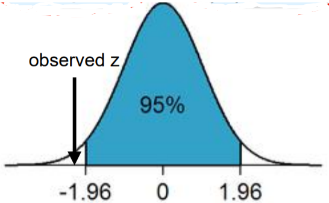
      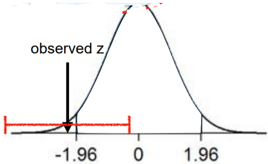
    </a>
  </div>

+ Unknown $\sigma$
  + what if we want to test $\mu$ but don't know $\sigma$?
  + r.v.'s: $X_1, X_2, \dots, X_n \;\; {\perp \!\!\!\! \perp} \sim \mathcal{N}_{\mu. \sigma}$
  + sample mean: $\overline{X} = \frac 1 n (X_1 + \cdots + X_n)$
  + sample variance (Bessel corrected): $s^2 = \frac{1}{n-1} \sum_{i=1}^n \left( X_i - \overline{X} \right)^2$
  + student's t-distribution: $n-1$ degree of freedom

    \[ T_{n-1} = \frac{\overline{X} - \mu}{s/\sqrt{n}} \]

+ t-test
  + test statistic follows t-distribution
  + hypotheses: $H_0: \text{ mean } = \mu$
  + sample: $X_1, \dots, X_n$
    + small n - ok
    + roughly normal? $\to$ normality test
  + test statistic: $T = \frac{\overline{X} - \mu}{s/\sqrt{n}}$
  + under $H_0$:
    + $T \sim f_{n-1}(t)$
    + student's t-distribution w/ $n-1$ DoF
  + calculate p-value for t-distribution

+ Example: ludicrous mode
  + how quickly does a Tesla Model X accelerate from 0 to 60 mph?
  + hypotheses: $H_0: \mu \le 4 \text{ sec. } \quad H_A: \mu > 4 \text{ sec}$
  + significance level: 5%
  + testing
    + 8 measurements
    + assume acceleration time roughly normal
  + $\sigma$ unknown $\to$ t-test
  + samples
    + size: $n=8$
    + values = 3.74, 4.73, 3.85, 3.96, 4.11, 4.30, 4.28, 4.02 sec
  + Python implementation

    ```python
    import numpy as np

    sample = [3.74, 4.73, 3.85, 3.96, 4.11, 4.30, 4.28, 4.02]
    print(np.mean(sample))          # sample mean x_bar = 4.12375
    print(np.var(sample, ddof=1))   # sample variance s^2 = 0.0975696428571
    ```

  + under $H_0$: distribution mean $\mu = 4$
  + t-test statistic:

    \[ T = \frac{\overline{X} - \mu}{s/\sqrt{n}} \approx \frac{4.12375 - 4}{\sqrt{0.097570/8}} \approx 1.1206 \]

    + under $H_0$: $T  \sim f_7(t)$
  + one-tailed probability (right tailed normal)

    \[ p\text{-value} = P_t(X \ge 1.1206) = 1- F_7(t) \approx 0.1497 > 5\% \]

  + p-value > 5%: retain $H_0$
  + python implementation

    ```python
    from scipy.stats import t
    print(1 - t.cdf(1.1206, 7))   # 0.149713065157
    ```

  + conclusion: retain possibility of average 0-60 acceleration in &le; 4 sec
  + statement for p-value &gt; 5%: under the $\mu \le 4$ sec $H_0$, probability of observing at least the 4.124 sec average and $s^2$ we saw, is $\approx 15\%$. Exceeds out 5% significance level. Retain $H_0$.

+ z-test and t-test

  <table style="font-family: Arial,Helvetica,Sans-Serif; width: 40vw;" table-layout="auto" cellspacing="0" cellpadding="5" border="1" align="center">
    <thead>
    <tr style="font-size: 1.2em;">
      <th style="text-align: center; background-color: #3d64ff; color: #ffffff; width:10%;"></th>
      <th style="text-align: center; background-color: #3d64ff; color: #ffffff; width:20%;">z-test</th>
      <th style="text-align: center; background-color: #3d64ff; color: #ffffff; width:20%;">t-test</th>
    </tr>
    </thead>
    <tbody>
    <tr>
      <td style="text-align: center;">stdev $\sigma$</td>
      <td style="text-align: center;">Known</td>
      <td style="text-align: center;">Unknown</td>
    </tr>
    <tr>
      <td style="text-align: center;">test statistic</td>
      <td style="text-align: center;">$Z = \frac{\overline{X}-\mu}{\sigma\sqrt{n}}$</td>
      <td style="text-align: center;">$T = \frac{\overline{X}-\mu}{s\sqrt{n}}$</td>
    </tr>
    </thead>
    <tbody>
    <tr>
      <td style="text-align: center;">typical sample size $n$</td>
      <td style="text-align: center;">any</td>
      <td style="text-align: center;">small</td>
    </tr>
    <tr>
      <td style="text-align: center;">population dist.</td>
      <td style="text-align: center;">$n < 15 \to X \sim \mathcal{N}$<br/>$n > 30 \to X \sim$ any</td>
      <td style="text-align: center;">$\sim \mathcal{N}$</td>
    </tr>
    </thead>
    <tbody>
    <tr>
      <td style="text-align: center;">dist. used for p-value</td>
      <td style="text-align: center;">normal</td>
      <td style="text-align: center;">student-t w/ $n-1$ DOF</td>
    </tr>
    </tbody>
  </table>

  + as sample size $n$ increased: $t \to z$


+ [Original Slides](https://tinyurl.com/yxafyms4)


### Problem Sets

0. We first calculate the p-value of a sample under a t-test. We then receive additional information about the distribution variance and calculate the p-value again under a z-test. Which of the following do you think will happen?<br/>
  a. The p value will increase.<br/>
  b. The p value will decrease.<br/>
  c. It could be both.<br/>

  Ans: c<br/>
  Explanation: suggest answer - it could be either.


1. This is the T-test version of Q5 in section 13.2.

  We now want to test the null hypothesis $H_0$

  + $H_0$: In college, the average GPA of men is equal to the average GPA of women.
  + $H_1$: In college, the average GPA of men is different from the average GPA of women.

  A sample of 10 men's GPA in college has sample mean 2.9, and a sample of 10 women's GPA has sample mean 3.1. We also know the GPAs of men and women have the same  estimated standard deviation  0.2. Calculate the p value.
  
  Ans: 0.03824<br/>
  Explanation: Let $\overline{X}$ be the men's average GPA, $\overline{Y}$ be the women's average GPA. The p value is $P(|\overline{X}−\overline{Y}|| \ge |2.9−3.1|)=0.0382$, where $\frac{\overline{X}−\overline{Y}}{\sqrt{2s^2/n}$ follows a t-distribution with degree of freedom $2n−2$ under the the null hypothesis. [Follow HT4 pooled scenario, using pooled due to $s_1 = s_2$]


2. The null hypothesis says that a sprinter's reaction time follows a normal distribution with mean at most 0.150 seconds. Six measurements of a sprinter's reaction time show 0.152, 0.154, 0.166, 0.147, 0.161, and 0.159 seconds. What is the p value?

  Ans: 0.03361<br/>
  Explanation: The problem is almost the same as the one in slides 16-18, just with numbers changed. The sample mean is $\overline{X}=0.1565$, the sample variance is $s^2=4.67×10−5$, and the sample size $n=6$. The T-Test statistic is $T = \frac{\bar{X} - \mu}{S / \sqrt{n}} = 2.3299$. Hence the p-value is $1−f_{n−1}(t)=0.0336$.


### Lecture Video

<a href="https://tinyurl.com/yyunpawn" target="_BLANK">
  
</a><br/>


## Lecture Notebook 13

+ [Origin Lecture NB](https://tinyurl.com/y4uyntn2)

+ [Local Lecture NB](./src/Topic13_Lecture.ipynb)

+ [Local Python code](src/Topic13_Lecture.py)


## Programming Assignment 13

### Introduction

The [Köppen–Geiger climate classification system](https://tinyurl.com/qxgekbr) is a common climate classification system. It classifies the climate of a region using [3 letters](https://tinyurl.com/yxoddlbu). The first represents the type of climate, the second indicates precipitation, and the third corresponds to temperature. For example, San Diego is classified as Bsh, where the B represents arid climate, s stand for dry summer, and h corresponds to hot. For the 3rd symbol to be h, the annual average temperature should be above 18ºC.

### Dataset

We will use the [hourly weather](https://tinyurl.com/yajzg88h) dataset to consider temperature changes in the city.

Note that the temperatures given in the dataset is in Kelvin. To convert from Kelvin to ºC use [ºC]=[K]-273.15

1. Using hypothesis testing, verify with 5% significance if the city of San Diego should have the 3rd symbol to be h according to the Köppen–Geiger climate classification system using temperature data from the year 2016.<br/>
  a. San Diego may have the 3rd symbol to be h according to the Köppen–Geiger climate classification system<br/>
  b. San Diego should not have the 3rd symbol to be h according to the Köppen–Geiger climate classification system<br/>

  Ans: b <br/>
  Explanation: mean temperature of 2016 is 17.59727


2. report the p-value for the above problem

  Ans: <font style="color: cyan;">8.6e-12</font>
  
  ```python
  import numpy as np
  import pandas as pd
  from scipy.stats import t

  df = pd.read_csv('./temperature.csv')
  df = df[ df['datetime'].str.contains('2016')]
  df = df.loc[:, ['San Diego']]

  temperature = df.values
  temperature = temperature[~np.isnan(temperature)]

  n = len(temperature)
  mu = np.mean(temperature)
  s = np.std(temperature, ddof=1)

  p = t.cdf((mu - 273.15 - 18) / (s / (n ** 0.5)), n - 1)

  print('p-value is {}'.format(p))
  ```


