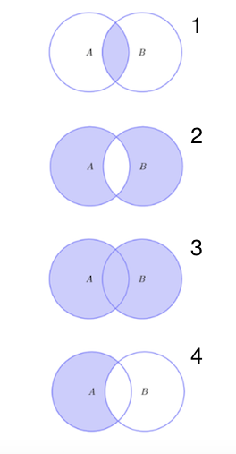
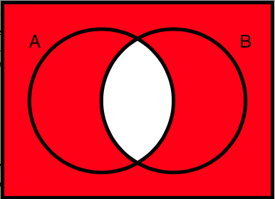
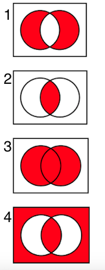

# Topic 1: Introduction to Probability and Statistics

## 1.1 Introduction to Probability and Statistics

1. Which of the following are best solved using probability and statistics? 
  a. Predicting the number of rainy days in April. 
  b. Approximating the closing price of IBM stock tomorrow. 
  c. Estimating your potential winnings in a game of Blackjack. 
  d. Guessing the winner of the next World Cup. 

  Ans:
  

2. What are probability and statistics useful for? 
  a. Quantifying uncertainty. 
  a. Finding exact solutions to mathematical equations. 
  c. Making predictions about the future. 

  Ans: 
  

## 1.2 What is Probability Theory

## 1.3 What is Statistics

0. __If we flip a coin a thousand times and get 507 heads, can we conclude with certainty that the coin is unbiased?__

  Ans: 
  

1. In rolling a fair  6-sided die  1,200  times, roughly how many times would you expect to see a 2 ? 
  a.  200  
  a.  600  
  a.  1,000  
  a. Not enough information is given 

  Ans: 
  

2. __A coin is tossed  1000  times and turns up heads  700  times. Is the coin biased? __
  a. With high confidence, yes. 
  b. Unclear. 

  Ans: 
  

3. Which of the following describe the differences between probability and statistics? 
  a. Probability predicts what will happen. Statistics, at least in part, uses what has already happened. 
  b. Probability requires existing data. Statistics requires underlying models. 
  a. Probability and statistics are two words describing the same thing. 

  Ans: 

## 1.4 A Puzzle

0. Why was the assumption that both players have a 50% chance of winning incorrect? 
  a. We never accounted for a blue side. 
  b. We cannot know the probability until many tests are performed. 
  c. We are more likely to pick a card with the same color on both sides. 
  d. We didn't consider the probability of drawing a card with the same color on both sides. 

  Ans: 
  

1. What is the probability of drawing a Queen from a deck of  52  cards? 
  a. 1/52  
  b. 4/52  
  c. 1/2  
  d. 2/52 

  Ans: 
  

2. If we repeat an experiment many times, the long-term frequencies of the outcomes converge to the probabilities. (True/False)

  Ans: 
  

## 1.5 History of Probability and Statistics

0. Machine learning uses:  
  a. Only Bayesian statistics 
  b. Only the Frequentist approach. 
  c. Both the Bayesian and Frequentist approaches. 

  Ans: 
  

# Topic 2: Sets

## 2.1 Notation

0. The number zero is an element of the empty set. (True.False)

  Ans: 
  

1. a) The empty set $\varnothing$ is unique. 
   b) The universal set $\Omega$ is unique.

  Ans: 
  

2. Which of the following hold? 
  a. $0 \in \{0, 1\}$ 
  b. $a \in \{A, B\}$ 
  c. $\{a, b\} \in \{\{a, b\}, c\}$ 
  d. $a \in \{\{a, b\}, c\}$ 
  e. $\{a\} \in \{a\}$ 

  Ans: 
  

3. Recall that $\varnothing$ is the empty set. How many elements do the following sets have? 
  a. $\varnothing$ 
  b. $\{\varnothing\}$ 
  c. $\{\varnothing, \varnothing\}$ 
  d. $\{\{\varnothing\}, \varnothing\}$ 

  Ans: 
  

4. How many elements do the following sets have? 
  a. $\{a\}$ 
  b. $\{a, a\}$ 
  c. $\{a, \varnothing\}$ 
  d. $\{\{a\}, a\}$ 
  e. $\{\{\{a\}\}\}$ 

  Ans: 
  

5. How many elements do the following sets have? 
  a. $\{a, b\}$ 
  b. $\{\{a, b\}\}$ 
  c. $\{\{a, b\}, \{b, a\}, \{a, b, a\}\}$ 
  d. $\{a, b, \{a, b\}\}$ 

  Ans: 
  

6. Animal anagrams 
  Let $A$ be the set of anagrams of singular English animal names. For example, "nails" and "slain" are anagrams of "snail", so all three $\in A$, yet "bar" $\notin A$.

  Which of the following $\in A$? 
  a. tan 
  b. pea 
  c. low 
  d. bare 
  e. loin 
  f. bolster 

  Ans: 
  

7. Elements of a set 
  List the elements of the following sets.

  Write each element once, using 'emptyset' for $\varnothing$ and 'none' if there are no elements. Separate elements by commas, without any spaces.

  a. $\{a\}$ 
  b. $\{\{a\}\}$ 
  c. $\{a, \{b\}\}$ 
  d. $\{\varnothing\}$ 
  e. $\varnothing$ 

  Ans: 
  

8. Sets from elements 
  Write the sets containing the following elements.

  Enter your answer without any spaces, list every element once, and write emptyset for $\varnothing$.

  a. $a$ 
  b. $a, a$ 
  c. $\{a\}$ 
  d. $\{a, b\}, \{b, a\}$ 
  e. $a,\{b\}$ 
  f. $\varnothing$ 
  g. no elements 

  Ans: 
  

## 2.2 Basic Sets

0. How many elements are there in the real interval [2,4)?  
  a. 1 
  b. 2 
  c. 3 
  d. Infinitely many 

  Ans: 
  

1. Which of the following define a set unambiguously? 
  a. $\{3, 4, 5, 7\}$ 
  b. {negative primes} 
  c. $\{x \in \Bbb{R} \mid x^2 \cdot y > 100\}$ 
  d. {good drivers in San Diego} 

  Ans: 
  

2. Which of the following are true? 
  a. $0 \in $ {Even numbers}  
  b. $0.5 \in \Bbb{N}$ 
  c. $\{-1\} \in \{x \in \Bbb{R}∣x^2 = 1\}$ 
  d. $0.5 \in \{x \in \Bbb{Z} \mid 2x^2 + x - 1 = 0\}$ 
  e. $\varnothing \in \Bbb{Q}$ 

  Ans: 
  

3. Which of the following hold? 
  a. $\{0\}=\varnothing$  
  b. $\{0,1,2\}=\{2,0,1,1\}$  
  c. $\{\{0\},1\}=\{0,\{1\}\}$ 

  Ans: 
  

4. Which of the following are true? 
  a. $e \in \{1,2,…,10\}$ 
  b. $\pi \in (3,3.5)$ 
  c. $2 \in[-2,2)$ 

  Ans: 
  

5. List all the elements of the following sets.

  Note: Represent your answers in ascending order, For example the set {1,-1,0} should be written as -1,0,1 (without whitespace).

  a. $\{x \in \Bbb{Z} \mid -2 \leq x < 5\}$ 
  b. $\{x \in \Bbb{N} \mid x^2+x-2=0\}$ 
  c. $\{x \in \Bbb{R} \mid x^3+x-2=0\} $ 
  
  Ans: 
  

## 2.3 Venn Diagrams

0. The Venn diagram for 2 sets has 4 regions, and for 3 sets there are 8 regions. How many regions are there in a Venn diagram of 4 sets? 
  a. 12 
  b. 14 
  c. 16 
  d. 18 

  Ans: 
  

## 2.4 Relations

0. If S is a proper, or strict, subset of T, then: 
  a. S cannot be empty 
  b. T cannot be empty 
  c. S and T must intersect 

  Ans: 
  

1. Given the expression  m∈A , what can be said? 
  a. $m$ belongs to $A$ 
  b. $A$ is a member of $m$ 
  c. $m$ is an element of the set $A$ 
  d. $m$ is a set of elements 
  e. $A$ contains $m$ 

  Ans: 
  

2. Which of the following is NOT true? 
  a. {red, green, blue} = {blue, red, green} 
  b. {a,b,c,d,e} = {a,a,b,b,c,c,d,d,e,e} 
  c. {1,2,3} ∋ 1 
  d. 2 ∈ {all odd integers} 

  Ans: 
  

3. Which of the following holds? 
  a. {3,4} ⊅ {3,4}  
  b. {3,4} ≠ {3,4}  
  c. {4,3} ⊂ {3,4}  
  d. {3,4} ⊃ {4,3} 

  Ans: 
  

4. Which of the following set pairs are equal? 
  a. $\{x \in \Bbb{R} \mid x^2-4x+3=0\}$ and {3,1,3} 
  b. $\{x \in \Bbb{Q} \mid x^2=10\}$ and $\varnothing$  
  c. {0} and {$\varnothing$} 
  d. { letters in word _little_ }  and  { letters in word _title_ } 

  Ans: 
  

5. If the following Venn Diagram has elements in the red, orange, and yellow regions, the sets R and Y satisfy:

  

    
  

  a. R equals Y 
  b. R intersects Y 
  c. R is contained in Y 
  d. Y is not a subset of R 
  e. R and Y are disjoint 

  Ans: 
  

6. Which of the following are subsets of  A=[2,4)?  
  a. $B = \{x \in \Bbb{R} \mid x+3>6\}$ 
  b. $C = \{2,3,4\}$ 
  c. $D = (2,4)$ 
  d. $E = \varnothing$ 

  Ans: 
  

7. Recall that $\Bbb{P}(S)$ is the collection of all subsets of $S$, and let $\Bbb{Q}(S)$ be the collection of all proper subsets of $S$.

  Which of the following hold for every set $S$? 
  a. $\Bbb{P}(S) \subseteq \Bbb{Q}(S)$ 
  b. $\Bbb{P}(S) \supseteq \Bbb{Q}(S)$ 
  c. $\Bbb{P}(S) \supset \Bbb{Q}(S)$ 
  d. $\Bbb{P}(S) = \Bbb{Q}(S)$ 

  Ans: 
  

8. Which of the following set pairs intersect? 
  a. {1,2,3} and {2,4,6}  
  b. { prime numbers } and { even numbers } 
  c. $\{x \in \Bbb{R} \mid x^2 \leq 4\}$  and  [2,7) 
  d. $\varnothing$ and $\varnothing$  
  e. {$\varnothing$,1,2}  and $\varnothing$ 

  Ans: 
  

## 2.5 Operations

0. If A-B=A for sets A and B, then 
  a. B must be an empty set 
  b. B must be a subset of A 
  c. A and B must intersect 
  d. A and B must be disjoint 

  Ans: 
  

1. If  $\Omega = \{x, y, z\}$ , then $\{x, y\}^c$  is 
  a. $\varnothing$ 
  b. $z$ 
  c. $\{z\}$ 
  d. $\{x, y\}$ 

  Ans: 
  

2. Which of the following equals $G$ for all $\Omega$ and $G$? 
  a. $G - \varnothing$ 
  b. $Ω - G$ 
  c. $Ω - G^c$ 
  d. $G \cap \varnothing$ 

  Ans: 
  

3. (Implying equality) Which of the following imply $A = B$? 
  a. $A^c = B^c$ 
  b. $A \Delta B = \varnothing$ 
  c. $A-B = B-A$ 
  d. $A \cup B = A \cap B$ 

  Ans: 
  

4. Suppose that the following hold for an unknonwn set $C$. Which of the following implies $A=B$, regardless of what $C$ is? 
  a. $A - C = B - C$ 
  b. $A \cap C = B \cap C$ 
  c. $A \cup C = B \cup C$ 
  d. $A \Delta C = B \Delta C$ 

  Ans: 
  

5. Which image identifies the union $A \cup B$?

  

    
  

  Ans: 
  

6. For any two sets $A$ and $B$, add $\subseteq$ or $\supseteq$ to make the following statements true. 
  a. $A \cap B$ `_____` $A$ 
  b. $A \cup B$ `_____` $A$ 
  c. $A -    B$ `_____` $A$ 
  d. $A \cap B$ `_____` $A \cup B$ 
  e. $A -    B$ `_____` $A \Delta B$ 

  Ans: 
  

7. What does the red area in the following Venn Diagram represent?

  

    
  

  a. $(A \cup B) - (A \cap B)$ 
  b. $(A \cap B)^c$ 
  c. $A \cup B$ 
  d. $A \cap B$ 

  Ans: 
  

8. (Venn's view of symmetric difference) Which image shows the symmetric difference between the two circle sets?

  

    
  

  Ans: 
  

9. Let $A \neq \varnothing$. Which of the following is different from the others? 
  a. $A \cup \varnothing$ 
  b. $A \cup A$ 
  c. $A \cap A$ 
  d. $A \cap \varnothing$ 

  Ans: 
  

## 2.6 Cartesian Products

0. Which of the following is NOT in the cartesian product {1,2} x {3,4}? 
  a. (3,1) 
  b. (1,3) 
  c. (1,4) 
  d. (2,4) 

  Ans: 
  

1. Which of the following statements hold? 
  a. $\{1,2\} \subseteq \{1,2\}^2$ 
  b. $\{1,2\} \in \{1,2\}^2$ 
  c. $(1,2) \subseteq \{1,2\}^2$ 
  d. $(1,2) \in \{1,2\}^2$ 

  Ans: 
  

2. Which of the following statements hold for all A? 
  a. $A × \varnothing = \varnothing$ 
  b. $A × \varnothing = A $ 
  c. $A \subseteq A^2 $ 
  d. $A \in A^2 $ 
  e. $A × A^c = \varnothing$ 

  Ans: 
  

3. Which of the following statements hold for all sets A, B and C? 
  a. $A × B = B × A$ 
  b. $A \cap (B × C) = (A \cap B) × (A \cap C)$ 
  c. $A × (B \cap C) = (A × B) \cap (A × C)$ 

  Ans: 
  

4. Add $\subseteq, \supseteq$, or $\in$ in the blanks to make the following statements true. 
  a. $\{(x,y) \mid x^2 + y^2 \leq 1\} \times \{x \mid -1 \leq x \leq 1\}$ `_____` $\{(x,y,z) \mid x^2 + y^2 + z^2 \leq 1\}$ 
  b. $(1,2,3)$ `_____` $\{(x,y) \mid y = 2x\} \times \{x \mid |x| \leq 3 \}$ 
  c. $\{(x,y,z) \mid \max\{|x|,|y|,|z|\} \leq 1\}$ `_____` $\{x \mid -1 \leq x \leq 1\} \times \{(x,y) \mid x^2 + y^2 \leq 1\}$ 

  Ans:
  

## 2.7 Russell's Paradox

0. The set that contains only the empty set is not empty.

  Ans: 
  

# Topic 3: Counting

## 3.1 Counting

0. The Python definition `A = set(range(1,10))` implies that A has size 
  a. 2 
  b. 9 
  c. 10 
  d. 11 

  Ans: 

1. (Perfect squares) A square of an integer, for example, 0, 1, 4 and 9, is called a _perfect square_. How many perfect squares are $\leq 100$?

  Ans: 

2. Which of the following sets are finite? 
  a. Weeks in a year 
  b. Students at UCSD 
  c. Odd primes 
  d. Positive integer divisors of 30 

  Ans: 

3. Which of the following sets are finite? 
  a. $\{ x \in \Bbb{Z} \mid x^2 \leq 10\}$ 
  b. $\{ x \in \Bbb{Z} \mid x^3 \leq 10\}$ 
  c. $\{ x \in \Bbb{N} \mid x^3 \leq 10\}$ 
  d. $\{ x \in \Bbb{R} \mid x^2 \leq 10\}$ 
  e. $\{ x \in \Bbb{R} \mid x^3 = 10\}$ 

  Ans: 

## 3.2 Disjoint Unions

0. We saw that the size of a union of two disjoint sets is the sum of their sizes.

  If the two sets are not necessarily disjoint, then the size of their union is: 

  a. At least the sum of the set sizes 
  b. At most the sum of the set sizes 
  c. Could be smaller, same, or larger than the sum of the set sizes. 

  Ans: 

1. Which of the following are finite for every finite set  A  and an infinite set  B ? 
  a. $A \cap B$ 
  b. $A \cup B$ 
  c. $A - B$ 
  d. $B - A$ 
  e. $A \Delta B$ 

  Ans: 

2. Which of the following pairs A and B satisfy $|A \cup B| = |A| + |B|$? 
  a. $\{1,2\}$ and $\{0,5\}$ 
  b. $\{1,2\}$ and $\{2,3\}$ 
  c. $\{i \in \Bbb{Z} : |i| \leq 3\}$ and $\{i \in \Bbb{Z} : 2 \leq |i| \leq 5\}$ 
  d. {English words starting with the letter 'a'}  and  {English words ending with the letter 'a'} 

  Ans: 

3. $|A \cup B \cup C| = |A| + |B| + |C|$ whenever:

  a. $A$ and $B$ are disjoint and $B$ and $C$ are disjoint, (True/False) 
  b. $A$ and $B$ are disjoint, $B$ and $C$ are disjoint, and $A$ and $C$ are disjoint. (True/False) 

  Ans: 

4. (Non perfect-squares) Recall that a square of an integer, for example, 1, 4 and 9, is called a perfect square. How many integers between 1, and 100, inclusive, are not perfect squares?

  Ans: 

## 3.3 General Unions

0. When does $|A \cup B| = |A| + |B|$? 
  a. When at least one of A and B is empty 
  b. When A and B are disjoint 
  c. Both of the above. 

  Ans: 

1. In a high school graduation exam, 80% of examinees passed the English exam, 85% passed the math exam, and 75% passed both. If 40 examinees failed both subjects, what what the total number of examinees?

  Ans: 
  

2. How many integers in  {1,2,…,100}  do not contain the digit  6 ?

  Ans: 
  

3. Of 100 foreign journalists who can speak Chinese, English or French at a press conference:

  + 60 speak Chinese.
  + 65 speak English.
  + 60 speak French.
  + 35 speak both Chinese and English.
  + 25 speak both Chinese and French.
  + 35 speak both English and French.

  How many journalists speak exactly 
  a. one language 
  b. two languages 
  c. three languages 

  Ans: 
  

4. $|A \cup B|=|A|+|B|$ when 
  a. A and B are disjoint, 
  b. A is the complement of B, 
  c. A and B do not intersect, 
  d. At least one of A and B is empty. 

  Ans: 
  

5. The following equation is incorrect. What needs to be added to make it correct?

  \[ |A \cup B∪C| = |A| + |B| + |C| - |A\cap B| - |A \cap C| - |B \cap C| \]

  a. $-|A \cap B \cap C|$ 
  b. $+|A \cap B \cap C|$ 
  c. $+3|A \cap B \cap C|$ 

  Ans: 

6. In a high school graduation exam 70% of examinees passed the English exam, 76% passed the math exam, and 66% passed both. If 40 examinees failed in both subjects, what is the total number of examinees?

  Ans: 

## 3.4 Cartesian Products

0. Do AxB and BxA have the same size for any sets A and B?

  Ans: 

1. (Finite X infinite) If  A  is finite and  B  is infinite then  A×B  can be: 
  a. empty 
  b. nonempty finite 
  c. infinite 

  Ans: 

2. (Order matters) Which of the following ensures that $A \times B = B \times A$? 
  a. $A = B$ 
  b. $A = \varnothing$ 
  c. $B = \varnothing$ 
  d. $A \cap B = \varnothing$ 
  e. $|A| = |B|$ 

  Ans: 

3. (Cartesian product shape) Taking the geometric view of Cartesian products, if A and B are real intervals of positive length in $\Bbb{R}$, then A×B is a: 
  a. line, 
  b. rectangle, 
  c. circle, 
  d. triangle, 
  e. none of above. 

  Ans: 

4. (Divisors) How many positive divisors does 2016 have?

  Ans: 

## 3.5 Cartesian Powers

0. The set {000, 001, ....,111} of all 3-bit strings has the following number of subsets: 
  a. $2^3$ 
  b. $2^6$ 
  c. $2^8$ 
  d. $2^9$ 

  Ans: 

1. Rank the functions \(n^2\), \(2^n\), \(n\) from slow to fast in terms of their growth rate as \(n\) increases. 
  a. \(n\), \(2^n\), \(n^2\) 
  b. \(n\), \(n^2\), \(2^n\) 
  c. \(2^n\), \(n\), \(n^2\) 
  d. \(2^n\), \(n^2\), \(n\) 

  Ans: 

2. Find the number of 7-character (capital letter or digit) license plates possible if: 
  a. there are no further restrictions,  
  b. the first 3 characters are letters and the last 4 are numbers, 
  c. letters and numbers alternate, for example A3B5A7Q or 0Z3Q4Q9. 

  Ans: 

3. If $P$ and $Q$ are sets, then $|P|^{|Q|}$ is the number of functions 
  a. from $P$ to $Q$, 
  b. from $Q$ to $P$. 

  Ans: 

4. Recall that the power set $\Bbb{P}(S)$ of a set $S$ is the collection of all subsets of $S$.

  For $A  = \{1,2,3\}$ and $B=\{x,y\}$, calculate the following cardinalities. 
  a. $|\Bbb{P}(A)|$ 
  b. $|\Bbb{P}(B)|$ 
  c. $|A \times B^2|$ 
  d. $|\Bbb{P}(A \times B)|$ 
  e. $|\Bbb{P}(A) \times B|$ 
  f. $|\Bbb{P}(\Bbb{P}(A))|$ 

  Ans: 

5. Let $G = \{0,2,4,6,8\}$. What is $|G^4|$? 
  a. $5^4$ 
  b. $4^5$ 
  c. $5 \times 4 \times 3 \times 2 \times 1  
  d. $0 + 2 + 4 + 6 + 8 

  Ans: 

6. Let A be a set with size 5. How many proper subsets does A have?

  Ans: 

7. How many subsets of $\{1,2,…,9\}$  
  a. are there, 
  b. contain '1', 
  c. have $\geq 5$  elements, 
  d. have no odd elements, 

  Ans: 

## 3.6 Variations

0. Sam tries to find how many 2-letter sequences do not include the letter Q, for example BR or ZZ, but not BQ, or QQ.
  
  First, Sam calculates the total number of 2-letter sequences, allowing all letters, as 26*26=676.
  
  Then Sam calculates the number of disallowed sequences:
  
  There are 26 sequences where a Q is the first letter (e.g. QS), and 26 where Q is the second letter (e.g. BQ).
  
  The total number of disallowed sequences is therefore 26+26=52. Subtracting 52 from 676, Sam deduces that there are 624 two-letter sequences without Q.
  
  Where did Sam go wrong?

  a. Made a multiplication error. 
  b. Made a subtraction error 
  c. Subtracted the sequence QQ from the total twice. 
  d. Nothing, Sam is correct. 

  Ans: 

1. An $n$-variable Boolean function maps $\{0,1\}^n$  to $\{0,1\}$. How many 4-variable Boolean functions are there? 
  a. 16  
  b. 256  
  c. 65,536 

  Ans: 

2. A word that reads the same from left to right and right to left is a palindrome. For example, "I", "noon" and "racecar" are palindromes. In this question, we consider palindromic integers such as 101 and 66. Note that the first digit of an integer cannot be 0.

  How many positive 5-digit integer palindromes 
  a. are there? 
  b. are even, for example 29192? 
  c. contain 7 or 8, for example 27172 or 38783? 

  Ans: 

3. How many $5$-digit ternary strings are there without $4$ consecutive $0$s, $1$s or $2$s?

  For example,  01210  and  11211  are counted, but  20000 ,  11112 , and  22222  are excluded.

  Ans: 

4. A password consists of four or five characters, each an upper-case letter, a lower-case letter, or a digit. How many passwords are there if each of the three character types must appear at least once?

  Ans: 

5. In the US, telephone numbers are 7-digit long. While real phone numbers have some restrictions, for example, they cannot start with 0 or 1, here we assume that all 7-digit sequences are possible, even 0000000.

  How many phone numbers: 
  a. start or end with two identical digits, for example 0012345, 1234511, or 2222222, 
  b. contain a substring of $5$ consecutive digits. For example 0034567, 2567892, or 0123456. 

  Ans: 

6. How many ordered pairs $(A,B)$, where $A$, $B$ are subsets of $\{1,2,3,4,5\}$ have: 
  a. $A \cap B= \varnothing$ 
  b. $A \cap B=\{1\}$ 
  c. $|A \cap B|=1$ 

  Ans: 

7. How many ordered pairs $(A,B)$, where $A$, $B$ are subsets of $\{1,2,3,4,5\}$, are there if: 
  a. $A \cup B = \{1,2,3,4,5\}$ 
  b. $|A \cup B| = 4$ 

  Ans: 

## 3.7 Trees

0. The NBA Finals is a best-of-seven game series. The first team to win four games, wins the championship.

  For simplicity, consider a smaller series of just five games. The first team to win three games wins the championship. If the teams are named A and B, then AAA, ABBB, and BABAB are three possible win sequences, as one team won three games. What is the total number of possible win sequences ? 
  a. 10 
  b. 20 
  c. 30 
  d. None of the above 

  Ans: 

# Topic 4: Combinatorics

## 4.1 Permutations

0. How many permutations does the set {1,2,3,4} have? 
  a. 9 
  b. 18 
  c. 24 
  d. 36 

  Ans: 

1. 0! =  
  a. 0 
  b. 1 
  c. $\infty$ 
  d. undefined 

  Ans: 

2. Which of the following are true for all $n,m \in \Bbb{N}$ and $n \geq 1$. 
  a. $n! = n \cdot (n−1)! $ 
  b. $(n⋅m)! = n! \cdot m! $ 
  c. $(n+m)! = n! + m! $ 
  d. $(nm)! = (n!)^m$ 

  Ans: 

3. In how many ways can 11 soccer players form a line before a game? 
  a. $11$ 
  b. $11^2$ 
  c. $11!$ 
  d. None of the above 

  Ans: 

4. In how many ways can 8 identical rooks be placed on an 8×8 chessboard so that none can capture any other, namely no row and no column contains more than one rook?

  Ans: 

5. In how many ways can 8 distinguishable rooks be placed on an 8×8 chessboard so that none can capture any other, namely no row and no column contains more than one rook?

  For example, in a 2×2 chessboard, you can place 2 rooks labeled 'a' and 'b' in 4 ways. There are 4 locations to place 'a', and that location determines the location of 'b'.

  Ans: 
  

6. In how many ways can 7 men and 7 women can sit around a table so that men and women alternate. Assume that all rotations of a configuration are identical hence counted as just one.

  Ans: 
  

7. In how many ways can three couples be seated in a row so that each couple sits together (namely next to each other): 
  a. in a row, 
  b. in a circle? 

  Ans: 
  

## 4.2 Partial Permutations

0. How many 2-permutations do we have for set {1,2,3,4}? 
  a. 8 
  b. 12 
  c. 16 

  Ans: 

1. In how many ways can 5 cars - a BMW, a Chevy, a Fiat, a Honda, and a Kia - park in 8 parking spots?

  Ans: 
  

2. In how many ways can 5 people sit in 8 numbered chairs?

  Ans: 
  

3. Find the number of 7-character (capital letter or digit) license plates possible if no character can repeat and: 
  a. there are no further restrictions,  
  b. the first 3 characters are letters and the last 4 are numbers, 
  c. letters and numbers alternate, for example A3B9D7Q or 0Z3Q4A9. 

  Ans: 
  

4. A derangement is a permutation of the elements such that none appear in its original position. For example, the only derangements of {1,2,3} are {2,3,1} and {3,1,2}. How many derangements does {1,2,3,4} have?

  Ans: 
  

5. Eight books are placed on a shelf. Three of them form a 3-volume series, two form a 2-volume series, and 3 stand on their own. In how many ways can the eight books be arranged so that the books in the 3-volume series are placed together according to their correct order, and so are the books in the 2-volume series? Noted that there is only one correct order for each series.

  Ans: 
  

## 4.3 Combinations

0. Which of the following is larger for $k \leq n$? 
  a. The number of k-permutations of an n-set 
  b. The number of k-subsets of an n-set 

  Ans: 
  

1. In how many ways can a basketball coach select 5 starting players form a team of 15? 
  a. $\frac{15!}{5!10!}$ 
  b. $\frac{15!}{10!}$ 
  c. $\frac{15!}{5!}$ 
  d. None of the above 

  Ans: 
  

2. 
  1) In how many ways can you select a group of 2 people out of 5? 
    a. 10 
    b. 25 
    c. 125 
    d. None of the above 
  
  2) In how many ways can you select a group of 3 people out of 5? 
    a. 10 
    b. 25 
    c. 125 
    d. None of the above 

  3) In how many ways can you divide 5 people into two groups, where the first group has 2 people and the second has 3? 
    a. 10 
    b. 25 
    c. 125 
    d. None of the above 

  Ans: 
  

  
3. Ten points are placed on a plane, with no three on the same line. Find the number of: 
  a. lines connecting two of the points, 
  b. these lines that do not pass through two specific points (say  A  or  B ), 
  c. triangles formed by three of the points, 
  d. these triangles that contain a given point (say point  A ), 
  e. these triangles contain the side  AB . 

  Ans: 

4. The set {1,2,3} contains 6 nonempty intervals: {1}, {2}, {3}, {1,2}, {2,3}, and {1,3}.

  How many nonempty intervals does  {1,2,…,10}  contain?

  Ans: 
  

5. A rectangle in an m×n chessboard is a Cartesian product S×T, where S and T are nonempty intervals in {1,…,m} and {1,2,…,n} respectively. How many rectangles does the 3×6 chessboard have?

  Ans: 
  

6. A standard 52-card deck consists of 4 suits and 13 ranks. Find the number of 5-card hands where: 
  a. any hand is allowed (namely the number of different hands),  
  b. all five cards are of same suit, 
  c. all four suits are present, 
  d. all cards are of distinct ranks. 

  Ans: 
  

7. A company employs 4 men and 3 women. How many teams of three employees have at most one woman? 
  a. 21 
  b. 22 
  c. 23 
  d. 24 

  Ans: 
  

8. A (tiny) library has 5 history texts, 3 sociology texts, 6 anthropology texts and 4 psychology texts. Find the number of ways a student can choose: 
  a. one of the texts, 
  b. two of the texts, 
  c. one history text and one other type of text, 
  d. one of each type of text, 
  e. two of the texts with different types. 

  Ans: 

  

9. In how many ways can 7 distinct red balls and 5 distinct blue balls be placed in a row such that 
  a. all red balls are adjacent, 
  b. all blue balls are adjacent, 
  c. no two blue balls are adjacent. 

  Ans: 
  

10. For the set {1,2,3,4,5,6,7} find the number of: 
  a. subsets, 
  b. 3-subsets, 
  c. 3-subsets containing the number 1, 
  d. 3-subsets not containing the number 1. 

  Ans: 
  

11. A function $f:X \to Y$ is _injective_ or one-to-one if different elements in $X$ map to different elements in $Y$, namely,

  \[ \forall\, x \neq x^\prime \in X,\, f(x) \neq f(x^\prime).  \]

  A function $f:X \to Y$ is _surjective_ or onto if all elements in $Y$ are images of at least one element of $X$, namely,
  
  \[ \forall\, y \in Y, \exists\, x \in X,\, f(x)=y. \]

  For sets A={1,2,3} and B={a,b,c,d}, find the number of

  a. functions from $A$ to $B$, 
  b. functions from $B$ to $A$, 
  c. one-to-one functions from $A$ to $B$, 
  d. onto functions from $B$ to $A$. 

  Ans: 
  
  

## 4.4 Applications of Binomial Coefficients

0. You school offers 6 science classes and 5 art classes. How many schedules can you form with 2 science and 2 art classes if order doesn't matter. 
  a. 25 
  b. 55 
  c. 60 
  d. 150 

  Ans: 
  

1. How many ordered pairs $(A,B)$, where $A$, $B$ are subsets of $\{1,2,3,4,5\}$, are there if: $|A|+|B|=4$

  Ans: 
  

2. In the video (slide 6, minute 4:04), we discussed the number of non-decreasing grid-paths from $(0,0)$ to $(6,4)$.

  How many of these paths go through the point $(2,2)$?

  Ans: 
  
  

## 4.5 Properties of Binomial Coefficient

0. For a positive integer n, n choose (n-1) equals to 
  a. 1 
  b. n-1 
  c. n 
  d. n+1 

  Ans: 

1. A deck  $n \geq 5$ cards has as many 5-card hands as 2-card hands. What is $n$?

  Ans: 
  

2. If $\binom{n+2}{5} = 12 \cdot \binom{n}{3}$, find $n$.

  And: 
  

3. Which of the following is the expansion of $(x+y)^3$? 
  a. $x^3+y^3$ 
  b. $x^3+x^2y+xy^2+y^3$ 
  c. $x^3+6xy+y^3$ 
  d. $x^3+3x^2y+3xy^2+y^3$ 

  Ans: 

## 4.6 Pascal Triangle and Binomial Theorem

0. What is the coefficient of $x^2$ in the expansion of $(x+2)^4$? 
  a. 12 
  b. 24 
  c. 48 
  d. None of the above 

  Ans: 

1. a. What is the coefficient of $x^4$  in the expansion of $(2x−1)^7$?
 
   b. What is the constant term in the expansion of $(x−\frac{2}{x})^6$?

  Ans: 

2. What is the coefficient of $x^2$ in the expansion of $(x+2)^4(x+3)^5$?

  Ans: 
  

3. In an earlier section, we solved this question by mapping the sets  A  and  B  to ternary sequences. In this section, we ask you to solve it using the binomial theorem.

  How many ordered pairs $(A,B)$, where $A$, $B$ are subsets of $\{1,2,3,4,5\}$ have:

  a. $A \cap B = \varnothing$ 
  b. $A \cup B = \{1,2,3,4,5\}$ 

  Ans: 
  

4. Which of the followings are equal? 
  a. $\tbinom{10}{4}$ 
  b. $\tbinom{10}{5}$ 
  c. $\tbinom{10}{6}$ 
  d. $\tbinom{9}{5}+\tbinom{9}{6}$ 

  Ans: 

## 4.7 Multinomials

0. What is the coefficient of xy in the expansion of $(x+y+2)^4$? 
  a. 12 
  b. 24 
  c. 48 
  d. None of the above 

  Ans: 
  

1. In how many ways can you give three baseball tickets, three soccer tickets, and three opera tickets, all general admission, to nine friend so each gets one ticket?

  Ans: 
  

2. How many ways can we divide 12 people into: 
  a. three labeled groups evenly 
  b. three unlabeled groups evenly 
  c. three labeled groups with 3, 4 and 5 people 
  d. three unlabeled groups with 3, 4 and 5 people 
  e. three unlabeled groups with 3, 3 and 6 people 

  Ans: 
  

3. a. What is the coefficient of $x^3y^2$ in expansion of $(x+2y+1)^{10}$? 
   b. What is the coefficient of $x^3$ in expansion of $(x^2−x+2)^{10}$? 

  Ans: 
  

4. How many terms are there in the expansion of $(x+y+z)^{10} + (x−y+z)^{10}$?

  Ans: 
  

5. How many anagrams, with or without meaning, does "REFEREE" have such that: 
  a. there is no constraint 
  b. two "R"'s are separated 
  c. it contains subword “EE” 
  d. it begins with letter “R” 

  Ans:
  

6. How many anagrams, with or without meaning, do the following words have? 
  a. CHAIR 
  b. INDIA 
  c. SWIMMING 

  Ans:

## 4.8 Stars and Bars

0. In how many different ways can you write 11 as a sum of 3 positive integers if order matters? 
  a. 28 
  b. 36 
  c. 45 
  d. None of the above 

  Ans: 
  

1. If $a+b+c+d=10$, how many ordered integer solutions $(a,b,c,d)$ are there, when all elements are 
  a. non-negative, 
  b. positive? 

  Ans: 
  
  
2. In how many ways can we place 10 identical red balls and 10 identical blue balls into 4 distinct urns if: 
  a. there are no constraints, 
  b. the first urn has at least  1  red ball and at least  2  blue balls, 
  c. each urn has at least 1 ball? 

  Ans: 
  

3. How many 6-digit sequences are: 
  a. strictly ascending, as 024579 or 135789, but not 011234, 
  b. ascending (not necessarily strictly), as 023689, 033588, or 222222. 

  Ans: 
  

4. How many terms are there in the expansion of $(x+y+z)^{10}$?

  Ans: 
  

