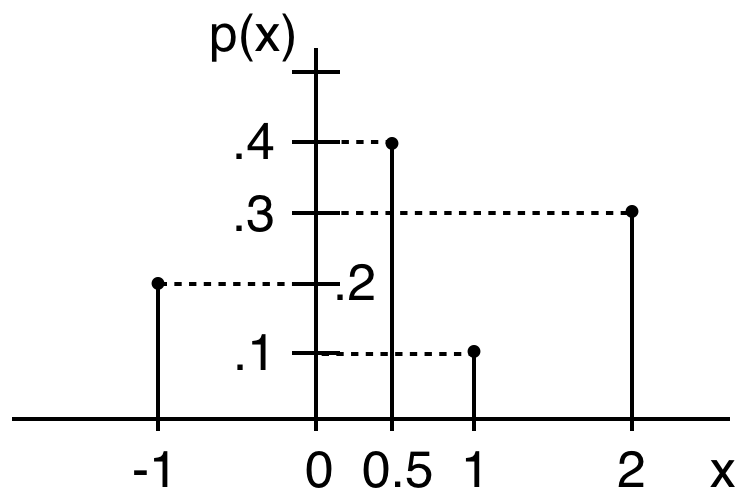
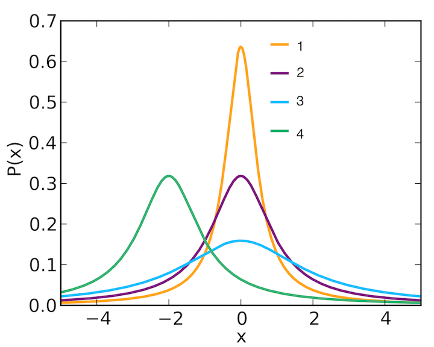

# Topic 5: Probability Introduction

## 5.1 Probability

0. Which of the following outcomes are random (not certain) when rolling a six-sided dice? 
  a. A real number. 
  b. An even number. 
  c. A positive number. 

  Ans: 
  

1. Which of the following outcomes are random (not certain) after throwing a six-sided dice? 
  a. Get number  3  
  b. Get an even number 
  c. Get a positive number 

  Ans: 
  

2. Imagine a single experiment where we flip a coin 6 times, and get “head, tail, head, head, head, head”.

  Which of the following statements hold?

  a. The coin is not fair. 
  b. The coin's "tail" probability is 1/6. 
  c. The sequence "head, tail, head, head, head, head" is an outcome in the sample space. 
  d. The sample space of the experiment is {head, tail}. 

  Ans: 

## 5.2 Distribution Types

0. An outcome in a uniform probability space has probability 1/10, what is the size of the sample space? 
  a. 5 
  b. 10 
  c. 20 
  d. None of the above 

  Ans: 

1. Which of the following sample spaces are uniform? 
  a. {land,sea} for a randomly point on a globe 
  b. {odd, even} for a random integer from {1,2,. . . ,100} 
  c. {leap year, non-leap year} for a random year before 2019 
  d. {two heads, two tails, one head and one tail} when flipping two fair coins 
  e. {distance to origin} for a random point in {−3, −1, 1, 3} × {−4, −2, 2, 4} 

  Ans: 

2. Given an uniform probability space $\Omega = \{1,2,3, \dots ,100\}$, what is the probability that the outcome contains the digit 1 (e.g. 19,91)?

  Ans: 

## 5.3 Events

0. What is the probability of drawing a Red Ace from a standard deck of cards? 
  a. 1/52 
  b. 2/52 
  c. 4/52 
  d. None of the above 

  Ans: 

1. Which of the following holds for every event A? 
  a. $P(A) \geq 0$ 
  b. $P(A) \leq1$ 
  c. $P(A)+P(A^c)=1$ 
  d. $P(A)=P(A^c)$ 
  e. $A=\varnothing \implies P(A)=0$ 
  f. $P(A)=0 \implies A=\varnothing$ 
  
  Ans: 

2. Which of the following always hold for events  A  and  B ? 
  a. $A \subseteq B \implies P(A) \leq P(B)$ 
  b. $P(A) \leq P(B) \implies A \subseteq B$ 

  Ans: 

3. Which of the following implies  P(S−T)=P(S)−P(T)  for events  S  and  T ? 
  a. $T \subseteq S$ 
  b. $T \subset S$ 
  c. $S = T$ 
  d. $S \subseteq T$ 

  Ans: 

4. 50% of UCSD students play soccer, 40% play basketball, and 30% play both. What is the probability that a random UCSD student does not play any of the two games. 
  a. 0 
  b. 0.1 
  c. 0.4 
  d. 0.6 

  Ans: 

5. Which of the following are events in the sample space $\Omega = \{1,2,3,4,5\}$? 
  a. $\{1,2,3\}$ 
  b. $\varnothing$ 
  c. $\Omega$ 
  d. $\{1\}$ 
  e. $\{0,3,4\}$ 

  Ans: 

6. For the uniform space  {1,2,…,10} , find: 
  a. $P(\{\text{primes}\})$, 
  b. $P(\{\text{multiples of 3}\})$. 

  Ans: 

7. A bag contains 5 red and 3 blue balls. 
  a. Pick one ball at random and observe its random color. What is the size of the color sample space. 
  b. What is P(blue)? 
  c. Two balls added to the bag and now P(blue)=0.4. How many of the two balls are blue? 
  d. Two balls are removed from the original bag and now P(blue)=0.5. How many of the two balls were blue? 

  Ans: 

8. Six balls are numbered 1, 2, 3, 4, 5, and 6. What is the chance that the numbers on three balls, picked simultaneously and randomly, will sum to a multiple of 3? 
  a. 1/3 
  b. 1/4 
  c. 2/5 
  d. 4/15 

  Ans: 

9. A standard poker deck has 52 cards, of 13 ranks $\{A,2, \dots ,10,J,Q,K\}$  and 4 suits $\{diamonds,clubs,hearts,spades\}$. What is the probability that a hand of five cards contains:
  a. a queen of hearts,
  b. at least one queen,
  c. at least one heart?

  Ans: 

## 5.4 Repeated Experiments

0. Which of the following are independent repetitive experiments? 
  a. card draws with replacement 
  b. card draws without replacement 
  c. neither 

  Ans: 

1. You have two fair coins. If you flip a head with the first coin, what is the probability of flipping a head with the second? 
  a. \(1\) 
  b. \(0\) 
  c. \(\frac{1}{2}\) 
  d. \(\frac{1}{4}\) 

  Ans: 

2. A bag has 3 red and 3 green apples. You start by randomly selecting one red apple from the bag. Which of the following has the highest probability? 
  a. Select another red apple after replacing the first. 
  b. Select another red apple without replacing the first. 
  c. Select a green apple after replacing the first red apple. 
  d. Select a green apple without replacing the first red apple. 

  Ans: 

3. Roll two fair and distinguishable six-sided dice. What is the probability that the outcome of the second die is strictly greater than the the first?

  Ans: 

4. 5 Engineers and 3 artists align at random along line. What is the probability that the first and last are Engineers? 
  a. 3/14 
  b. 8/16 
  c. 9/14 
  d. 5/14 

  Ans: 

5. Which of the following are distributed uniformly when rolling two fair dice? 
  a. The outcome (number) of the first die, e.g., "4", or "6", 
  b. The ordered pair of outcomes, e.g., \((1,3)\), \((3,1)\), or \((6,6)\), 
  c. The unordered pair of outcomes, e.g., \(\{1,3\}\) or \(\{6,6\}\), 
  d. the difference between the first and second outcomes, e.g. \((1,3)\to-2\), 
  e. the difference between the first and second outcomes mod 6, e.g. \((1,3)\to(-2)_6=4\), 
  f. The absolute value of difference\((1,3)\to|1-3|=2\), 
  g. The lower of the two outcomes, e.g. \((1,3)\to1\), 
  h. the sum of the two outcomes, e.g. \((1,3)\to4\). 

  Ans: 

## 5.5 Games of Chance

0. What is the probability that two cards drawn from a standard deck without replacement have the same rank? 
  a. 1/13 
  b. 1/17 
  c. 2/52 
  d. None of the above 

  Ans: 

1. What is the probability that a random four-card hand consists of a single suit? 
  a. $\frac{4}{52}$ 
  b. $\frac{13}{52}$ 
  c. $\tbinom{13}{4}/\tbinom{52}{4}$ 
  d. $\tbinom{4}{1}⋅\tbinom{13}{4}/(\tbinom{52}{4}$ 

  Ans: 
  

2. Find the probability that a five-card hand contains: 
  a. the ace of diamonds, 
  b. at least an ace, 
  c. at least a diamond. 

  Ans: 

3. Five cards are dealt from a poker deck. What is the probability of: 
  a. three-of-a-kind (three cards of one rank and two cards of two other ranks), 
  b. two pairs (two pairs of same-rank cards), 
  c. one pair (a pair of same-rank cards, and three cards of three different ranks). 

  Ans: 

4. A 52-card deck is randomly split into four 13-card hands. Find the probability that: 
  a. each hand has an ace,  
  b. one hand has all four aces. 

  Ans: a

5. Assume that in blackjack, an ace is always worth 11, all face cards (Jack, Queen, King) are worth 10, and all number cards are worth the number they show. Given a shuffled deck of 52 cards: 
  a. What is the probability that you draw 2 cards and they sum 21? 
  b. What is the probability that you draw 2 cards and they sum 10? 
  c. Suppose you have drawn two cards: 10 of clubs and 4 of hearts. You now draw a third card from the remaining 50. What is the probability that the sum of all three cards is strictly larger than 21? 

  Ans: 

6. Three dice are rolled. What is the probability that the three outcomes 
  a. contain at least a `1', e.g., 5,1,2, 
  b. are all distinct, e.g., 3,2,5, 
  c. in the order rolled, form an increasing consecutive sequence, e.g., 2,3,4. 
  d. can be arranged to form a consecutive sequence, e.g., 3,2,4 that can form 2,3,4? 

  Ans: 

7. An instructor assigns 10 problems and says that the final exam will consist of a random selection of 5 of them. If a student knows how to solve 7 of the problems, what is the probability that he or she will answer correctly 
  a. all 5 problems, 
  b. at least 4 problems? 

  Ans: 

8. Let $X$ be the number of draws from a deck, without replacement, till an ace is observed. For example for draws Q, 2, A, $X=3$. Find: 
  a. $P(X = 10)$, 
  b. $P(X = 50)$, 
  c. $P(X < 10)$? 

  Ans: 

## 5.6 Axiomatic Formulation

0. Does $P(A)=0$ imply that A is the empty set? 
  a. Yes 
  b. Not necessarily 

  Ans: 

1. For any three events A, B, and C, we have $P(B)=$ 
  a. $P(A \cap B)+P(B \cap C)+P(B \cap A^c \cap C^c)$ 
  b. $P(A \cap B)+P(B \cap C)−P(A \cap B \cap C)+P(B \cap A^c \cap C^c)$ 
  c. $P(A^c \cap C^c)+P(A \cap B)+P(B \cap C)$ 
  d. $P(\Omega)−P(A)−P(C)+P(A \cap B \cap C)$ 

  Ans: 

2. Under which of the following probability assignments does $S=\{a_1,a_2,a_3\}$ become a probability space? 
  a. $P(a_1)=0.2, P(a_2)=0.3, P(a_3)=0.4$ 
  b. $P(a_1)=0.2, P(a_2)=0.3, P(a_3)=0.5$ 
  c. $P(a_1)=0.3, P(a_2)=−0.2, P(a_3)=0.9$ 
  d. $P(a_1)=0.2, P(a_2)=0, P(a_3)=0.8$ 

  Ans: 

3. Which of the following always holds? 
  a. $A \subseteq B \implies P(A) < P(B)$, 
  b. $A \subseteq B \implies P(A) \leq P(B)$, 
  c. $A \subset B \implies P(A) < P(B)$, 
  d. $A \subset B \implies P(A) \leq P(B)$. 

  Ans: 

4. Which of the following statements are true? 
  a. If $P(E)=0$ for event $E$, then $E=\varnothing$. 
  b. If $E=\varnothing$, then $P(E)=0$. 
  c. If $E1 \cup E2=\Omega $, then $P(E1)+P(E2)=1$. 
  d. If $P(E1)+P(E2)=1$, then $E1 \cup E2=\Omega $. 
  e. If $E1 \uplus E2=\Omega $, then $P(E1)+P(E2)=1$. 
  f. If $P(E1)+P(E2)=1$, then $E1 \cup E2=\Omega $. 

  Ans: 

5. Suppose A, B are events that $P(A)=0.65$, $P(B)=0.5$ and $P(A \cap B)=0.25$. What are the following probabilities? 
  a. $P(A^c)$ 
  b. $P(B^c)$ 
  c. $P(A \cup B)$ 
  d. $P(A−B)$ 
  e. $P(B−A)$ 
  f. $P(A \nabla B)$ 
  g. $P((A\cup B)^c)$ 

  Ans: 

6. Let $P$ be a probability function on $S=\{a_1,a_2,a_3\}$. Find $P(a_1)$ if: 
  a. $P({a_2,a_3})=3P(a_1)$ 
  b. $P(a_1)=2P(a_2)=3P(a_3)$ 

  Ans: 

7. Let $X$ be distributed over $\Omega=\{1,2,\dots,100\}$ with $P(X=i)=\frac{i}{k}$ for some integer $k$. Find: 
  a. $k$ 
  b. $|E|$ where $E={x|x \in \Omega, x \text{ is multiples of 3}\}$, 
  c. $P(E)$ . 

  Ans: 
  

8. Consider a die where the probability of rolling $1,2,3,4,5$ and $6$ are in the ratio $1:2:3:4:5:6$. What is the probability that when this die is rolled twice, the sum is $7$?

  Ans: 
  

9. Jack solves a Math problem with probability 0.4, and Rose solves it with probability 0.5. What is probability that at least one of them can solve the problem? 
  a. 0.7 
  b. 0.9 
  c. 0.6 
  d. Not enough information 

  Ans: 

## 5.7 Inequalities

0. Linda is 31 years old, single, outspoken, and very bright. She majored in philosophy. As a student, she was deeply concerned with issues of discrimination and social justice, and also participated in anti-nuclear demonstrations. Which is more probable? 
  a. Linda is a bank teller 
  b. Linda is a bank teller and is active in the feminist movement 

  Ans: 
  

1. Which of the following holds for all events A and B

  1.1 in any probability space: 
  
  a. $A \supseteq B \implies P(A) \geq P(B)$ 
  b. $P(A) \geq P(B) \implies A \supseteq B$ 
  c. $|A| \geq |B| \implies P(A) \geq P(B)$ 
  d. $P(A) \geq P(B) \implies |A| \geq |B|$ 

  1.2 in any uniform probability space:

  a. $A \supseteq B \implies P(A) \geq P(B)$ 
  b. $P(A) \geq P(B) \implies A \supseteq B$ 
  c. $|A| \geq |B| \implies P(A) \geq P(B)$ 
  d. $P(A) \geq P(B) \implies |A| \geq |B|$ 
  
  Ans: 

2. Let $\Omega$ be any sample space, and $A,B$ are subsets of $\Omega$ . Which of the following statements are always true? 
  a. If $|A|+|B| \geq |\Omega |$, then $P(A \cup B)=1$ 
  b. If $|A|+|B| \geq |\Omega |$, then $P(A)+P(B) \geq 1$ 
  c. If $P(A)+P(B)>1$, then $A \cap B \neq \varnothing$ 
  d. If $P(A)+P(B)>1$, then $P(A \cup B)=1$ 

  Ans: 
  

# Topic 6: Conditional Probability

## 6.1 Conditional Probability

0. Let A and B be two positive-probability events. Does \Pr(A\mid B)>\Pr(A) imply \Pr(B\mid A)>\Pr(B)? 
  a. Yes 
  b. Not necessarily 

  Ans: 
  

1. Suppose $\Pr(A)>0$. Find $\Pr(B\mid A)$ when: 
  a. $B=A$, 
  b. $B \supseteq A$, 
  c. $B=\Omega$, 
  d. $B=A \subset $, 
  e. $A∩B= \varnothing$, 
  f. $B= \varnothing$. 

  Ans: 
  

2. If \(A\) and \(B\) are disjoint positive-probability events, then \(\Pr(A\mid B)\)= 
  a. \(\Pr(A)\), 
  b. \(\Pr(B\mid A)\), 
  c. \(\Pr(A\cup B)\), 
  d. \(\Pr(A\cap B)\). 

  Ans: 

3. Given events $A$, $B$ with $\Pr(A)=0.5$, $\Pr(B)=0.7$, and $\Pr(A \cap B)=0.3$ , find: 
  a. $\Pr(A\mid B)$ , 
  b. $\Pr(B\mid A)$ , 
  c. $\Pr(A^c\mid B^c)$ , 
  d. $\Pr(B^c\mid A^c)$ . 

  Ans: 
  

4. Find the probability that the outcome of a fair-die roll is at least 5, given that it is at least 4. 
  a. \(\frac{2}{3}\) 
  b. \(\frac{2}{4}\) 
  c. \(\frac{1}{3}\) 
  d. \(\frac{1}{2}\) 

  Ans: 
  

5. Two balls are painted red or blue uniformly and independently. Find the probability that both balls are red if: 
  a. at least one is red, 
  b. a ball is picked at random and it is pained red. 

  Ans: 
  

6. Three fair coins are sequentially tossed. Find the probability that all are heads if: 
  a. the first is tails, 
  b. the first is heads, 
  c. at least one is heads. 

  Ans: 
  

7. A 5-card poker hand is drawn randomly from a standard 52-card deck. Find the probability that: 
  a. all cards in the hand are  ≥7  (7, 8,..., K, Ace), given that the hand contains at least one face card (J, Q, or K), 
  b. there are exactly two suits given that the hand contains exactly one queen. 

  Ans: 

## 6.2 Independence

0. Two disjoint events cannot be independent. 
  a. Yes 
  b. Not exactly 

  Ans: 
  

1. Two dice are rolled. The event that the first die is 1 and the event that two dice sum up to be 7 are 
  a. Independent 
  b. Dependent 

  Ans: 
  

2. Of 10 students, 4 take only history, 3 take only math, and 3 take both history and math. If you select a student at random, the event that the student takes history and the event that the student takes math are: 
  a. Independent 
  b. Dependent 

  Ans: 
  

3. 4 freshman boys, 6 freshman girls, and 6 sophomore boys go on a trip. How many sophomore girls must join them if a student's gender and class are to be independent when a student is selected at random?

  Ans:
  

4. Every event $A$ is independent of: 
  a. $\varnothing$, 
  b. $\Omega$, 
  c. $A$ itself, 
  d. $A^c$. 

  Ans: 
  

5. Which of the following ensure that events $A$ and $B$ are independent: 
  a. $A$ and $B^c$ are independent, 
  b. $A \cap B= \varnothing$, 
  c. $A \subseteq B$, 
  d. at least one of $A$ or $B$ is $\varnothing$ or $\Omega$? 

  Ans: 
  

6. When rolling two dice, which of the following events are independent of the event that the first die is 4: 
  a. the second is 2, 
  b. the sum is 6, 
  c. the sum is 7, 
  d. the sum is even. 

  Ans: 
  

7. Roll two dice, and let $F_e$ be the event that the first die is even, $S_4$ the event that the second die is 4, and $\Sigma_o$ the event that the sum of the two dice is odd. Which of the following events are independent: 
  a. $F_e$ and $S_4$, 
  b. $F_e$ and $\Sigma_o$, 
  c. $S_4$ and $\Sigma_o$, 
  d. $F_e$, $S_4$, and $\Sigma_o$ (mutually independent)$? 
  
  Ans: 

8. Two dice are rolled. Let $F_3$ be the event that the first die is 3, $S_4$ the event that the second die is 4, and $\Sigma_7$ the event that the sum is 7. Which of the following are independent: 
  a. $F_3$ and $S_4$, 
  b. $F_3$ and $\Sigma_7$, 
  c. $S_4$ and $\Sigma_7$, 
  d. $F_3$, $S_4$, and $\Sigma_7$ (mutually independent)? 

  Ans: 

## 6.3 Sequential Probability

0. The equality $\Pr(A \cap B)=\Pr(A)\Pr(B)$ holds whenever the events A and B are 
  a. independent 
  b. disjoint 
  c. intersecting 

  Ans: 

1. An urn contains $b$ black balls and $w$ white balls. Sequentially remove a random ball from the urn, till none is left.

  Which of the following observed color sequences would you think is more likely: first all white balls then all black ones (e.g. wwbbb), or alternating white (first) and black, till one color is exhausted, then the other color till it is exhausted (e.g. wbwbb)?

  For $b=4$ and $w=2$, calculate the probability of:

  a. white, white, black black, black black, 
  b. white, black, white, black, black, black, 
  
  Try to understand the observed outcome. 

  Ans: 
  

2. An urn contains one red and one black ball. Each time, a ball is drawn independently at random from the urn, and then returned to the urn along with another ball of the same color. For example, if the first ball drawn is red, the urn will subsequently contain two red balls and one black ball. 
  a. What is the probability of observing the sequence r,b,b,r,r? 
  b. What is the probability of observing 3 red and 2 black balls? 
  c. What is the probability of observing 7 red and 9 black balls? 

  Ans: 
  

3. A box has seven tennis balls. Five are brand new, and the remaining two had been previously used. Two of the balls are randomly chosen, played with, and then returned to the box. Later, two balls are again randomly chosen from the seven and played with. What is the probability that all four balls picked were brand new.

  Ans: 
  

4. A box contains six tennis balls. Peter picks two of the balls at random, plays with them, and returns them to the box. Next, Paul picks two balls at random from the box (they can be the same or different from Peter's balls), plays with them, and returns them to the box. Finally, Mary picks two balls at random and plays with them. What is the probability that each of the six balls in the box was played with exactly once?

  Ans: 
  

5. A bag contains 4 white and 3 blue balls. Remove a random ball and put it aside. Then remove another random ball from the bag. What is the probability that the second ball is white? 
  a. 3/6 
  b. 4/6 
  c. 3/7 
  d. 4/7 

  Ans: 
  

6. An urn contains  15  white and  20  black balls. The balls are withdrawn randomly, one at a time, until all remaining balls have the same color. Find the probability that: 
  a. all remaining balls are white (if needed, see hints below), 
  b. there are 5 remaining balls. 

  Ans: 
  

7. Eight equal-strength players, including Alice and Bob, are randomly split into  4  pairs, and each pair plays a game, resulting in four winners. Fnd the probability that: 
  a. both Alice and Bob will be among the four winners, 
  b. neither Alice and Bob will be among the four winners. 

  Ans: 

## 6.4 Total Probability

0. 60% of our students are American (born), and 40% are foreign (born). 20% of the Americans and 40% of the foreigners speak two languages. What is the probability that a random student speaks two languages? 
  a. 0.18 
  b. 0.28 
  c. 0.34 
  d. 0.45 

  Ans: 

1. Three 100-marble bags are placed on a table. One bag has 60 red and 40 blue marbles, one as 75 red and 25 blue marbles, and one has 45 red and 55 blue marbles.

  You select one bag at random and then choose a marble at random. What is the probability that the marble is red? 
  a. 0.2025  
  b. 0.33  
  c. 0.50  
  d. 0.60 

  Ans: 
  

2. Each of Alice and Bob has an identical bag containing 6 balls numbered 1, 2, 3, 4, 5, and 6. Alice randomly selects one ball from her bag and places it in Bob’s bag, then Bob randomly select one ball from his bag and places it in Alice’s bag. What is the probability that after this process the content in two bags remain unchanged?

  Ans: 
  

3. Let $A$ and $B$ be two random subsets of $\{1,2,3,4\}$. What is the probability that $A \subseteq B$?

  Ans: 
  

4. Eight equal-strength players, including Alice and Bob, are randomly split into $4$ pairs, and each pair plays a game (i.e. 4 games in total), resulting in four winners. What is the probability that exactly one of Alice and Bob will be among the four winners?

  Ans: 

## 6.5 Bayes' Rule

0. Suppose you're on a game show, and you're given the choice of three doors. Behind one door is a car and behind the others are goats. You pick a door, say door 1. The host knows what is behind each door. He opens another door, say door 3, which has a goat. He then says to you, "Do you want to change your selection to door 2?" Is it to your advantage to switch your choice? 
  a. It is better to keep my choice of door 1. 
  b. It is better to switch to door 2. 
  c. There is no difference. 

  Ans: 
  

1. A rare disease occurs randomly in one out of 10,000 people, and a test for the disease is accurate 99% of the time, both for those who have and don't have the disease. You take the test and the result is postive. The chances you actually have the disease are approximately: 
  a. 10% 
  b. 1% 
  c. 0.1% 
  d. 0.01% 

  Ans: 
  

2. A car manufacturer has three factories producing 21%, 35%, and 44% of its cars, respectively. Of these cars, 7%, 6%, and 2%, respectively, are defective. A car is chosen at random from the manufacturer’s supply. 
  a. What is the probability that the car is defective? 
  b. Given that the car is defective, what is the probability that was produced by the first factory? 

  Ans: 

3. A college graduate is applying for a job and has 3 interviews. She passes the first, second, and third interviews with probabilities 0.9, 0.8, and 0.7, respectively. If she fails any interview, she cannot proceed with subsequent interview(s) and will not get the job. If she didn’t get the job, what is the probability that she failed the second interview?

  Ans: 

4. An ectopic pregnancy is twice as likely to develop when a pregnant woman is a smoker than when she is a nonsmoker. If 32% of women of childbearing age are smokers, what fraction of women having ectopic pregnancies are smokers?

  Ans: 

5. Each of Alice, Bob, and Chuck shoots at a target once, and hits it independently with probabilities 1/6, 1/4, and 1/3, respectively. If only one shot hit the target, what is the probability that Alice's shot hit the target? 
  a. 31/72 
  b. 6/31 
  c. 10/31 
  d. 15/31 

  Ans: 

6. Jack has two coins in his pocket, one fair, and one "rigged" with heads on both sides. Jack randomly picks one of the two coins, flips it, and observes heads. What is the probability that he picked the fair coin? 
  a. 3/4 
  b. 2/3 
  c. 1/3 
  d. 1/4 

  Ans: 

7. It rains in Seattle one out of three days, and the weather forecast is correct two thirds of the time (for both sunny and rainy days). You take an umbrella if and only if rain is forecasted. 
  a. What is the probability that you are caught in the rain without an umbrella? 
  b. What is the probability that you carry an umbrella and it does not rain? 

  Ans: 

8. On any night, there is a 92% chance that an burglary attempt will trigger the alarm, and a  1%  chance of a false alarm, namely that the alarm will go off when there is no burglary. The chance that a house will be burglarized on a given night is  1/1000 . What is the chance of a burglary attempt if you wake up at night to the sound of your alarm?

  Ans: 

9. An urn labeled "heads" has  5  white and  7  black balls, and an urn labeled "tails" has  3  white and  12  black balls. Flip a fair coin, and randomly select on ball from the "heads" or "tails" urn according to the coin outcome. Suppose a white ball is selected, what is the probability that the coin landed tails?

  Ans: 

10. A car manufacturer receives its air conditioning units from 3 suppliers. 20% of the units come from supplier A, 30% from supplier B, and 50% from supplier C. 10% of the units from supplier A are defective, 8% of units from supplier B are defective, and 5% of units from supplier C are defective. If a unit is selected at random and is found to be defective.

  What is the probability that a unit came from supplier A if it is: 
  a. defective, 
  b. non-defective, 

  Ans: 

11. Suppose that 15% of the population have cancer, 50% of the population smokes, and 75% of those with cancer smoke. What fraction of smokers have cancer? 
  a. 0.05625  
  b. 0.225  
  c. 0.25  
  d. 0.75 

  Ans: 

12. A fair coin with $\Pr(heads)=0.5$ and a biased coin with $\Pr(heads)=0.75$ are placed in an urn. One of the two coins is picked at random and tossed twice. Find the probability: 
  a. of observing two heads, 
  b. that the biased coin was picked if two heads are observed. 

  Ans: 

# Topic 7: Random Variables, Expectation, and Variance

## 7.1 Random Variables

0. Which of the following statements is correct? 
  a. Random variables are mappings between outcomes and real numbers. 
  b. Random variables are mappings between events and real numbers. 
  c. Neither 

  Ans: 

1. For which value of $\alpha$ is the function $p_i= \frac{(\alpha+1)(i−\alpha)+2}{120}$ over $\{1,2, \dots, 10\}$ a p.m.f.?

  Ans: 
  

2. Which of the following are true for random variables? 
  a. A random variable $X$ defines an event. 
  b. For a random variable $X$ and a fixed real number  a , "$X \leq a$" defines an event. 
  c. Random variables for the same sample space must be same. 
  d. For a random variable $X$, possible values for $\Pr(X=x)$ include 0, 0.5 and 1. 

  Ans: 
  

3. An urn contains 20 balls numbered 1 through 20. Three of the balls are selected from the run randomly without replacement, and $X$ denotes the largest number selected. 
  a. How many values can $X$ take? 
  b. What is $\Pr(X=18)$? 
  c. What is $\Pr(X \geq 17)$? 

  Ans: 

## 7.2 Cumulative Distribution Function

0. All cumulative distribution functions are: 
  a. Continuous. 
  b. Left continuous. 
  c. Right continuous. 
  d. None of the above. 

  Ans: 

1. For the probability mass function, Find:

  

    
  

  a. $\Pr(X = 1)$, 
  b. $\Pr(X \geq 1)$, 
  c. $\Pr(X \in \Bbb{Z})$. 

  Ans: 

2. Recall that the "floor" of a real number $x$, denoted $\lfloor x \rfloor$, is the largest integer $\leq x$.  

  \[ F(x)= \begin{cases} k-\frac{1}{\lfloor x\rfloor} & x\ge 1,\\ 0 & x\lt 1,\end{cases} \]
  
  is a cumulative distribution function (cdf) for some fixed number $k$. Find: 
  a. $k$, 
  b. $x_{min}$ (the smallest number with non-zero probability), 
  c. $\Pr(X=4)$, 
  d. $\Pr(2 < X \leq 5)$. 

  Ans: 

3. Flip a coin with heads probability 0.6 repeatedly till it lands on tails, and let $X$ be the total number of flips, for example, for h, h, t, $X=3$. Find:
  a. $\Pr(X\le 3)$
  b. $\Pr(X\ge 5)$

  Ans: 

## 7.3 Expectation

0. The expectation of a random variable X must be a number X can take. 
  a. True 
  b. Not true 

  Ans: 

1. Which 2 of the following are true about the expectation of a random variable? 
  a. Not random 
  b. Random value 
  c. Property of the distribution 
  d. Independent of the distribution 

  Ans: 

2. A quiz-show contestant is presented with two questions, question 1 and question 2, and she can choose which question to answer first. If her initial answer is incorrect, she is not allowed to answer the other question. If the rewards for correctly answering question 1 and 2 are \$200 and \$100 respectively, and the contestant is 60% and 80% certain of answering question 1 and 2, which question should she answer first as to maximize the expected reward?

  Ans: 
  

3. If we draw cards from a 52-deck with replacement 100 times, how many times can we expect to draw a black king? 
  a. 3.846 
  b. 1.923 
  c. 0.038 
  d. 7.692 

  Ans: 
  

4. Each time you play a die rolling game you must pay `$1`. If you roll an even number, you win `$2`. If you roll an odd number, you lose additional `$1`. What is the expected value of your winnings? 
  a. `−$0.50` 
  b. `+$0.50` 
  c. `+$0.00` 
  d. `+$1.00` 
  e. `−$1.00` 

  Ans: 
  

5. Choose a random subset of $\{2^1,2^2,\cdots, 2^{10}\}$ by selecting each of the 10 elements independently with probability $1/2$. Find the expected value of the smallest element in the subset (e.g. the subset can be $\{2^1,2^3,2^4,2^7\}$. The smallest element is $2^1$).

  Ans: 
  

6. An edX assignment has $50$ multiple-choice questions, each with four choices of which one is correct. A student gets $3$ points for solving a question correctly, and loses a point for an incorrect answer. What is the expected score of a student who answers all questions uniformly at random?

  Ans: 

7. Which of the following statements are true for a random variable $X$? 
  a. $E(X)$ must be in the range $(0,1)$ 
  b. $E(X)$ can take a value that $X$ does not take 
  c. $\Pr(X\le E(X))=1/2$ 
  d. $E(X)=\frac12 (x_{\text{max}}+x_{\text{min}})$ 

  Ans: 
  

8. A bag contains five balls numbered 1 to 5. Randomly draw two balls from the bag and let $X$ denote the sum of the numbers.
  a. What is $\Pr(X \le 5)$?
  b. What is $E(X)$?

  Ans: 
  

9. A player flips two fair coins. The player wins `$3` if 2 heads occur and `$1` if 1 head occurs. How much money (in `$`) should the player lose when no heads occur for the game to be fair (expected gain is 0)?

  Ans: 
  

10. There are 3 classes with 20, 22 and 25 students in each class for a total of 67 students. Choose one out of the 67 students is uniformly at random, and let $X$ denote the number of students in his or her class. What is $E(X)$?

  Ans: 

## 7.4 Variable Modifications

0. Let X be a random variable. For a fixed real function g, g(X) is also a random variable.

  Ans: 

## 7.5 Expectation of Functions of Random Variables

0. Which of the following does not hold for all random variables? 
  a. $E[X+2]=E[X]+2$ 
  b. $E[2X]=2E[X]$ 
  c. $E[X^2]=E[X]^2$ 
  d. All of them hold 

  Ans: 
  

1. Let $X$ be distributed over the set $\Bbb{N}$ of non-negative integers, with pmf

  \[ \Pr(X=i)= \frac{\alpha}{2^i} \]
  
  a. $\alpha$ 
  b. $E[X]$ 

  For $Y = X \mod 3$, find 
  c. $\Pr(Y=1)$ 
  d. $E[Y]$ 

  Ans: 
  

2. Which of the following statements hold for all finite-expectation random variables $X,Y$ and all fixed numbers $a,b \in \Bbb{R}$?  
  a. $E[X+a]=E[X+b]\quad\implies\quad a=b$ 
  b. $E[aX]=E[bX]\quad\implies\quad a=b$ 
  c. $E[X]\neq E[Y]\quad\implies\quad E[aX+b]\neq E[aY+b]\quad$ for $a \neq 0$ 
  d. $E[X]\neq E[Y]\quad\implies\quad E[X^2]\neq E[Y^2]$ 
  e. $E[X^2]\neq E[Y^2]\quad\implies\quad E[X]\neq E[Y]$ 

  Ans: 

3. Every morning, the campus coffeeshop orders the day's croissant supply. The coffeeshop buys each croissant for `$1`, and sells it for `$4`. Experience has shown that the number of croissants customers wish to buy on any given day is distributed uniformly between 0 and 49. Once the coffeeshop runs out of croissants, they cannot sell any more, while on the other hand, all croissants left at the end of the day are given to charity for free.

  How many croissants should the coffeeshop order to maximize their expected profit?

  For example, if the coffeeshop orders 1 croissant, then they spend $1 to buy it, and then with probability 0.02 they don't sell any croissants and with probability 0.98 they sell it and bring in `$4`, hence their expected `$` profit is $0.02 \cdot 0+0.98 \cdot 4−1=2.92$. If the coffeeshop orders 2 croissants, then they spend `$2` to buy them, and then with probability 0.02 they sell nothing, with probability 0.02 they sell 1, and with probability 0.96 they sell both, hence their expected `$` profit is $0.02 \cdot 0+0.02 \cdot 4+0.96 \cdot 8−2=7.76−2=5.76$.
  
  Ans: 

4. Let $X$ follows a distribution $P$ over $\Omega$. The indicator function of an event $A \subseteq \Omega$ , is the 0-1 function $I_A(x)= \begin{cases} 1 & \text{if } x \in A, \\0 & \text{if } x \notin A.\end{cases}$.

  Observe that $I_A(X)$ is a random variable whose value is 1 if $A$ occurred, and 0 if $A$ did not occur.

  $E[I_A(X)]$ is:

  a. always 0 or 1, 
  b. $E(X)$, 
  c. $\Pr(A)$. 

  Ans: 

## 7.6 Variance

0. Which of the following is greater ($\ge$) for a random variable $X$? 
  a. $E[X^2]$ 
  b. $E[X]^2$ 
  c. Depends on X 

  Ans: 
  

1. Given 4 probability density functions, which one shows the greatest variance?

  

    
  

  a. \(1\) 
  b. \(2\) 
  c. \(3\) 
  d. \(4\) 
  
  Ans: 
  

2. A random variable $X$ is distributed over $\{−1,0,1\}$ according to the p.m.f. $\Pr(X=x)=|x|+15$. 
  a. Find its expectation $E(X)$ 
  b. and variance $Var(X)$ 

  Ans: 
  

3. Let random variable X be distributed according to the p.m.f

  \[\begin{array}{c|ccc}
    x & 1 & 2 & 3 \\
    \hline
    \Pr(x) & 0.3 & 0.5 & 0.2\\
  \end{array} \]

  If $Y=2^X$, what are 
  a. $E[Y]$ 
  b. $Var(Y)$ 
 
  If $Z=aX+b$ has $E[Z]=0$ and $Var(Z)=1$, what are: 
  c. |a| 
  d. |b| 

  Ans: 
  

4. Consider two games. One with a guaranteed payout $P_1=90$, and the other whose payout $P_2$ is equally likely to be 80 or 120. Find: 
  a. $E(P_1)$ 
  b. $E(P_2)$ 
  c. $Var(P_1)$ 
  d. $Var(P_2)$ 
  e. Which of games 1 and 2 maximizes the `risk-adjusted reward' $E(P_i)-\sqrt{\text{Var}(P_i)}$?

  Ans: 
  

5. Which of the following are always true for random variables \(X\), \(Y\) and real numbers \(a\), \(b\)? 
  a. The variance of \(X\) is always non-negative. 
  b. The standard deviation of \(X\) is always non-negative. 
  c. If \(Var(X)=Var(Y)\), then \(Var(X+a)=Var(Y+b)\). 
  d. If \(Var(aX)=Var(bX)\) for \(a\not=0\) and \(b\not=0\), then \(a=b\). 
  e. If \(E[X]=E[Y]\) and \(Var(X)=Var(Y)\), then \(X=Y\). 
  f. If \(E[X]=E[Y]\) and \(Var(X)=Var(Y)\), then \(E[X^2]=E[Y^2]\). 

  Ans: 
  

6. We say $X_A$ is an indicator variable for event $A$: $X_A=1$ if A occurs, $X_A=0$ if $A$ does not occur. 
  
  If $\Pr(A)=0.35$, what is: 
  a. $E(XA)$? 
  b. $Var(X_A)$? 

  Ans: 
  

7. Let $X$ denote the number when rolling a fair six-sided die, then what is: 
  a. $Var(X)$? 
  b. $\sigma_X$? 

  Ans: 
  

8. Let $X$ and $Y$ be independent random variables with expectations 1 and 2, and variances 3 and 4, respectively. Find the variance of $Var(XY)$.

  Ans: 

## 7.7 Two Variables

0. If X has three different outcomes and Y has four different outcomes, how many outcomes does the joint random variable (X,Y) have? 
  a. 4 
  b. 7 
  c. 12 
  d. None of the above 

  Ans: 
  

1. Which of the following hold for all Independent random variables, $X$ and $Y$?
  a. $\Pr(X=x|Y=y) = \Pr(X=x)$ 
  b. $\Pr(X=x|Y=y) = \Pr(Y=y|X=x)$ 

  Ans: 
  

2. A joint probabilty mass table is given as follows:

  \[ \begin{array}{|c|c|c|} \hline X\backslash Y & 0 & 1\\ \hline 0 & 0.15 & 0.25\\ \hline 1 & 0.45 & 0.15\\ \hline \end{array}  \]

  1) Choose the correct marginal PMFs for $X$ and $Y$. 
    a. $\begin{array}{|c|c|c|} \hline x,y & \Pr(x) & \Pr(y)\\ \hline 0 & 0.15 & 0.45\\ \hline 1 & 0.25 & 0.5\\ \hline \end{array}$ 
    b. $\begin{array}{|c|c|c|} \hline x,y & \Pr(x) & \Pr(y)\\ \hline 0 & 0.4 & 0.6\\ \hline 1 & 0.6 & 0.4\\ \hline \end{array}$ 
    c. $\begin{array}{|c|c|c|} \hline x,y & \Pr(x) & \Pr(y)\\ \hline 0 & 0.6 & 0.4\\ \hline 1 & 0.4 & 0.6\\ \hline \end{array}$ 

  2) Find $\Pr(X=0|Y=0)$. 
    a. 0.250  
    b. 0.375  
    c. 0.667  
    d. 1 

  3) Find $\Pr(Y=1|X=0)$. 
    a. 0.375 
    b. 0.417 
    c. 0.625 
    d. 0.750 

  Ans: 
  

3. Given independent random variables $X$ and $Y$ with the following joint distribution. Find $a, b$

  \[ \begin{array}{c|cc|c}  X\setminus Y & 0 & 1 & \text{sum}\\  \hline  0 & b & ? & 0.7\\  1 & ? & 0.18 & ?\\  \hline  \text{sum} & a & ? &\end{array} \]

  Ans: 

4. Which equation accurately describes the marginal PMFs for the random variables, $X$ and $Y$? 
  a. $\Pr(X = x) = \sum_{x}p(X = x, Y = y), \quad \Pr(Y = y) = \sum_{y}p(X = x, Y = y)$ 
  b. $\Pr(X = x) = \sum_{y}p(X = x, Y = y), \quad \Pr(Y = y) = \sum_{x}p(X = x, Y = y)$ 
  c. $\Pr(X = x) = \sum_{x}p(Y = y), \quad \Pr(Y = y) = \sum_{y}p(X = x)$ 
  d. $\Pr(X = x) = \sum_{y}p(X = x), \quad \Pr(Y = y) = \sum_{x}p(Y = y)$ 

  Ans: 

5. Roll two fair six-sided dice, and let $X$, $Y$ denote the first and the second numbers.

  1) If $Z=\max{X,Y}$, find 
    a. $E(Z)$ 
    b. $Var(Z)$ 

  2) If $Z=|X−Y|$, find 
    c. $E(Z)$ 
    d. $Var(Z)$ 

  Ans: 

## 7.8 Linearity of Expectations

0. Which of the following always holds? 
  a. $E[X+Y]=E[X]+E[Y]$ 
  b. $E[X-Y]=E[X]-E[Y]$ 
  c. Both 
  d. None 

  Ans: 

1. Let $X$ be number of heads you get by flipping a fair coin 100 times. Then what is $E(X)$? 
  a. $E[X]=25$ 
  b. $E[X]=50$ 
  c. $E[X]=75$ 
  d. None of the above 

  Ans: 
  

2. Starting with 10 blue balls, in each of 10 sequential rounds, we remove a random ball and replace it with a new red ball. For example, after the first round we have 9 blue balls and one red ball, after the second round, with probability $9/10$ we have 8 blue balls and 2 red balls, and with probability $1/10$ we have 9 blue balls and one red ball, etc.

  What is the probability that the ball we remove at the 11th round is blue?

  Ans: 
  

3. $E(X)=2$ and $E(X(X−1))=5$. Find $Var(X)$.

  Ans: 

## 7.9 Covariance

0. Which of the following holds for all random variables? 
  a. Independent implies uncorrelated 
  b. Uncorrelated implies independent 
  c. Both 
  d. Neither 

  Ans: 
  
  

1. Which of the following hold for all random variables? 
  a. Uncorrelated \(\Rightarrow\) independent 
  b. Independent \(\Rightarrow\) uncorrelated 

  Ans: 

2. Which of the following hold for all uncorrelated random variables \(X\) and \(Y\)? 
  a. \(E[XY]=E[X]E[Y]\) 
  b. \(V(X+Y)=V(X)+V(Y)\) 
  c. \(\rho_{X,Y}=0\) 

  Ans: 

3. Which of the following hold for all random variables \(X\) and \(Y\)? 
  a. \(Var(2X) = 4Var(X)\) 
  b. \(Var(X+10) = Var(X)\) 
  c. \(Var(X+Y) = Var(X) + Var(Y)\) 
  d. \(Var(3X+3Y) = 9Var(X+Y)\) 

  Ans: 

4. The correlation coefficient between \(X\) and \(-X\) is 0.

  Ans: 

5. The correlation coefficient \(\rho_{XY}\) of two random variables: 
  a. always lies between 0 and 1, 
  b. always lies between -1 and 1. 

  Ans: 

6. For the outcomes  X  and  Y  of two fair die rolls, find: 
  a. $E(X+Y)$, 
  b. $E(X \cdot Y)$, 
  c. $Var(X+Y)$. 

  Ans: 

7. Find $Cov(X,Y)$ when $X$ is distributed uniformly over $\{−1,1\}$ and $Y=\begin{cases}\ \ X\text{ w.p.}\ 3/4,\\-X\text{ w.p.}\ 1/4.\end{cases}$

  Ans: 

8. Let $N$ be the number of heads, and $L$ the length of the longest consecutive string of heads, in three coin flips. For example, if the three coins turn $h,t,h$, then $N=2$ and $L=1$, while if the coins turn $t,h,h$, then $N=L=2$. Find: 
  a. $Cov(N,L)$, 
  b. $\rho_{N,L}$. 

  Ans: $

9. Flip a coin thrice (3 times), and let $X$ and $Y$ denote the number of heads in the first two flips, and in the last two flips, respectively. For example, if the coins turn up h,h,t then $X=2$ and $Y=1$, while if they turn up t,t,h then $X=0$ and $Y=1$. Find: 
  a. $Cov(X,Y)$, 
  b. $\rho{X,Y}$. 

  Ans: 

# Topic 8: Discrete Distribution Families

## 8.0 Introduction

1. For which value of the parameter $\alpha$ is the function $f(x)=\frac{2(10−x)+\alpha}{100}$ over $\{1,2, \cdots,10\}$ a p.m.f.? 
  a. -1 
  b. 0 
  c. 1 
  d. 2 

  Ans: 

## 8.1 Bernoulli Distribution

0. Every random variable distributed over {0, 1} is Bernoulli. 
  a. Yes 
  b. Not necessarily 

  Ans: 
  

1. $X \sim B_p$ with  $p>0.5$  and  $Var(X)=0.24$. Find 
  a. $p$, 
  b. $E[X]$. 

  Ans: 

2. Which of the following hold for two Bernoulli variables? 
  a. Independent implies uncorrelated, 
  b. Uncorrelated implies independent. 

  Ans: 

3. Consider ten independent $B_{0.3}$ trials. Which of the following is the most probable? 
  a. 0000000000 
  b. 1111111111 
  c. 1110000000 
  d. 0001111111 

  Ans: 

4. Consider ten independent $B_{0.3}$ trials. Which of the following is the most probable?

  Try to reconcile with the previous question. 
  a. 10 zeros 
  b. 10 ones 
  c. 3 ones and 7 zeros 
  d. 3 zeros and 7 ones. 

  Ans: 
  

5. Bernoulli modifications

  Let $X \sim B_{0.2}$. Find the Bernoulli parameter for the following random variables. Write $−1$ if they are not Bernoulli.
  a. $X^2$,
  b. $+\sqrt{X}$,
  c. $1 − X$,
  d. $−X$.

  Ans: 

6. Let $X \sim B_{0.4}$, $Y \sim B_{0.2}$, and they are independent. Find the Bernoulli parameter for the following random variables. Write $−1$ if they are not Bernoulli. 
  a. $X \cdot Y$, 
  b. $XY$, recall that $0^ 0=1$, 
  c. $|X−Y|$, 
  d. $X+Y$. 

  Ans: 

7. Bernoulli sum

  $X=U+V$, where $U$ and $V$ are independent Bernoulli variables with different expectations but the same variance $0.21$. Find: 
  a. $E(X)$, 
  b. $Var(X)$, 
  c. $\sigma_X$. 

  Ans: 

8. Let $X$ be the number of heads when flipping four coins with heads probabilities 0.3, 0.4, 0.7, and 0.8. Find: 
  a. $\Pr(X=1)$, 
  b. $E(X)$, 
  c. $Var(X)$. 

  Ans: 

9. Light bulbs

  Every light bulb is defective with 2% probability. What is the probability that a package of 8 bulbs will not suffice for a project requiring 7?

  Ans: 

## 8.2 Binomial Distribution

0. If you flip a fair coin 10 times and let X be the total number of heads, then Var(X) is 
  a. 1.5 
  b. 2.5 
  c. 3.5 
  d. None of the above 

  Ans: 

1. There are 5 traffic signals between your home and work. Each is red with probability 0.35, independently of all others. Find:

  1) the probability of encountering no red lights, 
  a. 2.26% 
  b. 5.2% 
  c. 11.6% 
  d. 17.5% 

  2) the probability of encountering only red lights, 
  a. 0.03% 
  b. 0.52% 
  c. 1.16% 
  d. 16.4% 

  3) the expected number of red lights you will encounter? 
  a. 0.75  
  b. 1.42  
  c. 1.75  
  d. 2.25  

  Ans: 

2. If every student is independently late with probability 10%, find the probability that in a class of 30 students:

  1) nobody is late, 
  a. 4.2% 
  b. 8.0% 
  c. 17.4% 
  d. 33.3% 

  2) exactly 1 student is late. 
  a. 3.33% 
  b. 5.25% 
  c. 7.75% 
  d. 14.1% 

  Ans: 

3. A coin with heads probability 0.6 is tossed 6 times, calculate the probability of observing: 
  a. exactly two heads, 
  b. at most one tails, 
  c. an even number of heads. 

  Ans: 

4. A Binomial distribution $B_{p,n}$, where $p \neq 0$, has the same mean and standard deviation, namely $\mu=σ$.

  Find the mean of $B_{p,n+1}$

  Ans: 
  

5. For $X \sim B_{0.7,10}$, find: 
  a. $E(X)$, 
  b. $Var(X)$, 
  c. $\sigma_X$, 
  d. The most likely outcome of $X$. 

  Ans: 
  

6. Ten balls are randomly dropped into four urns. Let $X$ be the number of balls dropped into one pre-selected urn. Find: 
  a. $\Pr(X=0)$, 
  b. $\Pr(X=1)$, 
  c. $E(X)$, 
  d. $Var(X)$. 

  Ans: 

7. Our TA owns four Porsches, each works  80%  of the time, and two Ferraris, each works  60%  of the time. What is the probability that on a given day, at least half of the Porsches and at least half of the Ferraris work?

  Ans: 

8. Alice solves every puzzle with probability 0.6, and Bob, with probability 0.5. They are given 7 puzzle and each chooses 5 out of the 7 puzzles randomly and solves them independently. A puzzle is considered solved if at least one of them solves it. What is the probability that all the 7 puzzles are solved?

  Ans: 

## 8.3 Poisson Distribution

0. The mean and the variance of a Poisson distribution is the same.

  Ans: 

1. Assume a telemarketer's successful sales per hour is a Poisson random variable with $\lambda=2$. What is the probability that the telemarketer makes no sales in 1 hour? 
  a. 13.5% 
  b. 22.5% 
  c. 27.7% 
  d. 31.2% 

  Ans: 

2. The expectation of a Poisson random variable and its variance are (a) equal (b) not equal?

  Ans: 

3. Random variable X is distributed Poisson, and $P(X=2)=P(X=4)$. Find $P(X=3)$.

  Ans: 

4. Let $X$ be distributed Poisson with parameter 1. Find $P(X \ge 2 \mid X \le 4)$.

  Ans: 

5. Assume the number of typo errors on a single page of a book follows Poisson distribution with parameter 1/3. Calculate the probability that on one page there are 
  a. no typo, 
  b. exactly two typos, 
  c. more than one typo? 

  Ans: 

6. If a random variable $X$ follows Poisson distribution with $\lambda = 2.5$, calculate 
  a. $E[X]$ 
  b. $E[X^2]$ 
  c. $V(X)$ 

  Ans: 

7. Assume the number of tropical storms making landfall in the Philippines each year follows Poisson distribution with parameter $9$. What is the probability that there are less than $6$ tropical storms making landfall in Philippines in one year?

  Ans: 

8. A computer manufacturing company produce chips with defect probability  0.001 . In a package of  2000  chips, denote the number of defective chips by  X . Use Poisson distribution for approximation: 
  a. The Poisson parameter for  X  is: 
  b. $P(X>1)=$? 
  c. $P(X \le 3)=$? 

  Ans: 

9. A vendor sells merchandise through Amazon and Ebay. On Ebay she sells an average rate of 2 items per day, while on Amazon the daily average is 3. Both sales follow a Poisson distribution and are independent of each other. What is the probability that she sells 5 items on a given day?

  Ans: 

## 8.4 Geometric Distribution

0. Which of the following distributions is memoryless? 
  a. Poisson 
  b. Geometric 
  c. Both 
  d. Neither 

  Ans: 

Several of the following questions ask about the number of experiments performed till a certain outcome is observed. Unless otherwise stated, include the final experiment (where the outcome is observed) in the count. For example, the number of  coin tosses till observing a heads in the sequence t, t, h, is 3.

1. A die is rolled until the number 1 turns up. The expected number of rolls is 
  a. 2, 
  b. 4, 
  c. 6, 
  d. 8. 

  Ans: 

2. A pair of dice are repeatedly rolled till the two sum to $\ge 10$. For example (6,3), (2,4), (5,5), stopping after three pair rolls. The expected number of times the pair is rolled is: 
  a. 2, 
  b. 4, 
  c. 6, 
  d. 8. 

  Ans:  

3. A $G_p$ random variable is odd with probability 
  a. $\frac{1−p}{2−p$}$, 
  b. $\frac{p}{2−p}$, 
  c. $\frac{1}{2−p}$, 
  d. $p+(1−p)^2 \cdot p$. 

  Ans: 

4. Find the expected number of coin tosses till the third heads appears, (e.g., for  h,t,h,t,h , five coins were tossed).

  Ans: 

5. $X$ is the random number of times a coin with heads probability $1/4$ is tossed till the first heads appears, find: 
  a. $E(X)$, 
  b. $E(X^2)$, 
  c. $V(X)$, 
  d. $\sigma_X$, 
  e. $P(X \le 10)$, 
  f. $P(X > 5)$. 

  Ans: 
  

6. Two coins with heads probabilities $1/3$ and $1/4$ are alternately tossed, starting with the $1/3$ coin, until one of them turns up heads. Let $X$ denote the total number of tosses, including the last. Find: 
  a. $P(X=5)$, 
  b. $P(X \text{ is odd})$, 
  c. $E(X)$. 

  Ans: 

## 8.5 Geometric Distribution Example

0. If X and Y are two independent geometric random variables, then X+Y also is also geometric.

  Ans: 

1. In a basketball shooting workout, a player keeps shooting until she makes 10 baskets. Suppose the probability that she makes any given shot is 0.7, and let $X$ be the total number of shots she takes. Calculate: 
  a. $E[X]$, 
  b. $V(X)$. 

  Ans: 

2. A production line has a 5% defective rate, and its products are inspected one-by-one until the first defect is found. Given that the first 10 inspections do not find any defect, what is the probability that the number of inspections is at most 20?

  Ans: 

3. A bag contains $K$ blue balls and $N−K$ red balls. Find the expected number of blue balls observed when $n$ balls are randomly drawn. Does the answer depend on whether the selection is with or without replacement? 
  a. $n\frac{K}{N}$ 
  b. $(n-1)\frac{K}{N}$ 
  c. $(n-1)\frac{K-1}{N-1}$ 
  d. $(n)\frac{K-1}{N-1}$ 

  Ans: 

4. A bag contains $6$ blue balls and $9$ red balls, if $5$ balls are randomly picked from the bag with replacement, what is the most likely number of blue balls that will be picked?

  Ans: 

