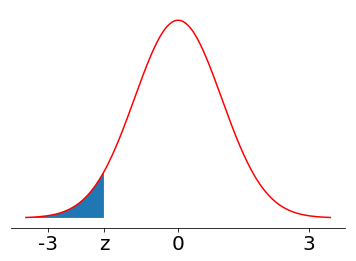
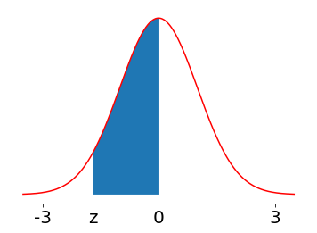

# Topic 9: Continuous Distribution Families

## 9.1 Continuous Distributions

0. Which of the following is true about a continuous random variable on $\Bbb{R}$? 
  a. Its pdf must integrate to 1 on $\Bbb{R}$ 
  b. Its cdf must integrate to 1 on $\Bbb{R}$ 
  c. None of the above 

  Ans: 

1. \(F\) is the cumulative distribution function for a continuous random variable. If \(F(b) - F(a) = 0.20\), then 
  a. \([a,b]\) has length \(0.20\) 
  b. \(P(X = b) - P(X = a) = 20\%\) 
  c. \(P(X\in(a,b])=20\%\) 
  
  Ans: 

2. Which of the following holds for all continuous probability distribution function \(f(x)\) having support set \(\mathbb{R}\)? 
  a. \(\forall x\in\mathbb{R},\quad f(x)\ge 0\) 
  b. \(\forall x\in\mathbb{R},\quad f(x)\le 1\) 
  c. \(\exists x\in\mathbb{R},\quad f(x)\le 1\) 
  d. If the limits of \(f(x)\) at positive and negative infinity exist, then \(\lim_{x\rightarrow\infty}f(x)=\lim_{x\rightarrow -\infty}f(x)=0\) 

  Ans: 

3. Power Law

  Let  X  be a random variable with pdf $f_X(x) = C x^{−\alpha}, x \ge 1$.

  a. If $\alpha = 2$, $C=$? 

  If $\alpha = 3$, 
  b. $C=$? 
  c. $E(X)=$? 

  Ans: 

## 9.2 Functions of Random Variables

0. Let X be a continuous random variable. What type of function g will make the random variable g(X) discrete? 
  a. increasing 
  b. decreasing 
  c. linear 
  d. step 

  Ans: 

1. Let $(X,Y)$ be distributed over $[0,1]×[0,1]$ according to $f(x,y)=6xy^2$. Find $P(XY^3 \le 1/2)$.

  Ans: 

2. A random variable  X  follows the distribution

  \[ f_X(x)=\begin{cases} Cx^2 & -1\le x\le 2,\\  0 & \text{otherwise},  \end{cases} \]

  and $Y=X^2$. Calculate

  a. $C$ 
  b. $P(X≥0)$ 
  c. $E[Y]$ 
  d. $Var(Y)$ 

  Ans: 
  

3. Let $X$ be distributed according to $f(x)=ce^{−2x}$ over $x>0$. Find $P(X>2)$.

  Ans: 

## 9.3 Uniform Distribution

0. Let X be a uniformly distributed continuous random variable, then which of the following is also uniform? 
  a. 2X 
  b. X+2 
  c. Both 
  d. Neither 

  Ans: 

1. The height of the probability density function of a uniformly distributed random variable is inversely proportional to the width of the interval it is distributed over. (True/False)

  Ans: 

2. The variance of a uniformly distributed random variable on  [a,b]  is 
  a. $(b−a)/2$ 
  b. $(b−a)/6$ 
  c. $(b−a)^2/6$ 
  d. $(b−a)^2/12$ 

  Ans: 
  

3. Let $X,Y \sim U_{[0,1]}$ independently. Find $P(\max(X,Y) \ge 0.8 \mid \min(X,Y)=0.5)$.

  Ans: 
  

4. Given $X \sim _{U[a,b]}$ with $E[X]=2$ and $Var(X)=3$, find $a$ and $b$.

  Ans: 

## 9.4 Exponential Distribution

0. In terms of memorylessness, the exponential distribution is analogous to which discrete random variable distribution? 
  a. Bernoulli distribution 
  b. Binomial distribution 
  c. Poisson distribution 
  d. Geometric distribution 

  Ans: 
  

1. The y-intercept of the pdf of an exponentially distribution with $\lambda = 2$ is 
  a. 0  
  b. 0.5  
  c. 1  
  d. 2  
  
  Ans: 
  

2. Assume the lifetimes of some kind of batteries follow exponential distribution with mean 1 year. 
  a. What is the probability that one such batteries can be used for more than 1.5 years? 
  b. What is the probability that one such batteries can be used for more than 1.5 years  in total  if it has already been used for 0.5 year? 

  Ans: 

3. Let $X,Y$ be two independent exponential random variables with means $1$ and $3$, respectively. Find $P(X>Y)$.

  Ans: 

4. In order to attend an important $8$ A.M. lecture, you arrive at the shuttle stop at a time distributed uniformly between $7:20$ A.M. and $7:30$ A.M. The time between consecutive shuttle arrivals is known to be exponentially distributed with mean $15$ minutes. If the journey takes $30$ minutes, what is the probability that you arrive late to the lecture?

  Ans: 

## 9.5 Gaussian Distribution

0. If you fix the mean but increase the variance of a normal distribution, its pdf will 
  a. move to the left 
  b. move to the right 
  c. become taller and narrower 
  d. become shorter and flatter 

  Ans: 

1. Let \(X\sim\mathcal{N}(\mu,\sigma^2)\) be a normal random variable, then the maximum value of its pdf is 
  a. \(1\) 
  b. \(\frac{1}{\sqrt{2\pi}}\) 
  c. \(\frac{1}{\sqrt{2\pi\sigma}}\) 
  d. \(\frac{1}{\sqrt{2\pi\sigma^2}}\) 

  Ans: 

2. Linear transformations

  The linear transformation of a normal random variable is also a normal random variable. (True/False)

  Ans: 
  

3. If $X,Y$ are two independent random variable with $X \sim N(1,16)$ and $Y \sim N(1,9)$, then find $Var(XY)$.

  Ans: 

4. Suppose $X$ is a Gaussian random variable with mean $2$ and variance $4$. Find $E\left(e^{\frac{X}{2}}\right)$.

  Ans: 

5. If $x\sim \mathcal{N}(0,1)$, find $E\left[e^{-X^2}\right]$.

  Ans: 

6. Let $$ be distributed according to the pdf $ke^{−x^2−7x}$. Find $E[X^2]$.

  Ans: 
  

7. Let $X \sim N(0,9)$ have mean 0 and variance 9. Find the expected value of $X^2(X+1)$.

  Ans: 

## 9.6 Gaussian Distribution - Probabilities

0. Why z table only cover one half of the normal curve? 
  a. The positive half is most frequently used. 
  b. The table will be too large to include the negative half. 
  c. The values of the negative half can be deduced from symmetry. 

  Ans: 
  

1. If $X$ is a normal random variable with $\mu=−2$ and $\sigma=3$, and has probability density function and cumulative density function $f_X(x)$, $F_X(x)$, calculate 
  a. $P(−3 < X < 0)$ 
  b. $F(1/4)$ 
  c. $F^{−1}(1/4)$ 

  Ans: 
  

2. Suppose $X,Y$ are independent and $X \sim N(1,4)$ and $Y \sim N(1,9)$. If $P(2X+Y \le a)$ $=P(4X−2Y \ge 4a)$, then find $a$.

  And: 
  

3. Let $X \sim B_{.36,1600}$. Approximate $P(552 \le X \le 600)$.

  Ans: 
  

4. Suppose a binary message is transmitted through a noisy channel. The transmitted signal $S$ is equally likely to be $1$ or $−1$, the noise $N$ follows a normal distribution $N(0,4)$, and the received signal is $R=S+N$. $S$ and $N$ are independent. The receiver concludes that the signal is $1$ when $R \ge 0$ and $−1$ when $R < 0$. 
  a. What is the error probability when one signal is transmitted? 
  b. What is the error probability when one signal is transmitted if we triple the amplitude of the transmitted signal, namely, $S=3$ or $−3$ with equal probability. 
  c. What is the error probability if we send the original signal (with amplitude $1$) three times, and take majority for conclusion? For example, if three received signal was concluded $1$, $−1$, $1$ by receiver, we determine the transmitted signal to be $1$. 

  Ans: 

# Topic10: Inequalities and Limit Theorems

## 10.1 Markov Inequality

0. A mob of 30 meerkats has an average height of 10”, and 10 of them are 30” tall. According to Markov's Inequality this is: 
  a. Possible 
  b. Impossible 

  Ans: 

1. Which of the following are correct versions of Markov's Inequality for a nonnegative random variable  X : 
  a. $P(X \ge \alpha \mu) \le \frac{1}{\alpha}$ 
  b. $P(X \ge \alpha \mu ) \le \mu \alpha$ 
  c. $P(X \ge \mu) \le \frac{1}{\alpha}$ 
  d. $P(X \ge \alpha) \le \frac{\mu}{\alpha}$ 

  Ans: 

2. Markov variations

  Upper bound $P(X \ge 3)$ when $X \ge 2$ and $E[X]=2.5$.

  Ans: 

3. a. In a town of 30 families, the average annual family income is `$80,000`. What is the largest number of families that can have income at least `$100,000` according to Markov’s Inequality? (Note: The annual family income can be any non-negative number.)

  b. In the same town of 30 families, the average household size is 2.5. What is the largest number of families that can have at least 4 members according to Markov’s Inequality? (Note the household size can be any positive integer.)

  Ans: 

## 10.2 Chebyshev Inequalities

0. Which of the following is correct about Chebyshev's inequality? 
  a. It only applies to non-negative distribution 
  b. It only applies to discrete distribution 
  c. It only applies to continuous distribution 
  d. None of the above 

  Ans: 

1. Apply Chebyshev's Inequality to lower bound $P(0 < X < 4)$ when $E[X]=2$ and $E[X^2]=5$.

  Ans: 

2. The average number of spelling errors on a page is  5  and the standard deviation is  2 . What is the probability of more than  20  mistakes on a page? 
  a. no greater than  1%  
  b. no greater than  2%  
  c. no greater than  5%  
  d. no greater than  10% 

  Ans: 

3. Let $X\sim \text{Exponential}(1)$. For $P(X \ge 4)$, evaluate: 
  a. Markov's inequality, 
  b. Chebyshev's inequality, 
  c. the exact value. 

  Ans: 

4. A gardener has new tomato plants sprouting up in her garden. Their expected height is 8”, with standard deviation of 1". Which of the following lower bounds the probability that a plant will be between 6" and 10" tall? 
  a. 10% 
  b. 25% 
  c. 50% 
  d. 75% 
  
  Ans: 

5. If $E[X]=15$, $P(X \le 11)=0.2$, and $P(X \ge 19)=0.3$, which of the following is _impossible_? 
  a. $Var(X) \le 7$ 
  b. $Var(X) \le 8$ 
  c. $Var(X) > 8$ 
  d. $Var(X) > 7$ 

  Ans: 

## 10.3 Law of Large Numbers

0. You have two fair coins, and you toss the pair 10,000 times (so you get 10,000 outcome pairs). Roughly how many pairs will not show any tails? 
  a. 0 
  b. 1250 
  c. 2500 
  d. 5000 

  Ans: 

1. In plain terms, the Weak Law of Large Numbers states that as the number of experiments approaches infinity, the difference between the sample mean and the distribution mean can be as small as possible. (True/False)

  Ans: 

2. Given n iid random varibles $X_1,X_2, \dots ,X_n$ with mean $\mu$, standard deviation $\alpha < \infty$ , and the sample mean $S_n = \frac{1}{n} \sum_{i=1}^n X_i$, is it true that $\lim_{n\to\infty} E[(S_n−\mu)^2]=0$? (True/False)

  Ans: 

3. The height of a person is a random variable with variance $\le 5 \text{ inches }^2$. According to Mr. Chebyshev, how many people do we need to sample to ensure that the sample mean is at most 1 inch away from the distribution mean with probability $\ge 95\%$?

  Ans: 

4. For $i=1,2,\dots ,n$, let $X_i \sim U(0,4)$, $Y_i \sim N(2,4)$, and they are independent. Calculate, 
  a. $E(X_i)$ 
  b. $V(X_i)$ 
  c. $E(Y_i)$ 
  d. $V(Y_i)$ 

  Find the limit in probability of when $n \to \infty$ 
  e. $\frac 1 n \sum_{i=1}^n (X_i+Y_i)$ 
  f. $\frac 1 n \sum_{i=1}^n (X_iY_i)$ 

  Ans: 

5. a. Flip a fair coin $n$ times and let $X_n$ be the number of heads. Is it true that $P(|X_n − \frac n 2|>1000)<0.99$? (True/False)

   b. Does the result above contradict with the WLLW? (Yes/No)

  Ans: 

## 10.4 Moment Generating Functions

0. If $M(t)$ is a moment generating function, then what is $M(0)$? 
  a. 0 
  b. 1 
  c. infinity 
  d. depends on the distribution

  Ans: 

1. If $X$ has moment generating function $M_X(t)=(1−3t)^{−1}$, what is $Var(X)$? 
  a. 6 
  b. 9 
  c. 12 

  Ans: 
  

2. Let $M_X(t)$ be the MGF of $X$. Which of the following hold for all $X$ and $Y$? 
  a. $M_{X}(0)=1$ 
  b. $M_{X}(t) \ge 0$ for all $t$ 
  c. $M_{3X+2}(t)=e^{2t}⋅M_X(3t)$ 
  d. $M_{X+Y}(t)=M_X(t)M_Y(t)$ 

  Ans: 
  

3. If $X$ is a non-negative continuous random variable with moment generating function

  \[ M_X(t)=\frac{1}{(1-2t)^2},\quad t<\frac{1}{2} \]

  a. $E[X]$ 
  b. $Var(X)$ 

  Ans: 
  

4. Let $X_1, X_2, \dots$  be independent $B_{1/2}$ random variables, and let $M \sim P_4$, namely Poisson with mean $4$. Which of the following is the MGF of $X_1+X_2+ \cdots +X_M$? 
  a. $e^{2(1+e^t)}e^{−4}$ 
  b. $e^{1+e^t}e^{−2}$ 
  c. $\frac{1+e^t}{2}$ 
  d. $\frac{1+e^2t}{2}$ 

  Ans: 
  

5. Let $X$ be a random variable with MGF $M_X(t)=\frac13 e^{−t}+\frac16+\frac12 e^{2t}$. What is $P(X \le 1)$?

  Ans: 
  

6. Let $M_X(t)$ be an MGF, which of the following are valid MGF's? 
  a. $M_X(2t)M_X(7t)$ 
  b. $e^{−5t}M_X(t)$ 
  c. $3M_X(t)$ 

  Ans: 
  

7. If $M_X(t)=e^{−5(1−e^t)}$, 
  a. find $Var(X)$. 
  b. $P(X = 3)$ 

  Ans: 
  

8. Find the MGF of $(X_1+X_2+X_3+X_4)/3$ where each $X_i$ is an independent $B_{1/2}$ random variable? 
  a. $((1+e^{t/3})/2)^4$ 
  b. $((1+e^t)/2)^4$ 
  c. $((2/3+e^t/3))^4$ 
  d. $((2/3+e^t/3/3))^4$ 

  Ans: 

## 10.5 Chernoff Bound

0. If we want to apply Chernoff bound to other distributions, the formulas are going to be different from Chernoff bound on binomial distributions. Because different distributions have the different moment generating functions. (True/False)

  Ans: 

1. You toss a fair coin $1000$ times and take a step forward if the coin lands head and a step backward if it lands tail. Upper bound the probability that you end up $\ge 100$ steps from your starting point (in either direction) using Chernoff bound (after the final simplification as in the slides).

  Ans: 

2. A coin is equally likely to be either $B_{1/3}$ or $B_{2/3}$. To figure out the bias, we toss the coin $99$ times and declare $B_{1/3}$ if the number of heads is less than $49.5$ and $B_{2/3}$ otherwise. Bound the error probability using the Chernoff bound derived in lecture video (in its final form, after simplifcation).

  Ans: 

## 10.6 Central Limit Theorem

0. Let X be a random variable with $\mu = 10$ and $\sigma = 4$. If X is sampled 100 times, what is the approximate probability that the sample mean of these 100 observations is less than 9? 
  a. 0.002 
  b. 0.004 
  c. 0.006 
  d. None of the above 

  Ans: 

1. For  i≥1 , let  Xi∼G1/2  be distributed Geometrically with parameter $1/2$.

  Define $Y_n=\frac{1}{\sqrt{n}}\sum_{i=1}^n (X_i-2)$

  Approximate $P(−1 \le Y_n \le 2)$  with large enough $n$.

  Ans: 

2. A class has 100 students. Each student's score is a random variable with mean $85$ and standard deviation $40$. Use the CLT to approximate the probability that the class average score is below $80$.

  Ans: 

3. The time between consecutive shuttle arrivals is known to be exponentially distributed with mean 10 minutes. You arrive at the shuttle stop at a uniformly-distributed time.

  a. What is the probability that you wait for less than 9 minutes?  
  
  b. Assume that you took the shuttle once a day during the past 30 days. What is the approximate probability, according to the CLT, that your average wait time was less than 9 muinutes?

  Ans: 

## 10.7 Central Limit Theorem Proof

0. Suppose that X, Y, and $(X+Y)/\sqrt{2}$ all share the same probability density function f. What could f be? 
  a. Uniform over [0,1] 
  b. Exponential with parameter 2 
  c. Normal with mean 0 
  d. Normal with mean 1 

  Ans: 

# Topic11: Statistics, Parameter Estimation and Confidence Interval
  

## 11.1 Statistics

0. Recall a statistic is a single value calculated from the sample. Which of the following is a statistic? 
  a. sample max 
  b. sample mean 
  c. sample median 
  d. all of the above 

  Ans: 

1. $225$ iPhones go on sale on black Friday, and 100 customers are in line to buy them. If the random number of iPhones that each customer wishes to buy is distributed Poisson with mean 2, approximate the probability that all 100 customers get their desired number of iPhones?

  Ans: 
  

2. The number of years a Bulldog lives is a random variable with mean 9 and standard deviation 3, while for Chihuahuas, the mean is 15 and the standard deviation is 4. Approximate the probability the that in a kennel of 100 Bulldogs and 100 Chihuahuas, the average Chihuahua lives at least 7 years longer than the average Bulldog.

  Ans: 

## 11.2 Mean and Variance Estimation

0. A distribution has mean 5 and variance 10. If we collect a sample by making 20 independent observations, what is the variance of the sample mean? 
  a. 2 
  b. 1/2 
  c. 1/4 
  d. 1/40 

  Ans: 
  

1. If an estimator is unbiased, then 
  a. its value is always the value of the parameter, 
  b. its expected value is always the value of the parameter, 
  c. it variance is the same as the variance of the parameter. 

  Ans: 
  

2. If $\{X_1, \dots, X_n\}$ are the observed values of $n$ sample items, which of the following are unbiased estimators for distribution mean? 
  a. $X_1$ 
  b. $\frac{1}{n}\sum_{i=1}^n X_i$ 
  c. $\sqrt{\frac{1}{n}\sum_{i=1}^n X_i^2}$ 

  Ans: 
  

3. As the sample size $n$ grows, the sample mean estimates the distribution mean better. Because 
  a. its bias decreases, 
  b. its variance decreases, 
  c. none of the above. 

  Ans: 

4. A sample of size $n$ has sample mean $20.20$. After adding a new observed value $21$, the sample mean increases to $20.25$. What is $n$?

  Ans: 

5. To estimate the average alcohol consumption of UCSD students, we take three random samples of 40, 45 and 50 students respectively, and their sample means turn out to be 3.15, 3.20 and 2.76 pints per week respectively. What is the sample mean of the collection of all three samples?

  Ans: 
  

6. Let $X_1,X_2, \dots,X_n$ be independent samples from a distribution with pdf $f_X(x)=\frac{1}{\theta^2}xe^{−x\theta} (X\ge 0)$. Which of the following is an unbiased estimator for $θ$? 
  a. $\overline{X}$ 
  b. $\frac{\overline{X}}{2}$ 
  c. $\frac{\overline{X}}{3}$ 
  d. $\frac{\overline{X}}{6}$ 

  Ans: 
  

7. For $i \in \{1,\dots,n\}$, let $X_i \sim U(0,W)$ independently of each other, and let $M_n = \max_{i \in \{1, \dots,n\}}X_i$. For what value of $c$ is $c \cdot M_n$ an unbiased mean estimator? 
  a. $\frac{n+1}{2n}$ 
  b. $\frac{n}{2(n−1)}$ 
  c. $\frac{2n+1}{4n}$ 
  d. $\frac{2n}{4n−1}$ 

  Ans: 

8. Let $X$ be distributed $Poisson(λ)$. Which of the following is an unbiased estimator for $λ^2$. 
  a. $X^2$ 
  b. $X^2−X$ 
  c. $2X^2−X$ 
  d. $3X^2−2X$ 

  Ans: 

## 11.3 Variance Estimation

0. As an estimator for distribution variance, the "raw" sample variance is 
  a. biased 
  b. unbiased 

  Ans: 

1. Let $\overline{X}_n$ and $S_n^2$ be the sample mean and the sample variance of $\{X_1, \dots, X_n\}$. Let $\overline{X}_{n+1}$ and $S^2_{n+1}$ be the sample mean and the sample variance of $\{X_1, \dots, X_n, \overline{X}_n\}$. Which of the following hold

  a) for sample means, 
  a. $\overline{X}_n > \overline{X}_{n+1}$ 
  b. $\overline{X}_n < \overline{X}_{n+1}$ 
  c. $\overline{X}_n = \overline{X}_{n+1}$ 

  b) for sample variances? 
  a. $S^2_n > S^2_{n+1}$ 
  b. $S^2_n < S^2_{n+1}$ 
  c. $S^2_n = S^2_{n+1}$ 

  Ans: 

2. Consider the following array of $m \times n$ random variables $X_{11}, X_{12}, \cdots, X_{1n}, \cdots,$ $X_{i1}, X_{i2}, \cdots, X_{in}, \cdots,$ $X_{m1}, X_{m2}, \cdots, X_{mn}$. For $i = 1, \cdots, m$, let $\overline{X}_i$ be the sample mean of $\{X_{i1}, X_{i2}, \cdots, X_{in}\}$, and $\overline{S}^2$ be the "raw" sample variance of $\{\overline{X}_1, \overline{X}_2, \cdots,\overline{X}_m\}$. If $\forall i, j, Var(X_{ij}) = \sigma^2$, what is $E[\overline{S}^2]$? 
  a. $\frac{n−1}{n} \sigma^2$ 
  b. $\frac{m−1}{m} \sigma^2$ 
  c. $\frac{1}{n} \sigma^2$ 
  d. $\frac{1}{m} \sigma^2$ 
  e. $\frac{n−1}{mn} \sigma^2$ 
  f. $\frac{m−1}{mn} \sigma^2$ 

  Ans: 
  

3. If all the observations in a sample increase by 5 
  a. the sample mean increases by 5, 
  b. the sample mean stays the same, 
  c. the sample variance increases by 5, 
  d. the sample variance stays the same. 

  Ans: 

## 11.4 Unbiased Variance Estimation

0. Compared to the distribution variance, the expectation of the biased "raw" sample variance is 
  a. always larger 
  b. always smaller 
  c. always equal 
  d. could be any of the above 

  Ans: 

1. As the sample size $n$ grows, the effect of the Bessel correction 
  a. becomes larger, 
  b. becomes smaller, 
  c. stays the same 

  Ans: 
  

2. According to the U.S. Department of Agriculture, ten to twenty earthworms per cubic foot is a sign of healthy soil. The soil of a garden is checked by digging 8 holes, each of one-cubic-foot, and counting the earthworms, and the following counts are found: 5, 25, 15, 10, 7, 12, 16, 20. Use the unbiased estimators discussed in the video to estimate 
  a. the true mean, 
  b. the true variance.<  br/>

  Ans: 

## 11.5 Estimating Standard Deviation

0. There is an unbiased estimator for standard deviation for general distributions. (True/False)

  Ans: 

## 11.6 Confidence Interval

0. The margin of error of confidence interval with 100% confidence level will be 
  a. Zero 
  b. One standard deviation 
  c. Infinity 
  d. None of the above 

  Ans: 

1. Which of the following will increase the length of the confidence interval? 
  a. Increase confidence level 
  b. Decrease confidence level 
  c. Increase sample size 
  d. Decrease sample size 

  Ans: 
  

2. A psychologist estimates the standard deviation of a driver's reaction time to be 0.05 seconds. How large a sample of measurements must be taken to derive a confidence interval for the mean with margin of error at most 0.01 second, and confidence level 95%?

  Ans: 
  

3. A sample of size $n=25$ with the population standard deviation $\sigma=3$, compute the margin of error of a 90% confidence interval for the mean $\mu$.

  Ans: 

## 11.7 Confidence Interval - Sigma Unknown

0. A confidence interval of mean has confidence level 95%. It means  
  a. The confidence interval includes distribution mean with probability 95% 
  b. 95% of the observations in the sample fall into this interval 
  c. If we take a new sample point, it falls into this interval 95% of the time 
  d. Non of the above 

  Ans: 
  

1. Student's t-distribution can be used to form confidence intervals only when the samples are normal distributed. (True/False)

  Ans: 

2. To find the average SAT verbal score in a class, six students are sampled and their scores are 560, 610, 500, 470, 660, and 640. Assuming that students' SAT verbal scores follow normal distribution, what is the upper limit for the confidence interval of the distribution mean with confidence level 90%?

  Ans: 

3. a. What is the critical $t$ for a 92% confidence interval with a sample size 10? 
   b. What is the critical $t$ for a 92% confidence interval with a sample size 1000? 
   c. What is the critical $z$ for a 92% confidence interval? 

  Ans: 

# Topic 12: Regression and PCA

## 12.1 Review of Linear Algebra

0. Which is NOT true of an orthonormal basis?	 
  a. All of the vectors in the set are orthogonal to each other. The norm of each vector is 1. 
  b. The standard basis in $\Bbb{R}^3$, $e_1=(1,0,0), e_2=(0,1,0), e_3=(0,0,1)$, is orthonormal. 
  c. A vector in the set cannot be a scalar multiple of another vector in the set. 
  d. An orthonormal basis can contain infinitely many vectors for any vector space. 

  Ans: 

1. What is the length of $\vec{u}$ such that $\vec{u} = \frac{\vec{v}}{\parallel \vec{v}\parallel}$, $\vec{v} =(2,3,7)$? 
  a. 1  
  b. 3.61  
  c. 7.84  
  d. 62 

  Ans: 

2. If every vector in an orthonormal basis is orthogonal to each other, this implies that there can be one and only one vector for each dimension of the vector space in this set. (True/False)

  Ans: 

3. An inner product, such as the dot product, always uses two vectors as operands and produces a scalar number as the result.

  Ans: 

4. If vectors $\vec{a}$ and $\vec{b}$ are orthogonal, then what is the value of $\vec{a} \cdot \vec{b}$? 
  a. 0  
  b. 1  
  c. 2  
  d. 90 

  Ans: 

## 12.2 Matrix Notation and Operations

0. Select the correct statement about matrices from the following: 
  a. A matrix cannot be divided by a scalar, and a scalar cannot be divided by a matrix 
  b. A matrix can be divided by a scalar, but a scalar cannot be divided by a matrix 
  c. A matrix cannot be divided by a scalar, but a scalar can be divided by a matrix 
  d. A matrix can be divided by a scalar, and a scalar can be divided by a matrix 

  Ans: 

1. A $m \times n$ matrix can be added with a $n \times m$ matrix, but they cannot be multiplied. (Assume $m \ne n$) (True/False)

  Ans: 

2. Let $\vec{a} =(1,0,0)$, $\vec{b} =(0,1,0)$, and $\vec{c} =(0,0,1)$. This is the standard basis that spans $\Bbb{R}^3$. Answer the following questions about this set of vectors:

  a) $\vec{a} +\vec{b} =?$ 
    a. (1,1) 
    b. (0,0,1) 
    c. (1,1,1) 
    d. (1,1,0) 

  b) $\vec{a} \cdot \vec{b} =?$ 
    a. (0,0,0) 
    b. 0 
    c. (1,1,0) 
    d. 2 

  c) $(\vec{a} \cdot \vec{b} )\vec{c}$ =? 
    a. (0,0,0) 
    b. 0 
    c. 1 
    d. (0,0,1) 

  d) $−\vec{c} =?$ 
    a. (0,0,1) 
    b. (0,0,−1) 
    c. (1,0,0) 
    d. Vectors cannot be negative 

  e) $\parallel \vec{a} \parallel = \sqrt{\vec{a} \cdot \vec{a}}$ 
    a. True 
    b. False 
    c. This notation is meaningless 

  f) $\parallel \vec{a} \parallel +\parallel \vec{b} \parallel = ?$ 
    a. \parallel \vec{c} \parallel   
    b. 1  
    c. 2  
    d. (1,1,0)  

  Ans: 

3. Given a matrix, $A = \begin{bmatrix} 4 \ 1 \\ 1 \ 9 \end{bmatrix}$, find $(4A)^{-1}$. 
  a. $(4A)^{-1} = \begin{bmatrix} 1 \ \, {- \frac{1}{9}} \\ \!\!\!\! \, {- \frac{1}{9}} \ \hspace{.3cm} \frac{4}{9} \end{bmatrix}$ 
  b. $(4A)^{-1} = \begin{bmatrix} \frac{9}{140} \ \ {\,-\frac{1}{140}} \\ \!\!\!\!\!\!\! \,- \frac{1}{140} \ \hspace{.4cm} \frac{1}{35} \end{bmatrix}$ 
  c. $(4A)^{-1} = \begin{bmatrix} \frac{1}{16} \ \hspace{.5cm} \! \frac{1}{4} \\  \frac{1}{4} \ \hspace{.4cm} \frac{1}{36} \end{bmatrix}$ 
  d. $(4A)^{-1} = \begin{bmatrix} \frac{1}{36} \ \hspace{.1cm} {-\frac{1}{4}} \\ \!\!\!\!  \, {-\frac{1}{4}} \ \hspace{.4cm} \frac{1}{16} \end{bmatrix}$ 

  Ans: 

4. Given the matrix $A$ below, answer the following questions:

  \[ A = \begin{bmatrix} a_{11} \ a_{12} \\ a_{21} \ a_{22} \end{bmatrix} \]

  a) $4A+4A=$? 
    a. $4A$ 
    b. $8A$ 
    c. $16A$ 
    d. Cannot add two matrices of the same dimension 

  b) $A-2 = \begin{bmatrix} {a_{11}\!-2} \ {a_{12}\!-2} \\ {a_{21}\!-2} \ {a_{22}\!-2} \end{bmatrix}$ (True/False)
  
  c) $A^{−1}= \frac{1}{A}$ (True/False)
  
  d) $(A^\top)I=$? 
    a. $A$  
    b. $A^\top$  
    c. $1$  
    d. $A^{−1}$  

  e) $(A^\top)^\top=A$ (True/False)

  Ans: 

5. Recall, from linear algebra, that the determinate of a matrix, $A = \begin{bmatrix} a_{11} \ a_{12} \\ a_{21} \ a_{22} \end{bmatrix}$, is equal to $(a_{11}a_{22}-a_{12}a_{21})$. If this determinant is equal to $0$, what does that indicate about the matrix, $A$? 
  a. The difference of the norms of the column vectors is $0$ 
  b. The matrix $A$ has no transpose 
  c. The matrix $A$ has no inverse 
  d. This is an identity matrix 

  Ans: 
  

6. If $A = \begin{bmatrix} a_{11} \ a_{12} \\ a_{21} \ a_{22} \end{bmatrix}$ and $B = \begin{bmatrix} b_{11} \ b_{12} \\ b_{21} \ b_{22} \end{bmatrix}$, then $BA=$? 
  a. $C$ 
  b. $C^{−1}$ 
  c. $C^\top$ 
  d. None of the above 

  Ans: 

7. Only square matrices have inverses. (True/False)

  Ans: 

## 12.3 Solving a System of Linear Equations

0. In the matrix equation, ${\bf A\vec{w}=\vec{b}$,what does the matrix, A, contain? 
  a. The x-values of two points 
  b. The slope and y-intercept of the line connecting two points 
  c. The y-values of two points 
  d. The slope of the line connecting two points 

  Ans: 

## 12.4 Linear Regression

0. If your data set contains 10 colinear points, meaning they are all points on the same line, should you use a linear regression to find that line? (yes/no)

  Ans: 

1. When a system has more dimensions than points, it is called an “overdetermined system”. (True/False)

  Ans: 

2. The purpose of linear regression is to find a line that most closely matches a set of data with multiple data points. (True/ False)

  Ans: 

3. Given points $p_1=(2,3)$ and $p_2=(3,0)$, and the equation $A_{\vec{w}} = \vec{b}$ answer the following:

  a) Find the coefficient matrix, $A$. 
    a. $A = \begin{bmatrix} 1 \ 1 \\ 2 \ 3 \end{bmatrix}$ 
    b. $A = \begin{bmatrix} 1 \ 2 \\ 1 \ 3 \end{bmatrix}$ 
    c. $A = \begin{bmatrix} 1 \ 3 \\ 1 \ 2 \end{bmatrix}$ 
    d. $A = \begin{bmatrix} 1 \ 3 \\ 2 \ 1 \end{bmatrix}$ 

  b) Find the dependent variable vector, $\vec{b}$. 
    a. $\vec{b} = \begin{bmatrix} 9 \\ {-3} \end{bmatrix}$ 
    b. $\vec{b} = \begin{bmatrix} 3 \\ { 0} \end{bmatrix}$ 
    c. $\vec{b} = \begin{bmatrix} 9 \\ {-1} \end{bmatrix}$ 
    d. $\vec{b} = \begin{bmatrix} 6 \\ { 2} \end{bmatrix}$ 

  c) Solve for the parameter vector, $\vec{w}$. 
    a. $\vec{w} = \begin{bmatrix} 9 \\ -3 \end{bmatrix}$ 
    b. $\vec{w} = \begin{bmatrix} 1 \\ 1 \end{bmatrix}$ 
    c. $\vec{w} = \begin{bmatrix} 3 \\ 0 \end{bmatrix}$ 
    d. $\vec{w} = \begin{bmatrix} -3 \\ 1 \end{bmatrix}$ 

  d) Give the equation for the line connecting $p_1$ and $p_2$. 
    a. $y = 3x + 9$ 
    b. $y = x - 3$ 
    c. $y = -3x+3$ 
    d. $y = -3x+9$ 

  Ans: 

4. The parameter vector, $\vec{w} \in \Bbb{R}^2$, represents the slope and Y-intercept of a line in the 2-D plane. (True/False)

  Ans: 

  
5. Why do we want to minimize the square difference from a point to the line instead of the actual difference when using the least squares method? 
  a. It’s more accurate to minimize the larger value 
  b. We could minimize the actual difference as well 
  c. We want to ensure the value is positive because it is a distance 
  d. We want to ensure that far away points are weighted more heavily than nearby points 

  Ans: 

## 12.5 Polynomial Regression

## 12.6 Regression Towards the Mean

## 12.7 Principle Component Analysis

# Topic13: Hypothesis Testing

## 13.1 Hypothesis Test - Introduction

0. If we fail to reject the null hypothesis, does it mean that the null hypothesis is correct? 
  a. Yes, it must be correct. 
  b. No, we just don't have enough evidence to reject it. 

  Ans: 

1. The distribution of the test statistic T depends on 
  a. Null hypothesis $H_0$, 
  b. Alternative hypothesis $H_A$, 
  c. Observed data t, 
  d. None of above. 

  Ans: 

2. The null hypothesis says that  Z  follows normal distribution $N(0,\sigma^2)$. If the null hypothesis is correct, which of the following is the most unlikely event? 
  a. $Z \in [−\sigma, \sigma]$ 
  b. $Z \notin [−2\sigma,2\sigma]$ 
  c. $Z \ge \sigma$ 

  Ans: 

## 13.2 Hypothesis Testing - p-Values

0. If the statistic T is observed to be t, the p-value is 
  a. The probability that T=t 
  b. The probability under the null hypothesis that T=t 
  c. The probability under the null hypothesis that T=t or is further towards the alternative hypothesis 
  d. None of the above 

  Ans: 

1. One- and two-sided tests

  We know the male students' height is approximately normal, and has standard deviation 4 inches. In a sample of 10 male students, the mean height is 68 inches. Calculate the p value corresponding to the following null hypotheses.

  a) $H_0$: The average height of male students in this college is 70 inches. 
     $H_1$: The average height of male students in this college is not 70 inches.

  b) $H_0$: The average height of male students in this college is at least 70 inches. 
     $H_1$: The average height of male students in this college less than 70 inches.

  Ans: 
  

2. The null hypothesis says that 20% of college students are left-handed, while the alternative hypothesis says that less than 20% of college students are left-handed. If we took a sample of 20 college students and let $X$ be the number of lefties in the sample. Calculate the p values if

  a) $X=1$

  b) $X=2$
  
  Ans: 
  

3. The null hypothesis states that a random variable follows the standard normal distribution, while the alternative hypothesis states that the random variable has negative mean. Which of the following shaded areas represents the  p  value when the observed outcome is  z ?

  

    
  

  Ans: 

4. In the following problem we discuss the test comparing two distribution means with the same variance. Assume $X \sim \mathcal{N}(\mu_1, \sigma^2)$, $Y \sim \mathcal{N}(\mu_2, \sigma^2)$, and they are independent.

  a) What is the variance of $X−Y$? 
    a. $\sigma^2$ 
    b. $2\sigma^2$ 
    c. $\sigma^2/2$ 
 
  b) If $\overline{X}$ is the sample mean of $n$ independent random observations of $X$ and  $\overline{Y}$ is the sample mean of $n$ independent random observations of $Y$, what distribution does $\overline{X}-\overline{Y}$ follow? 
    a. $\mathcal{N}(\mu_1-\mu_2,\frac{\sigma^2}{n})$ 
    b. $\mathcal{N}(\mu_1-\mu_2,\frac{\sigma^2}{2n})$ 
    c. $\mathcal{N}(\mu_1-\mu_2,\frac{2\sigma^2}{n})$ 
  
  c) we now want to test the null hypothesis $H_0$

    + $H_0$: In college, the average GPA of men is equal to the average GPA of women. 
    + $H_1$: In college, the average GPA of men is different from the average GPA of women. 

    A sample of 10 men's GPA in college has sample mean 2.9, and a sample of 10 women's GPA has sample mean 3.1. We also know the GPAs of men and women have the same standard deviation 0.2. Calculate the p value.

  Ans: 

## 13.3 Lady Tasting Tea

0. If instead of preparing 4 cups milk-first ,and 4 tea-first, each cup is prepared randomly, with equal probability of milk- and tea-first. Which of the following most closely approximates the p value of correctly guessing all 8 milk/tea orders? 
  a. 0.014 
  b. 0.010 
  c. 0.004 
  d. 0.001 

  Ans: 

1. Continuing the poll question, what is the smallest number of milk-tea cups the lady must guess correctly to reject the null hypothesis with significance level $\alpha=5\%$.

  Ans: 

2. For a real $−1 \le \alpha \le 1$, define $f_\alpha(x)=2\alpha x+1− \alpha$.

  It is easy to see that $f_\alpha$ is non-negative and integrates to 1, namely is a distribution, over $[0,1]$.

  a) Consider the null hypothesis that $\alpha=0$, namely $f_\alpha$ is uniform, and the alternative hypothesis that $\alpha > 0$. Given a single sample, 0.8, from $f_\alpha$, find the  $p$-value.

  b) Find the lowest outcome for rejecting the null hypothesis with 5% significance level.
  
  Ans: 

3. An old scale displays a weight that is uniformly distributed between the real weight  ±10  lbs. For example for a person with weight 100 lbs, the scale will show a weight uniformly distributed between 90 and 110.

  Consider the null hypothesis that a person weighs 100 lbs, and the alternative hypothesis that the weight is lower.

  a) What is the $p$-value (in percentage) of 91?
  
  b) What is the $p$-value (in percentage) of 90?

  c) What is the highest weight in lbs for which we can reject the null hypothesis with significance level 10%?
  

  Ans: 

## 13.4 Hypothesis Testing - Z and T Tests

0. We first calculate the p-value of a sample under a t-test. We then receive additional information about the distribution variance and calculate the p-value again under a z-test. Which of the following do you think will happen? 
  a. The p value will increase. 
  b. The p value will decrease. 
  c. It could be both. 

  Ans: 

1. This is the T-test version of Q5 in section 13.2.

  We now want to test the null hypothesis $H_0$

  + $H_0$: In college, the average GPA of men is equal to the average GPA of women.
  + $H_1$: In college, the average GPA of men is different from the average GPA of women.

  A sample of 10 men's GPA in college has sample mean 2.9, and a sample of 10 women's GPA has sample mean 3.1. We also know the GPAs of men and women have the same  estimated standard deviation  0.2. Calculate the p value.
  
  Ans: 

2. The null hypothesis says that a sprinter's reaction time follows a normal distribution with mean at most 0.150 seconds. Six measurements of a sprinter's reaction time show 0.152, 0.154, 0.166, 0.147, 0.161, and 0.159 seconds. What is the p value?

  Ans: 

